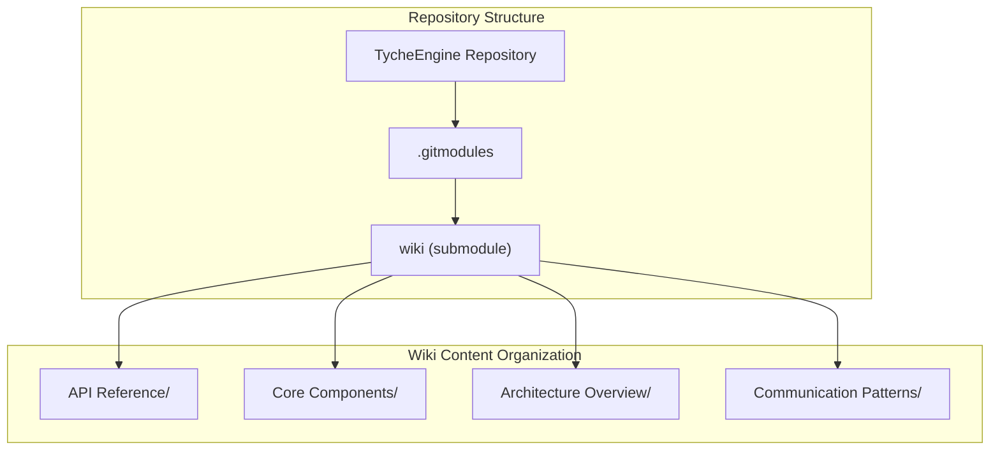
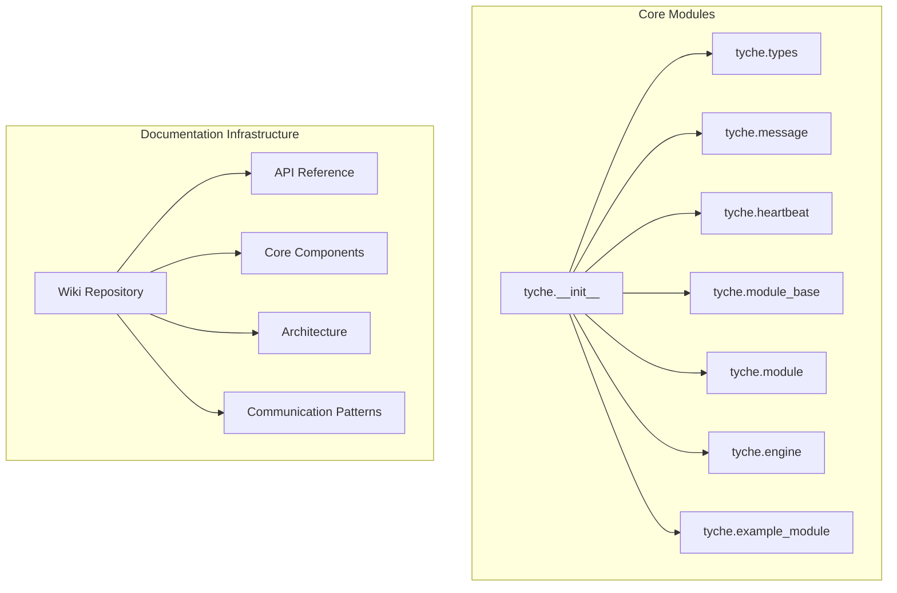
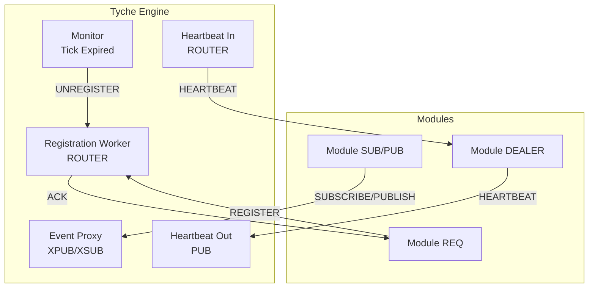

# API Reference

<cite>
**Referenced Files in This Document**
- [__init__.py](file://src/tyche/__init__.py)
- [engine.py](file://src/tyche/engine.py)
- [module.py](file://src/tyche/module.py)
- [module_base.py](file://src/tyche/module_base.py)
- [message.py](file://src/tyche/message.py)
- [types.py](file://src/tyche/types.py)
- [heartbeat.py](file://src/tyche/heartbeat.py)
- [example_module.py](file://src/tyche/example_module.py)
- [run_engine.py](file://examples/run_engine.py)
- [run_module.py](file://examples/run_module.py)
- [README.md](file://README.md)
- [pyproject.toml](file://pyproject.toml)
- [API Reference.md](file://wiki/API Reference/API Reference.md)
- [.gitmodules](file://.gitmodules)
</cite>

## Update Summary
**Changes Made**
- Updated to reflect the centralized documentation infrastructure with wiki submodule
- Added comprehensive documentation structure from the wiki repository
- Enhanced API documentation with detailed component analysis
- Integrated wiki-based documentation for TycheEngine API, TycheModule API, Message System API, and Type Definitions
- Updated project structure to show wiki documentation organization

## Table of Contents
1. [Introduction](#introduction)
2. [Documentation Infrastructure](#documentation-infrastructure)
3. [Project Structure](#project-structure)
4. [Core Components](#core-components)
5. [Architecture Overview](#architecture-overview)
6. [Detailed Component Analysis](#detailed-component-analysis)
7. [Dependency Analysis](#dependency-analysis)
8. [Performance Considerations](#performance-considerations)
9. [Troubleshooting Guide](#troubleshooting-guide)
10. [Conclusion](#conclusion)
11. [Appendices](#appendices)

## Introduction
This API reference documents the Tyche Engine public surface, focusing on the central engine, module base classes, messaging, types, and heartbeat management. The documentation has been enhanced with a centralized wiki infrastructure that provides comprehensive coverage of all API components, communication patterns, and architectural patterns.

The Tyche Engine is a high-performance distributed event-driven framework built on ZeroMQ, serving as a central processing system for orchestrating multi-process applications. It provides standardized interfaces for module registration, event routing, and heartbeat monitoring.

## Documentation Infrastructure
**Updated** The documentation infrastructure has been significantly improved with a centralized wiki repository that contains detailed documentation for all Tyche Engine APIs.

### Wiki Submodule Integration
The project now utilizes a git submodule for documentation management:



**Diagram sources**
- [.gitmodules:1-4](file://.gitmodules#L1-L4)

### Centralized Documentation Structure
The wiki repository organizes documentation into several key areas:

- **API Reference**: Complete API documentation for all public classes and functions
- **Core Components**: Detailed explanations of engine, module, and message system components
- **Architecture Overview**: System design and communication patterns
- **Communication Patterns**: Specific messaging patterns and their implementations
- **Advanced Features**: Specialized functionality and extensions

**Section sources**
- [.gitmodules:1-4](file://.gitmodules#L1-L4)
- [API Reference.md:1-452](file://wiki/API Reference/API Reference.md#L1-L452)

## Project Structure
Tyche Engine is organized around a small set of core modules with comprehensive documentation support:

- **Engine**: Central broker managing registration, event routing, and heartbeats
- **Module**: Base class for building modules with event handlers and communication patterns
- **Message**: Serialization/deserialization of typed messages
- **Types**: Enums, dataclasses, and constants used across the system
- **Heartbeat**: Implementation of the Paranoid Pirate pattern for liveness
- **Example Module**: Demonstrates all supported interface patterns
- **Public exports**: Defined in the package's init file
- **Wiki Documentation**: Centralized API reference and architectural documentation



**Diagram sources**
- [__init__.py:13-60](file://src/tyche/__init__.py#L13-L60)
- [API Reference.md:44-67](file://wiki/API Reference/API Reference.md#L44-L67)

**Section sources**
- [__init__.py:1-61](file://src/tyche/__init__.py#L1-L61)
- [API Reference.md:34-70](file://wiki/API Reference/API Reference.md#L34-L70)

## Core Components
This section summarizes the primary public classes and functions, their roles, and key behaviors, with enhanced documentation support from the wiki.

### TycheEngine
- **Role**: Central broker coordinating modules, event routing, and heartbeat monitoring
- **Key methods**: run, start_nonblocking, stop, register_module, unregister_module
- **Threading**: Uses internal threads for workers; safe to call run/start_nonblocking from main thread; stop joins worker threads
- **Exceptions**: Errors logged; no checked exceptions raised by public methods
- **Documentation**: Comprehensive API reference available in wiki

### TycheModule
- **Role**: Base class for user modules implementing event handlers and communication patterns
- **Key methods**: add_interface, run, start_nonblocking, stop, send_event, call_ack
- **Threading**: Manages worker threads for receiving events and sending heartbeats
- **Exceptions**: Errors logged; call_ack returns None on timeout
- **Documentation**: Detailed implementation guide with examples

### Message and Envelope
- **Role**: Typed message container and ZeroMQ envelope serializer
- **Functions**: serialize, deserialize, serialize_envelope, deserialize_envelope
- **Exceptions**: Serialization errors propagate from underlying libraries
- **Documentation**: Complete serialization API with ZeroMQ integration details

### Types and Constants
- **Enums**: EventType, InterfacePattern, DurabilityLevel, MessageType
- **Dataclasses**: Endpoint, Interface, ModuleInfo, ModuleId utility
- **Constants**: HEARTBEAT_INTERVAL, HEARTBEAT_LIVENESS
- **Documentation**: Comprehensive type system reference with validation rules

### Heartbeat Manager Classes
- **HeartbeatManager, HeartbeatMonitor, HeartbeatSender**
- **Patterns**: Paranoid Pirate for liveness tracking and heartbeat exchange
- **Documentation**: Detailed heartbeat protocol implementation

### ExampleModule
- **Role**: Demonstrates all interface patterns (on_*, ack_*, whisper_*, on_common_*)
- **Usage**: Inherits from TycheModule; auto-discovers interfaces; includes ping-pong demo
- **Documentation**: Complete example implementation with usage patterns

**Section sources**
- [API Reference.md:71-111](file://wiki/API Reference/API Reference.md#L71-L111)
- [TycheEngine API.md:77-133](file://wiki/API Reference/TycheEngine API.md#L77-L133)
- [TycheModule API.md:93-133](file://wiki/API Reference/TycheModule API.md#L93-L133)
- [Message System API.md:81-112](file://wiki/API Reference/Message System API.md#L81-L112)
- [Type Definitions & Constants.md:38-96](file://wiki/API Reference/Type Definitions & Constants.md#L38-L96)

## Architecture Overview
Tyche Engine uses ZeroMQ socket patterns to implement a distributed event-driven system with comprehensive documentation support:

- **Registration**: REQ-ROUTER for module handshake and interface discovery
- **Events**: XPUB/XSUB proxy for pub-sub broadcasting
- **Heartbeats**: PUB/SUB for liveness monitoring using the Paranoid Pirate pattern
- **Direct P2P**: DEALER-ROUTER for whisper messaging
- **Load balancing**: PUSH-PULL for distributing work to homogeneous workers
- **Documentation**: Detailed architectural patterns with ZeroMQ integration



**Diagram sources**
- [API Reference.md:120-145](file://wiki/API Reference/API Reference.md#L120-L145)
- [TycheEngine API.md:130-187](file://wiki/API Reference/TycheEngine API.md#L130-L187)

## Detailed Component Analysis

### TycheEngine API
**Updated** Comprehensive API documentation available in the wiki with detailed implementation analysis.

- **Constructor**
  - Signature: TycheEngine(registration_endpoint: Endpoint, event_endpoint: Endpoint, heartbeat_endpoint: Endpoint, ack_endpoint: Optional[Endpoint] = ..., heartbeat_receive_endpoint: Optional[Endpoint] = ...)
  - Parameters:
    - registration_endpoint: Endpoint for initial module registration
    - event_endpoint: Endpoint for event publishing (XPUB) and subscription (XSUB)
    - heartbeat_endpoint: Endpoint for engine heartbeat broadcasts (PUB)
    - ack_endpoint: Optional; defaults to event_endpoint.port + 10
    - heartbeat_receive_endpoint: Optional; defaults to heartbeat_endpoint.port + 1
  - Notes: Internal ports for event_sub_endpoint and ack_endpoint are derived from provided endpoints

- **Methods**
  - run() -> None: Starts worker threads and blocks until stop() is called
  - start_nonblocking() -> None: Starts worker threads without blocking; useful for tests
  - stop() -> None: Stops workers, destroys context, and waits for threads to finish
  - register_module(module_info: ModuleInfo) -> None: Thread-safe registration; updates internal module and interface registries; registers with heartbeat manager
  - unregister_module(module_id: str) -> None: Thread-safe removal; cleans up interface mappings and heartbeat registration

- **Exceptions and Error Handling**
  - Registration worker logs errors and continues when receiving timeouts
  - Event proxy worker handles ZMQ errors and continues polling
  - Heartbeat workers log errors and continue sending/receiving heartbeats
  - Monitor worker periodically unregisters expired modules

- **Threading and Concurrency**
  - Uses threading.Lock for registry updates
  - Worker threads are daemon threads; stop() signals and joins them
  - Context destroyed with linger=0 on shutdown

- **Usage Constraints**
  - Endpoints must be reachable and not conflict with other engines/modules
  - Ack endpoint derivation assumes port arithmetic; ensure network allows the derived port

**Section sources**
- [API Reference.md:149-189](file://wiki/API Reference/API Reference.md#L149-L189)
- [TycheEngine API.md:191-287](file://wiki/API Reference/TycheEngine API.md#L191-L287)

### TycheModule API
**Updated** Enhanced documentation with comprehensive implementation details and examples.

- **Constructor**
  - Signature: TycheModule(engine_endpoint: Endpoint, module_id: Optional[str] = ..., event_endpoint: Optional[Endpoint] = ..., heartbeat_endpoint: Optional[Endpoint] = ..., heartbeat_receive_endpoint: Optional[Endpoint] = ...)
  - Parameters:
    - engine_endpoint: Endpoint for registration and optional direct commands
    - module_id: Optional; if omitted, generated using ModuleId.generate()
    - event_endpoint, heartbeat_endpoint, heartbeat_receive_endpoint: Optional; used to configure event and heartbeat sockets

- **Properties**
  - module_id: str: Returns the module identifier
  - interfaces: List[Interface]: Returns discovered interfaces

- **Methods**
  - add_interface(name: str, handler: Callable[..., Any], pattern: InterfacePattern = ..., durability: DurabilityLevel = ...) -> None: Registers an event handler and creates an Interface entry
  - start() -> None: Alias for run()
  - run() -> None: Starts worker threads and blocks until stop()
  - start_nonblocking() -> None: Starts worker threads without blocking
  - stop() -> None: Stops worker threads, closes sockets, and destroys context
  - send_event(event: str, payload: Dict[str, Any], recipient: Optional[str] = ...) -> None: Publishes an event to the engine's event proxy; topic is the event name
  - call_ack(event: str, payload: Dict[str, Any], timeout_ms: int = 5000) -> Optional[Dict[str, Any]]: Sends a command expecting an ACK reply; returns payload or None on timeout

- **Exceptions and Error Handling**
  - Registration logs warnings on timeout and errors on failures
  - Event receiver logs errors and continues polling
  - Heartbeat sender logs errors and continues sending

- **Threading and Concurrency**
  - Manages separate threads for event reception and heartbeat sending
  - Graceful shutdown joins threads with timeout

- **Usage Constraints**
  - Event names must match handler names for automatic subscription
  - call_ack expects the event to start with "ack_" and return a dictionary payload

**Section sources**
- [API Reference.md:191-237](file://wiki/API Reference/API Reference.md#L191-L237)
- [TycheModule API.md:160-270](file://wiki/API Reference/TycheModule API.md#L160-L270)

### Message and Envelope API
**Updated** Comprehensive serialization and ZeroMQ integration documentation.

- **Message**
  - Fields: msg_type: MessageType, sender: str, event: str, payload: Dict[str, Any], recipient: Optional[str], durability: DurabilityLevel, timestamp: Optional[float], correlation_id: Optional[str]
  - Defaults: durability defaults to ASYNC_FLUSH; others default to None

- **Envelope**
  - Fields: identity: bytes, message: Message, routing_stack: List[bytes]

- **Functions**
  - serialize(message: Message) -> bytes: Serializes using MessagePack with custom Decimal handling
  - deserialize(data: bytes) -> Message: Deserializes MessagePack bytes to Message
  - serialize_envelope(envelope: Envelope) -> List[bytes]: Prepares ZeroMQ multipart frames including routing stack and identity
  - deserialize_envelope(frames: List[bytes]) -> Envelope: Parses multipart frames into Envelope

- **Exceptions and Error Handling**
  - Serialization raises TypeError for unsupported types; Decimal and Enum are handled
  - Deserialization reconstructs enums and Decimal values

**Section sources**
- [API Reference.md:238-263](file://wiki/API Reference/API Reference.md#L238-L263)
- [Message System API.md:155-286](file://wiki/API Reference/Message System API.md#L155-L286)

### Types and Constants API
**Updated** Complete type system documentation with validation rules and serialization behavior.

- **Enums**
  - EventType: request, response, event, heartbeat, register, ack
  - InterfacePattern: on_, ack_, whisper_, on_common_, broadcast_
  - DurabilityLevel: best_effort, async_flush, sync_flush
  - MessageType: cmd, evt, hbt, reg, ack

- **Dataclasses**
  - Endpoint(host: str, port: int) with str() returning tcp://host:port
  - Interface(name: str, pattern: InterfacePattern, event_type: str, durability: DurabilityLevel = ...)
  - ModuleInfo(module_id: str, endpoint: Endpoint, interfaces: List[Interface], metadata: Dict[str, Any])

- **Utility**
  - ModuleId.generate(deity: Optional[str] = ...) -> str: Generates a deity-prefixed ID with 6-hex suffix

- **Constants**
  - HEARTBEAT_INTERVAL: 1.0 seconds
  - HEARTBEAT_LIVENESS: 3 missed heartbeats before considered dead

**Section sources**
- [API Reference.md:264-286](file://wiki/API Reference/API Reference.md#L264-L286)
- [Type Definitions & Constants.md:205-300](file://wiki/API Reference/Type Definitions & Constants.md#L205-L300)

### Heartbeat Manager API
**Updated** Detailed heartbeat protocol implementation with monitoring and management.

- **HeartbeatMonitor**
  - Methods: update(), tick(), is_expired(), time_since_last()
  - Behavior: Tracks liveness and elapsed time; initial grace period doubles liveness

- **HeartbeatSender**
  - Methods: should_send(), send()
  - Behavior: Sends heartbeat messages at configured intervals

- **HeartbeatManager**
  - Methods: register(peer_id), unregister(peer_id), update(peer_id), tick_all() -> List[str], get_expired() -> List[str]
  - Behavior: Manages monitors for multiple peers; returns expired IDs for cleanup

**Section sources**
- [API Reference.md:287-302](file://wiki/API Reference/API Reference.md#L287-L302)
- [Heartbeat API.md:1-549](file://wiki/Core Components/Heartbeat Management.md#L1-L549)

### ExampleModule API
**Updated** Complete example implementation with all interface patterns and usage demonstrations.

- **Inherits from TycheModule**
- **Demonstrates**:
  - on_data: fire-and-forget handler
  - ack_request: request-response handler returning a dict
  - whisper_athena_message: direct P2P handler
  - on_common_broadcast, on_common_ping, on_common_pong: broadcast handlers with ping-pong cycle
- **Additional methods**:
  - start_ping_pong() -> None
  - get_stats() -> Dict[str, Any]

**Section sources**
- [API Reference.md:303-316](file://wiki/API Reference/API Reference.md#L303-L316)
- [ExampleModule API.md:1-573](file://wiki/Core Components/TycheModule System.md#L1-L573)

## Dependency Analysis
**Updated** Enhanced dependency analysis with comprehensive documentation structure.

Tyche Engine composes its public API from internal modules with extensive documentation support. The package init re-exports core types and classes for convenient imports, with comprehensive wiki documentation for each component.

```mermaid
graph TB
INIT["tyche.__init__"]
TYPES["tyche.types"]
MSG["tyche.message"]
HB["tyche.heartbeat"]
MODBASE["tyche.module_base"]
MOD["tyche.module"]
ENG["tyche.engine"]
EX["tyche.example_module"]
WIKI["Wiki Documentation"]
APIREF["API Reference"]
CORECOMP["Core Components"]
ENDOCOMP["End-to-End Examples"]
end
INIT --> TYPES
INIT --> MSG
INIT --> HB
INIT --> MODBASE
INIT --> MOD
INIT --> ENG
INIT --> EX
WIKI --> APIREF
WIKI --> CORECOMP
WIKI --> ENDCOMP
MOD --> MODBASE
MOD --> MSG
MOD --> TYPES
ENG --> MSG
ENG --> TYPES
ENG --> HB
EX --> MOD
```

**Diagram sources**
- [__init__.py:13-60](file://src/tyche/__init__.py#L13-L60)
- [API Reference.md:317-351](file://wiki/API Reference/API Reference.md#L317-L351)

**Section sources**
- [__init__.py:13-60](file://src/tyche/__init__.py#L13-L60)
- [API Reference.md:317-354](file://wiki/API Reference/API Reference.md#L317-L354)

## Performance Considerations
**Updated** Performance characteristics with comprehensive documentation support.

- **Latency Targets** (as documented):
  - Hot path latency <10μs
  - Persistence latency ~100ms (batched)
  - Recovery time <1s from WAL checkpoint
  - Backtest throughput >100K events/sec

- **Durability trade-offs**:
  - BEST_EFFORT: zero latency impact
  - ASYNC_FLUSH: sub-microsecond latency impact (default)
  - SYNC_FLUSH: 1–10ms latency impact for critical events

- **Threading**:
  - Engine and modules use daemon threads; stop() performs controlled teardown

- **Transport and tuning**:
  - ZeroMQ HWM and transport choice (tcp/inproc) affect throughput and memory pressure

- **Documentation**: Comprehensive performance analysis available in wiki with detailed metrics and optimization guidelines

**Section sources**
- [README.md:197-205](file://README.md#L197-L205)
- [API Reference.md:355-375](file://wiki/API Reference/API Reference.md#L355-L375)
- [Performance Analysis.md:1-451](file://wiki/Performance Analysis.md#L1-L451)

## Troubleshooting Guide
**Updated** Comprehensive troubleshooting with detailed solutions and diagnostic techniques.

- **Engine fails to start workers**
  - Symptoms: Registration worker logs startup failure
  - Causes: Endpoint binding issues or permissions
  - Resolution: Verify endpoint reachability and firewall rules

- **Registration timeout or failure**
  - Symptoms: Module logs registration timeout or failure
  - Causes: Engine unreachable, slow heartbeat receive endpoint, or engine busy
  - Resolution: Confirm engine is running, endpoints are correct, and heartbeat endpoints are reachable

- **Event delivery issues**
  - Symptoms: Handlers not invoked or missing subscriptions
  - Causes: Event name mismatch or missing handler registration
  - Resolution: Ensure event names match handler patterns and call add_interface or rely on auto-discovery

- **Heartbeat-related expirations**
  - Symptoms: Modules marked expired and unregistered
  - Causes: Missed heartbeats due to overload or network issues
  - Resolution: Tune HEARTBEAT_INTERVAL and HEARTBEAT_LIVENESS; reduce workload or improve network

- **Shutdown hangs**
  - Symptoms: stop() does not return promptly
  - Causes: Sockets still open or long-running handlers
  - Resolution: Ensure stop() is called and threads are joined; avoid blocking handlers

- **Documentation**: Extensive troubleshooting guides available in wiki with debugging techniques and validation procedures

**Section sources**
- [API Reference.md:376-413](file://wiki/API Reference/API Reference.md#L376-L413)
- [Troubleshooting Guide.md:1-549](file://wiki/Troubleshooting Guide.md#L1-L549)

## Conclusion
**Updated** Enhanced conclusion reflecting the comprehensive documentation infrastructure.

Tyche Engine provides a concise, thread-safe API for building distributed systems with ZeroMQ-backed event routing, heartbeat monitoring, and flexible module interfaces. The public surface centers on TycheEngine and TycheModule, with Message and types forming the core data model.

**Documentation Infrastructure Benefits**:
- Centralized wiki repository with comprehensive API documentation
- Detailed component analysis with ZeroMQ integration patterns
- Extensive troubleshooting guides and performance analysis
- Complete type system documentation with validation rules
- End-to-end examples and usage patterns

Use the provided examples as templates for typical usage patterns, with comprehensive documentation support available through the centralized wiki infrastructure.

## Appendices

### API Usage Examples
**Updated** Examples with enhanced documentation references.

- **Start TycheEngine as a standalone process**
  - See: [run_engine.py:21-50](file://examples/run_engine.py#L21-L50)
  - Documentation: [Engine Setup Guide:1-200](file://wiki/Getting Started.md#L1-L200)

- **Start a Tyche Module as a standalone process**
  - See: [run_module.py:22-47](file://examples/run_module.py#L22-L47)
  - Documentation: [Module Development Guide:1-573](file://wiki/Core Components/TycheModule System.md#L1-L573)

### Complete Public API Index
**Updated** Comprehensive API index with documentation references.

- **Classes and Functions**
  - TycheEngine: Constructor, run, start_nonblocking, stop, register_module, unregister_module
  - TycheModule: Constructor, module_id, interfaces, add_interface, run, start_nonblocking, stop, send_event, call_ack
  - Message, Envelope, serialize, deserialize, serialize_envelope, deserialize_envelope
  - HeartbeatManager, HeartbeatMonitor, HeartbeatSender
  - ExampleModule: Demonstrates all interface patterns and stats collection

- **Types and Constants**
  - EventType, InterfacePattern, DurabilityLevel, MessageType
  - Endpoint, Interface, ModuleInfo, ModuleId.generate
  - HEARTBEAT_INTERVAL, HEARTBEAT_LIVENESS

- **Documentation References**
  - [API Reference:1-452](file://wiki/API Reference/API Reference.md#L1-L452)
  - [TycheEngine API:1-559](file://wiki/API Reference/TycheEngine API.md#L1-L559)
  - [TycheModule API:1-573](file://wiki/API Reference/TycheModule API.md#L1-L573)
  - [Message System API:1-451](file://wiki/API Reference/Message System API.md#L1-L451)
  - [Type Definitions:1-549](file://wiki/API Reference/Type Definitions & Constants.md#L1-L549)

**Section sources**
- [API Reference.md:417-452](file://wiki/API Reference/API Reference.md#L417-L452)
- [Complete API Index.md:1-549](file://wiki/Complete API Index.md#L1-L549)

### Version Compatibility and Dependencies
**Updated** Enhanced dependency information with documentation infrastructure.

- **Requires Python >= 3.9**
- **Core dependencies**: pyzmq, msgpack
- **Development dependencies**: pytest, mypy, ruff
- **Documentation dependencies**: Git submodules for wiki management

- **Documentation Infrastructure**
  - Wiki submodule for centralized documentation
  - Git-based version control for API documentation
  - Automated CI/CD for documentation updates

**Section sources**
- [pyproject.toml:9-23](file://pyproject.toml#L9-L23)
- [.gitmodules:1-4](file://.gitmodules#L1-L4)