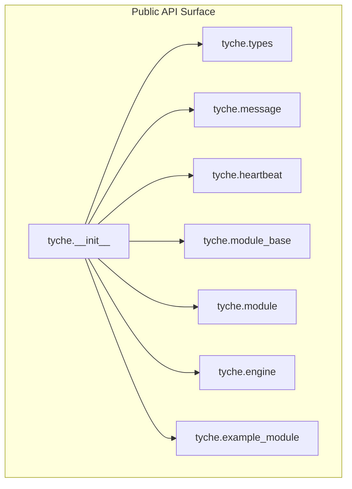
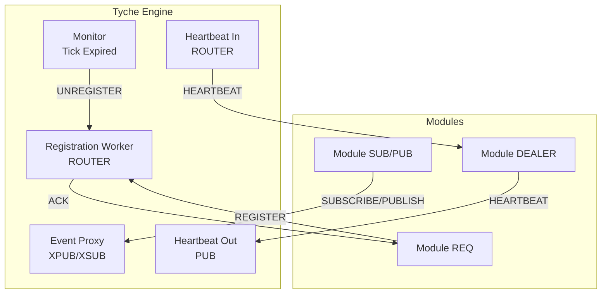
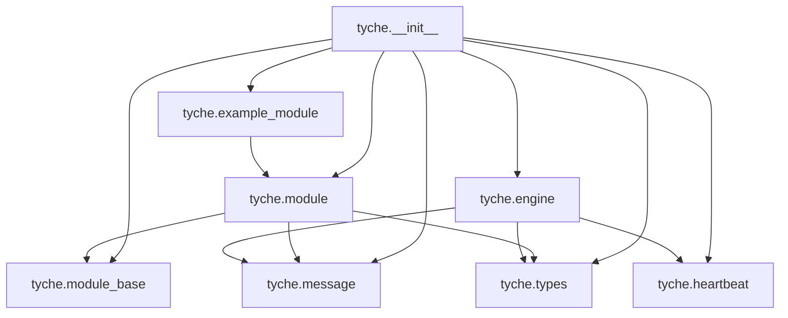

# API Reference

**Referenced Files in This Document**
- [__init__.py](file://src/tyche/__init__.py)
- [engine.py](file://src/tyche/engine.py)
- [module.py](file://src/tyche/module.py)
- [module_base.py](file://src/tyche/module_base.py)
- [message.py](file://src/tyche/message.py)
- [types.py](file://src/tyche/types.py)
- [heartbeat.py](file://src/tyche/heartbeat.py)
- [example_module.py](file://src/tyche/example_module.py)
- [run_engine.py](file://examples/run_engine.py)
- [run_module.py](file://examples/run_module.py)
- [README.md](file://README.md)
- [pyproject.toml](file://pyproject.toml)

## Table of Contents
1. [Introduction](#introduction)
2. [Project Structure](#project-structure)
3. [Core Components](#core-components)
4. [Architecture Overview](#architecture-overview)
5. [Detailed Component Analysis](#detailed-component-analysis)
6. [Dependency Analysis](#dependency-analysis)
7. [Performance Considerations](#performance-considerations)
8. [Troubleshooting Guide](#troubleshooting-guide)
9. [Conclusion](#conclusion)
10. [Appendices](#appendices)

## Introduction
This API reference documents the Tyche Engine public surface, focusing on the central engine, module base classes, messaging, types, and heartbeat management. It provides signatures, parameters, return values, exceptions, thread-safety notes, and usage guidance derived from the source code. Examples are linked to runnable scripts under the examples directory.

## Project Structure
Tyche Engine is organized around a small set of core modules:
- Engine: Central broker managing registration, event routing, and heartbeats.
- Module: Base class for building modules with event handlers and communication patterns.
- Message: Serialization/deserialization of typed messages.
- Types: Enums, dataclasses, and constants used across the system.
- Heartbeat: Implementation of the Paranoid Pirate pattern for liveness.
- Example Module: Demonstrates all supported interface patterns.
- Public exports: Defined in the package’s init file.

**Diagram sources**
- [__init__.py:13-60](file://src/tyche/__init__.py#L13-L60)

**Section sources**
- [__init__.py:1-61](file://src/tyche/__init__.py#L1-L61)

## Core Components
This section summarizes the primary public classes and functions, their roles, and key behaviors.

- TycheEngine
  - Role: Central broker coordinating modules, event routing, and heartbeat monitoring.
  - Key methods: run, start_nonblocking, stop, register_module, unregister_module.
  - Threading: Uses internal threads for workers; safe to call run/start_nonblocking from main thread; stop joins worker threads.
  - Exceptions: Errors logged; no checked exceptions raised by public methods.

- TycheModule
  - Role: Base class for user modules implementing event handlers and communication patterns.
  - Key methods: add_interface, run, start_nonblocking, stop, send_event, call_ack.
  - Threading: Manages worker threads for receiving events and sending heartbeats.
  - Exceptions: Errors logged; call_ack returns None on timeout.

- Message and Envelope
  - Role: Typed message container and ZeroMQ envelope serializer.
  - Functions: serialize, deserialize, serialize_envelope, deserialize_envelope.
  - Exceptions: Serialization errors propagate from underlying libraries.

- Types and Constants
  - Enums: EventType, InterfacePattern, DurabilityLevel, MessageType.
  - Dataclasses: Endpoint, Interface, ModuleInfo, ModuleId utility.
  - Constants: HEARTBEAT_INTERVAL, HEARTBEAT_LIVENESS.

- Heartbeat Manager Classes
  - HeartbeatManager, HeartbeatMonitor, HeartbeatSender.
  - Patterns: Paranoid Pirate for liveness tracking and heartbeat exchange.

- ExampleModule
  - Role: Demonstrates all interface patterns (on_*, ack_*, whisper_*, on_common_*).
  - Usage: Inherits from TycheModule; auto-discovers interfaces; includes ping-pong demo.

**Section sources**
- [engine.py:25-350](file://src/tyche/engine.py#L25-L350)
- [module.py:28-401](file://src/tyche/module.py#L28-L401)
- [message.py:13-168](file://src/tyche/message.py#L13-L168)
- [types.py:14-102](file://src/tyche/types.py#L14-L102)
- [heartbeat.py:16-142](file://src/tyche/heartbeat.py#L16-L142)
- [example_module.py:19-167](file://src/tyche/example_module.py#L19-L167)

## Architecture Overview
Tyche Engine uses ZeroMQ socket patterns to implement a distributed event-driven system:
- Registration: REQ-ROUTER for module handshake and interface discovery.
- Events: XPUB/XSUB proxy for pub-sub broadcasting.
- Heartbeats: PUB/SUB for liveness monitoring using the Paranoid Pirate pattern.
- Direct P2P: DEALER-ROUTER for whisper messaging.
- Load balancing: PUSH-PULL for distributing work to homogeneous workers.

**Diagram sources**
- [engine.py:119-349](file://src/tyche/engine.py#L119-L349)
- [module.py:200-399](file://src/tyche/module.py#L200-L399)
- [heartbeat.py:91-142](file://src/tyche/heartbeat.py#L91-L142)

## Detailed Component Analysis

### TycheEngine API
- Constructor
  - Signature: TycheEngine(registration_endpoint: Endpoint, event_endpoint: Endpoint, heartbeat_endpoint: Endpoint, ack_endpoint: Optional[Endpoint] = ..., heartbeat_receive_endpoint: Optional[Endpoint] = ...)
  - Parameters:
    - registration_endpoint: Endpoint for initial module registration.
    - event_endpoint: Endpoint for event publishing (XPUB) and subscription (XSUB).
    - heartbeat_endpoint: Endpoint for engine heartbeat broadcasts (PUB).
    - ack_endpoint: Optional; defaults to event_endpoint.port + 10.
    - heartbeat_receive_endpoint: Optional; defaults to heartbeat_endpoint.port + 1.
  - Notes: Internal ports for event_sub_endpoint and ack_endpoint are derived from provided endpoints.

- Methods
  - run() -> None
    - Starts worker threads and blocks until stop() is called.
  - start_nonblocking() -> None
    - Starts worker threads without blocking; useful for tests.
  - stop() -> None
    - Stops workers, destroys context, and waits for threads to finish.
  - register_module(module_info: ModuleInfo) -> None
    - Thread-safe registration; updates internal module and interface registries; registers with heartbeat manager.
  - unregister_module(module_id: str) -> None
    - Thread-safe removal; cleans up interface mappings and heartbeat registration.

- Exceptions and Error Handling
  - Registration worker logs errors and continues when receiving timeouts.
  - Event proxy worker handles ZMQ errors and continues polling.
  - Heartbeat workers log errors and continue sending/receiving heartbeats.
  - Monitor worker periodically unregisters expired modules.

- Threading and Concurrency
  - Uses threading.Lock for registry updates.
  - Worker threads are daemon threads; stop() signals and joins them.
  - Context destroyed with linger=0 on shutdown.

- Usage Constraints
  - Endpoints must be reachable and not conflict with other engines/modules.
  - Ack endpoint derivation assumes port arithmetic; ensure network allows the derived port.

**Section sources**
- [engine.py:34-118](file://src/tyche/engine.py#L34-L118)
- [engine.py:119-349](file://src/tyche/engine.py#L119-L349)

### TycheModule API
- Constructor
  - Signature: TycheModule(engine_endpoint: Endpoint, module_id: Optional[str] = ..., event_endpoint: Optional[Endpoint] = ..., heartbeat_endpoint: Optional[Endpoint] = ..., heartbeat_receive_endpoint: Optional[Endpoint] = ...)
  - Parameters:
    - engine_endpoint: Endpoint for registration and optional direct commands.
    - module_id: Optional; if omitted, generated using ModuleId.generate().
    - event_endpoint, heartbeat_endpoint, heartbeat_receive_endpoint: Optional; used to configure event and heartbeat sockets.

- Properties
  - module_id: str
    - Returns the module identifier.
  - interfaces: List[Interface]
    - Returns discovered interfaces.

- Methods
  - add_interface(name: str, handler: Callable[..., Any], pattern: InterfacePattern = ..., durability: DurabilityLevel = ...) -> None
    - Registers an event handler and creates an Interface entry.
  - start() -> None
    - Alias for run().
  - run() -> None
    - Starts worker threads and blocks until stop().
  - start_nonblocking() -> None
    - Starts worker threads without blocking.
  - stop() -> None
    - Stops worker threads, closes sockets, and destroys context.
  - send_event(event: str, payload: Dict[str, Any], recipient: Optional[str] = ...) -> None
    - Publishes an event to the engine’s event proxy; topic is the event name.
  - call_ack(event: str, payload: Dict[str, Any], timeout_ms: int = 5000) -> Optional[Dict[str, Any]]
    - Sends a command expecting an ACK reply; returns payload or None on timeout.

- Exceptions and Error Handling
  - Registration logs warnings on timeout and errors on failures.
  - Event receiver logs errors and continues polling.
  - Heartbeat sender logs errors and continues sending.

- Threading and Concurrency
  - Manages separate threads for event reception and heartbeat sending.
  - Graceful shutdown joins threads with timeout.

- Usage Constraints
  - Event names must match handler names for automatic subscription.
  - call_ack expects the event to start with "ack_" and return a dictionary payload.

**Section sources**
- [module.py:41-197](file://src/tyche/module.py#L41-L197)
- [module.py:199-399](file://src/tyche/module.py#L199-L399)

### Message and Envelope API
- Message
  - Fields: msg_type: MessageType, sender: str, event: str, payload: Dict[str, Any], recipient: Optional[str], durability: DurabilityLevel, timestamp: Optional[float], correlation_id: Optional[str].
  - Defaults: durability defaults to ASYNC_FLUSH; others default to None.

- Envelope
  - Fields: identity: bytes, message: Message, routing_stack: List[bytes].

- Functions
  - serialize(message: Message) -> bytes
    - Serializes using MessagePack with custom Decimal handling.
  - deserialize(data: bytes) -> Message
    - Deserializes MessagePack bytes to Message.
  - serialize_envelope(envelope: Envelope) -> List[bytes]
    - Prepares ZeroMQ multipart frames including routing stack and identity.
  - deserialize_envelope(frames: List[bytes]) -> Envelope
    - Parses multipart frames into Envelope.

- Exceptions and Error Handling
  - Serialization raises TypeError for unsupported types; Decimal and Enum are handled.
  - Deserialization reconstructs enums and Decimal values.

**Section sources**
- [message.py:13-112](file://src/tyche/message.py#L13-L112)
- [message.py:114-168](file://src/tyche/message.py#L114-L168)

### Types and Constants API
- Enums
  - EventType: request, response, event, heartbeat, register, ack.
  - InterfacePattern: on_, ack_, whisper_, on_common_, broadcast_.
  - DurabilityLevel: best_effort, async_flush, sync_flush.
  - MessageType: cmd, evt, hbt, reg, ack.

- Dataclasses
  - Endpoint(host: str, port: int) with str() returning tcp://host:port.
  - Interface(name: str, pattern: InterfacePattern, event_type: str, durability: DurabilityLevel = ...).
  - ModuleInfo(module_id: str, endpoint: Endpoint, interfaces: List[Interface], metadata: Dict[str, Any]).

- Utility
  - ModuleId.generate(deity: Optional[str] = ...) -> str
    - Generates a deity-prefixed ID with 6-hex suffix.

- Constants
  - HEARTBEAT_INTERVAL: 1.0 seconds.
  - HEARTBEAT_LIVENESS: 3 missed heartbeats before considered dead.

**Section sources**
- [types.py:14-102](file://src/tyche/types.py#L14-L102)

### Heartbeat Manager API
- HeartbeatMonitor
  - Methods: update(), tick(), is_expired(), time_since_last().
  - Behavior: Tracks liveness and elapsed time; initial grace period doubles liveness.

- HeartbeatSender
  - Methods: should_send(), send().
  - Behavior: Sends heartbeat messages at configured intervals.

- HeartbeatManager
  - Methods: register(peer_id), unregister(peer_id), update(peer_id), tick_all() -> List[str], get_expired() -> List[str].
  - Behavior: Manages monitors for multiple peers; returns expired IDs for cleanup.

**Section sources**
- [heartbeat.py:16-142](file://src/tyche/heartbeat.py#L16-L142)

### ExampleModule API
- Inherits from TycheModule.
- Demonstrates:
  - on_data: fire-and-forget handler.
  - ack_request: request-response handler returning a dict.
  - whisper_athena_message: direct P2P handler.
  - on_common_broadcast, on_common_ping, on_common_pong: broadcast handlers with ping-pong cycle.
- Additional methods:
  - start_ping_pong() -> None
  - get_stats() -> Dict[str, Any]

**Section sources**
- [example_module.py:19-167](file://src/tyche/example_module.py#L19-L167)

## Dependency Analysis
Tyche Engine composes its public API from internal modules. The package init re-exports core types and classes for convenient imports.

**Diagram sources**
- [__init__.py:13-60](file://src/tyche/__init__.py#L13-L60)
- [module.py:14-23](file://src/tyche/module.py#L14-L23)
- [engine.py:10-20](file://src/tyche/engine.py#L10-L20)
- [example_module.py:15-16](file://src/tyche/example_module.py#L15-L16)

**Section sources**
- [__init__.py:13-60](file://src/tyche/__init__.py#L13-L60)

## Performance Considerations
- Latency Targets (as documented):
  - Hot path latency <10μs.
  - Persistence latency ~100ms (batched).
  - Recovery time <1s from WAL checkpoint.
  - Backtest throughput >100K events/sec.
- Durability trade-offs:
  - BEST_EFFORT: zero latency impact.
  - ASYNC_FLUSH: sub-microsecond latency impact (default).
  - SYNC_FLUSH: 1–10ms latency impact for critical events.
- Threading:
  - Engine and modules use daemon threads; stop() performs controlled teardown.
- Transport and tuning:
  - ZeroMQ HWM and transport choice (tcp/inproc) affect throughput and memory pressure.

**Section sources**
- [README.md:197-205](file://README.md#L197-L205)
- [README.md:133-142](file://README.md#L133-L142)
- [engine.py:67-118](file://src/tyche/engine.py#L67-L118)
- [module.py:116-197](file://src/tyche/module.py#L116-L197)

## Troubleshooting Guide
- Engine fails to start workers
  - Symptoms: Registration worker logs startup failure.
  - Causes: Endpoint binding issues or permissions.
  - Resolution: Verify endpoint reachability and firewall rules.
  - Section sources
    - [engine.py:139-142](file://src/tyche/engine.py#L139-L142)

- Registration timeout or failure
  - Symptoms: Module logs registration timeout or failure.
  - Causes: Engine unreachable, slow heartbeat receive endpoint, or engine busy.
  - Resolution: Confirm engine is running, endpoints are correct, and heartbeat endpoints are reachable.
  - Section sources
    - [module.py:247-254](file://src/tyche/module.py#L247-L254)

- Event delivery issues
  - Symptoms: Handlers not invoked or missing subscriptions.
  - Causes: Event name mismatch or missing handler registration.
  - Resolution: Ensure event names match handler patterns and call add_interface or rely on auto-discovery.
  - Section sources
    - [module.py:258-298](file://src/tyche/module.py#L258-L298)

- Heartbeat-related expirations
  - Symptoms: Modules marked expired and unregistered.
  - Causes: Missed heartbeats due to overload or network issues.
  - Resolution: Tune HEARTBEAT_INTERVAL and HEARTBEAT_LIVENESS; reduce workload or improve network.
  - Section sources
    - [heartbeat.py:125-133](file://src/tyche/heartbeat.py#L125-L133)
    - [engine.py:341-349](file://src/tyche/engine.py#L341-L349)

- Shutdown hangs
  - Symptoms: stop() does not return promptly.
  - Causes: Sockets still open or long-running handlers.
  - Resolution: Ensure stop() is called and threads are joined; avoid blocking handlers.
  - Section sources
    - [engine.py:106-117](file://src/tyche/engine.py#L106-L117)
    - [module.py:179-196](file://src/tyche/module.py#L179-L196)

## Conclusion
Tyche Engine provides a concise, thread-safe API for building distributed systems with ZeroMQ-backed event routing, heartbeat monitoring, and flexible module interfaces. The public surface centers on TycheEngine and TycheModule, with Message and types forming the core data model. Use the provided examples as templates for typical usage patterns.

## Appendices

### API Usage Examples
- Start TycheEngine as a standalone process
  - See: [run_engine.py:21-50](file://examples/run_engine.py#L21-L50)
- Start a Tyche Module as a standalone process
  - See: [run_module.py:22-47](file://examples/run_module.py#L22-L47)

### Complete Public API Index
- Classes and Functions
  - TycheEngine: Constructor, run, start_nonblocking, stop, register_module, unregister_module
  - TycheModule: Constructor, module_id, interfaces, add_interface, run, start_nonblocking, stop, send_event, call_ack
  - Message, Envelope, serialize, deserialize, serialize_envelope, deserialize_envelope
  - HeartbeatManager, HeartbeatMonitor, HeartbeatSender
  - ExampleModule: Demonstrates all interface patterns and stats collection
- Types and Constants
  - EventType, InterfacePattern, DurabilityLevel, MessageType
  - Endpoint, Interface, ModuleInfo, ModuleId.generate
  - HEARTBEAT_INTERVAL, HEARTBEAT_LIVENESS

**Section sources**
- [__init__.py:32-60](file://src/tyche/__init__.py#L32-L60)
- [engine.py:25-350](file://src/tyche/engine.py#L25-L350)
- [module.py:28-401](file://src/tyche/module.py#L28-L401)
- [message.py:13-168](file://src/tyche/message.py#L13-L168)
- [types.py:14-102](file://src/tyche/types.py#L14-L102)
- [heartbeat.py:16-142](file://src/tyche/heartbeat.py#L16-L142)
- [example_module.py:19-167](file://src/tyche/example_module.py#L19-L167)

### Version Compatibility and Dependencies
- Requires Python >= 3.9
- Core dependencies: pyzmq, msgpack
- Development dependencies: pytest, mypy, ruff

**Section sources**
- [pyproject.toml:9-23](file://pyproject.toml#L9-L23)