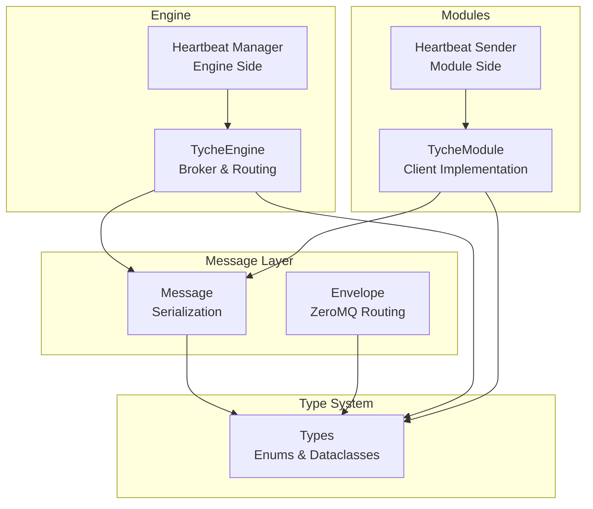
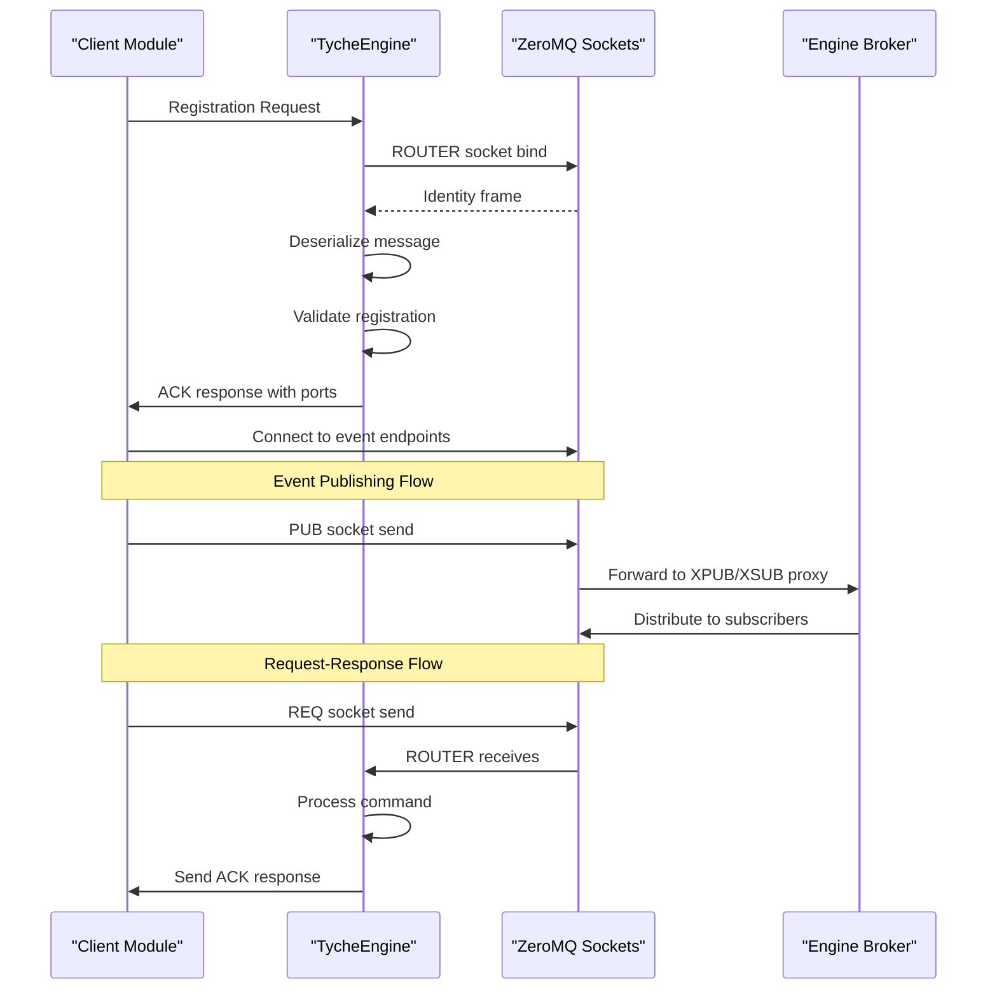
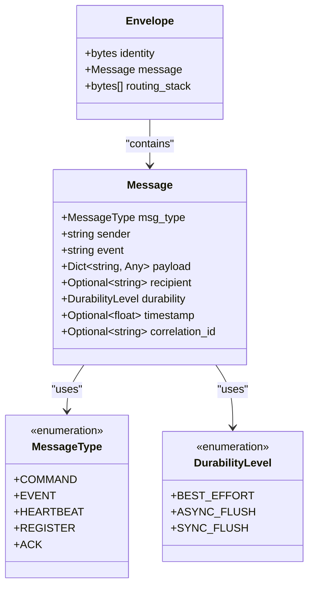
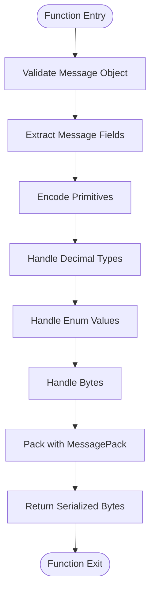
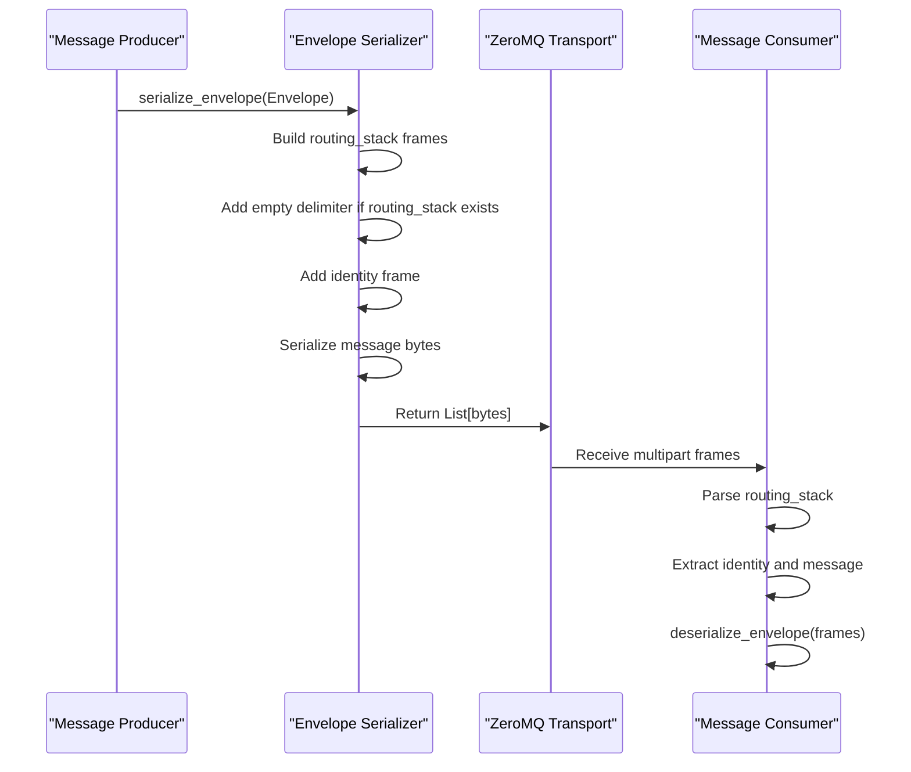
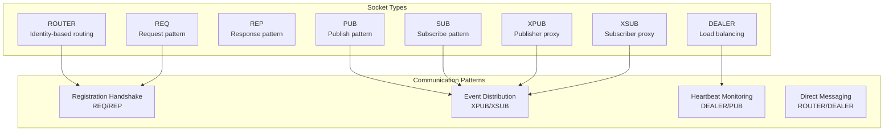
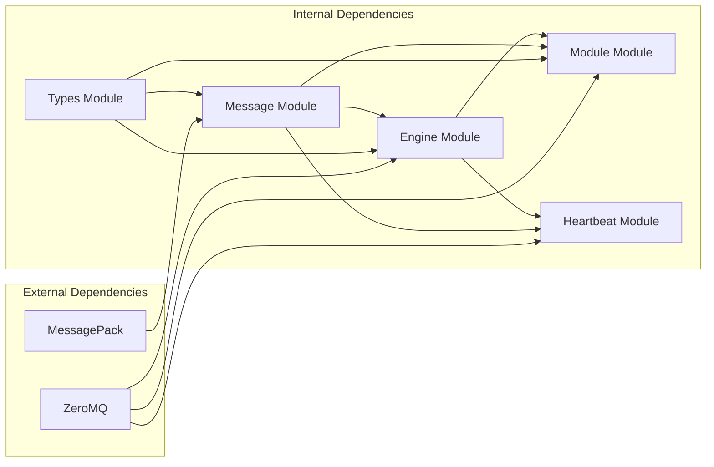

# Message System API

**Referenced Files in This Document**
- [message.py](file://src/tyche/message.py)
- [types.py](file://src/tyche/types.py)
- [engine.py](file://src/tyche/engine.py)
- [module.py](file://src/tyche/module.py)
- [heartbeat.py](file://src/tyche/heartbeat.py)
- [test_message.py](file://tests/unit/test_message.py)
- [run_engine.py](file://examples/run_engine.py)
- [run_module.py](file://examples/run_module.py)
- [example_module.py](file://src/tyche/example_module.py)

## Table of Contents
1. [Introduction](#introduction)
2. [Project Structure](#project-structure)
3. [Core Components](#core-components)
4. [Architecture Overview](#architecture-overview)
5. [Detailed Component Analysis](#detailed-component-analysis)
6. [Dependency Analysis](#dependency-analysis)
7. [Performance Considerations](#performance-considerations)
8. [Troubleshooting Guide](#troubleshooting-guide)
9. [Conclusion](#conclusion)

## Introduction
This document provides comprehensive API documentation for the Tyche Engine message system. It covers the Message class, serialization functions, envelope handling, and ZeroMQ integration patterns. The documentation focuses on type safety, error handling, and performance considerations for message processing across the distributed system.

## Project Structure
The message system spans several core modules:
- Message serialization and envelope handling in the message module
- Type definitions for message types, durability levels, and interfaces in the types module
- Engine-side message routing and ZeroMQ integration in the engine module
- Module-side message publishing and receiving in the module module
- Heartbeat monitoring and message handling in the heartbeat module
- Unit tests validating serialization and envelope behavior
- Example applications demonstrating engine and module usage

**Diagram sources**
- [message.py:13-168](file://src/tyche/message.py#L13-L168)
- [types.py:14-102](file://src/tyche/types.py#L14-L102)
- [engine.py:25-350](file://src/tyche/engine.py#L25-L350)
- [module.py:28-401](file://src/tyche/module.py#L28-L401)
- [heartbeat.py:16-142](file://src/tyche/heartbeat.py#L16-L142)

**Section sources**
- [message.py:1-168](file://src/tyche/message.py#L1-L168)
- [types.py:1-102](file://src/tyche/types.py#L1-L102)
- [engine.py:1-350](file://src/tyche/engine.py#L1-L350)
- [module.py:1-401](file://src/tyche/module.py#L1-L401)
- [heartbeat.py:1-142](file://src/tyche/heartbeat.py#L1-L142)

## Core Components
The message system consists of three primary components:

### Message Class
The Message dataclass defines the core message structure with typed attributes:
- msg_type: MessageType enumeration (COMMAND, EVENT, HEARTBEAT, REGISTER, ACK)
- sender: String module identifier
- event: String event name/interface
- payload: Dictionary containing arbitrary message data
- recipient: Optional target module identifier
- durability: DurabilityLevel enumeration (BEST_EFFORT, ASYNC_FLUSH, SYNC_FLUSH)
- timestamp: Optional creation timestamp
- correlation_id: Optional correlation identifier for request/response flows

### Serialization Functions
The system provides two primary serialization functions:
- serialize(Message) -> bytes: Converts Message objects to MessagePack-encoded bytes
- deserialize(bytes) -> Message: Restores Message objects from serialized data
- serialize_envelope(Envelope) -> List[bytes]: Creates ZeroMQ multipart frames
- deserialize_envelope(List[bytes]) -> Envelope: Parses ZeroMQ frames back to envelopes

### Envelope System
The Envelope wrapper handles ZeroMQ routing information:
- identity: Client identity frame from ROUTER socket
- message: The actual Message object
- routing_stack: List of routing identity frames for reply path

**Section sources**
- [message.py:13-49](file://src/tyche/message.py#L13-L49)
- [message.py:69-112](file://src/tyche/message.py#L69-L112)
- [message.py:114-167](file://src/tyche/message.py#L114-L167)

## Architecture Overview
The message system integrates with ZeroMQ for distributed communication:

**Diagram sources**
- [engine.py:121-177](file://src/tyche/engine.py#L121-L177)
- [module.py:200-254](file://src/tyche/module.py#L200-L254)
- [module.py:301-330](file://src/tyche/module.py#L301-L330)

The architecture follows these patterns:
- Registration via ROUTER socket with identity frames
- Event distribution through XPUB/XSUB proxy
- Heartbeat monitoring using Paranoid Pirate pattern
- Request-response flows using REQ/REP sockets

**Section sources**
- [engine.py:25-118](file://src/tyche/engine.py#L25-L118)
- [module.py:28-76](file://src/tyche/module.py#L28-L76)

## Detailed Component Analysis

### Message Class API
The Message class provides a strongly-typed interface for all message operations:

**Diagram sources**
- [message.py:13-49](file://src/tyche/message.py#L13-L49)
- [types.py:67-74](file://src/tyche/types.py#L67-L74)
- [types.py:60-65](file://src/tyche/types.py#L60-L65)

Key constructor parameters and their types:
- msg_type: MessageType (required)
- sender: str (required)
- event: str (required)
- payload: Dict[str, Any] (required)
- recipient: Optional[str] = None (optional)
- durability: DurabilityLevel = DurabilityLevel.ASYNC_FLUSH (optional)
- timestamp: Optional[float] = None (optional)
- correlation_id: Optional[str] = None (optional)

Message payload structure supports arbitrary data through the Dict[str, Any] type, enabling flexible message content while maintaining type safety for the core fields.

**Section sources**
- [message.py:13-35](file://src/tyche/message.py#L13-L35)

### Serialization API
The serialization system provides robust encoding/decoding capabilities:

**Diagram sources**
- [message.py:69-88](file://src/tyche/message.py#L69-L88)
- [message.py:51-66](file://src/tyche/message.py#L51-L66)

Serialization function signatures:
- serialize(message: Message) -> bytes: Serializes Message to MessagePack bytes
- deserialize(data: bytes) -> Message: Deserializes bytes to Message object

The system includes custom encoders/decoders for:
- Decimal types: Preserves precision through string representation
- Enum types: Encodes enum values as their underlying values
- Bytes types: Handles UTF-8 decoding for transport

**Section sources**
- [message.py:69-112](file://src/tyche/message.py#L69-L112)
- [message.py:51-66](file://src/tyche/message.py#L51-L66)

### Envelope Handling API
Envelope handling manages ZeroMQ routing information:

**Diagram sources**
- [message.py:114-137](file://src/tyche/message.py#L114-L137)
- [message.py:140-167](file://src/tyche/message.py#L140-L167)

Envelope serialization function signatures:
- serialize_envelope(envelope: Envelope) -> List[bytes]: Creates ZeroMQ multipart frames
- deserialize_envelope(frames: List[bytes]) -> Envelope: Parses multipart frames to envelope

Routing information handling:
- routing_stack: Maintains reply path through intermediate brokers
- identity: Client identity frame for direct routing
- Empty delimiter: Separates routing_stack from identity and message frames

**Section sources**
- [message.py:37-49](file://src/tyche/message.py#L37-L49)
- [message.py:114-167](file://src/tyche/message.py#L114-L167)

### ZeroMQ Integration Patterns
The system implements several ZeroMQ socket patterns:

**Diagram sources**
- [engine.py:121-177](file://src/tyche/engine.py#L121-L177)
- [engine.py:238-278](file://src/tyche/engine.py#L238-L278)
- [module.py:200-254](file://src/tyche/module.py#L200-L254)
- [module.py:376-401](file://src/tyche/module.py#L376-L401)

Cross-module communication patterns:
- Registration: One-time REQ/REP handshake for module discovery
- Event distribution: Publish/subscribe through engine proxy
- Request-response: Direct command processing with ACK replies
- Heartbeat monitoring: Periodic liveness detection

**Section sources**
- [engine.py:121-177](file://src/tyche/engine.py#L121-L177)
- [module.py:200-254](file://src/tyche/module.py#L200-L254)

## Dependency Analysis
The message system exhibits clean separation of concerns with minimal coupling:

**Diagram sources**
- [message.py:8](file://src/tyche/message.py#L8)
- [engine.py:8](file://src/tyche/engine.py#L8)
- [module.py:11](file://src/tyche/module.py#L11)

Key dependency relationships:
- Message module depends on MessagePack for serialization
- Engine and Module modules depend on ZeroMQ for networking
- All modules depend on Types module for shared type definitions
- Heartbeat module integrates with both Message and ZeroMQ modules

**Section sources**
- [message.py:1-11](file://src/tyche/message.py#L1-L11)
- [engine.py:1-20](file://src/tyche/engine.py#L1-L20)
- [module.py:1-23](file://src/tyche/module.py#L1-L23)

## Performance Considerations
The message system is designed for high-performance distributed communication:

### Serialization Performance
- MessagePack provides compact binary serialization with fast encode/decode
- Custom encoders minimize overhead for special types (Decimal, Enum, Bytes)
- Binary type optimization reduces string conversion costs
- Streaming serialization avoids intermediate copies

### Memory Management
- Dataclasses provide efficient attribute storage with minimal overhead
- Optional fields use lazy initialization to reduce memory footprint
- Context reuse in ZeroMQ sockets prevents connection overhead
- Thread-local storage for module instances

### Network Efficiency
- ZeroMQ's async I/O eliminates blocking operations
- XPUB/XSUB proxy reduces network fan-out costs
- Paranoid Pirate pattern optimizes heartbeat monitoring
- Load balancing through DEALER/ROUTER sockets

### Type Safety Benefits
- Strong typing prevents runtime errors in message processing
- Enum validation ensures message type integrity
- Optional typing enables backward compatibility
- Generic typing supports flexible payload structures

## Troubleshooting Guide

### Common Serialization Issues
**Problem**: Decimal precision lost during serialization
**Solution**: The system automatically converts Decimal to string representation and restores it during deserialization. Verify that payload contains Decimal objects when expecting precise arithmetic.

**Problem**: Enum values not properly encoded
**Solution**: Custom encoder converts enums to their underlying values. Ensure enum definitions match expected wire format.

**Problem**: Bytes serialization failures
**Solution**: Bytes are decoded to UTF-8 strings for transport. Recreate bytes objects if needed after deserialization.

### ZeroMQ Integration Issues
**Problem**: Registration timeouts
**Solution**: Check engine endpoint connectivity and verify registration socket binding. Registration uses REQ/REP pattern with 5-second timeout.

**Problem**: Event delivery failures
**Solution**: Verify subscription patterns match event names. Check that modules subscribe to appropriate topics before sending events.

**Problem**: Heartbeat monitoring issues
**Solution**: Confirm heartbeat endpoints are configured correctly and modules send heartbeats at appropriate intervals.

### Performance Troubleshooting
**Problem**: High CPU usage during message processing
**Solution**: Monitor serialization rates and optimize payload sizes. Consider batching messages for high-throughput scenarios.

**Problem**: Memory leaks in long-running processes
**Solution**: Ensure proper socket cleanup and context destruction. Use context managers for resource management.

**Section sources**
- [message.py:51-66](file://src/tyche/message.py#L51-L66)
- [engine.py:121-177](file://src/tyche/engine.py#L121-L177)
- [module.py:200-254](file://src/tyche/module.py#L200-L254)

## Conclusion
The Tyche Engine message system provides a robust, type-safe framework for distributed communication. Its integration of MessagePack serialization, ZeroMQ networking, and structured message envelopes enables scalable microservices architecture. The system emphasizes performance through efficient serialization, memory management, and network optimization while maintaining strong type safety and comprehensive error handling.

Key strengths include:
- Clean separation of concerns between message handling and networking
- Comprehensive type system with validation
- Efficient serialization with custom encoders for specialized types
- Robust ZeroMQ integration with multiple socket patterns
- Extensive testing coverage for reliability
- Practical examples demonstrating real-world usage patterns

The architecture supports various communication patterns including fire-and-forget events, request-response workflows, and direct peer-to-peer messaging, making it suitable for diverse distributed system requirements.