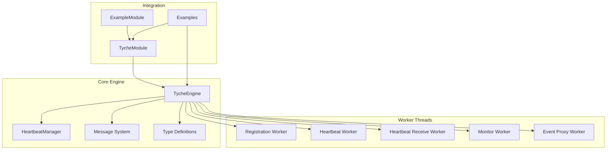
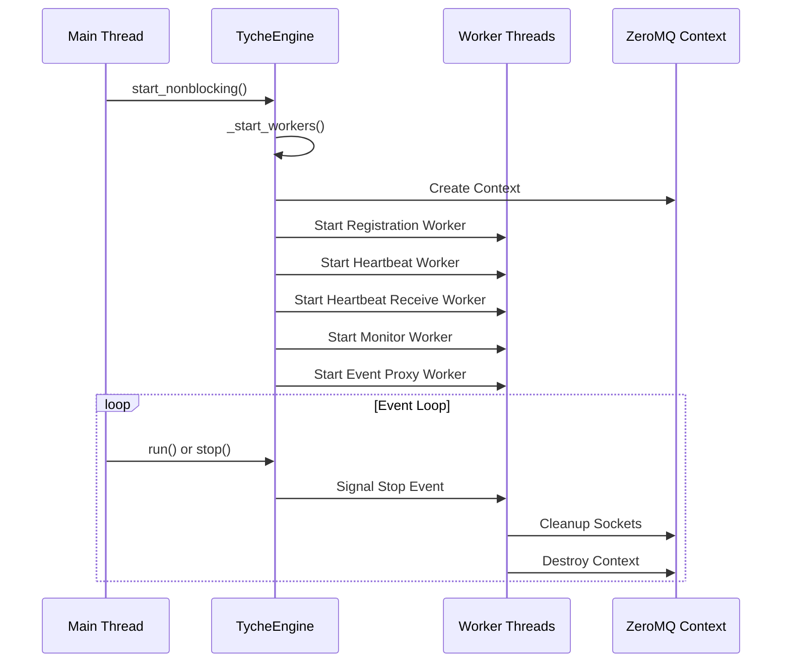
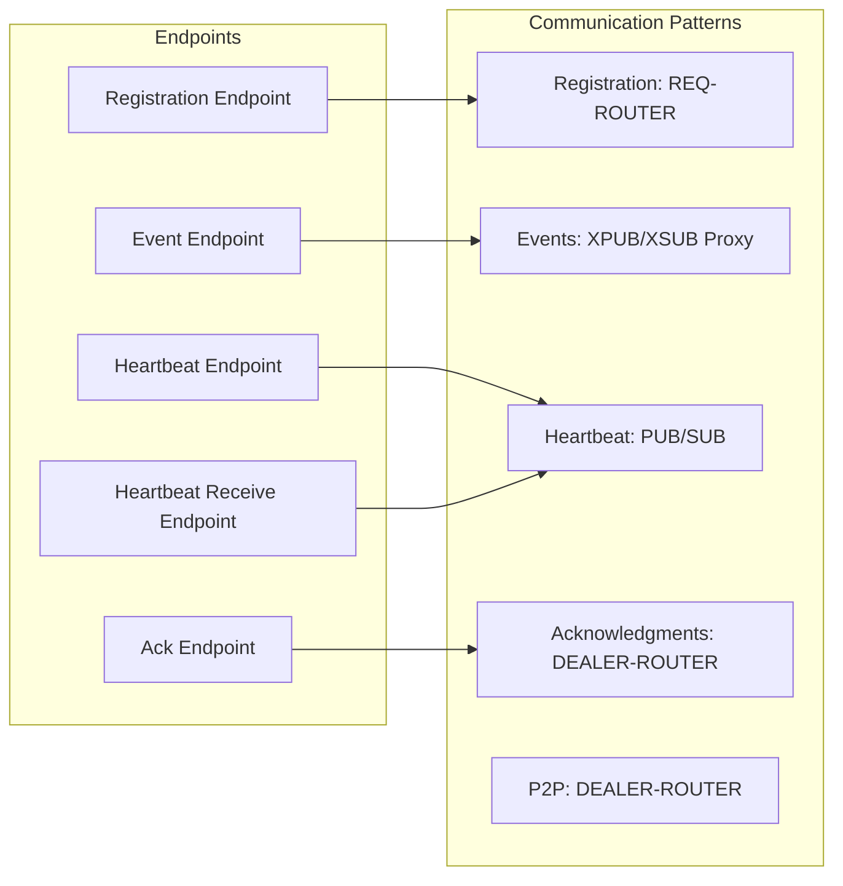
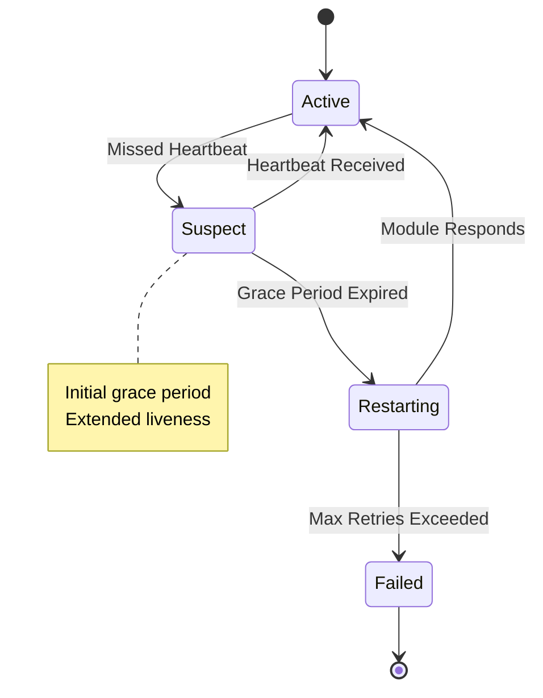
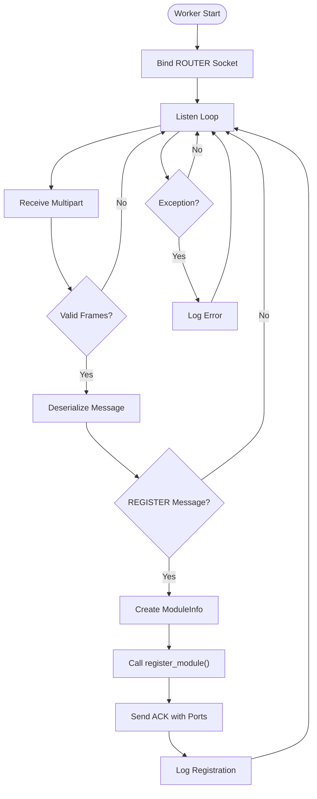
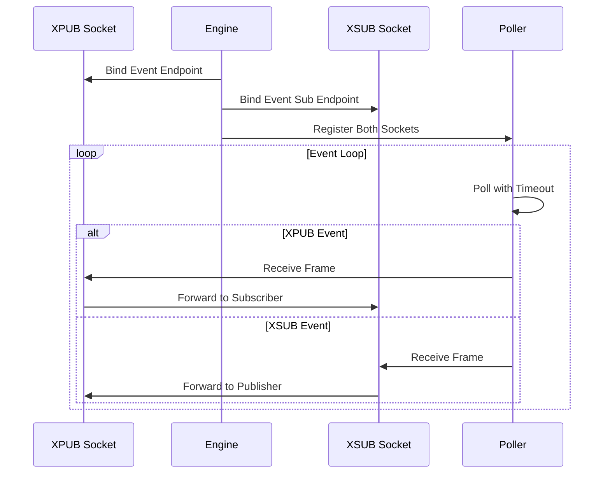
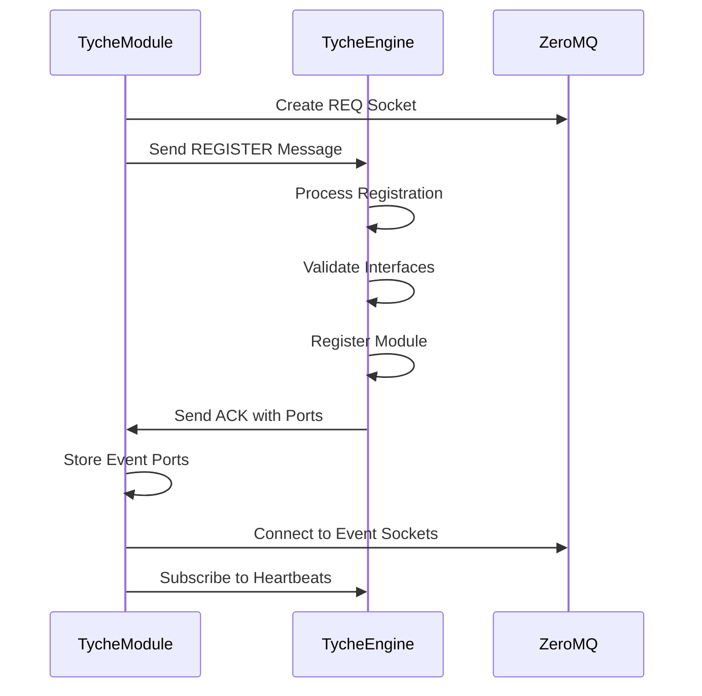
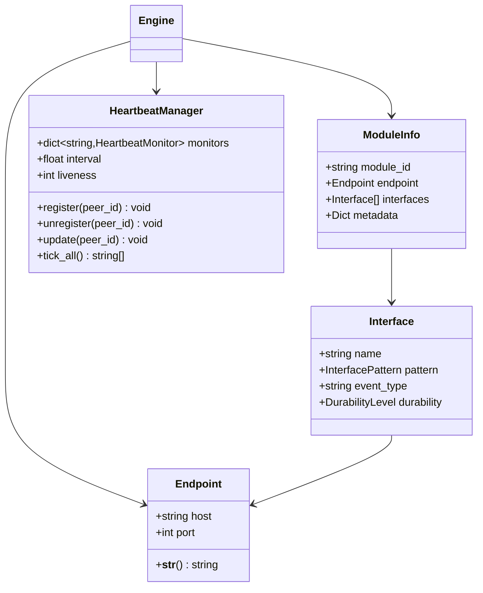

# TycheEngine API

<cite>
**Referenced Files in This Document**
- [engine.py](file://src/tyche/engine.py)
- [types.py](file://src/tyche/types.py)
- [heartbeat.py](file://src/tyche/heartbeat.py)
- [message.py](file://src/tyche/message.py)
- [module.py](file://src/tyche/module.py)
- [module_base.py](file://src/tyche/module_base.py)
- [run_engine.py](file://examples/run_engine.py)
- [run_module.py](file://examples/run_module.py)
- [test_engine.py](file://tests/unit/test_engine.py)
- [test_engine_threading.py](file://tests/unit/test_engine_threading.py)
</cite>

## Table of Contents
1. [Introduction](#introduction)
2. [Project Structure](#project-structure)
3. [Core Components](#core-components)
4. [Architecture Overview](#architecture-overview)
5. [Detailed Component Analysis](#detailed-component-analysis)
6. [Dependency Analysis](#dependency-analysis)
7. [Performance Considerations](#performance-considerations)
8. [Troubleshooting Guide](#troubleshooting-guide)
9. [Conclusion](#conclusion)

## Introduction
TycheEngine is the central broker component of the Tyche distributed event-driven framework. It serves as a high-performance orchestration layer built on ZeroMQ, managing module registration, event routing, and heartbeat monitoring. The engine coordinates communication between heterogeneous modules through standardized interface patterns while maintaining reliability through the Paranoid Pirate heartbeat protocol.

## Project Structure
The TycheEngine implementation follows a modular architecture with clear separation of concerns:



**Diagram sources**
- [engine.py:25-350](file://src/tyche/engine.py#L25-L350)
- [heartbeat.py:91-142](file://src/tyche/heartbeat.py#L91-L142)
- [module.py:28-401](file://src/tyche/module.py#L28-L401)

**Section sources**
- [engine.py:1-350](file://src/tyche/engine.py#L1-L350)
- [types.py:1-102](file://src/tyche/types.py#L1-L102)

## Core Components

### TycheEngine Class
The central broker class that manages the entire Tyche ecosystem. It provides thread-safe module registration, event routing, and heartbeat monitoring capabilities.

**Constructor Parameters:**
- `registration_endpoint`: Endpoint for module registration requests
- `event_endpoint`: Primary event endpoint for XPUB/XSUB proxy
- `heartbeat_endpoint`: Heartbeat broadcast endpoint
- `ack_endpoint`: Optional acknowledgment endpoint (defaults to event_endpoint + 10)
- `heartbeat_receive_endpoint`: Optional heartbeat receive endpoint (defaults to heartbeat_endpoint + 1)

**Thread Safety:** Implemented through a threading lock for module registry operations and atomic operations for state management.

**Lifecycle Management:** Supports both blocking (`run()`) and non-blocking (`start_nonblocking()`) startup modes with graceful shutdown via `stop()`.

**Section sources**
- [engine.py:34-66](file://src/tyche/engine.py#L34-L66)
- [engine.py:67-118](file://src/tyche/engine.py#L67-L118)

### Worker Thread Architecture
The engine operates multiple dedicated worker threads for different responsibilities:



**Diagram sources**
- [engine.py:79-105](file://src/tyche/engine.py#L79-L105)
- [engine.py:106-118](file://src/tyche/engine.py#L106-L118)

**Section sources**
- [engine.py:79-105](file://src/tyche/engine.py#L79-L105)
- [engine.py:341-350](file://src/tyche/engine.py#L341-L350)

## Architecture Overview

### Communication Patterns
TycheEngine implements multiple ZeroMQ communication patterns for different use cases:



**Diagram sources**
- [engine.py:121-143](file://src/tyche/engine.py#L121-L143)
- [engine.py:238-278](file://src/tyche/engine.py#L238-L278)
- [engine.py:281-306](file://src/tyche/engine.py#L281-L306)

### Heartbeat Protocol
The engine implements the Paranoid Pirate pattern for reliable heartbeat monitoring:



**Diagram sources**
- [heartbeat.py:16-50](file://src/tyche/heartbeat.py#L16-L50)
- [heartbeat.py:91-142](file://src/tyche/heartbeat.py#L91-L142)

**Section sources**
- [heartbeat.py:16-142](file://src/tyche/heartbeat.py#L16-L142)
- [engine.py:281-350](file://src/tyche/engine.py#L281-L350)

## Detailed Component Analysis

### Public API Methods

#### run()
**Signature:** `run() -> None`

**Description:** Starts the engine in blocking mode, running until `stop()` is called. This method blocks the calling thread and handles signal compatibility through interruptible waits.

**Behavior:**
- Initializes worker threads via `_start_workers()`
- Enters main event loop with 0.1-second wait intervals
- Continues until stop event is signaled

**Usage Constraints:**
- Should be called from main thread for proper signal handling
- Use `start_nonblocking()` for testing scenarios

**Exception Handling:**
- Errors in worker threads are logged but don't terminate the engine
- Graceful shutdown on keyboard interrupt

**Section sources**
- [engine.py:67-78](file://src/tyche/engine.py#L67-L78)

#### start_nonblocking()
**Signature:** `start_nonblocking() -> None`

**Description:** Starts the engine without blocking, intended for testing scenarios where the caller manages the main thread.

**Behavior:**
- Calls `_start_workers()` to initialize all worker threads
- Returns immediately after thread startup
- Requires manual `stop()` invocation for cleanup

**Usage Constraints:**
- Must be paired with explicit `stop()` call
- Not suitable for production main thread management

**Section sources**
- [engine.py:75-78](file://src/tyche/engine.py#L75-L78)

#### stop()
**Signature:** `stop() -> None`

**Description:** Performs graceful shutdown of the engine and all worker threads.

**Behavior:**
- Sets internal running flag to False
- Signals all worker threads via stop event
- Joins worker threads with 2-second timeout
- Destroys ZeroMQ context with immediate cleanup

**Thread Safety:**
- Uses thread-safe operations for state management
- Ensures proper resource cleanup regardless of shutdown timing

**Section sources**
- [engine.py:106-118](file://src/tyche/engine.py#L106-L118)

#### register_module()
**Signature:** `register_module(module_info: ModuleInfo) -> None`

**Description:** Registers a module and its interfaces in a thread-safe manner.

**Parameters:**
- `module_info`: Complete module registration information including interfaces and metadata

**Thread Safety:**
- Uses internal lock for registry operations
- Atomic updates to both modules and interfaces dictionaries

**Behavior:**
- Adds module to internal registry
- Updates interface mapping for event routing
- Registers module with heartbeat manager

**Section sources**
- [engine.py:200-214](file://src/tyche/engine.py#L200-L214)

#### unregister_module()
**Signature:** `unregister_module(module_id: str) -> None`

**Description:** Unregisters a module and cleans up associated interface mappings.

**Parameters:**
- `module_id`: Identifier of module to unregister

**Thread Safety:**
- Uses internal lock for registry operations
- Safely removes module from both modules and interfaces dictionaries

**Behavior:**
- Removes module from registry
- Cleans up interface mappings for all module interfaces
- Unregisters from heartbeat monitoring

**Section sources**
- [engine.py:215-235](file://src/tyche/engine.py#L215-L235)

### Internal Worker Methods

#### Registration Worker
Handles module registration requests via REQ-ROUTER pattern:



**Diagram sources**
- [engine.py:121-143](file://src/tyche/engine.py#L121-L143)
- [engine.py:144-177](file://src/tyche/engine.py#L144-L177)

**Section sources**
- [engine.py:121-177](file://src/tyche/engine.py#L121-L177)

#### Event Proxy Worker
Implements XPUB/XSUB proxy for event distribution:



**Diagram sources**
- [engine.py:238-278](file://src/tyche/engine.py#L238-L278)

**Section sources**
- [engine.py:238-278](file://src/tyche/engine.py#L238-L278)

### Configuration Options and Endpoint Binding

#### Endpoint Configuration
The engine requires specific endpoint bindings for different communication patterns:

| Endpoint Type | Default Port Offset | Purpose |
|---------------|-------------------|---------|
| Registration | 0 | Module registration handshake |
| Event (XPUB) | 0 | Event publishing endpoint |
| Event (XSUB) | +1 | Event subscription endpoint |
| Acknowledgment | +10 | ACK response endpoint |
| Heartbeat (PUB) | 0 | Heartbeat broadcast |
| Heartbeat (ROUTER) | +1 | Heartbeat reception |

**Section sources**
- [engine.py:42-54](file://src/tyche/engine.py#L42-L54)

### Integration Patterns

#### Module Registration Flow


**Diagram sources**
- [module.py:200-255](file://src/tyche/module.py#L200-L255)
- [engine.py:144-177](file://src/tyche/engine.py#L144-L177)

**Section sources**
- [module.py:200-255](file://src/tyche/module.py#L200-L255)
- [engine.py:144-177](file://src/tyche/engine.py#L144-L177)

## Dependency Analysis

### Core Dependencies
The TycheEngine has minimal external dependencies focused on networking and serialization:

```mermaid
graph TB
subgraph "External Dependencies"
A[ZeroMQ (zmq)]
B[MessagePack (msgpack)]
C[Threading]
D[Logging]
E[Time]
end
subgraph "Internal Dependencies"
F[Types Module]
G[Message Module]
H[Heartbeat Manager]
I[Endpoint Types]
end
Engine[TycheEngine] --> A
Engine --> B
Engine --> F
Engine --> G
Engine --> H
Message --> B
Heartbeat --> A
Heartbeat --> I
```

**Diagram sources**
- [engine.py:8-20](file://src/tyche/engine.py#L8-L20)
- [message.py:8-10](file://src/tyche/message.py#L8-L10)
- [heartbeat.py:10-13](file://src/tyche/heartbeat.py#L10-L13)

### Type System Integration
The engine relies heavily on strongly-typed interfaces for reliability:



**Diagram sources**
- [types.py:76-102](file://src/tyche/types.py#L76-L102)
- [heartbeat.py:91-142](file://src/tyche/heartbeat.py#L91-L142)

**Section sources**
- [types.py:76-102](file://src/tyche/types.py#L76-L102)
- [heartbeat.py:91-142](file://src/tyche/heartbeat.py#L91-L142)

## Performance Considerations

### ZeroMQ Socket Patterns
The engine leverages optimal ZeroMQ patterns for each use case:

- **Registration**: REQ-ROUTER for reliable request-response
- **Events**: XPUB/XSUB proxy for efficient broadcast distribution
- **Heartbeats**: PUB/SUB for lightweight monitoring
- **ACK Responses**: DEALER-ROUTER for asynchronous acknowledgments

### Concurrency Model
- **Thread-per-worker**: Each responsibility has dedicated worker thread
- **Lock-free operations**: Minimal contention through careful design
- **Interruptible waits**: 0.1-second polling for signal responsiveness
- **Immediate cleanup**: ZeroMQ linger set to 0 for rapid shutdown

### Memory Management
- **Context isolation**: Each engine creates its own ZeroMQ context
- **Resource cleanup**: Explicit socket closure and context destruction
- **Garbage collection**: Proper reference cleanup in worker threads

## Troubleshooting Guide

### Common Issues and Solutions

#### Engine Startup Failures
**Symptoms:** Engine fails to start worker threads
**Causes:**
- Port binding conflicts
- Permission issues
- ZeroMQ library problems

**Solutions:**
- Verify port availability and permissions
- Check ZeroMQ installation
- Review log output for specific error messages

#### Module Registration Problems
**Symptoms:** Modules cannot register with engine
**Causes:**
- Wrong registration endpoint
- Network connectivity issues
- Message format errors

**Solutions:**
- Verify endpoint configuration matches engine setup
- Check network connectivity between modules and engine
- Validate message serialization/deserialization

#### Heartbeat Monitoring Issues
**Symptoms:** Modules marked as suspect or failed
**Causes:**
- Network latency exceeding heartbeat intervals
- Module processing taking too long
- Heartbeat endpoint misconfiguration

**Solutions:**
- Adjust heartbeat intervals for network conditions
- Optimize module processing time
- Verify heartbeat endpoint connectivity

**Section sources**
- [engine.py:139-142](file://src/tyche/engine.py#L139-L142)
- [engine.py:289-305](file://src/tyche/engine.py#L289-L305)
- [engine.py:336-339](file://src/tyche/engine.py#L336-L339)

### Debugging Techniques

#### Logging Configuration
Enable detailed logging to diagnose issues:
- Set logging level to DEBUG for development
- Monitor engine worker thread logs
- Track module registration and heartbeat events

#### Network Troubleshooting
Use ZeroMQ tools to verify connectivity:
- Test endpoint reachability
- Verify socket binding status
- Monitor message flow between components

## Conclusion
TycheEngine provides a robust, high-performance foundation for distributed event-driven systems. Its thread-safe architecture, reliable heartbeat monitoring, and flexible endpoint configuration make it suitable for production environments requiring scalable module coordination. The clear separation of concerns and comprehensive error handling ensure predictable behavior under various operational conditions.

The engine's design balances performance with reliability through carefully chosen ZeroMQ patterns and thoughtful concurrency management. Proper configuration of endpoints and adherence to the interface patterns will maximize system stability and performance.