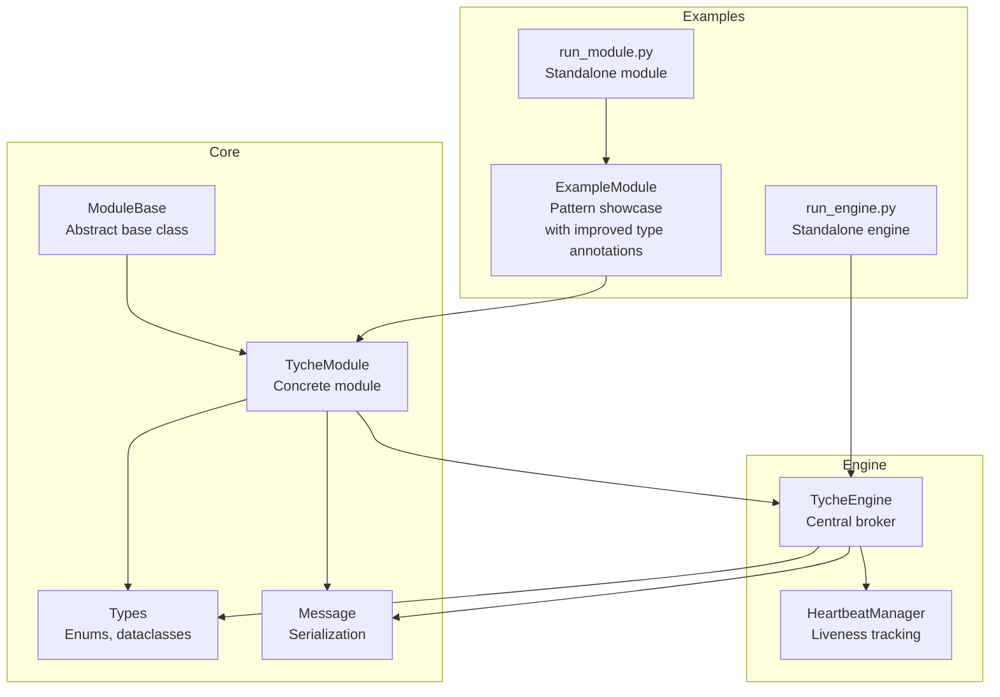
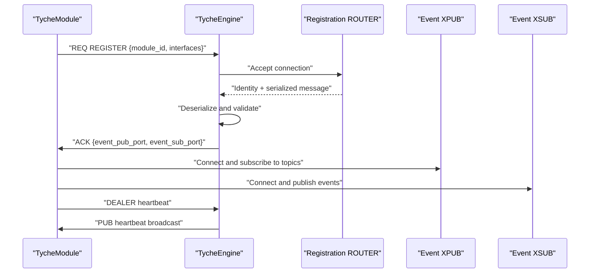
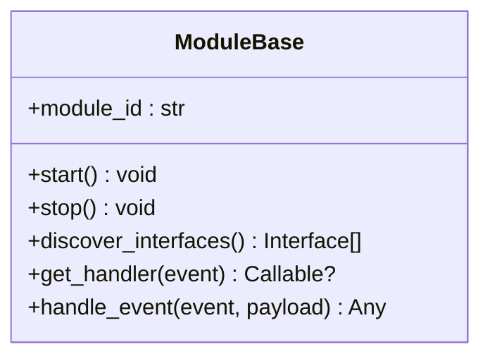
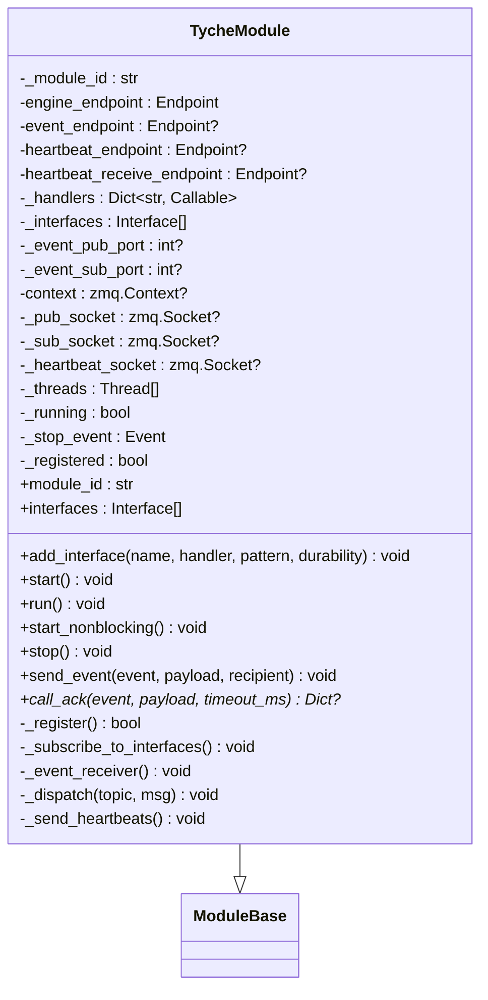
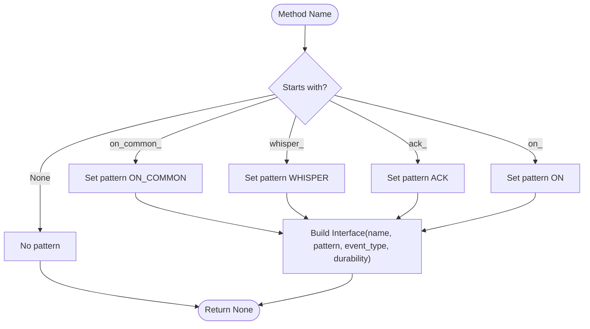
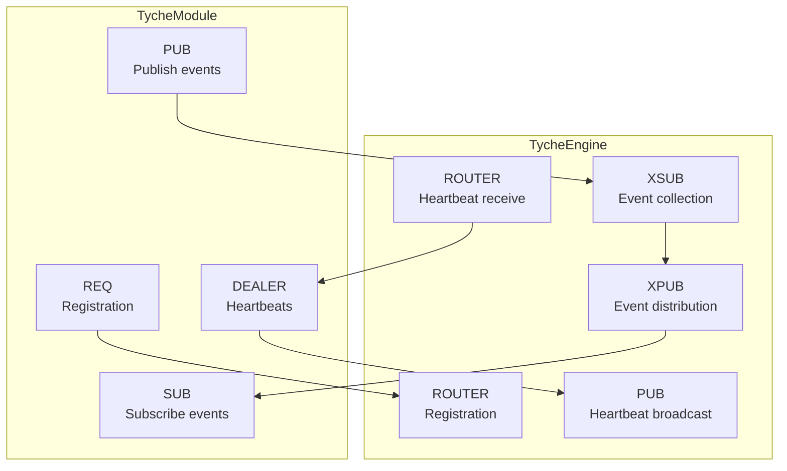
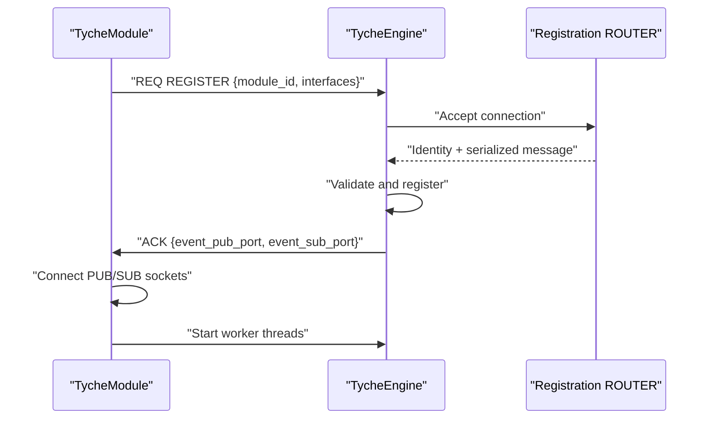
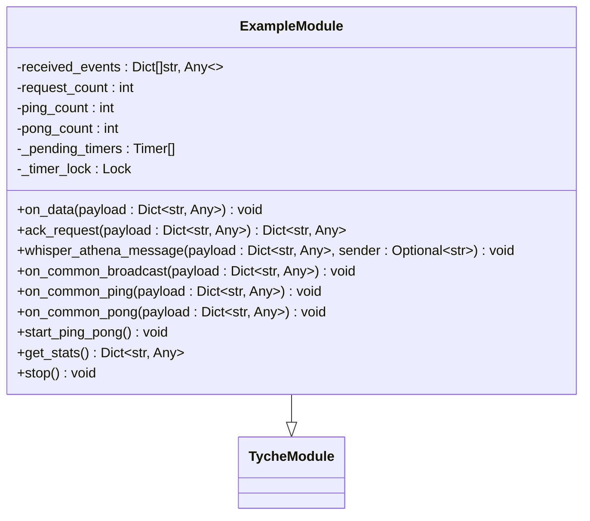
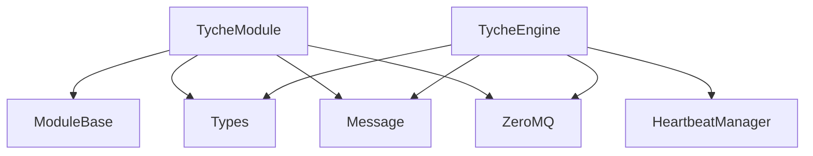

# TycheModule API

**Referenced Files in This Document**
- [module_base.py](file://src/tyche/module_base.py)
- [module.py](file://src/tyche/module.py)
- [types.py](file://src/tyche/types.py)
- [message.py](file://src/tyche/message.py)
- [engine.py](file://src/tyche/engine.py)
- [heartbeat.py](file://src/tyche/heartbeat.py)
- [example_module.py](file://src/tyche/example_module.py)
- [run_module.py](file://examples/run_module.py)
- [run_engine.py](file://examples/run_engine.py)
- [test_module.py](file://tests/unit/test_module.py)
- [test_module_base.py](file://tests/unit/test_module_base.py)
- [test_example_module.py](file://tests/unit/test_example_module.py)

## Update Summary
**Changes Made**
- Enhanced type annotation examples in Event Handler Patterns section to demonstrate best practices
- Updated ExampleModule implementation examples to show explicit Dict[str, Any] payload type declarations
- Added guidance on payload type declaration patterns for handler methods
- Improved documentation of type safety practices in event handling

## Table of Contents
1. [Introduction](#introduction)
2. [Project Structure](#project-structure)
3. [Core Components](#core-components)
4. [Architecture Overview](#architecture-overview)
5. [Detailed Component Analysis](#detailed-component-analysis)
6. [Dependency Analysis](#dependency-analysis)
7. [Performance Considerations](#performance-considerations)
8. [Troubleshooting Guide](#troubleshooting-guide)
9. [Conclusion](#conclusion)
10. [Appendices](#appendices)

## Introduction
This document provides comprehensive API documentation for the TycheModule and TycheModuleBase classes. It covers constructor parameters, method signatures, lifecycle hooks, automatic interface discovery, event handler registration patterns (on_*, ack_*, whisper_*, on_common_*), communication patterns, thread safety, async capabilities, and ZeroMQ socket integration. It also includes examples of custom module implementation, interface definition, event processing, module registration, endpoint configuration, error handling strategies, and demonstrates best practices for type annotations in payload declarations.

## Project Structure
The Tyche Engine is organized around a core module abstraction and a concrete implementation that integrates with a central engine via ZeroMQ. Key modules include:
- Module base and concrete module implementation
- Types and message definitions
- Engine that manages registration, event routing, and heartbeats
- Example module demonstrating all interface patterns with improved type annotations
- Examples for running the engine and a module



**Diagram sources**
- [module_base.py:10-120](file://src/tyche/module_base.py#L10-L120)
- [module.py:28-401](file://src/tyche/module.py#L28-L401)
- [types.py:14-105](file://src/tyche/types.py#L14-L105)
- [message.py:13-168](file://src/tyche/message.py#L13-L168)
- [engine.py:25-350](file://src/tyche/engine.py#L25-L350)
- [heartbeat.py:16-142](file://src/tyche/heartbeat.py#L16-L142)
- [example_module.py:19-183](file://src/tyche/example_module.py#L19-L183)
- [run_module.py:22-51](file://examples/run_module.py#L22-L51)
- [run_engine.py:21-54](file://examples/run_engine.py#L21-L54)

**Section sources**
- [module_base.py:10-120](file://src/tyche/module_base.py#L10-L120)
- [module.py:28-401](file://src/tyche/module.py#L28-L401)
- [types.py:14-105](file://src/tyche/types.py#L14-L105)
- [message.py:13-168](file://src/tyche/message.py#L13-L168)
- [engine.py:25-350](file://src/tyche/engine.py#L25-L350)
- [heartbeat.py:16-142](file://src/tyche/heartbeat.py#L16-L142)
- [example_module.py:19-183](file://src/tyche/example_module.py#L19-L183)
- [run_module.py:22-51](file://examples/run_module.py#L22-L51)
- [run_engine.py:21-54](file://examples/run_engine.py#L21-L54)

## Core Components
This section documents the base and concrete module classes, focusing on constructor parameters, lifecycle hooks, and interface discovery.

- TycheModuleBase (abstract)
  - Properties
    - module_id: Unique module identifier (abstract)
  - Methods
    - start(): Start the module (abstract)
    - stop(): Stop the module gracefully (abstract)
    - discover_interfaces(): Auto-discover interfaces from method names
    - get_handler(event): Get handler method for an event
    - handle_event(event, payload): Route event to appropriate handler

- TycheModule (concrete)
  - Constructor parameters
    - engine_endpoint: Endpoint for registration and ACK
    - module_id: Optional module identifier (auto-generated if omitted)
    - event_endpoint: Optional endpoint for event proxy (not used in current implementation)
    - heartbeat_endpoint: Optional endpoint for outbound heartbeats (not used in current implementation)
    - heartbeat_receive_endpoint: Optional endpoint for inbound heartbeats (used for liveness)
  - Properties
    - module_id: Unique module identifier
    - interfaces: Discovered interfaces
  - Methods
    - add_interface(name, handler, pattern, durability): Register an event handler interface
    - start()/run(): Start the module (blocks until stop())
    - start_nonblocking(): Start without blocking (for testing)
    - stop(): Stop the module gracefully
    - send_event(event, payload, recipient): Publish an event through the engine's event proxy
    - call_ack(event, payload, timeout_ms): Send a request and wait for an ACK reply
    - Internal helpers
      - _register(): One-shot registration handshake with engine
      - _subscribe_to_interfaces(): Subscribe SUB socket to topics matching handler names
      - _event_receiver(): Receive events from engine and dispatch to handlers
      - _dispatch(topic, msg): Route an incoming message to the correct handler
      - _send_heartbeats(): Send periodic heartbeats to engine

**Section sources**
- [module_base.py:10-120](file://src/tyche/module_base.py#L10-L120)
- [module.py:28-401](file://src/tyche/module.py#L28-L401)

## Architecture Overview
TycheModule integrates with TycheEngine using ZeroMQ sockets for registration, event routing, and heartbeats. The engine acts as a central broker that manages module registration, event routing via an XPUB/XSUB proxy, and heartbeat monitoring.



**Diagram sources**
- [module.py:200-254](file://src/tyche/module.py#L200-L254)
- [engine.py:144-177](file://src/tyche/engine.py#L144-L177)
- [engine.py:238-278](file://src/tyche/engine.py#L238-L278)

## Detailed Component Analysis

### TycheModuleBase
TycheModuleBase defines the abstract interface for all Tyche modules. It enforces a naming convention for event handlers and provides automatic interface discovery.

Key behaviors:
- Naming patterns for handlers
  - on_{event}: Fire-and-forget event handler
  - ack_{event}: Handler that must return ACK
  - whisper_{target}_{event}: Direct P2P handler
  - on_common_{event}: Broadcast event handler
- Automatic interface discovery scans methods for these patterns and builds Interface definitions
- Handler resolution and dispatch
  - get_handler(event): Returns callable or None
  - handle_event(event, payload): Routes to handler; for ack_ patterns, returns handler result; otherwise returns None



**Diagram sources**
- [module_base.py:10-120](file://src/tyche/module_base.py#L10-L120)

**Section sources**
- [module_base.py:10-120](file://src/tyche/module_base.py#L10-L120)

### TycheModule
TycheModule extends ModuleBase and implements ZeroMQ-based communication with TycheEngine. It manages sockets, registration, event subscription, publishing, and heartbeats.

Constructor parameters and initialization:
- engine_endpoint: Registration and ACK endpoint
- module_id: Optional; auto-generated if omitted
- event_endpoint: Optional endpoint for event proxy (not used in current implementation)
- heartbeat_endpoint: Optional endpoint for outbound heartbeats (not used in current implementation)
- heartbeat_receive_endpoint: Optional endpoint for inbound heartbeats (used for liveness)

Lifecycle:
- start()/run(): Starts worker threads and connects to engine; blocks until stop()
- start_nonblocking(): Starts without blocking (for testing)
- stop(): Stops gracefully, joins threads, closes sockets, destroys context

Socket architecture:
- REQ: One-shot registration handshake (closed after use)
- PUB: Publish events to engine's XSUB
- SUB: Subscribe to events from engine's XPUB
- DEALER: Send heartbeats to engine

Interface management:
- add_interface(name, handler, pattern, durability): Registers handler and creates Interface entry
- discover_interfaces(): Auto-discovers interfaces from method names

Event handling:
- send_event(event, payload, recipient): Publishes event to engine's event proxy
- call_ack(event, payload, timeout_ms): Sends request and waits for ACK reply using a temporary REQ socket

Heartbeat:
- _send_heartbeats(): Periodically sends heartbeat messages to engine



**Diagram sources**
- [module.py:28-401](file://src/tyche/module.py#L28-L401)
- [module_base.py:10-120](file://src/tyche/module_base.py#L10-L120)

**Section sources**
- [module.py:28-401](file://src/tyche/module.py#L28-L401)

### Event Handler Patterns and Interface Discovery
TycheModuleBase supports four event handler patterns. TycheModule can auto-discover interfaces from method names and also allows manual registration via add_interface.

Handler patterns:
- on_{event}: Fire-and-forget, load-balanced
- ack_{event}: Must reply with ACK
- whisper_{target}_{event}: Direct P2P
- on_common_{event}: Broadcast to all subscribers

Interface discovery:
- discover_interfaces(): Scans methods for naming patterns and builds Interface definitions with durability defaults
- _get_pattern_for_name(): Determines pattern from method name

**Updated** Enhanced type annotation examples demonstrating best practices for payload declarations

Payload type declarations should use explicit Dict[str, Any] annotations to ensure type safety and clarity. The ExampleModule demonstrates these patterns:

- **Fire-and-forget handlers**: `on_data(payload: Dict[str, Any]) -> None`
- **Request-response handlers**: `ack_request(payload: Dict[str, Any]) -> Dict[str, Any]`
- **Direct P2P handlers**: `whisper_athena_message(payload: Dict[str, Any], sender: Optional[str] = None) -> None`
- **Broadcast handlers**: `on_common_broadcast(payload: Dict[str, Any]) -> None`

These explicit type annotations provide:
- Clear contract documentation for handler parameters
- IDE autocompletion and type checking support
- Runtime type safety validation
- Consistent interface patterns across all handler types



**Diagram sources**
- [module_base.py:48-84](file://src/tyche/module_base.py#L48-L84)

**Section sources**
- [module_base.py:48-84](file://src/tyche/module_base.py#L48-L84)
- [module.py:87-111](file://src/tyche/module.py#L87-L111)
- [example_module.py:80-122](file://src/tyche/example_module.py#L80-L122)

### Communication Patterns and ZeroMQ Integration
TycheModule uses ZeroMQ for:
- Registration: REQ socket to engine ROUTER for one-shot handshake
- Event routing: PUB/SUB sockets connected to engine XPUB/XSUB proxy
- Heartbeats: DEALER socket sending heartbeats to engine PUB and receiving via ROUTER

Endpoints:
- Registration endpoint: TCP address for module registration and ACK
- Event endpoints: Separate ports for XPUB and XSUB sides of the proxy
- Heartbeat endpoints: Outbound and inbound endpoints for heartbeat monitoring



**Diagram sources**
- [module.py:133-158](file://src/tyche/module.py#L133-L158)
- [engine.py:238-278](file://src/tyche/engine.py#L238-L278)
- [engine.py:281-339](file://src/tyche/engine.py#L281-L339)

**Section sources**
- [module.py:133-158](file://src/tyche/module.py#L133-L158)
- [engine.py:238-278](file://src/tyche/engine.py#L238-L278)
- [engine.py:281-339](file://src/tyche/engine.py#L281-L339)

### Thread Safety and Async Capabilities
TycheModule employs threading for:
- Worker threads: Event receiver and heartbeat sender
- Graceful shutdown: Stop event coordination and socket closure
- Heartbeat monitoring: Engine-side heartbeat manager tracks liveness

Thread safety considerations:
- Internal state guarded by threading locks in engine heartbeat manager
- Module uses stop event to coordinate thread termination
- Sockets closed and context destroyed on stop

Async capabilities:
- Non-blocking registration via REQ socket with timeouts
- Heartbeat intervals interruptible sleeps
- Event receiver uses non-blocking receive with polling

**Section sources**
- [module.py:160-197](file://src/tyche/module.py#L160-L197)
- [engine.py:96-118](file://src/tyche/engine.py#L96-L118)
- [heartbeat.py:91-142](file://src/tyche/heartbeat.py#L91-L142)

### Module Registration Process and Endpoint Configuration
Registration flow:
- Module creates a REQ socket and connects to engine registration endpoint
- Sends a REGISTER message containing module_id and interfaces
- Receives ACK with event_pub_port and event_sub_port
- Establishes PUB/SUB sockets to engine proxy and starts worker threads

Endpoint configuration:
- Registration endpoint: TCP address for registration and ACK
- Event endpoints: Separate ports for XPUB and XSUB sides of the proxy
- Heartbeat endpoints: Outbound and inbound endpoints for heartbeat monitoring



**Diagram sources**
- [module.py:200-254](file://src/tyche/module.py#L200-L254)
- [engine.py:144-177](file://src/tyche/engine.py#L144-L177)

**Section sources**
- [module.py:200-254](file://src/tyche/module.py#L200-L254)
- [engine.py:144-177](file://src/tyche/engine.py#L144-L177)

### Error Handling Strategies
TycheModule implements robust error handling:
- Registration timeouts and failures logged
- Event receive errors handled with logging
- Handler exceptions caught and logged
- Heartbeat send errors handled with logging

Engine error handling:
- Registration worker handles exceptions and logs
- Event proxy worker handles ZMQ errors and logs
- Heartbeat workers handle exceptions and log errors
- Monitor worker periodically unregisters expired modules

**Section sources**
- [module.py:247-254](file://src/tyche/module.py#L247-L254)
- [module.py:279-282](file://src/tyche/module.py#L279-L282)
- [module.py:294-298](file://src/tyche/module.py#L294-L298)
- [module.py:390-395](file://src/tyche/module.py#L390-L395)
- [engine.py:139-142](file://src/tyche/engine.py#L139-L142)
- [engine.py:273-275](file://src/tyche/engine.py#L273-L275)
- [engine.py:302-305](file://src/tyche/engine.py#L302-L305)
- [engine.py:337-339](file://src/tyche/engine.py#L337-L339)

### Examples of Custom Module Implementation
The ExampleModule demonstrates all interface patterns and lifecycle usage with improved type annotations:

**Updated** Enhanced type annotations showing best practices for payload declarations

- Auto-discovery of interfaces from methods with explicit type annotations
- Fire-and-forget on_{event} handlers with Dict[str, Any] payload parameters
- Request-response ack_{event} handlers returning dictionaries with proper type hints
- Direct P2P whisper_{target}_{event} handlers with optional sender parameters
- Broadcast on_common_{event} handlers with explicit payload type declarations
- Stats reporting and graceful shutdown with proper type annotations

The ExampleModule showcases these type annotation patterns:

```python
def on_data(self, payload: Dict[str, Any]) -> None:
    """Handle fire-and-forget data events."""
    self.received_events.append({"event": "on_data", "payload": payload})

def ack_request(self, payload: Dict[str, Any]) -> Dict[str, Any]:
    """Handle request with acknowledgment."""
    self.request_count += 1
    request_id = payload.get("request_id", "unknown")
    
    return {
        "status": "acknowledged",
        "request_id": request_id,
        "module_id": self.module_id,
        "count": self.request_count,
    }

def whisper_athena_message(
    self,
    payload: Dict[str, Any],
    sender: Optional[str] = None,
) -> None:
    """Handle direct P2P whisper message."""
    self.received_events.append(
        {"event": "whisper_athena_message", "payload": payload, "sender": sender}
    )

def on_common_broadcast(self, payload: Dict[str, Any]) -> None:
    """Handle broadcast events to ALL subscribers."""
    self.received_events.append(
        {"event": "on_common_broadcast", "payload": payload}
    )
```

These explicit type annotations provide:
- Clear documentation of expected payload structure
- IDE autocompletion and type checking support
- Runtime type safety validation
- Consistent interface patterns across all handler types



**Diagram sources**
- [example_module.py:19-183](file://src/tyche/example_module.py#L19-L183)
- [module.py:28-401](file://src/tyche/module.py#L28-L401)

**Section sources**
- [example_module.py:19-183](file://src/tyche/example_module.py#L19-L183)

## Dependency Analysis
TycheModule depends on:
- ModuleBase for abstract interface
- Types for enums and dataclasses (Endpoint, Interface, InterfacePattern, DurabilityLevel, MessageType)
- Message for serialization/deserialization
- ZeroMQ for networking

TycheEngine depends on:
- HeartbeatManager for liveness tracking
- Types for enums and dataclasses
- Message for serialization/deserialization
- ZeroMQ for networking



**Diagram sources**
- [module.py:13-23](file://src/tyche/module.py#L13-L23)
- [engine.py:10-20](file://src/tyche/engine.py#L10-L20)
- [types.py:14-105](file://src/tyche/types.py#L14-L105)
- [message.py:13-168](file://src/tyche/message.py#L13-L168)
- [heartbeat.py:16-142](file://src/tyche/heartbeat.py#L16-L142)

**Section sources**
- [module.py:13-23](file://src/tyche/module.py#L13-L23)
- [engine.py:10-20](file://src/tyche/engine.py#L10-L20)
- [types.py:14-105](file://src/tyche/types.py#L14-L105)
- [message.py:13-168](file://src/tyche/message.py#L13-L168)
- [heartbeat.py:16-142](file://src/tyche/heartbeat.py#L16-L142)

## Performance Considerations
- ZeroMQ socket types and polling enable efficient asynchronous I/O
- Heartbeat intervals and timeouts balance responsiveness and overhead
- MessagePack serialization minimizes payload size
- Async persistence model keeps hot path low-latency
- Engine uses XPUB/XSUB proxy for scalable event distribution

## Troubleshooting Guide
Common issues and resolutions:
- Registration timeout: Verify engine endpoint connectivity and network configuration
- Event receive errors: Check subscription topics and handler registration
- Handler exceptions: Wrap handler logic with try/except and log errors
- Heartbeat failures: Confirm heartbeat endpoints and network connectivity
- Graceful shutdown: Ensure stop() is called to join threads and close sockets

Validation via tests:
- Module initialization and ID generation
- Interface discovery and handler resolution
- Event handler behavior and statistics

**Section sources**
- [test_module.py:7-69](file://tests/unit/test_module.py#L7-L69)
- [test_module_base.py:43-100](file://tests/unit/test_module_base.py#L43-L100)
- [test_example_module.py:7-94](file://tests/unit/test_example_module.py#L7-L94)

## Conclusion
TycheModule and TycheModuleBase provide a robust foundation for building distributed modules with standardized event handler patterns, automatic interface discovery, and ZeroMQ-based communication. The concrete implementation integrates seamlessly with TycheEngine, offering registration, event routing, and heartbeat monitoring. The examples demonstrate practical usage across all interface patterns with improved type annotations, showcasing best practices for payload type declarations using explicit Dict[str, Any] annotations. The tests validate core behaviors and error handling, ensuring reliable operation in production environments.

## Appendices

### API Reference Summary

- TycheModuleBase
  - Properties
    - module_id: Unique module identifier
  - Methods
    - start(): Start the module
    - stop(): Stop the module gracefully
    - discover_interfaces(): Auto-discover interfaces from method names
    - get_handler(event): Get handler method for an event
    - handle_event(event, payload): Route event to appropriate handler

- TycheModule
  - Constructor parameters
    - engine_endpoint: Endpoint for registration and ACK
    - module_id: Optional module identifier
    - event_endpoint: Optional endpoint for event proxy
    - heartbeat_endpoint: Optional endpoint for outbound heartbeats
    - heartbeat_receive_endpoint: Optional endpoint for inbound heartbeats
  - Properties
    - module_id: Unique module identifier
    - interfaces: Discovered interfaces
  - Methods
    - add_interface(name, handler, pattern, durability): Register an event handler interface
    - start()/run(): Start the module (blocks until stop())
    - start_nonblocking(): Start without blocking (for testing)
    - stop(): Stop the module gracefully
    - send_event(event, payload, recipient): Publish an event through the engine's event proxy
    - call_ack(event, payload, timeout_ms): Send a request and wait for an ACK reply
    - Internal helpers: _register(), _subscribe_to_interfaces(), _event_receiver(), _dispatch(), _send_heartbeats()

### Type Annotation Best Practices

**Updated** Enhanced guidance for payload type declarations

When implementing event handlers, follow these type annotation best practices:

1. **Explicit Payload Types**: Always declare payload parameters as `Dict[str, Any]` for maximum flexibility
2. **Return Type Consistency**: 
   - Fire-and-forget handlers: `-> None`
   - Request-response handlers: `-> Dict[str, Any]`
   - Direct P2P handlers: `-> None`
   - Broadcast handlers: `-> None`
3. **Optional Parameters**: Use `Optional[T]` for parameters that may be None
4. **Type Checking**: Enable type checking in your development environment for early error detection

Example patterns:
```python
# Fire-and-forget handler
def on_data(self, payload: Dict[str, Any]) -> None: ...

# Request-response handler  
def ack_request(self, payload: Dict[str, Any]) -> Dict[str, Any]: ...

# Direct P2P handler with optional sender
def whisper_target_event(
    self, 
    payload: Dict[str, Any], 
    sender: Optional[str] = None
) -> None: ...
```

**Section sources**
- [module_base.py:10-120](file://src/tyche/module_base.py#L10-L120)
- [module.py:28-401](file://src/tyche/module.py#L28-L401)
- [example_module.py:80-122](file://src/tyche/example_module.py#L80-L122)