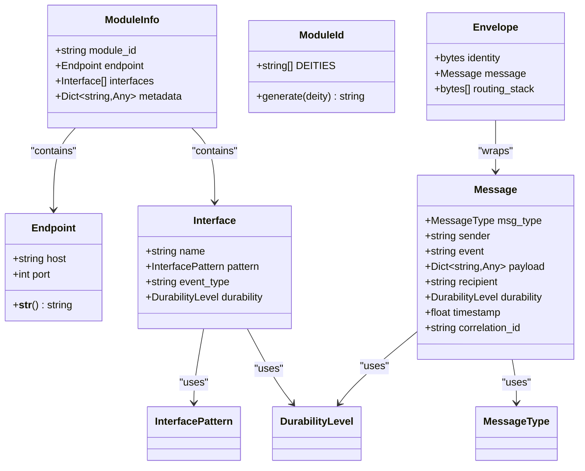
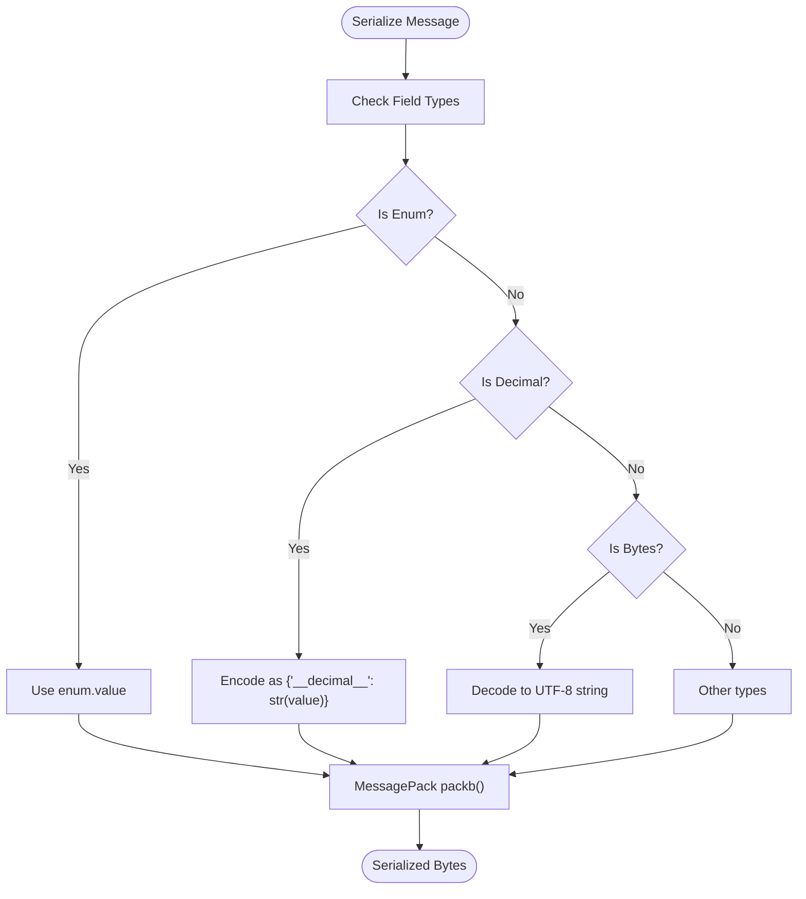

# Type Definitions & Constants

**Referenced Files in This Document**
- [types.py](file://src/tyche/types.py)
- [message.py](file://src/tyche/message.py)
- [engine.py](file://src/tyche/engine.py)
- [module.py](file://src/tyche/module.py)
- [heartbeat.py](file://src/tyche/heartbeat.py)
- [module_base.py](file://src/tyche/module_base.py)
- [example_module.py](file://src/tyche/example_module.py)
- [test_types.py](file://tests/unit/test_types.py)

## Table of Contents
1. [Introduction](#introduction)
2. [Core Type System](#core-type-system)
3. [Endpoint Type](#endpoint-type)
4. [ModuleInfo Type](#moduleinfo-type)
5. [Interface Type](#interface-type)
6. [InterfacePattern Enum](#interfacepattern-enum)
7. [MessageType Enum](#messagetype-enum)
8. [DurabilityLevel Enum](#durabilitylevel-enum)
9. [Constants](#constants)
10. [Serialization Behavior](#serialization-behavior)
11. [Usage Examples](#usage-examples)
12. [Validation Rules](#validation-rules)
13. [Versioning & Migration](#versioning--migration)
14. [Troubleshooting Guide](#troubleshooting-guide)
15. [Conclusion](#conclusion)

## Introduction

This document provides comprehensive API documentation for all type definitions, enums, and constants used throughout the Tyche Engine framework. The framework implements a distributed event-driven architecture built on ZeroMQ, with a focus on type safety and clear separation of concerns.

The type system consists of core data structures, enumerations, and constants that define the framework's communication protocols, interface patterns, and operational parameters. These types serve as the foundation for module registration, event routing, message handling, and heartbeat monitoring.

## Core Type System

The Tyche Engine defines a comprehensive set of types that form the backbone of the distributed system. These types are designed to be serializable, immutable where appropriate, and strongly typed to prevent runtime errors.



**Diagram sources**
- [types.py:76-101](file://src/tyche/types.py#L76-L101)
- [message.py:13-49](file://src/tyche/message.py#L13-L49)

**Section sources**
- [types.py:14-101](file://src/tyche/types.py#L14-L101)
- [message.py:13-49](file://src/tyche/message.py#L13-L49)

## Endpoint Type

The `Endpoint` type represents network connection parameters used throughout the Tyche Engine for ZeroMQ socket configuration.

### Field Specifications

| Field | Type | Description | Constraints |
|-------|------|-------------|-------------|
| `host` | string | Network hostname or IP address | Must be a valid IPv4/IPv6 address or hostname |
| `port` | int | TCP port number | Must be between 1 and 65535 |

### String Representation

The `Endpoint` type provides a standardized string representation in ZeroMQ format: `"tcp://{host}:{port}"`.

### Usage Examples

```python
# Basic endpoint creation
endpoint = Endpoint("127.0.0.1", 5555)

# String conversion for ZeroMQ binding/connecting
address_string = str(endpoint)  # "tcp://127.0.0.1:5555"
```

**Section sources**
- [types.py:76-84](file://src/tyche/types.py#L76-L84)
- [engine.py:34-54](file://src/tyche/engine.py#L34-L54)
- [module.py:41-53](file://src/tyche/module.py#L41-L53)

## ModuleInfo Type

The `ModuleInfo` type encapsulates all registration information required for module participation in the Tyche Engine ecosystem.

### Field Specifications

| Field | Type | Description | Constraints |
|-------|------|-------------|-------------|
| `module_id` | string | Unique module identifier | Must follow `{deity}{6-char-hex}` format |
| `endpoint` | Endpoint | Module's network endpoint | Required for outbound connections |
| `interfaces` | List[Interface] | Available event interfaces | Non-empty for active modules |
| `metadata` | Dict[string, Any] | Arbitrary module metadata | Optional dictionary of arbitrary data |

### Validation Rules

- `module_id` must match the `ModuleId.generate()` format specification
- `interfaces` list cannot be empty for functional modules
- `endpoint` must be a valid `Endpoint` instance

### Usage Examples

```python
# Complete module registration
module_info = ModuleInfo(
    module_id="zeus123456",
    endpoint=Endpoint("127.0.0.1", 5555),
    interfaces=[
        Interface(
            name="on_data",
            pattern=InterfacePattern.ON,
            event_type="on_data",
            durability=DurabilityLevel.ASYNC_FLUSH
        )
    ],
    metadata={"version": "1.0", "capabilities": ["processing"]}
)
```

**Section sources**
- [types.py:95-101](file://src/tyche/types.py#L95-L101)
- [engine.py:178-198](file://src/tyche/engine.py#L178-L198)

## Interface Type

The `Interface` type defines how modules expose their capabilities and participate in the event-driven communication system.

### Field Specifications

| Field | Type | Description | Default Value | Constraints |
|-------|------|-------------|---------------|-------------|
| `name` | string | Interface method name | Required | Must match handler method |
| `pattern` | InterfacePattern | Communication pattern | Required | Must be a valid enum value |
| `event_type` | string | Event routing identifier | Required | Should match method name |
| `durability` | DurabilityLevel | Message persistence level | `ASYNC_FLUSH` | Must be a valid enum value |

### Usage Examples

```python
# Fire-and-forget interface
data_interface = Interface(
    name="on_data",
    pattern=InterfacePattern.ON,
    event_type="on_data"
)

# Request-response interface with explicit durability
ack_interface = Interface(
    name="ack_process",
    pattern=InterfacePattern.ACK,
    event_type="ack_process",
    durability=DurabilityLevel.SYNC_FLUSH
)
```

**Section sources**
- [types.py:86-93](file://src/tyche/types.py#L86-L93)
- [module_base.py:48-84](file://src/tyche/module_base.py#L48-L84)

## InterfacePattern Enum

The `InterfacePattern` enum defines the communication patterns available for module interfaces within the Tyche Engine.

### Enum Values

| Value | Prefix | Description | Use Case |
|-------|--------|-------------|----------|
| `ON` | `"on_"` | Fire-and-forget, load-balanced delivery | General event handlers |
| `ACK` | `"ack_"` | Request-response pattern requiring acknowledgment | RPC-style operations |
| `WHISPER` | `"whisper_"` | Direct peer-to-peer messaging | Private communication |
| `ON_COMMON` | `"on_common_"` | Broadcast to all subscribers | System-wide notifications |
| `BROADCAST` | `"broadcast_"` | Engine-managed publication | Controlled distribution |

### Pattern Recognition

The framework automatically recognizes interface patterns through method naming conventions:

```python
# Pattern recognition examples
def on_data(self, payload):          # Pattern: ON
def ack_request(self, payload):      # Pattern: ACK  
def whisper_target_msg(self, payload): # Pattern: WHISPER
def on_common_broadcast(self, payload): # Pattern: ON_COMMON
```

**Section sources**
- [types.py:51-58](file://src/tyche/types.py#L51-L58)
- [module_base.py:74-84](file://src/tyche/module_base.py#L74-L84)

## MessageType Enum

The `MessageType` enum categorizes different types of internal messages used throughout the Tyche Engine communication protocol.

### Enum Values

| Value | Code | Description | MessagePack Serialization |
|-------|------|-------------|---------------------------|
| `COMMAND` | `"cmd"` | Request-style message | Serialized as string value |
| `EVENT` | `"evt"` | Event notification | Serialized as string value |
| `HEARTBEAT` | `"hbt"` | Health monitoring message | Serialized as string value |
| `REGISTER` | `"reg"` | Module registration request | Serialized as string value |
| `ACK` | `"ack"` | Acknowledgment response | Serialized as string value |

### MessagePack Serialization

Message types are serialized as their string values during MessagePack encoding, enabling compact binary representation while maintaining human-readable semantics.

**Section sources**
- [types.py:67-74](file://src/tyche/types.py#L67-L74)
- [message.py:102-111](file://src/tyche/message.py#L102-L111)

## DurabilityLevel Enum

The `DurabilityLevel` enum controls the persistence guarantees for message delivery within the Tyche Engine.

### Enum Values

| Value | Integer | Description | Performance Impact |
|-------|---------|-------------|-------------------|
| `BEST_EFFORT` | `0` | No persistence guarantee | Highest throughput |
| `ASYNC_FLUSH` | `1` | Asynchronous write (default) | Balanced performance |
| `SYNC_FLUSH` | `2` | Synchronous write with confirmation | Lower throughput |

### Implementation Details

The durability level affects message persistence behavior:
- `BEST_EFFORT`: Messages may be lost during system failures
- `ASYNC_FLUSH`: Messages are written asynchronously, default behavior
- `SYNC_FLUSH`: Messages are confirmed before acknowledgment

**Section sources**
- [types.py:60-65](file://src/tyche/types.py#L60-L65)
- [message.py:32](file://src/tyche/message.py#L32)

## Constants

The Tyche Engine defines several critical constants that control system behavior and timing.

### Heartbeat Configuration

| Constant | Value | Unit | Description |
|----------|-------|------|-------------|
| `HEARTBEAT_INTERVAL` | `1.0` | Seconds | Interval between heartbeat transmissions |
| `HEARTBEAT_LIVENESS` | `3` | Missed heartbeats | Threshold for considering peer dead |

### Behavioral Implications

- Heartbeat interval determines system responsiveness vs. network overhead
- Liveness threshold balances fault tolerance with detection speed
- These constants are used consistently across engine and module implementations

**Section sources**
- [types.py:10-11](file://src/tyche/types.py#L10-L11)
- [heartbeat.py:23-45](file://src/tyche/heartbeat.py#L23-L45)

## Serialization Behavior

The Tyche Engine uses MessagePack for efficient binary serialization of all type definitions and messages.

### Custom Serialization Rules

The serialization system handles special data types through custom encoders and decoders:



**Diagram sources**
- [message.py:51-88](file://src/tyche/message.py#L51-L88)

### MessagePack Encoding Details

- **Enums**: Serialized as their string values
- **Decimals**: Encoded as dictionaries with special marker keys
- **Bytes**: Converted to UTF-8 strings for transport
- **Default**: Raises TypeError for unsupported types

**Section sources**
- [message.py:51-88](file://src/tyche/message.py#L51-L88)

## Usage Examples

### Module Registration Context

```python
# Creating interfaces for module registration
interfaces = [
    Interface(
        name="on_data",
        pattern=InterfacePattern.ON,
        event_type="on_data"
    ),
    Interface(
        name="ack_process",
        pattern=InterfacePattern.ACK,
        event_type="ack_process",
        durability=DurabilityLevel.SYNC_FLUSH
    )
]

module_info = ModuleInfo(
    module_id=ModuleId.generate("athena"),
    endpoint=Endpoint("127.0.0.1", 5555),
    interfaces=interfaces,
    metadata={"version": "1.0"}
)
```

### Interface Definition Context

```python
# Using auto-discovery in base module
class MyModule(ModuleBase):
    def discover_interfaces(self) -> List[Interface]:
        # Automatically discovers:
        # - on_* methods -> InterfacePattern.ON
        # - ack_* methods -> InterfacePattern.ACK  
        # - whisper_* methods -> InterfacePattern.WHISPER
        # - on_common_* methods -> InterfacePattern.ON_COMMON
        pass
```

### Message Handling Context

```python
# Message creation and serialization
message = Message(
    msg_type=MessageType.EVENT,
    sender="zeus123456",
    event="on_data",
    payload={"temperature": 23.5, "units": "celsius"},
    durability=DurabilityLevel.ASYNC_FLUSH
)

serialized = serialize(message)
deserialized = deserialize(serialized)
```

**Section sources**
- [example_module.py:19-79](file://src/tyche/example_module.py#L19-L79)
- [module_base.py:48-84](file://src/tyche/module_base.py#L48-L84)
- [message.py:69-111](file://src/tyche/message.py#L69-L111)

## Validation Rules

### Type Constraints

The Tyche Engine enforces strict validation rules for all type definitions:

#### Endpoint Validation
- Host must be a valid network address
- Port must be in range 1-65535
- String representation must follow ZeroMQ format

#### ModuleId Validation  
- Must start with one of the predefined deity names
- Must end with exactly 6 hexadecimal characters
- Generated IDs are probabilistically unique

#### Interface Validation
- Method names must follow recognized pattern prefixes
- Durability levels must be valid enum values
- Event types should match method names

#### Message Validation
- Message types must be valid enum values
- Sender IDs must be valid module identifiers
- Payload must be serializable via MessagePack

### Runtime Validation

The framework performs validation at multiple layers:
- Constructor validation for dataclasses
- Enum value validation during deserialization
- MessagePack serialization validation
- Runtime type checking in critical paths

**Section sources**
- [types.py:14-38](file://src/tyche/types.py#L14-L38)
- [test_types.py:17-44](file://tests/unit/test_types.py#L17-L44)

## Versioning & Migration

### Backward Compatibility Guidelines

The type system maintains backward compatibility through careful evolution practices:

#### Enum Evolution
- New enum values should be appended, never reordered
- Existing values should maintain their integer codes
- Deprecated values should be marked for removal in future versions

#### Dataclass Evolution  
- New fields should have default values
- Optional fields should be marked as such
- Backward compatibility maintained through optional deserialization

#### Serialization Compatibility
- MessagePack encoding preserves existing field names
- Enum values serialized as strings for stability
- Decimal handling maintained through custom encoders

### Migration Strategies

#### Adding New Fields
```python
# Safe addition with default values
@dataclass
class Interface:
    name: str
    pattern: InterfacePattern  
    event_type: str
    durability: DurabilityLevel = DurabilityLevel.ASYNC_FLUSH  # New default
    version: int = 1  # New field with default
```

#### Enum Value Changes
```python
# Safe enum evolution
class InterfacePattern(Enum):
    ON = "on_"
    ACK = "ack_"
    WHISPER = "whisper_"
    NEW_PATTERN = "new_"  # Safe addition
    # EXISTING_PATTERNS maintain original values
```

#### Breaking Changes
- Avoid changing enum integer values
- Avoid renaming fields in dataclasses
- Maintain MessagePack field names
- Provide migration scripts for major changes

## Troubleshooting Guide

### Common Type Issues

#### ModuleId Generation Failures
- **Symptom**: `ModuleId.generate()` raises exceptions
- **Cause**: Invalid deity name or system entropy issues
- **Solution**: Use predefined deities or catch and retry

#### Serialization Errors  
- **Symptom**: `TypeError: Cannot serialize` during MessagePack encoding
- **Cause**: Unsupported data types in payload
- **Solution**: Convert Decimals to strings or use supported types

#### Interface Pattern Recognition
- **Symptom**: Methods not recognized as interfaces
- **Cause**: Incorrect method naming conventions
- **Solution**: Follow documented pattern prefixes

### Debugging Techniques

#### Type Inspection
```python
# Check type information
print(f"Interface pattern: {interface.pattern}")
print(f"Durability level: {interface.durability}")
print(f"Message type: {message.msg_type}")
```

#### Serialization Testing
```python
# Test message serialization
try:
    serialized = serialize(message)
    deserialized = deserialize(serialized)
    print("Serialization successful")
except Exception as e:
    print(f"Serialization failed: {e}")
```

**Section sources**
- [message.py:51-66](file://src/tyche/message.py#L51-L66)
- [module_base.py:74-84](file://src/tyche/module_base.py#L74-L84)

## Conclusion

The Tyche Engine's type system provides a robust foundation for distributed event-driven applications. The carefully designed data structures, enumerations, and constants enable clear communication patterns while maintaining performance and reliability.

Key strengths of the type system include:
- Strong typing prevents runtime errors
- Clear serialization boundaries
- Extensible enum system for protocol evolution  
- Comprehensive validation rules
- Well-defined interface patterns

The framework's approach to type safety, combined with its flexible interface patterns and efficient serialization, makes it suitable for building scalable distributed systems with predictable behavior and maintainable codebases.

Future enhancements should focus on extending the type system to support more complex data types while maintaining backward compatibility and performance characteristics demonstrated by the current implementation.