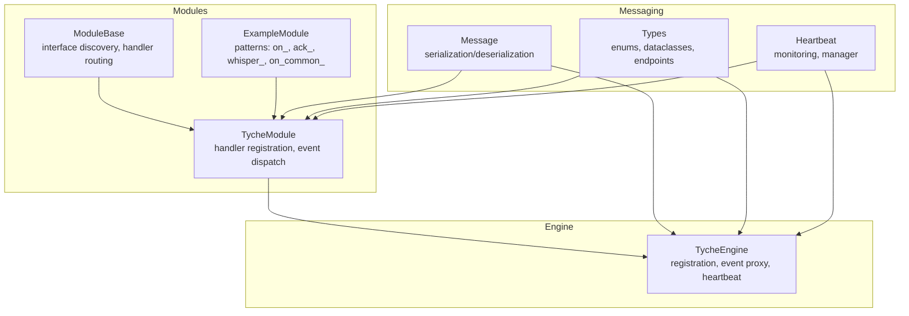
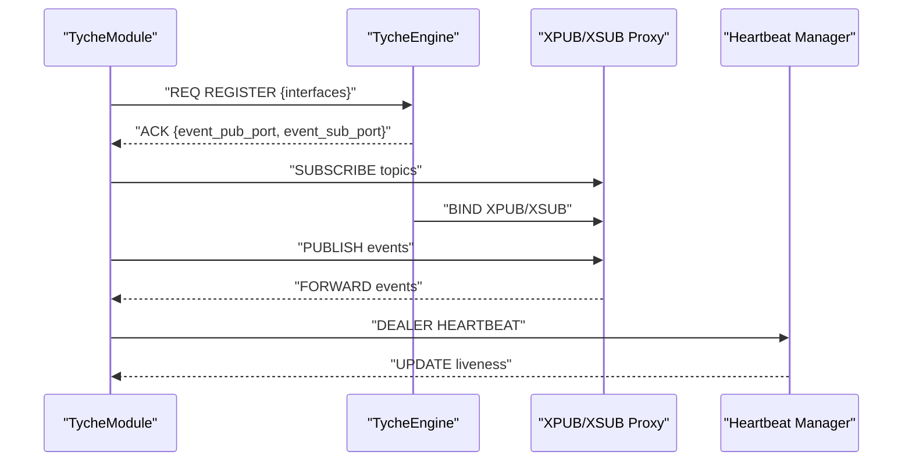
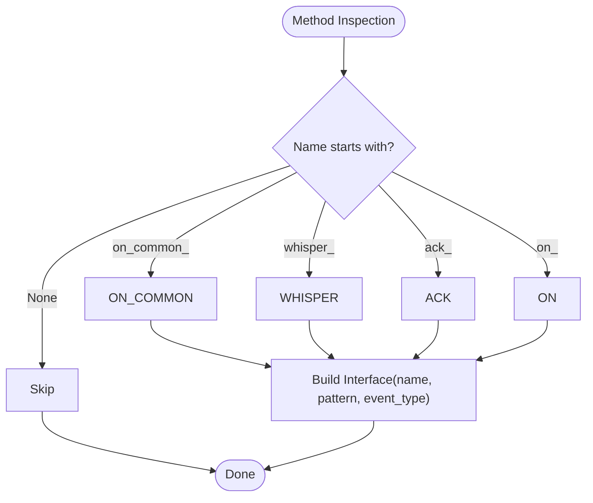
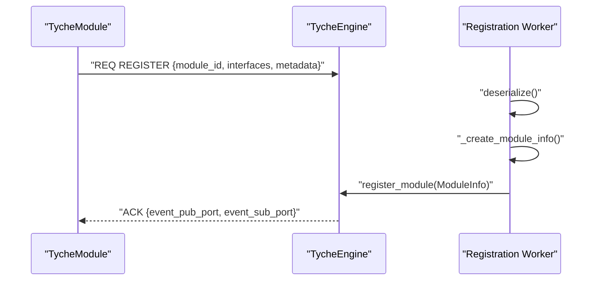
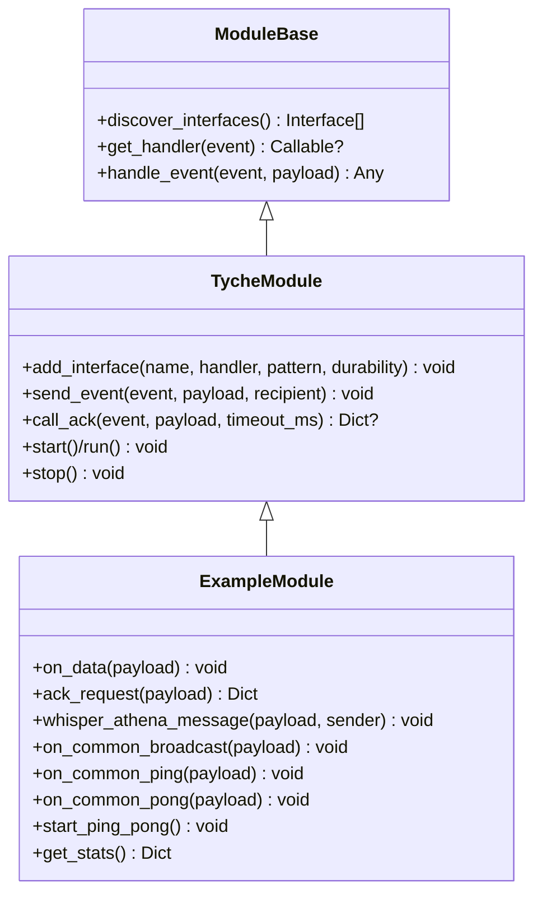
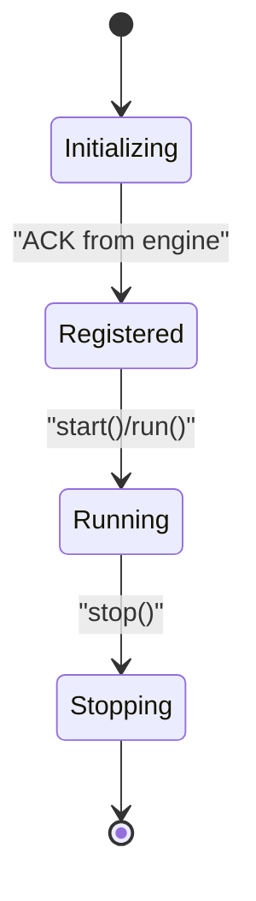
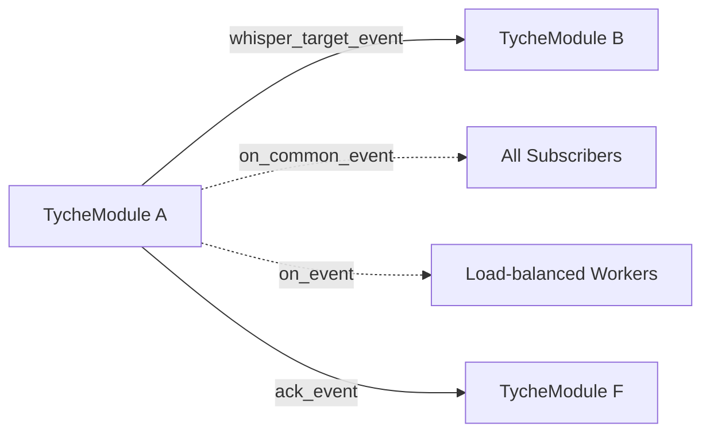
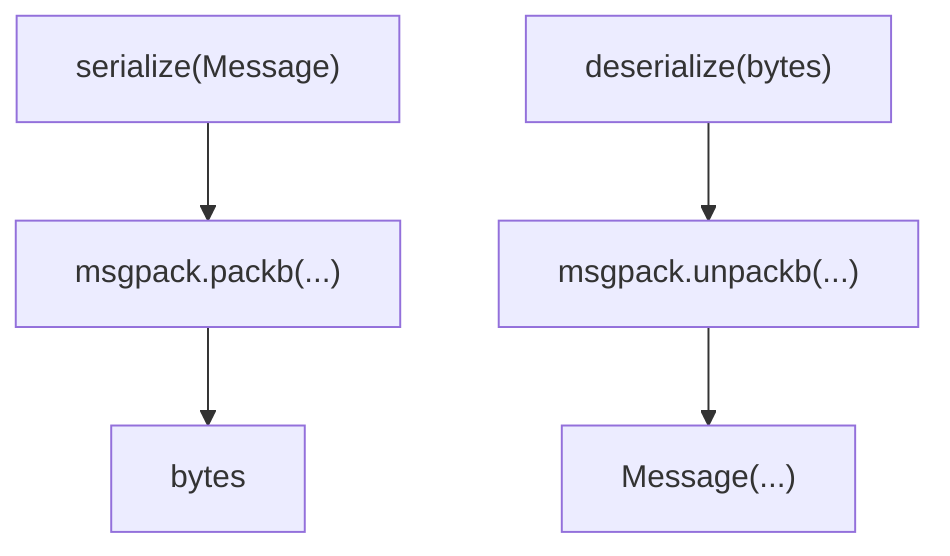
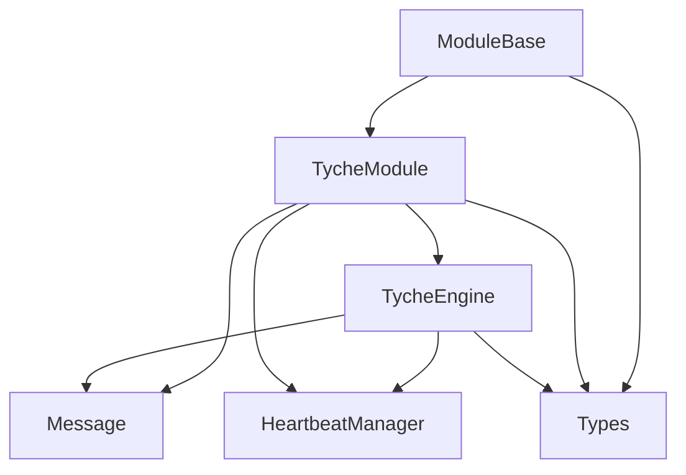

# Advanced Features

**Referenced Files in This Document**
- [engine.py](file://src/tyche/engine.py)
- [module.py](file://src/tyche/module.py)
- [module_base.py](file://src/tyche/module_base.py)
- [message.py](file://src/tyche/message.py)
- [types.py](file://src/tyche/types.py)
- [heartbeat.py](file://src/tyche/heartbeat.py)
- [example_module.py](file://src/tyche/example_module.py)
- [run_engine.py](file://examples/run_engine.py)
- [run_module.py](file://examples/run_module.py)
- [test_engine_module.py](file://tests/integration/test_engine_module.py)
- [test_module.py](file://tests/unit/test_module.py)
- [README.md](file://README.md)

## Update Summary
**Changes Made**
- Updated introduction to clarify this document represents consolidated advanced features content
- Enhanced documentation organization to reflect the consolidation from separate Advanced Features.md to Features.md
- Maintained comprehensive coverage of all advanced features while improving content organization
- Updated references to reflect the consolidated documentation structure

## Table of Contents
1. [Introduction](#introduction)
2. [Project Structure](#project-structure)
3. [Core Components](#core-components)
4. [Architecture Overview](#architecture-overview)
5. [Detailed Component Analysis](#detailed-component-analysis)
6. [Dependency Analysis](#dependency-analysis)
7. [Performance Considerations](#performance-considerations)
8. [Troubleshooting Guide](#troubleshooting-guide)
9. [Conclusion](#conclusion)
10. [Appendices](#appendices)

## Introduction
This document represents the consolidated advanced features documentation for Tyche Engine, encompassing the automatic interface discovery system, method naming conventions, interface registration, dynamic capability negotiation, custom event handler implementation, plugin-style extensions, module lifecycle hooks, advanced communication patterns, custom message types, integration with external systems, complex module implementations, custom protocol extensions, performance optimization techniques, advanced debugging strategies, profiling tools, and production monitoring approaches. 

**Updated** This document consolidates previously separate advanced features content into a comprehensive guide that maintains all technical details while improving organizational structure and accessibility.

The documentation provides guidance on extending the framework, creating custom modules, and implementing specialized communication patterns, serving as both a reference for existing users and a guide for new contributors to the Tyche Engine ecosystem.

## Project Structure
Tyche Engine is organized around a central engine and pluggable modules. The engine manages registration, event routing, and health monitoring. Modules implement handlers using standardized naming conventions and communicate via ZeroMQ sockets. Supporting components include message serialization, type definitions, heartbeat management, and example modules demonstrating advanced patterns.

**Diagram sources**
- [engine.py:25-350](file://src/tyche/engine.py#L25-L350)
- [module.py:28-401](file://src/tyche/module.py#L28-L401)
- [module_base.py:10-120](file://src/tyche/module_base.py#L10-L120)
- [example_module.py:19-167](file://src/tyche/example_module.py#L19-L167)
- [message.py:13-168](file://src/tyche/message.py#L13-L168)
- [types.py:14-102](file://src/tyche/types.py#L14-L102)
- [heartbeat.py:16-142](file://src/tyche/heartbeat.py#L16-L142)

**Section sources**
- [engine.py:25-350](file://src/tyche/engine.py#L25-L350)
- [module.py:28-401](file://src/tyche/module.py#L28-L401)
- [module_base.py:10-120](file://src/tyche/module_base.py#L10-L120)
- [example_module.py:19-167](file://src/tyche/example_module.py#L19-L167)
- [message.py:13-168](file://src/tyche/message.py#L13-L168)
- [types.py:14-102](file://src/tyche/types.py#L14-L102)
- [heartbeat.py:16-142](file://src/tyche/heartbeat.py#L16-L142)

## Core Components
- TycheEngine: Central broker handling registration, event proxy (XPUB/XSUB), heartbeat monitoring, and module lifecycle.
- TycheModule: Base module class implementing automatic interface discovery, handler registration, event publishing/subscribing, and heartbeat sending.
- ModuleBase: Abstract base defining naming conventions, auto-discovery, and handler routing.
- Message: Structured message with serialization/deserialization and envelope support.
- Types: Enumerations and dataclasses for endpoints, interface patterns, durability levels, message types, and module info.
- Heartbeat: Monitoring and manager for peer liveness using Paranoid Pirate pattern.

**Section sources**
- [engine.py:25-350](file://src/tyche/engine.py#L25-L350)
- [module.py:28-401](file://src/tyche/module.py#L28-L401)
- [module_base.py:10-120](file://src/tyche/module_base.py#L10-L120)
- [message.py:13-168](file://src/tyche/message.py#L13-L168)
- [types.py:14-102](file://src/tyche/types.py#L14-L102)
- [heartbeat.py:16-142](file://src/tyche/heartbeat.py#L16-L142)

## Architecture Overview
Tyche Engine uses ZeroMQ socket patterns for robust, scalable communication:
- Registration: REQ/ROUTER for one-shot handshake and interface negotiation.
- Event Routing: XPUB/XSUB proxy for pub-sub broadcasting.
- Load Balancing: DEALER/ROUTER for request-response and P2P channels.
- Heartbeat: PUB/SUB for health monitoring and failure detection.

**Diagram sources**
- [engine.py:121-213](file://src/tyche/engine.py#L121-L213)
- [module.py:200-254](file://src/tyche/module.py#L200-L254)
- [module.py:258-298](file://src/tyche/module.py#L258-L298)
- [heartbeat.py:91-142](file://src/tyche/heartbeat.py#L91-L142)

**Section sources**
- [engine.py:121-213](file://src/tyche/engine.py#L121-L213)
- [module.py:200-254](file://src/tyche/module.py#L200-L254)
- [module.py:258-298](file://src/tyche/module.py#L258-L298)
- [heartbeat.py:91-142](file://src/tyche/heartbeat.py#L91-L142)

## Detailed Component Analysis

### Automatic Interface Discovery System
- Method naming conventions:
  - on_{event}: Fire-and-forget, load-balanced.
  - ack_{event}: Must return ACK.
  - whisper_{target}_{event}: Direct P2P.
  - on_common_{event}: Broadcast to all subscribers.
- Auto-discovery scans methods and builds Interface definitions with pattern detection.
- Dynamic capability negotiation occurs during registration when the engine records interface mappings.

**Diagram sources**
- [module_base.py:48-84](file://src/tyche/module_base.py#L48-L84)

**Section sources**
- [module_base.py:10-120](file://src/tyche/module_base.py#L10-L120)
- [types.py:51-58](file://src/tyche/types.py#L51-L58)

### Interface Registration and Dynamic Capability Negotiation
- Modules register interfaces via a one-shot REQ/ROUTER handshake.
- Engine deserializes the registration payload, constructs ModuleInfo, and updates internal interface maps.
- The engine binds XPUB/XSUB endpoints for event routing and starts monitoring heartbeats.

**Diagram sources**
- [module.py:200-254](file://src/tyche/module.py#L200-L254)
- [engine.py:144-213](file://src/tyche/engine.py#L144-L213)

**Section sources**
- [module.py:200-254](file://src/tyche/module.py#L200-L254)
- [engine.py:144-213](file://src/tyche/engine.py#L144-L213)

### Custom Event Handler Implementation and Plugin-Style Extensions
- Handlers are registered by name; TycheModule subscribes to topics matching handler names.
- Direct P2P whisper handlers enable module-to-module communication without engine involvement.
- ExampleModule demonstrates all patterns and includes lifecycle hooks (stop with timer cleanup).

**Diagram sources**
- [module_base.py:10-120](file://src/tyche/module_base.py#L10-L120)
- [module.py:28-401](file://src/tyche/module.py#L28-L401)
- [example_module.py:19-167](file://src/tyche/example_module.py#L19-L167)

**Section sources**
- [module.py:258-373](file://src/tyche/module.py#L258-L373)
- [example_module.py:19-167](file://src/tyche/example_module.py#L19-L167)

### Module Lifecycle Hooks
- Initialization: ModuleBase auto-discovers interfaces; TycheModule sets up sockets and threads.
- Running: Threads handle registration, event receiving, and heartbeat sending.
- Stopping: Graceful shutdown closes sockets, cancels timers, and destroys context.

**Diagram sources**
- [module.py:116-197](file://src/tyche/module.py#L116-L197)
- [example_module.py:61-70](file://src/tyche/example_module.py#L61-L70)

**Section sources**
- [module.py:116-197](file://src/tyche/module.py#L116-L197)
- [example_module.py:61-70](file://src/tyche/example_module.py#L61-L70)

### Advanced Communication Patterns
- Fire-and-forget (on_): Load-balanced across workers.
- Request-response with ACK (ack_): Requires confirmation within timeout.
- Direct P2P (whisper_): DEALER/ROUTER channel between consenting modules.
- Broadcast (on_common_): Best-effort to all subscribers; no back-pressure protection.

**Diagram sources**
- [types.py:51-58](file://src/tyche/types.py#L51-L58)
- [module.py:301-373](file://src/tyche/module.py#L301-L373)

**Section sources**
- [types.py:51-58](file://src/tyche/types.py#L51-L58)
- [module.py:301-373](file://src/tyche/module.py#L301-L373)

### Custom Message Types and Serialization
- MessagePack serialization handles custom types (Decimal) and preserves enums.
- Envelope supports ZeroMQ routing envelopes with identity frames and routing stacks.

**Diagram sources**
- [message.py:69-111](file://src/tyche/message.py#L69-L111)

**Section sources**
- [message.py:13-168](file://src/tyche/message.py#L13-L168)

### Integration with External Systems
- Engine endpoints are configurable for registration, event, heartbeat, and acknowledgment.
- Example scripts demonstrate standalone engine and module processes with clear endpoint assignments.

**Section sources**
- [engine.py:34-54](file://src/tyche/engine.py#L34-L54)
- [run_engine.py:27-32](file://examples/run_engine.py#L27-L32)
- [run_module.py:28-31](file://examples/run_module.py#L28-L31)

### Complex Module Implementations
- ExampleModule showcases:
  - Multiple handler patterns.
  - Timers and lifecycle cleanup.
  - Ping-pong broadcast loop with randomized delays.
  - Statistics collection and reporting.

**Section sources**
- [example_module.py:19-167](file://src/tyche/example_module.py#L19-L167)

### Custom Protocol Extensions
- Extend InterfacePattern and MessageType to introduce new patterns and message types.
- Add new handler routing logic in ModuleBase.handle_event and TycheModule._dispatch as needed.

**Section sources**
- [types.py:51-74](file://src/tyche/types.py#L51-L74)
- [module_base.py:100-120](file://src/tyche/module_base.py#L100-L120)
- [module.py:283-298](file://src/tyche/module.py#L283-L298)

## Dependency Analysis
Tyche Engine components exhibit low coupling and high cohesion:
- Engine depends on types, message, and heartbeat modules.
- Module depends on engine endpoints, types, message, and heartbeat.
- ModuleBase provides reusable discovery and routing logic.
- ExampleModule demonstrates practical usage of the base classes.

**Diagram sources**
- [module_base.py:10-120](file://src/tyche/module_base.py#L10-L120)
- [module.py:28-401](file://src/tyche/module.py#L28-L401)
- [engine.py:25-350](file://src/tyche/engine.py#L25-L350)
- [message.py:13-168](file://src/tyche/message.py#L13-L168)
- [types.py:14-102](file://src/tyche/types.py#L14-L102)
- [heartbeat.py:91-142](file://src/tyche/heartbeat.py#L91-L142)

**Section sources**
- [module_base.py:10-120](file://src/tyche/module_base.py#L10-L120)
- [module.py:28-401](file://src/tyche/module.py#L28-L401)
- [engine.py:25-350](file://src/tyche/engine.py#L25-L350)
- [message.py:13-168](file://src/tyche/message.py#L13-L168)
- [types.py:14-102](file://src/tyche/types.py#L14-L102)
- [heartbeat.py:91-142](file://src/tyche/heartbeat.py#L91-L142)

## Performance Considerations
- Async persistence with lock-free ring buffer amortizes disk I/O costs.
- Durability levels trade-off latency and reliability:
  - BEST_EFFORT: zero persistence latency.
  - ASYNC_FLUSH: sub-microsecond persistence latency.
  - SYNC_FLUSH: millisecond-level persistence latency.
- Backpressure handling modes:
  - Drop oldest (research).
  - Block and alert (production).
  - Expand buffer (elastic).
- Recommended tuning:
  - Adjust ZeroMQ high-water marks for your workload.
  - Use broadcast sparingly for high-throughput scenarios.
  - Implement idempotency for ACK handlers.

## Troubleshooting Guide
- Registration failures:
  - Verify engine endpoints and network connectivity.
  - Check timeouts and logs for deserialization errors.
- Event delivery issues:
  - Confirm handler subscriptions and topic names.
  - Validate event proxy binding and routing.
- Heartbeat problems:
  - Ensure heartbeat sockets are configured and connected.
  - Monitor liveness thresholds and module expiration.
- Debugging strategies:
  - Enable logging for engine and module threads.
  - Use test harnesses to simulate multi-node interactions.
  - Inspect module registry and interface maps.

**Section sources**
- [engine.py:121-142](file://src/tyche/engine.py#L121-L142)
- [module.py:265-282](file://src/tyche/module.py#L265-L282)
- [heartbeat.py:125-133](file://src/tyche/heartbeat.py#L125-L133)
- [test_engine_module.py:14-41](file://tests/integration/test_engine_module.py#L14-L41)
- [test_engine_module.py:43-88](file://tests/integration/test_engine_module.py#L43-L88)

## Conclusion
Tyche Engine's advanced features center on a flexible, ZeroMQ-backed architecture supporting automatic interface discovery, dynamic capability negotiation, robust communication patterns, and scalable persistence. By adhering to naming conventions, leveraging the provided base classes, and following the outlined patterns, developers can build extensible, high-performance modules and integrate seamlessly with external systems.

**Updated** This consolidated documentation provides comprehensive coverage of all advanced features while maintaining the depth and technical accuracy required for both experienced users and newcomers to the Tyche Engine ecosystem.

## Appendices

### Method Naming Conventions Reference
- on_{event}: Fire-and-forget, load-balanced.
- ack_{event}: Must return ACK.
- whisper_{target}_{event}: Direct P2P.
- on_common_{event}: Broadcast to all subscribers.

**Section sources**
- [module_base.py:13-30](file://src/tyche/module_base.py#L13-L30)
- [types.py:51-58](file://src/tyche/types.py#L51-L58)

### Durability Levels Reference
- BEST_EFFORT: No persistence.
- ASYNC_FLUSH: Async write (default).
- SYNC_FLUSH: Sync write, confirmed.

**Section sources**
- [types.py:60-65](file://src/tyche/types.py#L60-L65)

### Example Scripts
- Start engine: [run_engine.py:27-32](file://examples/run_engine.py#L27-L32)
- Start module: [run_module.py:28-31](file://examples/run_module.py#L28-L31)

**Section sources**
- [run_engine.py:27-32](file://examples/run_engine.py#L27-L32)
- [run_module.py:28-31](file://examples/run_module.py#L28-L31)