# Claude Agent System

<cite>
**Referenced Files in This Document**
- [README.md](file://README.md)
- [CLAUDE.md](file://CLAUDE.md)
- [src/tyche/engine.py](file://src/tyche/engine.py)
- [src/tyche/module.py](file://src/tyche/module.py)
- [src/tyche/module_base.py](file://src/tyche/module_base.py)
- [src/tyche/heartbeat.py](file://src/tyche/heartbeat.py)
- [src/tyche/message.py](file://src/tyche/message.py)
- [src/tyche/types.py](file://src/tyche/types.py)
- [src/tyche/example_module.py](file://src/tyche/example_module.py)
- [examples/run_engine.py](file://examples/run_engine.py)
- [examples/run_module.py](file://examples/run_module.py)
- [wiki/Core Components/Claude Agent System.md](file://wiki/Core Components/Claude Agent System.md)
- [wiki/Architecture Overview/Architecture Overview.md](file://wiki/Architecture Overview/Architecture Overview.md)
- [wiki/Core Components/TycheEngine - Central Broker.md](file://wiki/Core Components/TycheEngine - Central Broker.md)
- [wiki/Core Components/TycheModule System.md](file://wiki/Core Components/TycheModule System.md)
</cite>

## Table of Contents
1. [Introduction](#introduction)
2. [Agent System Overview](#agent-system-overview)
3. [System Architecture](#system-architecture)
4. [Core Components](#core-components)
5. [Agent Collaboration Framework](#agent-collaboration-framework)
6. [Communication Patterns](#communication-patterns)
7. [Module Management](#module-management)
8. [Heartbeat and Reliability](#heartbeat-and-reliability)
9. [Message System](#message-system)
10. [Development Workflow](#development-workflow)
11. [Testing Strategy](#testing-strategy)
12. [Performance Characteristics](#performance-characteristics)
13. [Deployment Guide](#deployment-guide)
14. [Troubleshooting](#troubleshooting)
15. [Conclusion](#conclusion)

## Introduction
The Claude Agent System is a sophisticated distributed event-driven framework built on top of the Tyche Engine, designed to orchestrate multi-process applications through intelligent agent collaboration. This system combines the robust foundation of Tyche Engine with Claude-specific agent protocols to create a powerful platform for automated development workflows.

The framework leverages ZeroMQ as its messaging backbone, implementing advanced communication patterns including Request-Reply for module registration, Pub-Sub for event broadcasting, Pipeline for load-balanced work distribution, and Dealer-Router for direct peer-to-peer messaging. The system is architected around the concept of autonomous agents that can spawn, collaborate, and coordinate their activities according to predefined protocols and skill sets.

## Agent System Overview
The Claude Agent System extends the Tyche Engine's capabilities by introducing a structured framework for agent-based development. The system operates on several key principles:

### Agent Roles and Responsibilities
- **Architect Agent**: Creates and manages development plans, ensuring alignment with project goals
- **Implementer Agent**: Executes specific tasks and implements code changes according to approved plans
- **Code Reviewer Agent**: Validates implementation quality and ensures adherence to standards
- **Team Lead**: Oversees the entire development process and coordinates between agents

### Collaboration Protocols
The system enforces strict role separation with clear boundaries between different agent types. Each agent operates within its designated scope, preventing conflicts and maintaining accountability throughout the development lifecycle.

### Process Automation
Agents follow a standardized workflow that includes planning, implementation, review, and verification phases. This automation ensures consistent quality and reduces manual intervention requirements.

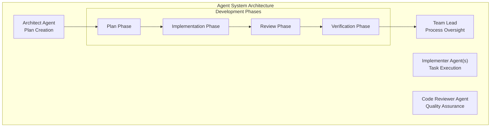
```mermaid
graph TB
subgraph "Agent System Architecture"
Architect["Architect Agent<br/>Plan Creation"]
Implementer["Implementer Agent(s)<br/>Task Execution"]
Reviewer["Code Reviewer Agent<br/>Quality Assurance"]
TeamLead["Team Lead<br/>Process Oversight"]
subgraph "Development Phases"
PlanPhase["Plan Phase"]
ImplPhase["Implementation Phase"]
ReviewPhase["Review Phase"]
VerifyPhase["Verification Phase"]
end
Architect --> PlanPhase
PlanPhase --> ImplPhase
ImplPhase --> ReviewPhase
ReviewPhase --> VerifyPhase
VerifyPhase --> TeamLead
end
```

**Diagram sources**
- [CLAUDE.md:34-46](file://CLAUDE.md#L34-L46)
- [CLAUDE.md:95-103](file://CLAUDE.md#L95-L103)

## System Architecture
The Claude Agent System builds upon the Tyche Engine's distributed architecture, adding intelligent agent coordination mechanisms. The system is designed for high availability and fault tolerance through multiple engine instances and robust communication patterns.

### Core Architecture Components

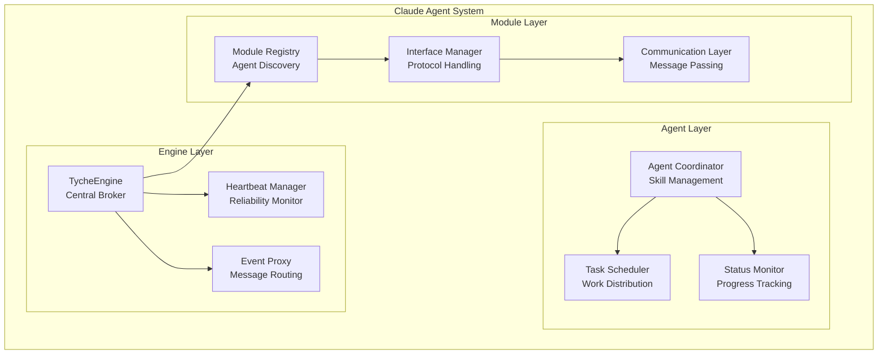
```mermaid
graph TB
subgraph "Claude Agent System"
subgraph "Engine Layer"
Engine["TycheEngine<br/>Central Broker"]
HeartbeatMgr["Heartbeat Manager<br/>Reliability Monitor"]
EventProxy["Event Proxy<br/>Message Routing"]
end
subgraph "Agent Layer"
AgentCoordinator["Agent Coordinator<br/>Skill Management"]
TaskScheduler["Task Scheduler<br/>Work Distribution"]
StatusMonitor["Status Monitor<br/>Progress Tracking"]
end
subgraph "Module Layer"
ModuleRegistry["Module Registry<br/>Agent Discovery"]
InterfaceManager["Interface Manager<br/>Protocol Handling"]
CommunicationLayer["Communication Layer<br/>Message Passing"]
end
Engine --> HeartbeatMgr
Engine --> EventProxy
AgentCoordinator --> TaskScheduler
AgentCoordinator --> StatusMonitor
Engine --> ModuleRegistry
ModuleRegistry --> InterfaceManager
InterfaceManager --> CommunicationLayer
end
```

**Diagram sources**
- [src/tyche/engine.py:25-350](file://src/tyche/engine.py#L25-L350)
- [src/tyche/heartbeat.py:91-142](file://src/tyche/heartbeat.py#L91-L142)
- [src/tyche/module.py:28-401](file://src/tyche/module.py#L28-L401)

### Communication Infrastructure
The system utilizes ZeroMQ for all inter-process communication, implementing specialized socket patterns for different use cases:

| Communication Pattern | ZeroMQ Pattern | Purpose | Agent Usage |
|----------------------|----------------|---------|-------------|
| Module Registration | Request-Reply | Agent discovery and interface negotiation | Agent initialization and capability exchange |
| Event Broadcasting | Pub-Sub | Cross-agent event propagation | Task coordination and status updates |
| Load Balancing | Pipeline | Work distribution among agents | Parallel task execution |
| Direct Messaging | Dealer-Router | Peer-to-peer agent communication | Specialized agent interactions |
| Heartbeat Monitoring | Pub-Sub | Health monitoring and failure detection | Agent liveness and reliability tracking |

**Section sources**
- [README.md:26-44](file://README.md#L26-L44)
- [src/tyche/engine.py:121-177](file://src/tyche/engine.py#L121-L177)

## Core Components
The Claude Agent System consists of several interconnected components that work together to enable intelligent agent collaboration and automated development workflows.

### Engine Component
The TycheEngine serves as the central coordinator for all agent activities, managing module registration, event routing, and heartbeat monitoring. It operates as a multi-threaded broker that handles various communication patterns simultaneously.

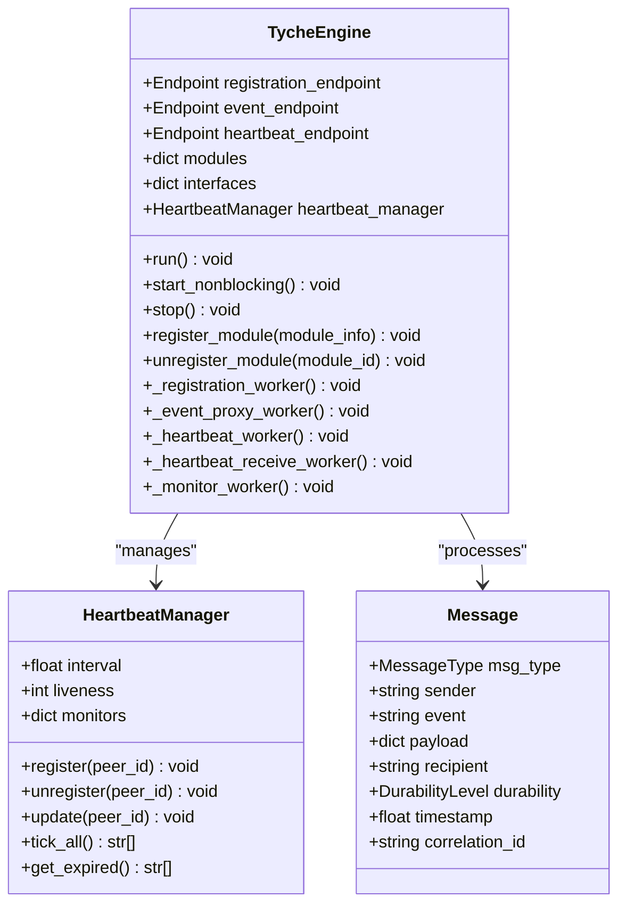
```mermaid
classDiagram
class TycheEngine {
+Endpoint registration_endpoint
+Endpoint event_endpoint
+Endpoint heartbeat_endpoint
+dict modules
+dict interfaces
+HeartbeatManager heartbeat_manager
+run() void
+start_nonblocking() void
+stop() void
+register_module(module_info) void
+unregister_module(module_id) void
+_registration_worker() void
+_event_proxy_worker() void
+_heartbeat_worker() void
+_heartbeat_receive_worker() void
+_monitor_worker() void
}
class HeartbeatManager {
+float interval
+int liveness
+dict monitors
+register(peer_id) void
+unregister(peer_id) void
+update(peer_id) void
+tick_all() str[]
+get_expired() str[]
}
class Message {
+MessageType msg_type
+string sender
+string event
+dict payload
+string recipient
+DurabilityLevel durability
+float timestamp
+string correlation_id
}
TycheEngine --> HeartbeatManager : "manages"
TycheEngine --> Message : "processes"
```

**Diagram sources**
- [src/tyche/engine.py:25-350](file://src/tyche/engine.py#L25-L350)
- [src/tyche/heartbeat.py:91-142](file://src/tyche/heartbeat.py#L91-L142)
- [src/tyche/message.py:13-35](file://src/tyche/message.py#L13-L35)

### Module Component
The TycheModule provides the foundation for individual agent implementations, handling registration with the engine, event subscription, and message dispatching. Each module can expose multiple interface patterns for different types of communication.

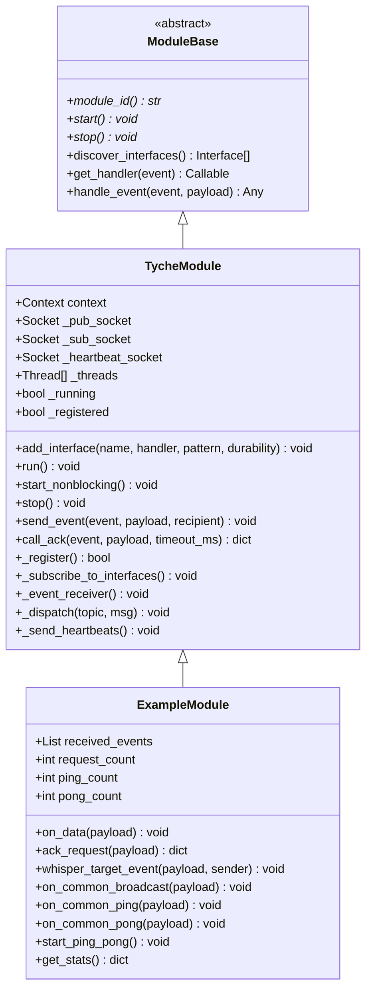
```mermaid
classDiagram
class ModuleBase {
<<abstract>>
+module_id() str*
+start() void*
+stop() void*
+discover_interfaces() Interface[]
+get_handler(event) Callable
+handle_event(event, payload) Any
}
class TycheModule {
+Context context
+Socket _pub_socket
+Socket _sub_socket
+Socket _heartbeat_socket
+Thread[] _threads
+bool _running
+bool _registered
+add_interface(name, handler, pattern, durability) void
+run() void
+start_nonblocking() void
+stop() void
+send_event(event, payload, recipient) void
+call_ack(event, payload, timeout_ms) dict
+_register() bool
+_subscribe_to_interfaces() void
+_event_receiver() void
+_dispatch(topic, msg) void
+_send_heartbeats() void
}
class ExampleModule {
+List received_events
+int request_count
+int ping_count
+int pong_count
+on_data(payload) void
+ack_request(payload) dict
+whisper_target_event(payload, sender) void
+on_common_broadcast(payload) void
+on_common_ping(payload) void
+on_common_pong(payload) void
+start_ping_pong() void
+get_stats() dict
}
ModuleBase <|-- TycheModule
TycheModule <|-- ExampleModule
```

**Diagram sources**
- [src/tyche/module_base.py:10-120](file://src/tyche/module_base.py#L10-L120)
- [src/tyche/module.py:28-401](file://src/tyche/module.py#L28-L401)
- [src/tyche/example_module.py:19-167](file://src/tyche/example_module.py#L19-L167)

**Section sources**
- [src/tyche/engine.py:25-350](file://src/tyche/engine.py#L25-L350)
- [src/tyche/module.py:28-401](file://src/tyche/module.py#L28-L401)
- [src/tyche/module_base.py:10-120](file://src/tyche/module_base.py#L10-L120)

## Agent Collaboration Framework
The Claude Agent System implements a sophisticated collaboration framework that enables multiple agents to work together towards common goals while maintaining clear role boundaries and accountability.

### Agent Team Composition
The system requires a minimum of three distinct agent types to function effectively:

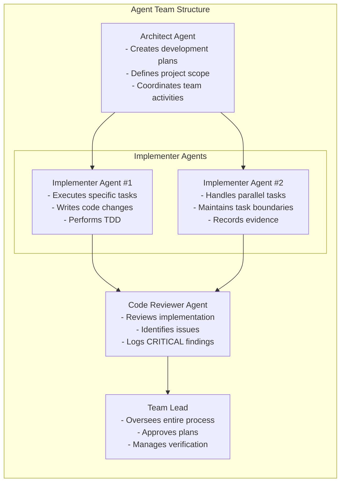
```mermaid
graph LR
subgraph "Agent Team Structure"
Architect["Architect Agent<br/>- Creates development plans<br/>- Defines project scope<br/>- Coordinates team activities"]
subgraph "Implementer Agents"
Impl1["Implementer Agent #1<br/>- Executes specific tasks<br/>- Writes code changes<br/>- Performs TDD"]
Impl2["Implementer Agent #2<br/>- Handles parallel tasks<br/>- Maintains task boundaries<br/>- Records evidence"]
end
Reviewer["Code Reviewer Agent<br/>- Reviews implementation<br/>- Identifies issues<br/>- Logs CRITICAL findings"]
TeamLead["Team Lead<br/>- Oversees entire process<br/>- Approves plans<br/>- Manages verification"]
end
Architect --> Impl1
Architect --> Impl2
Impl1 --> Reviewer
Impl2 --> Reviewer
Reviewer --> TeamLead
```

**Diagram sources**
- [CLAUDE.md:95-103](file://CLAUDE.md#L95-L103)
- [CLAUDE.md:146-169](file://CLAUDE.md#L146-L169)

### Skill-Based Agent Capabilities
Agents operate with specific skill sets that determine their capabilities and responsibilities:

| Skill Category | Agent Type | Required Skills | Responsibilities |
|----------------|------------|-----------------|------------------|
| Planning | Architect Agent | `superpowers:writing-plans` | Create development plans, define scope, coordinate team |
| Implementation | Implementer Agent | `superpowers:test-driven-development` | Execute tasks, write code, maintain evidence |
| Quality | Code Reviewer Agent | `superpowers:requesting-code-review` | Review implementation, identify issues, maintain logs |
| Leadership | Team Lead | `superpowers:subagent-driven-development` | Oversee process, approve plans, manage verification |

### Process Flow
The agent collaboration follows a structured workflow that ensures quality and accountability:

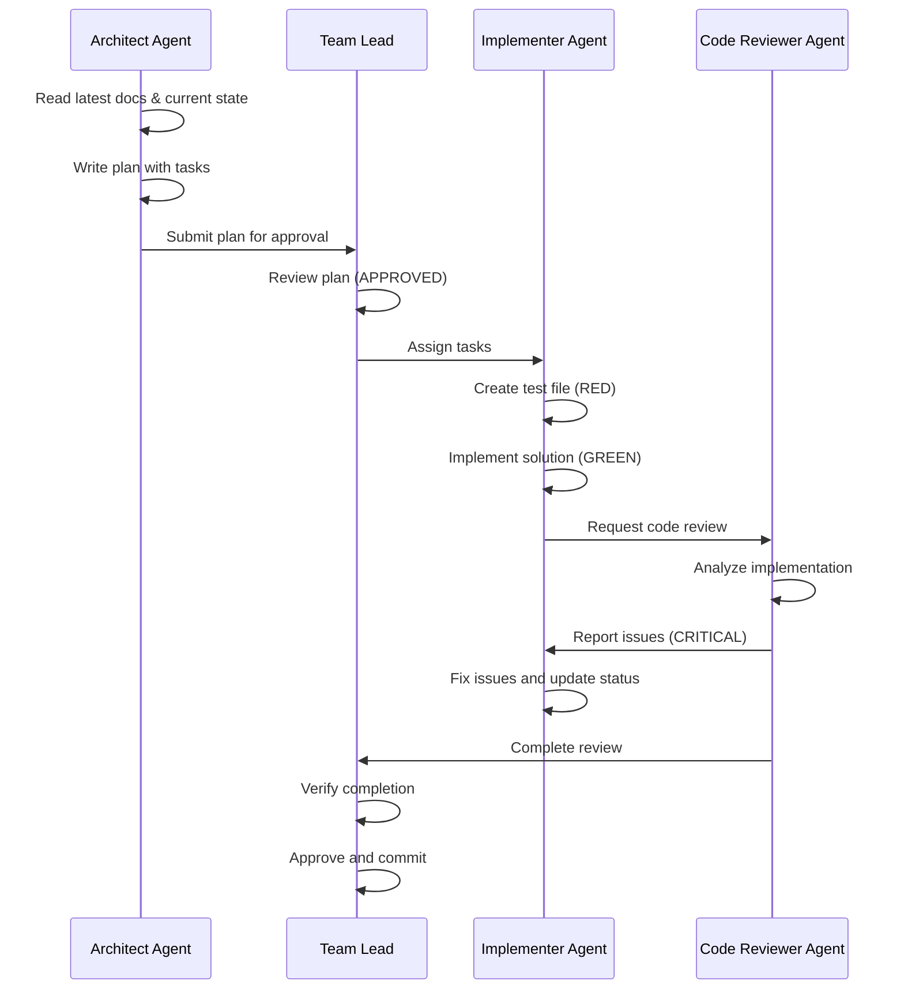
```mermaid
sequenceDiagram
participant Architect as Architect Agent
participant TeamLead as Team Lead
participant Implementer as Implementer Agent
participant Reviewer as Code Reviewer Agent
Architect->>Architect : Read latest docs & current state
Architect->>Architect : Write plan with tasks
Architect->>TeamLead : Submit plan for approval
TeamLead->>TeamLead : Review plan (APPROVED)
TeamLead->>Implementer : Assign tasks
Implementer->>Implementer : Create test file (RED)
Implementer->>Implementer : Implement solution (GREEN)
Implementer->>Reviewer : Request code review
Reviewer->>Reviewer : Analyze implementation
Reviewer->>Implementer : Report issues (CRITICAL)
Implementer->>Implementer : Fix issues and update status
Reviewer->>TeamLead : Complete review
TeamLead->>TeamLead : Verify completion
TeamLead->>TeamLead : Approve and commit
```

**Diagram sources**
- [CLAUDE.md:72-84](file://CLAUDE.md#L72-L84)
- [CLAUDE.md:185-194](file://CLAUDE.md#L185-L194)

**Section sources**
- [CLAUDE.md:34-46](file://CLAUDE.md#L34-L46)
- [CLAUDE.md:95-103](file://CLAUDE.md#L95-L103)
- [CLAUDE.md:146-169](file://CLAUDE.md#L146-L169)

## Communication Patterns
The Claude Agent System implements sophisticated communication patterns that enable efficient agent coordination and message passing. These patterns are built on ZeroMQ's reliable socket abstractions and extended with agent-specific protocols.

### Event-Driven Communication
Agents communicate primarily through events, enabling loose coupling and asynchronous processing:

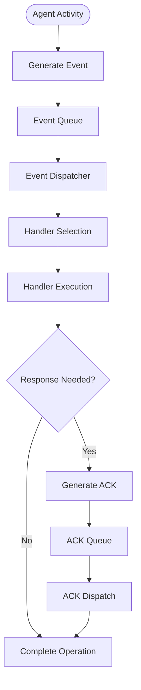
```mermaid
flowchart TD
Start([Agent Activity]) --> EventGen["Generate Event"]
EventGen --> EventQueue["Event Queue"]
EventQueue --> EventDispatch["Event Dispatcher"]
EventDispatch --> HandlerSelect["Handler Selection"]
HandlerSelect --> HandlerExec["Handler Execution"]
HandlerExec --> ResponseCheck{"Response Needed?"}
ResponseCheck --> |Yes| AckGen["Generate ACK"]
ResponseCheck --> |No| Complete["Complete Operation"]
AckGen --> AckQueue["ACK Queue"]
AckQueue --> AckDispatch["ACK Dispatch"]
AckDispatch --> Complete
```

**Diagram sources**
- [src/tyche/module.py:283-298](file://src/tyche/module.py#L283-L298)
- [src/tyche/message.py:13-35](file://src/tyche/message.py#L13-L35)

### Interface Patterns
The system supports multiple interface patterns that agents can use for different types of communication:

| Interface Pattern | Method Prefix | Communication Type | Use Cases |
|------------------|---------------|-------------------|-----------|
| `on_{event}` | `on_` | Fire-and-forget | Background processing, telemetry, logging |
| `ack_{event}` | `ack_` | Request-response | Critical operations, confirmations |
| `whisper_{target}_{event}` | `whisper_` | Direct P2P | Private agent-to-agent communication |
| `on_common_{event}` | `on_common_` | Broadcast | Consensus, announcements, state updates |

### Message Serialization
All agent communications use MessagePack serialization for efficient binary encoding:

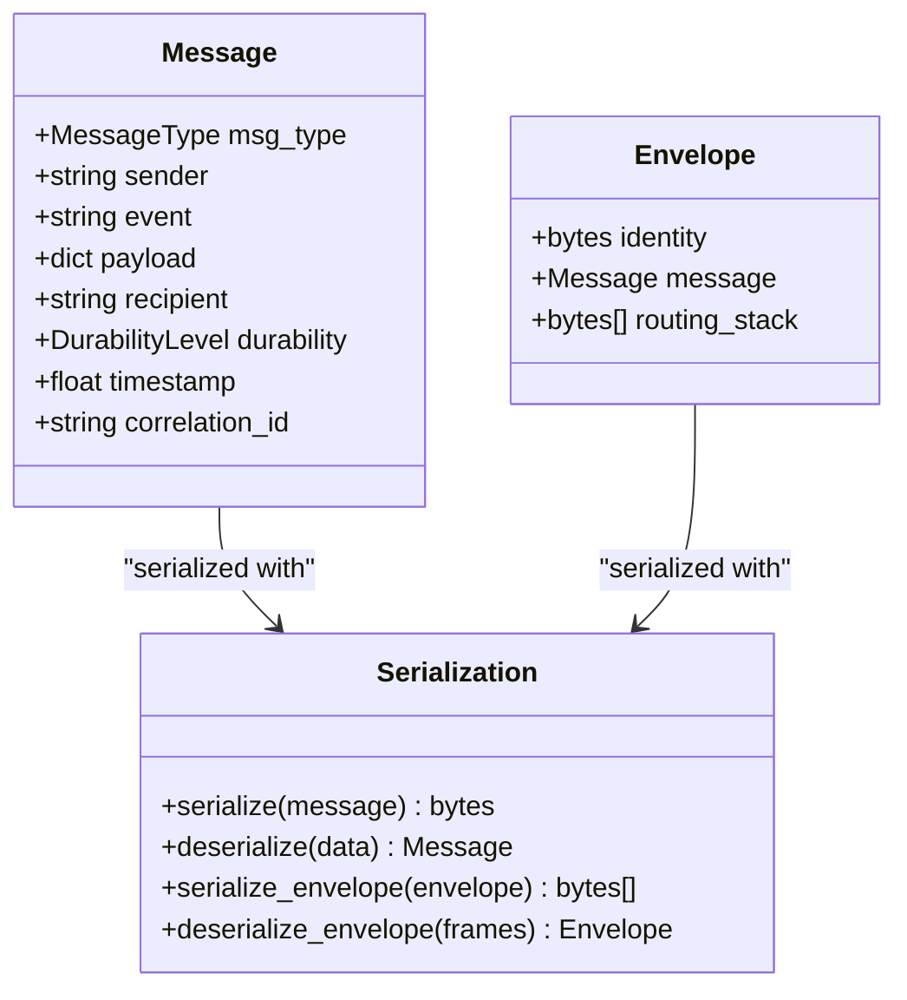
```mermaid
classDiagram
class Message {
+MessageType msg_type
+string sender
+string event
+dict payload
+string recipient
+DurabilityLevel durability
+float timestamp
+string correlation_id
}
class Envelope {
+bytes identity
+Message message
+bytes[] routing_stack
}
class Serialization {
+serialize(message) bytes
+deserialize(data) Message
+serialize_envelope(envelope) bytes[]
+deserialize_envelope(frames) Envelope
}
Message --> Serialization : "serialized with"
Envelope --> Serialization : "serialized with"
```

**Diagram sources**
- [src/tyche/message.py:13-168](file://src/tyche/message.py#L13-L168)

**Section sources**
- [src/tyche/module.py:283-298](file://src/tyche/module.py#L283-L298)
- [src/tyche/message.py:13-168](file://src/tyche/message.py#L13-L168)

## Module Management
The Claude Agent System provides comprehensive module management capabilities that enable dynamic agent discovery, registration, and lifecycle management.

### Module Lifecycle

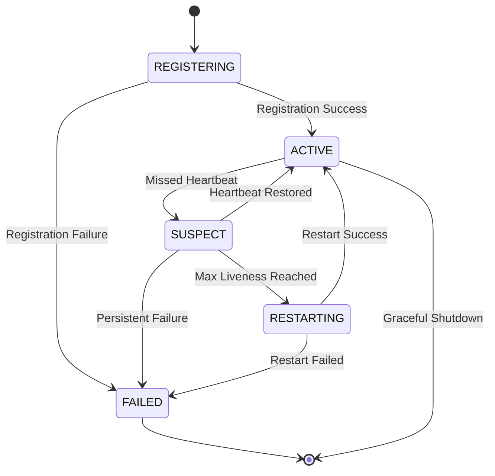
```mermaid
stateDiagram-v2
[*] --> REGISTERING
REGISTERING --> ACTIVE : Registration Success
REGISTERING --> FAILED : Registration Failure
ACTIVE --> SUSPECT : Missed Heartbeat
SUSPECT --> ACTIVE : Heartbeat Restored
SUSPECT --> RESTARTING : Max Liveness Reached
SUSPECT --> FAILED : Persistent Failure
RESTARTING --> ACTIVE : Restart Success
RESTARTING --> FAILED : Restart Failed
FAILED --> [*]
ACTIVE --> [*] : Graceful Shutdown
```

**Diagram sources**
- [README.md:225-247](file://README.md#L225-L247)
- [src/tyche/engine.py:341-350](file://src/tyche/engine.py#L341-L350)

### Registration Protocol
The module registration process establishes bidirectional communication channels and interface discovery:

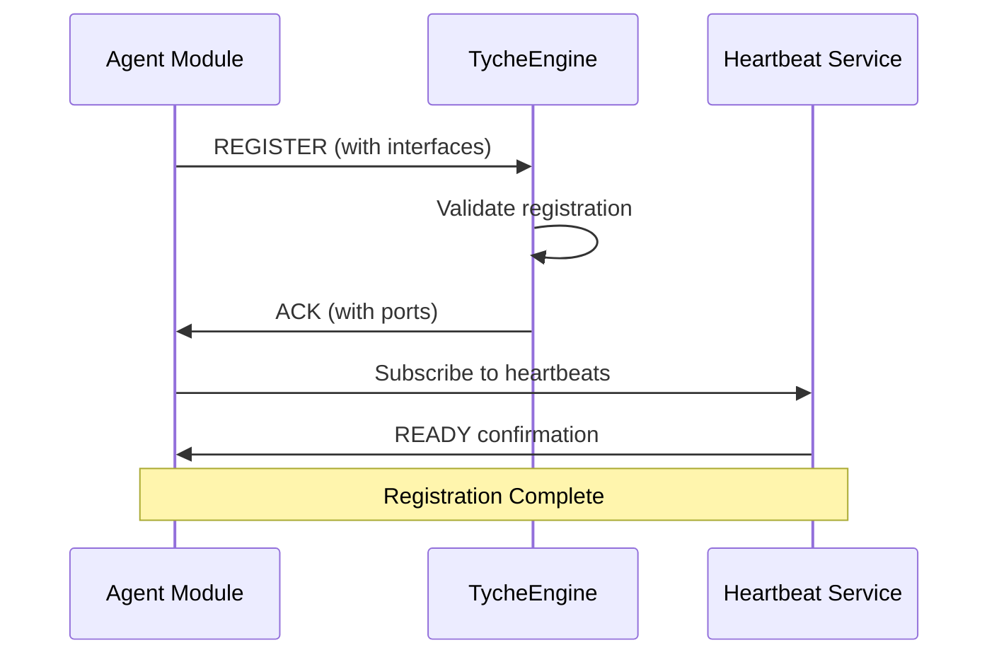
```mermaid
sequenceDiagram
participant Module as Agent Module
participant Engine as TycheEngine
participant Heartbeat as Heartbeat Service
Module->>Engine : REGISTER (with interfaces)
Engine->>Engine : Validate registration
Engine->>Module : ACK (with ports)
Module->>Heartbeat : Subscribe to heartbeats
Heartbeat->>Module : READY confirmation
Note over Module,Heartbeat : Registration Complete
```

**Diagram sources**
- [README.md:210-222](file://README.md#L210-L222)
- [src/tyche/engine.py:144-177](file://src/tyche/engine.py#L144-L177)

### Interface Discovery
Agents can automatically discover their interfaces through method naming conventions:

| Method Pattern | Interface Type | Durability Level | Description |
|----------------|----------------|------------------|-------------|
| `on_{event}` | ON | ASYNC_FLUSH | Fire-and-forget event handlers |
| `ack_{event}` | ACK | ASYNC_FLUSH | Request-response handlers |
| `whisper_{target}_{event}` | WHISPER | ASYNC_FLUSH | Direct peer-to-peer communication |
| `on_common_{event}` | ON_COMMON | ASYNC_FLUSH | Broadcast event handlers |

**Section sources**
- [src/tyche/module_base.py:48-84](file://src/tyche/module_base.py#L48-L84)
- [src/tyche/engine.py:200-235](file://src/tyche/engine.py#L200-L235)

## Heartbeat and Reliability
The Claude Agent System implements the Paranoid Pirate pattern for reliable heartbeat monitoring, ensuring system resilience and automatic failure detection.

### Heartbeat Architecture

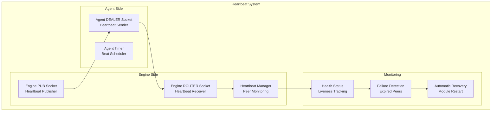
```mermaid
graph TB
subgraph "Heartbeat System"
subgraph "Engine Side"
EnginePub["Engine PUB Socket<br/>Heartbeat Publisher"]
HBManager["Heartbeat Manager<br/>Peer Monitoring"]
EngineRouter["Engine ROUTER Socket<br/>Heartbeat Receiver"]
end
subgraph "Agent Side"
AgentDealer["Agent DEALER Socket<br/>Heartbeat Sender"]
AgentTimer["Agent Timer<br/>Beat Scheduler"]
end
subgraph "Monitoring"
HealthCheck["Health Status<br/>Liveness Tracking"]
FailureDetection["Failure Detection<br/>Expired Peers"]
Recovery["Automatic Recovery<br/>Module Restart"]
end
end
AgentDealer --> EngineRouter
EnginePub --> AgentDealer
EngineRouter --> HBManager
HBManager --> HealthCheck
HealthCheck --> FailureDetection
FailureDetection --> Recovery
```

**Diagram sources**
- [src/tyche/heartbeat.py:16-142](file://src/tyche/heartbeat.py#L16-L142)
- [src/tyche/engine.py:281-350](file://src/tyche/engine.py#L281-L350)

### Heartbeat Protocol Details
The system uses configurable heartbeat intervals and liveness thresholds to detect and recover from failures:

| Parameter | Value | Description |
|-----------|--------|-------------|
| Heartbeat Interval | 1.0 seconds | Frequency of heartbeat transmission |
| Liveness Threshold | 3 missed beats | Maximum tolerated missed heartbeats |
| Grace Period | Double liveness | Extended timeout for initial registration |
| Timeout Calculation | 3 × interval | Connection timeout duration |

### Failure Recovery Mechanisms

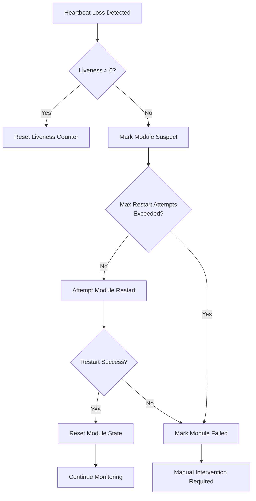
```mermaid
flowchart TD
HeartbeatLoss["Heartbeat Loss Detected"] --> CheckLiveness{"Liveness > 0?"}
CheckLiveness --> |Yes| ResetLiveness["Reset Liveness Counter"]
CheckLiveness --> |No| MarkSuspect["Mark Module Suspect"]
MarkSuspect --> CheckRestart{"Max Restart Attempts<br/>Exceeded?"}
CheckRestart --> |No| RestartModule["Attempt Module Restart"]
CheckRestart --> |Yes| MarkFailed["Mark Module Failed"]
RestartModule --> RestartSuccess{"Restart Success?"}
RestartSuccess --> |Yes| ResetState["Reset Module State"]
RestartSuccess --> |No| MarkFailed
ResetState --> Monitor["Continue Monitoring"]
MarkFailed --> ManualIntervention["Manual Intervention Required"]
```

**Diagram sources**
- [README.md:290-299](file://README.md#L290-L299)
- [src/tyche/heartbeat.py:125-133](file://src/tyche/heartbeat.py#L125-L133)

**Section sources**
- [src/tyche/heartbeat.py:16-142](file://src/tyche/heartbeat.py#L16-L142)
- [README.md:248-279](file://README.md#L248-L279)

## Message System
The Claude Agent System implements a comprehensive message system that supports efficient serialization, routing, and delivery guarantees across the distributed agent network.

### Message Structure
All messages in the system follow a standardized structure that supports various communication patterns and reliability requirements:

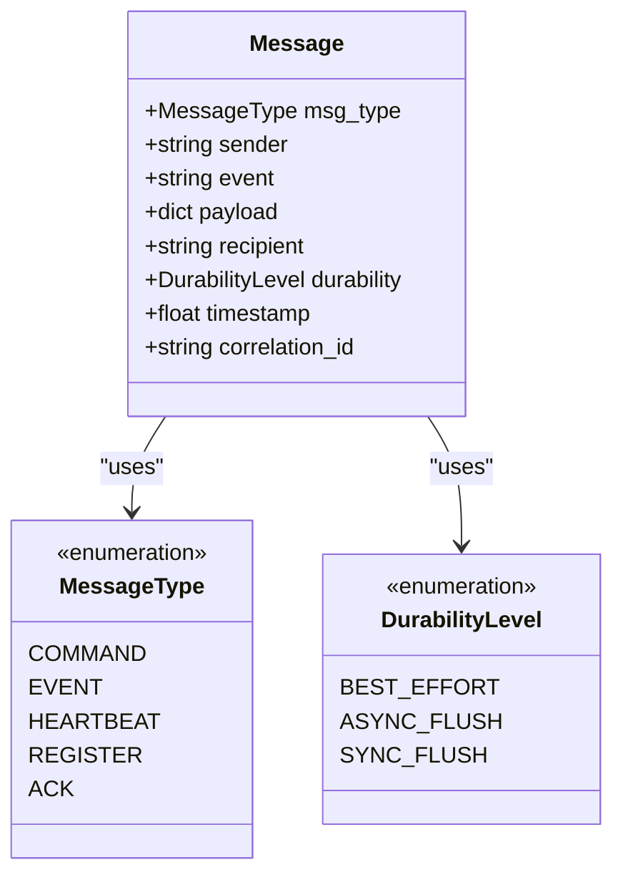
```mermaid
classDiagram
class Message {
+MessageType msg_type
+string sender
+string event
+dict payload
+string recipient
+DurabilityLevel durability
+float timestamp
+string correlation_id
}
class MessageType {
<<enumeration>>
COMMAND
EVENT
HEARTBEAT
REGISTER
ACK
}
class DurabilityLevel {
<<enumeration>>
BEST_EFFORT
ASYNC_FLUSH
SYNC_FLUSH
}
Message --> MessageType : "uses"
Message --> DurabilityLevel : "uses"
```

**Diagram sources**
- [src/tyche/message.py:13-112](file://src/tyche/message.py#L13-L112)
- [src/tyche/types.py:67-74](file://src/tyche/types.py#L67-L74)
- [src/tyche/types.py:60-65](file://src/tyche/types.py#L60-L65)

### Serialization Strategy
The system uses MessagePack for efficient binary serialization with special handling for Python-specific types:

| Data Type | Serialization Method | Notes |
|-----------|---------------------|-------|
| Basic Types | Native MessagePack | Strings, numbers, booleans |
| Decimal | Custom Encoder | Preserves precision |
| Enum | Value Extraction | Enum values stored as primitives |
| Bytes | UTF-8 Decoding | Binary data handled safely |

### Message Routing
Messages are routed through the system using ZeroMQ's advanced socket patterns, with different routing strategies for different message types:

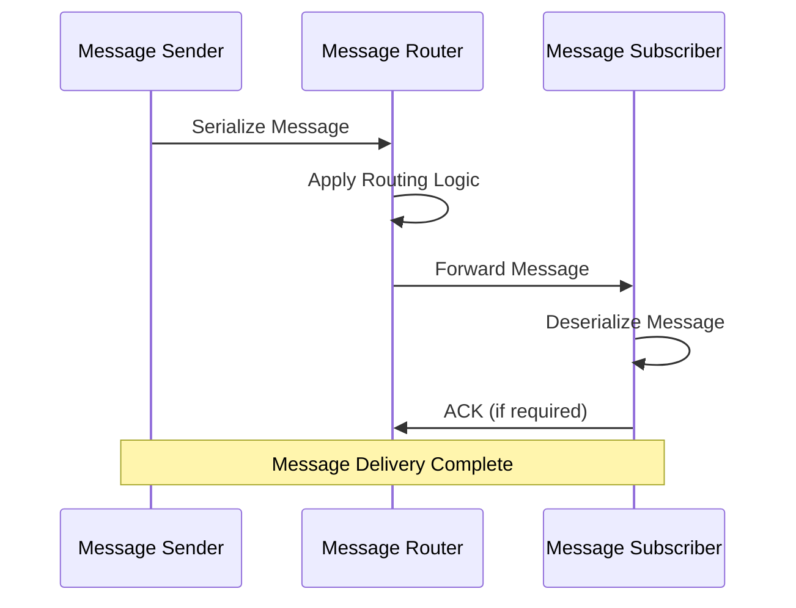
```mermaid
sequenceDiagram
participant Sender as Message Sender
participant Router as Message Router
participant Subscriber as Message Subscriber
Sender->>Router : Serialize Message
Router->>Router : Apply Routing Logic
Router->>Subscriber : Forward Message
Subscriber->>Subscriber : Deserialize Message
Subscriber->>Router : ACK (if required)
Note over Sender,Subscriber : Message Delivery Complete
```

**Diagram sources**
- [src/tyche/message.py:69-112](file://src/tyche/message.py#L69-L112)
- [src/tyche/module.py:265-298](file://src/tyche/module.py#L265-L298)

**Section sources**
- [src/tyche/message.py:13-168](file://src/tyche/message.py#L13-L168)
- [src/tyche/module.py:265-298](file://src/tyche/module.py#L265-L298)

## Development Workflow
The Claude Agent System implements a structured development workflow that ensures quality, accountability, and efficient collaboration between agents.

### Planning Phase
The planning phase establishes the foundation for development work through systematic documentation and approval processes:

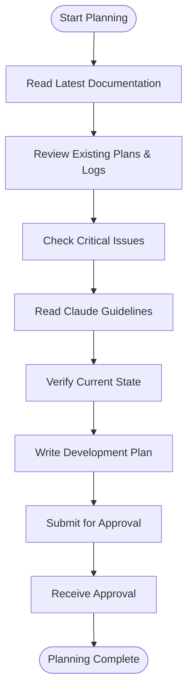
```mermaid
flowchart TD
Start([Start Planning]) --> ReadDocs["Read Latest Documentation"]
ReadDocs --> ReviewExisting["Review Existing Plans & Logs"]
ReviewExisting --> CheckCritical["Check Critical Issues"]
CheckCritical --> ReadClaudeDoc["Read Claude Guidelines"]
ReadClaudeDoc --> CheckState["Verify Current State"]
CheckState --> WritePlan["Write Development Plan"]
WritePlan --> SubmitApproval["Submit for Approval"]
SubmitApproval --> GetApproval["Receive Approval"]
GetApproval --> End([Planning Complete])
```

**Diagram sources**
- [CLAUDE.md:72-84](file://CLAUDE.md#L72-L84)
- [CLAUDE.md:85-94](file://CLAUDE.md#L85-L94)

### Implementation Phase
The implementation phase follows Test-Driven Development (TDD) principles with strict task boundaries and evidence collection:

| Phase | Requirements | Evidence |
|-------|-------------|----------|
| RED | Create test file first | Test fails with compile/assertion error |
| GREEN | Implement solution | Test passes with expected behavior |
| Refactor | Improve code quality | Tests still pass, code improved |

### Review and Verification
The review process ensures code quality and adherence to standards through systematic analysis and testing:

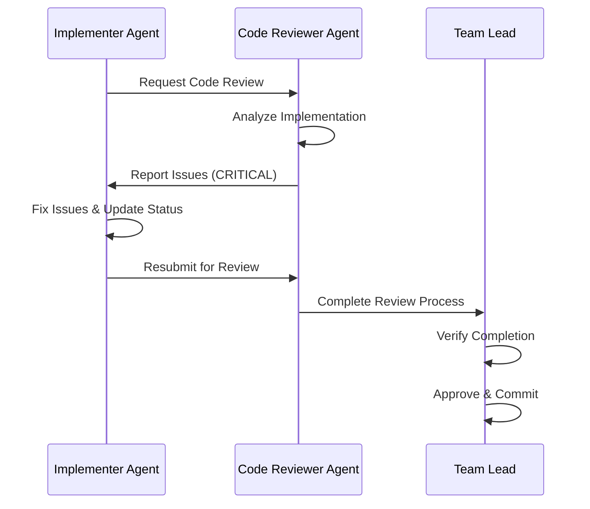
```mermaid
sequenceDiagram
participant Implementer as Implementer Agent
participant Reviewer as Code Reviewer Agent
participant TeamLead as Team Lead
Implementer->>Reviewer : Request Code Review
Reviewer->>Reviewer : Analyze Implementation
Reviewer->>Implementer : Report Issues (CRITICAL)
Implementer->>Implementer : Fix Issues & Update Status
Implementer->>Reviewer : Resubmit for Review
Reviewer->>TeamLead : Complete Review Process
TeamLead->>TeamLead : Verify Completion
TeamLead->>TeamLead : Approve & Commit
```

**Diagram sources**
- [CLAUDE.md:112-132](file://CLAUDE.md#L112-L132)
- [CLAUDE.md:185-194](file://CLAUDE.md#L185-L194)

**Section sources**
- [CLAUDE.md:72-94](file://CLAUDE.md#L72-L94)
- [CLAUDE.md:104-132](file://CLAUDE.md#L104-L132)
- [CLAUDE.md:185-194](file://CLAUDE.md#L185-L194)

## Testing Strategy
The Claude Agent System employs a comprehensive testing strategy that covers unit testing, integration testing, and performance validation to ensure system reliability and quality.

### Test Categories and Requirements

| Test Category | Location | Requirements | Purpose |
|---------------|----------|--------------|---------|
| Unit Tests | `tests/unit/` | ≥80% line coverage, mock external deps, run <5s | Individual component validation |
| Integration Tests | `tests/integration/` | Full stack minus external venues, real ZeroMQ | End-to-end system validation |
| Performance Tests | `tests/perf/` | p99 latency < 10μs for dispatch path | Performance benchmarking |
| Property Tests | `tests/property/` | Serialization round-trips, hypothesis testing | Correctness validation |

### Test Coverage Requirements
The system enforces strict coverage requirements to ensure comprehensive testing:

| Requirement | Standard | New Code | Regression Policy |
|-------------|----------|----------|-------------------|
| Minimum Coverage | 80% | ≥90% | >2% blocks commit |
| Exclusions | `if __name__ == "__main__"` blocks | Type-checking imports | Not counted in coverage |

### Testing Examples
The system includes practical testing examples that demonstrate proper testing patterns:

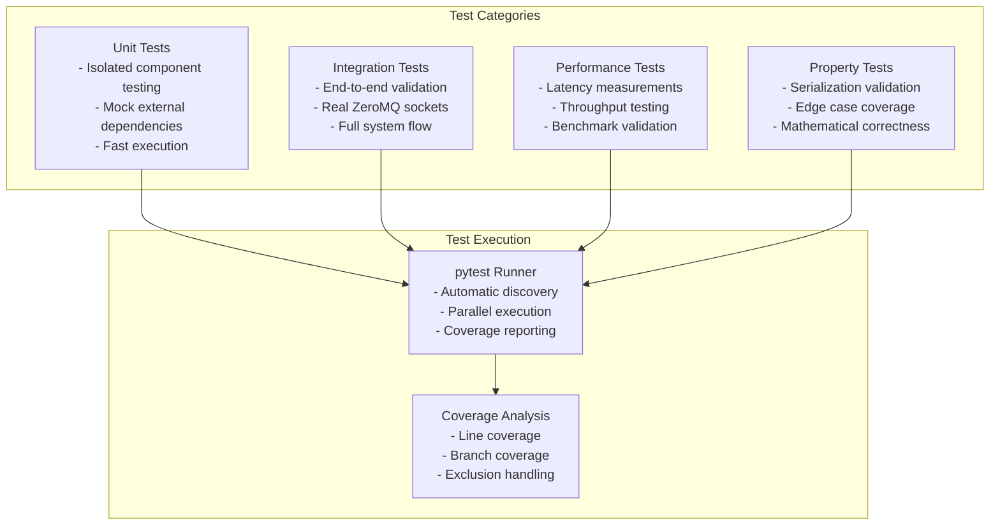
```mermaid
graph TB
subgraph "Test Categories"
UnitTests["Unit Tests<br/>- Isolated component testing<br/>- Mock external dependencies<br/>- Fast execution"]
IntegrationTests["Integration Tests<br/>- End-to-end validation<br/>- Real ZeroMQ sockets<br/>- Full system flow"]
PerfTests["Performance Tests<br/>- Latency measurements<br/>- Throughput testing<br/>- Benchmark validation"]
PropTests["Property Tests<br/>- Serialization validation<br/>- Edge case coverage<br/>- Mathematical correctness"]
end
subgraph "Test Execution"
PyTest["pytest Runner<br/>- Automatic discovery<br/>- Parallel execution<br/>- Coverage reporting"]
Coverage["Coverage Analysis<br/>- Line coverage<br/>- Branch coverage<br/>- Exclusion handling"]
end
UnitTests --> PyTest
IntegrationTests --> PyTest
PerfTests --> PyTest
PropTests --> PyTest
PyTest --> Coverage
```

**Diagram sources**
- [pyproject.toml:25-35](file://pyproject.toml#L25-L35)
- [pyproject.toml:51-59](file://pyproject.toml#L51-L59)

**Section sources**
- [pyproject.toml:25-35](file://pyproject.toml#L25-L35)
- [pyproject.toml:51-59](file://pyproject.toml#L51-L59)

## Performance Characteristics
The Claude Agent System is optimized for high-performance distributed computing with specific targets for latency, throughput, and reliability metrics.

### Performance Targets
| Metric | Target | Notes |
|--------|--------|-------|
| Hot Path Latency | <10μs | Python + ZeroMQ inproc |
| Persistence Latency | 100ms (batched) | Amortized via batching |
| Recovery Time | <1s | From WAL checkpoint |
| Backtest Throughput | >100K events/sec | Limited by CPU, not I/O |

### Scalability Guidelines
The system provides specific guidelines for scaling different aspects of the agent collaboration framework:

| Scenario | Solution | Rationale |
|----------|----------|-----------|
| High Event Throughput | Shard by event type across Engine instances | Distribute load horizontally |
| Many Homogeneous Workers | Increase Engine PUSH socket HWM | Better back-pressure handling |
| Geographic Distribution | Engine instances per region | Reduce network latency |
| Strict Ordering | Partition by key to single worker | Ensure deterministic processing |
| Exactly-once Semantics | Implement idempotency + async WAL | Combine reliability patterns |

### Resource Management
The system implements efficient resource management strategies to optimize performance:

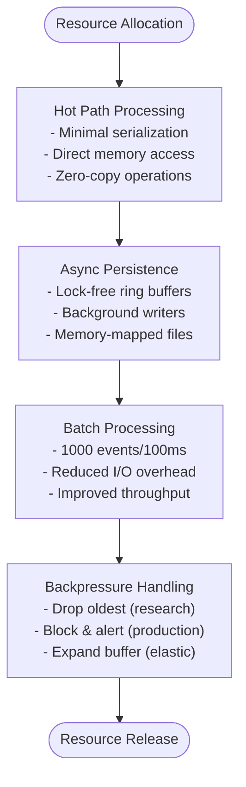
```mermaid
flowchart TD
ResourceStart([Resource Allocation]) --> HotPath["Hot Path Processing<br/>- Minimal serialization<br/>- Direct memory access<br/>- Zero-copy operations"]
HotPath --> AsyncPersistence["Async Persistence<br/>- Lock-free ring buffers<br/>- Background writers<br/>- Memory-mapped files"]
AsyncPersistence --> BatchProcessing["Batch Processing<br/>- 1000 events/100ms<br/>- Reduced I/O overhead<br/>- Improved throughput"]
BatchProcessing --> Backpressure["Backpressure Handling<br/>- Drop oldest (research)<br/>- Block & alert (production)<br/>- Expand buffer (elastic)"]
Backpressure --> ResourceEnd([Resource Release])
```

**Diagram sources**
- [README.md:197-205](file://README.md#L197-L205)
- [README.md:329-339](file://README.md#L329-L339)

**Section sources**
- [README.md:197-205](file://README.md#L197-L205)
- [README.md:329-339](file://README.md#L329-L339)

## Deployment Guide
The Claude Agent System provides comprehensive deployment capabilities that support both development and production environments with flexible configuration options.

### Development Environment Setup
The system supports straightforward development environment setup with clear guidelines for local testing:

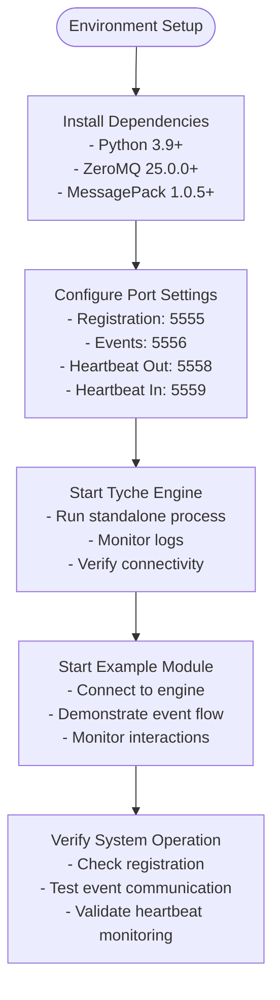
```mermaid
flowchart TD
SetupStart([Environment Setup]) --> InstallDeps["Install Dependencies<br/>- Python 3.9+<br/>- ZeroMQ 25.0.0+<br/>- MessagePack 1.0.5+"]
InstallDeps --> ConfigurePorts["Configure Port Settings<br/>- Registration: 5555<br/>- Events: 5556<br/>- Heartbeat Out: 5558<br/>- Heartbeat In: 5559"]
ConfigurePorts --> StartEngine["Start Tyche Engine<br/>- Run standalone process<br/>- Monitor logs<br/>- Verify connectivity"]
StartEngine --> StartModule["Start Example Module<br/>- Connect to engine<br/>- Demonstrate event flow<br/>- Monitor interactions"]
StartModule --> Verify["Verify System Operation<br/>- Check registration<br/>- Test event communication<br/>- Validate heartbeat monitoring"]
```

**Diagram sources**
- [examples/run_engine.py:27-47](file://examples/run_engine.py#L27-L47)
- [examples/run_module.py:28-46](file://examples/run_module.py#L28-L46)

## Troubleshooting
Common issues and their solutions across the Claude Agent System:

### Registration Failures
- **Symptoms**: Module fails to connect to engine during startup
- **Causes**: Network connectivity, wrong endpoints, engine downtime
- **Solutions**: Verify engine is running, check endpoint configuration, enable debug logging

### Event Delivery Problems
- **Symptoms**: Events not reaching intended recipients
- **Causes**: Incorrect interface patterns, missing subscriptions, network partitions
- **Solutions**: Validate method signatures, ensure proper interface discovery, check network connectivity

### Performance Degradation
- **Symptoms**: Increased latency, dropped events, memory growth
- **Causes**: Insufficient buffering, slow handlers, network bottlenecks
- **Solutions**: Tune ZeroMQ high-water marks, optimize handler implementations, monitor network performance

### Heartbeat Issues
- **Symptoms**: Modules marked as failed despite being operational
- **Causes**: Heartbeat timeouts, network latency, system overload
- **Solutions**: Adjust heartbeat intervals, increase liveness thresholds, monitor system resources

**Section sources**
- [module.py:247-254](file://src/tyche/module.py#L247-L254)
- [engine.py:341-350](file://src/tyche/engine.py#L341-L350)

## Conclusion
The Claude Agent System represents a significant advancement in distributed event-driven development frameworks. By combining the robust foundation of Tyche Engine with Claude-specific agent protocols, it creates a powerful platform for automated development workflows.

The system's strength lies in its comprehensive approach to agent collaboration, where multiple specialized agents work together through well-defined protocols and skill sets. The structured development workflow ensures quality and accountability, while the sophisticated communication patterns enable efficient agent coordination.

Key advantages of the Claude Agent System include:
- **Structured Collaboration**: Clear role separation with defined agent responsibilities
- **Automated Workflows**: Standardized processes that reduce manual intervention
- **Robust Communication**: Multiple interface patterns supporting diverse use cases
- **Reliable Operation**: ZeroMQ patterns and heartbeat monitoring ensure fault tolerance
- **Performance Optimization**: Asynchronous processing and efficient resource management
- **Flexible Deployment**: Support for various deployment scenarios and scaling strategies

The framework successfully balances simplicity with power, enabling developers to build complex distributed systems while maintaining clean, testable code. The comprehensive documentation, example implementations, and testing infrastructure provide excellent guidance for extending the framework with custom agents and modules.

Future enhancements could include dynamic agent spawning, enhanced monitoring capabilities, and integration with external development tools, all while maintaining the core design principles that make the Claude Agent System an effective platform for automated development workflows.