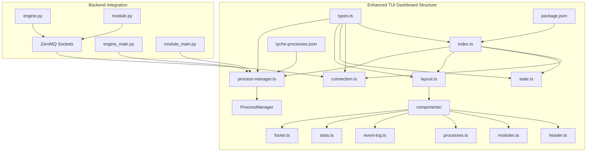
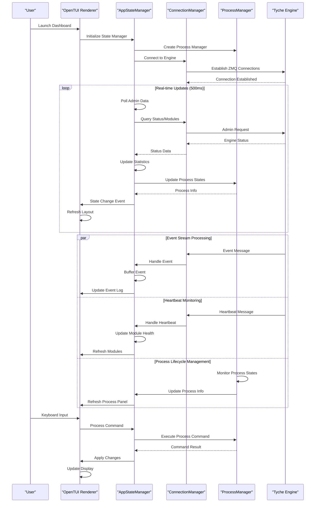
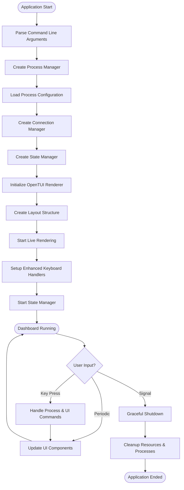
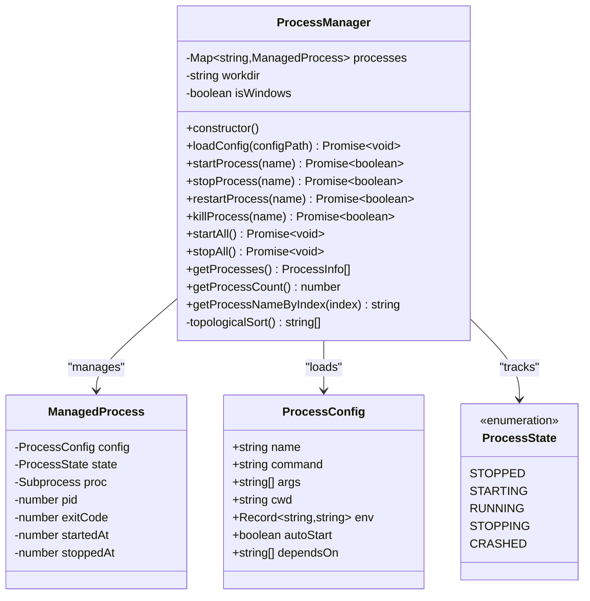
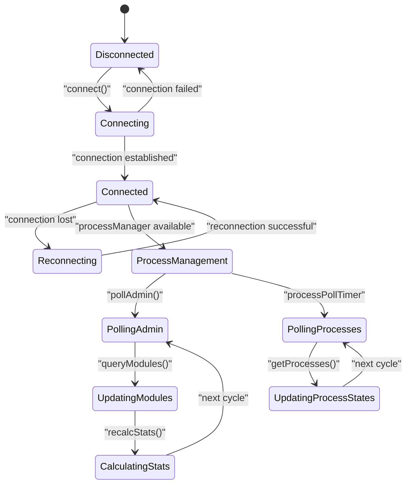
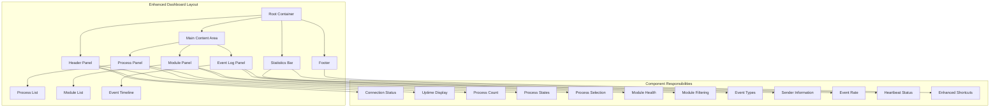
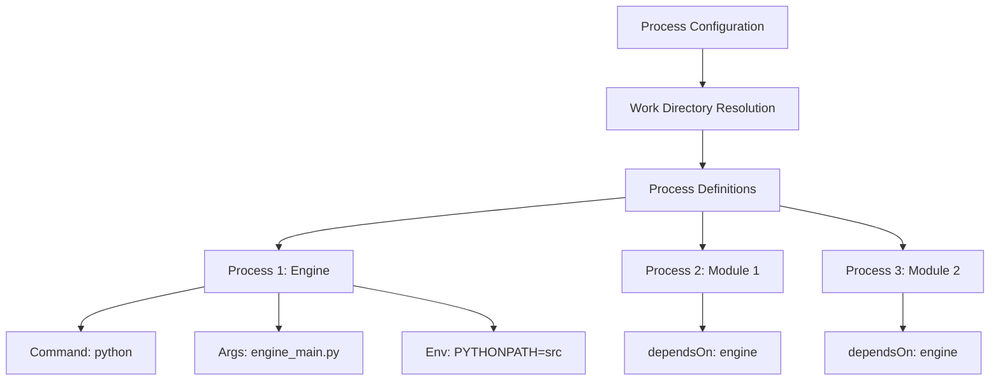
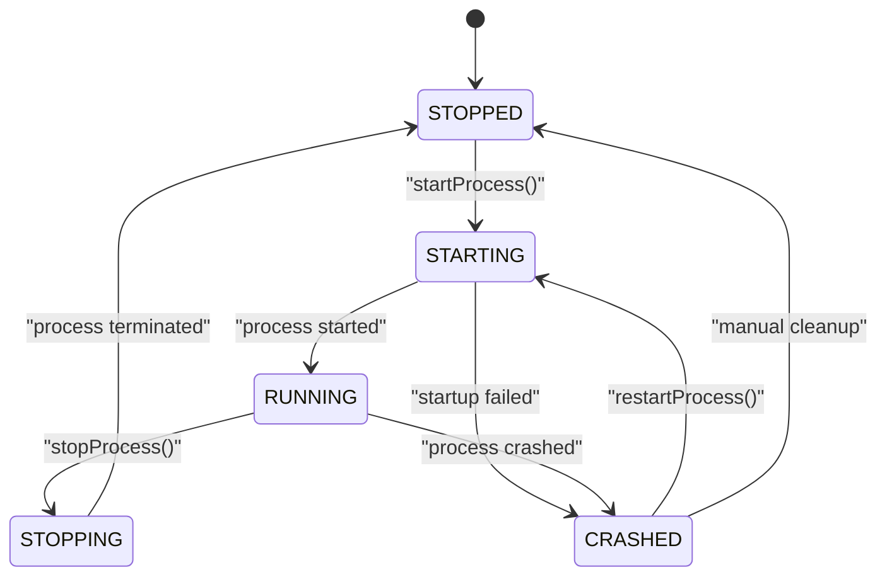
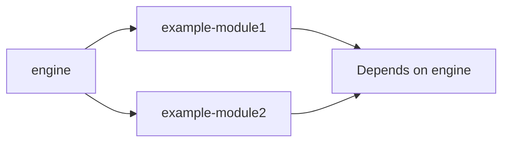
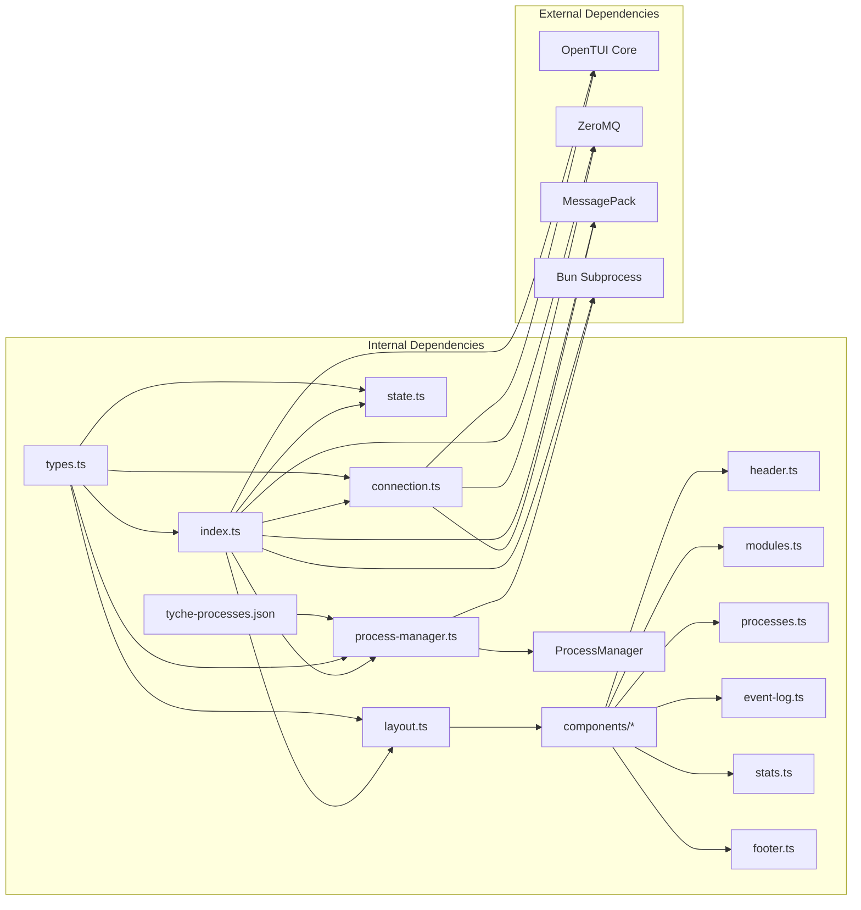

# Terminal User Interface Dashboard

<cite>
**Referenced Files in This Document**
- [index.ts](file://tui/src/index.ts)
- [layout.ts](file://tui/src/layout.ts)
- [state.ts](file://tui/src/state.ts)
- [connection.ts](file://tui/src/connection.ts)
- [types.ts](file://tui/src/types.ts)
- [process-manager.ts](file://tui/src/process-manager.ts)
- [processes.ts](file://tui/src/components/processes.ts)
- [header.ts](file://tui/src/components/header.ts)
- [modules.ts](file://tui/src/components/modules.ts)
- [event-log.ts](file://tui/src/components/event-log.ts)
- [stats.ts](file://tui/src/components/stats.ts)
- [footer.ts](file://tui/src/components/footer.ts)
- [package.json](file://tui/package.json)
- [README.md](file://tui/README.md)
- [engine.py](file://src/tyche/engine.py)
- [module.py](file://src/tyche/module.py)
- [engine_main.py](file://src/tyche/engine_main.py)
- [module_main.py](file://src/tyche/module_main.py)
- [tyche-processes.json](file://tui/tyche-processes.json)
</cite>

## Update Summary
**Changes Made**
- Added comprehensive process management capabilities with ProcessManager class
- Integrated new process panel component for visual process state monitoring
- Implemented dependency-aware process startup with topological sorting
- Added cross-platform process termination with graceful and force-kill options
- Enhanced keyboard shortcuts with s/x/r/a/k commands for process control
- Updated architecture to support dual role as monitor and process supervisor
- Added process configuration system with JSON-based process definitions

## Table of Contents
1. [Introduction](#introduction)
2. [Project Structure](#project-structure)
3. [Core Components](#core-components)
4. [Architecture Overview](#architecture-overview)
5. [Detailed Component Analysis](#detailed-component-analysis)
6. [Process Management System](#process-management-system)
7. [Dependency Analysis](#dependency-analysis)
8. [Performance Considerations](#performance-considerations)
9. [Troubleshooting Guide](#troubleshooting-guide)
10. [Conclusion](#conclusion)

## Introduction

The Terminal User Interface (TUI) Dashboard is a comprehensive real-time monitoring and process management solution for the Tyche Engine, a high-performance distributed event-driven framework. Built with OpenTUI and Bun, this dashboard provides an intuitive terminal-based interface for observing engine state, active modules, and event flow, while also serving as a full-process supervisor capable of launching, monitoring, and controlling engine and module processes.

The dashboard connects to a running Tyche Engine instance via three ZeroMQ sockets for comprehensive system monitoring, while simultaneously managing child processes through a sophisticated process management system. It displays real-time event streams, module health status, system statistics, and process states in an easy-to-read layout optimized for terminal environments.

**Updated** Enhanced from a simple monitoring dashboard to a full-process supervisor with comprehensive lifecycle management capabilities.

## Project Structure

The TUI dashboard follows a modular architecture with clear separation of concerns, now including comprehensive process management:

**Diagram sources**
- [index.ts:1-171](file://tui/src/index.ts#L1-L171)
- [process-manager.ts:15-296](file://tui/src/process-manager.ts#L15-L296)
- [layout.ts:1-133](file://tui/src/layout.ts#L1-L133)

The project is organized into several key directories and files with enhanced process management capabilities:

- **src/**: Main TypeScript source code with process management integration
- **src/components/**: UI component implementations including new process panel
- **src/process-manager.ts**: Core process management system
- **src/components/processes.ts**: Process panel UI component
- **package.json**: Project dependencies and scripts
- **README.md**: Comprehensive documentation with process management features
- **tyche-processes.json**: Process configuration file for process management

**Section sources**
- [package.json:1-20](file://tui/package.json#L1-L20)
- [README.md:1-221](file://tui/README.md#L1-L221)
- [tyche-processes.json:1-29](file://tui/tyche-processes.json#L1-L29)

## Core Components

The TUI dashboard consists of five fundamental components that work together to provide comprehensive real-time monitoring and process management:

### Connection Manager
The ConnectionManager handles all network communications with the Tyche Engine using ZeroMQ sockets. It manages three separate connections:
- **Event Subscriber**: Receives event streams from the engine
- **Heartbeat Subscriber**: Monitors module health status
- **Admin Request**: Queries engine state and module information

### State Manager
The AppStateManager acts as the central coordinator, maintaining application state and orchestrating data flow between the connection layer, process management layer, and UI components. It handles event buffering, statistics calculation, state synchronization, and process state updates.

### Process Manager
The ProcessManager provides comprehensive process lifecycle management capabilities:
- **Process Configuration**: Loads and validates process definitions from JSON configuration
- **Process Control**: Start, stop, restart, and force-kill operations
- **Dependency Management**: Topological sorting for dependency-aware startup
- **Cross-Platform Support**: Graceful termination on Windows and Unix systems
- **State Tracking**: Real-time process state monitoring and reporting

### Layout System
The layout system provides a responsive grid-based interface using OpenTUI's renderable components. It organizes the dashboard into distinct sections: header, process panel, module panel, event log, statistics bar, and footer.

### UI Components
Individual UI components handle specific display functions:
- **Header**: Shows connection status, system uptime, and process count
- **Process Panel**: Displays managed processes with state indicators and selection
- **Module Panel**: Displays registered modules with health indicators
- **Event Log**: Shows recent events with color-coded categories and filtering
- **Statistics Bar**: Provides real-time metrics and health summaries
- **Footer**: Contains enhanced keyboard shortcuts and help information

**Updated** Added comprehensive process management capabilities with dedicated process panel and state tracking.

**Section sources**
- [connection.ts:13-276](file://tui/src/connection.ts#L13-L276)
- [state.ts:18-327](file://tui/src/state.ts#L18-L327)
- [process-manager.ts:15-296](file://tui/src/process-manager.ts#L15-L296)
- [layout.ts:24-133](file://tui/src/layout.ts#L24-L133)

## Architecture Overview

The TUI dashboard implements a reactive architecture pattern that efficiently processes and displays real-time data from the Tyche Engine while managing process lifecycles:

**Diagram sources**
- [index.ts:52-171](file://tui/src/index.ts#L52-L171)
- [state.ts:49-87](file://tui/src/state.ts#L49-L87)
- [connection.ts:47-76](file://tui/src/connection.ts#L47-L76)

The architecture employs several key design patterns:

### Reactive Data Flow
The dashboard uses a unidirectional data flow where state changes trigger UI updates. This ensures consistency and predictable behavior across both monitoring and process management functions.

### Event-Driven Architecture
All user interactions and external events are handled through event-driven mechanisms, allowing for responsive and efficient processing of both engine events and process commands.

### Modular Component Design
Each UI component is self-contained and can be updated independently, enabling fine-grained control over the display and seamless integration of process management features.

### Dual Role Architecture
The dashboard now operates in dual mode: as a monitoring dashboard and as a process supervisor, coordinating between engine monitoring and process lifecycle management.

**Updated** Enhanced architecture now supports dual role as monitor and process supervisor with integrated process state tracking.

**Section sources**
- [index.ts:52-171](file://tui/src/index.ts#L52-L171)
- [state.ts:18-87](file://tui/src/state.ts#L18-L87)

## Detailed Component Analysis

### Application Entry Point

The main entry point coordinates the startup sequence and manages application lifecycle with enhanced process management:

**Diagram sources**
- [index.ts:52-171](file://tui/src/index.ts#L52-L171)

The entry point implements several critical features:
- **Command-line argument parsing** for flexible configuration
- **Process configuration loading** from JSON files
- **Dual initialization** of connection and process managers
- **Enhanced keyboard handling** for process control commands
- **Graceful shutdown handling** for clean resource and process cleanup
- **Signal handling** for proper termination

**Updated** Enhanced entry point now initializes process manager and loads process configuration during startup.

**Section sources**
- [index.ts:52-171](file://tui/src/index.ts#L52-L171)

### Process Management System

The ProcessManager provides comprehensive process lifecycle management with cross-platform support:

**Diagram sources**
- [process-manager.ts:15-296](file://tui/src/process-manager.ts#L15-L296)
- [types.ts:88-111](file://tui/src/types.ts#L88-L111)

The process management system implements advanced features:
- **JSON Configuration Loading** with workdir resolution and environment merging
- **Dependency-Aware Startup** using topological sorting for process ordering
- **Cross-Platform Termination** with graceful shutdown on Unix and taskkill on Windows
- **Process State Tracking** with detailed state management and timing
- **Auto-Start Configuration** for automated process orchestration
- **Process Discovery** with PID tracking and exit code monitoring

**Updated** Completely new process management system with comprehensive lifecycle control and cross-platform support.

**Section sources**
- [process-manager.ts:15-296](file://tui/src/process-manager.ts#L15-L296)

### State Management Architecture

The AppStateManager coordinates data flow between monitoring and process management systems:

**Diagram sources**
- [state.ts:49-111](file://tui/src/state.ts#L49-L111)

Key state management features include:
- **Dual Data Sources** combining engine monitoring and process management
- **Event buffering** with configurable limits
- **Real-time statistics calculation** for performance metrics
- **Health monitoring** for module status tracking
- **Process state synchronization** with UI updates
- **Selection management** for cycling between processes and modules
- **Pause/resume functionality** for event processing

**Updated** Enhanced state manager now coordinates between engine monitoring and process management systems.

**Section sources**
- [state.ts:49-111](file://tui/src/state.ts#L49-L111)

### UI Component System

The dashboard implements a modular component architecture with enhanced process management:

**Diagram sources**
- [layout.ts:24-133](file://tui/src/layout.ts#L24-L133)

Each component serves specific purposes:
- **Header**: Real-time connection status, system uptime, and process count
- **Process Panel**: Visual process states with selection indicators and state colors
- **Module Panel**: Visual health indicators for registered modules with filtering
- **Event Log**: Color-coded event timeline with filtering and pause functionality
- **Statistics Bar**: Performance metrics and system health with process integration
- **Footer**: Enhanced keyboard shortcuts for process control and navigation

**Updated** Added new process panel component with comprehensive process state visualization and selection management.

**Section sources**
- [layout.ts:24-133](file://tui/src/layout.ts#L24-L133)

## Process Management System

The TUI dashboard now includes a comprehensive process management system that transforms it from a monitoring tool into a full-process supervisor:

### Process Configuration

The system uses JSON-based configuration files to define processes with rich metadata:

**Diagram sources**
- [tyche-processes.json:1-29](file://tui/tyche-processes.json#L1-L29)

Configuration features include:
- **Work Directory**: Base directory for all processes with relative path resolution
- **Process Definition**: Complete command, arguments, and environment specification
- **Dependency Management**: Topological sorting for startup ordering
- **Environment Variables**: Process-specific environment with inheritance
- **Auto-Start Control**: Individual process auto-start configuration

### Process States and Lifecycle

The system tracks comprehensive process state information:

**Diagram sources**
- [process-manager.ts:74-105](file://tui/src/process-manager.ts#L74-L105)

State tracking includes:
- **Process Identification**: Unique names and optional PID tracking
- **State Transitions**: Detailed state management with timestamps
- **Exit Codes**: Process termination status reporting
- **Timing Information**: Start and stop timestamps for process duration tracking

### Cross-Platform Process Control

The system provides comprehensive process control with platform-specific optimizations:

| Operation | Windows Implementation | Unix Implementation |
|-----------|----------------------|-------------------|
| **Graceful Stop** | `taskkill /T /F /PID` | `SIGTERM` signal |
| **Force Kill** | `taskkill /T /F /PID` | `SIGKILL` signal |
| **Process Tree** | `taskkill /T` flag | Automatic parent-child termination |
| **Timeout Handling** | 3-second fallback escalation | 5-second timeout with escalation |

### Dependency-Aware Startup

The system implements topological sorting for dependency resolution:

**Diagram sources**
- [process-manager.ts:272-294](file://tui/src/process-manager.ts#L272-L294)

Startup sequence features:
- **Topological Sort**: Dependency resolution using depth-first traversal
- **Parallel Execution**: Processes without dependencies start concurrently
- **Sequential Ordering**: Dependent processes wait for prerequisites
- **Failure Propagation**: Dependency failures prevent downstream startup

### Enhanced Keyboard Shortcuts

The dashboard now includes comprehensive process control shortcuts:

| Shortcut | Action | Description |
|----------|--------|-------------|
| `s` | Start Selected Process | Launch the currently selected process |
| `x` | Stop Selected Process | Gracefully terminate the selected process |
| `r` | Restart Selected Process | Stop and then start the selected process |
| `k` | Kill Selected Process | Force-terminate the selected process immediately |
| `a` | Start All Processes | Launch all processes respecting dependencies |
| `Tab` | Cycle Selection | Move between processes and modules |

**Section sources**
- [process-manager.ts:15-296](file://tui/src/process-manager.ts#L15-L296)
- [state.ts:276-327](file://tui/src/state.ts#L276-L327)
- [index.ts:103-122](file://tui/src/index.ts#L103-L122)
- [footer.ts:12](file://tui/src/components/footer.ts#L12)

## Dependency Analysis

The TUI dashboard maintains a clean dependency structure with enhanced process management integration:

**Diagram sources**
- [package.json:10-18](file://tui/package.json#L10-L18)
- [index.ts:1-7](file://tui/src/index.ts#L1-L7)

The dependency graph reveals several important characteristics:

### Internal Cohesion
- Components are tightly coupled internally for cohesive functionality
- Shared types define clear interfaces between modules
- Layout system provides consistent component integration
- Process management integrates seamlessly with state management

### External Coupling
- Minimal external dependencies reduce maintenance overhead
- ZeroMQ provides robust networking capabilities
- OpenTUI offers cross-platform terminal rendering
- Bun subprocess API enables cross-platform process management

### Circular Dependencies
- No circular dependencies detected in the codebase
- Clear separation between presentation, business logic, and process management
- Process manager operates independently of UI components

**Updated** Enhanced dependency structure now includes process management system with Bun subprocess integration.

**Section sources**
- [package.json:10-18](file://tui/package.json#L10-L18)
- [index.ts:1-7](file://tui/src/index.ts#L1-L7)

## Performance Considerations

The TUI dashboard is designed for optimal performance in terminal environments with enhanced process management:

### Rendering Optimization
- **Target FPS**: 10 FPS with maximum 30 FPS cap for smooth animations
- **Layout caching**: Components cache computed layouts to minimize redraws
- **Selective updates**: Only changed components are refreshed
- **Process panel throttling**: Process state updates every 1 second

### Memory Management
- **Event buffering**: Maximum 500 events with automatic pruning
- **Statistics windows**: 5-second rolling window for rate calculations
- **Connection pooling**: Reused ZeroMQ sockets for efficient I/O
- **Process state caching**: Process information cached between updates

### Network Efficiency
- **Asynchronous processing**: Non-blocking socket operations
- **Message compression**: MessagePack encoding reduces payload size
- **Connection reuse**: Persistent connections eliminate handshake overhead

### Process Management Efficiency
- **Process polling**: State updates every 1000ms to balance responsiveness and efficiency
- **Dependency resolution**: Topological sort computed once during startup
- **Cross-platform optimization**: Platform-specific termination strategies minimize resource usage
- **Graceful escalation**: Timeout-based termination prevents resource leaks

### Resource Constraints
- **Low memory footprint**: Optimized for terminal environments
- **CPU efficiency**: Minimal background processing for both monitoring and process management
- **Network bandwidth**: Efficient subscription patterns for engine monitoring
- **Process resource management**: Automatic cleanup of terminated processes

**Updated** Enhanced performance considerations now include process management overhead and cross-platform optimizations.

## Troubleshooting Guide

Common issues and their solutions with enhanced process management:

### Connection Problems
**Symptoms**: Dashboard shows disconnected state
**Causes**: 
- Engine not running on specified ports
- Network connectivity issues
- Incorrect host/port configuration

**Solutions**:
1. Verify engine is running with admin endpoint enabled
2. Check firewall settings for blocked ports
3. Test connectivity using telnet or netstat
4. Review connection logs for specific error messages

### Process Management Issues
**Symptoms**: Processes fail to start or stop correctly
**Causes**:
- Missing executable or incorrect command path
- Permission denied for process execution
- Dependency chain failures
- Cross-platform termination issues

**Solutions**:
1. Verify process configuration in tyche-processes.json
2. Check executable permissions and PATH resolution
3. Review dependency chains for circular references
4. Test process commands manually in terminal
5. Check platform-specific termination support

### Performance Issues
**Symptoms**: Stuttering UI or delayed updates
**Causes**:
- Insufficient system resources
- Network latency
- Excessive event volume
- Process state polling overhead

**Solutions**:
1. Adjust target FPS in renderer configuration
2. Reduce event processing load
3. Monitor system resource utilization
4. Consider hardware upgrades if necessary
5. Optimize process configuration for fewer processes

### UI Display Problems
**Symptoms**: Incorrect colors or layout issues
**Causes**:
- Terminal color support limitations
- Screen size compatibility
- Font rendering issues

**Solutions**:
1. Test with different terminals
2. Adjust terminal color settings
3. Resize terminal window appropriately
4. Check font compatibility

### Process Configuration Issues
**Symptoms**: Configuration errors or invalid process definitions
**Causes**:
- Invalid JSON syntax in configuration file
- Missing required fields in process definition
- Invalid dependency references
- Path resolution errors

**Solutions**:
1. Validate JSON syntax using online validators
2. Check required fields: name, command, args
3. Verify dependency names match existing processes
4. Test path resolution from working directory
5. Review configuration file permissions

**Updated** Added comprehensive troubleshooting for process management functionality.

**Section sources**
- [connection.ts:78-109](file://tui/src/connection.ts#L78-L109)
- [state.ts:159-174](file://tui/src/state.ts#L159-L174)
- [process-manager.ts:25-43](file://tui/src/process-manager.ts#L25-L43)

## Conclusion

The Terminal User Interface Dashboard has evolved from a simple monitoring tool into a comprehensive system management solution for the Tyche Engine ecosystem. Its enhanced architecture, efficient data flow, robust error handling, and comprehensive process management capabilities make it an essential tool for developers and operators working with distributed systems.

Key strengths of the enhanced implementation include:
- **Dual Role Capability** as both monitoring dashboard and process supervisor
- **Real-time monitoring** with low-latency updates and process state tracking
- **Comprehensive process management** with dependency-aware startup and cross-platform termination
- **Flexible configuration** supporting various deployment scenarios with JSON-based process definitions
- **Resilient architecture** with graceful error handling and process cleanup
- **Performance optimization** for terminal environments with process management overhead
- **Clean separation of concerns** enabling maintainable code with integrated monitoring and process management

The dashboard serves as both a practical monitoring tool and an example of effective real-time system visualization, demonstrating best practices for building responsive terminal applications that integrate with distributed systems and provide comprehensive process lifecycle management.

Future enhancements could include:
- Enhanced filtering and search capabilities for event logs and process lists
- Export functionality for monitoring data and process state snapshots
- Customizable dashboards for different operational needs
- Integration with external monitoring systems and process supervisors
- Advanced process grouping and batch operation capabilities
- Web-based dashboard extension for remote monitoring and control

**Updated** Enhanced conclusion reflects the transformation from monitoring-only tool to comprehensive system management solution with full process lifecycle capabilities.