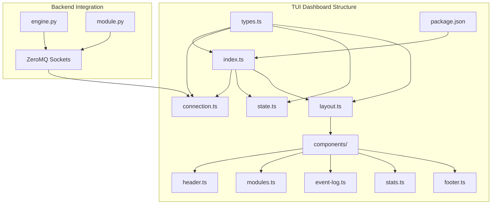
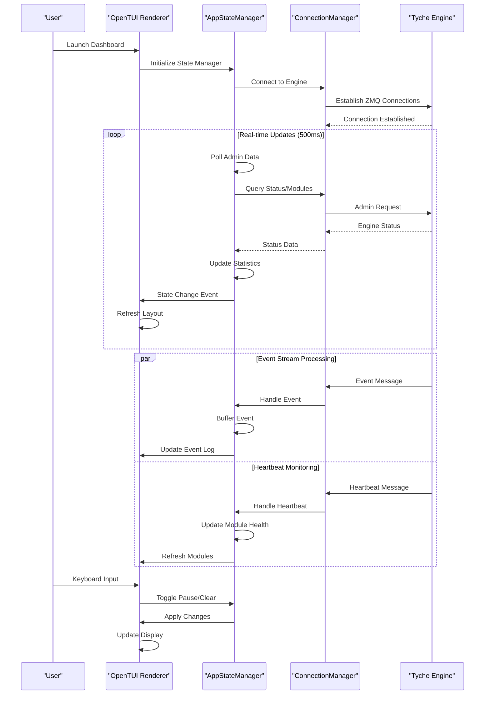
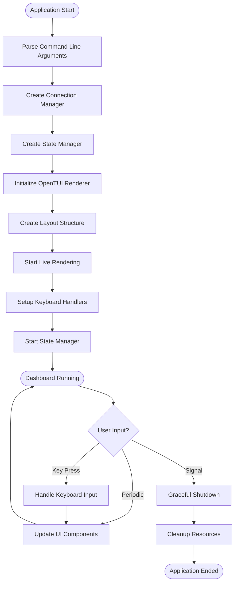
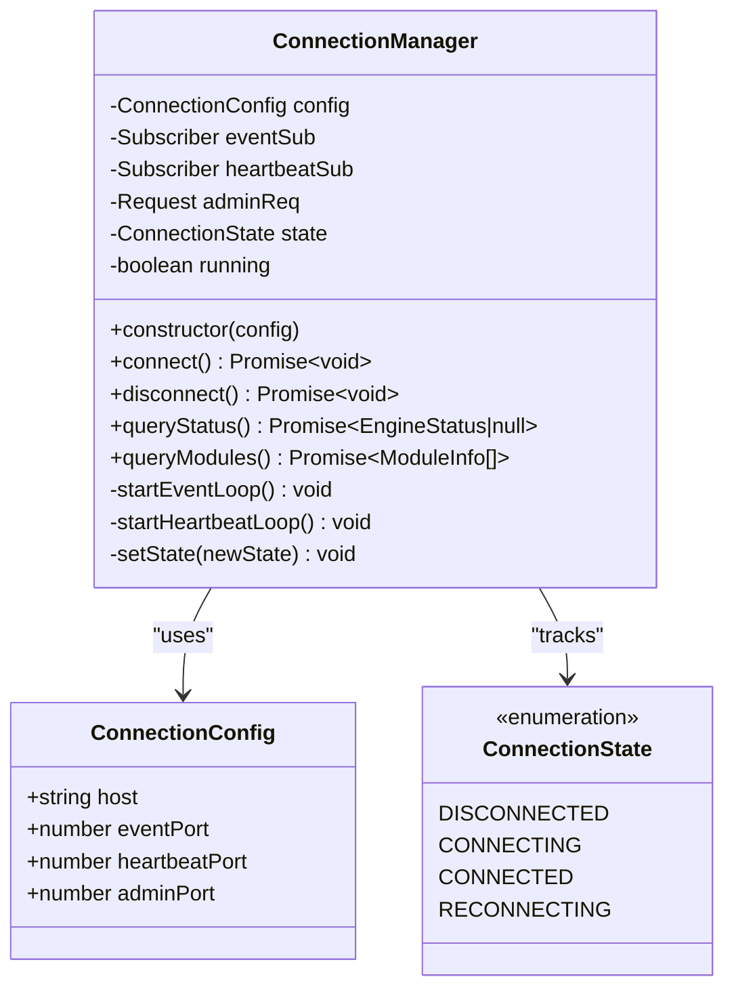
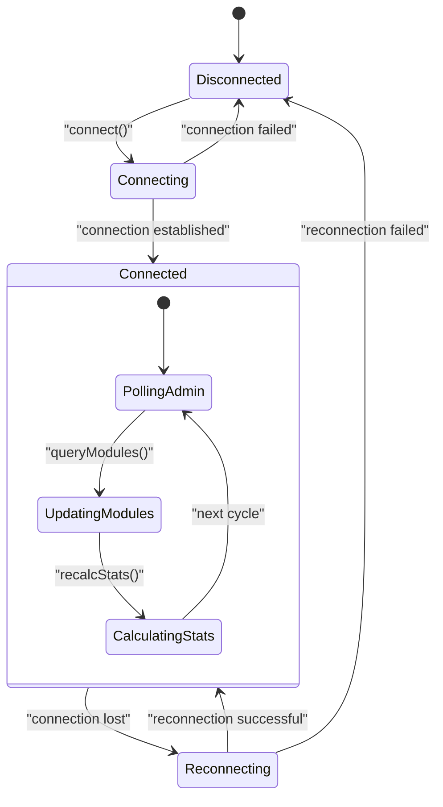
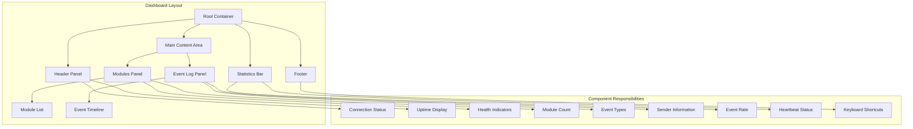
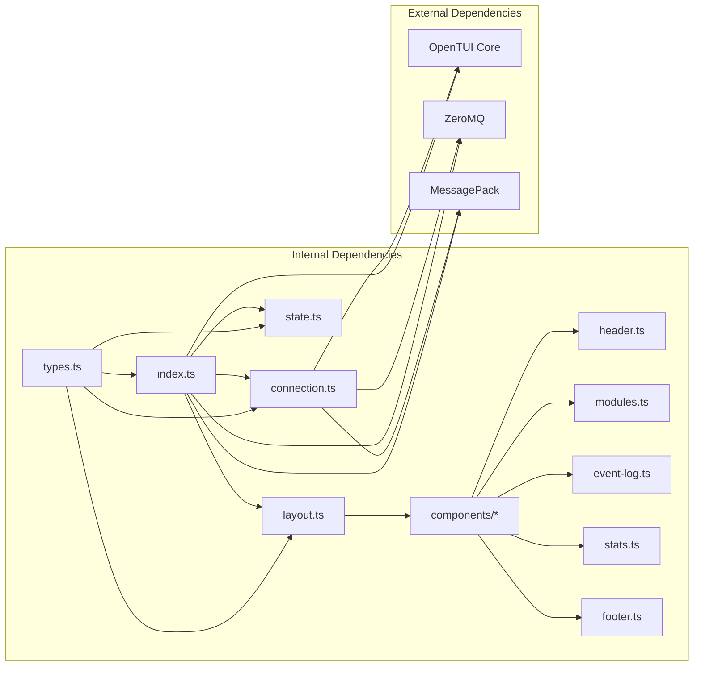

# Terminal User Interface Dashboard

<cite>
**Referenced Files in This Document**
- [index.ts](file://tui/src/index.ts)
- [layout.ts](file://tui/src/layout.ts)
- [state.ts](file://tui/src/state.ts)
- [connection.ts](file://tui/src/connection.ts)
- [types.ts](file://tui/src/types.ts)
- [header.ts](file://tui/src/components/header.ts)
- [modules.ts](file://tui/src/components/modules.ts)
- [event-log.ts](file://tui/src/components/event-log.ts)
- [stats.ts](file://tui/src/components/stats.ts)
- [footer.ts](file://tui/src/components/footer.ts)
- [package.json](file://tui/package.json)
- [README.md](file://tui/README.md)
- [engine.py](file://src/tyche/engine.py)
- [module.py](file://src/tyche/module.py)
</cite>

## Table of Contents
1. [Introduction](#introduction)
2. [Project Structure](#project-structure)
3. [Core Components](#core-components)
4. [Architecture Overview](#architecture-overview)
5. [Detailed Component Analysis](#detailed-component-analysis)
6. [Dependency Analysis](#dependency-analysis)
7. [Performance Considerations](#performance-considerations)
8. [Troubleshooting Guide](#troubleshooting-guide)
9. [Conclusion](#conclusion)

## Introduction

The Terminal User Interface (TUI) Dashboard is a real-time monitoring solution for the Tyche Engine, a high-performance distributed event-driven framework. Built with OpenTUI and Bun, this dashboard provides an intuitive terminal-based interface for observing engine state, active modules, and event flow without leaving the command line.

The dashboard connects to a running Tyche Engine instance via three ZeroMQ sockets to provide comprehensive system monitoring capabilities. It displays real-time event streams, module health status, and system statistics in an easy-to-read layout optimized for terminal environments.

## Project Structure

The TUI dashboard follows a modular architecture with clear separation of concerns:

**Diagram sources**
- [index.ts:1-123](file://tui/src/index.ts#L1-L123)
- [connection.ts:1-276](file://tui/src/connection.ts#L1-L276)
- [layout.ts:1-103](file://tui/src/layout.ts#L1-L103)

The project is organized into several key directories and files:

- **src/**: Main TypeScript source code
- **src/components/**: UI component implementations
- **package.json**: Project dependencies and scripts
- **README.md**: Comprehensive documentation

**Section sources**
- [package.json:1-20](file://tui/package.json#L1-L20)
- [README.md:1-102](file://tui/README.md#L1-L102)

## Core Components

The TUI dashboard consists of four fundamental components that work together to provide real-time monitoring:

### Connection Manager
The ConnectionManager handles all network communications with the Tyche Engine using ZeroMQ sockets. It manages three separate connections:
- **Event Subscriber**: Receives event streams from the engine
- **Heartbeat Subscriber**: Monitors module health status
- **Admin Request**: Queries engine state and module information

### State Manager
The AppStateManager acts as the central coordinator, maintaining application state and orchestrating data flow between the connection layer and UI components. It handles event buffering, statistics calculation, and state synchronization.

### Layout System
The layout system provides a responsive grid-based interface using OpenTUI's renderable components. It organizes the dashboard into distinct sections: header, module panel, event log, statistics bar, and footer.

### UI Components
Individual UI components handle specific display functions:
- **Header**: Shows connection status and system uptime
- **Modules Panel**: Displays registered modules with health indicators
- **Event Log**: Shows recent events with color-coded categories
- **Statistics Bar**: Provides real-time metrics and health summaries
- **Footer**: Contains keyboard shortcuts and help information

**Section sources**
- [connection.ts:13-276](file://tui/src/connection.ts#L13-L276)
- [state.ts:16-208](file://tui/src/state.ts#L16-L208)
- [layout.ts:21-103](file://tui/src/layout.ts#L21-L103)

## Architecture Overview

The TUI dashboard implements a reactive architecture pattern that efficiently processes and displays real-time data from the Tyche Engine:

**Diagram sources**
- [index.ts:40-117](file://tui/src/index.ts#L40-L117)
- [state.ts:42-83](file://tui/src/state.ts#L42-L83)
- [connection.ts:47-76](file://tui/src/connection.ts#L47-L76)

The architecture employs several key design patterns:

### Reactive Data Flow
The dashboard uses a unidirectional data flow where state changes trigger UI updates. This ensures consistency and predictable behavior.

### Event-Driven Architecture
All user interactions and external events are handled through event-driven mechanisms, allowing for responsive and efficient processing.

### Modular Component Design
Each UI component is self-contained and can be updated independently, enabling fine-grained control over the display.

**Section sources**
- [index.ts:40-123](file://tui/src/index.ts#L40-L123)
- [state.ts:16-83](file://tui/src/state.ts#L16-L83)

## Detailed Component Analysis

### Application Entry Point

The main entry point coordinates the startup sequence and manages application lifecycle:

**Diagram sources**
- [index.ts:7-123](file://tui/src/index.ts#L7-L123)

The entry point implements several critical features:
- **Command-line argument parsing** for flexible configuration
- **Graceful shutdown handling** for clean resource cleanup
- **Signal handling** for proper termination
- **Error recovery** to maintain dashboard stability

**Section sources**
- [index.ts:7-123](file://tui/src/index.ts#L7-L123)

### Connection Management System

The ConnectionManager provides robust network connectivity to the Tyche Engine:

**Diagram sources**
- [connection.ts:13-276](file://tui/src/connection.ts#L13-L276)
- [types.ts:1-74](file://tui/src/types.ts#L1-L74)

The connection system implements advanced features:
- **Multi-socket architecture** for different communication types
- **Automatic reconnection** logic for fault tolerance
- **Message parsing** with ZeroMQ and MessagePack
- **Error handling** with graceful degradation

**Section sources**
- [connection.ts:13-276](file://tui/src/connection.ts#L13-L276)

### State Management Architecture

The AppStateManager coordinates data flow and maintains application state:

**Diagram sources**
- [state.ts:16-208](file://tui/src/state.ts#L16-L208)

Key state management features include:
- **Event buffering** with configurable limits
- **Real-time statistics calculation** for performance metrics
- **Health monitoring** for module status tracking
- **Pause/resume functionality** for event processing

**Section sources**
- [state.ts:16-208](file://tui/src/state.ts#L16-L208)

### UI Component System

The dashboard implements a modular component architecture:

**Diagram sources**
- [layout.ts:21-103](file://tui/src/layout.ts#L21-L103)

Each component serves specific purposes:
- **Header**: Real-time connection status and system uptime
- **Modules Panel**: Visual health indicators for registered modules
- **Event Log**: Color-coded event timeline with filtering
- **Statistics Bar**: Performance metrics and system health
- **Footer**: User interaction guidance

**Section sources**
- [layout.ts:21-103](file://tui/src/layout.ts#L21-L103)

## Dependency Analysis

The TUI dashboard has a clean dependency structure with minimal external coupling:

**Diagram sources**
- [package.json:10-18](file://tui/package.json#L10-L18)
- [index.ts:1-6](file://tui/src/index.ts#L1-L6)

The dependency graph reveals several important characteristics:

### Internal Cohesion
- Components are tightly coupled internally for cohesive functionality
- Shared types define clear interfaces between modules
- Layout system provides consistent component integration

### External Coupling
- Minimal external dependencies reduce maintenance overhead
- ZeroMQ provides robust networking capabilities
- OpenTUI offers cross-platform terminal rendering

### Circular Dependencies
- No circular dependencies detected in the codebase
- Clear separation between presentation and business logic

**Section sources**
- [package.json:10-18](file://tui/package.json#L10-L18)
- [index.ts:1-6](file://tui/src/index.ts#L1-L6)

## Performance Considerations

The TUI dashboard is designed for optimal performance in terminal environments:

### Rendering Optimization
- **Target FPS**: 10 FPS with maximum 30 FPS cap for smooth animations
- **Layout caching**: Components cache computed layouts to minimize redraws
- **Selective updates**: Only changed components are refreshed

### Memory Management
- **Event buffering**: Maximum 500 events with automatic pruning
- **Statistics windows**: 5-second rolling window for rate calculations
- **Connection pooling**: Reused ZeroMQ sockets for efficient I/O

### Network Efficiency
- **Asynchronous processing**: Non-blocking socket operations
- **Message compression**: MessagePack encoding reduces payload size
- **Connection reuse**: Persistent connections eliminate handshake overhead

### Resource Constraints
- **Low memory footprint**: Optimized for terminal environments
- **CPU efficiency**: Minimal background processing
- **Network bandwidth**: Efficient subscription patterns

## Troubleshooting Guide

Common issues and their solutions:

### Connection Problems
**Symptoms**: Dashboard shows disconnected state
**Causes**: 
- Engine not running on specified ports
- Network connectivity issues
- Incorrect host/port configuration

**Solutions**:
1. Verify engine is running with admin endpoint enabled
2. Check firewall settings for blocked ports
3. Test connectivity using telnet or netstat
4. Review connection logs for specific error messages

### Performance Issues
**Symptoms**: Stuttering UI or delayed updates
**Causes**:
- Insufficient system resources
- Network latency
- Excessive event volume

**Solutions**:
1. Adjust target FPS in renderer configuration
2. Reduce event processing load
3. Monitor system resource utilization
4. Consider hardware upgrades if necessary

### UI Display Problems
**Symptoms**: Incorrect colors or layout issues
**Causes**:
- Terminal color support limitations
- Screen size compatibility
- Font rendering issues

**Solutions**:
1. Test with different terminals
2. Adjust terminal color settings
3. Resize terminal window appropriately
4. Check font compatibility

**Section sources**
- [connection.ts:78-109](file://tui/src/connection.ts#L78-L109)
- [state.ts:159-174](file://tui/src/state.ts#L159-L174)

## Conclusion

The Terminal User Interface Dashboard provides a comprehensive monitoring solution for the Tyche Engine ecosystem. Its modular architecture, efficient data flow, and robust error handling make it an essential tool for developers and operators working with distributed systems.

Key strengths of the implementation include:
- **Real-time monitoring** capabilities with low-latency updates
- **Flexible configuration** supporting various deployment scenarios  
- **Resilient architecture** with graceful error handling
- **Performance optimization** for terminal environments
- **Clean separation of concerns** enabling maintainable code

The dashboard serves as both a practical monitoring tool and an example of effective real-time system visualization, demonstrating best practices for building responsive terminal applications that integrate with distributed systems.

Future enhancements could include:
- Enhanced filtering and search capabilities for event logs
- Export functionality for monitoring data
- Customizable dashboards for different operational needs
- Integration with external monitoring systems