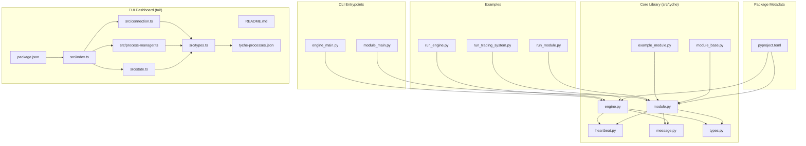
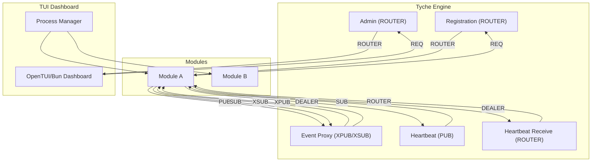
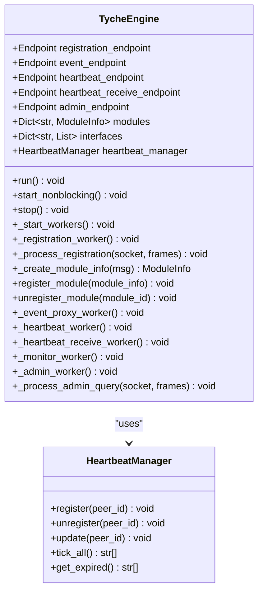
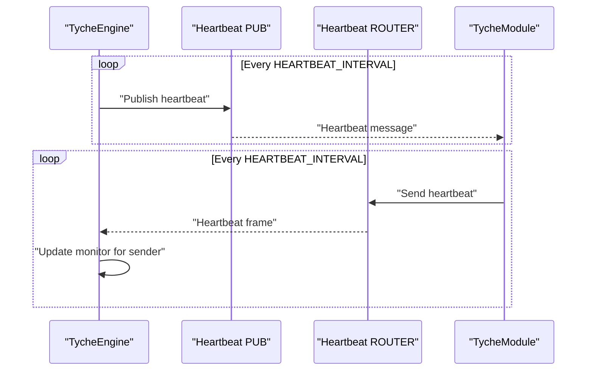
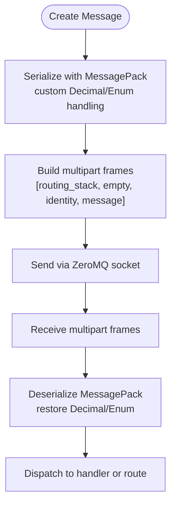
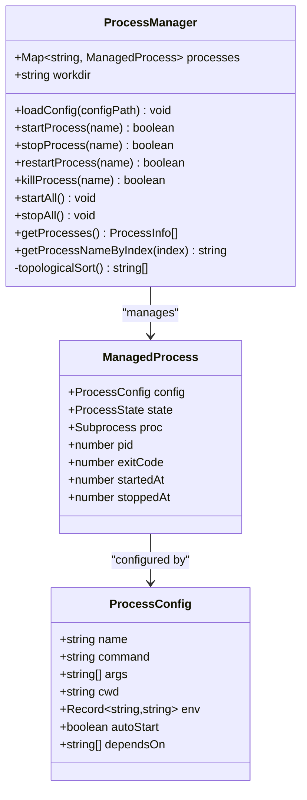
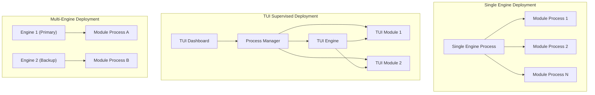
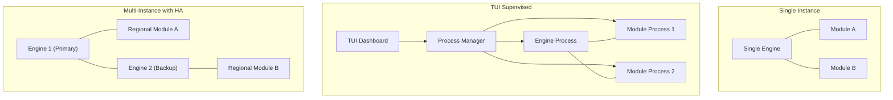
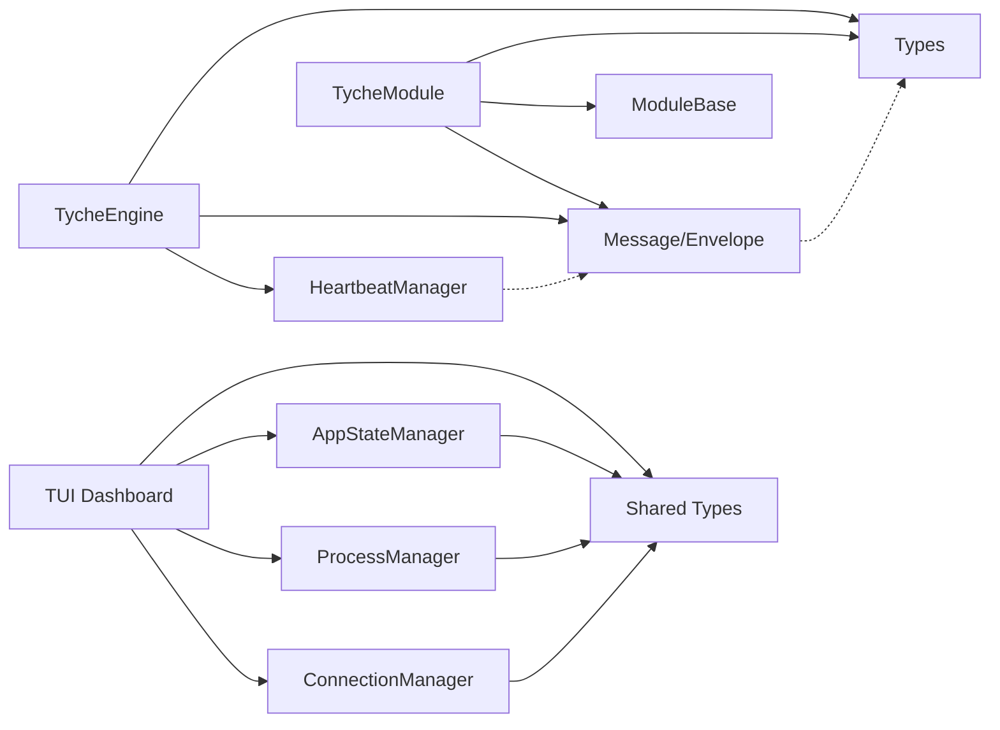

# Architecture Overview

<cite>
**Referenced Files in This Document**
- [README.md](file://README.md)
- [engine.py](file://src/tyche/engine.py)
- [module.py](file://src/tyche/module.py)
- [heartbeat.py](file://src/tyche/heartbeat.py)
- [message.py](file://src/tyche/message.py)
- [types.py](file://src/tyche/types.py)
- [module_base.py](file://src/tyche/module_base.py)
- [example_module.py](file://src/tyche/example_module.py)
- [engine_main.py](file://src/tyche/engine_main.py)
- [module_main.py](file://src/tyche/module_main.py)
- [run_engine.py](file://examples/run_engine.py)
- [run_module.py](file://examples/run_module.py)
- [pyproject.toml](file://pyproject.toml)
- [tui/README.md](file://tui/README.md)
- [tui/src/index.ts](file://tui/src/index.ts)
- [tui/src/connection.ts](file://tui/src/connection.ts)
- [tui/src/process-manager.ts](file://tui/src/process-manager.ts)
- [tui/src/state.ts](file://tui/src/state.ts)
- [tui/src/types.ts](file://tui/src/types.ts)
- [tui/tyche-processes.json](file://tui/tyche-processes.json)
- [tui/package.json](file://tui/package.json)
- [tests/integration/test_multiprocess.py](file://tests/integration/test_multiprocess.py)
- [examples/run_trading_system.py](file://examples/run_trading_system.py)
</cite>

## Update Summary
**Changes Made**
- Added comprehensive TUI (Terminal User Interface) architecture documentation with process management capabilities
- Expanded multi-process distributed system descriptions with cross-platform process supervision
- Enhanced communication patterns to include admin endpoint for engine state queries
- Updated deployment topology to include process orchestration scenarios
- Added TUI usage instructions and keyboard shortcuts documentation

## Table of Contents
1. [Introduction](#introduction)
2. [Project Structure](#project-structure)
3. [Core Components](#core-components)
4. [Architecture Overview](#architecture-overview)
5. [Detailed Component Analysis](#detailed-component-analysis)
6. [TUI Dashboard and Process Management](#tui-dashboard-and-process-management)
7. [Multi-Process Distributed System](#multi-process-distributed-system)
8. [Dependency Analysis](#dependency-analysis)
9. [Performance Considerations](#performance-considerations)
10. [Troubleshooting Guide](#troubleshooting-guide)
11. [Conclusion](#conclusion)
12. [Appendices](#appendices)

## Introduction
This document presents the architecture of Tyche Engine, a high-performance, distributed event-driven framework built on ZeroMQ. The system centers around a lightweight, multi-threaded engine that manages module registration, event routing, and health monitoring. Modules are independent processes that connect to the engine, declare their event interfaces, and exchange messages using standardized patterns. The design emphasizes simplicity, scalability, and operational robustness through well-established ZeroMQ reliability patterns.

**Enhanced** with new TUI dashboard capabilities for real-time monitoring and process management, supporting both single-engine and multi-engine deployments with cross-platform process supervision.

Key architectural characteristics:
- Central engine broker with thread-per-socket workers
- ZeroMQ-based communication using REQ-ROUTER, XPUB/XSUB, PUB/SUB, DEALER/ROUTER, and PUSH/PULL patterns
- Paranoid Pirate pattern for heartbeat-based failure detection
- Async persistence model for low-latency hot path and background durability
- Human-readable module IDs and standardized interface naming conventions
- **New**: TUI dashboard with real-time monitoring and process lifecycle management
- **New**: Multi-process orchestration with dependency-aware process supervision

## Project Structure
The repository organizes the system into cohesive modules under src/tyche, with examples and CLI entry points for quick startup. The TUI dashboard provides real-time monitoring and process management capabilities. External dependencies are minimal and focused on ZeroMQ and MessagePack.



**Diagram sources**
- [engine.py:25-350](file://src/tyche/engine.py#L25-L350)
- [module.py:28-401](file://src/tyche/module.py#L28-L401)
- [heartbeat.py:16-142](file://src/tyche/heartbeat.py#L16-L142)
- [message.py:13-168](file://src/tyche/message.py#L13-L168)
- [types.py:14-102](file://src/tyche/types.py#L14-L102)
- [module_base.py:10-120](file://src/tyche/module_base.py#L10-L120)
- [example_module.py:19-167](file://src/tyche/example_module.py#L19-L167)
- [engine_main.py:13-57](file://src/tyche/engine_main.py#L13-L57)
- [module_main.py:13-47](file://src/tyche/module_main.py#L13-L47)
- [run_engine.py:21-54](file://examples/run_engine.py#L21-L54)
- [run_module.py:22-51](file://examples/run_module.py#L22-L51)
- [pyproject.toml:1-63](file://pyproject.toml#L1-L63)
- [tui/README.md:1-221](file://tui/README.md#L1-L221)
- [tui/src/index.ts:1-171](file://tui/src/index.ts#L1-L171)
- [tui/src/connection.ts:1-277](file://tui/src/connection.ts#L1-L277)
- [tui/src/process-manager.ts:1-296](file://tui/src/process-manager.ts#L1-L296)
- [tui/src/state.ts:1-326](file://tui/src/state.ts#L1-L326)
- [tui/src/types.ts:1-111](file://tui/src/types.ts#L1-L111)
- [tui/tyche-processes.json:1-29](file://tui/tyche-processes.json#L1-L29)
- [tui/package.json:1-20](file://tui/package.json#L1-L20)

**Section sources**
- [README.md:18-348](file://README.md#L18-L348)
- [pyproject.toml:1-63](file://pyproject.toml#L1-L63)
- [tui/README.md:1-221](file://tui/README.md#L1-L221)

## Core Components
Tyche Engine comprises three primary building blocks plus the new TUI dashboard:

- **TycheEngine**: Central broker that binds multiple ZeroMQ sockets, manages module registration, runs an XPUB/XSUB proxy for event distribution, and monitors module health via heartbeats. Now includes admin endpoint for state queries.
- **TycheModule**: Base class for modules that connects to the engine, registers interfaces, subscribes to events, publishes events, and handles ACK-style commands.
- **Heartbeat subsystem**: Implements the Paranoid Pirate pattern for liveness tracking and failure detection.
- **TUI Dashboard**: Real-time monitoring interface with process management capabilities for engine and module lifecycle control.

These components interact through well-defined sockets and message protocols, enabling scalable, decoupled communication across heterogeneous modules with optional process supervision.

**Section sources**
- [engine.py:25-350](file://src/tyche/engine.py#L25-L350)
- [module.py:28-401](file://src/tyche/module.py#L28-L401)
- [heartbeat.py:16-142](file://src/tyche/heartbeat.py#L16-L142)
- [message.py:13-168](file://src/tyche/message.py#L13-L168)
- [types.py:14-102](file://src/tyche/types.py#L14-L102)
- [tui/src/connection.ts:1-277](file://tui/src/connection.ts#L1-L277)
- [tui/src/process-manager.ts:1-296](file://tui/src/process-manager.ts#L1-L296)

## Architecture Overview
Tyche Engine's architecture is centered on a small set of ZeroMQ sockets and a thread-per-worker design. The engine exposes:
- Registration endpoint (ROUTER) for initial module handshake
- Event endpoints (XPUB/XSUB) for pub-sub event distribution
- Heartbeat endpoints (PUB/SUB) for health monitoring
- Optional ACK routing endpoint (ROUTER/DEALER) for request-response acknowledgments
- **New**: Admin endpoint (ROUTER) for engine state queries and monitoring

Modules connect using REQ for registration, PUB/SUB for events, and DEALER for heartbeats. The engine's event proxy mirrors XPUB to XSUB traffic, enabling modules to publish to the engine's XPUB and subscribe via the engine's XPUB.



**Diagram sources**
- [engine.py:121-350](file://src/tyche/engine.py#L121-L350)
- [module.py:200-401](file://src/tyche/module.py#L200-L401)
- [heartbeat.py:16-142](file://src/tyche/heartbeat.py#L16-L142)
- [tui/src/connection.ts:1-277](file://tui/src/connection.ts#L1-L277)
- [tui/src/process-manager.ts:1-296](file://tui/src/process-manager.ts#L1-L296)

**Section sources**
- [README.md:24-44](file://README.md#L24-L44)
- [engine.py:25-110](file://src/tyche/engine.py#L25-L110)
- [module.py:28-120](file://src/tyche/module.py#L28-L120)
- [tui/README.md:170-221](file://tui/README.md#L170-L221)

## Detailed Component Analysis

### TycheEngine: Central Broker
TycheEngine orchestrates module lifecycle and event routing. It:
- Starts multiple worker threads for registration, heartbeat, event proxy, and monitoring
- Maintains a thread-safe registry of modules and their interfaces
- Runs an XPUB/XSUB proxy to mirror event traffic
- Sends periodic heartbeats and receives heartbeats to detect failures
- **New**: Provides admin endpoint for engine state queries and monitoring



**Diagram sources**
- [engine.py:25-350](file://src/tyche/engine.py#L25-L350)
- [heartbeat.py:91-142](file://src/tyche/heartbeat.py#L91-L142)

**Section sources**
- [engine.py:25-350](file://src/tyche/engine.py#L25-L350)
- [engine.py:382-456](file://src/tyche/engine.py#L382-L456)

### TycheModule: Distributed Worker
TycheModule provides the module-side implementation:
- One-shot registration handshake via REQ to the engine's ROUTER
- Event publishing via PUB to the engine's XSUB and subscribing via SUB from the engine's XPUB
- Heartbeat sending via DEALER to the engine's ROUTER
- Event dispatching to handler methods discovered by naming convention


**Diagram sources**
- [module.py:28-401](file://src/tyche/module.py#L28-L401)
- [module_base.py:10-120](file://src/tyche/module_base.py#L10-L120)
- [example_module.py:19-167](file://src/tyche/example_module.py#L19-L167)

**Section sources**
- [module.py:28-401](file://src/tyche/module.py#L28-L401)
- [module_base.py:10-120](file://src/tyche/module_base.py#L10-L120)
- [example_module.py:19-167](file://src/tyche/example_module.py#L19-L167)

### Heartbeat Monitoring: Paranoid Pirate Pattern
The heartbeat subsystem implements the Paranoid Pirate pattern:
- Engine periodically publishes heartbeats on a PUB socket
- Modules send heartbeats to the engine's ROUTER via DEALER
- Engine updates liveness counters and removes expired modules on tick intervals



**Diagram sources**
- [engine.py:281-350](file://src/tyche/engine.py#L281-L350)
- [module.py:376-401](file://src/tyche/module.py#L376-L401)
- [heartbeat.py:16-142](file://src/tyche/heartbeat.py#L16-L142)

**Section sources**
- [heartbeat.py:16-142](file://src/tyche/heartbeat.py#L16-L142)
- [engine.py:281-350](file://src/tyche/engine.py#L281-L350)
- [module.py:376-401](file://src/tyche/module.py#L376-L401)

### Message Serialization and Routing
Messages are serialized using MessagePack with custom handling for Decimal and enum values. The envelope supports ZeroMQ multipart frames with identity routing for REQ-ROUTER and DEALER-ROUTER patterns.



**Diagram sources**
- [message.py:69-168](file://src/tyche/message.py#L69-L168)

**Section sources**
- [message.py:13-168](file://src/tyche/message.py#L13-L168)

## TUI Dashboard and Process Management

### TUI Architecture Overview
The TUI dashboard provides real-time monitoring and process management capabilities for Tyche Engine deployments. It connects to the engine via three ZeroMQ sockets and optionally manages child processes directly from the terminal interface.

```mermaid
graph TB
subgraph "TUI Dashboard (OpenTUI/Bun)"
IDX["index.ts<br/>Main Entry Point"]
CONN["connection.ts<br/>ZeroMQ Connection Manager"]
PM["process-manager.ts<br/>Process Supervisor"]
STATE["state.ts<br/>Application State Manager"]
TYPES["types.ts<br/>Type Definitions"]
END
subgraph "ZeroMQ Sockets"
EVENTS["SUB: Events (5556)"]
HB["SUB: Heartbeats (5558)"]
ADMIN["REQ: Admin (5560)"]
END
subgraph "Process Management"
PROC["tyche-processes.json<br/>Process Configuration"]
PM --> PROC
END
IDX --> CONN
IDX --> PM
IDX --> STATE
CONN --> EVENTS
CONN --> HB
CONN --> ADMIN
STATE --> CONN
STATE --> PM
PM --> PROC
```

**Diagram sources**
- [tui/src/index.ts:1-171](file://tui/src/index.ts#L1-L171)
- [tui/src/connection.ts:1-277](file://tui/src/connection.ts#L1-L277)
- [tui/src/process-manager.ts:1-296](file://tui/src/process-manager.ts#L1-L296)
- [tui/src/state.ts:1-326](file://tui/src/state.ts#L1-L326)
- [tui/src/types.ts:1-111](file://tui/src/types.ts#L1-L111)
- [tui/tyche-processes.json:1-29](file://tui/tyche-processes.json#L1-L29)

### TUI Dashboard Features
The TUI dashboard offers comprehensive monitoring and control capabilities:

- **Real-time Event Monitoring**: Live display of engine events with color-coded categorization
- **Process Lifecycle Management**: Start, stop, restart, and force-kill engine and module processes
- **Dependency-aware Process Control**: Topological sorting for process startup/shutdown ordering
- **Module Health Monitoring**: Real-time visibility into registered modules and their health status
- **Cross-platform Support**: Windows and Unix process management with appropriate termination strategies

### Process Configuration and Management
The TUI uses a JSON configuration file to define processes that can be managed:



**Diagram sources**
- [tui/src/process-manager.ts:1-296](file://tui/src/process-manager.ts#L1-L296)
- [tui/src/types.ts:88-111](file://tui/src/types.ts#L88-L111)

**Section sources**
- [tui/README.md:170-221](file://tui/README.md#L170-L221)
- [tui/src/index.ts:1-171](file://tui/src/index.ts#L1-L171)
- [tui/src/connection.ts:1-277](file://tui/src/connection.ts#L1-L277)
- [tui/src/process-manager.ts:1-296](file://tui/src/process-manager.ts#L1-L296)
- [tui/src/state.ts:1-326](file://tui/src/state.ts#L1-L326)
- [tui/src/types.ts:1-111](file://tui/src/types.ts#L1-L111)
- [tui/tyche-processes.json:1-29](file://tui/tyche-processes.json#L1-L29)

## Multi-Process Distributed System

### Process Supervision Architecture
Tyche Engine now supports sophisticated multi-process deployments with cross-platform process management capabilities. The system can operate in several modes:

- **Manual Operation**: Operators start engine and modules independently
- **TUI Supervised**: TUI manages engine and module processes with dependency awareness
- **Hybrid Operation**: TUI monitors existing engine while managing module processes



### Cross-Platform Process Management
The process manager provides platform-specific termination strategies:

- **Windows**: Uses `taskkill /T /F /PID` for graceful termination, escalates to force kill if needed
- **Unix**: Sends `SIGTERM` with 5-second timeout, then `SIGKILL` for forced termination
- **Dependency Resolution**: Topological sorting ensures proper startup/shutdown order based on `dependsOn` relationships

### Deployment Topologies
Tyche Engine supports various deployment scenarios:



**Section sources**
- [tests/integration/test_multiprocess.py:1-175](file://tests/integration/test_multiprocess.py#L1-L175)
- [examples/run_trading_system.py:1-194](file://examples/run_trading_system.py#L1-L194)
- [tui/src/process-manager.ts:1-296](file://tui/src/process-manager.ts#L1-L296)
- [tui/tyche-processes.json:1-29](file://tui/tyche-processes.json#L1-L29)

## Dependency Analysis
Tyche Engine relies on a minimal set of external libraries:
- pyzmq: ZeroMQ bindings for Python
- msgpack: Efficient binary serialization
- **New**: zeromq: ZeroMQ JavaScript bindings for TUI
- **New**: @opentui/core: Terminal user interface framework
- **New**: bun: Cross-platform runtime for process management

Internal dependencies are intentionally decoupled:
- engine.py depends on heartbeat.py, message.py, and types.py
- module.py depends on message.py, module_base.py, and types.py
- **New**: TUI components depend on shared type definitions and ZeroMQ connections
- Both share common type definitions and message formats



**Diagram sources**
- [engine.py:10-21](file://src/tyche/engine.py#L10-L21)
- [module.py:13-24](file://src/tyche/module.py#L13-L24)
- [heartbeat.py:12-13](file://src/tyche/heartbeat.py#L12-L13)
- [message.py:10-11](file://src/tyche/message.py#L10-L11)
- [types.py:67-102](file://src/tyche/types.py#L67-L102)
- [tui/src/connection.ts:1-277](file://tui/src/connection.ts#L1-L277)
- [tui/src/process-manager.ts:1-296](file://tui/src/process-manager.ts#L1-L296)
- [tui/src/state.ts:1-326](file://tui/src/state.ts#L1-L326)
- [tui/src/types.ts:1-111](file://tui/src/types.ts#L1-L111)

**Section sources**
- [pyproject.toml:10-13](file://pyproject.toml#L10-L13)
- [engine.py:10-21](file://src/tyche/engine.py#L10-L21)
- [module.py:13-24](file://src/tyche/module.py#L13-L24)
- [tui/package.json:1-20](file://tui/package.json#L1-L20)

## Performance Considerations
- Hot path latency targets sub-millisecond for event processing and routing
- Async persistence offloads disk writes to background threads, minimizing impact on the hot path
- Lock-free ring buffer design reduces contention for high-throughput scenarios
- Backpressure mechanisms prevent overload during persistence lag
- **New**: TUI dashboard optimized for low resource usage with 10 FPS refresh rate
- **New**: Process management operations designed for minimal performance impact

Operational guidance:
- Tune ZeroMQ high-water marks and socket buffer sizes for your workload
- Use asynchronous persistence levels (ASYNC_FLUSH) for production trading
- Monitor heartbeat intervals and adjust timeouts for network conditions
- **New**: Configure TUI refresh rates based on terminal capabilities and network conditions
- **New**: Use process dependency ordering to minimize startup time and resource conflicts

**Section sources**
- [README.md:197-205](file://README.md#L197-L205)
- [README.md:104-158](file://README.md#L104-L158)
- [tui/src/index.ts:70-76](file://tui/src/index.ts#L70-L76)

## Troubleshooting Guide
Common issues and diagnostics:
- Registration failures: Verify engine registration endpoint connectivity and module REQ handshake timeouts
- Event delivery gaps: Confirm module subscriptions match event topics and that the event proxy is running
- Heartbeat timeouts: Check network latency, heartbeat intervals, and module liveness counters
- Persistence backpressure: Inspect buffer utilization and adjust batching or durability levels
- **New**: TUI connection issues: Verify ZeroMQ ports are accessible and engine admin endpoint is enabled
- **New**: Process management failures: Check process configuration syntax and dependency resolution
- **New**: Cross-platform process termination: Verify appropriate termination commands for target OS

Operational controls:
- Graceful shutdown via signal handlers in CLI entry points
- Thread-safe stopping with socket closure and context termination
- Logging for registration errors, heartbeat exceptions, and event receiver issues
- **New**: TUI graceful shutdown with process cleanup and socket termination
- **New**: Process manager error handling with detailed failure reporting

**Section sources**
- [engine_main.py:35-48](file://src/tyche/engine_main.py#L35-L48)
- [module_main.py:32-42](file://src/tyche/module_main.py#L32-L42)
- [engine.py:134-142](file://src/tyche/engine.py#L134-L142)
- [module.py:247-254](file://src/tyche/module.py#L247-L254)
- [tui/src/connection.ts:78-109](file://tui/src/connection.ts#L78-L109)
- [tui/src/process-manager.ts:107-168](file://tui/src/process-manager.ts#L107-L168)

## Conclusion
Tyche Engine delivers a pragmatic, high-performance foundation for distributed event-driven systems. Its reliance on ZeroMQ patterns ensures transport independence and proven reliability, while the Paranoid Pirate heartbeat and async persistence model provide strong operational guarantees. The addition of TUI dashboard capabilities with comprehensive process management transforms Tyche Engine from a pure messaging framework into a complete operational platform. The modular design enables straightforward scaling across single or multiple engines, with clear boundaries and predictable behavior for both development and production deployments. The multi-process distributed system support with cross-platform process supervision makes Tyche Engine suitable for complex, production-grade trading and financial systems.

## Appendices

### Communication Patterns and Socket Layout
- Registration: REQ (Module) → ROUTER (Engine)
- Event Broadcasting: XPUB/XSUB Proxy
- Heartbeat: PUB (Engine) / SUB (Modules)
- ACK Routing: DEALER-ROUTER (optional)
- Load Balancing: PUSH/PULL (future extension)
- **New**: Admin Queries: REQ (TUI) → ROUTER (Engine)

**Section sources**
- [README.md:26-36](file://README.md#L26-L36)
- [engine.py:121-278](file://src/tyche/engine.py#L121-L278)
- [module.py:200-282](file://src/tyche/module.py#L200-L282)
- [tui/src/connection.ts:47-76](file://tui/src/connection.ts#L47-L76)

### Example Usage and Startup
- Start the engine: python -m tyche.engine_main
- Start a module: python -m tyche.module_main
- **New**: Start TUI dashboard: cd tui && bun run start
- **New**: Start with process management: cd tui && bun run start --config tyche-processes.json
- **New**: Development mode: cd tui && bun run dev --config tyche-processes.json
- Examples demonstrate standalone processes and basic event exchange

**Section sources**
- [engine_main.py:13-57](file://src/tyche/engine_main.py#L13-L57)
- [module_main.py:13-47](file://src/tyche/module_main.py#L13-L47)
- [run_engine.py:21-54](file://examples/run_engine.py#L21-L54)
- [run_module.py:22-51](file://examples/run_module.py#L22-L51)
- [tui/README.md:19-48](file://tui/README.md#L19-L48)

### TUI Dashboard Controls and Shortcuts
- **Navigation**: Tab key cycles through processes and modules
- **Process Control**: s (start), x (stop), r (restart), k (kill), a (all)
- **Monitoring**: q (quit), p (pause), c (clear)
- **Filtering**: Module selection filters event log by sender
- **Selection Model**: Arrow keys navigate panels, Tab cycles through items

**Section sources**
- [tui/README.md:135-169](file://tui/README.md#L135-L169)
- [tui/src/index.ts:86-128](file://tui/src/index.ts#L86-L128)
- [tui/src/state.ts:276-326](file://tui/src/state.ts#L276-L326)

### Process Configuration Reference
- **workdir**: Working directory for all managed processes
- **name**: Unique process identifier (displayed in TUI)
- **command**: Executable path or command to run
- **args**: Command-line arguments array
- **env**: Environment variables merged with process environment
- **cwd**: Working directory override for this process
- **dependsOn**: Array of process names that must start before this process
- **autoStart**: Boolean flag for automatic startup on TUI launch

**Section sources**
- [tui/README.md:60-98](file://tui/README.md#L60-L98)
- [tui/src/types.ts:88-111](file://tui/src/types.ts#L88-L111)
- [tui/tyche-processes.json:1-29](file://tui/tyche-processes.json#L1-L29)