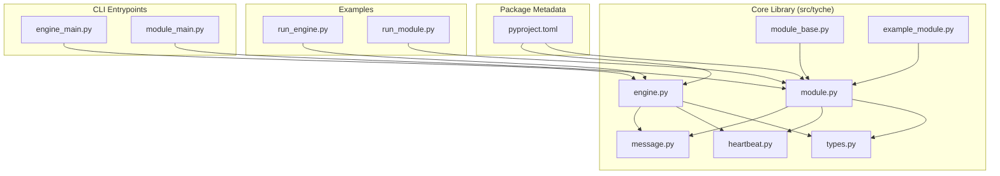
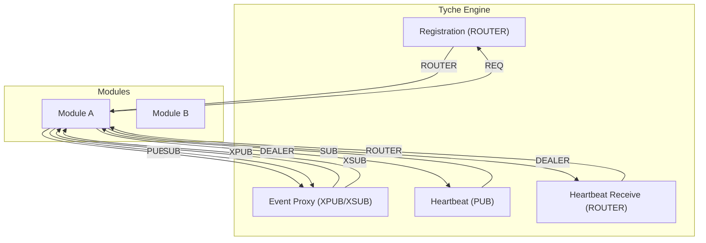
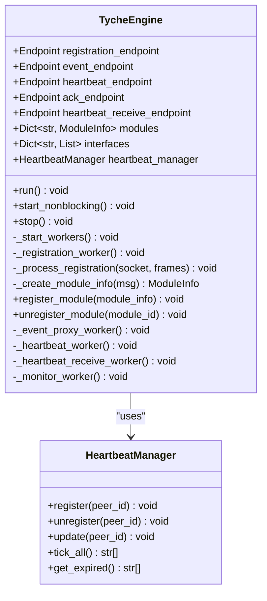
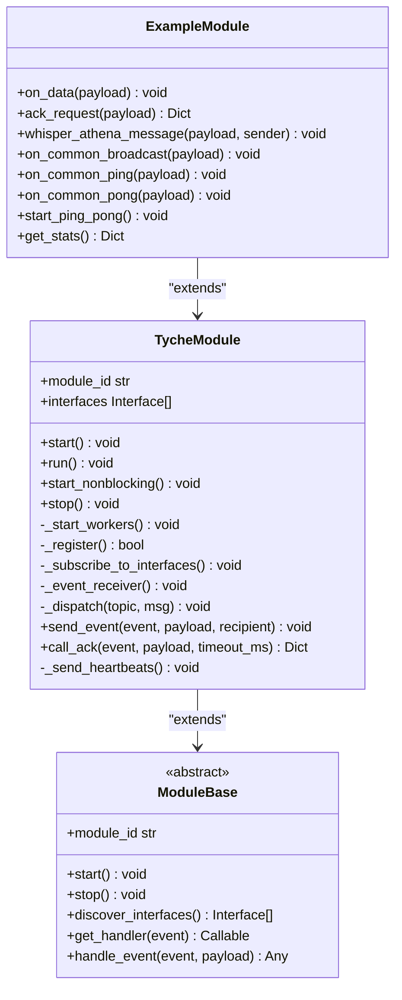
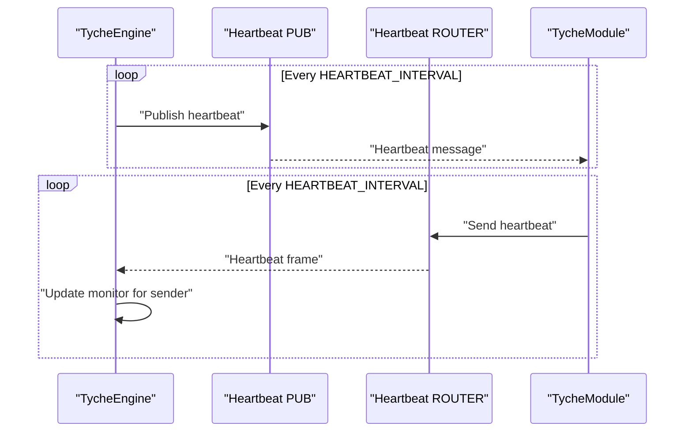
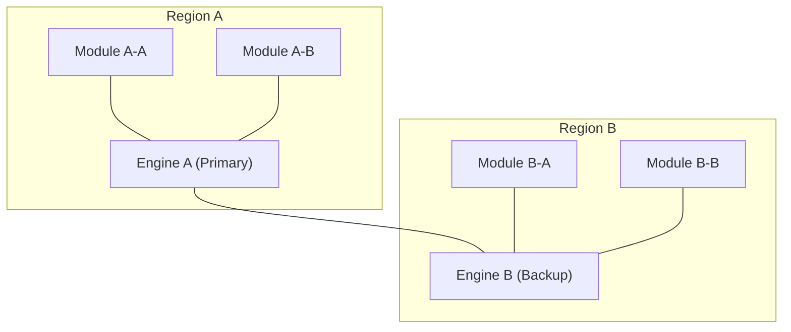
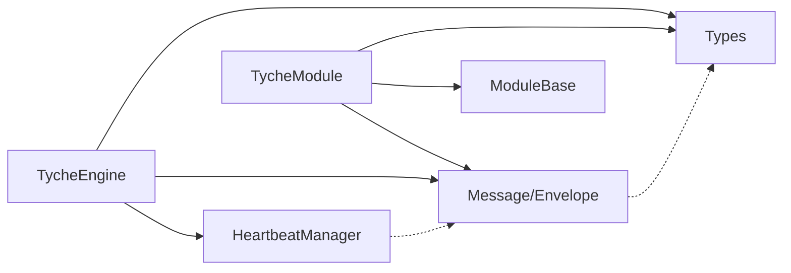

# Architecture Overview

**Referenced Files in This Document**
- [README.md](file://README.md)
- [engine.py](file://src/tyche/engine.py)
- [module.py](file://src/tyche/module.py)
- [heartbeat.py](file://src/tyche/heartbeat.py)
- [message.py](file://src/tyche/message.py)
- [types.py](file://src/tyche/types.py)
- [module_base.py](file://src/tyche/module_base.py)
- [example_module.py](file://src/tyche/example_module.py)
- [engine_main.py](file://src/tyche/engine_main.py)
- [module_main.py](file://src/tyche/module_main.py)
- [run_engine.py](file://examples/run_engine.py)
- [run_module.py](file://examples/run_module.py)
- [pyproject.toml](file://pyproject.toml)

## Table of Contents
1. [Introduction](#introduction)
2. [Project Structure](#project-structure)
3. [Core Components](#core-components)
4. [Architecture Overview](#architecture-overview)
5. [Detailed Component Analysis](#detailed-component-analysis)
6. [Dependency Analysis](#dependency-analysis)
7. [Performance Considerations](#performance-considerations)
8. [Troubleshooting Guide](#troubleshooting-guide)
9. [Conclusion](#conclusion)
10. [Appendices](#appendices)

## Introduction
This document presents the architecture of Tyche Engine, a high-performance, distributed event-driven framework built on ZeroMQ. The system centers around a lightweight, multi-threaded engine that manages module registration, event routing, and health monitoring. Modules are independent processes that connect to the engine, declare their event interfaces, and exchange messages using standardized patterns. The design emphasizes simplicity, scalability, and operational robustness through well-established ZeroMQ reliability patterns.

Key architectural characteristics:
- Central engine broker with thread-per-socket workers
- ZeroMQ-based communication using REQ-ROUTER, XPUB/XSUB, PUB/SUB, DEALER/ROUTER, and PUSH/PULL patterns
- Paranoid Pirate pattern for heartbeat-based failure detection
- Async persistence model for low-latency hot path and background durability
- Human-readable module IDs and standardized interface naming conventions

## Project Structure
The repository organizes the system into cohesive modules under src/tyche, with examples and CLI entry points for quick startup. External dependencies are minimal and focused on ZeroMQ and MessagePack.

**Diagram sources**
- [engine.py:25-350](file://src/tyche/engine.py#L25-L350)
- [module.py:28-401](file://src/tyche/module.py#L28-L401)
- [heartbeat.py:16-142](file://src/tyche/heartbeat.py#L16-L142)
- [message.py:13-168](file://src/tyche/message.py#L13-L168)
- [types.py:14-102](file://src/tyche/types.py#L14-L102)
- [module_base.py:10-120](file://src/tyche/module_base.py#L10-L120)
- [example_module.py:19-167](file://src/tyche/example_module.py#L19-L167)
- [engine_main.py:13-53](file://src/tyche/engine_main.py#L13-L53)
- [module_main.py:13-47](file://src/tyche/module_main.py#L13-L47)
- [run_engine.py:21-54](file://examples/run_engine.py#L21-L54)
- [run_module.py:22-51](file://examples/run_module.py#L22-L51)
- [pyproject.toml:1-63](file://pyproject.toml#L1-L63)

**Section sources**
- [README.md:18-348](file://README.md#L18-L348)
- [pyproject.toml:1-63](file://pyproject.toml#L1-L63)

## Core Components
Tyche Engine comprises three primary building blocks:

- TycheEngine: Central broker that binds multiple ZeroMQ sockets, manages module registration, runs an XPUB/XSUB proxy for event distribution, and monitors module health via heartbeats.
- TycheModule: Base class for modules that connects to the engine, registers interfaces, subscribes to events, publishes events, and handles ACK-style commands.
- Heartbeat subsystem: Implements the Paranoid Pirate pattern for liveness tracking and failure detection.

These components interact through well-defined sockets and message protocols, enabling scalable, decoupled communication across heterogeneous modules.

**Section sources**
- [engine.py:25-350](file://src/tyche/engine.py#L25-L350)
- [module.py:28-401](file://src/tyche/module.py#L28-L401)
- [heartbeat.py:16-142](file://src/tyche/heartbeat.py#L16-L142)
- [message.py:13-168](file://src/tyche/message.py#L13-L168)
- [types.py:14-102](file://src/tyche/types.py#L14-L102)

## Architecture Overview
Tyche Engine’s architecture is centered on a small set of ZeroMQ sockets and a thread-per-worker design. The engine exposes:
- Registration endpoint (ROUTER) for initial module handshake
- Event endpoints (XPUB/XSUB) for pub-sub event distribution
- Heartbeat endpoints (PUB/SUB) for health monitoring
- Optional ACK routing endpoint (ROUTER/DEALER) for request-response acknowledgments

Modules connect using REQ for registration, PUB/SUB for events, and DEALER for heartbeats. The engine’s event proxy mirrors XPUB to XSUB traffic, enabling modules to publish to the engine’s XPUB and subscribe via the engine’s XPUB.

**Diagram sources**
- [engine.py:121-350](file://src/tyche/engine.py#L121-L350)
- [module.py:200-401](file://src/tyche/module.py#L200-L401)
- [heartbeat.py:16-142](file://src/tyche/heartbeat.py#L16-L142)

**Section sources**
- [README.md:24-44](file://README.md#L24-L44)
- [engine.py:25-110](file://src/tyche/engine.py#L25-L110)
- [module.py:28-120](file://src/tyche/module.py#L28-L120)

## Detailed Component Analysis

### TycheEngine: Central Broker
TycheEngine orchestrates module lifecycle and event routing. It:
- Starts multiple worker threads for registration, heartbeat, event proxy, and monitoring
- Maintains a thread-safe registry of modules and their interfaces
- Runs an XPUB/XSUB proxy to mirror event traffic
- Sends periodic heartbeats and receives heartbeats to detect failures

**Diagram sources**
- [engine.py:25-350](file://src/tyche/engine.py#L25-L350)
- [heartbeat.py:91-142](file://src/tyche/heartbeat.py#L91-L142)

**Section sources**
- [engine.py:25-350](file://src/tyche/engine.py#L25-L350)

### TycheModule: Distributed Worker
TycheModule provides the module-side implementation:
- One-shot registration handshake via REQ to the engine’s ROUTER
- Event publishing via PUB to the engine’s XSUB and subscribing via SUB from the engine’s XPUB
- Heartbeat sending via DEALER to the engine’s ROUTER
- Event dispatching to handler methods discovered by naming convention

**Diagram sources**
- [module.py:28-401](file://src/tyche/module.py#L28-L401)
- [module_base.py:10-120](file://src/tyche/module_base.py#L10-L120)
- [example_module.py:19-167](file://src/tyche/example_module.py#L19-L167)

**Section sources**
- [module.py:28-401](file://src/tyche/module.py#L28-L401)
- [module_base.py:10-120](file://src/tyche/module_base.py#L10-L120)
- [example_module.py:19-167](file://src/tyche/example_module.py#L19-L167)

### Heartbeat Monitoring: Paranoid Pirate Pattern
The heartbeat subsystem implements the Paranoid Pirate pattern:
- Engine periodically publishes heartbeats on a PUB socket
- Modules send heartbeats to the engine’s ROUTER via DEALER
- Engine updates liveness counters and removes expired modules on tick intervals

**Diagram sources**
- [engine.py:281-350](file://src/tyche/engine.py#L281-L350)
- [module.py:376-401](file://src/tyche/module.py#L376-L401)
- [heartbeat.py:16-142](file://src/tyche/heartbeat.py#L16-L142)

**Section sources**
- [heartbeat.py:16-142](file://src/tyche/heartbeat.py#L16-L142)
- [engine.py:281-350](file://src/tyche/engine.py#L281-L350)
- [module.py:376-401](file://src/tyche/module.py#L376-L401)

### Message Serialization and Routing
Messages are serialized using MessagePack with custom handling for Decimal and enum values. The envelope supports ZeroMQ multipart frames with identity routing for REQ-ROUTER and DEALER-ROUTER patterns.

**Diagram sources**
- [message.py:69-168](file://src/tyche/message.py#L69-L168)

**Section sources**
- [message.py:13-168](file://src/tyche/message.py#L13-L168)

### System Boundaries and Deployment Topology
Tyche Engine supports several deployment topologies:
- Single-instance engine with multiple modules
- Multi-instance engines coordinated via Binary Star for high availability
- Geographic distribution with regional engines and inter-region coordination

**Diagram sources**
- [README.md:37-44](file://README.md#L37-L44)

**Section sources**
- [README.md:37-44](file://README.md#L37-L44)

## Dependency Analysis
Tyche Engine relies on a minimal set of external libraries:
- pyzmq: ZeroMQ bindings for Python
- msgpack: Efficient binary serialization

Internal dependencies are intentionally decoupled:
- engine.py depends on heartbeat.py, message.py, and types.py
- module.py depends on message.py, module_base.py, and types.py
- Both share common type definitions and message formats

**Diagram sources**
- [engine.py:10-21](file://src/tyche/engine.py#L10-L21)
- [module.py:13-24](file://src/tyche/module.py#L13-L24)
- [heartbeat.py:12-13](file://src/tyche/heartbeat.py#L12-L13)
- [message.py:10-11](file://src/tyche/message.py#L10-L11)
- [types.py:67-102](file://src/tyche/types.py#L67-L102)

**Section sources**
- [pyproject.toml:10-13](file://pyproject.toml#L10-L13)
- [engine.py:10-21](file://src/tyche/engine.py#L10-L21)
- [module.py:13-24](file://src/tyche/module.py#L13-L24)

## Performance Considerations
- Hot path latency targets sub-millisecond for event processing and routing
- Async persistence offloads disk writes to background threads, minimizing impact on the hot path
- Lock-free ring buffer design reduces contention for high-throughput scenarios
- Backpressure mechanisms prevent overload during persistence lag

Operational guidance:
- Tune ZeroMQ high-water marks and socket buffer sizes for your workload
- Use asynchronous persistence levels (ASYNC_FLUSH) for production trading
- Monitor heartbeat intervals and adjust timeouts for network conditions

**Section sources**
- [README.md:197-205](file://README.md#L197-L205)
- [README.md:104-158](file://README.md#L104-L158)

## Troubleshooting Guide
Common issues and diagnostics:
- Registration failures: Verify engine registration endpoint connectivity and module REQ handshake timeouts
- Event delivery gaps: Confirm module subscriptions match event topics and that the event proxy is running
- Heartbeat timeouts: Check network latency, heartbeat intervals, and module liveness counters
- Persistence backpressure: Inspect buffer utilization and adjust batching or durability levels

Operational controls:
- Graceful shutdown via signal handlers in CLI entry points
- Thread-safe stopping with socket closure and context termination
- Logging for registration errors, heartbeat exceptions, and event receiver issues

**Section sources**
- [engine_main.py:35-48](file://src/tyche/engine_main.py#L35-L48)
- [module_main.py:32-42](file://src/tyche/module_main.py#L32-L42)
- [engine.py:134-142](file://src/tyche/engine.py#L134-L142)
- [module.py:247-254](file://src/tyche/module.py#L247-L254)

## Conclusion
Tyche Engine delivers a pragmatic, high-performance foundation for distributed event-driven systems. Its reliance on ZeroMQ patterns ensures transport independence and proven reliability, while the Paranoid Pirate heartbeat and async persistence model provide strong operational guarantees. The modular design enables straightforward scaling across single or multiple engines, with clear boundaries and predictable behavior for both development and production deployments.

## Appendices

### Communication Patterns and Socket Layout
- Registration: REQ (Module) → ROUTER (Engine)
- Event Broadcasting: XPUB/XSUB Proxy
- Heartbeat: PUB (Engine) / SUB (Modules)
- ACK Routing: DEALER-ROUTER (optional)
- Load Balancing: PUSH/PULL (future extension)

**Section sources**
- [README.md:26-36](file://README.md#L26-L36)
- [engine.py:121-278](file://src/tyche/engine.py#L121-L278)
- [module.py:200-282](file://src/tyche/module.py#L200-L282)

### Example Usage and Startup
- Start the engine: python -m tyche.engine_main
- Start a module: python -m tyche.module_main
- Examples demonstrate standalone processes and basic event exchange

**Section sources**
- [engine_main.py:13-53](file://src/tyche/engine_main.py#L13-L53)
- [module_main.py:13-47](file://src/tyche/module_main.py#L13-L47)
- [run_engine.py:21-54](file://examples/run_engine.py#L21-L54)
- [run_module.py:22-51](file://examples/run_module.py#L22-L51)