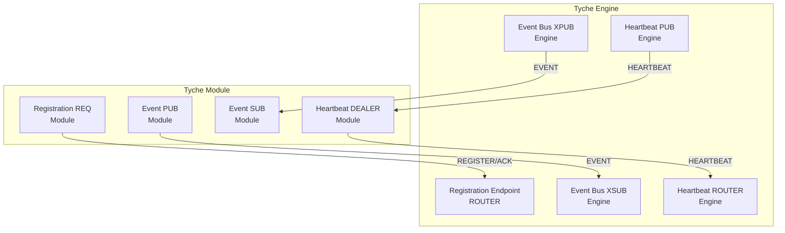
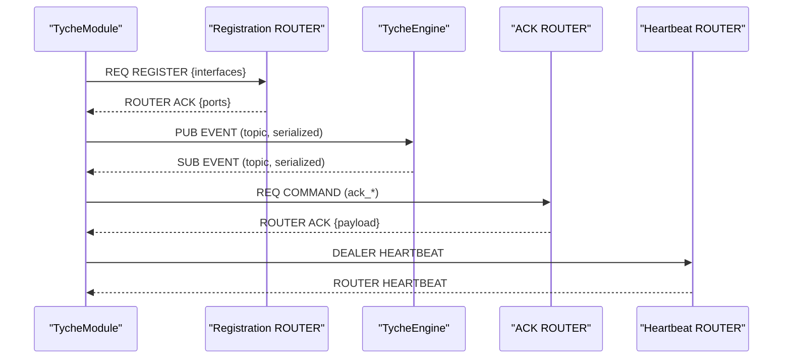
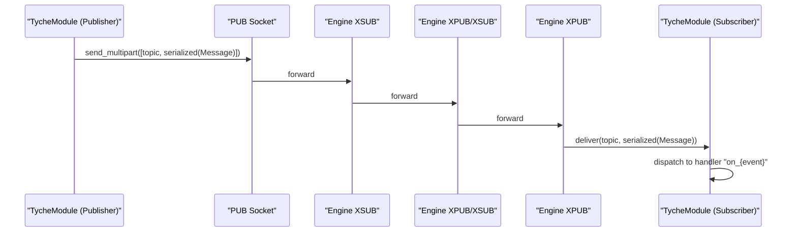
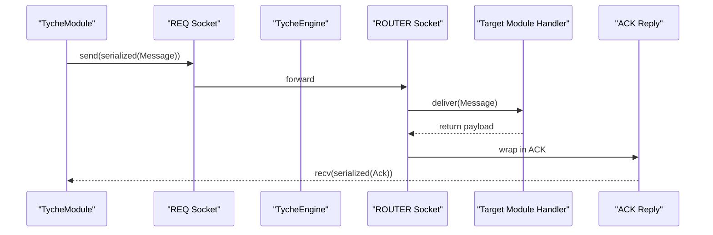
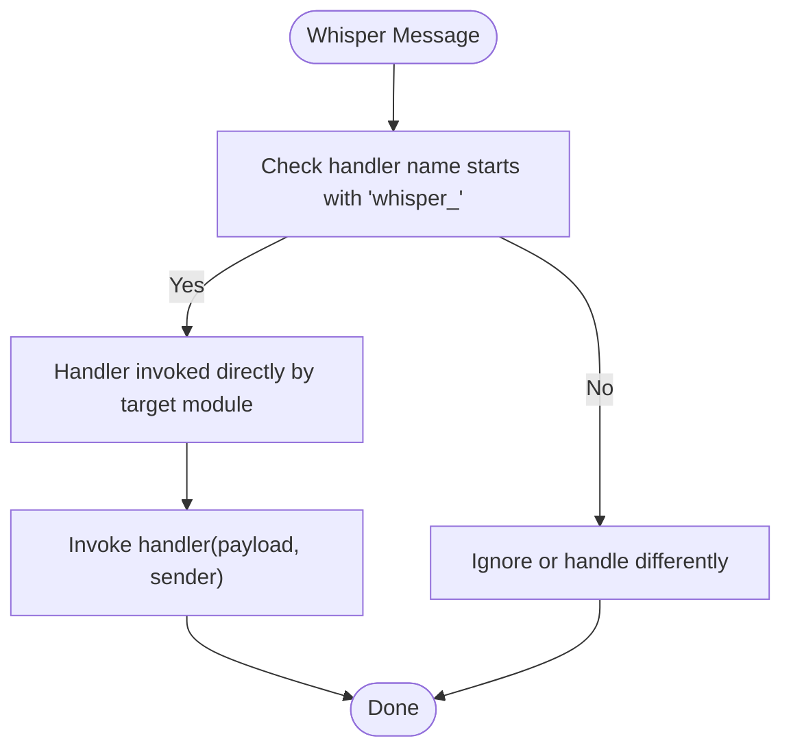
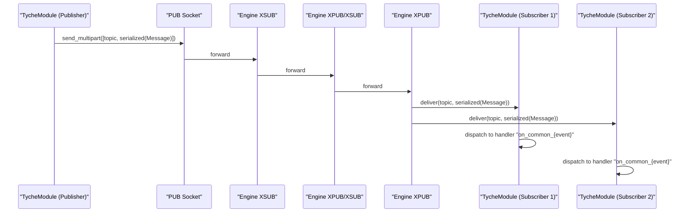
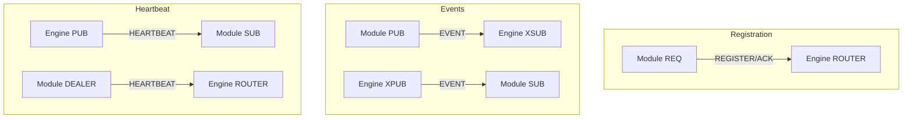
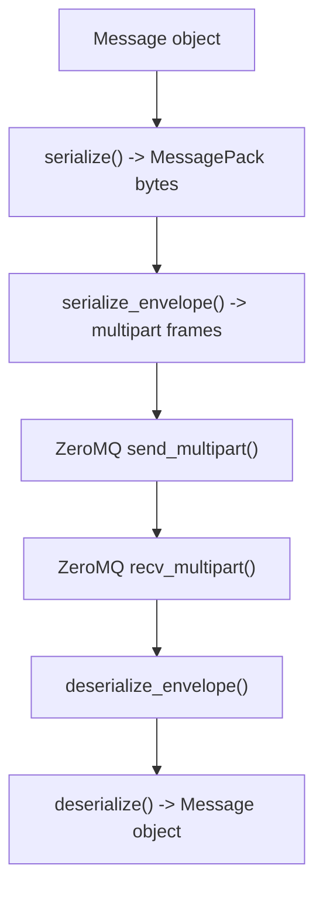
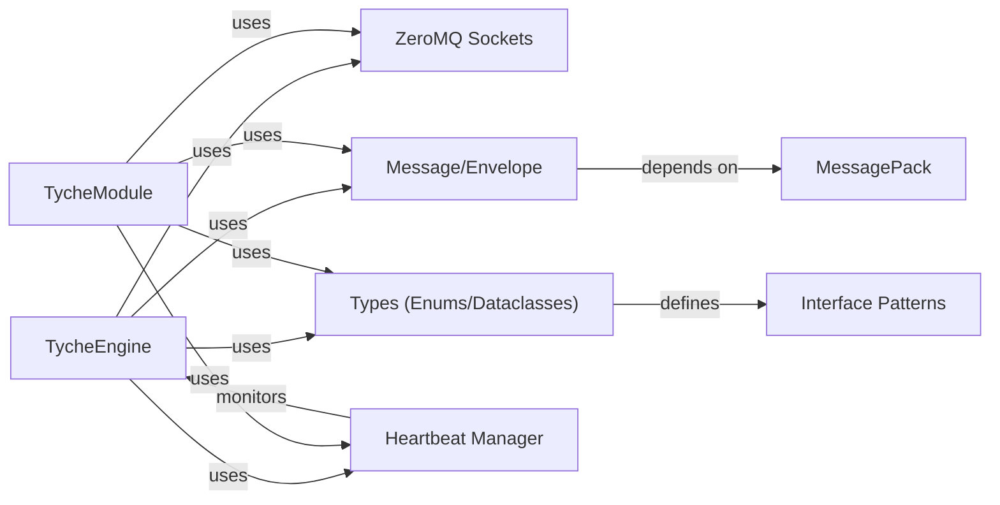

# Communication Patterns

<cite>
**Referenced Files in This Document**
- [engine.py](file://src/tyche/engine.py)
- [module.py](file://src/tyche/module.py)
- [module_base.py](file://src/tyche/module_base.py)
- [message.py](file://src/tyche/message.py)
- [types.py](file://src/tyche/types.py)
- [heartbeat.py](file://src/tyche/heartbeat.py)
- [engine_main.py](file://src/tyche/engine_main.py)
- [example_module.py](file://src/tyche/example_module.py)
- [run_engine.py](file://examples/run_engine.py)
- [run_module.py](file://examples/run_module.py)
</cite>

## Table of Contents
1. [Introduction](#introduction)
2. [Project Structure](#project-structure)
3. [Core Components](#core-components)
4. [Architecture Overview](#architecture-overview)
5. [Detailed Component Analysis](#detailed-component-analysis)
6. [Dependency Analysis](#dependency-analysis)
7. [Performance Considerations](#performance-considerations)
8. [Troubleshooting Guide](#troubleshooting-guide)
9. [Conclusion](#conclusion)

## Introduction
This document explains Tyche Engine’s communication patterns and messaging architecture. It focuses on four primary patterns:
- Fire-and-forget events (on_*)
- Request-response (ack_*)
- Direct P2P messaging (whisper_*)
- Broadcast events (on_common_*)

It documents the ZeroMQ socket patterns used (ROUTER/DEALER, XPUB/XSUB, PUB/SUB), message serialization with MessagePack, envelope handling, routing mechanisms, durability levels, error handling, and performance characteristics. Practical examples are referenced from the implementation.

## Project Structure
Tyche Engine is organized around a central broker (TycheEngine) and client modules (TycheModule). The engine exposes:
- Registration endpoint (ROUTER)
- Event bus (XPUB/XSUB)
- Heartbeat channels (PUB/SUB)
- Optional ACK routing endpoint (ROUTER/DEALER)

Modules connect via REQ for registration, PUB/SUB for events, and DEALER for heartbeats.

**Diagram sources**
- [engine.py:124-128](file://src/tyche/engine.py#L124-L128)
- [engine.py:247-254](file://src/tyche/engine.py#L247-L254)
- [engine.py:284-297](file://src/tyche/engine.py#L284-L297)
- [engine.py:310-314](file://src/tyche/engine.py#L310-L314)
- [module.py:208-211](file://src/tyche/module.py#L208-L211)
- [module.py:141-149](file://src/tyche/module.py#L141-L149)
- [module.py:155-157](file://src/tyche/module.py#L155-L157)

**Section sources**
- [engine.py:34-54](file://src/tyche/engine.py#L34-L54)
- [module.py:41-76](file://src/tyche/module.py#L41-L76)
- [engine_main.py:13-52](file://src/tyche/engine_main.py#L13-L52)

## Core Components
- TycheEngine: Central broker managing registration, event routing, and heartbeats.
- TycheModule: Base class for modules connecting to the engine, registering interfaces, publishing/subscribing to events, and sending heartbeats.
- Message: Application-level message structure with fields for type, sender, event, payload, recipient, durability, timestamp, and correlation_id.
- Envelope: ZeroMQ routing envelope for multipart frames with identity and routing stack.
- Types: Enums and dataclasses for message types, interface patterns, durability levels, endpoints, and module info.

Key responsibilities:
- Registration: REQ/ROUTER handshake for module registration and interface discovery.
- Event routing: XPUB/XSUB proxy for publish/subscribe event distribution.
- Heartbeat: PUB/SUB and ROUTER/DEALER for liveness monitoring.
- Message serialization: MessagePack with custom Decimal handling.

**Section sources**
- [engine.py:25-32](file://src/tyche/engine.py#L25-L32)
- [module.py:28-40](file://src/tyche/module.py#L28-L40)
- [message.py:13-35](file://src/tyche/message.py#L13-L35)
- [message.py:37-49](file://src/tyche/message.py#L37-L49)
- [types.py:41-74](file://src/tyche/types.py#L41-L74)

## Architecture Overview
Tyche Engine uses a hybrid ZeroMQ topology:
- Registration: REQ (module) to ROUTER (engine) for one-shot registration.
- Events: PUB/SUB-like via XPUB/XSUB proxy to distribute events to subscribers.
- Heartbeat: PUB/SUB for engine-to-modules heartbeats and ROUTER for modules’ replies.
- ACK: Optional ROUTER/DEALER pair for request-response semantics.

**Diagram sources**
- [module.py:200-254](file://src/tyche/module.py#L200-L254)
- [engine.py:121-177](file://src/tyche/engine.py#L121-L177)
- [module.py:301-329](file://src/tyche/module.py#L301-L329)
- [module.py:331-373](file://src/tyche/module.py#L331-L373)
- [module.py:376-400](file://src/tyche/module.py#L376-L400)
- [engine.py:310-339](file://src/tyche/engine.py#L310-L339)

## Detailed Component Analysis

### Communication Pattern: Fire-and-Forget Events (on_*)
- Purpose: Asynchronous, best-effort delivery of events to subscribers.
- Implementation:
  - Module publishes events via PUB socket bound to engine’s XSUB endpoint.
  - Engine’s XPUB/XSUB proxy forwards events to subscribers.
  - Subscribers receive via SUB socket and dispatch to handlers named with the “on_” prefix.
- Routing:
  - Topic-based subscription using the event name as the topic.
  - No reply required; delivery guarantees are best-effort.
- Durability:
  - Default durability level is asynchronous flush.
- Error handling:
  - Receive timeouts are handled gracefully; errors logged and ignored if running.
- Performance:
  - High throughput, low latency, no backpressure.
- Example references:
  - [module.py:301-329](file://src/tyche/module.py#L301-L329)
  - [module.py:265-282](file://src/tyche/module.py#L265-L282)
  - [engine.py:238-277](file://src/tyche/engine.py#L238-L277)

**Diagram sources**
- [module.py:301-329](file://src/tyche/module.py#L301-L329)
- [engine.py:238-277](file://src/tyche/engine.py#L238-L277)
- [module.py:265-282](file://src/tyche/module.py#L265-L282)

**Section sources**
- [module.py:301-329](file://src/tyche/module.py#L301-L329)
- [module.py:265-282](file://src/tyche/module.py#L265-L282)
- [engine.py:238-277](file://src/tyche/engine.py#L238-L277)
- [types.py:60-65](file://src/tyche/types.py#L60-L65)

### Communication Pattern: Request-Response (ack_*)
- Purpose: Synchronous request with acknowledgment response.
- Implementation:
  - Module sends a COMMAND message via REQ to the engine’s registration endpoint.
  - Engine routes the message to the appropriate module handler.
  - Handler returns a payload; engine wraps it in an ACK message and replies.
  - Module receives ACK within a configured timeout.
- Routing:
  - Uses ROUTER/DEALER for bidirectional request/response.
  - The engine maintains module interfaces to route to the correct handler.
- Durability:
  - Request delivery is best-effort; response is sent once handler completes.
- Error handling:
  - Timeout raises a zmq.error.Again; module logs and returns None.
- Performance:
  - Lower throughput than fire-and-forget due to synchronous round-trip.
- Example references:
  - [module.py:331-373](file://src/tyche/module.py#L331-L373)
  - [engine.py:144-177](file://src/tyche/engine.py#L144-L177)

**Diagram sources**
- [module.py:331-373](file://src/tyche/module.py#L331-L373)
- [engine.py:144-177](file://src/tyche/engine.py#L144-L177)

**Section sources**
- [module.py:331-373](file://src/tyche/module.py#L331-L373)
- [engine.py:144-177](file://src/tyche/engine.py#L144-L177)
- [types.py:67-74](file://src/tyche/types.py#L67-L74)

### Communication Pattern: Direct P2P Messaging (whisper_*)
- Purpose: Direct, point-to-point messaging between specific modules.
- Implementation:
  - The engine does not route whisper messages; they are intended for direct module-to-module exchange.
  - The TycheModule base class defines the naming convention and auto-discovers handlers.
- Routing:
  - Not routed by the engine; handler name encodes target and event.
- Durability:
  - Configurable via interface durability setting.
- Error handling:
  - Exceptions in handlers are logged; no engine-level routing occurs.
- Performance:
  - Best-effort delivery; minimal overhead.
- Example references:
  - [module_base.py:10-30](file://src/tyche/module_base.py#L10-L30)
  - [module_base.py:74-84](file://src/tyche/module_base.py#L74-L84)
  - [example_module.py:102-113](file://src/tyche/example_module.py#L102-L113)

**Diagram sources**
- [module_base.py:74-84](file://src/tyche/module_base.py#L74-L84)
- [example_module.py:102-113](file://src/tyche/example_module.py#L102-L113)

**Section sources**
- [module_base.py:10-30](file://src/tyche/module_base.py#L10-L30)
- [module_base.py:74-84](file://src/tyche/module_base.py#L74-L84)
- [example_module.py:102-113](file://src/tyche/example_module.py#L102-L113)

### Communication Pattern: Broadcast Events (on_common_*)
- Purpose: Broadcast messages delivered to all subscribers.
- Implementation:
  - Module publishes events using send_event with a topic prefixed with “on_common_”.
  - Engine’s XPUB/XSUB proxy distributes the message to all subscribers.
  - Subscribers receive and dispatch to handlers named with the “on_common_” prefix.
- Routing:
  - Topic-based subscription; all subscribers receive.
- Durability:
  - Best-effort broadcast; no per-subscriber acknowledgments.
- Error handling:
  - Receive timeouts are handled gracefully; errors logged.
- Performance:
  - High fan-out cost; suitable for lightweight broadcasts.
- Example references:
  - [module.py:301-329](file://src/tyche/module.py#L301-L329)
  - [module.py:265-282](file://src/tyche/module.py#L265-L282)
  - [example_module.py:115-122](file://src/tyche/example_module.py#L115-L122)
  - [example_module.py:142-150](file://src/tyche/example_module.py#L142-L150)

**Diagram sources**
- [module.py:301-329](file://src/tyche/module.py#L301-L329)
- [engine.py:238-277](file://src/tyche/engine.py#L238-L277)
- [module.py:265-282](file://src/tyche/module.py#L265-L282)
- [example_module.py:142-150](file://src/tyche/example_module.py#L142-L150)

**Section sources**
- [module.py:301-329](file://src/tyche/module.py#L301-L329)
- [module.py:265-282](file://src/tyche/module.py#L265-L282)
- [engine.py:238-277](file://src/tyche/engine.py#L238-L277)
- [example_module.py:115-122](file://src/tyche/example_module.py#L115-L122)
- [example_module.py:142-150](file://src/tyche/example_module.py#L142-L150)

### ZeroMQ Socket Patterns and Implementations
- Registration: REQ (module) to ROUTER (engine) for one-shot registration handshake.
- Event Bus: XPUB/XSUB proxy inside the engine; modules connect PUB/SUB to XSUB/XSUB respectively.
- Heartbeat: PUB (engine) to SUB (modules); ROUTER (engine) to DEALER (modules) for replies.
- ACK: Optional ROUTER/DEALER pair for request-response.

**Diagram sources**
- [module.py:208-211](file://src/tyche/module.py#L208-L211)
- [engine.py:124-128](file://src/tyche/engine.py#L124-L128)
- [module.py:141-149](file://src/tyche/module.py#L141-L149)
- [engine.py:247-254](file://src/tyche/engine.py#L247-L254)
- [module.py:155-157](file://src/tyche/module.py#L155-L157)
- [engine.py:310-314](file://src/tyche/engine.py#L310-L314)
- [engine.py:284-297](file://src/tyche/engine.py#L284-L297)

**Section sources**
- [module.py:208-211](file://src/tyche/module.py#L208-L211)
- [engine.py:124-128](file://src/tyche/engine.py#L124-L128)
- [module.py:141-149](file://src/tyche/module.py#L141-L149)
- [engine.py:247-254](file://src/tyche/engine.py#L247-L254)
- [module.py:155-157](file://src/tyche/module.py#L155-L157)
- [engine.py:310-314](file://src/tyche/engine.py#L310-L314)
- [engine.py:284-297](file://src/tyche/engine.py#L284-L297)

### Message Serialization and Envelope Handling
- Serialization: MessagePack encoding with custom Decimal handling via a default encoder/decoder hook.
- Envelope: Multipart frames carrying routing identities and the serialized message; supports routing stacks for reply paths.
- Routing: Identity frames from ROUTER are preserved; empty delimiter separates routing stack from identity and message.

**Diagram sources**
- [message.py:69-88](file://src/tyche/message.py#L69-L88)
- [message.py:114-137](file://src/tyche/message.py#L114-L137)
- [message.py:140-167](file://src/tyche/message.py#L140-L167)

**Section sources**
- [message.py:69-88](file://src/tyche/message.py#L69-L88)
- [message.py:114-137](file://src/tyche/message.py#L114-L137)
- [message.py:140-167](file://src/tyche/message.py#L140-L167)

### Durability Levels and Routing Mechanisms
- Durability levels:
  - BEST_EFFORT: No persistence guarantee.
  - ASYNC_FLUSH: Async write (default).
  - SYNC_FLUSH: Sync write, confirmed.
- Routing mechanisms:
  - Registration: ROUTER/REQ for module lifecycle.
  - Events: XPUB/XSUB proxy for pub/sub distribution.
  - Heartbeat: PUB/SUB and ROUTER/DEALER for liveness.
  - ACK: ROUTER/DEALER for request-response.

**Section sources**
- [types.py:60-65](file://src/tyche/types.py#L60-L65)
- [types.py:51-58](file://src/tyche/types.py#L51-L58)
- [engine.py:124-128](file://src/tyche/engine.py#L124-L128)
- [engine.py:247-254](file://src/tyche/engine.py#L247-L254)
- [engine.py:284-297](file://src/tyche/engine.py#L284-L297)
- [engine.py:310-314](file://src/tyche/engine.py#L310-L314)

### Practical Examples
- Running the engine and a module:
  - [run_engine.py:21-48](file://examples/run_engine.py#L21-L48)
  - [run_module.py:22-46](file://examples/run_module.py#L22-L46)
- Example module demonstrating all patterns:
  - [example_module.py:77-122](file://src/tyche/example_module.py#L77-L122)
  - [example_module.py:142-150](file://src/tyche/example_module.py#L142-L150)

**Section sources**
- [run_engine.py:21-48](file://examples/run_engine.py#L21-L48)
- [run_module.py:22-46](file://examples/run_module.py#L22-L46)
- [example_module.py:77-122](file://src/tyche/example_module.py#L77-L122)
- [example_module.py:142-150](file://src/tyche/example_module.py#L142-L150)

## Dependency Analysis
Tyche Engine’s communication depends on:
- ZeroMQ sockets for transport and routing.
- MessagePack for efficient serialization.
- Heartbeat monitoring for liveness.
- Typed enums and dataclasses for configuration and routing metadata.

**Diagram sources**
- [engine.py:8-20](file://src/tyche/engine.py#L8-L20)
- [module.py:11-23](file://src/tyche/module.py#L11-L23)
- [message.py:8-10](file://src/tyche/message.py#L8-L10)
- [types.py:67-102](file://src/tyche/types.py#L67-L102)
- [heartbeat.py:16-142](file://src/tyche/heartbeat.py#L16-L142)

**Section sources**
- [engine.py:8-20](file://src/tyche/engine.py#L8-L20)
- [module.py:11-23](file://src/tyche/module.py#L11-L23)
- [message.py:8-10](file://src/tyche/message.py#L8-L10)
- [types.py:67-102](file://src/tyche/types.py#L67-L102)
- [heartbeat.py:16-142](file://src/tyche/heartbeat.py#L16-L142)

## Performance Considerations
- Fire-and-forget events:
  - High throughput, minimal latency; no backpressure.
  - Suitable for telemetry, metrics, and non-critical notifications.
- Request-response (ack_*):
  - Synchronous round-trip introduces latency; lower throughput.
  - Use for critical commands requiring confirmation.
- Direct P2P (whisper_*):
  - Minimal overhead; best-effort delivery.
  - Use for targeted inter-module communication.
- Broadcast (on_common_*):
  - Fan-out cost increases with subscriber count.
  - Use sparingly; keep payloads small.
- Serialization:
  - MessagePack is compact and fast; custom Decimal handling ensures precision.
- Heartbeat:
  - Paranoid Pirate pattern ensures timely detection of dead modules.

[No sources needed since this section provides general guidance]

## Troubleshooting Guide
Common issues and remedies:
- Registration timeout:
  - Verify engine is running and listening on the registration endpoint.
  - Check network connectivity and firewall rules.
  - Review module registration logs for errors.
- Event delivery gaps:
  - Confirm topic subscription matches handler names.
  - Ensure engine’s XPUB/XSUB proxy is running.
- ACK timeouts:
  - Increase timeout or reduce payload size.
  - Verify handler returns a payload for ack_* patterns.
- Heartbeat failures:
  - Check heartbeat endpoints and socket bindings.
  - Validate DEALER/ROUTER pairing for heartbeat replies.
- Serialization errors:
  - Ensure payloads contain serializable types; Decimal values are handled automatically.

**Section sources**
- [module.py:247-254](file://src/tyche/module.py#L247-L254)
- [module.py:265-282](file://src/tyche/module.py#L265-L282)
- [module.py:369-372](file://src/tyche/module.py#L369-L372)
- [engine.py:310-339](file://src/tyche/engine.py#L310-L339)
- [message.py:51-67](file://src/tyche/message.py#L51-L67)

## Conclusion
Tyche Engine’s communication model combines ZeroMQ’s flexible socket patterns with a clean message abstraction. The four patterns—fire-and-forget, request-response, direct P2P, and broadcast—cover common distributed messaging needs. MessagePack serialization and envelope handling provide robust routing and identity preservation. Durability levels and heartbeat monitoring enable configurable reliability and liveness tracking. The examples demonstrate practical usage across all patterns.