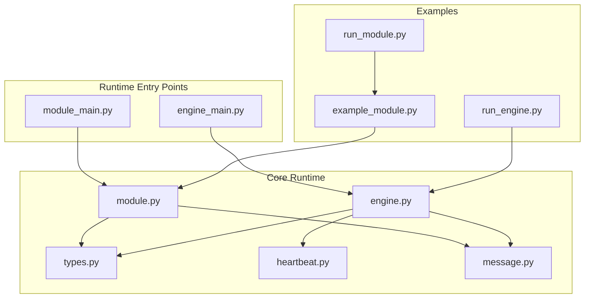
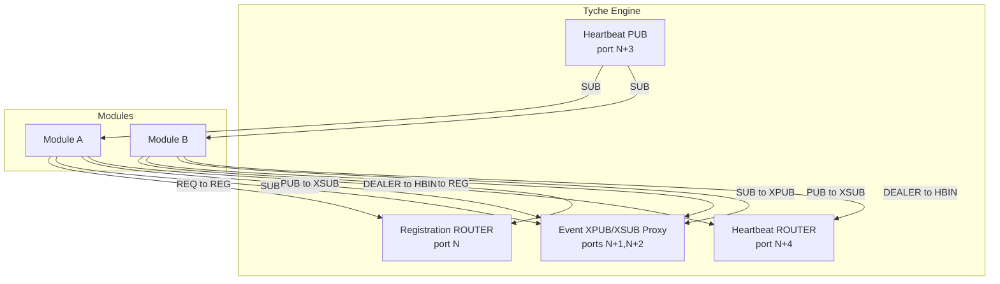
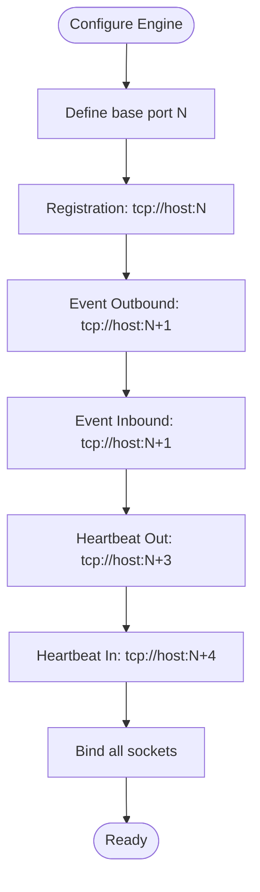
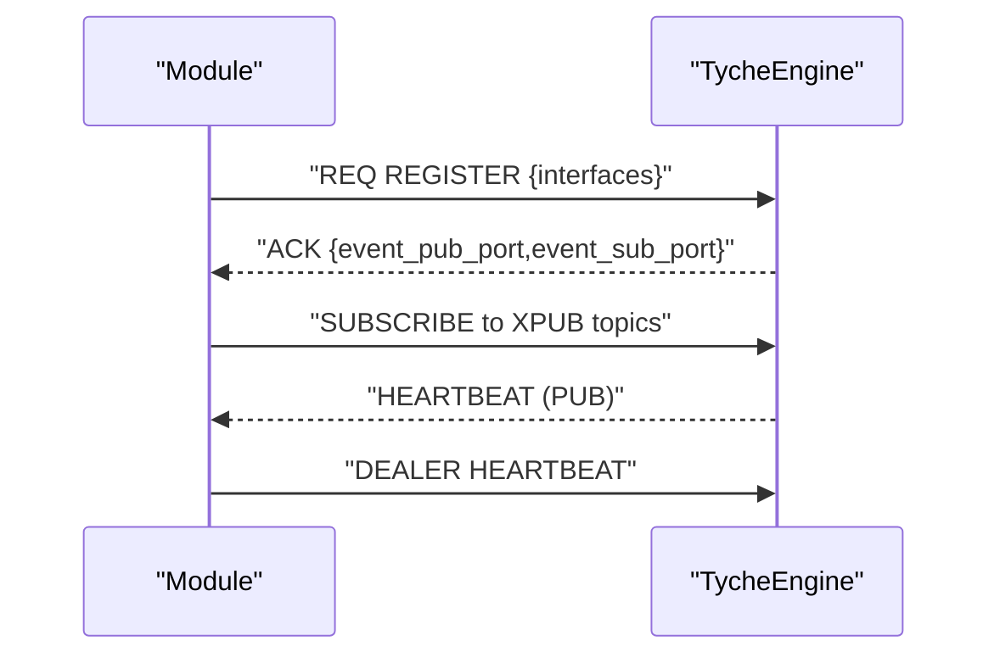
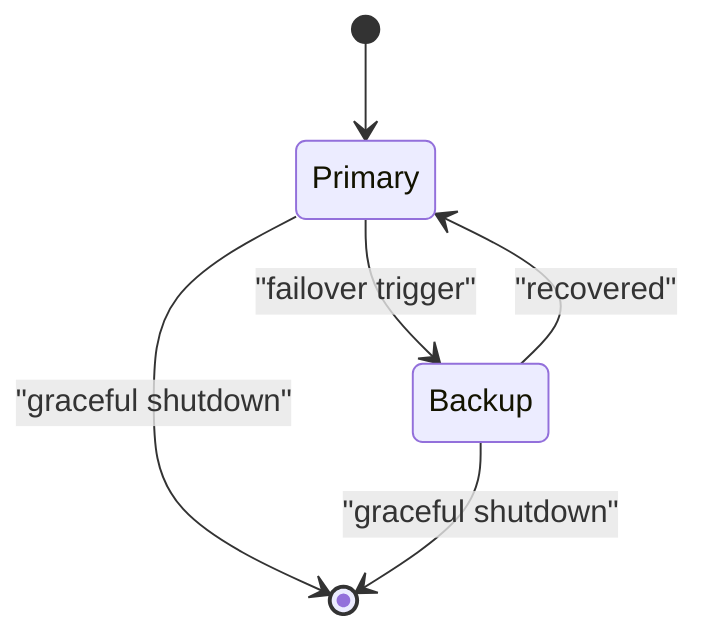
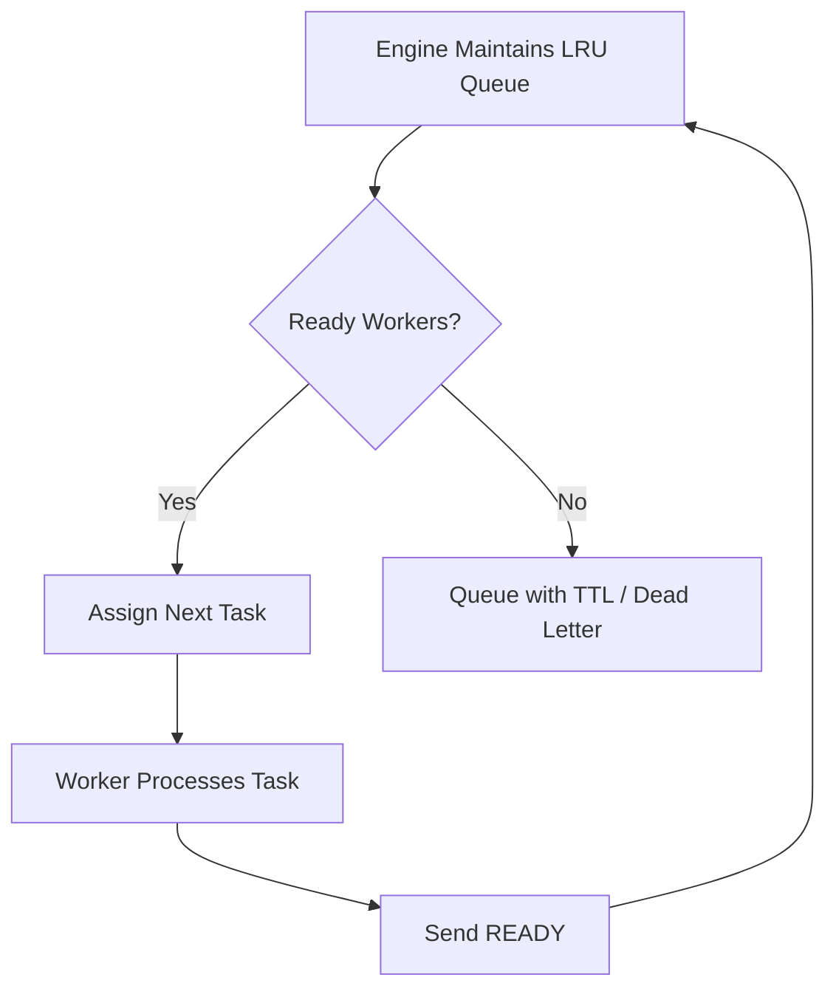
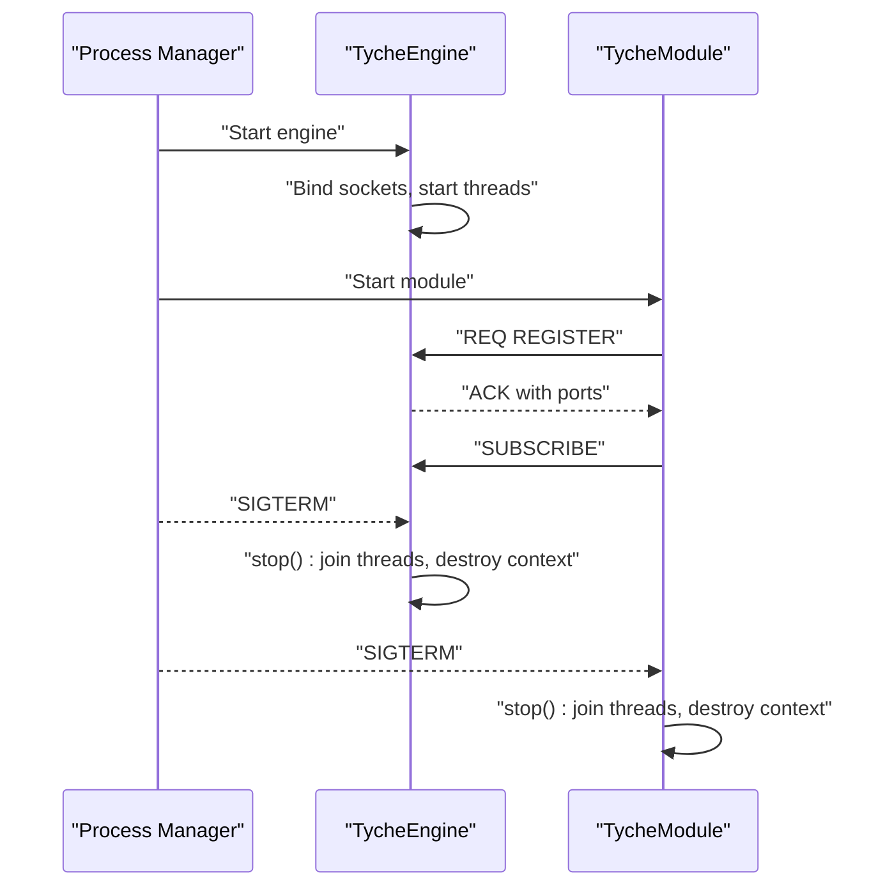
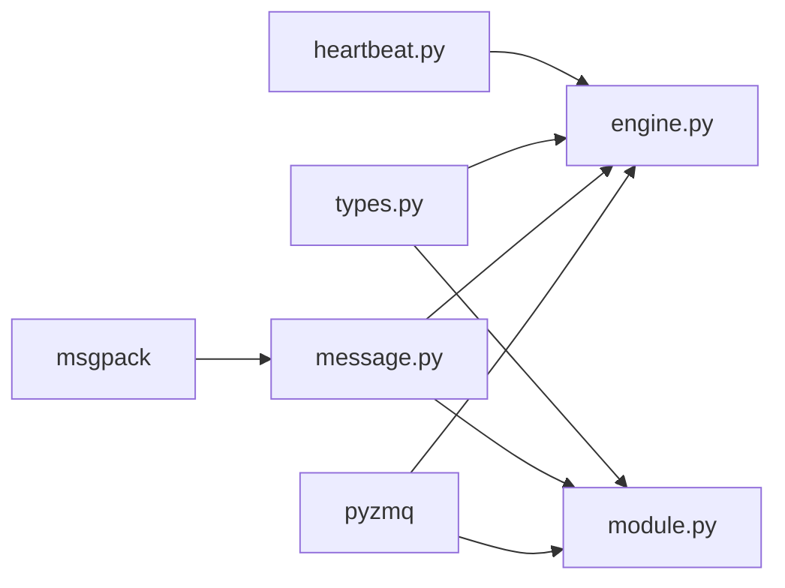

# Deployment and Topology

**Referenced Files in This Document**
- [README.md](file://README.md)
- [engine.py](file://src/tyche/engine.py)
- [engine_main.py](file://src/tyche/engine_main.py)
- [module.py](file://src/tyche/module.py)
- [module_main.py](file://src/tyche/module_main.py)
- [types.py](file://src/tyche/types.py)
- [heartbeat.py](file://src/tyche/heartbeat.py)
- [message.py](file://src/tyche/message.py)
- [example_module.py](file://src/tyche/example_module.py)
- [run_engine.py](file://examples/run_engine.py)
- [run_module.py](file://examples/run_module.py)
- [pyproject.toml](file://pyproject.toml)

## Table of Contents
1. [Introduction](#introduction)
2. [Project Structure](#project-structure)
3. [Core Components](#core-components)
4. [Architecture Overview](#architecture-overview)
5. [Detailed Component Analysis](#detailed-component-analysis)
6. [Dependency Analysis](#dependency-analysis)
7. [Performance Considerations](#performance-considerations)
8. [Troubleshooting Guide](#troubleshooting-guide)
9. [Conclusion](#conclusion)
10. [Appendices](#appendices)

## Introduction
This document provides comprehensive deployment guidance for Tyche Engine across single-engine and multi-engine topologies, high availability using the Binary Star pattern, and load balancing strategies. It explains endpoint configuration, port allocation schemes, network topology requirements, process management, startup/shutdown procedures, production deployment scenarios, containerization approaches, monitoring, scaling, resource allocation, and performance tuning.

## Project Structure
Tyche Engine is organized around a central broker (TycheEngine) and pluggable modules. The runtime entry points for the engine and example module demonstrate typical deployment patterns. Core abstractions define endpoints, message types, and heartbeat behavior.

**Diagram sources**
- [engine_main.py:13-53](file://src/tyche/engine_main.py#L13-L53)
- [module_main.py:13-47](file://src/tyche/module_main.py#L13-L47)
- [engine.py:25-350](file://src/tyche/engine.py#L25-L350)
- [module.py:28-401](file://src/tyche/module.py#L28-L401)
- [types.py:76-102](file://src/tyche/types.py#L76-L102)
- [heartbeat.py:91-142](file://src/tyche/heartbeat.py#L91-L142)
- [message.py:13-168](file://src/tyche/message.py#L13-L168)
- [run_engine.py:21-54](file://examples/run_engine.py#L21-L54)
- [run_module.py:22-51](file://examples/run_module.py#L22-L51)
- [example_module.py:19-167](file://src/tyche/example_module.py#L19-L167)

**Section sources**
- [engine_main.py:13-53](file://src/tyche/engine_main.py#L13-L53)
- [module_main.py:13-47](file://src/tyche/module_main.py#L13-L47)
- [run_engine.py:21-54](file://examples/run_engine.py#L21-L54)
- [run_module.py:22-51](file://examples/run_module.py#L22-L51)

## Core Components
- TycheEngine: Central broker providing registration, event routing via XPUB/XSUB proxy, heartbeat broadcasting, and module lifecycle monitoring.
- TycheModule: Base class for modules connecting to the engine, registering interfaces, subscribing to events, and sending heartbeats.
- Types: Endpoint, Interface, DurabilityLevel, MessageType, ModuleId, and heartbeat constants.
- Heartbeat: Implements Paranoid Pirate Pattern for liveness tracking.
- Message: Serialization/deserialization using MessagePack.

Key deployment implications:
- Endpoint configuration drives socket binding/connectivity.
- Heartbeat intervals and liveness thresholds govern failure detection and recovery.
- Message serialization ensures cross-language and cross-process compatibility.

**Section sources**
- [engine.py:25-350](file://src/tyche/engine.py#L25-L350)
- [module.py:28-401](file://src/tyche/module.py#L28-L401)
- [types.py:76-102](file://src/tyche/types.py#L76-L102)
- [heartbeat.py:91-142](file://src/tyche/heartbeat.py#L91-L142)
- [message.py:69-111](file://src/tyche/message.py#L69-L111)

## Architecture Overview
Tyche Engine uses ZeroMQ sockets for decoupled, high-throughput communication. The engine exposes distinct endpoints for registration, event broadcasting, and heartbeats. Modules connect to the engine, register interfaces, subscribe to events, and send heartbeats.

**Diagram sources**
- [engine.py:34-54](file://src/tyche/engine.py#L34-L54)
- [engine.py:124-174](file://src/tyche/engine.py#L124-L174)
- [engine.py:247-277](file://src/tyche/engine.py#L247-L277)
- [engine.py:284-305](file://src/tyche/engine.py#L284-L305)
- [engine.py:310-339](file://src/tyche/engine.py#L310-L339)
- [module.py:208-254](file://src/tyche/module.py#L208-L254)
- [module.py:146-151](file://src/tyche/module.py#L146-L151)
- [module.py:154-157](file://src/tyche/module.py#L154-L157)

**Section sources**
- [README.md:26-44](file://README.md#L26-L44)
- [engine.py:34-54](file://src/tyche/engine.py#L34-L54)
- [module.py:133-178](file://src/tyche/module.py#L133-L178)

## Detailed Component Analysis

### Endpoint Configuration and Port Allocation
Tyche Engine defines a set of endpoints with sensible defaults and derived ports:
- Registration endpoint (ROUTER): used for module handshake and interface discovery.
- Event endpoints (XPUB/XSUB): separate outbound and inbound ports for event publishing and subscription.
- Heartbeat endpoints (PUB/ROUTER): outbound for engine broadcasts, inbound for module heartbeats.

Port allocation scheme:
- Registration port N
- Event outbound (XPUB) port N + 1
- Event inbound (XSUB) port N + 1
- Heartbeat outbound (PUB) port N + 3
- Heartbeat inbound (ROUTER) port N + 4

This scheme minimizes collisions and simplifies firewall configuration.

**Diagram sources**
- [engine.py:42-54](file://src/tyche/engine.py#L42-L54)
- [engine.py:253-254](file://src/tyche/engine.py#L253-L254)
- [engine.py:127](file://src/tyche/engine.py#L127)
- [engine.py:313](file://src/tyche/engine.py#L313)

**Section sources**
- [engine.py:42-54](file://src/tyche/engine.py#L42-L54)
- [engine_main.py:14-33](file://src/tyche/engine_main.py#L14-L33)
- [types.py:76-83](file://src/tyche/types.py#L76-L83)

### Single-Engine Deployment
Single-engine deployments are ideal for development, testing, and small-scale production. The engine binds all required endpoints on a loopback or local interface.

Recommended procedure:
- Start the engine with default ports or custom ports aligned with the scheme above.
- Start modules pointing to the engine’s registration endpoint.
- Verify heartbeats and event subscriptions.

**Diagram sources**
- [engine.py:124-174](file://src/tyche/engine.py#L124-L174)
- [module.py:208-254](file://src/tyche/module.py#L208-L254)
- [module.py:146-151](file://src/tyche/module.py#L146-L151)
- [module.py:154-157](file://src/tyche/module.py#L154-L157)

**Section sources**
- [run_engine.py:27-47](file://examples/run_engine.py#L27-L47)
- [run_module.py:28-44](file://examples/run_module.py#L28-L44)
- [engine_main.py:13-53](file://src/tyche/engine_main.py#L13-L53)
- [module_main.py:13-47](file://src/tyche/module_main.py#L13-L47)

### Multi-Engine Deployments and High Availability (Binary Star)
Tyche Engine supports high availability using the Binary Star pattern:
- Primary-backup failover with automatic promotion.
- Shared configuration via distributed consensus or shared storage.
- Replication of message queue state between instances.
- Clients retry using Lazy Pirate pattern to tolerate transient failures.

Operational guidance:
- Run two engine instances with distinct roles (primary/backup).
- Configure shared storage for durable state and logs.
- Use a stable VIP or DNS name for clients to connect.
- Implement fencing to prevent split-brain scenarios.

**Diagram sources**
- [README.md:37-44](file://README.md#L37-L44)

**Section sources**
- [README.md:37-44](file://README.md#L37-L44)

### Load Balancing Strategies
Tyche Engine employs the Paranoid Pirate pattern for worker liveness and a Ready-Worker queue for load balancing:
- Modules send READY signals after registration and after completing tasks.
- Engine assigns work to the longest-waiting ready worker.
- Unavailable workers are removed after heartbeat timeouts.
- Slow workers are detected and mitigated.

**Diagram sources**
- [README.md:271-288](file://README.md#L271-L288)

**Section sources**
- [README.md:248-299](file://README.md#L248-L299)

### Process Management, Startup Sequences, and Shutdown Procedures
Startup:
- Engine: Parse arguments, construct endpoints, initialize ZeroMQ context, start worker threads, bind sockets, and block.
- Module: Parse arguments, construct endpoints, register with engine (REQ), connect to event proxy (PUB/SUB), connect to heartbeat (DEALER), start receiver and heartbeat threads.

Shutdown:
- Both engine and module set stop events, join threads, close sockets, and destroy contexts.

**Diagram sources**
- [engine_main.py:35-48](file://src/tyche/engine_main.py#L35-L48)
- [module_main.py:32-42](file://src/tyche/module_main.py#L32-L42)
- [engine.py:106-118](file://src/tyche/engine.py#L106-L118)
- [module.py:179-197](file://src/tyche/module.py#L179-L197)

**Section sources**
- [engine_main.py:13-53](file://src/tyche/engine_main.py#L13-L53)
- [module_main.py:13-47](file://src/tyche/module_main.py#L13-L47)
- [engine.py:67-118](file://src/tyche/engine.py#L67-L118)
- [module.py:116-197](file://src/tyche/module.py#L116-L197)

### Containerization Approaches
Containerization enables scalable deployments:
- Use a minimal base image with Python and ZeroMQ libraries.
- Expose ports for registration, event, and heartbeat endpoints.
- Mount shared volumes for logs and durable state if using shared storage.
- Use orchestration platforms (Kubernetes/Docker Swarm) for service discovery and health checks.

Networking:
- Prefer host networking for low-latency deployments or configure overlay networks carefully.
- Ensure consistent port allocations across containers.

**Section sources**
- [pyproject.toml:10-13](file://pyproject.toml#L10-L13)

### Monitoring Setup
Monitoring focuses on:
- Heartbeat liveness: track engine-to-module heartbeats and module-to-engine heartbeats.
- Event throughput: measure event rates and latency distributions.
- Resource utilization: CPU, memory, and network bandwidth.
- Disk I/O: monitor persistence service metrics.

Tools:
- Metrics collection (Prometheus/OpenTelemetry) and dashboards (Grafana).
- Log aggregation (ELK/Fluentd) for operational visibility.

**Section sources**
- [heartbeat.py:91-142](file://src/tyche/heartbeat.py#L91-L142)
- [README.md:197-205](file://README.md#L197-L205)

### Production Deployment Scenarios
- Small production: Single engine with multiple homogeneous worker modules.
- Regional distribution: Multiple engines per region with inter-region gossip or sharded event routing.
- Strict ordering: Partition by key to a single worker to maintain ordering.
- Exactly-once semantics: Implement idempotency in handlers plus async WAL.

**Section sources**
- [README.md:329-340](file://README.md#L329-L340)

## Dependency Analysis
Tyche Engine depends on ZeroMQ for messaging and MessagePack for serialization. The core runtime components are loosely coupled, enabling flexible deployment topologies.

**Diagram sources**
- [pyproject.toml:10-13](file://pyproject.toml#L10-L13)
- [engine.py:8](file://src/tyche/engine.py#L8)
- [module.py:11](file://src/tyche/module.py#L11)
- [message.py:8](file://src/tyche/message.py#L8)
- [types.py:76-102](file://src/tyche/types.py#L76-L102)
- [heartbeat.py:10](file://src/tyche/heartbeat.py#L10)

**Section sources**
- [pyproject.toml:10-13](file://pyproject.toml#L10-L13)

## Performance Considerations
- Hot path latency targets are achieved through lock-free ring buffers and efficient ZeroMQ sockets.
- Persistence batching amortizes disk I/O costs.
- Backpressure handling modes (drop oldest, block/alert, expand buffer) adapt to workload demands.
- Tuning ZeroMQ high-water marks and buffer sizes improves throughput under load.

**Section sources**
- [README.md:197-205](file://README.md#L197-L205)
- [README.md:154-158](file://README.md#L154-L158)

## Troubleshooting Guide
Common issues and resolutions:
- Registration timeouts: Verify engine registration port accessibility and network connectivity.
- Heartbeat failures: Confirm heartbeat intervals and liveness thresholds; check module-side heartbeat sockets.
- Event delivery gaps: Review event subscription topics and engine proxy configuration.
- Persistence lag: Adjust batching parameters and monitor disk I/O; consider expanding buffer or pausing new accepts.

**Section sources**
- [module.py:208-254](file://src/tyche/module.py#L208-L254)
- [engine.py:124-174](file://src/tyche/engine.py#L124-L174)
- [heartbeat.py:125-133](file://src/tyche/heartbeat.py#L125-L133)

## Conclusion
Tyche Engine offers a robust foundation for distributed event-driven systems. By adhering to the documented endpoint scheme, leveraging the Binary Star pattern for high availability, implementing proper load balancing, and following the outlined process management and monitoring practices, teams can deploy reliable and scalable systems across diverse environments.

## Appendices

### Endpoint Reference
- Registration endpoint: ROUTER socket for module handshake.
- Event outbound endpoint: XPUB for modules to publish events.
- Event inbound endpoint: XSUB for engine to route events.
- Heartbeat outbound endpoint: PUB for engine-to-modules heartbeats.
- Heartbeat inbound endpoint: ROUTER for modules-to-engine heartbeats.

**Section sources**
- [engine.py:42-54](file://src/tyche/engine.py#L42-L54)
- [engine.py:253-254](file://src/tyche/engine.py#L253-L254)
- [engine.py:313](file://src/tyche/engine.py#L313)