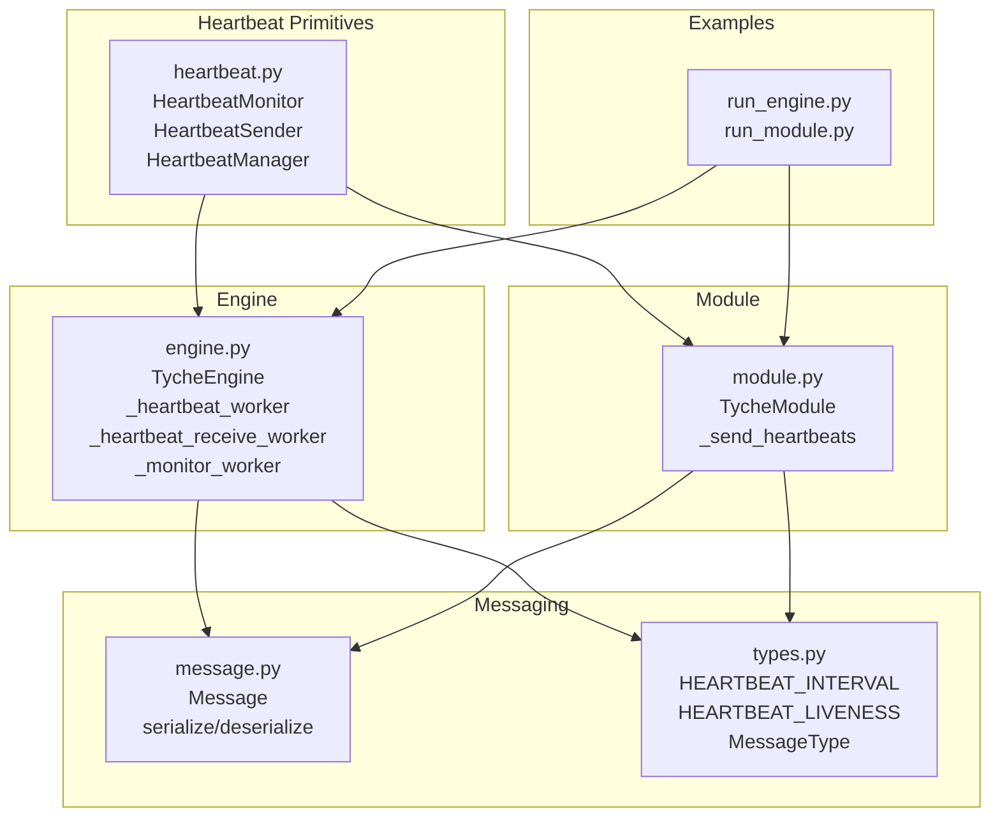
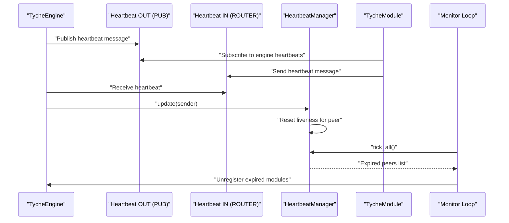
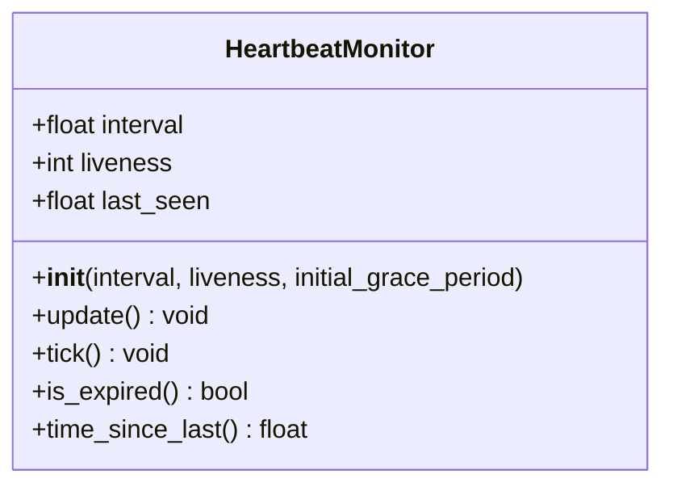
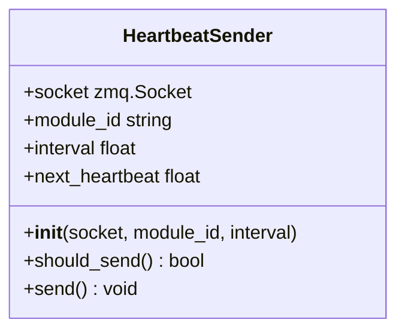
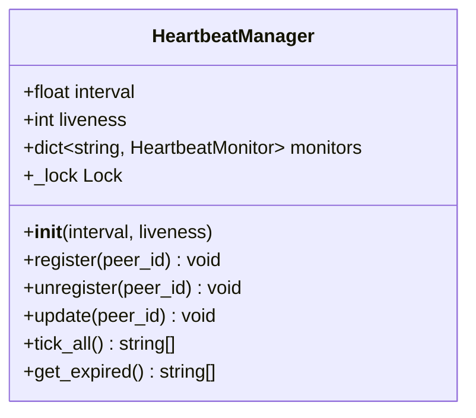
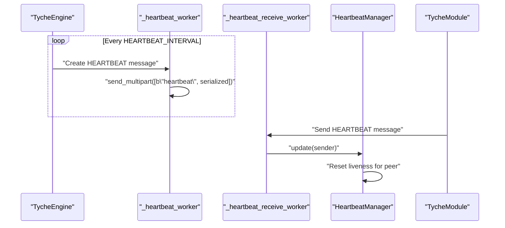
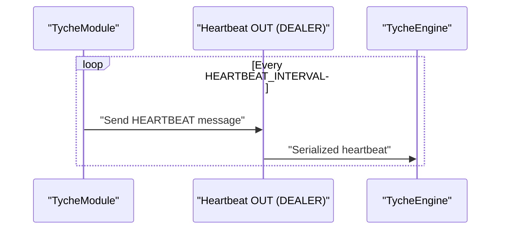
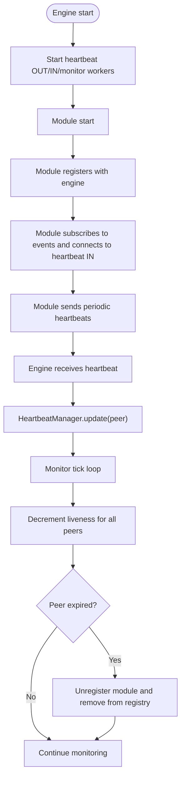
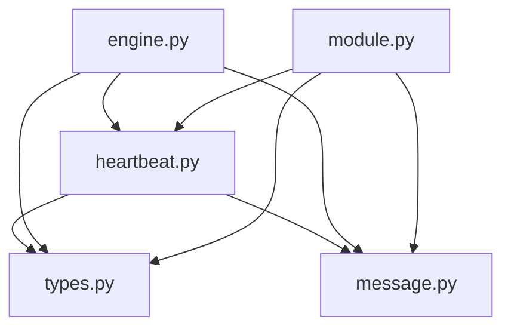

# Heartbeat and Reliability

<cite>
**Referenced Files in This Document**
- [heartbeat.py](file://src/tyche/heartbeat.py)
- [engine.py](file://src/tyche/engine.py)
- [module.py](file://src/tyche/module.py)
- [types.py](file://src/tyche/types.py)
- [message.py](file://src/tyche/message.py)
- [test_heartbeat.py](file://tests/unit/test_heartbeat.py)
- [test_heartbeat_protocol.py](file://tests/unit/test_heartbeat_protocol.py)
- [README.md](file://README.md)
- [run_engine.py](file://examples/run_engine.py)
- [run_module.py](file://examples/run_module.py)
</cite>

## Table of Contents
1. [Introduction](#introduction)
2. [Project Structure](#project-structure)
3. [Core Components](#core-components)
4. [Architecture Overview](#architecture-overview)
5. [Detailed Component Analysis](#detailed-component-analysis)
6. [Dependency Analysis](#dependency-analysis)
7. [Performance Considerations](#performance-considerations)
8. [Troubleshooting Guide](#troubleshooting-guide)
9. [Conclusion](#conclusion)

## Introduction
This document explains Tyche Engine's heartbeat monitoring and reliability system, focusing on the Paranoid Pirate pattern implementation for peer health monitoring. It covers heartbeat broadcasting and reception, expiration detection, the HeartbeatManager class, liveness tracking, automatic module unregistration for failed peers, configuration of heartbeat intervals and timeouts, recovery procedures, and integration with the engine's module management system. It also addresses fault tolerance strategies, network partition handling, and system resilience patterns.

## Project Structure
The heartbeat and reliability system spans several modules:
- Heartbeat primitives and managers
- Engine-side workers for broadcasting and receiving heartbeats
- Module-side heartbeat sender
- Message serialization/deserialization
- Configuration constants
- Tests validating heartbeat behavior
- Examples demonstrating usage

**Diagram sources**
- [heartbeat.py:16-142](file://src/tyche/heartbeat.py#L16-L142)
- [engine.py:25-350](file://src/tyche/engine.py#L25-L350)
- [module.py:28-401](file://src/tyche/module.py#L28-L401)
- [message.py:13-168](file://src/tyche/message.py#L13-L168)
- [types.py:9-11](file://src/tyche/types.py#L9-L11)
- [run_engine.py:21-54](file://examples/run_engine.py#L21-L54)
- [run_module.py:22-51](file://examples/run_module.py#L22-L51)

**Section sources**
- [heartbeat.py:16-142](file://src/tyche/heartbeat.py#L16-L142)
- [engine.py:25-350](file://src/tyche/engine.py#L25-L350)
- [module.py:28-401](file://src/tyche/module.py#L28-L401)
- [message.py:13-168](file://src/tyche/message.py#L13-L168)
- [types.py:9-11](file://src/tyche/types.py#L9-L11)
- [run_engine.py:21-54](file://examples/run_engine.py#L21-L54)
- [run_module.py:22-51](file://examples/run_module.py#L22-L51)

## Core Components
- HeartbeatMonitor: Tracks a single peer's liveness and last-seen timestamp, decrements liveness on each expected interval, and reports expiration.
- HeartbeatSender: Periodically sends heartbeat messages to the engine via a DEALER socket.
- HeartbeatManager: Manages multiple peers, registers/unregisters them, updates liveness on receipt of heartbeats, and identifies expired peers.
- Engine heartbeat workers: Broadcast heartbeats to modules and receive heartbeats from modules, updating liveness accordingly.
- Module heartbeat sender: Sends heartbeat messages to the engine's heartbeat receive endpoint.
- Message serialization: Heartbeat messages are serialized using MessagePack and transmitted as multipart frames.

Key configuration constants:
- HEARTBEAT_INTERVAL: Default heartbeat interval in seconds.
- HEARTBEAT_LIVENESS: Number of missed heartbeats before considering a peer dead.

**Section sources**
- [heartbeat.py:16-142](file://src/tyche/heartbeat.py#L16-L142)
- [engine.py:281-349](file://src/tyche/engine.py#L281-L349)
- [module.py:376-401](file://src/tyche/module.py#L376-L401)
- [types.py:9-11](file://src/tyche/types.py#L9-L11)
- [message.py:69-112](file://src/tyche/message.py#L69-L112)

## Architecture Overview
The system implements the Paranoid Pirate pattern for reliable worker (module) heartbeating:
- Engine periodically publishes heartbeat messages to a PUB socket.
- Modules subscribe to engine heartbeats and send their own heartbeats to the engine via a DEALER socket.
- Engine receives module heartbeats and updates liveness counters.
- A monitor loop decrements liveness for all peers and unregisters those that exceed the liveness threshold.

**Diagram sources**
- [engine.py:281-349](file://src/tyche/engine.py#L281-L349)
- [heartbeat.py:91-142](file://src/tyche/heartbeat.py#L91-L142)
- [module.py:376-401](file://src/tyche/module.py#L376-L401)

## Detailed Component Analysis

### HeartbeatMonitor
Tracks a single peer’s liveness and last-seen timestamp. On initialization, it can apply a grace period multiplier to HEARTBEAT_LIVENESS to account for initial registration delays. Each expected heartbeat interval decrements the liveness counter. When liveness reaches zero, the peer is considered expired.

**Diagram sources**
- [heartbeat.py:16-50](file://src/tyche/heartbeat.py#L16-L50)

**Section sources**
- [heartbeat.py:16-50](file://src/tyche/heartbeat.py#L16-L50)

### HeartbeatSender
Periodically sends heartbeat messages to the engine. It computes the next heartbeat time based on HEARTBEAT_INTERVAL and sends a multipart frame containing the module ID and serialized heartbeat message.

**Diagram sources**
- [heartbeat.py:52-89](file://src/tyche/heartbeat.py#L52-L89)

**Section sources**
- [heartbeat.py:52-89](file://src/tyche/heartbeat.py#L52-L89)

### HeartbeatManager
Manages liveness for multiple peers. It registers new peers, updates liveness upon receiving heartbeats, decrements liveness for all peers on each tick, and returns expired peers for automatic unregistration.

**Diagram sources**
- [heartbeat.py:91-142](file://src/tyche/heartbeat.py#L91-L142)

**Section sources**
- [heartbeat.py:91-142](file://src/tyche/heartbeat.py#L91-L142)

### Engine Heartbeat Workers
- Heartbeat OUT worker: Publishes heartbeat messages to a PUB socket at HEARTBEAT_INTERVAL.
- Heartbeat IN worker: Receives heartbeat messages from modules via a ROUTER socket and updates liveness through HeartbeatManager.
- Monitor worker: Periodically calls tick_all() and unregisters expired modules.

**Diagram sources**
- [engine.py:281-349](file://src/tyche/engine.py#L281-L349)

**Section sources**
- [engine.py:281-349](file://src/tyche/engine.py#L281-L349)

### Module Heartbeat Sender
The module connects to the engine's heartbeat receive endpoint using a DEALER socket and sends heartbeat messages at HEARTBEAT_INTERVAL. Heartbeat sending is interruptible to support graceful shutdown.

**Diagram sources**
- [module.py:376-401](file://src/tyche/module.py#L376-L401)

**Section sources**
- [module.py:376-401](file://src/tyche/module.py#L376-L401)

### Heartbeat Message Format
Heartbeat messages are serialized using MessagePack and include:
- msg_type: HEARTBEAT
- sender: Module ID
- event: "heartbeat"
- payload: Contains "status": "alive"

Heartbeat messages are transmitted as multipart frames:
- Frame 0: Peer/module ID (bytes)
- Frame 1: Serialized MessagePack payload

**Section sources**
- [message.py:69-112](file://src/tyche/message.py#L69-L112)
- [heartbeat.py:75-88](file://src/tyche/heartbeat.py#L75-L88)
- [module.py:383-389](file://src/tyche/module.py#L383-L389)

### Monitoring Workflow
1. Engine starts workers:
   - Heartbeat OUT: publishes periodic heartbeats.
   - Heartbeat IN: receives module heartbeats and updates liveness.
   - Monitor: periodically decrements liveness and unregisters expired modules.
2. Module starts:
   - Registers with engine (one-shot REQ/REP).
   - Connects to event proxy (PUB/SUB) and heartbeat receive endpoint (DEALER).
   - Sends periodic heartbeats to engine.
3. Liveness tracking:
   - On receipt of heartbeat, liveness is reset to HEARTBEAT_LIVENESS.
   - Each tick decrements liveness by 1.
   - Expiration occurs when liveness reaches zero.

**Diagram sources**
- [engine.py:79-101](file://src/tyche/engine.py#L79-L101)
- [engine.py:281-349](file://src/tyche/engine.py#L281-L349)
- [module.py:127-178](file://src/tyche/module.py#L127-L178)
- [heartbeat.py:125-133](file://src/tyche/heartbeat.py#L125-L133)

**Section sources**
- [engine.py:79-101](file://src/tyche/engine.py#L79-L101)
- [engine.py:281-349](file://src/tyche/engine.py#L281-L349)
- [module.py:127-178](file://src/tyche/module.py#L127-L178)
- [heartbeat.py:125-133](file://src/tyche/heartbeat.py#L125-L133)

### Integration with Module Management
- On successful registration, the engine registers the module with HeartbeatManager.
- On unregistration (either manual or automatic via expiration), the engine removes the module from its registry and cleans up associated interfaces.

**Section sources**
- [engine.py:200-234](file://src/tyche/engine.py#L200-L234)

### Fault Tolerance and Resilience
- Grace period: Initial liveness is doubled to accommodate registration delays.
- Timeout thresholds: HEARTBEAT_LIVENESS determines the number of missed heartbeats before expiration.
- Recovery: Modules can restart and re-register; the engine re-establishes monitoring.
- Network partitions: Heartbeat timeouts trigger expiration; connectivity restoration resumes normal operation.

**Section sources**
- [heartbeat.py:23-31](file://src/tyche/heartbeat.py#L23-L31)
- [types.py:9-11](file://src/tyche/types.py#L9-L11)
- [README.md:248-270](file://README.md#L248-L270)

## Dependency Analysis
The heartbeat system depends on:
- ZeroMQ sockets for PUB/SUB and DEALER/ROUTER communication.
- Message serialization/deserialization for heartbeat payloads.
- Configuration constants for heartbeat interval and liveness thresholds.

**Diagram sources**
- [heartbeat.py:12-13](file://src/tyche/heartbeat.py#L12-L13)
- [engine.py:10-20](file://src/tyche/engine.py#L10-L20)
- [module.py:13-23](file://src/tyche/module.py#L13-L23)
- [types.py:9-11](file://src/tyche/types.py#L9-L11)
- [message.py:10-10](file://src/tyche/message.py#L10-L10)

**Section sources**
- [heartbeat.py:12-13](file://src/tyche/heartbeat.py#L12-L13)
- [engine.py:10-20](file://src/tyche/engine.py#L10-L20)
- [module.py:13-23](file://src/tyche/module.py#L13-L23)
- [types.py:9-11](file://src/tyche/types.py#L9-L11)
- [message.py:10-10](file://src/tyche/message.py#L10-L10)

## Performance Considerations
- Heartbeat interval: Default 1.0 seconds balances responsiveness with overhead.
- Liveness threshold: 3 missed heartbeats provide a safety margin against transient network issues.
- Grace period: Doubled initial liveness reduces false positives during startup.
- Threading: Heartbeat workers are daemon threads to avoid blocking shutdown.
- Socket configuration: LINGER set to 0 for quick teardown; RCVTIMEO prevents indefinite blocking.

[No sources needed since this section provides general guidance]

## Troubleshooting Guide
Common issues and resolutions:
- Module appears expired shortly after startup:
  - Cause: Initial liveness grace period not applied or misconfigured.
  - Resolution: Verify HEARTBEAT_LIVENESS and initial_grace_period usage.
- Heartbeat messages not reaching engine:
  - Cause: Incorrect endpoint configuration or firewall blocking.
  - Resolution: Confirm heartbeat_receive_endpoint and network connectivity.
- Frequent expirations under load:
  - Cause: Heartbeat interval too short or insufficient liveness threshold.
  - Resolution: Adjust HEARTBEAT_INTERVAL and HEARTBEAT_LIVENESS appropriately.
- Module fails to reconnect after restart:
  - Cause: Previous registration not removed from registry.
  - Resolution: Allow monitor loop to unregister expired modules or manually clean up.

Validation references:
- Heartbeat monitor behavior and grace period.
- Heartbeat sender timing and frame composition.
- Heartbeat manager expiration and update semantics.
- End-to-end heartbeat protocol validation.

**Section sources**
- [test_heartbeat.py:9-91](file://tests/unit/test_heartbeat.py#L9-L91)
- [test_heartbeat_protocol.py:16-119](file://tests/unit/test_heartbeat_protocol.py#L16-L119)

## Conclusion
Tyche Engine's heartbeat and reliability system implements the Paranoid Pirate pattern to ensure robust peer health monitoring. HeartbeatManager tracks liveness, Engine workers broadcast and receive heartbeats, and modules send periodic heartbeats to the engine. Configuration constants define heartbeat intervals and liveness thresholds, while graceful shutdown and daemon threads support resilient operation. The system integrates tightly with module management, automatically unregistering failed peers and maintaining system stability under various failure scenarios.