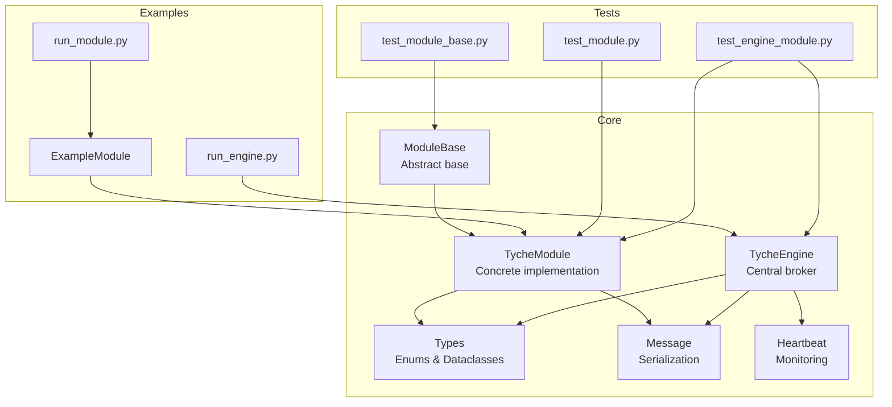
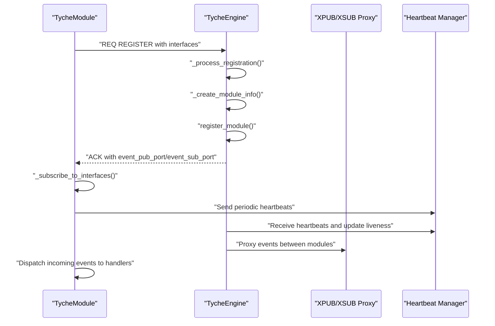
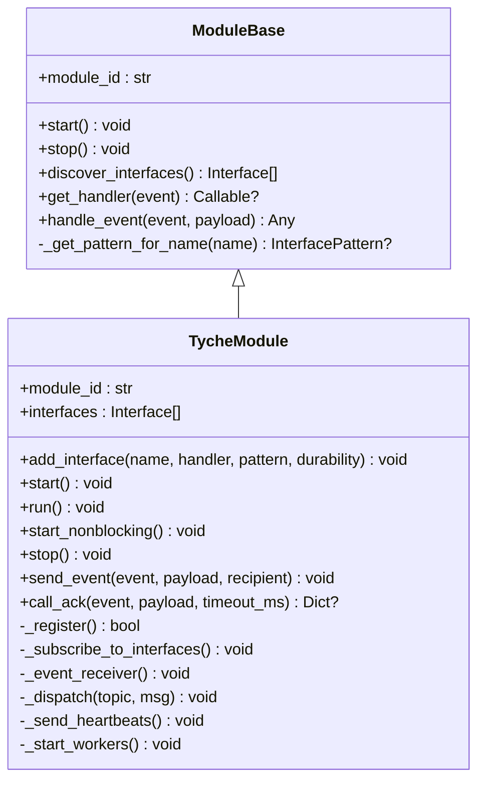
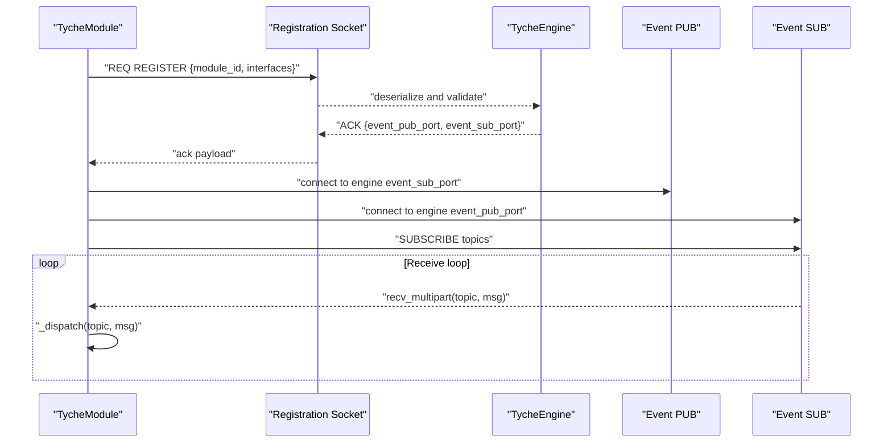
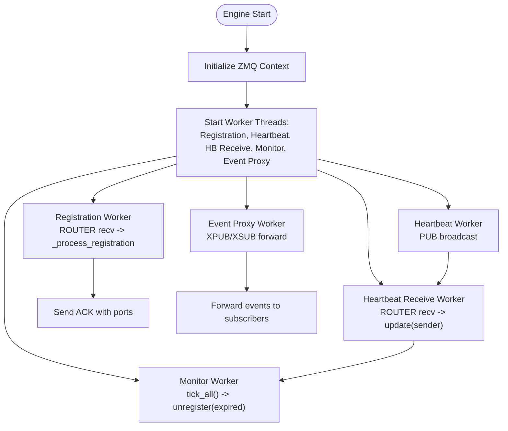
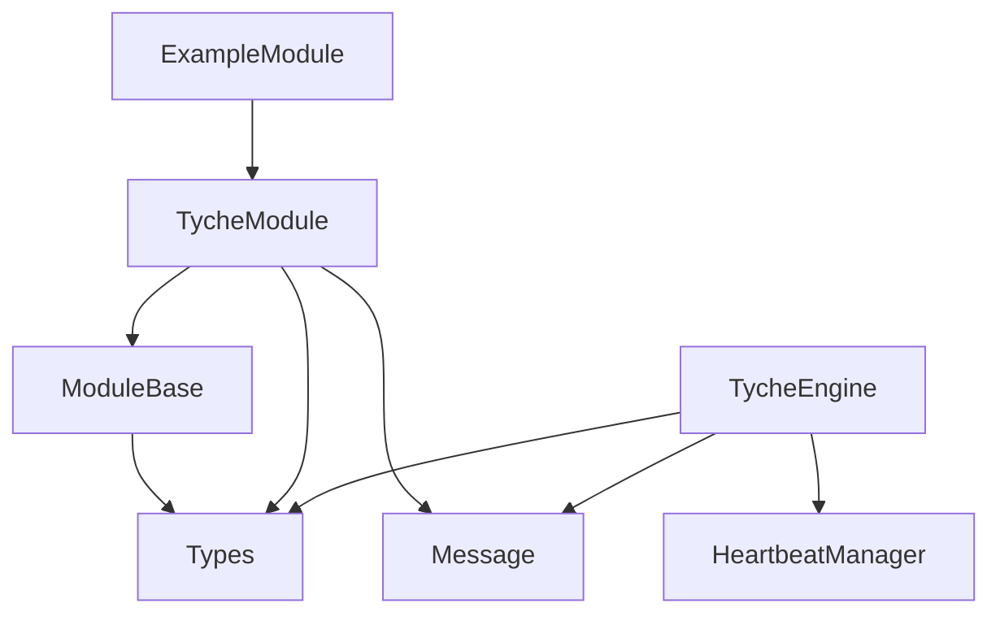

# Module Management

<cite>
**Referenced Files in This Document**
- [module.py](file://src/tyche/module.py)
- [module_base.py](file://src/tyche/module_base.py)
- [engine.py](file://src/tyche/engine.py)
- [types.py](file://src/tyche/types.py)
- [message.py](file://src/tyche/message.py)
- [heartbeat.py](file://src/tyche/heartbeat.py)
- [example_module.py](file://src/tyche/example_module.py)
- [run_engine.py](file://examples/run_engine.py)
- [run_module.py](file://examples/run_module.py)
- [test_module.py](file://tests/unit/test_module.py)
- [test_module_base.py](file://tests/unit/test_module_base.py)
- [test_engine_module.py](file://tests/integration/test_engine_module.py)
- [README.md](file://README.md)
</cite>

## Table of Contents
1. [Introduction](#introduction)
2. [Project Structure](#project-structure)
3. [Core Components](#core-components)
4. [Architecture Overview](#architecture-overview)
5. [Detailed Component Analysis](#detailed-component-analysis)
6. [Dependency Analysis](#dependency-analysis)
7. [Performance Considerations](#performance-considerations)
8. [Troubleshooting Guide](#troubleshooting-guide)
9. [Conclusion](#conclusion)
10. [Appendices](#appendices)

## Introduction
This document explains Tyche Engine's module management system with a focus on module registration, automatic interface discovery, and lifecycle management. It covers how modules automatically discover their interfaces through method naming conventions, how the engine registers and tracks module capabilities, and how the system manages module startup, graceful shutdown, and error recovery. It also provides practical guidance for developing custom modules and integrating them with the engine.

## Project Structure
The module management system spans several core modules:
- Module base and implementation: define the abstract interface and concrete implementation
- Engine: manages registration, event routing, and heartbeats
- Types: defines enums and data structures used across the system
- Message: serializes/deserializes messages for cross-process communication
- Heartbeat: implements the Paranoid Pirate pattern for liveness monitoring
- Example module: demonstrates all interface patterns and lifecycle usage
- Examples: runnable scripts to start engine and module independently
- Tests: unit and integration tests validating behavior

**Diagram sources**
- [module_base.py:10-120](file://src/tyche/module_base.py#L10-L120)
- [module.py:28-401](file://src/tyche/module.py#L28-L401)
- [engine.py:25-350](file://src/tyche/engine.py#L25-L350)
- [types.py:14-102](file://src/tyche/types.py#L14-L102)
- [message.py:13-168](file://src/tyche/message.py#L13-L168)
- [heartbeat.py:16-142](file://src/tyche/heartbeat.py#L16-L142)
- [example_module.py:19-167](file://src/tyche/example_module.py#L19-L167)
- [run_engine.py:21-54](file://examples/run_engine.py#L21-L54)
- [run_module.py:22-51](file://examples/run_module.py#L22-L51)
- [test_module.py:1-69](file://tests/unit/test_module.py#L1-L69)
- [test_module_base.py:1-100](file://tests/unit/test_module_base.py#L1-L100)
- [test_engine_module.py:1-166](file://tests/integration/test_engine_module.py#L1-L166)

**Section sources**
- [README.md:18-348](file://README.md#L18-L348)

## Core Components
This section introduces the key building blocks of the module management system.

- ModuleBase: Defines the abstract contract for modules and provides automatic interface discovery based on method naming conventions.
- TycheModule: Concrete module implementation that connects to the engine, registers interfaces, handles events, and manages lifecycle.
- TycheEngine: Central broker that handles module registration, event routing via XPUB/XSUB proxy, and heartbeat monitoring.
- Types: Defines enums for interface patterns and durability levels, along with data structures for endpoints, interfaces, and module info.
- Message: Provides serialization/deserialization for cross-process messaging.
- Heartbeat: Implements the Paranoid Pirate pattern for liveness monitoring and failure detection.

Key responsibilities:
- Interface discovery: Method names like on_*, ack_*, whisper_*, on_common_* are auto-detected and turned into Interface definitions.
- Registration: Modules send a one-shot registration request with their interface list; engine replies with ports for event channels.
- Event routing: Engine proxies events between publishers and subscribers via XPUB/XSUB.
- Heartbeat: Engine periodically broadcasts heartbeats; modules must respond to stay alive.
- Lifecycle: Modules start, connect, subscribe, run event loops, and shut down gracefully.

**Section sources**
- [module_base.py:10-120](file://src/tyche/module_base.py#L10-L120)
- [module.py:28-401](file://src/tyche/module.py#L28-L401)
- [engine.py:25-350](file://src/tyche/engine.py#L25-L350)
- [types.py:51-102](file://src/tyche/types.py#L51-L102)
- [message.py:13-168](file://src/tyche/message.py#L13-L168)
- [heartbeat.py:16-142](file://src/tyche/heartbeat.py#L16-L142)

## Architecture Overview
The module management architecture centers around ZeroMQ socket patterns and a central engine that coordinates module registration, event routing, and liveness monitoring.

**Diagram sources**
- [module.py:200-254](file://src/tyche/module.py#L200-L254)
- [engine.py:144-213](file://src/tyche/engine.py#L144-L213)
- [engine.py:238-277](file://src/tyche/engine.py#L238-L277)
- [heartbeat.py:91-142](file://src/tyche/heartbeat.py#L91-L142)

## Detailed Component Analysis

### ModuleBase: Interface Discovery and Handler Routing
ModuleBase provides the foundation for automatic interface discovery and handler routing:
- discover_interfaces scans methods and infers patterns from method names:
  - on_* → ON pattern
  - ack_* → ACK pattern
  - whisper_* → WHISPER pattern
  - on_common_* → ON_COMMON pattern
- get_handler retrieves callable methods by event name.
- handle_event routes events to handlers, distinguishing ACK vs fire-and-forget patterns.

**Diagram sources**
- [module_base.py:10-120](file://src/tyche/module_base.py#L10-L120)
- [module.py:28-401](file://src/tyche/module.py#L28-L401)

**Section sources**
- [module_base.py:48-120](file://src/tyche/module_base.py#L48-L120)

### TycheModule: Registration, Event Handling, and Lifecycle
TycheModule implements the concrete module behavior:
- Registration: One-shot REQ socket to engine with serialized interface list; engine replies with event ports.
- Event subscription: SUB socket subscribes to topics matching discovered handlers; incoming events are deserialized and dispatched.
- Event publishing: PUB socket publishes events to engine's XSUB endpoint; topic is the event name.
- Acknowledgment: call_ack uses a temporary REQ socket to send commands and await ACK responses.
- Heartbeat: DEALER socket sends periodic heartbeats to engine.
- Lifecycle: start/run/start_nonblocking manage worker threads; stop gracefully closes sockets and destroys context.

**Diagram sources**
- [module.py:127-197](file://src/tyche/module.py#L127-L197)
- [module.py:200-254](file://src/tyche/module.py#L200-L254)
- [module.py:258-298](file://src/tyche/module.py#L258-L298)

**Section sources**
- [module.py:41-197](file://src/tyche/module.py#L41-L197)
- [module.py:200-254](file://src/tyche/module.py#L200-L254)
- [module.py:258-298](file://src/tyche/module.py#L258-L298)
- [module.py:301-373](file://src/tyche/module.py#L301-L373)
- [module.py:376-401](file://src/tyche/module.py#L376-L401)

### TycheEngine: Registration, Event Proxy, and Heartbeat Monitoring
TycheEngine coordinates module lifecycle and event routing:
- Registration worker: ROUTER socket receives registration requests, validates, and replies with ACK containing event ports.
- Event proxy: XPUB/XSUB proxy forwards events between modules.
- Heartbeat workers: Separate threads broadcast heartbeats and receive heartbeats to track liveness.
- Module registry: Thread-safe storage of ModuleInfo keyed by module_id; maintains interface mappings.

**Diagram sources**
- [engine.py:79-118](file://src/tyche/engine.py#L79-L118)
- [engine.py:121-177](file://src/tyche/engine.py#L121-L177)
- [engine.py:238-277](file://src/tyche/engine.py#L238-L277)
- [engine.py:281-350](file://src/tyche/engine.py#L281-L350)

**Section sources**
- [engine.py:79-118](file://src/tyche/engine.py#L79-L118)
- [engine.py:121-177](file://src/tyche/engine.py#L121-L177)
- [engine.py:200-235](file://src/tyche/engine.py#L200-L235)
- [engine.py:238-277](file://src/tyche/engine.py#L238-L277)
- [engine.py:281-350](file://src/tyche/engine.py#L281-L350)

### Types: Interface Patterns, Durability, and Data Structures
Tyche defines core types used throughout the module management system:
- InterfacePattern: ON, ACK, WHISPER, ON_COMMON, BROADCAST
- DurabilityLevel: BEST_EFFORT, ASYNC_FLUSH, SYNC_FLUSH
- Endpoint: host/port pair for ZeroMQ endpoints
- Interface: name, pattern, event_type, durability
- ModuleInfo: module_id, endpoint, interfaces, metadata

These types enable consistent interface definitions and durability guarantees across modules and the engine.

**Section sources**
- [types.py:51-102](file://src/tyche/types.py#L51-L102)

### Message Serialization and Deserialization
MessagePack is used to serialize/deserialize messages across ZeroMQ boundaries:
- Message dataclass captures msg_type, sender, event, payload, recipient, durability, timestamp, correlation_id
- serialize/deserialize handle enum and Decimal encoding/decoding
- Envelope supports ZeroMQ routing envelopes for advanced routing scenarios

**Section sources**
- [message.py:13-168](file://src/tyche/message.py#L13-L168)

### Heartbeat Monitoring: Paranoid Pirate Pattern
Heartbeat monitoring ensures module liveness:
- HeartbeatManager tracks monitors per peer with liveness counters
- HeartbeatMonitor updates liveness on receipt and decrements on tick
- Engine heartbeat workers broadcast and receive heartbeats; monitors are checked periodically to detect failures

**Section sources**
- [heartbeat.py:16-142](file://src/tyche/heartbeat.py#L16-L142)
- [engine.py:281-350](file://src/tyche/engine.py#L281-L350)

### Example Module: Interface Patterns and Lifecycle Usage
The example module demonstrates all interface patterns and lifecycle usage:
- on_data: Fire-and-forget event handler
- ack_request: Request-response handler returning acknowledgment
- whisper_athena_message: Direct P2P handler
- on_common_broadcast/on_common_ping/on_common_pong: Broadcast handlers with ping-pong behavior
- start_nonblocking and stop with timer cleanup

**Section sources**
- [example_module.py:19-167](file://src/tyche/example_module.py#L19-L167)

## Dependency Analysis
The module management system exhibits clear separation of concerns:
- ModuleBase depends on types for interface patterns and durability
- TycheModule depends on ModuleBase, types, message serialization, and ZeroMQ
- TycheEngine depends on types, message serialization, heartbeat monitoring, and ZeroMQ
- HeartbeatManager is used by the engine to track module liveness
- ExampleModule inherits from TycheModule and demonstrates usage patterns

**Diagram sources**
- [module_base.py:7](file://src/tyche/module_base.py#L7)
- [module.py:15-23](file://src/tyche/module.py#L15-L23)
- [engine.py:12-20](file://src/tyche/engine.py#L12-L20)
- [heartbeat.py:13](file://src/tyche/heartbeat.py#L13)
- [example_module.py:15-16](file://src/tyche/example_module.py#L15-L16)

**Section sources**
- [module_base.py:7](file://src/tyche/module_base.py#L7)
- [module.py:15-23](file://src/tyche/module.py#L15-L23)
- [engine.py:12-20](file://src/tyche/engine.py#L12-L20)
- [heartbeat.py:13](file://src/tyche/heartbeat.py#L13)
- [example_module.py:15-16](file://src/tyche/example_module.py#L15-L16)

## Performance Considerations
- ZeroMQ socket patterns provide low-latency communication with minimal overhead.
- Async persistence keeps the hot path fast while enabling durable storage in the background.
- Heartbeat intervals and liveness thresholds balance responsiveness with resource usage.
- Event proxy (XPUB/XSUB) efficiently distributes events to subscribers without per-subscriber fan-out overhead.
- Graceful shutdown ensures sockets are closed promptly and contexts destroyed cleanly to prevent resource leaks.

[No sources needed since this section provides general guidance]

## Troubleshooting Guide
Common issues and remedies:
- Registration timeouts: Verify engine endpoints and network connectivity; check engine logs for registration errors.
- No event delivery: Confirm module subscribed to correct topics; ensure event names match handler names.
- Heartbeat failures: Check heartbeat endpoints and intervals; ensure modules send heartbeats regularly.
- Graceful shutdown hangs: Ensure stop() is called and threads join; close sockets and destroy context in the correct order.
- Interface discovery not working: Ensure method names follow the required patterns (on_*, ack_*, whisper_*, on_common_*).

**Section sources**
- [module.py:247-254](file://src/tyche/module.py#L247-L254)
- [module.py:277-282](file://src/tyche/module.py#L277-L282)
- [engine.py:139-142](file://src/tyche/engine.py#L139-L142)
- [engine.py:337-339](file://src/tyche/engine.py#L337-L339)

## Conclusion
Tyche Engine’s module management system provides a robust, scalable framework for building distributed, event-driven applications. Through automatic interface discovery, structured registration, efficient event routing, and heartbeat-based liveness monitoring, it enables developers to build modules that integrate seamlessly with the engine. The lifecycle management ensures graceful startup and shutdown, while the durability levels and async persistence model support demanding production workloads.

[No sources needed since this section summarizes without analyzing specific files]

## Appendices

### Module Registration Process
- Modules send a one-shot registration request containing module_id and interface list.
- Engine validates and responds with ACK and event port assignments.
- Modules connect to event channels and subscribe to their handlers.

**Section sources**
- [module.py:200-254](file://src/tyche/module.py#L200-L254)
- [engine.py:144-177](file://src/tyche/engine.py#L144-L177)

### Interface Discovery Mechanism
- Method names are scanned and patterns inferred automatically.
- Handlers are registered with their corresponding Interface definitions.

**Section sources**
- [module_base.py:48-84](file://src/tyche/module_base.py#L48-L84)

### Lifecycle Management
- start/run/start_nonblocking initialize workers and connect to engine.
- stop gracefully closes sockets, joins threads, and destroys context.

**Section sources**
- [module.py:116-197](file://src/tyche/module.py#L116-L197)

### Module Startup and Shutdown Procedures
- Example scripts demonstrate standalone engine and module startup.
- Integration tests show end-to-end registration and event handling.

**Section sources**
- [run_engine.py:21-54](file://examples/run_engine.py#L21-L54)
- [run_module.py:22-51](file://examples/run_module.py#L22-L51)
- [test_engine_module.py:14-41](file://tests/integration/test_engine_module.py#L14-L41)

### Error Recovery Mechanisms
- Heartbeat monitoring detects failures and triggers module unregistration.
- Graceful shutdown ensures clean resource cleanup.

**Section sources**
- [heartbeat.py:125-133](file://src/tyche/heartbeat.py#L125-L133)
- [engine.py:341-350](file://src/tyche/engine.py#L341-L350)
- [module.py:179-197](file://src/tyche/module.py#L179-L197)

### Custom Module Development Guide
- Follow naming conventions for handlers: on_*, ack_*, whisper_*, on_common_*.
- Use add_interface for explicit interface definitions or rely on automatic discovery.
- Implement start/stop methods and handle lifecycle events.
- Integrate with engine endpoints and heartbeat configuration.

**Section sources**
- [module_base.py:19-30](file://src/tyche/module_base.py#L19-L30)
- [module.py:87-111](file://src/tyche/module.py#L87-L111)
- [example_module.py:19-70](file://src/tyche/example_module.py#L19-L70)