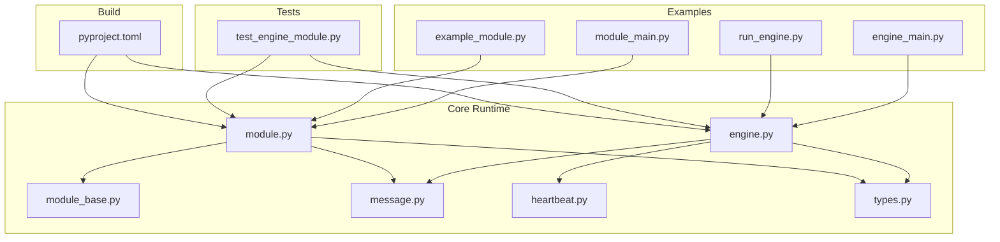
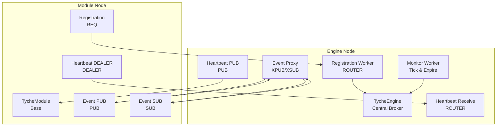
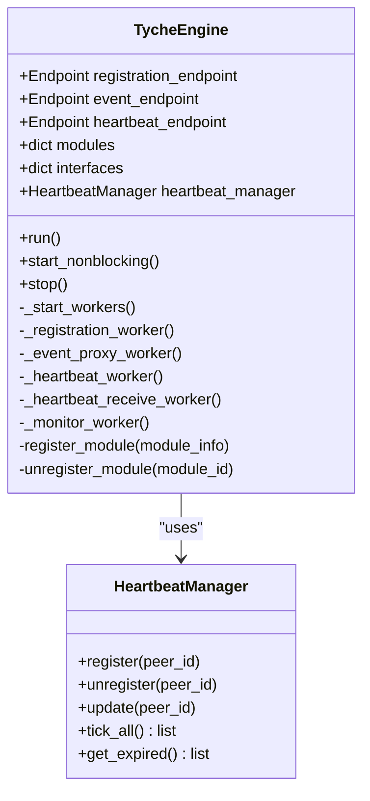
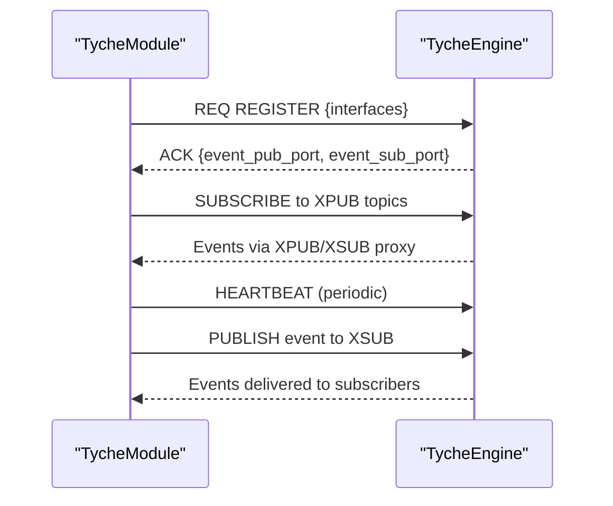
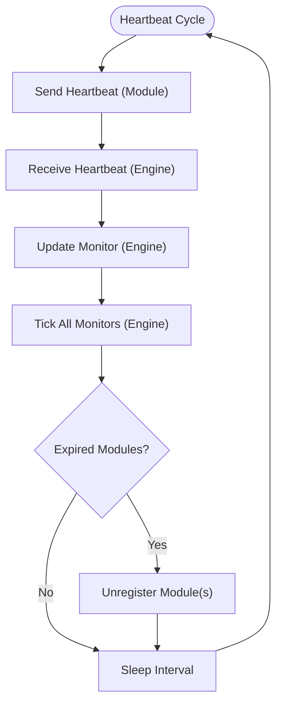
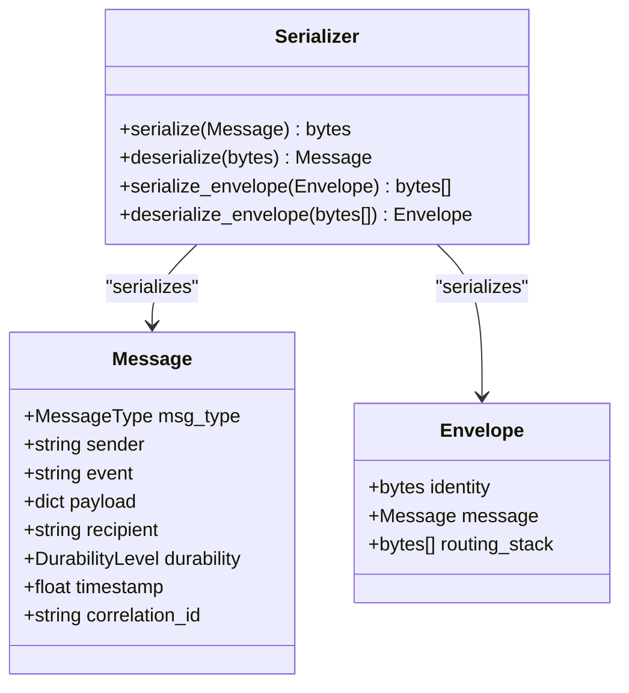
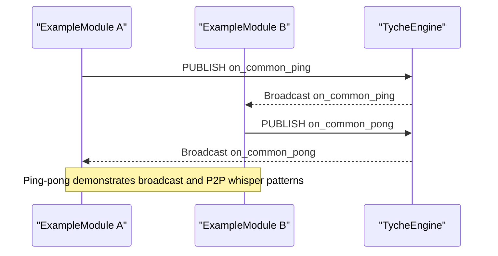
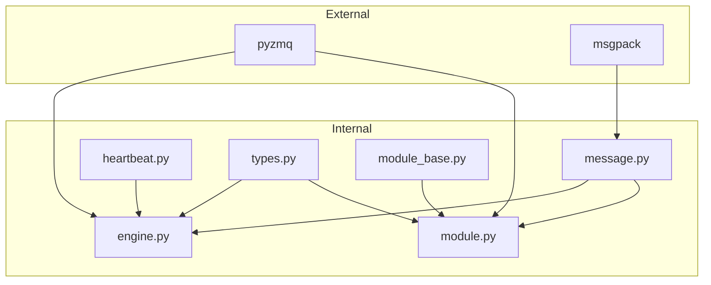
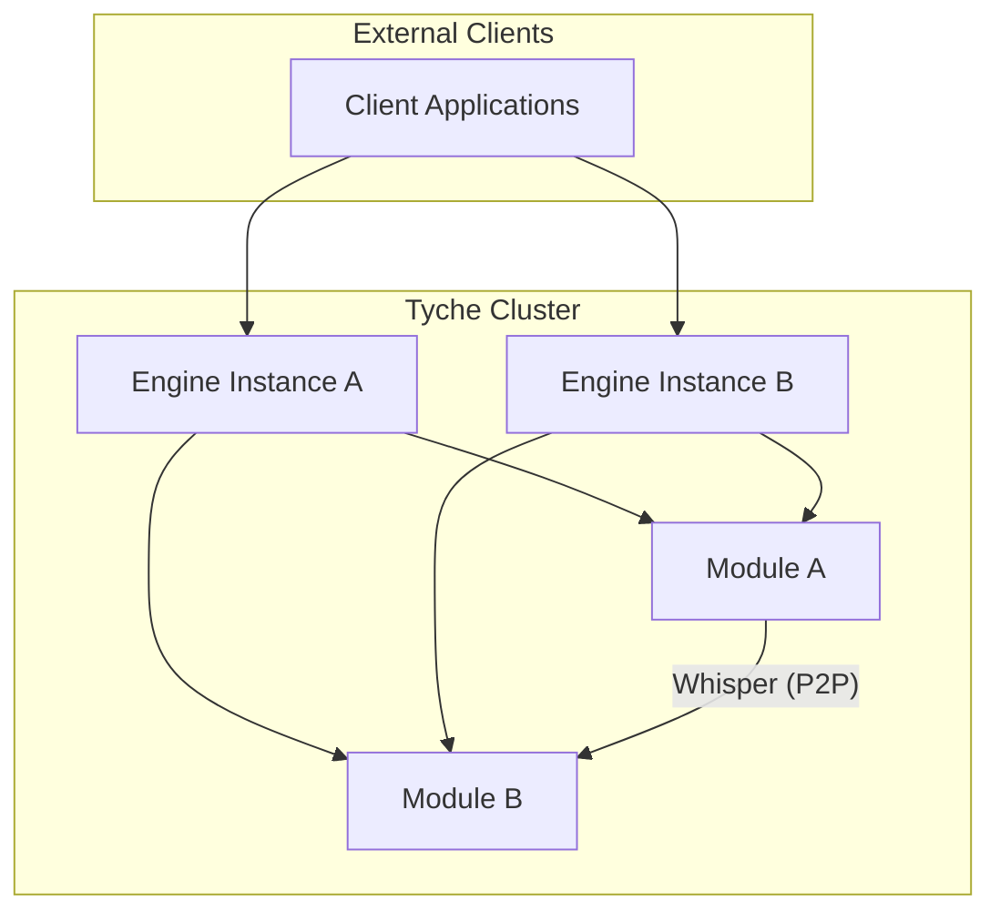

# System Design

**Referenced Files in This Document**
- [README.md](file://README.md)
- [engine.py](file://src/tyche/engine.py)
- [module.py](file://src/tyche/module.py)
- [engine_main.py](file://src/tyche/engine_main.py)
- [module_main.py](file://src/tyche/module_main.py)
- [types.py](file://src/tyche/types.py)
- [message.py](file://src/tyche/message.py)
- [heartbeat.py](file://src/tyche/heartbeat.py)
- [module_base.py](file://src/tyche/module_base.py)
- [example_module.py](file://src/tyche/example_module.py)
- [run_engine.py](file://examples/run_engine.py)
- [test_engine_module.py](file://tests/integration/test_engine_module.py)
- [pyproject.toml](file://pyproject.toml)

## Table of Contents
1. [Introduction](#introduction)
2. [Project Structure](#project-structure)
3. [Core Components](#core-components)
4. [Architecture Overview](#architecture-overview)
5. [Detailed Component Analysis](#detailed-component-analysis)
6. [Dependency Analysis](#dependency-analysis)
7. [Performance Considerations](#performance-considerations)
8. [Troubleshooting Guide](#troubleshooting-guide)
9. [Conclusion](#conclusion)
10. [Appendices](#appendices)

## Introduction
Tyche Engine is a high-performance, distributed event-driven framework built on ZeroMQ. It orchestrates multi-process applications through a central engine broker and a distributed module system. The system emphasizes:
- Central engine broker design with thread-based workers for registration, event routing, heartbeat monitoring, and lifecycle management
- ZeroMQ-based communication infrastructure supporting multiple patterns: Request-Reply for registration, Pub-Sub via XPUB/XSUB proxy for event broadcasting, Pipeline for load-balanced work, Dealer-Router for P2P whisper messaging, and Pub-Sub for heartbeat monitoring
- A standardized module interface contract enabling heterogeneous and homogeneous modules to integrate uniformly
- Async persistence and operating modes (live trading, backtesting, research) to meet diverse operational needs

The system supports multi-instance deployments for high availability using the Binary Star pattern and provides scalability guidelines for sharding, load balancing, and geographic distribution.

**Section sources**
- [README.md:18-348](file://README.md#L18-L348)

## Project Structure
The repository organizes the framework into core runtime modules, examples, and tests:
- Core runtime: engine, module base, message serialization, heartbeat manager, and type definitions
- Examples: standalone engine and module entry points
- Tests: integration and unit tests validating engine-module interactions and heartbeat behavior
- Build configuration: pyproject.toml defines dependencies (pyzmq, msgpack) and test settings

**Diagram sources**
- [engine.py:1-350](file://src/tyche/engine.py#L1-L350)
- [module.py:1-401](file://src/tyche/module.py#L1-L401)
- [module_base.py:1-120](file://src/tyche/module_base.py#L1-L120)
- [message.py:1-168](file://src/tyche/message.py#L1-L168)
- [heartbeat.py:1-142](file://src/tyche/heartbeat.py#L1-L142)
- [types.py:1-102](file://src/tyche/types.py#L1-L102)
- [engine_main.py:1-53](file://src/tyche/engine_main.py#L1-L53)
- [module_main.py:1-47](file://src/tyche/module_main.py#L1-L47)
- [run_engine.py:1-54](file://examples/run_engine.py#L1-L54)
- [example_module.py:1-167](file://src/tyche/example_module.py#L1-L167)
- [test_engine_module.py:1-166](file://tests/integration/test_engine_module.py#L1-L166)
- [pyproject.toml:1-63](file://pyproject.toml#L1-L63)

**Section sources**
- [engine.py:1-350](file://src/tyche/engine.py#L1-L350)
- [module.py:1-401](file://src/tyche/module.py#L1-L401)
- [engine_main.py:1-53](file://src/tyche/engine_main.py#L1-L53)
- [module_main.py:1-47](file://src/tyche/module_main.py#L1-L47)
- [run_engine.py:1-54](file://examples/run_engine.py#L1-L54)
- [example_module.py:1-167](file://src/tyche/example_module.py#L1-L167)
- [test_engine_module.py:1-166](file://tests/integration/test_engine_module.py#L1-L166)
- [pyproject.toml:1-63](file://pyproject.toml#L1-L63)

## Core Components
- TycheEngine: Central broker that manages module registration, event routing via XPUB/XSUB proxy, heartbeat monitoring, and module lifecycle. It runs multiple worker threads for registration, heartbeat publishing, heartbeat reception, monitoring, and event proxying.
- TycheModule: Base class for modules implementing interface patterns (on_*, ack_*, whisper_*, on_common_*). Handles registration, event subscription/publishing, heartbeat sending, and handler dispatch.
- HeartbeatManager: Tracks module liveness using the Paranoid Pirate pattern with configurable intervals and liveness thresholds.
- Message: Defines the application message structure and provides serialization/deserialization using MessagePack.
- Types: Defines enums and dataclasses for endpoints, interfaces, durability levels, message types, and module IDs.
- ExampleModule: Reference implementation demonstrating all interface patterns and ping-pong broadcast behavior.

Key responsibilities:
- Engine: registration, interface registry, event proxy, heartbeat broadcast/reception, module expiration
- Module: registration handshake, event subscription, handler dispatch, heartbeat sending, event publishing

**Section sources**
- [engine.py:25-350](file://src/tyche/engine.py#L25-L350)
- [module.py:28-401](file://src/tyche/module.py#L28-L401)
- [heartbeat.py:91-142](file://src/tyche/heartbeat.py#L91-L142)
- [message.py:13-168](file://src/tyche/message.py#L13-L168)
- [types.py:14-102](file://src/tyche/types.py#L14-L102)
- [example_module.py:19-167](file://src/tyche/example_module.py#L19-L167)

## Architecture Overview
Tyche Engine employs a central broker design with a multi-process architecture:
- Central Engine Broker: Runs in a standalone process with thread-based workers for distinct responsibilities
- Distributed Modules: Independent processes that register with the engine and expose standardized interfaces
- ZeroMQ Communication Infrastructure: Uses specific socket patterns for each communication need
- System Boundaries: Clear separation between engine control plane (registration, heartbeat, lifecycle) and data plane (event routing, broadcasting)

**Diagram sources**
- [engine.py:79-104](file://src/tyche/engine.py#L79-L104)
- [engine.py:121-143](file://src/tyche/engine.py#L121-L143)
- [engine.py:281-305](file://src/tyche/engine.py#L281-L305)
- [engine.py:307-339](file://src/tyche/engine.py#L307-L339)
- [engine.py:341-349](file://src/tyche/engine.py#L341-L349)
- [engine.py:238-277](file://src/tyche/engine.py#L238-L277)
- [module.py:200-254](file://src/tyche/module.py#L200-L254)
- [module.py:133-177](file://src/tyche/module.py#L133-L177)
- [module.py:265-282](file://src/tyche/module.py#L265-L282)
- [module.py:376-401](file://src/tyche/module.py#L376-L401)

**Section sources**
- [README.md:24-44](file://README.md#L24-L44)
- [engine.py:79-104](file://src/tyche/engine.py#L79-L104)
- [module.py:133-177](file://src/tyche/module.py#L133-L177)

## Detailed Component Analysis

### TycheEngine: Central Broker
TycheEngine orchestrates module lifecycle and event routing:
- Registration: One-shot registration via ROUTER socket; deserializes registration messages, creates ModuleInfo, registers interfaces, and replies with ACK containing event proxy ports
- Event Proxy: XPUB/XSUB proxy forwards events between publishers and subscribers
- Heartbeat: Periodic PUB heartbeats and ROUTER reception with liveness tracking
- Monitoring: Tick-based expiration of modules and unregistration

**Diagram sources**
- [engine.py:25-350](file://src/tyche/engine.py#L25-L350)
- [heartbeat.py:91-142](file://src/tyche/heartbeat.py#L91-L142)

**Section sources**
- [engine.py:67-118](file://src/tyche/engine.py#L67-L118)
- [engine.py:121-177](file://src/tyche/engine.py#L121-L177)
- [engine.py:238-277](file://src/tyche/engine.py#L238-L277)
- [engine.py:281-305](file://src/tyche/engine.py#L281-L305)
- [engine.py:307-339](file://src/tyche/engine.py#L307-L339)
- [engine.py:341-349](file://src/tyche/engine.py#L341-L349)

### TycheModule: Module Base
TycheModule connects to the engine, registers interfaces, subscribes to events, and dispatches to handlers:
- Registration: One-shot REQ handshake with engine; receives event proxy ports and marks registered
- Event Subscription: SUB socket subscribes to topics matching handler names; dispatches to handlers
- Heartbeat: DEALER socket sends periodic heartbeats to engine
- Event Publishing: PUB socket publishes events to engine’s XSUB endpoint

**Diagram sources**
- [module.py:200-254](file://src/tyche/module.py#L200-L254)
- [module.py:258-282](file://src/tyche/module.py#L258-L282)
- [module.py:376-401](file://src/tyche/module.py#L376-L401)
- [engine.py:121-177](file://src/tyche/engine.py#L121-L177)
- [engine.py:238-277](file://src/tyche/engine.py#L238-L277)

**Section sources**
- [module.py:116-197](file://src/tyche/module.py#L116-L197)
- [module.py:200-254](file://src/tyche/module.py#L200-L254)
- [module.py:258-282](file://src/tyche/module.py#L258-L282)
- [module.py:301-373](file://src/tyche/module.py#L301-L373)
- [module.py:376-401](file://src/tyche/module.py#L376-L401)

### Heartbeat Protocol (Paranoid Pirate Pattern)
Heartbeat monitoring ensures module liveness:
- Engine publishes heartbeats periodically and receives heartbeats via ROUTER
- HeartbeatManager tracks liveness per module; expired modules are unregistered
- Grace period applied during initial registration

**Diagram sources**
- [heartbeat.py:91-142](file://src/tyche/heartbeat.py#L91-L142)
- [engine.py:307-339](file://src/tyche/engine.py#L307-L339)
- [engine.py:341-349](file://src/tyche/engine.py#L341-L349)

**Section sources**
- [heartbeat.py:16-50](file://src/tyche/heartbeat.py#L16-L50)
- [heartbeat.py:91-142](file://src/tyche/heartbeat.py#L91-L142)
- [engine.py:307-349](file://src/tyche/engine.py#L307-L349)

### Message Serialization and Routing
MessagePack-based serialization handles application messages with envelopes for ZeroMQ routing:
- Message: carries msg_type, sender, event, payload, optional recipient, durability, timestamp, correlation_id
- Envelope: supports ZeroMQ multipart frames with identity and routing stack
- Serialization: custom encoder/decoder for Decimal and Enum types

**Diagram sources**
- [message.py:13-168](file://src/tyche/message.py#L13-L168)

**Section sources**
- [message.py:69-112](file://src/tyche/message.py#L69-L112)
- [message.py:114-168](file://src/tyche/message.py#L114-L168)

### ExampleModule: Interface Patterns Demonstration
ExampleModule showcases all supported interface patterns:
- on_data: fire-and-forget event handler
- ack_request: request-response handler returning acknowledgment
- whisper_athena_message: direct P2P handler
- on_common_broadcast/on_common_ping/pong: broadcast event handlers with ping-pong exchange

**Diagram sources**
- [example_module.py:80-150](file://src/tyche/example_module.py#L80-L150)
- [module.py:301-330](file://src/tyche/module.py#L301-L330)
- [engine.py:238-277](file://src/tyche/engine.py#L238-L277)

**Section sources**
- [example_module.py:19-167](file://src/tyche/example_module.py#L19-L167)
- [module.py:301-330](file://src/tyche/module.py#L301-L330)

## Dependency Analysis
External dependencies and internal coupling:
- pyzmq: core ZeroMQ bindings for socket operations
- msgpack: serialization for cross-language compatibility
- Internal dependencies: engine depends on message, heartbeat, and types; module depends on module_base, message, and types

**Diagram sources**
- [pyproject.toml:10-13](file://pyproject.toml#L10-L13)
- [message.py:8-10](file://src/tyche/message.py#L8-L10)
- [engine.py:8-20](file://src/tyche/engine.py#L8-L20)
- [module.py:11-23](file://src/tyche/module.py#L11-L23)

**Section sources**
- [pyproject.toml:10-13](file://pyproject.toml#L10-L13)
- [engine.py:8-20](file://src/tyche/engine.py#L8-L20)
- [module.py:11-23](file://src/tyche/module.py#L11-L23)

## Performance Considerations
- Hot path latency targets sub-millisecond with ZeroMQ inproc/tcp transports
- Async persistence amortizes disk I/O via batching (1000 events or 100ms) and lock-free SPSC ring buffer
- Backpressure handling modes: drop oldest (research), block and alert (production), expand buffer (elastic)
- Recovery time under 1 second from WAL checkpoint
- Throughput for backtesting exceeds 100K events/sec

Operational guidance:
- Tune ZeroMQ high-water marks for your workload
- Use asynchronous persistence to keep the hot path fast
- Employ broadcast sparingly for high-throughput scenarios
- Consider partitioning by key for strict ordering

**Section sources**
- [README.md:197-205](file://README.md#L197-L205)
- [README.md:143-158](file://README.md#L143-L158)
- [README.md:290-299](file://README.md#L290-L299)

## Troubleshooting Guide
Common failure modes and responses:
- Module crash: Missed heartbeat leads to FAILED state; engine redistributes work; manual restart required
- Slow module: Reduced work allocation; auto-restart if persistent
- Network partition: Buffer events, retry connection; reconnect on partition heal
- Engine crash: Multi-instance failover promotes backup using Binary Star pattern
- Disk full: Pause accepts, alert operators; allow reads

Diagnostic checks:
- Verify registration ACK and event proxy ports
- Confirm heartbeat PUB/SUB connectivity
- Inspect module registry and interface discovery
- Review logs for registration errors, heartbeat timeouts, and event receive failures

**Section sources**
- [engine.py:121-177](file://src/tyche/engine.py#L121-L177)
- [engine.py:307-349](file://src/tyche/engine.py#L307-L349)
- [module.py:200-254](file://src/tyche/module.py#L200-L254)
- [module.py:265-282](file://src/tyche/module.py#L265-L282)
- [README.md:290-299](file://README.md#L290-L299)

## Conclusion
Tyche Engine delivers a robust, scalable, and fault-tolerant event-driven architecture:
- Central engine broker with thread-based workers ensures separation of concerns and reliability
- ZeroMQ-based communication patterns enable flexible, high-performance messaging
- Standardized module interfaces support heterogeneous and homogeneous deployments
- Async persistence and operating modes accommodate live trading, backtesting, and research workflows
- Multi-instance deployments and Binary Star pattern provide high availability

The design balances performance, reliability, and simplicity, offering clear extension points for advanced use cases.

[No sources needed since this section summarizes without analyzing specific files]

## Appendices

### System Context Diagrams
High-level interaction between engines, modules, and external clients:

[No sources needed since this diagram shows conceptual workflow, not actual code structure]

### Deployment Topologies and Scalability Options
- Single Engine instance for development or small-scale deployments
- Multi-instance Engine cluster with Binary Star pattern for high availability
- Sharding by event type across Engine instances for high throughput
- Geographic distribution with regional Engine instances and inter-region gossip
- Homogeneous modules scaled horizontally behind Engine load balancers

**Section sources**
- [README.md:37-44](file://README.md#L37-L44)
- [README.md:329-340](file://README.md#L329-L340)