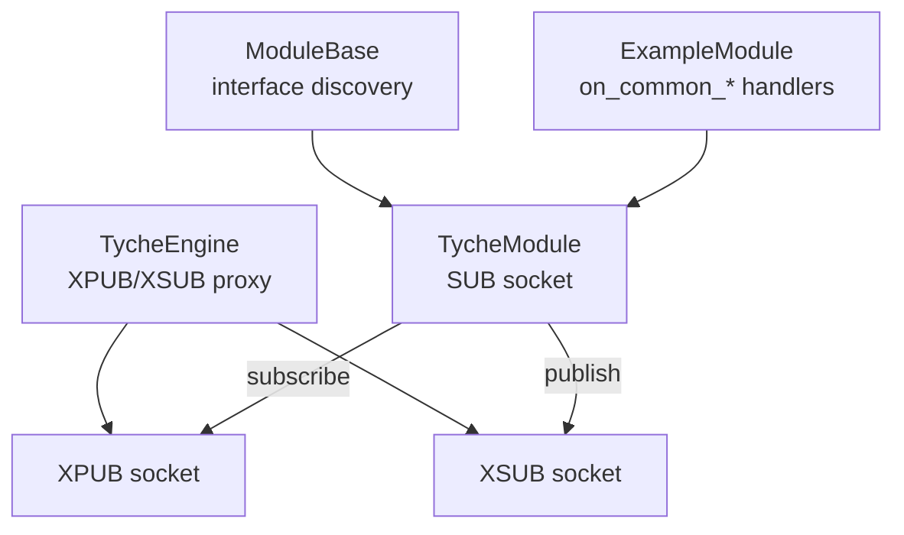
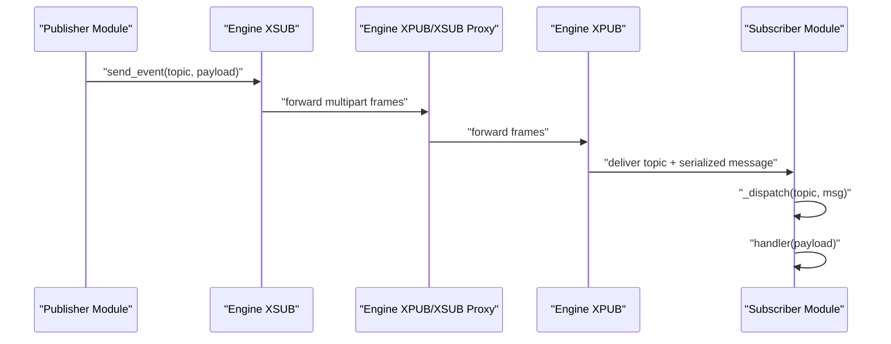
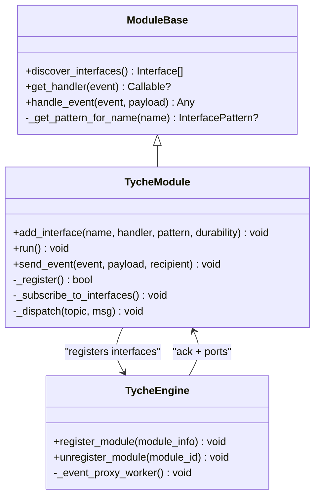
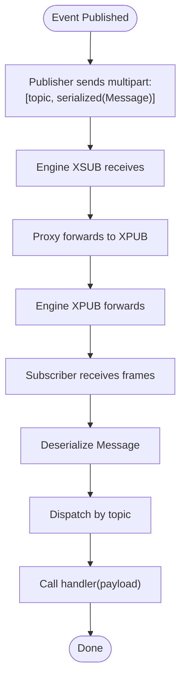
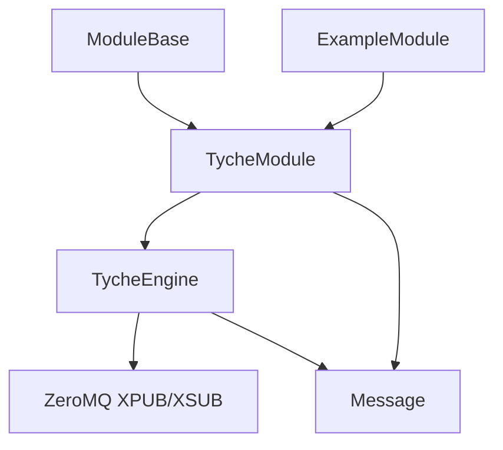

# Broadcast Events (on_common_*) 

<cite>
**Referenced Files in This Document**
- [engine.py](file://src/tyche/engine.py)
- [module.py](file://src/tyche/module.py)
- [module_base.py](file://src/tyche/module_base.py)
- [example_module.py](file://src/tyche/example_module.py)
- [message.py](file://src/tyche/message.py)
- [types.py](file://src/tyche/types.py)
- [README.md](file://README.md)
- [run_engine.py](file://examples/run_engine.py)
- [run_module.py](file://examples/run_module.py)
</cite>

## Table of Contents
1. [Introduction](#introduction)
2. [Project Structure](#project-structure)
3. [Core Components](#core-components)
4. [Architecture Overview](#architecture-overview)
5. [Detailed Component Analysis](#detailed-component-analysis)
6. [Dependency Analysis](#dependency-analysis)
7. [Performance Considerations](#performance-considerations)
8. [Troubleshooting Guide](#troubleshooting-guide)
9. [Conclusion](#conclusion)
10. [Appendices](#appendices)

## Introduction
This document explains Tyche Engine’s broadcast event pattern using the on_common_* naming convention. Modules can publish events that are distributed to all connected subscribers regardless of specific targeting. The broadcast mechanism relies on ZeroMQ XPUB/XSUB proxy inside the engine to distribute events from publishers to subscribers. We cover how modules declare broadcast handlers, how the event proxy distributes messages, subscriber management, and practical guidance for building scalable broadcast communication patterns.

## Project Structure
Tyche Engine organizes broadcast-related functionality across several modules:
- Engine: Runs the central broker and the XPUB/XSUB proxy for event distribution.
- Module: Base class for modules, including event subscription and publishing APIs.
- ModuleBase: Discovers interface patterns from method names, including on_common_*.
- ExampleModule: Demonstrates on_common_* handlers and broadcast usage.
- Types and Message: Define event types, interface patterns, and message serialization.

**Diagram sources**
- [engine.py:238-278](file://src/tyche/engine.py#L238-L278)
- [module.py:127-178](file://src/tyche/module.py#L127-L178)
- [module_base.py:48-84](file://src/tyche/module_base.py#L48-L84)
- [example_module.py:19-70](file://src/tyche/example_module.py#L19-L70)

**Section sources**
- [engine.py:238-278](file://src/tyche/engine.py#L238-L278)
- [module.py:127-178](file://src/tyche/module.py#L127-L178)
- [module_base.py:48-84](file://src/tyche/module_base.py#L48-L84)
- [example_module.py:19-70](file://src/tyche/example_module.py#L19-L70)

## Core Components
- TycheEngine: Manages registration, heartbeat monitoring, and the event proxy (XPUB/XSUB). The event proxy forwards messages between publishers and subscribers.
- TycheModule: Connects to the engine, registers interfaces, subscribes to topics, and publishes events via the proxy.
- ModuleBase: Auto-discovers interface patterns from method names, including on_common_*.
- ExampleModule: Implements on_common_* handlers and demonstrates broadcast usage patterns.
- Types and Message: Define interface patterns (ON_COMMON), message types, and serialization.

Key broadcast-related elements:
- Interface pattern: ON_COMMON for on_common_* methods.
- Event proxy: XPUB/XSUB forwarding for broadcast distribution.
- Subscriber management: Engine maintains module registry and interface mapping.

**Section sources**
- [types.py:51-58](file://src/tyche/types.py#L51-L58)
- [module_base.py:48-84](file://src/tyche/module_base.py#L48-L84)
- [engine.py:238-278](file://src/tyche/engine.py#L238-L278)
- [module.py:127-178](file://src/tyche/module.py#L127-L178)
- [example_module.py:115-150](file://src/tyche/example_module.py#L115-L150)

## Architecture Overview
Broadcast events traverse the following path:
- Publishers (modules) send events to the engine’s XSUB endpoint.
- The engine’s XPUB/XSUB proxy forwards events to the XPUB endpoint.
- Subscribers (modules) connect SUB sockets to the XPUB endpoint and subscribe to topics matching their handler names.

**Diagram sources**
- [engine.py:238-278](file://src/tyche/engine.py#L238-L278)
- [module.py:258-298](file://src/tyche/module.py#L258-L298)
- [module.py:301-330](file://src/tyche/module.py#L301-L330)

## Detailed Component Analysis

### Broadcast Handler Discovery and Registration
- ModuleBase discovers interfaces by scanning method names and recognizes on_common_* as InterfacePattern.ON_COMMON.
- TycheModule registers interfaces with the engine during the one-shot registration handshake. The engine records interface mappings for later use.

**Diagram sources**
- [module_base.py:48-84](file://src/tyche/module_base.py#L48-L84)
- [module.py:87-111](file://src/tyche/module.py#L87-L111)
- [module.py:200-255](file://src/tyche/module.py#L200-L255)
- [engine.py:200-235](file://src/tyche/engine.py#L200-L235)

**Section sources**
- [module_base.py:48-84](file://src/tyche/module_base.py#L48-L84)
- [module.py:87-111](file://src/tyche/module.py#L87-L111)
- [module.py:200-255](file://src/tyche/module.py#L200-L255)
- [engine.py:200-235](file://src/tyche/engine.py#L200-L235)

### Event Proxy and Distribution Flow
- The engine binds XPUB and XSUB sockets and forwards frames bidirectionally.
- Publishers send multipart frames with topic and serialized message.
- Subscribers receive frames and route to handlers by topic.

**Diagram sources**
- [engine.py:238-278](file://src/tyche/engine.py#L238-L278)
- [module.py:258-298](file://src/tyche/module.py#L258-L298)
- [message.py:69-112](file://src/tyche/message.py#L69-L112)

**Section sources**
- [engine.py:238-278](file://src/tyche/engine.py#L238-L278)
- [module.py:258-298](file://src/tyche/module.py#L258-L298)
- [message.py:69-112](file://src/tyche/message.py#L69-L112)

### Implementing on_common_* Handlers
- Declare methods with the on_common_* naming convention in your module class.
- The engine will discover these methods and subscribe to the corresponding topics automatically.
- Handlers receive the event payload and can perform side effects, logging, or initiate further actions.

Practical example references:
- on_common_broadcast handler in ExampleModule.
- on_common_ping and on_common_pong handlers demonstrate a ping-pong broadcast loop.

**Section sources**
- [module_base.py:74-84](file://src/tyche/module_base.py#L74-L84)
- [example_module.py:115-150](file://src/tyche/example_module.py#L115-L150)

### Publishing Broadcast Events
- Modules publish events using the send_event method with the desired topic name.
- The engine’s event proxy forwards the event to all subscribers who have subscribed to that topic.

References:
- send_event implementation for publishing.
- ExampleModule’s _broadcast_ping/_broadcast_pong methods show how to publish on_common_* events.

**Section sources**
- [module.py:301-330](file://src/tyche/module.py#L301-L330)
- [example_module.py:142-150](file://src/tyche/example_module.py#L142-L150)

### Subscriber Management
- During registration, the engine records module interfaces and associates them with event names.
- Unregistration removes interface entries for the module.
- Heartbeat monitoring ensures only healthy modules remain registered.

**Section sources**
- [engine.py:200-235](file://src/tyche/engine.py#L200-L235)
- [engine.py:215-235](file://src/tyche/engine.py#L215-L235)

## Dependency Analysis
Broadcast event dependencies and relationships:
- TycheModule depends on TycheEngine for registration and event proxy connectivity.
- TycheEngine depends on ZeroMQ XPUB/XSUB sockets for forwarding.
- ModuleBase provides interface discovery and handler routing.
- ExampleModule demonstrates usage patterns for broadcast events.

**Diagram sources**
- [module_base.py:48-84](file://src/tyche/module_base.py#L48-L84)
- [module.py:127-178](file://src/tyche/module.py#L127-L178)
- [engine.py:238-278](file://src/tyche/engine.py#L238-L278)
- [message.py:69-112](file://src/tyche/message.py#L69-L112)
- [example_module.py:19-70](file://src/tyche/example_module.py#L19-L70)

**Section sources**
- [module_base.py:48-84](file://src/tyche/module_base.py#L48-L84)
- [module.py:127-178](file://src/tyche/module.py#L127-L178)
- [engine.py:238-278](file://src/tyche/engine.py#L238-L278)
- [message.py:69-112](file://src/tyche/message.py#L69-L112)
- [example_module.py:19-70](file://src/tyche/example_module.py#L19-L70)

## Performance Considerations
- Broadcast delivery guarantees: Best-effort; no back-pressure protection. Slow subscribers risk dropping messages.
- Throughput: Each subscriber receives a copy of every broadcast; total bandwidth scales linearly with the number of subscribers.
- Scalability: For large-scale broadcasts, consider partitioning by event type or using selective subscriptions to reduce fan-out.
- Filtering strategies:
  - Use distinct event names to minimize unnecessary processing.
  - Implement lightweight checks in handlers to early-return when irrelevant.
  - Prefer targeted subscriptions for high-frequency events.
- Best practices:
  - Keep payloads small and efficient.
  - Use durability levels judiciously; broadcasts are best-effort by design.
  - Monitor subscriber lag and adjust fan-out or rate accordingly.
  - For strict ordering or guaranteed delivery, consider alternative patterns (e.g., load-balanced on_* or request-response ack_*).

[No sources needed since this section provides general guidance]

## Troubleshooting Guide
Common issues and remedies:
- Handler not invoked:
  - Ensure the method name follows on_common_* and is discoverable by ModuleBase.
  - Verify the module registered successfully and subscribed to the topic.
- No subscribers receiving events:
  - Confirm the engine’s event proxy is running and bound to the expected endpoints.
  - Check that publishers are sending to the correct topic and that subscribers are subscribed to that topic.
- Performance degradation:
  - Reduce fan-out by narrowing event scope or using selective subscriptions.
  - Optimize handler logic to minimize processing time.
- Slow subscribers:
  - Implement back-pressure or throttling in handlers.
  - Consider splitting high-frequency broadcasts into multiple channels.

**Section sources**
- [module_base.py:48-84](file://src/tyche/module_base.py#L48-L84)
- [module.py:258-298](file://src/tyche/module.py#L258-L298)
- [engine.py:238-278](file://src/tyche/engine.py#L238-L278)

## Conclusion
Tyche Engine’s on_common_* broadcast pattern enables global event distribution across all connected subscribers. The XPUB/XSUB proxy ensures efficient fan-out, while ModuleBase and TycheModule provide clean interfaces for declaring handlers and publishing events. For large-scale deployments, carefully consider broadcast fan-out, payload sizes, and subscriber performance to maintain system responsiveness.

[No sources needed since this section summarizes without analyzing specific files]

## Appendices

### Practical Examples and Usage
- Start the engine and a module to observe broadcast behavior:
  - Run the engine example script.
  - Run the module example script to connect and receive broadcasts.
- ExampleModule demonstrates:
  - Declaring on_common_* handlers.
  - Publishing broadcast events via send_event with on_common_* topics.
  - Implementing ping-pong broadcast loops to illustrate global distribution.

**Section sources**
- [run_engine.py:21-54](file://examples/run_engine.py#L21-L54)
- [run_module.py:22-51](file://examples/run_module.py#L22-L51)
- [example_module.py:115-150](file://src/tyche/example_module.py#L115-L150)

### Reference: Broadcast Patterns and Guarantees
- Interface pattern: ON_COMMON for on_common_*.
- Delivery: Best-effort broadcast; no guaranteed ordering or delivery.
- Use cases: Global announcements, cache invalidation, state synchronization, and consensus signals.

**Section sources**
- [types.py:51-58](file://src/tyche/types.py#L51-L58)
- [README.md:64-102](file://README.md#L64-L102)