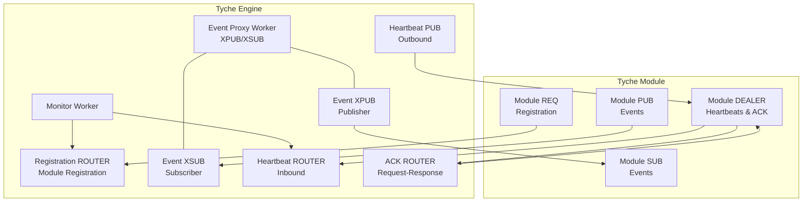
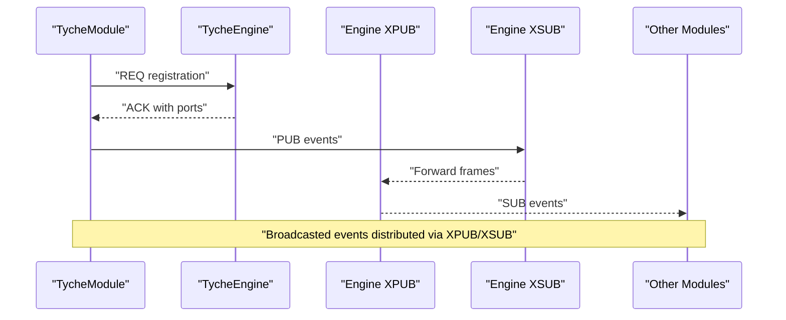
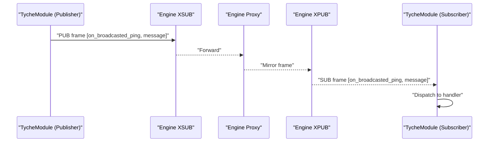
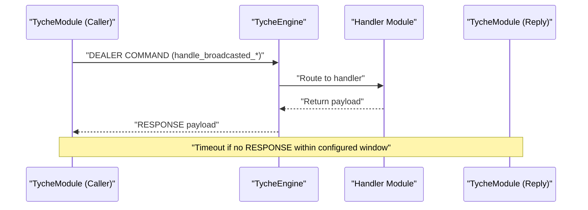
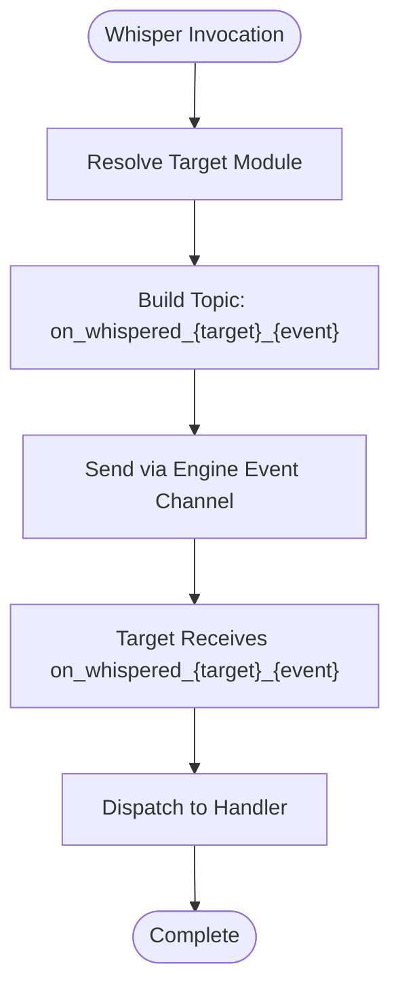
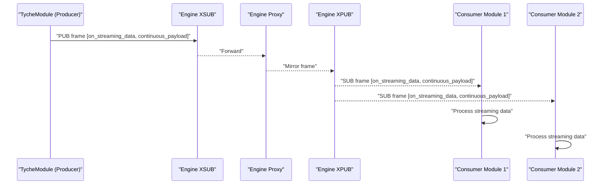
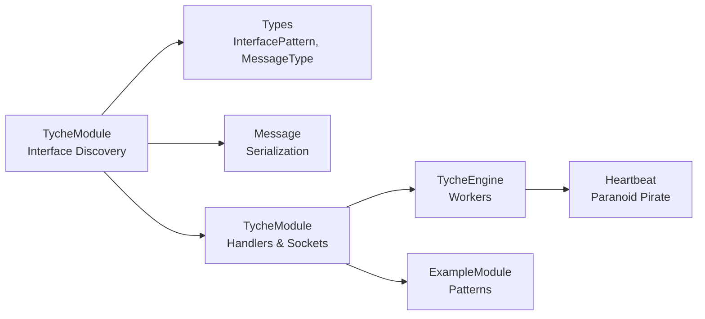

# Communication Patterns

<cite>
**Referenced Files in This Document**
- [engine.py](file://src/tyche/engine.py)
- [module.py](file://src/tyche/module.py)
- [module_base.py](file://src/tyche/module_base.py)
- [message.py](file://src/tyche/message.py)
- [types.py](file://src/tyche/types.py)
- [example_module.py](file://src/tyche/example_module.py)
- [heartbeat.py](file://src/tyche/heartbeat.py)
- [run_engine.py](file://examples/run_engine.py)
- [run_module.py](file://examples/run_module.py)
</cite>

## Update Summary
**Changes Made**
- Complete redesign of module interface system from v1 to v2 communication patterns
- Replaced old `on_*`, `ack_*`, `whisper_*` patterns with new `broadcasted`, `whispered`, and `streaming` categories
- Updated interface discovery mechanism to use new naming conventions
- Enhanced request-response pattern with correlation-based message routing
- Added streaming pattern for continuous data flows

## Table of Contents
1. [Introduction](#introduction)
2. [Project Structure](#project-structure)
3. [Core Components](#core-components)
4. [Architecture Overview](#architecture-overview)
5. [Detailed Component Analysis](#detailed-component-analysis)
6. [Dependency Analysis](#dependency-analysis)
7. [Performance Considerations](#performance-considerations)
8. [Troubleshooting Guide](#troubleshooting-guide)
9. [Conclusion](#conclusion)

## Introduction
This document explains Tyche Engine's three primary communication patterns introduced in v2 and how ZeroMQ socket patterns implement them:
- Broadcasted (fire-and-forget events)
- Whispered (direct P2P messaging)
- Streaming (continuous data streams)

Each category provides both fire-and-forget (`on_*`) and request-response (`handle_*`) variants. It covers ZeroMQ socket types, behavioral characteristics, delivery guarantees, use cases, implementation details, interface naming conventions, message flow diagrams, practical examples, performance implications, failure modes, and best practices.

**Updated** The v2 system replaces the legacy `on_*`, `ack_*`, and `whisper_*` patterns with a cleaner categorization system that groups related communication patterns together.

## Project Structure
Tyche Engine organizes communication around a central broker (engine) and modules that connect to it. The engine exposes:
- Registration endpoint (ROUTER/DEALER handshake)
- Event routing via XPUB/XSUB proxy
- Heartbeat monitoring (Paranoid Pirate pattern)
- Acknowledgment channel (separate ROUTER endpoint for request-response)

Modules connect using:
- REQ for registration
- PUB/SUB for event exchange
- DEALER for heartbeats and acknowledgments

**Diagram sources**
- [engine.py:128-160](file://src/tyche/engine.py#L128-L160)
- [engine.py:320-383](file://src/tyche/engine.py#L320-L383)
- [engine.py:384-447](file://src/tyche/engine.py#L384-L447)
- [engine.py:508-581](file://src/tyche/engine.py#L508-L581)
- [module.py:156-215](file://src/tyche/module.py#L156-L215)
- [module.py:167-194](file://src/tyche/module.py#L167-L194)
- [module.py:408-464](file://src/tyche/module.py#L408-L464)

**Section sources**
- [engine.py:37-66](file://src/tyche/engine.py#L37-L66)
- [module.py:41-82](file://src/tyche/module.py#L41-L82)

## Core Components
- TycheEngine: Central broker managing registration, event routing, heartbeats, and module lifecycle.
- TycheModule: Base module implementation handling registration, event subscription/publishing, request-response acknowledgments, and heartbeats.
- ModuleBase: Lightweight protocol defining the module contract (no concrete methods).
- Message: Serialization/deserialization for ZeroMQ frames and envelopes.
- Types: Enumerations for v2 interface patterns, message types, durability, and endpoints.

Key responsibilities:
- Registration: ROUTER socket handshake for module registration and interface discovery.
- Event routing: XPUB/XSUB proxy for pub/sub event distribution.
- Heartbeats: PUB/ROUTER pair implementing Paranoid Pirate liveness checks.
- Messaging: MessagePack serialization and envelope framing for ZeroMQ multipart messages.

**Section sources**
- [engine.py:28-35](file://src/tyche/engine.py#L28-L35)
- [module.py:28-39](file://src/tyche/module.py#L28-L39)
- [module_base.py:6-32](file://src/tyche/module_base.py#L6-L32)
- [message.py:13-35](file://src/tyche/message.py#L13-L35)
- [types.py:54-83](file://src/tyche/types.py#L54-L83)

## Architecture Overview
The engine exposes distinct endpoints for registration, event routing, and heartbeats. Modules connect to these endpoints and participate in the event mesh. The event proxy mirrors XPUB to XSUB frames, enabling fan-out to all subscribers. Request-response messages use a separate ACK endpoint with correlation-based routing.

**Diagram sources**
- [module.py:238-294](file://src/tyche/module.py#L238-L294)
- [engine.py:205-252](file://src/tyche/engine.py#L205-L252)
- [module.py:297-304](file://src/tyche/module.py#L297-L304)

## Detailed Component Analysis

### Broadcasted Events (on_broadcasted_*)
Behavioral characteristics:
- Best-effort delivery with no guaranteed acknowledgment.
- Load-balanced distribution across subscribers.
- Handlers return immediately; no response payload is expected.

ZeroMQ socket pattern:
- Module publishes events via PUB to engine's XSUB.
- Engine's event proxy mirrors XPUB to XSUB frames.
- Subscribers receive events via SUB.

Delivery guarantees:
- Best-effort; no persistence or retry.
- FIFO per subscriber; at-least-once semantics via ZeroMQ SUB.

Implementation details:
- Module publishes with topic as event name and serialized message body.
- Engine's proxy forwards frames unchanged.

Practical example:
- See [example_module.py:117-124](file://src/tyche/example_module.py#L117-L124) for an on_broadcasted_broadcast handler.
- See [module.py:379-409](file://src/tyche/module.py#L379-L409) for send_event implementation.

**Diagram sources**
- [module.py:379-409](file://src/tyche/module.py#L379-L409)
- [engine.py:384-447](file://src/tyche/engine.py#L384-L447)
- [module.py:351-376](file://src/tyche/module.py#L351-L376)

Best practices:
- Use on_broadcasted_* for telemetry, metrics, and non-critical notifications.
- Keep payloads small and serializable.
- Avoid long-running work inside handlers; offload to background tasks if needed.

Failure modes:
- Network partitions: events may be dropped.
- Subscriber overload: back-pressure via ZeroMQ; consider batching or rate limiting.

**Section sources**
- [module.py:379-409](file://src/tyche/module.py#L379-L409)
- [module.py:351-376](file://src/tyche/module.py#L351-L376)
- [example_module.py:117-124](file://src/tyche/example_module.py#L117-L124)

### Request-Response (handle_broadcasted_*)
Behavioral characteristics:
- Synchronous request with required acknowledgment.
- Module sends a command-like message and waits for a response within a timeout.
- Handlers must return a dictionary payload.

ZeroMQ socket pattern:
- Module uses a DEALER socket to send a COMMAND message to engine's ACK ROUTER.
- Engine routes COMMAND to registered handlers and replies with RESPONSE on the same socket.
- Acknowledgment channel is separate from the event proxy.

Delivery guarantees:
- At-least-once delivery to engine; response sent back to requester.
- Timeout-based failure detection.

Implementation details:
- Module.send_event_with_response constructs a COMMAND message with correlation_id and waits for RESPONSE.
- Engine routes COMMAND to registered handlers and replies with RESPONSE.

Practical example:
- See [example_module.py:89-102](file://src/tyche/example_module.py#L89-L102) for a handle_broadcasted_request handler.
- See [module.py:410-464](file://src/tyche/module.py#L410-L464) for send_event_with_response implementation.

**Diagram sources**
- [module.py:410-464](file://src/tyche/module.py#L410-L464)
- [engine.py:322-383](file://src/tyche/engine.py#L322-L383)
- [module.py:119-143](file://src/tyche/module.py#L119-L143)

Best practices:
- Use handle_broadcasted_* for RPC-like operations requiring confirmation.
- Keep request payloads minimal and idempotent.
- Set reasonable timeouts based on expected handler latency.

Failure modes:
- Handler crash or slow processing: caller receives timeout.
- Network errors: DEALER socket may fail; caller should retry or abort.

**Section sources**
- [module.py:410-464](file://src/tyche/module.py#L410-L464)
- [example_module.py:89-102](file://src/tyche/example_module.py#L89-L102)
- [module.py:119-143](file://src/tyche/module.py#L119-L143)

### Direct P2P Messaging (on_whispered_*)
Behavioral characteristics:
- Direct, point-to-point communication between two modules.
- Bypasses engine event proxy; uses direct socket paths.
- Naming convention includes target module ID in the handler name.

ZeroMQ socket pattern:
- Whisper handlers are discovered via naming convention (on_whispered_{target}_{event}).
- Implementation relies on module auto-discovery and handler routing.

Delivery guarantees:
- Best-effort; depends on underlying transport and network conditions.
- No built-in engine routing for whispers; requires sender to know target.

Implementation details:
- ModuleBase discovers whisper interfaces automatically from method names.
- Example module demonstrates an on_whispered_message handler.

Practical example:
- See [example_module.py:104-116](file://src/tyche/example_module.py#L104-L116) for a whisper handler.
- See [module.py:112-143](file://src/tyche/module.py#L112-L143) for interface discovery logic.

**Diagram sources**
- [module.py:112-143](file://src/tyche/module.py#L112-L143)
- [example_module.py:104-116](file://src/tyche/example_module.py#L104-L116)

Best practices:
- Use on_whispered_* for sensitive or private messages between known modules.
- Ensure target module is registered and subscribed to the topic.
- Keep whisper topics stable and documented.

Failure modes:
- Target module not registered or not subscribed: message lost.
- Network connectivity issues: delivery fails silently.

**Section sources**
- [module.py:112-143](file://src/tyche/module.py#L112-L143)
- [example_module.py:104-116](file://src/tyche/example_module.py#L104-L116)

### Streaming Data (on_streaming_*)
Behavioral characteristics:
- Continuous data flow with ongoing delivery.
- Designed for real-time data feeds and streams.
- Supports high-frequency updates without request-response overhead.

ZeroMQ socket pattern:
- Module publishes streaming data via PUB to engine's XSUB.
- Engine's proxy mirrors frames to all subscribers via XPUB.
- Stream consumers receive continuous updates.

Delivery guarantees:
- Best-effort streaming; no per-subscriber acknowledgment.
- Continuous flow with potential for back-pressure.

Implementation details:
- Example module demonstrates an on_streaming_data handler for continuous data reception.
- Module subscribes to streaming topics matching its handler names.

Practical example:
- See [example_module.py:82-88](file://src/tyche/example_module.py#L82-L88) for an on_streaming_data handler.
- See [module.py:297-304](file://src/tyche/module.py#L297-L304) for subscription setup.

**Diagram sources**
- [module.py:379-409](file://src/tyche/module.py#L379-L409)
- [engine.py:384-447](file://src/tyche/engine.py#L384-L447)
- [module.py:297-304](file://src/tyche/module.py#L297-L304)
- [example_module.py:82-88](file://src/tyche/example_module.py#L82-L88)

Best practices:
- Use on_streaming_* for real-time data feeds and continuous updates.
- Implement rate limiting and batching for high-frequency streams.
- Design handlers to handle rapid-fire updates efficiently.

Failure modes:
- Network partitions: streaming may be interrupted.
- Consumer overload: back-pressure via ZeroMQ; consider throttling or buffering.

**Section sources**
- [example_module.py:82-88](file://src/tyche/example_module.py#L82-L88)
- [module.py:297-304](file://src/tyche/module.py#L297-L304)

## Dependency Analysis
The communication patterns rely on:
- Interface naming conventions defined in TycheModule's pattern detection.
- Message types and durability levels defined in Types.
- Serialization/deserialization in Message.
- Engine workers for registration, event proxy, and heartbeats.
- Module workers for registration, event handling, and heartbeats.

**Diagram sources**
- [module.py:95-143](file://src/tyche/module.py#L95-L143)
- [types.py:54-83](file://src/tyche/types.py#L54-L83)
- [message.py:69-111](file://src/tyche/message.py#L69-L111)
- [module.py:28-39](file://src/tyche/module.py#L28-L39)
- [engine.py:28-35](file://src/tyche/engine.py#L28-L35)
- [heartbeat.py:91-153](file://src/tyche/heartbeat.py#L91-L153)
- [example_module.py:18-31](file://src/tyche/example_module.py#L18-L31)

**Section sources**
- [module.py:95-143](file://src/tyche/module.py#L95-L143)
- [types.py:54-83](file://src/tyche/types.py#L54-L83)
- [message.py:69-111](file://src/tyche/message.py#L69-L111)
- [module.py:28-39](file://src/tyche/module.py#L28-L39)
- [engine.py:28-35](file://src/tyche/engine.py#L28-L35)
- [heartbeat.py:91-153](file://src/tyche/heartbeat.py#L91-L153)
- [example_module.py:18-31](file://src/tyche/example_module.py#L18-L31)

## Performance Considerations
- Broadcasted (on_broadcasted_*): Minimal overhead; PUB/SUB fan-out scales with subscribers. Tune subscription granularity to reduce unnecessary traffic.
- Request-Response (handle_broadcasted_*): Adds latency due to round-trip and serialization. Use timeouts to bound wait time; consider batching requests if feasible.
- Direct P2P (on_whispered_*): Best-effort delivery; overhead equals standard event publishing. Favor whisper for sensitive or targeted messages.
- Streaming (on_streaming_*): Continuous data flow with minimal overhead; designed for high-frequency updates. Implement rate limiting and batching for optimal performance.

Failure modes and mitigations:
- Registration timeouts: increase RCVTIMEO or retry registration.
- Event proxy stalls: monitor poller and restart worker if needed.
- Heartbeat liveness: Paranoid Pirate pattern detects dead modules; engine unregisters expired modules.

Best practices:
- Use durability levels judiciously; best effort is sufficient for most telemetry.
- Keep payloads small and serializable; leverage MessagePack encoding.
- Monitor throughput and latency; adjust subscription filters and broadcast cadence.

## Troubleshooting Guide
Common issues and resolutions:
- Registration failures: Verify endpoints and network connectivity; check engine logs for deserialization errors.
- No events received: Confirm subscription topics match handler names; ensure engine proxy is running.
- Acknowledgment timeouts: Increase timeout or optimize handler performance; verify engine routing for COMMAND/RESPONSE.
- Heartbeat anomalies: Check DEALER/PUB socket bindings; ensure heartbeat intervals align across modules.

Operational tips:
- Use example scripts to validate engine and module connectivity.
- Inspect module interface discovery and handler routing.
- Monitor engine worker threads and socket states.

**Section sources**
- [module.py:238-294](file://src/tyche/module.py#L238-L294)
- [engine.py:384-447](file://src/tyche/engine.py#L384-L447)
- [module.py:410-464](file://src/tyche/module.py#L410-L464)
- [heartbeat.py:91-153](file://src/tyche/heartbeat.py#L91-L153)
- [run_engine.py:24-59](file://examples/run_engine.py#L24-L59)
- [run_module.py:26-67](file://examples/run_module.py#L26-L67)

## Conclusion
Tyche Engine's v2 communication patterns combine ZeroMQ socket patterns with clear naming conventions to support diverse messaging needs:
- Broadcasted for scalable, best-effort distribution.
- Request-response for synchronous confirmations.
- Direct P2P for private, targeted exchanges.
- Streaming for continuous data flows.

The new categorization system provides cleaner separation of concerns while maintaining the flexibility and performance of the underlying ZeroMQ infrastructure. By leveraging the provided interfaces, serialization, and engine workers, developers can implement robust, high-performance inter-module communication tailored to their use cases.

**Updated** The v2 system represents a significant improvement over the legacy pattern system, offering clearer semantics and better organization of communication patterns.