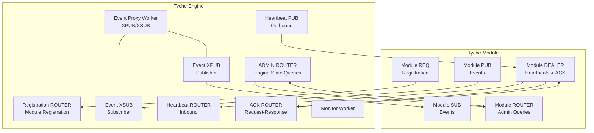
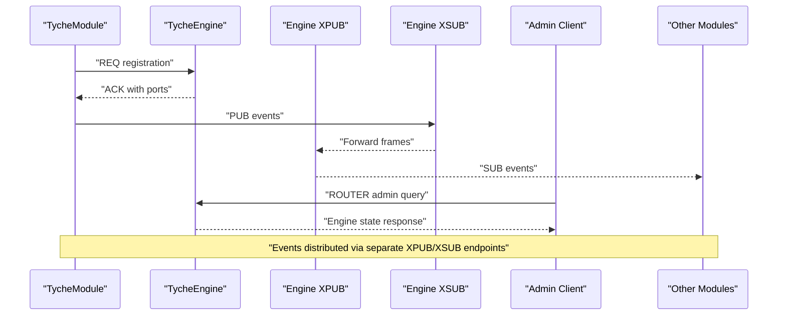
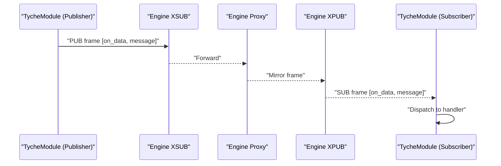
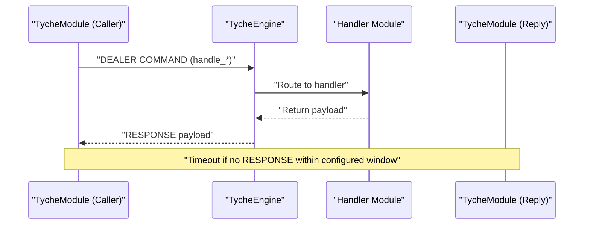
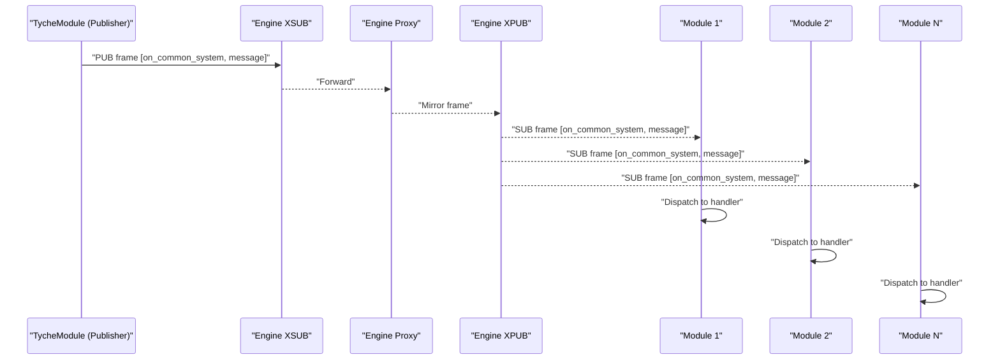
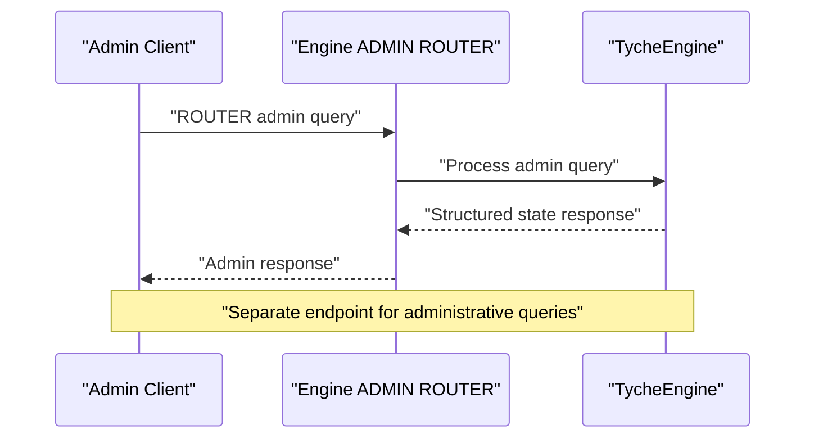
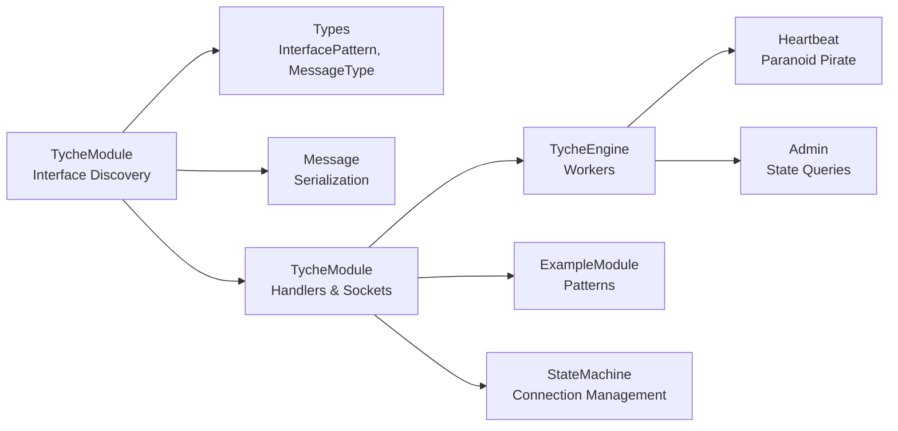

# Communication Patterns

<cite>
**Referenced Files in This Document**
- [engine.py](file://src/tyche/engine.py)
- [module.py](file://src/tyche/module.py)
- [module_base.py](file://src/tyche/module_base.py)
- [message.py](file://src/tyche/message.py)
- [types.py](file://src/tyche/types.py)
- [example_module.py](file://src/tyche/example_module.py)
- [heartbeat.py](file://src/tyche/heartbeat.py)
- [run_engine.py](file://examples/run_engine.py)
- [run_module.py](file://examples/run_module.py)
- [state_machine.py](file://src/modules/trading/gateway/ctp/state_machine.py)
</cite>

## Update Summary
**Changes Made**
- Added Administrative Endpoint Pattern (admin_*) for engine state queries
- Enhanced Event Distribution with separate XPUB/XSUB endpoints for improved isolation
- Integrated Sophisticated State Machine for connection management
- Updated communication patterns to reflect v3 unified queue architecture

## Table of Contents
1. [Introduction](#introduction)
2. [Project Structure](#project-structure)
3. [Core Components](#core-components)
4. [Architecture Overview](#architecture-overview)
5. [Detailed Component Analysis](#detailed-component-analysis)
6. [Dependency Analysis](#dependency-analysis)
7. [Performance Considerations](#performance-considerations)
8. [Troubleshooting Guide](#troubleshooting-guide)
9. [Conclusion](#conclusion)

## Introduction
This document explains Tyche Engine's four primary communication patterns introduced in v3 and how ZeroMQ socket patterns implement them:
- Fire-and-Forget Events (on_*)
- Request-Response (handle_*)
- Direct P2P Messaging (whisper_*)
- Broadcast Events (on_common_*)
- Administrative Queries (admin_*)

Each pattern provides different delivery guarantees and use cases. It covers ZeroMQ socket types, behavioral characteristics, delivery guarantees, use cases, implementation details, interface naming conventions, message flow diagrams, practical examples, performance implications, failure modes, and best practices.

**Updated** The v3 system introduces administrative endpoint patterns and sophisticated state machine integration for enhanced connection management and monitoring capabilities.

## Project Structure
Tyche Engine organizes communication around a central broker (engine) and modules that connect to it. The engine exposes:
- Registration endpoint (ROUTER/DEALER handshake)
- Event routing via XPUB/XSUB proxy with separate endpoints
- Heartbeat monitoring (Paranoid Pirate pattern)
- Administrative endpoint for engine state queries
- Acknowledgment channel (separate ROUTER endpoint for request-response)

Modules connect using:
- REQ for registration
- PUB/SUB for event exchange
- DEALER for heartbeats and acknowledgments
- ROUTER for administrative queries

**Diagram sources**
- [engine.py:37-66](file://src/tyche/engine.py#L37-L66)
- [engine.py:128-160](file://src/tyche/engine.py#L128-L160)
- [engine.py:320-383](file://src/tyche/engine.py#L320-L383)
- [engine.py:384-447](file://src/tyche/engine.py#L384-L447)
- [engine.py:508-581](file://src/tyche/engine.py#L508-L581)
- [engine.py:570-592](file://src/tyche/engine.py#L570-L592)
- [module.py:156-215](file://src/tyche/module.py#L156-L215)
- [module.py:167-194](file://src/tyche/module.py#L167-L194)
- [module.py:408-464](file://src/tyche/module.py#L408-L464)

**Section sources**
- [engine.py:37-66](file://src/tyche/engine.py#L37-L66)
- [module.py:41-82](file://src/tyche/module.py#L41-L82)

## Core Components
- TycheEngine: Central broker managing registration, event routing, heartbeats, administrative queries, and module lifecycle.
- TycheModule: Base module implementation handling registration, event subscription/publishing, request-response acknowledgments, administrative queries, and heartbeats.
- ModuleBase: Lightweight protocol defining the module contract (no concrete methods).
- Message: Serialization/deserialization for ZeroMQ frames and envelopes.
- Types: Enumerations for v3 interface patterns, message types, durability, and endpoints.
- ConnectionStateMachine: Sophisticated state machine for connection management with auto-reconnect capabilities.

Key responsibilities:
- Registration: ROUTER socket handshake for module registration and interface discovery.
- Event routing: Separate XPUB/XSUB endpoints for isolated event distribution.
- Heartbeats: PUB/ROUTER pair implementing Paranoid Pirate liveness checks.
- Administrative queries: ROUTER socket for engine state inspection and monitoring.
- Messaging: MessagePack serialization and envelope framing for ZeroMQ multipart messages.

**Section sources**
- [engine.py:28-35](file://src/tyche/engine.py#L28-L35)
- [module.py:28-39](file://src/tyche/module.py#L28-L39)
- [module_base.py:6-32](file://src/tyche/module_base.py#L6-L32)
- [message.py:13-35](file://src/tyche/message.py#L13-L35)
- [types.py:54-83](file://src/tyche/types.py#L54-L83)
- [state_machine.py:34-95](file://src/modules/trading/gateway/ctp/state_machine.py#L34-L95)

## Architecture Overview
The engine exposes distinct endpoints for registration, event routing, administrative queries, and heartbeats. Modules connect to these endpoints and participate in the event mesh. The event proxy mirrors XPUB to XSUB frames, enabling fan-out to all subscribers. Administrative queries use a separate ROUTER endpoint for engine state inspection. Request-response messages use a separate ACK endpoint with correlation-based routing.

**Diagram sources**
- [module.py:238-294](file://src/tyche/module.py#L238-L294)
- [engine.py:205-252](file://src/tyche/engine.py#L205-L252)
- [module.py:297-304](file://src/tyche/module.py#L297-L304)
- [engine.py:593-660](file://src/tyche/engine.py#L593-L660)

## Detailed Component Analysis

### Fire-and-Forget Events (on_*)
Behavioral characteristics:
- Best-effort delivery with no guaranteed acknowledgment.
- Load-balanced distribution across subscribers.
- Handlers return immediately; no response payload is expected.

ZeroMQ socket pattern:
- Module publishes events via PUB to engine's XSUB endpoint.
- Engine's event proxy mirrors XPUB to XSUB frames.
- Subscribers receive events via SUB.

Delivery guarantees:
- Best-effort; no persistence or retry.
- FIFO per subscriber; at-least-once semantics via ZeroMQ SUB.

Implementation details:
- Module publishes with topic as event name and serialized message body.
- Engine's proxy forwards frames unchanged.
- Separate XPUB/XSUB endpoints provide isolation from administrative traffic.

Practical example:
- See [example_module.py:83-97](file://src/tyche/example_module.py#L83-L97) for on_data, on_message, and on_broadcast handlers.
- See [module.py:379-409](file://src/tyche/module.py#L379-L409) for send_event implementation.

**Diagram sources**
- [module.py:379-409](file://src/tyche/module.py#L379-L409)
- [engine.py:384-447](file://src/tyche/engine.py#L384-L447)
- [module.py:351-376](file://src/tyche/module.py#L351-L376)

Best practices:
- Use on_* for telemetry, metrics, and non-critical notifications.
- Keep payloads small and serializable.
- Avoid long-running work inside handlers; offload to background tasks if needed.

Failure modes:
- Network partitions: events may be dropped.
- Subscriber overload: back-pressure via ZeroMQ; consider batching or rate limiting.

**Section sources**
- [module.py:379-409](file://src/tyche/module.py#L379-L409)
- [module.py:351-376](file://src/tyche/module.py#L351-L376)
- [example_module.py:83-97](file://src/tyche/example_module.py#L83-L97)

### Request-Response (handle_*)
Behavioral characteristics:
- Synchronous request with required acknowledgment.
- Module sends a command-like message and waits for a response within a timeout.
- Handlers must return a dictionary payload.

ZeroMQ socket pattern:
- Module uses a DEALER socket to send a COMMAND message to engine's ACK ROUTER.
- Engine routes COMMAND to registered handlers and replies with RESPONSE on the same socket.
- Acknowledgment channel is separate from the event proxy.

Delivery guarantees:
- At-least-once delivery to engine; response sent back to requester.
- Timeout-based failure detection.

Implementation details:
- Module.send_event_with_response constructs a COMMAND message with correlation_id and waits for RESPONSE.
- Engine routes COMMAND to registered handlers and replies with RESPONSE.

Practical example:
- See [example_module.py:89-102](file://src/tyche/example_module.py#L89-L102) for a handle_broadcasted_request handler.
- See [module.py:410-464](file://src/tyche/module.py#L410-L464) for send_event_with_response implementation.

**Diagram sources**
- [module.py:410-464](file://src/tyche/module.py#L410-L464)
- [engine.py:322-383](file://src/tyche/engine.py#L322-L383)
- [module.py:119-143](file://src/tyche/module.py#L119-L143)

Best practices:
- Use handle_* for RPC-like operations requiring confirmation.
- Keep request payloads minimal and idempotent.
- Set reasonable timeouts based on expected handler latency.

Failure modes:
- Handler crash or slow processing: caller receives timeout.
- Network errors: DEALER socket may fail; caller should retry or abort.

**Section sources**
- [module.py:410-464](file://src/tyche/module.py#L410-L464)
- [example_module.py:89-102](file://src/tyche/example_module.py#L89-L102)
- [module.py:119-143](file://src/tyche/module.py#L119-L143)

### Direct P2P Messaging (whisper_*)
Behavioral characteristics:
- Direct, point-to-point communication between two modules.
- Bypasses engine event proxy; uses direct socket paths.
- Naming convention includes target module ID in the handler name.

ZeroMQ socket pattern:
- Whisper handlers are discovered via naming convention (whisper_{target}_{event}).
- Implementation relies on module auto-discovery and handler routing.

Delivery guarantees:
- Best-effort; depends on underlying transport and network conditions.
- No built-in engine routing for whispers; requires sender to know target.

Implementation details:
- ModuleBase discovers whisper interfaces automatically from method names.
- Example module demonstrates a whisper handler.

Practical example:
- See [example_module.py:104-116](file://src/tyche/example_module.py#L104-L116) for a whisper handler.
- See [module.py:112-143](file://src/tyche/module.py#L112-L143) for interface discovery logic.

**Diagram sources**
- [module.py:112-143](file://src/tyche/module.py#L112-L143)
- [example_module.py:104-116](file://src/tyche/example_module.py#L104-L116)

Best practices:
- Use whisper_* for sensitive or private messages between known modules.
- Ensure target module is registered and subscribed to the topic.
- Keep whisper topics stable and documented.

Failure modes:
- Target module not registered or not subscribed: message lost.
- Network connectivity issues: delivery fails silently.

**Section sources**
- [module.py:112-143](file://src/tyche/module.py#L112-L143)
- [example_module.py:104-116](file://src/tyche/example_module.py#L104-L116)

### Broadcast Events (on_common_*)
Behavioral characteristics:
- System-wide broadcast events that reach all modules regardless of subscription.
- Designed for critical system notifications and global state changes.
- Higher priority than regular on_* events.

ZeroMQ socket pattern:
- Module publishes broadcast events via PUB to engine's XSUB endpoint.
- Engine's event proxy mirrors XPUB to XSUB frames.
- All modules receive broadcast events regardless of individual subscriptions.

Delivery guarantees:
- Best-effort system-wide distribution.
- No per-subscriber acknowledgment required.

Implementation details:
- Broadcast handlers are discovered via naming convention (on_common_*).
- Example module demonstrates broadcast event handling.

Practical example:
- See [example_module.py:93-97](file://src/tyche/example_module.py#L93-L97) for on_common broadcast handler.
- See [module.py:379-409](file://src/tyche/module.py#L379-L409) for broadcast event publishing.

**Diagram sources**
- [module.py:379-409](file://src/tyche/module.py#L379-L409)
- [engine.py:384-447](file://src/tyche/engine.py#L384-L447)
- [module.py:297-304](file://src/tyche/module.py#L297-L304)
- [example_module.py:93-97](file://src/tyche/example_module.py#L93-L97)

Best practices:
- Use on_common_* for critical system notifications and global state changes.
- Limit broadcast frequency to avoid overwhelming the system.
- Use sparingly for essential system events only.

Failure modes:
- Network partitions: broadcast may be interrupted.
- Receiver overload: back-pressure via ZeroMQ; consider throttling.

**Section sources**
- [example_module.py:93-97](file://src/tyche/example_module.py#L93-L97)
- [module.py:297-304](file://src/tyche/module.py#L297-L304)

### Administrative Queries (admin_*)
Behavioral characteristics:
- Engine state inspection and monitoring interface.
- Query-based administrative operations for system management.
- Uses separate ROUTER endpoint for isolation from normal traffic.

ZeroMQ socket pattern:
- Administrative clients connect to ADMIN ROUTER endpoint.
- Engine responds with structured state information.
- Supports multiple query types: STATUS, MODULES, STATS.

Delivery guarantees:
- Best-effort administrative queries.
- No persistent state maintained for administrative responses.

Implementation details:
- Administrative queries use MessagePack serialization.
- Engine maintains comprehensive state information for queries.
- Separate administrative endpoint prevents interference with normal operations.

Practical example:
- See [engine.py:593-660](file://src/tyche/engine.py#L593-L660) for admin query processing.
- See [run_engine.py:30-36](file://examples/run_engine.py#L30-L36) for engine initialization with admin endpoint.

**Diagram sources**
- [engine.py:570-592](file://src/tyche/engine.py#L570-L592)
- [engine.py:593-660](file://src/tyche/engine.py#L593-L660)
- [run_engine.py:30-36](file://examples/run_engine.py#L30-L36)

Best practices:
- Use admin_* for system monitoring and debugging.
- Keep administrative queries lightweight and infrequent.
- Implement proper timeout handling for admin operations.

Failure modes:
- Admin endpoint unavailable: client should retry with backoff.
- Malformed admin queries: engine returns error response.
- Network connectivity issues: administrative queries fail.

**Section sources**
- [engine.py:570-592](file://src/tyche/engine.py#L570-L592)
- [engine.py:593-660](file://src/tyche/engine.py#L593-L660)
- [run_engine.py:30-36](file://examples/run_engine.py#L30-L36)

## Dependency Analysis
The communication patterns rely on:
- Interface naming conventions defined in TycheModule's pattern detection.
- Message types and durability levels defined in Types.
- Serialization/deserialization in Message.
- Engine workers for registration, event proxy, administrative queries, and heartbeats.
- Module workers for registration, event handling, administrative queries, and heartbeats.
- State machine integration for sophisticated connection management.

**Diagram sources**
- [module.py:95-143](file://src/tyche/module.py#L95-L143)
- [types.py:54-83](file://src/tyche/types.py#L54-L83)
- [message.py:69-111](file://src/tyche/message.py#L69-L111)
- [module.py:28-39](file://src/tyche/module.py#L28-L39)
- [engine.py:28-35](file://src/tyche/engine.py#L28-L35)
- [heartbeat.py:91-153](file://src/tyche/heartbeat.py#L91-L153)
- [example_module.py:18-31](file://src/tyche/example_module.py#L18-L31)
- [state_machine.py:34-95](file://src/modules/trading/gateway/ctp/state_machine.py#L34-L95)

**Section sources**
- [module.py:95-143](file://src/tyche/module.py#L95-L143)
- [types.py:54-83](file://src/tyche/types.py#L54-L83)
- [message.py:69-111](file://src/tyche/message.py#L69-L111)
- [module.py:28-39](file://src/tyche/module.py#L28-L39)
- [engine.py:28-35](file://src/tyche/engine.py#L28-L35)
- [heartbeat.py:91-153](file://src/tyche/heartbeat.py#L91-L153)
- [example_module.py:18-31](file://src/tyche/example_module.py#L18-L31)
- [state_machine.py:34-95](file://src/modules/trading/gateway/ctp/state_machine.py#L34-L95)

## Performance Considerations
- Fire-and-Forget Events (on_*): Minimal overhead; PUB/SUB fan-out scales with subscribers. Separate XPUB/XSUB endpoints provide isolation from administrative traffic.
- Request-Response (handle_*): Adds latency due to round-trip and serialization. Use timeouts to bound wait time; consider batching requests if feasible.
- Direct P2P (whisper_*): Best-effort delivery; overhead equals standard event publishing. Favor whisper for sensitive or targeted messages.
- Broadcast Events (on_common_*): System-wide distribution with minimal overhead; designed for critical notifications.
- Administrative Queries (admin_*): Low-latency state inspection; separate endpoint prevents interference with normal operations.
- State Machine Integration: Sophisticated connection management with exponential backoff and retry tracking.

Failure modes and mitigations:
- Registration timeouts: increase RCVTIMEO or retry registration.
- Event proxy stalls: monitor poller and restart worker if needed.
- Heartbeat liveness: Paranoid Pirate pattern detects dead modules; engine unregisters expired modules.
- Administrative endpoint unavailability: implement retry logic with backoff.
- State machine failures: monitor retry counts and implement circuit breaker patterns.

Best practices:
- Use durability levels judiciously; best effort is sufficient for most telemetry.
- Keep payloads small and serializable; leverage MessagePack encoding.
- Monitor throughput and latency; adjust subscription filters and broadcast cadence.
- Implement proper timeout handling for administrative queries.
- Use state machine patterns for robust connection management.

## Troubleshooting Guide
Common issues and resolutions:
- Registration failures: Verify endpoints and network connectivity; check engine logs for deserialization errors.
- No events received: Confirm subscription topics match handler names; ensure engine proxy is running.
- Acknowledgment timeouts: Increase timeout or optimize handler performance; verify engine routing for COMMAND/RESPONSE.
- Heartbeat anomalies: Check DEALER/PUB socket bindings; ensure heartbeat intervals align across modules.
- Administrative query failures: Verify admin endpoint binding; check engine logs for query processing errors.
- State machine issues: Monitor retry counts and backoff delays; implement circuit breaker patterns.

Operational tips:
- Use example scripts to validate engine and module connectivity.
- Inspect module interface discovery and handler routing.
- Monitor engine worker threads and socket states.
- Implement proper timeout handling for administrative operations.
- Use state machine patterns for resilient connection management.

**Section sources**
- [module.py:238-294](file://src/tyche/module.py#L238-L294)
- [engine.py:384-447](file://src/tyche/engine.py#L384-L447)
- [module.py:410-464](file://src/tyche/module.py#L410-L464)
- [heartbeat.py:91-153](file://src/tyche/heartbeat.py#L91-L153)
- [run_engine.py:24-59](file://examples/run_engine.py#L24-L59)
- [run_module.py:26-67](file://examples/run_module.py#L26-L67)
- [engine.py:593-660](file://src/tyche/engine.py#L593-L660)

## Conclusion
Tyche Engine's v3 communication patterns combine ZeroMQ socket patterns with clear naming conventions to support diverse messaging needs:
- Fire-and-Forget Events for scalable, best-effort distribution.
- Request-Response for synchronous confirmations.
- Direct P2P for private, targeted exchanges.
- Broadcast Events for system-wide notifications.
- Administrative Queries for engine state inspection.

The new v3 system introduces administrative endpoint patterns and sophisticated state machine integration for enhanced connection management and monitoring capabilities. The separate XPUB/XSUB endpoints provide improved isolation and performance. By leveraging the provided interfaces, serialization, and engine workers, developers can implement robust, high-performance inter-module communication tailored to their use cases.

**Updated** The v3 system represents a significant enhancement over previous versions, offering administrative capabilities, improved event distribution, and sophisticated connection management for production-grade deployments.