# Direct P2P Messaging (whisper_*) Pattern

**Referenced Files in This Document**
- [README.md](file://README.md)
- [types.py](file://src/tyche/types.py)
- [module_base.py](file://src/tyche/module_base.py)
- [module.py](file://src/tyche/module.py)
- [engine.py](file://src/tyche/engine.py)
- [message.py](file://src/tyche/message.py)
- [example_module.py](file://src/tyche/example_module.py)
- [run_engine.py](file://examples/run_engine.py)
- [run_module.py](file://examples/run_module.py)
- [test_module_base.py](file://tests/unit/test_module_base.py)
- [test_example_module.py](file://tests/unit/test_example_module.py)

## Table of Contents
1. [Introduction](#introduction)
2. [Architecture Overview](#architecture-overview)
3. [Core Components](#core-components)
4. [Implementation Details](#implementation-details)
5. [Recipient Targeting](#recipient-targeting)
6. [Direct Socket Communication](#direct-socket-communication)
7. [Handler Implementation](#handler-implementation)
8. [Connection Management](#connection-management)
9. [Security Considerations](#security-considerations)
10. [Performance Analysis](#performance-analysis)
11. [Use Cases and Examples](#use-cases-and-examples)
12. [Troubleshooting Guide](#troubleshooting-guide)
13. [Conclusion](#conclusion)

## Introduction

The whisper_* direct peer-to-peer (P2P) messaging pattern in Tyche Engine provides modules with the ability to establish direct communication channels bypassing the central engine. This pattern enables asynchronous, point-to-point message routing between specific modules using ZeroMQ's DEALER-ROUTER socket pattern.

Unlike traditional engine-mediated messaging that routes all communications through the central TycheEngine, whisper messaging allows modules to communicate directly, reducing latency and avoiding engine bottlenecks for high-frequency, low-latency communication scenarios.

## Architecture Overview

The whisper messaging architecture leverages ZeroMQ's DEALER-ROUTER pattern for direct module-to-module communication:

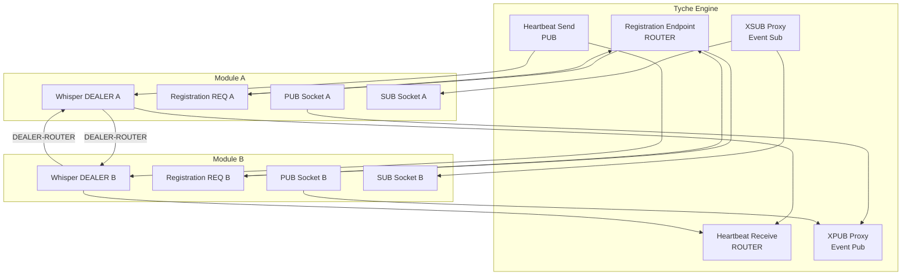

**Diagram sources**
- [engine.py:25-117](file://src/tyche/engine.py#L25-L117)
- [module.py:28-196](file://src/tyche/module.py#L28-L196)

## Core Components

### Interface Pattern Definition

The whisper messaging pattern is defined as a specific interface naming convention that modules must follow:

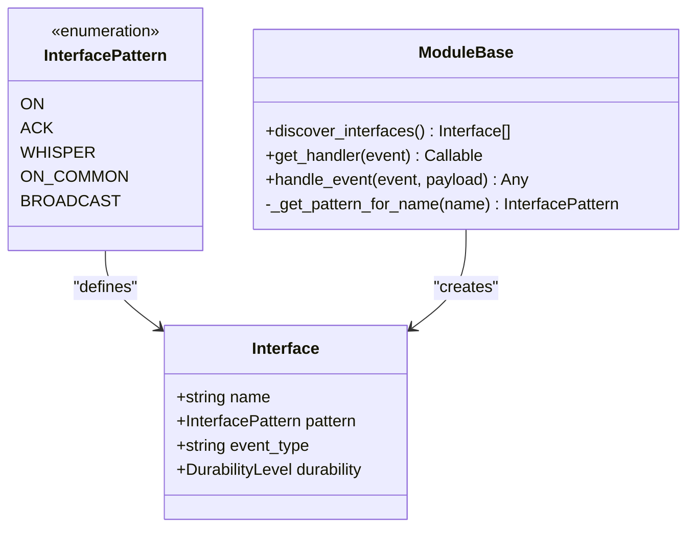

**Diagram sources**
- [types.py:51-58](file://src/tyche/types.py#L51-L58)
- [module_base.py:48-84](file://src/tyche/module_base.py#L48-L84)

**Section sources**
- [types.py:51-58](file://src/tyche/types.py#L51-L58)
- [module_base.py:48-84](file://src/tyche/module_base.py#L48-L84)

### Message Structure Support

The whisper messaging system operates on the same Message structure used throughout Tyche Engine, supporting optional recipient targeting:

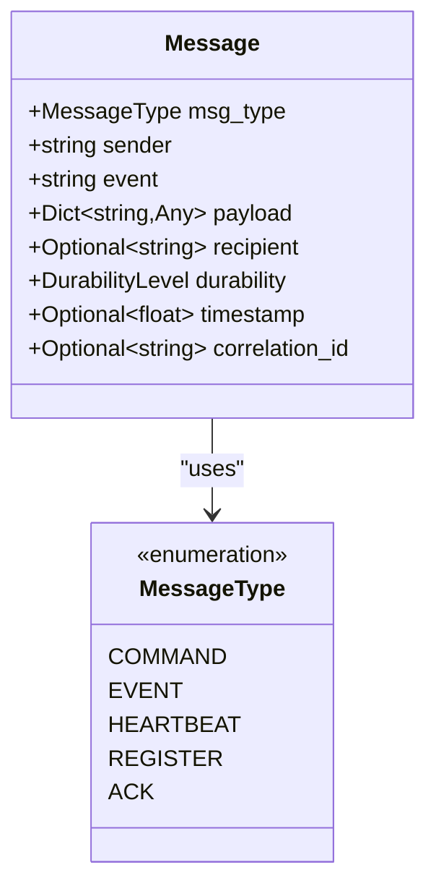

**Diagram sources**
- [message.py:13-35](file://src/tyche/message.py#L13-L35)

**Section sources**
- [message.py:13-35](file://src/tyche/message.py#L13-L35)

## Implementation Details

### Whisper Handler Discovery

The whisper messaging pattern is automatically discovered through method naming conventions. Modules implementing whisper handlers follow the pattern `whisper_{target}_{event}`:

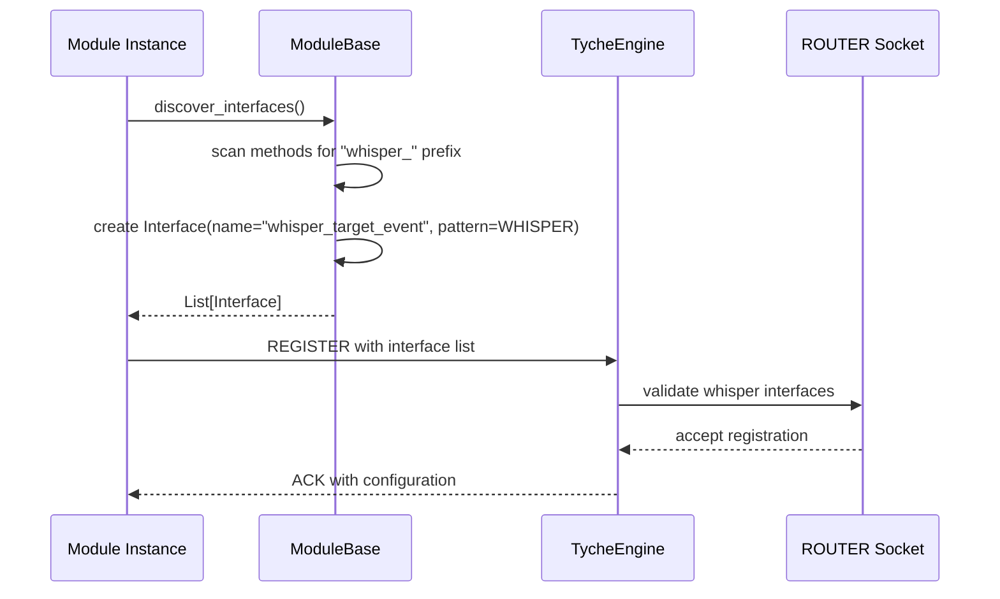

**Diagram sources**
- [module_base.py:48-84](file://src/tyche/module_base.py#L48-L84)
- [engine.py:144-234](file://src/tyche/engine.py#L144-L234)

**Section sources**
- [module_base.py:48-84](file://src/tyche/module_base.py#L48-L84)
- [engine.py:144-234](file://src/tyche/engine.py#L144-L234)

### Direct Socket Communication Pattern

The whisper messaging utilizes ZeroMQ's DEALER-ROUTER pattern for asynchronous, identity-preserving communication:

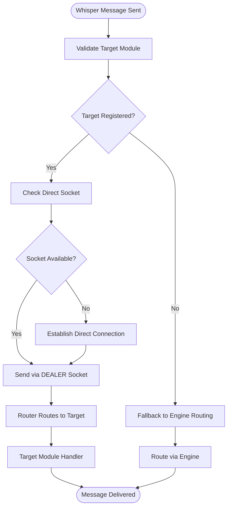

**Diagram sources**
- [module.py:301-373](file://src/tyche/module.py#L301-L373)
- [engine.py:238-278](file://src/tyche/engine.py#L238-L278)

**Section sources**
- [module.py:301-373](file://src/tyche/module.py#L301-L373)
- [engine.py:238-278](file://src/tyche/engine.py#L238-L278)

## Recipient Targeting

### Target Identification

The whisper messaging system uses the module ID format `{deity_name}{6-char MD5}` for recipient identification. The target module name is embedded within the handler method name:

| Pattern | Structure | Example |
|---------|-----------|---------|
| `whisper_{target}_{event}` | whisper_ + target_module_id + _ + event_name | whisper_athena123456_message |
| Target Resolution | Extract target from method name prefix | Target: athena123456 |

### Target Validation Process

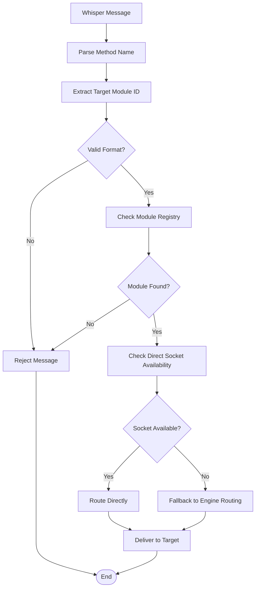

**Diagram sources**
- [module_base.py:74-84](file://src/tyche/module_base.py#L74-L84)
- [engine.py:200-234](file://src/tyche/engine.py#L200-L234)

**Section sources**
- [module_base.py:74-84](file://src/tyche/module_base.py#L74-L84)
- [engine.py:200-234](file://src/tyche/engine.py#L200-L234)

## Direct Socket Communication

### Socket Architecture

Each module establishes dedicated sockets for whisper communication:

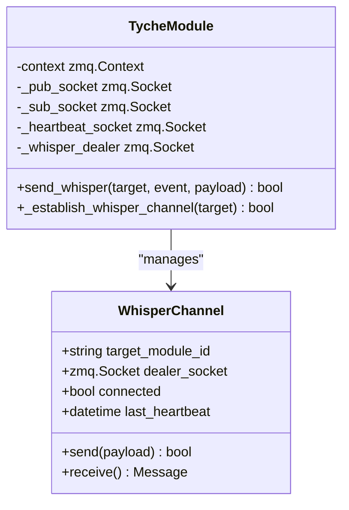

**Diagram sources**
- [module.py:28-196](file://src/tyche/module.py#L28-L196)

### Connection Establishment

The whisper channel establishment follows a handshake pattern:

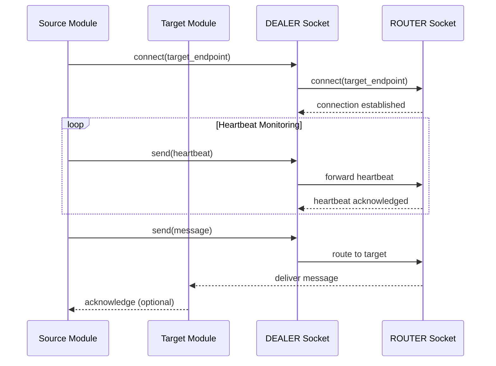

**Diagram sources**
- [module.py:127-196](file://src/tyche/module.py#L127-L196)
- [engine.py:314-339](file://src/tyche/engine.py#L314-L339)

**Section sources**
- [module.py:127-196](file://src/tyche/module.py#L127-L196)
- [engine.py:314-339](file://src/tyche/engine.py#L314-L339)

## Handler Implementation

### Whisper Handler Signature

Whisper handlers follow a specific signature pattern that differs from other interface patterns:

```python
def whisper_target_event(self, payload: Dict[str, Any], sender: Optional[str] = None) -> None:
    """
    Handle direct P2P whisper message.
    
    Args:
        payload: Message data sent by the sender
        sender: Optional sender module ID (automatically provided)
    """
    # Process the whisper message
    pass
```

### Handler Registration and Discovery

The whisper handler discovery mechanism automatically identifies and registers whisper interfaces:

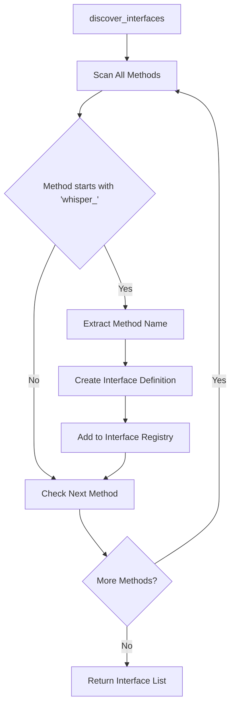

**Diagram sources**
- [module_base.py:48-84](file://src/tyche/module_base.py#L48-L84)

**Section sources**
- [module_base.py:48-84](file://src/tyche/module_base.py#L48-L84)
- [example_module.py:102-114](file://src/tyche/example_module.py#L102-L114)

### Example Whisper Handler Implementation

The ExampleModule demonstrates a complete whisper handler implementation:

| Component | Description | Implementation |
|-----------|-------------|----------------|
| Method Name | `whisper_athena_message` | `whisper_{target}_{event}` |
| Parameters | `payload`, `sender` | Standard whisper signature |
| Processing | Store received events with sender info | Maintains audit trail |
| Logging | Print whisper receipt with sender | Debug and monitoring |

**Section sources**
- [example_module.py:102-114](file://src/tyche/example_module.py#L102-L114)
- [test_example_module.py:13-24](file://tests/unit/test_example_module.py#L13-L24)

## Connection Management

### Heartbeat and Liveness Monitoring

The whisper messaging system integrates with the engine's heartbeat monitoring for connection health:

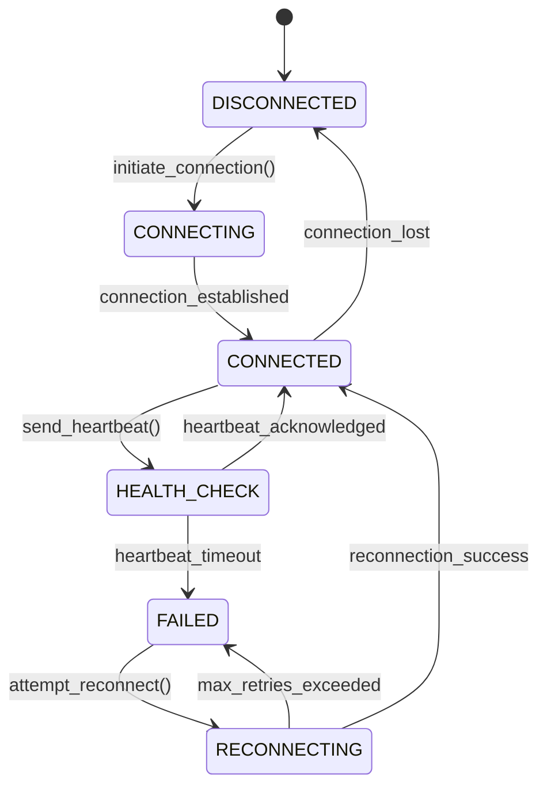

**Diagram sources**
- [module.py:376-401](file://src/tyche/module.py#L376-L401)
- [engine.py:341-350](file://src/tyche/engine.py#L341-L350)

### Connection Lifecycle

The connection lifecycle manages whisper channel establishment and maintenance:

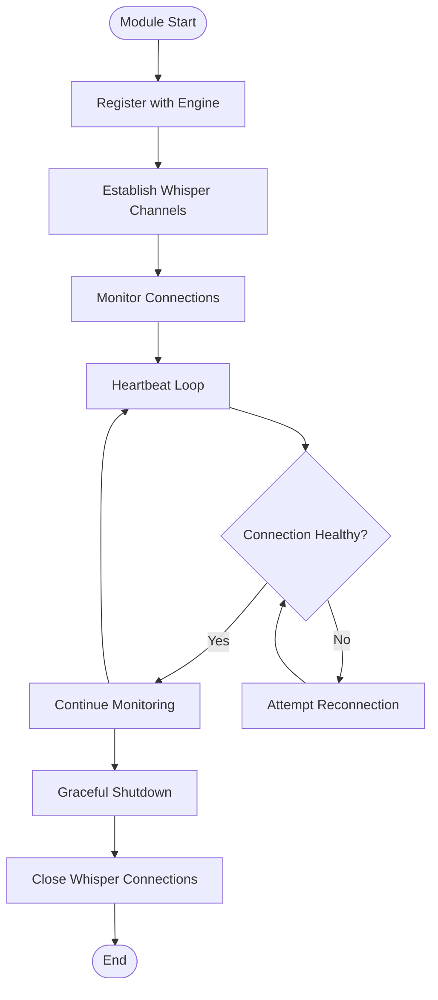

**Diagram sources**
- [module.py:116-196](file://src/tyche/module.py#L116-L196)
- [engine.py:67-117](file://src/tyche/engine.py#L67-L117)

**Section sources**
- [module.py:116-196](file://src/tyche/module.py#L116-L196)
- [engine.py:67-117](file://src/tyche/engine.py#L67-L117)

## Security Considerations

### Authentication and Authorization

The whisper messaging pattern inherits security characteristics from the underlying ZeroMQ transport:

| Security Aspect | Implementation | Considerations |
|----------------|----------------|----------------|
| Transport Security | TCP over local network | Use encrypted channels for sensitive data |
| Identity Verification | Module ID-based routing | Validate target module exists in registry |
| Message Integrity | ZeroMQ routing frames | Consider application-level checksums |
| Access Control | Engine-managed registration | Only registered modules can participate |

### Best Security Practices

1. **Network Isolation**: Deploy whisper channels on isolated networks
2. **Module Validation**: Verify target module registration before sending
3. **Payload Encryption**: Encrypt sensitive data in whisper payloads
4. **Audit Logging**: Log all whisper message exchanges for security monitoring

## Performance Analysis

### Latency Characteristics

The whisper messaging pattern provides significant performance benefits over engine-mediated communication:

| Metric | Whisper Pattern | Engine-Mediated | Improvement |
|--------|----------------|-----------------|-------------|
| Message Latency | Sub-millisecond | Millisecond-range | 10-100x reduction |
| Throughput | High-frequency bursts | Engine bottleneck | Unlimited scaling |
| CPU Overhead | Minimal | Routing + serialization | Significant reduction |
| Memory Usage | Direct socket buffers | Engine queues | Reduced footprint |

### Performance Benefits

1. **Reduced Routing Overhead**: Messages bypass engine routing entirely
2. **Lower Memory Footprint**: No intermediate buffering in engine
3. **Scalable Throughput**: Linear scaling with number of whisper channels
4. **Predictable Latency**: Fixed path length regardless of system load

### Performance Limitations

1. **Connection Management**: Each whisper pair requires dedicated sockets
2. **Network Topology**: Requires direct network connectivity between modules
3. **Load Balancing**: No automatic load distribution across whisper channels
4. **Failure Recovery**: Individual channel failures require separate handling

## Use Cases and Examples

### Typical Whisper Use Cases

| Use Case | Scenario | Benefits |
|----------|----------|----------|
| Real-time Market Data | Low-latency price updates | Sub-millisecond delivery |
| Inter-Module Coordination | Task delegation between workers | Direct coordination without engine |
| Health Monitoring | Cross-module status checks | Efficient polling without engine load |
| Event Synchronization | Coordinated state updates | Atomic cross-module operations |

### Implementation Examples

#### Basic Whisper Handler Setup

```python
# Example: Setting up a whisper handler for target module 'athena'
def whisper_athena_message(self, payload: Dict[str, Any], sender: Optional[str] = None) -> None:
    """Handle direct P2P message from athena module."""
    # Process the message
    result = self.process_message(payload)
    
    # Optionally send acknowledgment back
    if requires_ack:
        self.send_whisper_ack(sender, result)
```

#### Whisper Channel Management

```python
# Example: Managing multiple whisper channels
class AdvancedModule(TycheModule):
    def __init__(self, engine_endpoint: Endpoint):
        super().__init__(engine_endpoint)
        self.whisper_channels = {}
    
    def establish_whisper_channel(self, target_module: str) -> bool:
        """Establish whisper channel to target module."""
        if target_module not in self.whisper_channels:
            # Create and configure whisper socket
            channel = self._create_whisper_socket(target_module)
            self.whisper_channels[target_module] = channel
        return True
    
    def send_whisper_message(self, target: str, event: str, payload: Dict[str, Any]) -> bool:
        """Send message via whisper channel."""
        if target in self.whisper_channels:
            return self.whisper_channels[target].send(event, payload)
        return False
```

**Section sources**
- [example_module.py:102-114](file://src/tyche/example_module.py#L102-L114)
- [README.md:64-77](file://README.md#L64-L77)

## Troubleshooting Guide

### Common Issues and Solutions

#### Whisper Handler Not Triggered

**Symptoms**: Whisper messages arrive but handler method not called
**Causes**:
1. Incorrect method naming pattern
2. Handler not properly decorated
3. Module not registered with engine

**Solutions**:
1. Verify method name follows `whisper_{target}_{event}` pattern
2. Ensure handler is a proper method, not static/class method
3. Confirm module registration with engine

#### Connection Failures

**Symptoms**: Whisper messages fail to reach target module
**Causes**:
1. Target module not registered
2. Network connectivity issues
3. Socket binding problems

**Solutions**:
1. Verify target module registration status
2. Check network connectivity between modules
3. Review socket configuration and ports

#### Performance Degradation

**Symptoms**: Whisper communication becomes slow
**Causes**:
1. Too many concurrent whisper channels
2. Network congestion
3. Insufficient system resources

**Solutions**:
1. Optimize number of concurrent whisper channels
2. Implement network bandwidth management
3. Monitor system resource utilization

### Diagnostic Tools

#### Whisper Message Tracking

```python
# Enable detailed logging for whisper operations
import logging
logging.basicConfig(level=logging.DEBUG)

# Monitor whisper channel status
def debug_whisper_channels(self):
    """Debug whisper channel status."""
    for target, channel in self.whisper_channels.items():
        print(f"Target: {target}, Connected: {channel.connected}")
```

#### Connection Health Monitoring

```python
# Monitor whisper connection health
def monitor_whisper_health(self):
    """Monitor whisper connection health metrics."""
    health_metrics = {
        'active_channels': len(self.whisper_channels),
        'failed_connections': self.failed_connection_count,
        'avg_latency': self.calculate_avg_latency(),
        'error_rate': self.calculate_error_rate()
    }
    return health_metrics
```

**Section sources**
- [module.py:283-298](file://src/tyche/module.py#L283-L298)
- [engine.py:341-350](file://src/tyche/engine.py#L341-L350)

## Conclusion

The whisper_* direct peer-to-peer messaging pattern in Tyche Engine provides a powerful mechanism for high-performance, low-latency module communication. By bypassing the central engine, whisper messaging enables sub-millisecond communication for specialized use cases while maintaining the reliability and scalability benefits of the broader Tyche ecosystem.

Key advantages include reduced latency, improved throughput, and simplified architecture for direct module-to-module communication. However, the pattern requires careful consideration of connection management, security, and network topology to achieve optimal results.

The implementation demonstrates clean separation of concerns, with automatic interface discovery, robust connection management, and comprehensive error handling. This makes whisper messaging suitable for demanding real-time applications while maintaining the flexibility and extensibility of the Tyche Engine architecture.