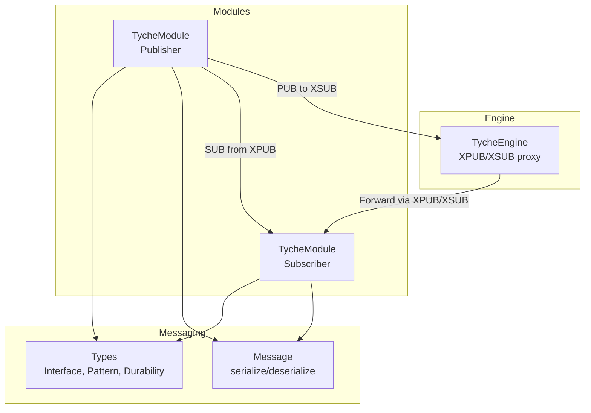
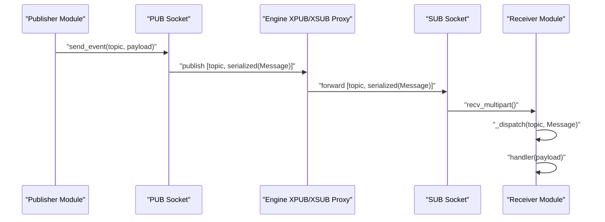
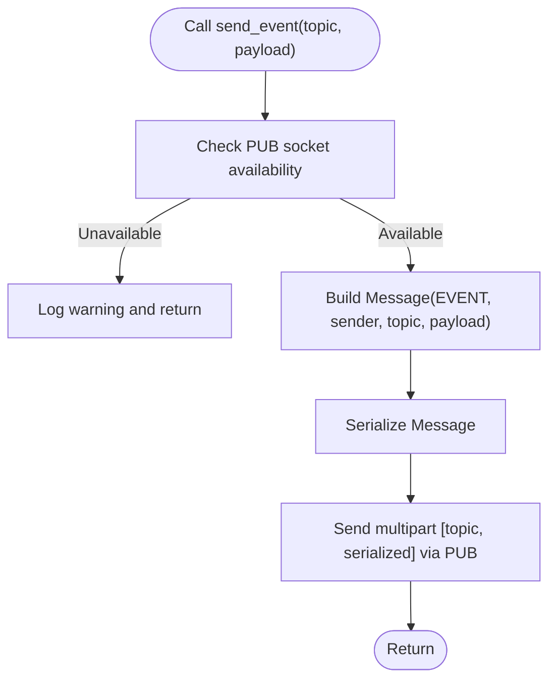
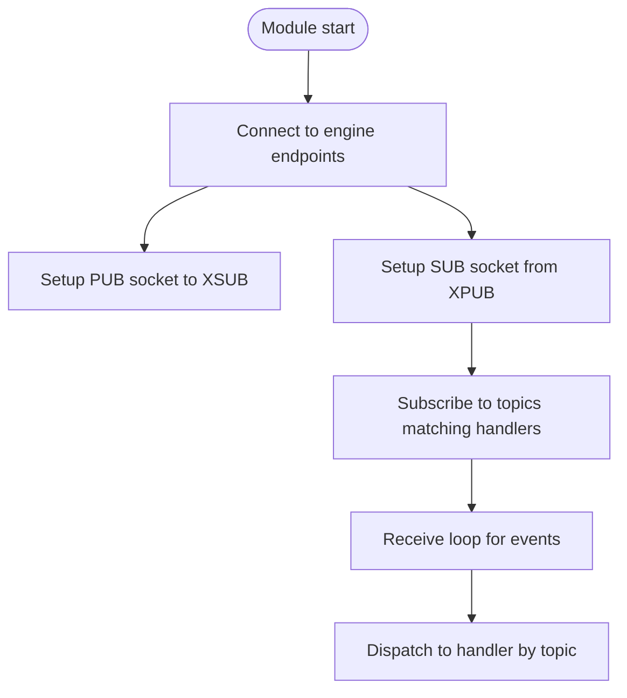
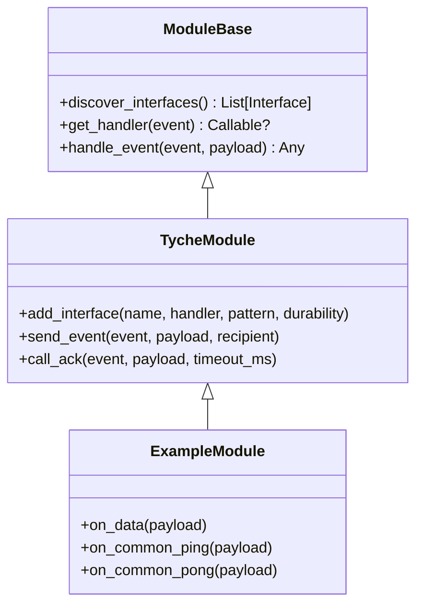
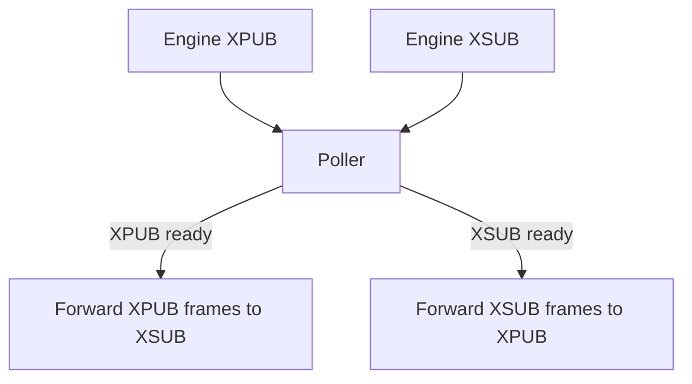
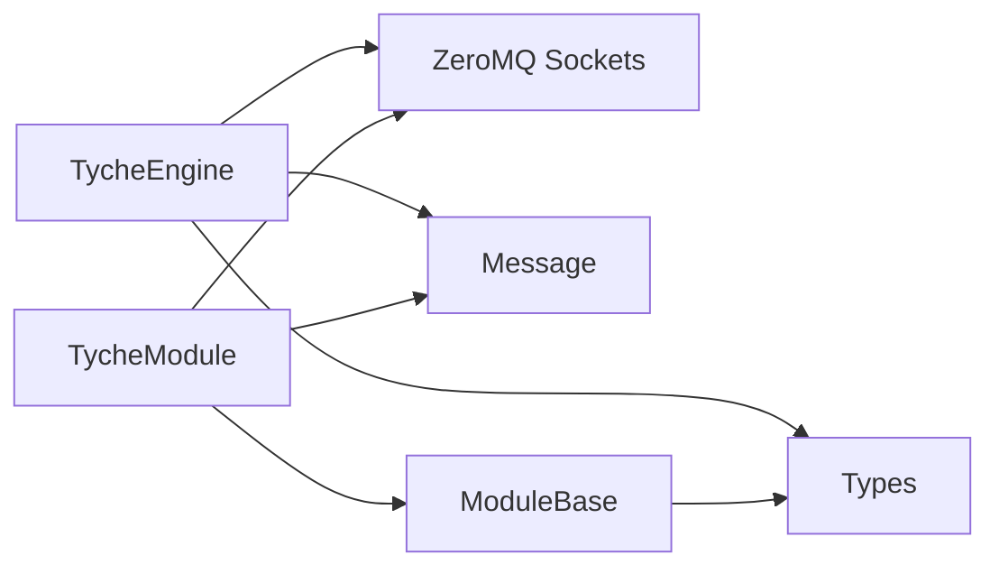

# Fire-and-Forget Events (on_*) 

**Referenced Files in This Document**
- [engine.py](file://src/tyche/engine.py)
- [module.py](file://src/tyche/module.py)
- [module_base.py](file://src/tyche/module_base.py)
- [message.py](file://src/tyche/message.py)
- [types.py](file://src/tyche/types.py)
- [example_module.py](file://src/tyche/example_module.py)
- [run_engine.py](file://examples/run_engine.py)
- [run_module.py](file://examples/run_module.py)
- [test_engine_module.py](file://tests/integration/test_engine_module.py)

## Table of Contents
1. [Introduction](#introduction)
2. [Project Structure](#project-structure)
3. [Core Components](#core-components)
4. [Architecture Overview](#architecture-overview)
5. [Detailed Component Analysis](#detailed-component-analysis)
6. [Dependency Analysis](#dependency-analysis)
7. [Performance Considerations](#performance-considerations)
8. [Troubleshooting Guide](#troubleshooting-guide)
9. [Conclusion](#conclusion)

## Introduction
This document explains Tyche Engine’s fire-and-forget event pattern using the on_* naming convention. Modules publish events without expecting acknowledgments. The system uses a PUB/SUB socket architecture with an XPUB/XSUB proxy to route events from publishers to subscribers. We cover how to define event handlers, configure durability levels, and understand delivery guarantees. Practical examples demonstrate event creation, payload structure, and handler registration.

## Project Structure
Tyche Engine organizes event-related functionality across several modules:
- Engine: central broker managing registration, event proxy, and heartbeats
- Module: client-side module with event publishing and subscription
- ModuleBase: auto-discovery of on_* handlers and basic event routing
- Message: serialization/deserialization of events and payloads
- Types: enums and dataclasses for interfaces, patterns, and durability
- Examples: runnable demonstrations of engine and module usage

**Diagram sources**
- [engine.py:238-277](file://src/tyche/engine.py#L238-L277)
- [module.py:138-177](file://src/tyche/module.py#L138-L177)
- [message.py:69-111](file://src/tyche/message.py#L69-L111)
- [types.py:86-102](file://src/tyche/types.py#L86-L102)

**Section sources**
- [engine.py:25-117](file://src/tyche/engine.py#L25-L117)
- [module.py:28-126](file://src/tyche/module.py#L28-L126)
- [module_base.py:10-46](file://src/tyche/module_base.py#L10-L46)
- [message.py:13-35](file://src/tyche/message.py#L13-L35)
- [types.py:51-102](file://src/tyche/types.py#L51-L102)

## Core Components
- TycheEngine: runs the broker, manages registration, heartbeats, and the XPUB/XSUB proxy for event routing
- TycheModule: connects to the engine, registers interfaces, publishes events via PUB to XSUB, subscribes via SUB from XPUB
- ModuleBase: auto-discovers on_* handlers and routes events to them
- Message: serializes/deserializes events and payloads using MessagePack
- Types: defines InterfacePattern.ON, DurabilityLevel, and related structures

Key responsibilities:
- Event publishing: TycheModule.send_event() builds a Message and sends it to the engine’s XSUB via a PUB socket
- Event subscription: TycheModule subscribes to topics matching handler names and dispatches to handlers
- Event routing: TycheEngine’s _event_proxy_worker() forwards messages between XPUB and XSUB

**Section sources**
- [engine.py:238-277](file://src/tyche/engine.py#L238-L277)
- [module.py:283-329](file://src/tyche/module.py#L283-L329)
- [module_base.py:48-84](file://src/tyche/module_base.py#L48-L84)
- [message.py:69-111](file://src/tyche/message.py#L69-L111)
- [types.py:51-65](file://src/tyche/types.py#L51-L65)

## Architecture Overview
Tyche Engine implements a classic publisher-subscriber model with ZeroMQ:
- Publishers (modules) connect to the engine’s event_sub_endpoint (XSUB) using PUB sockets
- Subscribers (modules) connect to the engine’s event_endpoint (XPUB) using SUB sockets
- The engine’s XPUB/XSUB proxy forwards messages bidirectionally between XSUB and XPUB
- Handlers are auto-discovered by method names prefixed with on_

**Diagram sources**
- [module.py:301-329](file://src/tyche/module.py#L301-L329)
- [engine.py:238-277](file://src/tyche/engine.py#L238-L277)
- [module.py:283-297](file://src/tyche/module.py#L283-L297)

**Section sources**
- [engine.py:51-54](file://src/tyche/engine.py#L51-L54)
- [module.py:138-151](file://src/tyche/module.py#L138-L151)
- [module.py:258-264](file://src/tyche/module.py#L258-L264)

## Detailed Component Analysis

### Event Publishing Mechanism (send_event)
- Purpose: Publish an event to the engine’s event bus without expecting an acknowledgment
- Implementation:
  - Build a Message with msg_type EVENT, sender, event name, and payload
  - Serialize the Message
  - Send multipart frames: [topic_bytes, serialized_message] via PUB to XSUB
- Behavior:
  - Fire-and-forget: no reply expected
  - Topic-based routing: subscribers must have subscribed to the topic

**Diagram sources**
- [module.py:301-329](file://src/tyche/module.py#L301-L329)
- [message.py:69-88](file://src/tyche/message.py#L69-L88)

**Section sources**
- [module.py:301-329](file://src/tyche/module.py#L301-L329)
- [message.py:69-88](file://src/tyche/message.py#L69-L88)

### Automatic Subscription Handling
- Purpose: Automatically subscribe to topics matching registered on_* handlers
- Implementation:
  - On startup, TycheModule connects to engine endpoints and subscribes to topics derived from handler names
  - SUBSCRIBE is set for each handler topic
- Behavior:
  - Load-balanced delivery for on_* handlers
  - Best-effort delivery without guaranteed ordering across modules

**Diagram sources**
- [module.py:138-177](file://src/tyche/module.py#L138-L177)
- [module.py:258-264](file://src/tyche/module.py#L258-L264)
- [module.py:265-297](file://src/tyche/module.py#L265-L297)

**Section sources**
- [module.py:138-177](file://src/tyche/module.py#L138-L177)
- [module.py:258-264](file://src/tyche/module.py#L258-L264)
- [module.py:265-297](file://src/tyche/module.py#L265-L297)

### Event Handler Definition and Discovery
- Naming convention: on_{event} for fire-and-forget handlers
- Auto-discovery: ModuleBase discovers methods starting with on_ and registers them as InterfacePattern.ON
- Handler signature: on_{event}(payload: Dict[str, Any]) -> None
- Routing: Incoming events are dispatched to the handler whose topic equals the event name

**Diagram sources**
- [module_base.py:48-84](file://src/tyche/module_base.py#L48-L84)
- [module.py:87-110](file://src/tyche/module.py#L87-L110)
- [example_module.py:19-79](file://src/tyche/example_module.py#L19-L79)

**Section sources**
- [module_base.py:48-84](file://src/tyche/module_base.py#L48-L84)
- [module.py:87-110](file://src/tyche/module.py#L87-L110)
- [example_module.py:80-122](file://src/tyche/example_module.py#L80-L122)

### Event Routing Through XPUB/XSUB Proxy
- Purpose: Forward messages between publishers and subscribers transparently
- Implementation:
  - Engine binds XPUB to event_endpoint and XSUB to event_sub_endpoint
  - Proxy polls both sockets and forwards multipart frames
- Behavior:
  - Bidirectional forwarding
  - No message filtering or transformation by the proxy

**Diagram sources**
- [engine.py:238-277](file://src/tyche/engine.py#L238-L277)

**Section sources**
- [engine.py:238-277](file://src/tyche/engine.py#L238-L277)

### Practical Examples

#### Example: Defining an on_* Handler
- Define a method named on_{event} in your module class
- The method receives a payload dictionary and returns None (no acknowledgment)
- The method is automatically discovered and registered as an InterfacePattern.ON

References:
- [module_base.py:48-84](file://src/tyche/module_base.py#L48-L84)
- [example_module.py:80-86](file://src/tyche/example_module.py#L80-L86)

#### Example: Publishing an Event
- Call send_event(topic, payload) from a TycheModule instance
- The engine’s proxy forwards the event to all subscribers

References:
- [module.py:301-329](file://src/tyche/module.py#L301-L329)
- [engine.py:238-277](file://src/tyche/engine.py#L238-L277)

#### Example: Running Engine and Module
- Start the engine with separate endpoints for registration, events, and heartbeats
- Start a module that auto-discovers on_* handlers and subscribes to topics

References:
- [run_engine.py:27-32](file://examples/run_engine.py#L27-L32)
- [run_module.py:28-31](file://examples/run_module.py#L28-L31)

#### Example: Integration Test Demonstrating Event Pub/Sub
- A test module registers an on_test_event handler
- Another module publishes on_test_event via send_event
- The proxy delivers the event to the subscriber

References:
- [test_engine_module.py:43-81](file://tests/integration/test_engine_module.py#L43-L81)

## Dependency Analysis
- TycheEngine depends on:
  - ZeroMQ sockets for registration, heartbeats, and event proxy
  - Message serialization for event payloads
  - Types for interface definitions and durability levels
- TycheModule depends on:
  - ZeroMQ sockets for PUB/SUB connections
  - Message serialization for event payloads
  - ModuleBase for handler discovery and routing
- ModuleBase depends on:
  - Types for interface patterns and durability defaults

**Diagram sources**
- [engine.py:8-20](file://src/tyche/engine.py#L8-L20)
- [module.py:13-23](file://src/tyche/module.py#L13-L23)
- [module_base.py:7](file://src/tyche/module_base.py#L7)

**Section sources**
- [engine.py:8-20](file://src/tyche/engine.py#L8-L20)
- [module.py:13-23](file://src/tyche/module.py#L13-L23)
- [module_base.py:7](file://src/tyche/module_base.py#L7)

## Performance Considerations
- Fire-and-forget nature:
  - No acknowledgment overhead improves throughput
  - Publisher does not block waiting for replies
- Socket architecture:
  - PUB/SUB fan-out distributes events to all subscribers
  - XPUB/XSUB proxy is lightweight and efficient
- Durability:
  - Default durability for on_* handlers is ASYNC_FLUSH
  - Lower latency compared to synchronous flush
- Back-pressure:
  - SUB sockets can drop messages if not consumed quickly
  - Design handlers to be fast and idempotent

[No sources needed since this section provides general guidance]

## Troubleshooting Guide
Common issues and resolutions:
- Handler not invoked:
  - Ensure the method name starts with on_ and matches the event topic
  - Verify the module subscribed to the topic during startup
- Events not delivered:
  - Confirm the engine proxy is running and both XPUB and XSUB are bound
  - Check that the publisher’s PUB socket is connected to the correct XSUB endpoint
- Serialization errors:
  - Ensure payload contains serializable data types
  - Use supported types or custom encoders/decoders

**Section sources**
- [module_base.py:48-84](file://src/tyche/module_base.py#L48-L84)
- [module.py:258-264](file://src/tyche/module.py#L258-L264)
- [engine.py:238-277](file://src/tyche/engine.py#L238-L277)
- [message.py:69-111](file://src/tyche/message.py#L69-L111)

## Conclusion
Tyche Engine’s on_* fire-and-forget event pattern enables high-throughput, asynchronous communication. Modules publish events without acknowledgments, relying on the engine’s XPUB/XSUB proxy for routing. Handlers are auto-discovered by naming convention, and durability defaults favor performance. Use this pattern for notifications, telemetry, and broadcast scenarios where eventual delivery is acceptable.