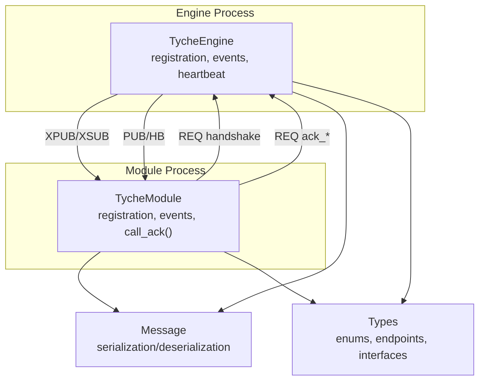
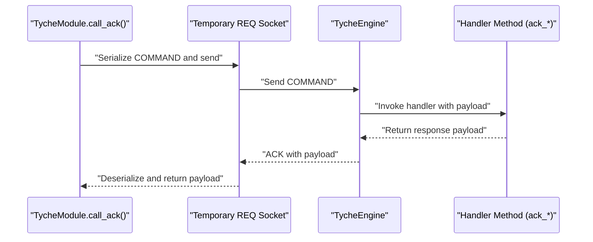
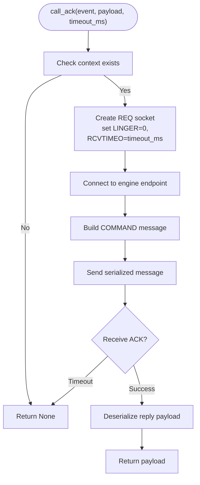
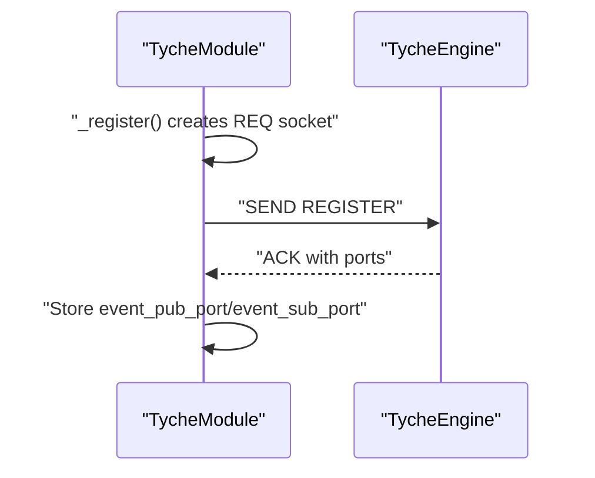
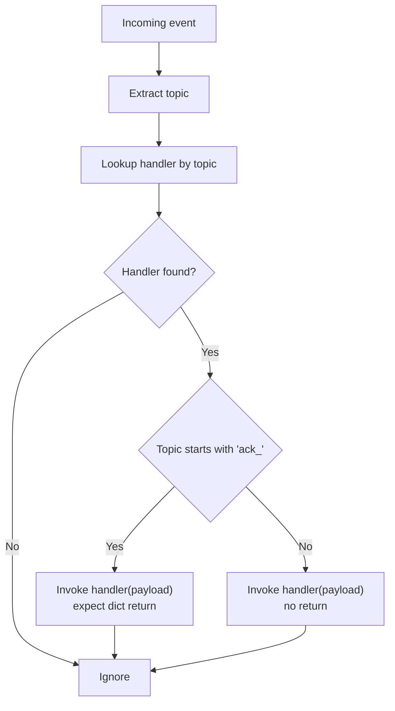
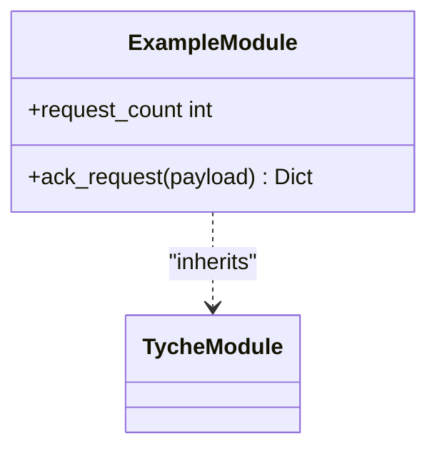
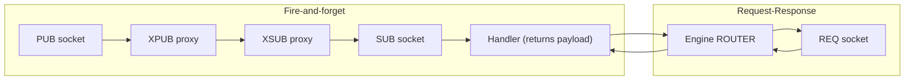
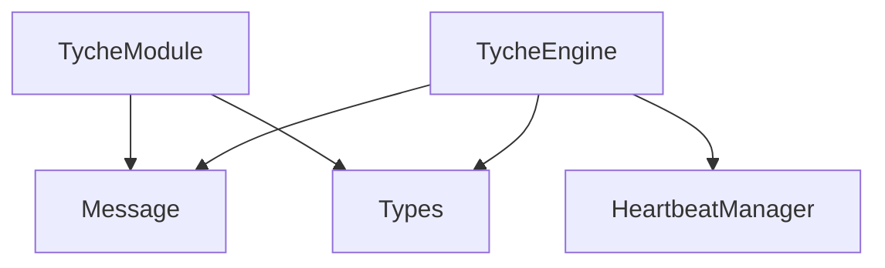

# Request-Response (ack_*) 

<cite>
**Referenced Files in This Document**
- [engine.py](file://src/tyche/engine.py)
- [module.py](file://src/tyche/module.py)
- [message.py](file://src/tyche/message.py)
- [types.py](file://src/tyche/types.py)
- [module_base.py](file://src/tyche/module_base.py)
- [example_module.py](file://src/tyche/example_module.py)
- [run_engine.py](file://examples/run_engine.py)
- [run_module.py](file://examples/run_module.py)
- [test_engine_threading.py](file://tests/unit/test_engine_threading.py)
- [test_example_module.py](file://tests/unit/test_example_module.py)
</cite>

## Table of Contents
1. [Introduction](#introduction)
2. [Project Structure](#project-structure)
3. [Core Components](#core-components)
4. [Architecture Overview](#architecture-overview)
5. [Detailed Component Analysis](#detailed-component-analysis)
6. [Dependency Analysis](#dependency-analysis)
7. [Performance Considerations](#performance-considerations)
8. [Troubleshooting Guide](#troubleshooting-guide)
9. [Conclusion](#conclusion)

## Introduction
This document explains Tyche Engine’s request-response communication pattern using ack_* interfaces. It focuses on:
- How modules send synchronous commands via temporary REQ sockets
- How engines route and process commands to handlers
- The call_ack() method implementation, timeouts, and response processing
- Differences from fire-and-forget event patterns
- Best practices for robust request-response design

## Project Structure
Tyche Engine separates concerns across modules:
- Engine: central broker managing registration, event routing, and heartbeat monitoring
- Module: client-side component that registers, publishes events, and performs request-response
- Message: serialization/deserialization of typed messages
- Types: enums and dataclasses for message types and endpoints
- Example Module: demonstrates ack_* handler behavior and usage patterns

**Diagram sources**
- [engine.py:25-117](file://src/tyche/engine.py#L25-L117)
- [module.py:28-196](file://src/tyche/module.py#L28-L196)
- [message.py:13-111](file://src/tyche/message.py#L13-L111)
- [types.py:41-102](file://src/tyche/types.py#L41-L102)

**Section sources**
- [engine.py:25-117](file://src/tyche/engine.py#L25-L117)
- [module.py:28-196](file://src/tyche/module.py#L28-L196)
- [message.py:13-111](file://src/tyche/message.py#L13-L111)
- [types.py:41-102](file://src/tyche/types.py#L41-L102)

## Core Components
- TycheEngine: manages registration, event proxy, heartbeats, and module lifecycle
- TycheModule: connects to engine, registers interfaces, handles events, and performs request-response via call_ack()
- Message: typed message container with serialization helpers
- Types: defines message types, interface patterns, durability levels, and endpoints
- ExampleModule: demonstrates ack_* handler behavior

Key responsibilities:
- Registration uses REQ/ROUTER for a one-shot handshake
- Event distribution uses XPUB/XSUB proxy
- Heartbeats use DEALER/PUB for liveness monitoring
- Request-response uses temporary REQ sockets for commands

**Section sources**
- [engine.py:25-117](file://src/tyche/engine.py#L25-L117)
- [module.py:28-196](file://src/tyche/module.py#L28-L196)
- [message.py:13-111](file://src/tyche/message.py#L13-L111)
- [types.py:41-102](file://src/tyche/types.py#L41-L102)
- [example_module.py:19-100](file://src/tyche/example_module.py#L19-L100)

## Architecture Overview
The request-response architecture differs from fire-and-forget events:
- Fire-and-forget: SUBSCRIBE to topics and dispatch handlers without expecting replies
- Ack_* request-response: Send a COMMAND via a temporary REQ socket and wait for a reply

**Diagram sources**
- [module.py:331-372](file://src/tyche/module.py#L331-L372)
- [engine.py:144-176](file://src/tyche/engine.py#L144-L176)
- [module_base.py:100-119](file://src/tyche/module_base.py#L100-L119)

## Detailed Component Analysis

### TycheModule.call_ack(): Command Processing Workflow
call_ack() implements a synchronous request-response cycle:
- Creates a temporary REQ socket per call
- Sets RCVTIMEO for timeout handling
- Sends a COMMAND message to the engine
- Waits for an ACK reply containing the handler’s response payload
- Returns the payload or None on timeout

**Diagram sources**
- [module.py:331-372](file://src/tyche/module.py#L331-L372)

**Section sources**
- [module.py:331-372](file://src/tyche/module.py#L331-L372)

### Registration and Interface Discovery
- Registration uses a one-shot REQ socket to send REGISTER and receive ACK
- Interfaces are auto-discovered by method naming; ack_* indicates a handler that must return a response

**Diagram sources**
- [module.py:200-254](file://src/tyche/module.py#L200-L254)
- [engine.py:144-176](file://src/tyche/engine.py#L144-L176)

**Section sources**
- [module.py:200-254](file://src/tyche/module.py#L200-L254)
- [module_base.py:100-119](file://src/tyche/module_base.py#L100-L119)

### Handler Dispatch and ack_* Pattern
- Handlers are discovered by method names; ack_* handlers must return a dictionary payload
- The dispatcher routes messages to handlers and invokes them accordingly

**Diagram sources**
- [module.py:283-297](file://src/tyche/module.py#L283-L297)
- [module_base.py:100-119](file://src/tyche/module_base.py#L100-L119)

**Section sources**
- [module.py:283-297](file://src/tyche/module.py#L283-L297)
- [module_base.py:100-119](file://src/tyche/module_base.py#L100-L119)

### Example: Implementing an ack_* Handler
The ExampleModule demonstrates an ack_* handler that returns a structured response:
- Increments a request counter
- Returns status, request_id, module_id, and count

**Diagram sources**
- [example_module.py:87-100](file://src/tyche/example_module.py#L87-L100)
- [example_module.py:19-100](file://src/tyche/example_module.py#L19-L100)

**Section sources**
- [example_module.py:87-100](file://src/tyche/example_module.py#L87-L100)

### Socket Architecture Differences: REQ vs Events
- Fire-and-forget events: PUB/SUB over XPUB/XSUB proxy; handlers do not return values
- Ack_* request-response: Temporary REQ socket per call; handlers must return a payload

**Diagram sources**
- [module.py:138-151](file://src/tyche/module.py#L138-L151)
- [engine.py:238-277](file://src/tyche/engine.py#L238-L277)
- [module.py:331-372](file://src/tyche/module.py#L331-L372)

**Section sources**
- [module.py:138-151](file://src/tyche/module.py#L138-L151)
- [engine.py:238-277](file://src/tyche/engine.py#L238-L277)
- [module.py:331-372](file://src/tyche/module.py#L331-L372)

## Dependency Analysis
- TycheModule depends on Message serialization and Endpoint configuration
- TycheEngine depends on Message and HeartbeatManager for liveness
- Both depend on Types for enums and dataclasses

**Diagram sources**
- [module.py:13-23](file://src/tyche/module.py#L13-L23)
- [engine.py:10-20](file://src/tyche/engine.py#L10-L20)
- [message.py:13-111](file://src/tyche/message.py#L13-L111)
- [types.py:41-102](file://src/tyche/types.py#L41-L102)

**Section sources**
- [module.py:13-23](file://src/tyche/module.py#L13-L23)
- [engine.py:10-20](file://src/tyche/engine.py#L10-L20)
- [message.py:13-111](file://src/tyche/message.py#L13-L111)
- [types.py:41-102](file://src/tyche/types.py#L41-L102)

## Performance Considerations
- Temporary REQ sockets: Each call creates and destroys a socket; keep calls short and infrequent to minimize overhead
- Timeouts: Tune RCVTIMEO based on expected latency and reliability requirements
- Serialization: MessagePack is efficient; avoid large payloads in ack_* responses
- Concurrency: Use separate threads/processes for engine and modules; avoid blocking the event stream

## Troubleshooting Guide
Common issues and resolutions:
- Registration timeout: Verify engine is running and endpoints are reachable; check RCVTIMEO on the registration socket
- Handler not found: Ensure method name follows the ack_* pattern and is discoverable
- Timeout on call_ack(): Increase timeout or investigate engine responsiveness; confirm handler returns a payload
- Heartbeat liveness: If modules disappear, check heartbeat endpoints and intervals

Validation references:
- Registration and interface discovery tests demonstrate expected behavior
- Example module ack_* handler tests validate return values

**Section sources**
- [test_engine_threading.py:80-119](file://tests/unit/test_engine_threading.py#L80-L119)
- [test_example_module.py:39-64](file://tests/unit/test_example_module.py#L39-L64)

## Conclusion
Tyche Engine’s ack_* request-response pattern enables synchronous, reliable command invocation using temporary REQ sockets. By separating concerns between fire-and-forget events and request-response commands, the system supports robust, scalable inter-module communication. Follow the patterns outlined here to implement handlers, manage timeouts, and design resilient interfaces.