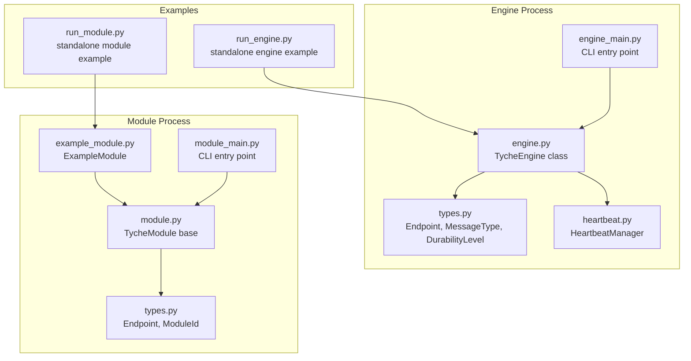
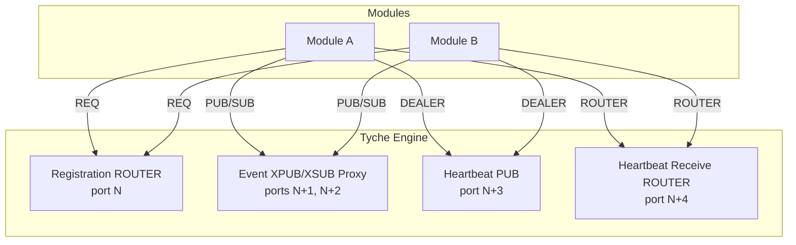
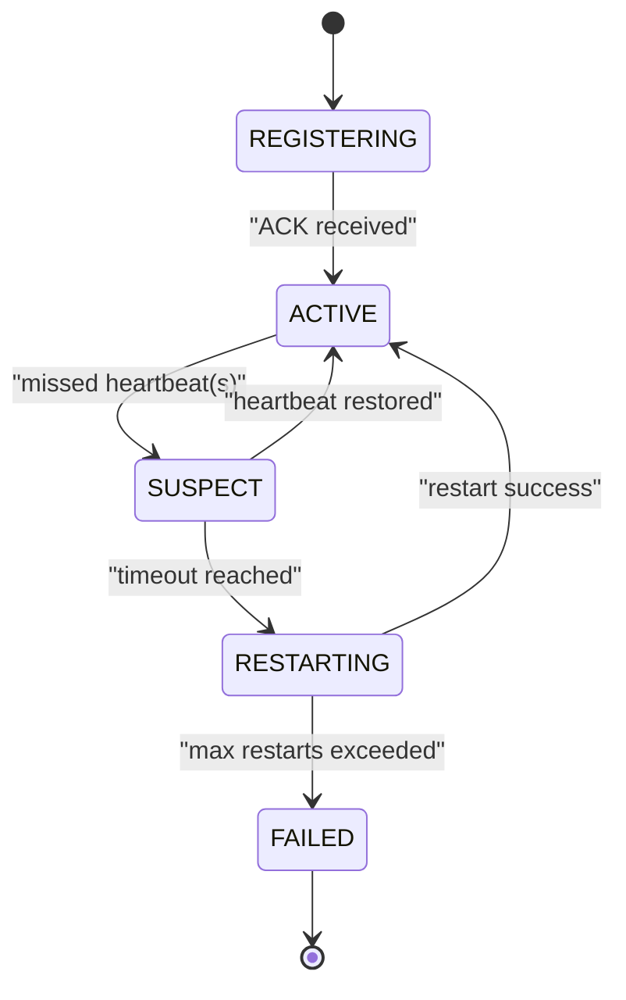
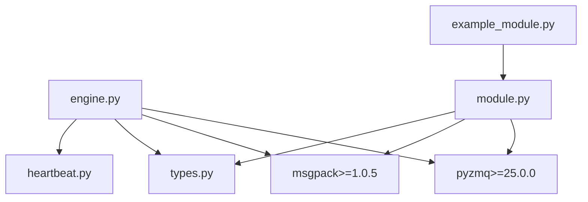

# Configuration and Deployment

<cite>
**Referenced Files in This Document**
- [README.md](file://README.md)
- [engine.py](file://src/tyche/engine.py)
- [engine_main.py](file://src/tyche/engine_main.py)
- [module.py](file://src/tyche/module.py)
- [module_main.py](file://src/tyche/module_main.py)
- [types.py](file://src/tyche/types.py)
- [heartbeat.py](file://src/tyche/heartbeat.py)
- [example_module.py](file://src/tyche/example_module.py)
- [run_engine.py](file://examples/run_engine.py)
- [run_module.py](file://examples/run_module.py)
- [pyproject.toml](file://pyproject.toml)
</cite>

## Table of Contents
1. [Introduction](#introduction)
2. [Project Structure](#project-structure)
3. [Core Components](#core-components)
4. [Architecture Overview](#architecture-overview)
5. [Detailed Component Analysis](#detailed-component-analysis)
6. [Dependency Analysis](#dependency-analysis)
7. [Performance Considerations](#performance-considerations)
8. [Troubleshooting Guide](#troubleshooting-guide)
9. [Conclusion](#conclusion)
10. [Appendices](#appendices)

## Introduction
This document provides comprehensive guidance for configuring and deploying Tyche Engine across single-instance, clustered, and distributed environments. It covers endpoint configuration, socket binding, transport selection, multi-process deployment patterns, engine clustering using the Binary Star pattern, module configuration options (CPU binding, heartbeat settings, timeouts, restart limits), deployment topologies, configuration examples, environment variable usage, command-line arguments, scaling strategies, resource allocation, and operational monitoring setup.

## Project Structure
Tyche Engine is organized around a central broker (TycheEngine) and pluggable modules. The runtime entry points for the engine and example module demonstrate command-line configuration and process orchestration. Core types define endpoints, message types, and heartbeat constants. Heartbeat management implements the Paranoid Pirate pattern for liveness detection.

**Diagram sources**
- [engine_main.py:13-48](file://src/tyche/engine_main.py#L13-L48)
- [engine.py:25-118](file://src/tyche/engine.py#L25-L118)
- [types.py:76-102](file://src/tyche/types.py#L76-L102)
- [heartbeat.py:91-142](file://src/tyche/heartbeat.py#L91-L142)
- [module_main.py:13-42](file://src/tyche/module_main.py#L13-L42)
- [module.py:28-197](file://src/tyche/module.py#L28-L197)
- [example_module.py:19-70](file://src/tyche/example_module.py#L19-L70)
- [run_engine.py:21-47](file://examples/run_engine.py#L21-L47)
- [run_module.py:22-46](file://examples/run_module.py#L22-L46)

**Section sources**
- [engine_main.py:13-48](file://src/tyche/engine_main.py#L13-L48)
- [module_main.py:13-42](file://src/tyche/module_main.py#L13-L42)
- [types.py:76-102](file://src/tyche/types.py#L76-L102)
- [heartbeat.py:91-142](file://src/tyche/heartbeat.py#L91-L142)
- [engine.py:25-118](file://src/tyche/engine.py#L25-L118)
- [module.py:28-197](file://src/tyche/module.py#L28-L197)
- [example_module.py:19-70](file://src/tyche/example_module.py#L19-L70)
- [run_engine.py:21-47](file://examples/run_engine.py#L21-L47)
- [run_module.py:22-46](file://examples/run_module.py#L22-L46)

## Core Components
- TycheEngine: Central broker providing module registration, event routing via XPUB/XSUB proxy, heartbeat broadcasting, and liveness monitoring.
- TycheModule: Base class for modules, handling registration, event publishing/subscribing, ACK requests, and heartbeat transmission.
- HeartbeatManager: Tracks peer liveness using the Paranoid Pirate pattern with configurable intervals and liveness thresholds.
- Types: Define Endpoint, MessageType, DurabilityLevel, InterfacePattern, and ModuleId, plus heartbeat constants.

Key configuration surfaces:
- Command-line arguments for engine and module processes.
- Endpoint configuration (host, ports) for registration, event, heartbeat, and heartbeat receive sockets.
- Heartbeat interval and liveness thresholds.
- Interface durability levels for event delivery guarantees.

**Section sources**
- [engine.py:25-118](file://src/tyche/engine.py#L25-L118)
- [module.py:28-197](file://src/tyche/module.py#L28-L197)
- [heartbeat.py:91-142](file://src/tyche/heartbeat.py#L91-L142)
- [types.py:76-102](file://src/tyche/types.py#L76-L102)
- [engine_main.py:14-25](file://src/tyche/engine_main.py#L14-L25)
- [module_main.py:14-22](file://src/tyche/module_main.py#L14-L22)

## Architecture Overview
Tyche Engine uses ZeroMQ for transport-independent messaging. The engine exposes distinct endpoints for registration (ROUTER), event distribution (XPUB/XSUB), and heartbeats (PUB/SUB). Modules connect to the engine using REQ for registration, PUB/SUB for event exchange, and DEALER for heartbeats.

**Diagram sources**
- [engine.py:34-54](file://src/tyche/engine.py#L34-L54)
- [engine.py:121-143](file://src/tyche/engine.py#L121-L143)
- [engine.py:238-277](file://src/tyche/engine.py#L238-L277)
- [engine.py:281-305](file://src/tyche/engine.py#L281-L305)
- [engine.py:307-339](file://src/tyche/engine.py#L307-L339)
- [module.py:200-254](file://src/tyche/module.py#L200-L254)
- [module.py:133-178](file://src/tyche/module.py#L133-L178)
- [module.py:376-401](file://src/tyche/module.py#L376-L401)

**Section sources**
- [README.md:26-43](file://README.md#L26-L43)
- [engine.py:34-54](file://src/tyche/engine.py#L34-L54)
- [module.py:200-254](file://src/tyche/module.py#L200-L254)

## Detailed Component Analysis

### Engine Endpoint Configuration and Socket Binding
- Registration endpoint: ROUTER socket bound to host/port for module handshake.
- Event endpoints: XPUB bound to one port and XSUB bound to a consecutive port for bidirectional proxying.
- Heartbeat endpoints: PUB bound to one port and ROUTER bound to a consecutive port for receiving module heartbeats.
- Acknowledgment endpoint: Optional endpoint derived from event port offset.

Command-line arguments:
- Host binding and ports for registration, event, heartbeat, and heartbeat receive.

Operational notes:
- Engine binds ROUTER and PUB sockets and starts polling threads for registration, event proxy, and heartbeat receive.
- Heartbeat worker publishes periodic heartbeats; monitor worker periodically checks liveness and unregisters expired modules.

**Section sources**
- [engine.py:34-54](file://src/tyche/engine.py#L34-L54)
- [engine.py:67-118](file://src/tyche/engine.py#L67-L118)
- [engine.py:121-143](file://src/tyche/engine.py#L121-L143)
- [engine.py:238-277](file://src/tyche/engine.py#L238-L277)
- [engine.py:281-305](file://src/tyche/engine.py#L281-L305)
- [engine.py:307-339](file://src/tyche/engine.py#L307-L339)
- [engine_main.py:14-25](file://src/tyche/engine_main.py#L14-L25)

### Transport Selection (inproc, ipc, tcp)
- Current implementation uses tcp://host:port endpoints defined by the Endpoint dataclass.
- Transport independence is supported by ZeroMQ; switching to inproc or ipc requires changing Endpoint string representation accordingly.

Practical guidance:
- Use tcp for multi-host deployments.
- Use ipc for intra-host inter-process communication.
- Use inproc for embedding the engine within the same process (requires adapting Endpoint construction).

**Section sources**
- [types.py:76-84](file://src/tyche/types.py#L76-L84)
- [engine.py:124-128](file://src/tyche/engine.py#L124-L128)
- [engine.py:253-254](file://src/tyche/engine.py#L253-L254)
- [engine.py:313-314](file://src/tyche/engine.py#L313-L314)

### Module Configuration Options
- Module ID generation: Deity-based naming scheme with auto-generated suffix.
- Interface patterns: on_, ack_, whisper_, on_common_, broadcast_.
- Durability levels: BEST_EFFORT, ASYNC_FLUSH, SYNC_FLUSH.
- Heartbeat interval and liveness thresholds: configurable constants.
- ACK request timeouts: module-side REQ socket receive timeout configurable per call.

Module lifecycle:
- Registration via REQ to engine ROUTER.
- Event subscription via SUB to engine XPUB.
- Heartbeat transmission via DEALER to engine ROUTER.
- Graceful shutdown closes sockets and destroys context.

**Section sources**
- [types.py:14-39](file://src/tyche/types.py#L14-L39)
- [types.py:51-58](file://src/tyche/types.py#L51-L58)
- [types.py:60-65](file://src/tyche/types.py#L60-L65)
- [types.py:10-11](file://src/tyche/types.py#L10-L11)
- [module.py:41-76](file://src/tyche/module.py#L41-L76)
- [module.py:200-254](file://src/tyche/module.py#L200-L254)
- [module.py:258-298](file://src/tyche/module.py#L258-L298)
- [module.py:331-373](file://src/tyche/module.py#L331-L373)
- [module.py:376-401](file://src/tyche/module.py#L376-L401)

### Heartbeat and Failure Handling
- Heartbeat frequency and liveness: configurable constants.
- Paranoid Pirate pattern: engine PUB broadcasts heartbeats; modules send heartbeats to engine ROUTER; monitor tracks liveness and expires peers after threshold.
- Module lifecycle states: REGISTERING → ACTIVE → SUSPECT → RESTARTING → FAILED.

**Diagram sources**
- [README.md:225-247](file://README.md#L225-L247)
- [heartbeat.py:91-142](file://src/tyche/heartbeat.py#L91-L142)

**Section sources**
- [README.md:248-253](file://README.md#L248-L253)
- [heartbeat.py:16-50](file://src/tyche/heartbeat.py#L16-L50)
- [heartbeat.py:91-142](file://src/tyche/heartbeat.py#L91-L142)

### Multi-Process Deployment Patterns and Clustering (Binary Star)
- Multi-instance coordination: Binary Star pattern for primary-backup failover.
- Shared configuration: Distributed consensus or shared storage.
- Message queue state replication: Between primary and backup instances.
- Automatic failover: Clients retry using Lazy Pirate pattern.

Deployment guidance:
- Run two engine instances with coordinated roles (primary/backup).
- Use shared storage for configuration and replicated state.
- Implement automatic promotion of backup to primary on failure.
- Ensure clients retry connections and re-register after failover.

**Section sources**
- [README.md:37-43](file://README.md#L37-L43)

### Command-Line Arguments and Examples
Engine CLI:
- --registration-port, --event-port, --heartbeat-port, --heartbeat-receive-port, --host.

Module CLI:
- --engine-host, --engine-port, --heartbeat-port, --module-id.

Examples:
- Standalone engine and module processes demonstrate endpoint configuration and runtime behavior.

**Section sources**
- [engine_main.py:14-25](file://src/tyche/engine_main.py#L14-L25)
- [module_main.py:14-22](file://src/tyche/module_main.py#L14-L22)
- [run_engine.py:21-47](file://examples/run_engine.py#L21-L47)
- [run_module.py:22-46](file://examples/run_module.py#L22-L46)

### Environment Variables
- No explicit environment variables are defined in the codebase. Configuration is primarily driven by command-line arguments and hard-coded defaults.

Recommendation:
- Introduce environment variables for host and port overrides to enable containerized deployments and platform-specific configuration.

**Section sources**
- [engine_main.py:14-25](file://src/tyche/engine_main.py#L14-L25)
- [module_main.py:14-22](file://src/tyche/module_main.py#L14-L22)

### Deployment Topologies

#### Single Instance
- One engine instance with modules connecting via tcp.
- Use default ports or override via CLI arguments.

#### Clustered Engines (High Availability)
- Two engine instances using Binary Star pattern.
- Primary handles traffic; backup remains on standby.
- Automatic failover on primary failure.

#### Geographic Distribution
- Deploy engine instances per region.
- Use inter-region gossip or external consensus for configuration.
- Route modules to nearest engine instance.

#### Hybrid Cloud
- On-prem engines for low-latency modules.
- Cloud engines for burst capacity.
- Cross-cloud replication for state and configuration.

**Section sources**
- [README.md:37-43](file://README.md#L37-L43)
- [engine_main.py:14-25](file://src/tyche/engine_main.py#L14-L25)
- [module_main.py:14-22](file://src/tyche/module_main.py#L14-L22)

### Scaling Strategies and Resource Allocation
- Horizontal scaling: Add more engine instances and distribute modules.
- Vertical scaling: Increase worker threads and tune ZeroMQ socket options.
- Backpressure handling: Adjust durability levels and buffer sizes.
- CPU binding: Bind modules to specific CPU cores for predictable performance.

**Section sources**
- [README.md:329-340](file://README.md#L329-L340)
- [README.md:51-53](file://README.md#L51-L53)

### Operational Monitoring Setup
- Heartbeat monitoring: Use HeartbeatManager to detect expired modules.
- Logging: Engine and module components log errors and warnings.
- Metrics: Track module counts, event rates, and latency distributions.

**Section sources**
- [engine.py:341-349](file://src/tyche/engine.py#L341-L349)
- [module.py:180-197](file://src/tyche/module.py#L180-L197)

## Dependency Analysis
Tyche Engine depends on PyZMQ for ZeroMQ integration and MessagePack for serialization. The engine and module components share core types and heartbeat management.

**Diagram sources**
- [pyproject.toml:10-13](file://pyproject.toml#L10-L13)
- [engine.py:8-20](file://src/tyche/engine.py#L8-L20)
- [module.py:11-23](file://src/tyche/module.py#L11-L23)
- [types.py:1-102](file://src/tyche/types.py#L1-L102)
- [heartbeat.py:1-14](file://src/tyche/heartbeat.py#L1-L14)
- [example_module.py:15-16](file://src/tyche/example_module.py#L15-L16)

**Section sources**
- [pyproject.toml:10-13](file://pyproject.toml#L10-L13)
- [engine.py:8-20](file://src/tyche/engine.py#L8-L20)
- [module.py:11-23](file://src/tyche/module.py#L11-L23)

## Performance Considerations
- Transport choice affects latency; tcp is suitable for distributed deployments.
- Durability levels impact latency and reliability; ASYNC_FLUSH offers low-latency persistence.
- Backpressure handling modes: drop oldest, block/alert, or expand buffer.
- Recovery time leverages WAL checkpoints for rapid restart.

**Section sources**
- [README.md:197-205](file://README.md#L197-L205)
- [README.md:133-158](file://README.md#L133-L158)

## Troubleshooting Guide
Common issues and resolutions:
- Registration timeout: Verify engine registration endpoint accessibility and network connectivity.
- Heartbeat failures: Check heartbeat interval/liveness configuration and network stability.
- Event delivery gaps: Review durability settings and subscriber capacity.
- Engine shutdown: Ensure graceful stop sequences close sockets and destroy contexts.

**Section sources**
- [module.py:200-254](file://src/tyche/module.py#L200-L254)
- [module.py:376-401](file://src/tyche/module.py#L376-L401)
- [engine.py:106-118](file://src/tyche/engine.py#L106-L118)
- [engine.py:178-197](file://src/tyche/engine.py#L178-L197)

## Conclusion
Tyche Engine provides a flexible, transport-independent framework for building distributed event-driven systems. Configuration centers on endpoint binding, heartbeat tuning, and interface durability. Deployment strategies span single-instance, clustered, geographic, and hybrid cloud topologies. By leveraging the Binary Star pattern for high availability and the Paranoid Pirate pattern for liveness, teams can achieve robust, scalable systems suited to production trading, backtesting, and research workflows.

## Appendices

### Configuration Reference

- Engine CLI arguments:
  - --registration-port: Registration endpoint port (default 5555)
  - --event-port: Event XPUB/XSUB port (default 5556)
  - --heartbeat-port: Heartbeat PUB port (default 5558)
  - --heartbeat-receive-port: Heartbeat receive ROUTER port (default 5559)
  - --host: Host to bind to (default 127.0.0.1)

- Module CLI arguments:
  - --engine-host: Engine registration host (default 127.0.0.1)
  - --engine-port: Engine registration port (default 5555)
  - --heartbeat-port: Heartbeat receive port (default 5559)
  - --module-id: Optional module ID (auto-generated if omitted)

- Endpoint format:
  - tcp://host:port

- Heartbeat constants:
  - Interval: 1.0 seconds
  - Liveness threshold: 3 missed heartbeats

- Durability levels:
  - BEST_EFFORT: No persistence
  - ASYNC_FLUSH: Async write (default)
  - SYNC_FLUSH: Sync write, confirmed

**Section sources**
- [engine_main.py:14-25](file://src/tyche/engine_main.py#L14-L25)
- [module_main.py:14-22](file://src/tyche/module_main.py#L14-L22)
- [types.py:76-84](file://src/tyche/types.py#L76-L84)
- [types.py:10-11](file://src/tyche/types.py#L10-L11)
- [types.py:60-65](file://src/tyche/types.py#L60-L65)