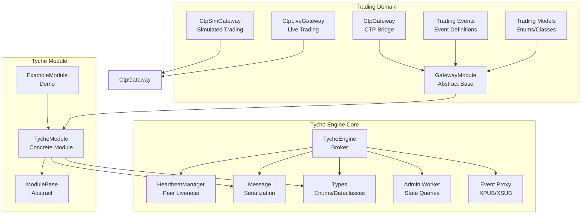
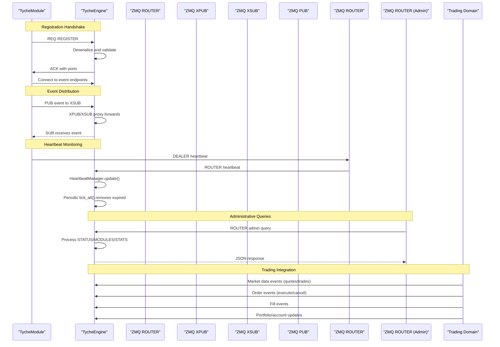
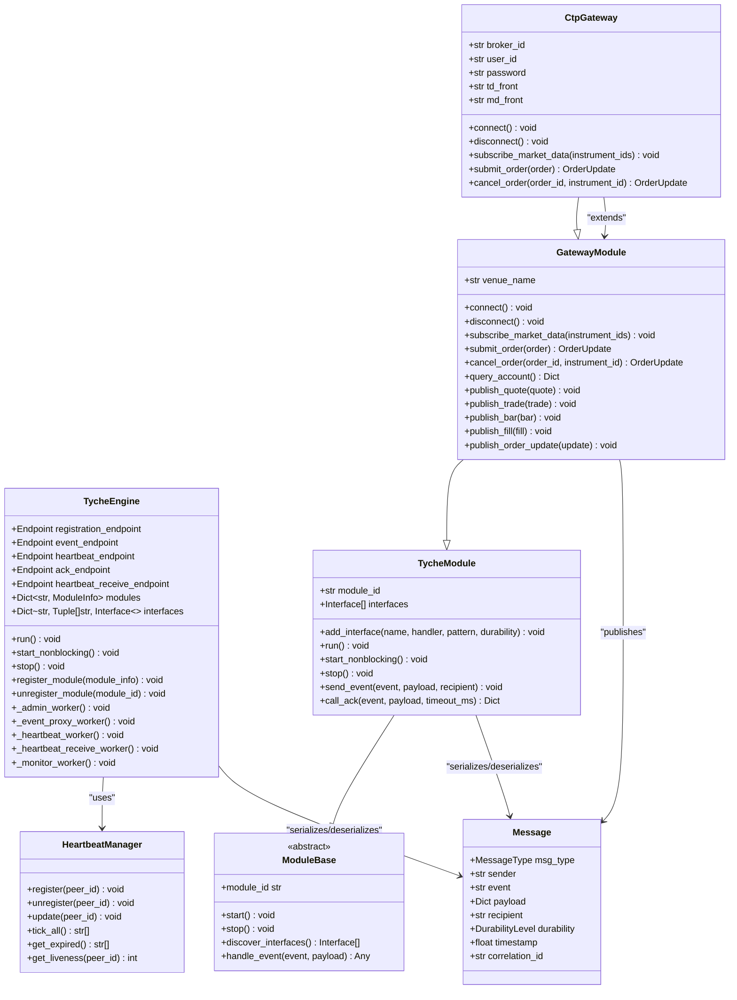
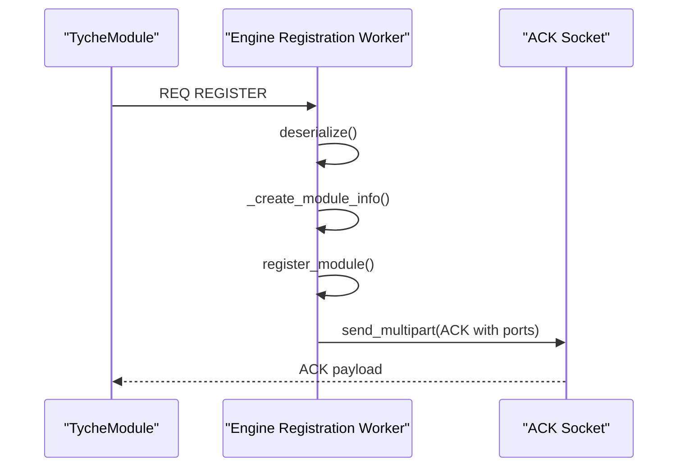
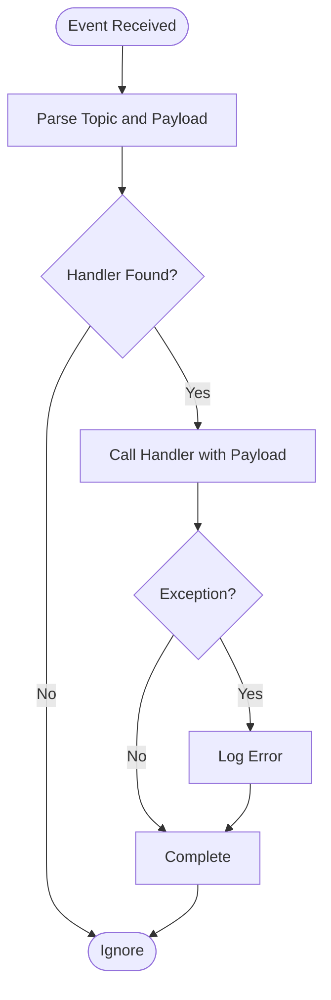
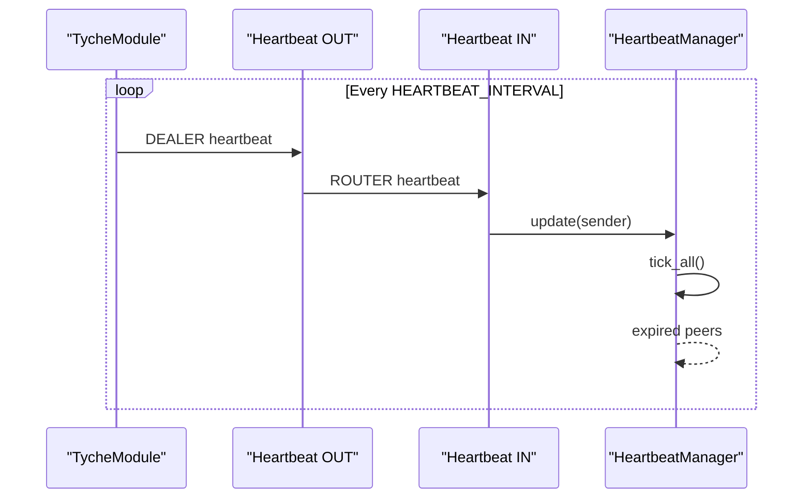
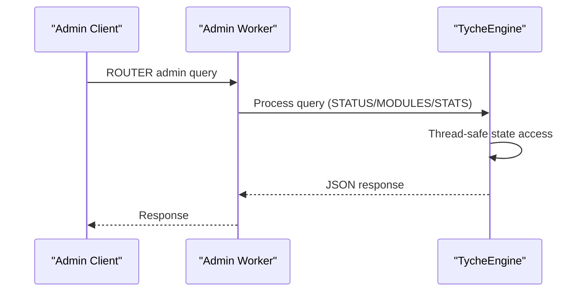
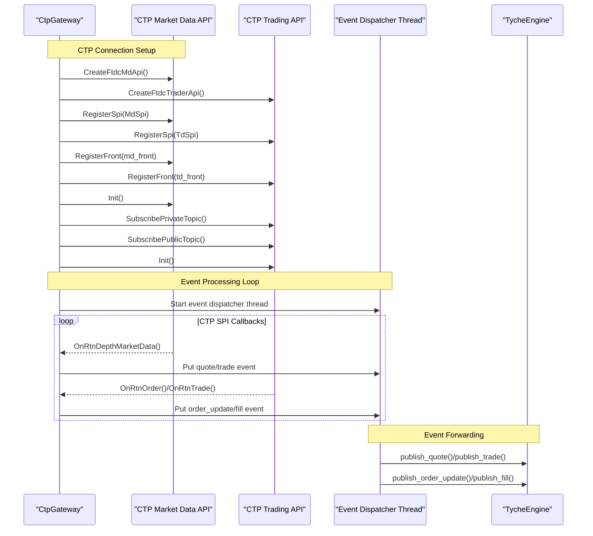
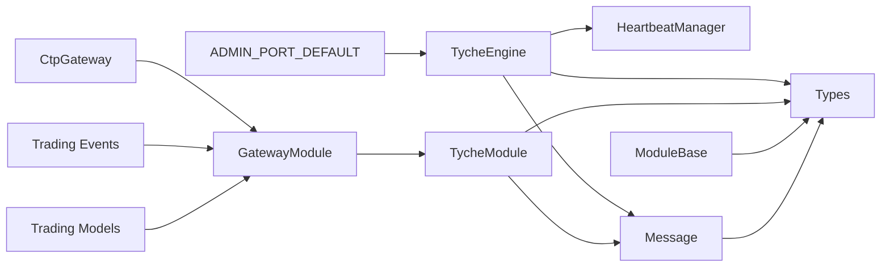

# Core Components

**Referenced Files in This Document**
- [engine.py](file://src/tyche/engine.py)
- [module.py](file://src/tyche/module.py)
- [module_base.py](file://src/tyche/module_base.py)
- [message.py](file://src/tyche/message.py)
- [heartbeat.py](file://src/tyche/heartbeat.py)
- [types.py](file://src/tyche/types.py)
- [example_module.py](file://src/tyche/example_module.py)
- [run_engine.py](file://examples/run_engine.py)
- [run_module.py](file://examples/run_module.py)
- [run_trading_system.py](file://examples/run_trading_system.py)
- [run_ctp_gateway.py](file://examples/run_ctp_gateway.py)
- [trading/__init__.py](file://src/modules/trading/__init__.py)
- [trading/events.py](file://src/modules/trading/events.py)
- [trading/gateway/base.py](file://src/modules/trading/gateway/base.py)
- [trading/gateway/ctp/__init__.py](file://src/modules/trading/gateway/ctp/__init__.py)
- [trading/gateway/ctp/gateway.py](file://src/modules/trading/gateway/ctp/gateway.py)
- [trading/gateway/ctp/live.py](file://src/modules/trading/gateway/ctp/live.py)
- [trading/gateway/ctp/sim.py](file://src/modules/trading/gateway/ctp/sim.py)
- [trading/models/enums.py](file://src/modules/trading/models/enums.py)
- [test_engine.py](file://tests/unit/test_engine.py)
- [test_module.py](file://tests/unit/test_module.py)
- [test_message.py](file://tests/unit/test_message.py)
- [test_heartbeat.py](file://tests/unit/test_heartbeat.py)
- [test_heartbeat_protocol.py](file://tests/unit/test_heartbeat_protocol.py)

## Update Summary
**Changes Made**
- Added comprehensive documentation for the new Enhanced Multi-Asset Trading System
- Integrated CTP gateway module with live and simulated trading capabilities
- Updated module structure to reflect move from tyche.trading.* to modules.trading.*
- Added trading domain components: gateway base classes, event definitions, and trading models
- Enhanced examples demonstrating complete trading system integration
- Updated import paths and module references throughout documentation

## Table of Contents
1. [Introduction](#introduction)
2. [Project Structure](#project-structure)
3. [Core Components](#core-components)
4. [Architecture Overview](#architecture-overview)
5. [Detailed Component Analysis](#detailed-component-analysis)
6. [Trading System Integration](#trading-system-integration)
7. [Dependency Analysis](#dependency-analysis)
8. [Performance Considerations](#performance-considerations)
9. [Troubleshooting Guide](#troubleshooting-guide)
10. [Conclusion](#conclusion)
11. [Appendices](#appendices)

## Introduction
This document explains the core components of Tyche Engine: TycheEngine as the central broker, TycheModule as the base class for distributed modules, the Message system for serialization, HeartbeatManager for peer monitoring, and the type definitions. It covers component responsibilities, relationships, lifecycle management, APIs, parameters, return values, practical usage patterns, configuration options, and error handling strategies.

**Updated** Enhanced with new administrative capabilities, XPUB/XSUB event proxy functionality, thread-safe operations, improved heartbeat management, and comprehensive multi-asset trading system integration including CTP gateway support.

## Project Structure
Tyche Engine organizes its core logic under src/tyche with clear separation of concerns, plus a new modules.trading package for enhanced multi-asset trading capabilities:
- Broker engine: TycheEngine orchestrates registration, event routing, heartbeat monitoring, and administrative queries.
- Module base: ModuleBase defines the interface for modules; TycheModule provides a concrete implementation.
- Messaging: Message and Envelope define the serialized message format and ZeroMQ framing.
- Heartbeat: HeartbeatManager tracks peer liveness using a Paranoid Pirate pattern.
- Types: Shared enums, dataclasses, and constants for endpoints, interfaces, and durability.
- Trading domain: New modules.trading package provides comprehensive trading infrastructure including CTP gateway integration.

**Diagram sources**
- [engine.py:25-456](file://src/tyche/engine.py#L25-L456)
- [module.py:28-401](file://src/tyche/module.py#L28-L401)
- [module_base.py:10-120](file://src/tyche/module_base.py#L10-L120)
- [message.py:13-168](file://src/tyche/message.py#L13-L168)
- [heartbeat.py:91-153](file://src/tyche/heartbeat.py#L91-L153)
- [types.py:14-105](file://src/tyche/types.py#L14-L105)
- [example_module.py:19-183](file://src/tyche/example_module.py#L19-L183)
- [trading/gateway/base.py:22-192](file://src/modules/trading/gateway/base.py#L22-L192)
- [trading/gateway/ctp/gateway.py:127-840](file://src/modules/trading/gateway/ctp/gateway.py#L127-L840)
- [trading/events.py:1-79](file://src/modules/trading/events.py#L1-L79)
- [trading/models/enums.py:1-73](file://src/modules/trading/models/enums.py#L1-L73)

**Section sources**
- [engine.py:1-456](file://src/tyche/engine.py#L1-L456)
- [module.py:1-401](file://src/tyche/module.py#L1-L401)
- [module_base.py:1-120](file://src/tyche/module_base.py#L1-L120)
- [message.py:1-168](file://src/tyche/message.py#L1-L168)
- [heartbeat.py:1-153](file://src/tyche/heartbeat.py#L1-L153)
- [types.py:1-105](file://src/tyche/types.py#L1-L105)
- [example_module.py:1-183](file://src/tyche/example_module.py#L1-L183)
- [trading/__init__.py:1-14](file://src/modules/trading/__init__.py#L1-L14)

## Core Components
This section documents the primary building blocks and their responsibilities.

- TycheEngine
  - Central broker managing module registration, event routing via XPUB/XSUB proxy, heartbeat monitoring, and administrative queries.
  - Exposes lifecycle methods run(), start_nonblocking(), and stop().
  - Manages internal registry of modules and their interfaces with thread-safe operations.
  - Provides endpoints for registration, event publishing/subscribing, heartbeat exchange, and administrative state queries.
  - **Updated**: Now includes administrative worker for engine state queries and enhanced XPUB/XSUB proxy with separate event endpoints.

- TycheModule
  - Base class for distributed modules; inherits from ModuleBase.
  - Handles registration handshake, event subscription/publishing, and heartbeat sending.
  - Supports interface patterns: on_, ack_, whisper_, on_common_, broadcast_.
  - Provides send_event() and call_ack() helpers for event-driven communication.
  - **Updated**: Enhanced with improved heartbeat management and administrative endpoint support.

- Message
  - Defines the Message dataclass and Envelope for ZeroMQ routing.
  - Implements serialization/deserialization using MessagePack with custom Decimal handling.
  - Ensures robust round-trip encoding/decoding for payloads.

- HeartbeatManager
  - Tracks peer liveness using a Paranoid Pirate pattern with configurable intervals and liveness thresholds.
  - Monitors individual peers and reports expired ones for automatic cleanup.
  - **Updated**: Enhanced with thread-safe operations and improved monitoring capabilities.

- Types
  - Defines enums for MessageType, InterfacePattern, DurabilityLevel, and EventType.
  - Provides dataclasses for Endpoint, Interface, ModuleInfo, and ModuleId utilities.
  - Exposes constants for heartbeat timing and administrative endpoint defaults.
  - **Updated**: Added ADMIN_PORT_DEFAULT constant for administrative endpoint configuration.

- **Updated** Trading Domain Components
  - GatewayModule: Abstract base class for exchange/venue gateway modules extending TycheModule with standardized event publishing and order handling.
  - CtpGateway: Base CTP gateway bridging CTP async SPI callbacks with TycheEngine events, supporting both simulated and live trading.
  - CtpSimGateway: OpenCTP simulated trading gateway with pre-configured public server addresses for testing and development.
  - CtpLiveGateway: Real CTP broker gateway requiring authentication with live broker front addresses.
  - Trading Events: Comprehensive event name constants and helpers for market data, order flow, fills, portfolio, risk, and system events.
  - Trading Models: Enumerations for order types, sides, statuses, time-in-force, venue types, asset classes, and position sides.

**Section sources**
- [engine.py:25-456](file://src/tyche/engine.py#L25-L456)
- [module.py:28-401](file://src/tyche/module.py#L28-L401)
- [module_base.py:10-120](file://src/tyche/module_base.py#L10-L120)
- [message.py:13-168](file://src/tyche/message.py#L13-L168)
- [heartbeat.py:91-153](file://src/tyche/heartbeat.py#L91-L153)
- [types.py:14-105](file://src/tyche/types.py#L14-L105)
- [trading/gateway/base.py:22-192](file://src/modules/trading/gateway/base.py#L22-L192)
- [trading/gateway/ctp/gateway.py:127-840](file://src/modules/trading/gateway/ctp/gateway.py#L127-L840)
- [trading/gateway/ctp/sim.py:13-68](file://src/modules/trading/gateway/ctp/sim.py#L13-L68)
- [trading/gateway/ctp/live.py:13-60](file://src/modules/trading/gateway/ctp/live.py#L13-L60)
- [trading/events.py:1-79](file://src/modules/trading/events.py#L1-L79)
- [trading/models/enums.py:1-73](file://src/modules/trading/models/enums.py#L1-L73)

## Architecture Overview
Tyche Engine uses ZeroMQ sockets to implement a brokered pub-sub model with REQ/REP registration, heartbeat monitoring, administrative state queries, and comprehensive multi-asset trading integration.

**Diagram sources**
- [engine.py:121-177](file://src/tyche/engine.py#L121-L177)
- [engine.py:238-277](file://src/tyche/engine.py#L238-L277)
- [engine.py:281-349](file://src/tyche/engine.py#L281-L349)
- [engine.py:382-456](file://src/tyche/engine.py#L382-L456)
- [module.py:200-254](file://src/tyche/module.py#L200-L254)
- [module.py:301-330](file://src/tyche/module.py#L301-L330)
- [module.py:376-401](file://src/tyche/module.py#L376-L401)
- [trading/gateway/base.py:118-192](file://src/modules/trading/gateway/base.py#L118-L192)

## Detailed Component Analysis

### TycheEngine
Responsibilities:
- Manage module registration via ROUTER socket.
- Route events using an XPUB/XSUB proxy with separate event endpoints.
- Monitor peer liveness via heartbeat workers and HeartbeatManager.
- Provide lifecycle control: run(), start_nonblocking(), stop().
- **Updated**: Handle administrative queries via ROUTER socket for engine state monitoring.

Key APIs and behaviors:
- Constructor parameters:
  - registration_endpoint: Endpoint for registration REQ/REP.
  - event_endpoint: Endpoint for XPUB/XSUB proxy.
  - heartbeat_endpoint: Endpoint for outbound heartbeat PUB.
  - ack_endpoint: Optional ACK endpoint derived from event_endpoint.
  - heartbeat_receive_endpoint: Endpoint for inbound heartbeat ROUTER.
  - **Updated**: admin_endpoint: Optional administrative endpoint with default ADMIN_PORT_DEFAULT.
- Lifecycle:
  - run(): Starts worker threads and blocks until stop().
  - start_nonblocking(): Starts worker threads without blocking.
  - stop(): Stops all threads, destroys context, and cleans sockets.
- Registration worker:
  - Receives multipart frames from modules, deserializes Message, and responds with ACK containing event ports.
- Event proxy worker:
  - **Updated**: Binds separate XPUB and XSUB endpoints for bidirectional event flow.
  - Forwards messages between XPUB and XSUB with thread-safe event counting.
- Heartbeat workers:
  - Outbound: Sends periodic HEARTBEAT messages via PUB with queue-based forwarding.
  - Inbound: Receives heartbeat ROUTER frames, deserializes, and updates HeartbeatManager.
- Monitor worker:
  - Periodically calls HeartbeatManager.tick_all() and unregisters expired modules.
- **Updated**: Admin worker:
  - Handles administrative queries via ROUTER socket.
  - Supports STATUS, MODULES, and STATS queries with thread-safe responses.

Practical usage:
- Start the engine as a standalone process with distinct endpoints for registration, events, heartbeats, and administration.
- Use examples/run_engine.py to launch the engine with administrative capabilities.

Integration patterns:
- Modules connect to the engine's registration endpoint for one-shot registration.
- Modules publish events to the engine's XSUB endpoint and subscribe via the engine's XPUB endpoint.
- Modules send heartbeats to the engine's heartbeat receive endpoint.
- **Updated**: Administrative clients can query engine state via the admin endpoint.

Error handling:
- Graceful logging of errors in workers; exceptions are caught and logged without crashing the engine when still running.
- Proper socket closure and context destruction on stop().
- **Updated**: Thread-safe operations protect registry and state queries.

**Section sources**
- [engine.py:25-456](file://src/tyche/engine.py#L25-L456)
- [run_engine.py:21-59](file://examples/run_engine.py#L21-L59)

### TycheModule
Responsibilities:
- Connect to TycheEngine, register interfaces, subscribe to events, and dispatch messages to handlers.
- Send events via the engine's event proxy and request acknowledgments via call_ack().
- Send periodic heartbeats to keep the engine informed of liveness.
- **Updated**: Enhanced with improved heartbeat management and administrative endpoint support.

Key APIs and behaviors:
- Constructor parameters:
  - engine_endpoint: Endpoint for registration REQ/REP.
  - module_id: Optional explicit module ID; otherwise auto-generated.
  - event_endpoint: Optional event endpoint override.
  - heartbeat_endpoint: Optional heartbeat endpoint override.
  - heartbeat_receive_endpoint: Endpoint for inbound heartbeat ROUTER.
- Interface management:
  - add_interface(name, handler, pattern, durability): Registers handler and creates Interface entry.
  - discover_interfaces(): Auto-detects interfaces from method names using naming conventions.
- Lifecycle:
  - run(): Starts worker threads and blocks until stop().
  - start_nonblocking(): Starts worker threads without blocking.
  - stop(): Stops threads, closes sockets, and destroys context.
- Registration:
  - _register(): Sends REGISTER message with interfaces and metadata; receives ACK with event ports.
- Event handling:
  - _subscribe_to_interfaces(): Subscribes to topics matching handler names.
  - _event_receiver(): Receives events from XPUB, deserializes, and dispatches to handlers.
  - _dispatch(): Calls handler with payload; logs exceptions.
- Event publishing:
  - send_event(event, payload, recipient): Publishes to engine's XSUB with topic framing.
  - call_ack(event, payload, timeout_ms): Sends COMMAND via REQ and waits for ACK response.
- Heartbeat:
  - _send_heartbeats(): Sends periodic HEARTBEAT messages to engine's heartbeat receive endpoint.
- **Updated**: Enhanced heartbeat management with improved timing and error handling.

Practical usage:
- Extend TycheModule and implement handler methods following naming conventions.
- Use add_interface() or rely on discover_interfaces() to declare capabilities.
- Call send_event() and call_ack() for event-driven communication.

Integration patterns:
- Modules connect to the engine's registration endpoint and subscribe to topics matching their handler names.
- Use call_ack() for request-response semantics requiring ACK replies.

Error handling:
- Registration timeouts and failures are logged; module remains non-functional until successful registration.
- Event receive errors are logged; dispatch exceptions are caught and logged.

**Section sources**
- [module.py:28-401](file://src/tyche/module.py#L28-L401)
- [module_base.py:10-120](file://src/tyche/module_base.py#L10-L120)
- [example_module.py:19-183](file://src/tyche/example_module.py#L19-L183)
- [run_module.py:22-67](file://examples/run_module.py#L22-L67)

### Message System
Responsibilities:
- Define the Message dataclass representing application messages.
- Provide serialization/deserialization using MessagePack with custom Decimal handling.
- Support ZeroMQ multipart envelopes for routing.

Key APIs and behaviors:
- Message fields:
  - msg_type: MessageType enum.
  - sender: Module ID of sender.
  - event: Event name or interface being invoked.
  - payload: Arbitrary dictionary payload.
  - recipient: Optional target module ID.
  - durability: DurabilityLevel enum.
  - timestamp: Optional creation timestamp.
  - correlation_id: Optional correlation ID for request/response.
- Envelope fields:
  - identity: Client identity frame from ROUTER.
  - message: The actual Message.
  - routing_stack: Optional routing identity stack for reply paths.
- Serialization:
  - serialize(Message) -> bytes: Encodes Message with custom Decimal handling.
  - deserialize(bytes) -> Message: Decodes MessagePack bytes.
  - serialize_envelope(Envelope) -> List[bytes]: Prepares multipart frames.
  - deserialize_envelope(List[bytes]) -> Envelope: Restores envelope.

Practical usage:
- Use Message to construct events and commands.
- Use serialize()/deserialize() for network transport.
- Use serialize_envelope()/deserialize_envelope() for ZeroMQ routing.

Error handling:
- Custom encoder/decoder handles Decimal and Enum types; raises TypeError for unsupported types.
- Envelope parsing handles missing delimiter gracefully.

**Section sources**
- [message.py:13-168](file://src/tyche/message.py#L13-L168)

### HeartbeatManager
Responsibilities:
- Track peer liveness using a Paranoid Pirate pattern with configurable intervals and liveness thresholds.
- Provide registration, update, and expiration detection for peers.
- **Updated**: Enhanced with thread-safe operations and improved monitoring capabilities.

Key APIs and behaviors:
- HeartbeatMonitor:
  - update(): Resets liveness and last_seen.
  - tick(): Decrements liveness counter.
  - is_expired(): Checks if liveness reached zero.
  - time_since_last(): Seconds since last heartbeat.
- HeartbeatSender:
  - should_send(): Determines if heartbeat interval elapsed.
  - send(): Sends heartbeat frames with module identity and serialized Message.
- HeartbeatManager:
  - register(peer_id): Adds monitor for peer.
  - unregister(peer_id): Removes monitor for peer.
  - update(peer_id): Updates monitor for peer.
  - tick_all(): Decrements all monitors and returns expired peer IDs.
  - get_expired(): Returns expired peers without ticking.
  - **Updated**: get_liveness(peer_id): Returns current liveness value for a peer.
- **Updated**: Thread-safe operations via locks for concurrent access.

Practical usage:
- Engine uses HeartbeatManager to monitor module liveness and remove expired modules.
- Modules send periodic heartbeats to prevent expiration.

Error handling:
- Graceful handling of missing monitors by creating new ones on update.
- **Updated**: Thread-safe operations prevent race conditions during concurrent access.

**Section sources**
- [heartbeat.py:16-153](file://src/tyche/heartbeat.py#L16-L153)

### Type Definitions
Responsibilities:
- Provide shared enums, dataclasses, and constants for the engine and modules.
- **Updated**: Include administrative endpoint configuration constants.

Key definitions:
- Enums:
  - ModuleId: Generates deity-prefixed module IDs.
  - EventType: Event categories.
  - InterfacePattern: Naming patterns for handlers.
  - DurabilityLevel: Persistence guarantees.
  - MessageType: Internal message types.
- Dataclasses:
  - Endpoint: Network address with host/port.
  - Interface: Handler capability definition.
  - ModuleInfo: Registration metadata.
- Constants:
  - HEARTBEAT_INTERVAL: Seconds between heartbeats.
  - HEARTBEAT_LIVENESS: Missed heartbeats before considered dead.
  - **Updated**: ADMIN_PORT_DEFAULT: Default administrative endpoint port.
- **Updated**: Enhanced constants for administrative endpoint configuration.

Practical usage:
- Use Endpoint to configure engine and module endpoints.
- Use InterfacePattern and DurabilityLevel to define handler capabilities and persistence.
- **Updated**: Use ADMIN_PORT_DEFAULT for administrative endpoint configuration.

**Section sources**
- [types.py:14-105](file://src/tyche/types.py#L14-L105)

### **Updated** Trading Domain Components

#### GatewayModule
Responsibilities:
- Abstract base class for exchange/venue gateway modules extending TycheModule.
- Standardized event publishing for market data (quotes, trades, bars) and order flow.
- Unified order handling interface for execution and cancellation requests.
- Venue-specific connectivity implementation while maintaining consistent event format.

Key APIs and behaviors:
- Constructor parameters:
  - engine_endpoint: Endpoint for registration REQ/REP.
  - venue_name: Unique identifier for the trading venue.
  - module_id: Optional explicit module ID.
- Abstract methods (venue-specific):
  - connect(): Establish connection to exchange API.
  - disconnect(): Disconnect from exchange API.
  - subscribe_market_data(instrument_ids): Subscribe to market data feeds.
  - submit_order(order): Submit order to exchange and return OrderUpdate.
  - cancel_order(order_id, instrument_id): Cancel order on exchange.
  - query_account(): Query account balance and positions.
- Event publishing helpers:
  - publish_quote(quote): Publish normalized quote events.
  - publish_trade(trade): Publish trade events.
  - publish_bar(bar): Publish OHLCV bar events.
  - publish_fill(fill): Publish execution fill events.
  - publish_order_update(update): Publish order status updates.
- Built-in interfaces:
  - ack_order_execute_{venue}: Handles order execution requests.
  - ack_order_cancel_{venue}: Handles order cancellation requests.

Practical usage:
- Extend GatewayModule for specific exchanges or venues.
- Implement venue-specific connectivity in abstract methods.
- Use built-in event publishing helpers for consistent event formats.

Integration patterns:
- Gateway modules integrate seamlessly with TycheEngine's event system.
- Standardized event formats enable decoupled trading components.

Error handling:
- Order execution/cancellation failures return OrderUpdate with REJECTED status.
- Venue-specific errors are logged with context information.

**Section sources**
- [trading/gateway/base.py:22-192](file://src/modules/trading/gateway/base.py#L22-L192)

#### CtpGateway
Responsibilities:
- Base CTP gateway bridging CTP async SPI callbacks with TycheEngine events.
- Supports both OpenCTP simulated trading and real broker live trading.
- Handles CTP API initialization, login, market data subscription, and order routing.
- Manages thread synchronization between CTP SPI callbacks and event dispatcher.

Key APIs and behaviors:
- Constructor parameters:
  - engine_endpoint: TycheEngine broker endpoint.
  - venue_name: Venue identifier (e.g., "ctp", "openctp").
  - broker_id: CTP broker ID.
  - user_id: Trading account user ID.
  - password: Trading account password.
  - td_front: Trading front address.
  - md_front: Market data front address.
  - auth_code: Broker authentication code (for live trading).
  - app_id: Application ID (for live trading).
  - require_auth: Whether authentication is required.
  - flow_path: Directory for CTP flow files.
- CTP API integration:
  - Market data API (MdApi) for quote and trade streaming.
  - Trading API (TdApi) for order execution and account queries.
  - SPI callback handling with thread-safe event queuing.
- Order management:
  - Order reference tracking and mapping between CTP and TycheEngine IDs.
  - Order status mapping from CTP codes to TycheEngine enums.
  - Automatic order system ID caching for efficient cancellation.
- Event processing:
  - Dedicated event dispatcher thread for SPI callback bridging.
  - Thread-safe queue for CTP -> module communication.
  - Automatic conversion between CTP data formats and TycheEngine models.

Practical usage:
- Use CtpSimGateway or CtpLiveGateway subclasses for specific deployment modes.
- Configure appropriate front addresses and authentication credentials.
- Subscribe to market data and handle order lifecycle events.

Integration patterns:
- Seamlessly integrates with TycheEngine's event system.
- Maintains consistent event formats with other trading components.

Error handling:
- Comprehensive error logging for CTP API operations.
- Graceful handling of connection failures and authentication issues.
- Thread-safe operations prevent race conditions in multi-threaded environment.

**Section sources**
- [trading/gateway/ctp/gateway.py:127-840](file://src/modules/trading/gateway/ctp/gateway.py#L127-L840)

#### Trading Events and Models
Responsibilities:
- Define standardized event naming conventions and helper functions.
- Provide comprehensive enumeration sets for trading domain objects.
- Enable consistent event-driven communication across trading components.

Key definitions:
- Event constants:
  - Market data: QUOTE, TRADE, BAR, ORDER_BOOK
  - Order flow: ORDER_SUBMIT, ORDER_APPROVED, ORDER_REJECTED, ORDER_EXECUTE, ORDER_CANCEL, ORDER_UPDATE
  - Fills: FILL
  - Portfolio: POSITION_UPDATE, ACCOUNT_UPDATE
  - Risk: RISK_ALERT
  - System: SYSTEM_CLOCK, SYSTEM_SHUTDOWN
- Event helpers:
  - quote_event(instrument_id): Build quote topic.
  - trade_event(instrument_id): Build trade topic.
  - bar_event(instrument_id, timeframe): Build bar topic.
  - orderbook_event(instrument_id): Build order book topic.
  - fill_event(instrument_id): Build fill topic.
- Trading enumerations:
  - Side: BUY, SELL
  - OrderType: MARKET, LIMIT, STOP, STOP_LIMIT
  - OrderStatus: NEW, PENDING_SUBMIT, SUBMITTED, PARTIALLY_FILLED, FILLED, PENDING_CANCEL, CANCELLED, REJECTED, EXPIRED
  - TimeInForce: GTC, IOC, FOK, GTD, DAY
  - VenueType: CRYPTO, FUTURES, STOCK, FOREX, OPTIONS
  - AssetClass: CRYPTO, EQUITY, FUTURES, FOREX, OPTIONS, BOND
  - PositionSide: LONG, SHORT, FLAT

Practical usage:
- Use event constants for consistent event topic naming.
- Leverage helper functions for dynamic topic construction.
- Utilize enumerations for type-safe trading operations.

**Section sources**
- [trading/events.py:1-79](file://src/modules/trading/events.py#L1-L79)
- [trading/models/enums.py:1-73](file://src/modules/trading/models/enums.py#L1-L73)

## Architecture Overview
The following diagram maps the actual code relationships among core components, including the new trading domain integration.

**Diagram sources**
- [engine.py:25-456](file://src/tyche/engine.py#L25-L456)
- [module.py:28-401](file://src/tyche/module.py#L28-L401)
- [module_base.py:10-120](file://src/tyche/module_base.py#L10-L120)
- [trading/gateway/base.py:22-192](file://src/modules/trading/gateway/base.py#L22-L192)
- [trading/gateway/ctp/gateway.py:127-840](file://src/modules/trading/gateway/ctp/gateway.py#L127-L840)
- [message.py:13-168](file://src/tyche/message.py#L13-L168)
- [heartbeat.py:91-153](file://src/tyche/heartbeat.py#L91-L153)

## Detailed Component Analysis

### TycheEngine Registration Flow

**Diagram sources**
- [engine.py:121-177](file://src/tyche/engine.py#L121-L177)
- [engine.py:178-198](file://src/tyche/engine.py#L178-L198)
- [module.py:200-254](file://src/tyche/module.py#L200-L254)

**Section sources**
- [engine.py:121-177](file://src/tyche/engine.py#L121-L177)
- [module.py:200-254](file://src/tyche/module.py#L200-L254)

### TycheModule Event Dispatch Flow

**Diagram sources**
- [module.py:265-298](file://src/tyche/module.py#L265-L298)

**Section sources**
- [module.py:265-298](file://src/tyche/module.py#L265-L298)

### Heartbeat Protocol Flow

**Diagram sources**
- [engine.py:281-349](file://src/tyche/engine.py#L281-L349)
- [module.py:376-401](file://src/tyche/module.py#L376-L401)
- [heartbeat.py:91-153](file://src/tyche/heartbeat.py#L91-L153)

**Section sources**
- [engine.py:281-349](file://src/tyche/engine.py#L281-L349)
- [module.py:376-401](file://src/tyche/module.py#L376-L401)
- [heartbeat.py:91-153](file://src/tyche/heartbeat.py#L91-L153)

### Administrative Query Flow

**Diagram sources**
- [engine.py:382-456](file://src/tyche/engine.py#L382-L456)

**Section sources**
- [engine.py:382-456](file://src/tyche/engine.py#L382-L456)

### **Updated** CTP Gateway Integration Flow

**Diagram sources**
- [trading/gateway/ctp/gateway.py:600-644](file://src/modules/trading/gateway/ctp/gateway.py#L600-L644)
- [trading/gateway/ctp/gateway.py:554-595](file://src/modules/trading/gateway/ctp/gateway.py#L554-L595)

**Section sources**
- [trading/gateway/ctp/gateway.py:600-644](file://src/modules/trading/gateway/ctp/gateway.py#L600-L644)
- [trading/gateway/ctp/gateway.py:554-595](file://src/modules/trading/gateway/ctp/gateway.py#L554-L595)

## Dependency Analysis
The core components have minimal coupling and clear boundaries, with enhanced trading domain integration:
- TycheEngine depends on HeartbeatManager, Message, and types.
- TycheModule depends on Message, types, and ModuleBase.
- GatewayModule extends TycheModule and adds trading-specific functionality.
- CtpGateway extends GatewayModule with CTP API integration.
- Trading domain components depend on TycheEngine types and module base classes.
- HeartbeatManager is used by TycheEngine and can be used by modules independently.
- Message depends on types for enums and durability levels.
- Types are foundational and used across modules and engine.
- **Updated**: Administrative endpoint constants are used by TycheEngine for configuration.
- **Updated**: Trading domain components integrate with both TycheEngine and CTP APIs.

**Diagram sources**
- [engine.py:10-20](file://src/tyche/engine.py#L10-L20)
- [module.py:13-23](file://src/tyche/module.py#L13-L23)
- [message.py:10-10](file://src/tyche/message.py#L10-L10)
- [types.py:12-23](file://src/tyche/types.py#L12-L23)
- [trading/gateway/base.py:16-17](file://src/modules/trading/gateway/base.py#L16-L17)
- [trading/events.py:12-18](file://src/modules/trading/events.py#L12-L18)
- [trading/models/enums.py:3-4](file://src/modules/trading/models/enums.py#L3-L4)

**Section sources**
- [engine.py:10-20](file://src/tyche/engine.py#L10-L20)
- [module.py:13-23](file://src/tyche/module.py#L13-L23)
- [message.py:10-10](file://src/tyche/message.py#L10-L10)
- [types.py:12-23](file://src/tyche/types.py#L12-L23)
- [trading/gateway/base.py:16-17](file://src/modules/trading/gateway/base.py#L16-L17)
- [trading/events.py:12-18](file://src/modules/trading/events.py#L12-L18)
- [trading/models/enums.py:3-4](file://src/modules/trading/models/enums.py#L3-L4)

## Performance Considerations
- ZeroMQ polling and multipart frames are efficient for high-throughput event distribution.
- Heartbeat intervals and liveness thresholds balance responsiveness and overhead.
- MessagePack serialization is compact and fast; custom Decimal handling ensures precision without significant overhead.
- Thread-per-worker design keeps I/O non-blocking; daemon threads ensure graceful shutdown.
- XPUB/XSUB proxy minimizes fan-out costs by forwarding at the socket level.
- **Updated**: Thread-safe operations use locks to prevent race conditions during concurrent access.
- **Updated**: Administrative queries are handled asynchronously to minimize performance impact.
- **Updated**: CTP gateway implements dedicated event dispatcher thread to handle SPI callback bridging efficiently.
- **Updated**: CTP API flow directories and thread synchronization prevent resource leaks and improve reliability.

## Troubleshooting Guide
Common issues and strategies:
- Registration failures:
  - Symptoms: Module cannot connect to engine or registration timeout.
  - Actions: Verify engine endpoints, check firewall/network, confirm engine is running, and review logs.
- Event delivery problems:
  - Symptoms: Handlers not receiving events or missing subscriptions.
  - Actions: Ensure handler names match subscription topics, confirm module subscribed to correct event ports, and verify event proxy is running.
- Heartbeat expiration:
  - Symptoms: Modules unexpectedly removed from registry.
  - Actions: Confirm heartbeat endpoints are reachable, verify module heartbeat thread is running, and adjust heartbeat intervals/liveness if needed.
- Serialization errors:
  - Symptoms: MessagePack decode errors or unsupported types.
  - Actions: Ensure payloads only contain supported types or use Decimal-compatible structures; verify custom encoder/decoder behavior.
- **Updated**: Administrative query failures:
  - Symptoms: Admin client cannot connect to engine or query timeouts.
  - Actions: Verify admin endpoint configuration, check network connectivity, and ensure engine admin worker is running.
- **Updated**: CTP gateway connection issues:
  - Symptoms: CTP login failures, timeout errors, or authentication problems.
  - Actions: Verify CTP front addresses, authentication credentials, and network connectivity; check CTP API initialization logs.
- **Updated**: Market data subscription failures:
  - Symptoms: No quotes or trades received despite successful connection.
  - Actions: Confirm instrument ID format (<symbol>.<venue>.<asset_class>), verify subscription completion, and check CTP API response codes.

Validation via tests:
- Engine registration/unregistration verified in unit tests.
- Module interface discovery and lifecycle verified in unit tests.
- Message serialization round-trip and envelope handling verified in unit tests.
- Heartbeat protocol behavior validated in heartbeat protocol tests.
- **Updated**: Administrative endpoint functionality tested in heartbeat protocol tests.
- **Updated**: CTP gateway connectivity and event processing tested in trading system examples.

**Section sources**
- [test_engine.py:8-51](file://tests/unit/test_engine.py#L8-L51)
- [test_module.py:7-69](file://tests/unit/test_module.py#L7-L69)
- [test_message.py:16-162](file://tests/unit/test_message.py#L16-L162)
- [test_heartbeat_protocol.py:16-119](file://tests/unit/test_heartbeat_protocol.py#L16-L119)

## Conclusion
Tyche Engine's core components form a cohesive, modular system with enhanced multi-asset trading capabilities:
- TycheEngine orchestrates registration, event routing, heartbeat monitoring, and administrative state queries.
- TycheModule provides a flexible, interface-driven development model with built-in helpers.
- Message and Envelope ensure robust, typed serialization across the wire.
- HeartbeatManager enforces reliability using a proven pattern with thread-safe operations.
- Types unify configuration and behavior across the system, including administrative endpoint defaults.
- **Updated**: Enhanced administrative capabilities provide real-time monitoring and state inspection.
- **Updated**: Comprehensive trading domain integration enables multi-asset, multi-venue trading with standardized event formats.
- **Updated**: CTP gateway support provides seamless integration with China's futures trading ecosystem.
- **Updated**: GatewayModule abstract base class enables extensible venue connectivity with consistent event handling.

Together, these components enable scalable, resilient distributed systems with clear lifecycles, strong error handling, thread-safe operations, comprehensive trading infrastructure, and straightforward integration patterns.

## Appendices

### API Reference: TycheEngine
- Constructor
  - Parameters:
    - registration_endpoint: Endpoint
    - event_endpoint: Endpoint
    - heartbeat_endpoint: Endpoint
    - ack_endpoint: Optional[Endpoint]
    - heartbeat_receive_endpoint: Optional[Endpoint]
    - **Updated**: admin_endpoint: str (default: ADMIN_PORT_DEFAULT)
  - Behavior: Stores endpoints, initializes registry, and prepares HeartbeatManager.
- Methods:
  - run(): Start workers and block until stop().
  - start_nonblocking(): Start workers without blocking.
  - stop(): Stop workers, join threads, and destroy context.
  - register_module(module_info): Thread-safe registration.
  - unregister_module(module_id): Thread-safe unregistration.
  - **Updated**: _admin_worker(): Handle administrative queries.
  - **Updated**: _event_proxy_worker(): Enhanced XPUB/XSUB proxy with separate endpoints.
  - **Updated**: _heartbeat_worker(): Queue-based heartbeat forwarding.
  - **Updated**: _heartbeat_receive_worker(): Enhanced heartbeat processing.

**Section sources**
- [engine.py:34-118](file://src/tyche/engine.py#L34-L118)
- [engine.py:200-234](file://src/tyche/engine.py#L200-L234)
- [engine.py:255-297](file://src/tyche/engine.py#L255-L297)
- [engine.py:300-371](file://src/tyche/engine.py#L300-L371)
- [engine.py:382-456](file://src/tyche/engine.py#L382-L456)

### API Reference: TycheModule
- Constructor
  - Parameters:
    - engine_endpoint: Endpoint
    - module_id: Optional[str]
    - event_endpoint: Optional[Endpoint]
    - heartbeat_endpoint: Optional[Endpoint]
    - heartbeat_receive_endpoint: Optional[Endpoint]
  - Behavior: Initializes handlers, interfaces, and connection state.
- Methods:
  - add_interface(name, handler, pattern, durability): Register handler and interface.
  - run()/start_nonblocking(): Start workers and block or return immediately.
  - stop(): Stop workers and clean up sockets.
  - send_event(event, payload, recipient): Publish event via engine.
  - call_ack(event, payload, timeout_ms): Request-response with ACK.
  - discover_interfaces(): Auto-detect interfaces from method names.
  - **Updated**: Enhanced heartbeat management with improved timing.

**Section sources**
- [module.py:41-197](file://src/tyche/module.py#L41-L197)
- [module.py:301-373](file://src/tyche/module.py#L301-L373)
- [module_base.py:48-120](file://src/tyche/module_base.py#L48-L120)

### API Reference: Message
- Dataclass fields:
  - msg_type: MessageType
  - sender: str
  - event: str
  - payload: Dict[str, Any]
  - recipient: Optional[str]
  - durability: DurabilityLevel
  - timestamp: Optional[float]
  - correlation_id: Optional[str]
- Functions:
  - serialize(message) -> bytes
  - deserialize(data) -> Message
  - serialize_envelope(envelope) -> List[bytes]
  - deserialize_envelope(frames) -> Envelope

**Section sources**
- [message.py:13-168](file://src/tyche/message.py#L13-L168)

### API Reference: HeartbeatManager
- Classes:
  - HeartbeatMonitor: Tracks liveness and last seen time.
  - HeartbeatSender: Sends periodic heartbeats.
  - HeartbeatManager: Manages monitors for multiple peers.
- Methods:
  - register(peer_id), unregister(peer_id), update(peer_id)
  - tick_all() -> List[str], get_expired() -> List[str]
  - **Updated**: get_liveness(peer_id) -> int

**Section sources**
- [heartbeat.py:16-153](file://src/tyche/heartbeat.py#L16-L153)

### API Reference: Types
- Enums:
  - ModuleId, EventType, InterfacePattern, DurabilityLevel, MessageType
- Dataclasses:
  - Endpoint(host, port), Interface(name, pattern, event_type, durability), ModuleInfo(module_id, endpoint, interfaces, metadata)
- Constants:
  - HEARTBEAT_INTERVAL, HEARTBEAT_LIVENESS
  - **Updated**: ADMIN_PORT_DEFAULT

**Section sources**
- [types.py:14-105](file://src/tyche/types.py#L14-L105)

### **Updated** API Reference: Trading Domain Components

#### GatewayModule
- Constructor
  - Parameters:
    - engine_endpoint: Endpoint
    - venue_name: str
    - module_id: Optional[str]
  - Behavior: Initializes gateway with standardized order handling interfaces.
- Methods:
  - connect(): Abstract method for venue-specific connection.
  - disconnect(): Abstract method for venue-specific disconnection.
  - subscribe_market_data(instrument_ids): Abstract method for market data subscription.
  - submit_order(order): Abstract method for order submission.
  - cancel_order(order_id, instrument_id): Abstract method for order cancellation.
  - query_account(): Abstract method for account query.
  - publish_quote(quote): Publish normalized quote event.
  - publish_trade(trade): Publish trade event.
  - publish_bar(bar): Publish OHLCV bar event.
  - publish_fill(fill): Publish fill event.
  - publish_order_update(update): Publish order update event.

**Section sources**
- [trading/gateway/base.py:35-192](file://src/modules/trading/gateway/base.py#L35-L192)

#### CtpGateway
- Constructor
  - Parameters:
    - engine_endpoint: Endpoint
    - venue_name: str
    - broker_id: str
    - user_id: str
    - password: str
    - td_front: str
    - md_front: str
    - auth_code: Optional[str]
    - app_id: Optional[str]
    - require_auth: bool
    - flow_path: str
    - module_id: Optional[str]
  - Behavior: Initializes CTP API handles, thread synchronization, and order reference management.
- Methods:
  - connect(): Initialize CTP APIs, register SPIs, connect to fronts, and start event dispatcher.
  - disconnect(): Release CTP APIs and stop event dispatcher.
  - subscribe_market_data(instrument_ids): Subscribe to CTP market data for instrument IDs.
  - submit_order(order): Map TycheEngine Order to CTP InputOrderField and submit.
  - cancel_order(order_id, instrument_id): Cancel order using cached exchange-level information.
  - query_account(): Query trading account and position state from CTP API.

**Section sources**
- [trading/gateway/ctp/gateway.py:134-840](file://src/modules/trading/gateway/ctp/gateway.py#L134-L840)

#### Trading Events and Models
- Event constants and helpers:
  - Market data events: QUOTE, TRADE, BAR, ORDER_BOOK with corresponding helper functions.
  - Order flow events: ORDER_SUBMIT, ORDER_APPROVED, ORDER_REJECTED, ORDER_EXECUTE, ORDER_CANCEL, ORDER_UPDATE.
  - Fill events: FILL with helper function.
  - Portfolio events: POSITION_UPDATE, ACCOUNT_UPDATE.
  - Risk events: RISK_ALERT.
  - System events: SYSTEM_CLOCK, SYSTEM_SHUTDOWN.
- Trading enumerations:
  - Side: BUY, SELL
  - OrderType: MARKET, LIMIT, STOP, STOP_LIMIT
  - OrderStatus: NEW, PENDING_SUBMIT, SUBMITTED, PARTIALLY_FILLED, FILLED, PENDING_CANCEL, CANCELLED, REJECTED, EXPIRED
  - TimeInForce: GTC, IOC, FOK, GTD, DAY
  - VenueType: CRYPTO, FUTURES, STOCK, FOREX, OPTIONS
  - AssetClass: CRYPTO, EQUITY, FUTURES, FOREX, OPTIONS, BOND
  - PositionSide: LONG, SHORT, FLAT

**Section sources**
- [trading/events.py:13-79](file://src/modules/trading/events.py#L13-L79)
- [trading/models/enums.py:6-73](file://src/modules/trading/models/enums.py#L6-L73)

### Practical Examples
- Running the engine:
  - Configure endpoints and call run(); see examples/run_engine.py.
  - **Updated**: Engine now includes administrative endpoint for state queries.
- Running a module:
  - Instantiate ExampleModule with engine endpoint and heartbeat receive endpoint; call run(); see examples/run_module.py.
- Implementing a custom module:
  - Extend TycheModule, implement handlers following naming conventions, and call add_interface() or rely on discover_interfaces().
- **Updated**: Running a complete trading system:
  - Use examples/run_trading_system.py to demonstrate multi-asset trading pipeline with simulated gateway, strategy, risk, OMS, and portfolio modules.
- **Updated**: Running CTP gateway:
  - Use examples/run_ctp_gateway.py to connect CTP gateway (simulated via OpenCTP or live broker) as standalone process.
  - Supports both sim mode (OpenCTP 7x24 or regular-hours) and live mode (real broker) with proper authentication.
- **Updated**: Administrative queries:
  - Use admin endpoint to query engine status, modules, and statistics.

**Section sources**
- [run_engine.py:21-59](file://examples/run_engine.py#L21-L59)
- [run_module.py:22-67](file://examples/run_module.py#L22-L67)
- [run_trading_system.py:1-194](file://examples/run_trading_system.py#L1-L194)
- [run_ctp_gateway.py:1-202](file://examples/run_ctp_gateway.py#L1-L202)
- [example_module.py:19-183](file://src/tyche/example_module.py#L19-L183)