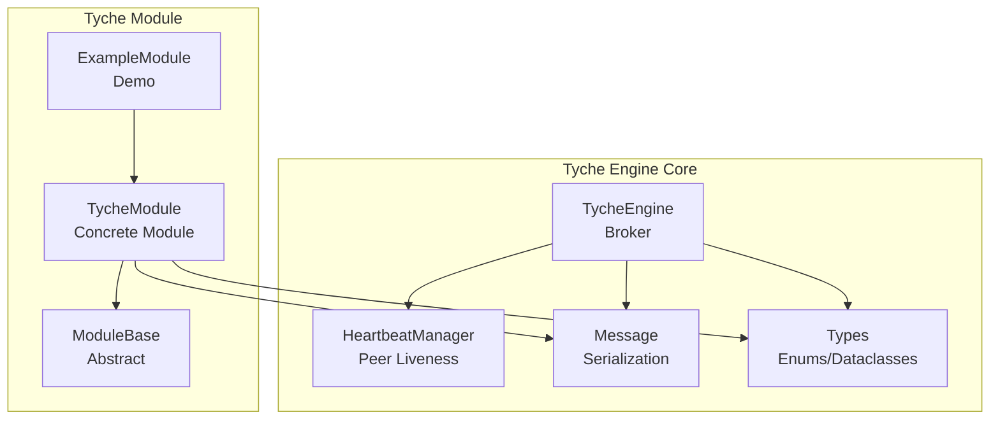
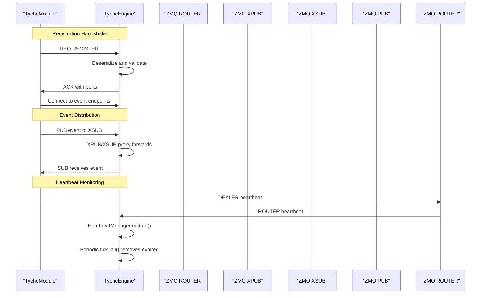
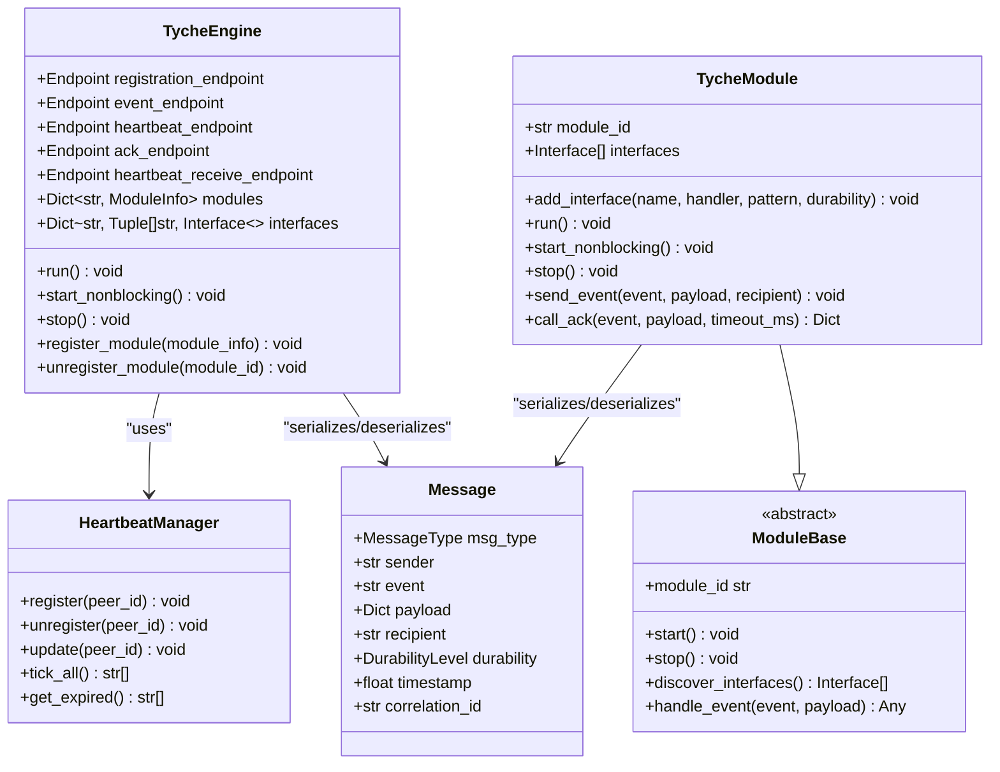
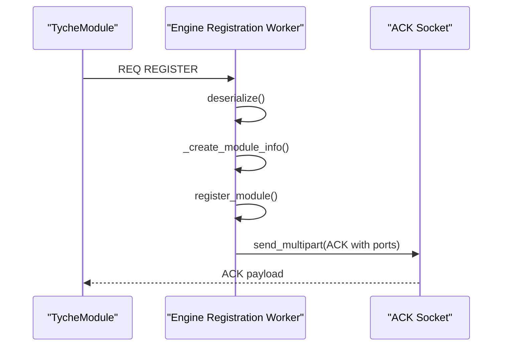
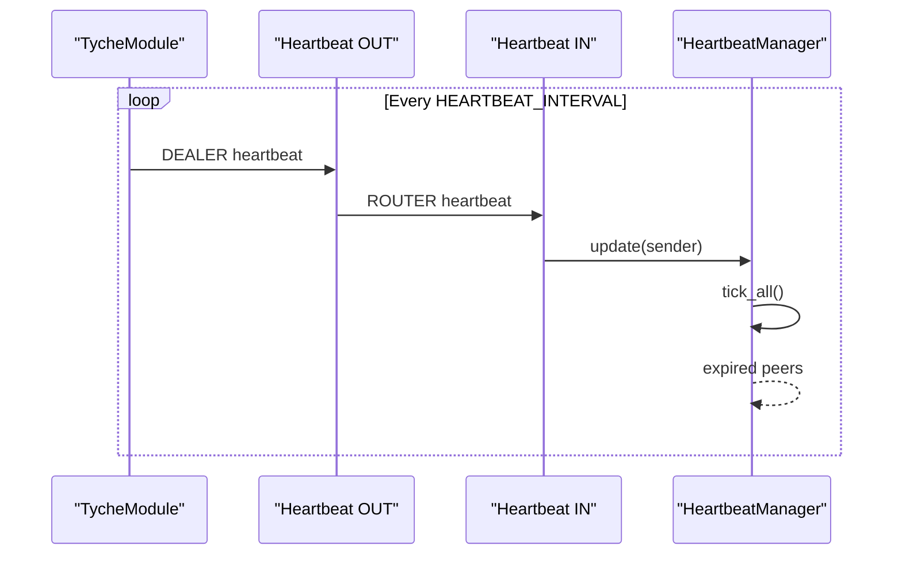
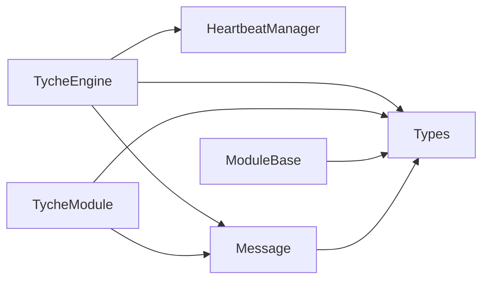

# Core Components

<cite>
**Referenced Files in This Document**
- [engine.py](file://src/tyche/engine.py)
- [module.py](file://src/tyche/module.py)
- [module_base.py](file://src/tyche/module_base.py)
- [message.py](file://src/tyche/message.py)
- [heartbeat.py](file://src/tyche/heartbeat.py)
- [types.py](file://src/tyche/types.py)
- [example_module.py](file://src/tyche/example_module.py)
- [run_engine.py](file://examples/run_engine.py)
- [run_module.py](file://examples/run_module.py)
- [test_engine.py](file://tests/unit/test_engine.py)
- [test_module.py](file://tests/unit/test_module.py)
- [test_message.py](file://tests/unit/test_message.py)
- [test_heartbeat.py](file://tests/unit/test_heartbeat.py)
- [test_heartbeat_protocol.py](file://tests/unit/test_heartbeat_protocol.py)
</cite>

## Table of Contents
1. [Introduction](#introduction)
2. [Project Structure](#project-structure)
3. [Core Components](#core-components)
4. [Architecture Overview](#architecture-overview)
5. [Detailed Component Analysis](#detailed-component-analysis)
6. [Dependency Analysis](#dependency-analysis)
7. [Performance Considerations](#performance-considerations)
8. [Troubleshooting Guide](#troubleshooting-guide)
9. [Conclusion](#conclusion)
10. [Appendices](#appendices)

## Introduction
This document explains the core components of Tyche Engine: TycheEngine as the central broker, TycheModule as the base class for distributed modules, the Message system for serialization, HeartbeatManager for peer monitoring, and the type definitions. It covers component responsibilities, relationships, lifecycle management, APIs, parameters, return values, practical usage patterns, configuration options, and error handling strategies.

## Project Structure
Tyche Engine organizes its core logic under src/tyche with clear separation of concerns:
- Broker engine: TycheEngine orchestrates registration, event routing, and heartbeat monitoring.
- Module base: ModuleBase defines the interface for modules; TycheModule provides a concrete implementation.
- Messaging: Message and Envelope define the serialized message format and ZeroMQ framing.
- Heartbeat: HeartbeatManager tracks peer liveness using a Paranoid Pirate pattern.
- Types: Shared enums, dataclasses, and constants for endpoints, interfaces, and durability.

**Diagram sources**
- [engine.py:25-350](file://src/tyche/engine.py#L25-L350)
- [module.py:28-401](file://src/tyche/module.py#L28-L401)
- [module_base.py:10-120](file://src/tyche/module_base.py#L10-L120)
- [message.py:13-168](file://src/tyche/message.py#L13-L168)
- [heartbeat.py:91-142](file://src/tyche/heartbeat.py#L91-L142)
- [types.py:14-102](file://src/tyche/types.py#L14-L102)
- [example_module.py:19-167](file://src/tyche/example_module.py#L19-L167)

**Section sources**
- [engine.py:1-350](file://src/tyche/engine.py#L1-L350)
- [module.py:1-401](file://src/tyche/module.py#L1-L401)
- [module_base.py:1-120](file://src/tyche/module_base.py#L1-L120)
- [message.py:1-168](file://src/tyche/message.py#L1-L168)
- [heartbeat.py:1-142](file://src/tyche/heartbeat.py#L1-L142)
- [types.py:1-102](file://src/tyche/types.py#L1-L102)
- [example_module.py:1-167](file://src/tyche/example_module.py#L1-L167)

## Core Components
This section documents the primary building blocks and their responsibilities.

- TycheEngine
  - Central broker managing module registration, event routing via XPUB/XSUB proxy, and heartbeat monitoring.
  - Exposes lifecycle methods run(), start_nonblocking(), and stop().
  - Manages internal registry of modules and their interfaces.
  - Provides endpoints for registration, event publishing/subscribing, and heartbeat exchange.

- TycheModule
  - Base class for distributed modules; inherits from ModuleBase.
  - Handles registration handshake, event subscription/publishing, and heartbeat sending.
  - Supports interface patterns: on_, ack_, whisper_, on_common_, broadcast_.
  - Provides send_event() and call_ack() helpers for event-driven communication.

- Message
  - Defines the Message dataclass and Envelope for ZeroMQ routing.
  - Implements serialization/deserialization using MessagePack with custom Decimal handling.
  - Ensures robust round-trip encoding/decoding for payloads.

- HeartbeatManager
  - Tracks peer liveness using a Paranoid Pirate pattern with configurable intervals and liveness thresholds.
  - Monitors individual peers and reports expired ones for automatic cleanup.

- Types
  - Defines enums for MessageType, InterfacePattern, DurabilityLevel, and EventType.
  - Provides dataclasses for Endpoint, Interface, ModuleInfo, and ModuleId utilities.
  - Exposes constants for heartbeat timing.

**Section sources**
- [engine.py:25-350](file://src/tyche/engine.py#L25-L350)
- [module.py:28-401](file://src/tyche/module.py#L28-L401)
- [module_base.py:10-120](file://src/tyche/module_base.py#L10-L120)
- [message.py:13-168](file://src/tyche/message.py#L13-L168)
- [heartbeat.py:91-142](file://src/tyche/heartbeat.py#L91-L142)
- [types.py:14-102](file://src/tyche/types.py#L14-L102)

## Architecture Overview
Tyche Engine uses ZeroMQ sockets to implement a brokered pub-sub model with REQ/REP registration and heartbeat monitoring.

**Diagram sources**
- [engine.py:121-177](file://src/tyche/engine.py#L121-L177)
- [engine.py:238-277](file://src/tyche/engine.py#L238-L277)
- [engine.py:281-349](file://src/tyche/engine.py#L281-L349)
- [module.py:200-254](file://src/tyche/module.py#L200-L254)
- [module.py:301-330](file://src/tyche/module.py#L301-L330)
- [module.py:376-401](file://src/tyche/module.py#L376-L401)

## Detailed Component Analysis

### TycheEngine
Responsibilities:
- Manage module registration via ROUTER socket.
- Route events using an XPUB/XSUB proxy.
- Monitor peer liveness via heartbeat workers and HeartbeatManager.
- Provide lifecycle control: run(), start_nonblocking(), stop().

Key APIs and behaviors:
- Constructor parameters:
  - registration_endpoint: Endpoint for registration REQ/REP.
  - event_endpoint: Endpoint for XPUB/XSUB proxy.
  - heartbeat_endpoint: Endpoint for outbound heartbeat PUB.
  - ack_endpoint: Optional ACK endpoint derived from event_endpoint.
  - heartbeat_receive_endpoint: Endpoint for inbound heartbeat ROUTER.
- Lifecycle:
  - run(): Starts worker threads and blocks until stop().
  - start_nonblocking(): Starts worker threads without blocking.
  - stop(): Stops all threads, destroys context, and cleans sockets.
- Registration worker:
  - Receives multipart frames from modules, deserializes Message, and responds with ACK containing event ports.
- Event proxy worker:
  - Binds XPUB and XSUB, forwards messages between them.
- Heartbeat workers:
  - Outbound: Sends periodic HEARTBEAT messages via PUB.
  - Inbound: Receives heartbeat ROUTER frames, deserializes, and updates HeartbeatManager.
- Monitor worker:
  - Periodically calls HeartbeatManager.tick_all() and unregisters expired modules.

Practical usage:
- Start the engine as a standalone process with distinct endpoints for registration, events, and heartbeats.
- Use examples/run_engine.py to launch the engine and examples/run_module.py to connect modules.

Integration patterns:
- Modules connect to the engine’s registration endpoint for one-shot registration.
- Modules publish events to the engine’s XSUB endpoint and subscribe via the engine’s XPUB endpoint.
- Modules send heartbeats to the engine’s heartbeat receive endpoint.

Error handling:
- Graceful logging of errors in workers; exceptions are caught and logged without crashing the engine when still running.
- Proper socket closure and context destruction on stop().

**Section sources**
- [engine.py:25-350](file://src/tyche/engine.py#L25-L350)
- [run_engine.py:21-54](file://examples/run_engine.py#L21-L54)

### TycheModule
Responsibilities:
- Connect to TycheEngine, register interfaces, subscribe to events, and dispatch messages to handlers.
- Send events via the engine’s event proxy and request acknowledgments via call_ack().
- Send periodic heartbeats to keep the engine informed of liveness.

Key APIs and behaviors:
- Constructor parameters:
  - engine_endpoint: Endpoint for registration REQ/REP.
  - module_id: Optional explicit module ID; otherwise auto-generated.
  - event_endpoint: Optional event endpoint override.
  - heartbeat_endpoint: Optional heartbeat endpoint override.
  - heartbeat_receive_endpoint: Endpoint for inbound heartbeat ROUTER.
- Interface management:
  - add_interface(name, handler, pattern, durability): Registers handler and creates Interface entry.
  - discover_interfaces(): Auto-detects interfaces from method names using naming conventions.
- Lifecycle:
  - run(): Starts worker threads and blocks until stop().
  - start_nonblocking(): Starts worker threads without blocking.
  - stop(): Stops threads, closes sockets, and destroys context.
- Registration:
  - _register(): Sends REGISTER message with interfaces and metadata; receives ACK with event ports.
- Event handling:
  - _subscribe_to_interfaces(): Subscribes to topics matching handler names.
  - _event_receiver(): Receives events from XPUB, deserializes, and dispatches to handlers.
  - _dispatch(): Calls handler with payload; logs exceptions.
- Event publishing:
  - send_event(event, payload, recipient): Publishes to engine’s XSUB with topic framing.
  - call_ack(event, payload, timeout_ms): Sends COMMAND via REQ and waits for ACK response.
- Heartbeat:
  - _send_heartbeats(): Sends periodic HEARTBEAT messages to engine’s heartbeat receive endpoint.

Practical usage:
- Extend TycheModule and implement handler methods following naming conventions.
- Use add_interface() or rely on discover_interfaces() to declare capabilities.
- Call send_event() and call_ack() for event-driven communication.

Integration patterns:
- Modules connect to the engine’s registration endpoint and subscribe to topics matching their handler names.
- Use call_ack() for request-response semantics requiring ACK replies.

Error handling:
- Registration timeouts and failures are logged; module remains non-functional until successful registration.
- Event receive errors are logged; dispatch exceptions are caught and logged.

**Section sources**
- [module.py:28-401](file://src/tyche/module.py#L28-L401)
- [module_base.py:10-120](file://src/tyche/module_base.py#L10-L120)
- [example_module.py:19-167](file://src/tyche/example_module.py#L19-L167)
- [run_module.py:22-51](file://examples/run_module.py#L22-L51)

### Message System
Responsibilities:
- Define the Message dataclass representing application messages.
- Provide serialization/deserialization using MessagePack with custom Decimal handling.
- Support ZeroMQ multipart envelopes for routing.

Key APIs and behaviors:
- Message fields:
  - msg_type: MessageType enum.
  - sender: Module ID of sender.
  - event: Event name or interface being invoked.
  - payload: Arbitrary dictionary payload.
  - recipient: Optional target module ID.
  - durability: DurabilityLevel enum.
  - timestamp: Optional creation timestamp.
  - correlation_id: Optional correlation ID for request/response.
- Envelope fields:
  - identity: Client identity frame from ROUTER.
  - message: The actual Message.
  - routing_stack: Optional routing identity stack for reply paths.
- Serialization:
  - serialize(Message) -> bytes: Encodes Message with custom Decimal handling.
  - deserialize(bytes) -> Message: Decodes MessagePack bytes.
  - serialize_envelope(Envelope) -> List[bytes]: Prepares multipart frames.
  - deserialize_envelope(List[bytes]) -> Envelope: Restores envelope.

Practical usage:
- Use Message to construct events and commands.
- Use serialize()/deserialize() for network transport.
- Use serialize_envelope()/deserialize_envelope() for ZeroMQ routing.

Error handling:
- Custom encoder/decoder handles Decimal and Enum types; raises TypeError for unsupported types.
- Envelope parsing handles missing delimiter gracefully.

**Section sources**
- [message.py:13-168](file://src/tyche/message.py#L13-L168)

### HeartbeatManager
Responsibilities:
- Track peer liveness using a Paranoid Pirate pattern with configurable intervals and liveness thresholds.
- Provide registration, update, and expiration detection for peers.

Key APIs and behaviors:
- HeartbeatMonitor:
  - update(): Resets liveness and last_seen.
  - tick(): Decrements liveness counter.
  - is_expired(): Checks if liveness reached zero.
  - time_since_last(): Seconds since last heartbeat.
- HeartbeatSender:
  - should_send(): Determines if heartbeat interval elapsed.
  - send(): Sends heartbeat frames with module identity and serialized Message.
- HeartbeatManager:
  - register(peer_id): Adds monitor for peer.
  - unregister(peer_id): Removes monitor for peer.
  - update(peer_id): Updates monitor for peer.
  - tick_all(): Decrements all monitors and returns expired peer IDs.
  - get_expired(): Returns expired peers without ticking.

Practical usage:
- Engine uses HeartbeatManager to monitor module liveness and remove expired modules.
- Modules send periodic heartbeats to prevent expiration.

Error handling:
- Graceful handling of missing monitors by creating new ones on update.
- Thread-safe operations via locks.

**Section sources**
- [heartbeat.py:16-142](file://src/tyche/heartbeat.py#L16-L142)

### Type Definitions
Responsibilities:
- Provide shared enums, dataclasses, and constants for the engine and modules.

Key definitions:
- Enums:
  - ModuleId: Generates deity-prefixed module IDs.
  - EventType: Event categories.
  - InterfacePattern: Naming patterns for handlers.
  - DurabilityLevel: Persistence guarantees.
  - MessageType: Internal message types.
- Dataclasses:
  - Endpoint: Network address with host/port.
  - Interface: Handler capability definition.
  - ModuleInfo: Registration metadata.
- Constants:
  - HEARTBEAT_INTERVAL: Seconds between heartbeats.
  - HEARTBEAT_LIVENESS: Missed heartbeats before considered dead.

Practical usage:
- Use Endpoint to configure engine and module endpoints.
- Use InterfacePattern and DurabilityLevel to define handler capabilities and persistence.

**Section sources**
- [types.py:14-102](file://src/tyche/types.py#L14-L102)

## Architecture Overview
The following diagram maps the actual code relationships among core components.

**Diagram sources**
- [engine.py:25-350](file://src/tyche/engine.py#L25-L350)
- [module.py:28-401](file://src/tyche/module.py#L28-L401)
- [module_base.py:10-120](file://src/tyche/module_base.py#L10-L120)
- [message.py:13-168](file://src/tyche/message.py#L13-L168)
- [heartbeat.py:91-142](file://src/tyche/heartbeat.py#L91-L142)

## Detailed Component Analysis

### TycheEngine Registration Flow

**Diagram sources**
- [engine.py:121-177](file://src/tyche/engine.py#L121-L177)
- [engine.py:178-198](file://src/tyche/engine.py#L178-L198)
- [module.py:200-254](file://src/tyche/module.py#L200-L254)

**Section sources**
- [engine.py:121-177](file://src/tyche/engine.py#L121-L177)
- [module.py:200-254](file://src/tyche/module.py#L200-L254)

### TycheModule Event Dispatch Flow

**Diagram sources**
- [module.py:265-298](file://src/tyche/module.py#L265-L298)

**Section sources**
- [module.py:265-298](file://src/tyche/module.py#L265-L298)

### Heartbeat Protocol Flow

**Diagram sources**
- [engine.py:281-349](file://src/tyche/engine.py#L281-L349)
- [module.py:376-401](file://src/tyche/module.py#L376-L401)
- [heartbeat.py:91-142](file://src/tyche/heartbeat.py#L91-L142)

**Section sources**
- [engine.py:281-349](file://src/tyche/engine.py#L281-L349)
- [module.py:376-401](file://src/tyche/module.py#L376-L401)
- [heartbeat.py:91-142](file://src/tyche/heartbeat.py#L91-L142)

## Dependency Analysis
The core components have minimal coupling and clear boundaries:
- TycheEngine depends on HeartbeatManager, Message, and types.
- TycheModule depends on Message, types, and ModuleBase.
- HeartbeatManager is used by TycheEngine and can be used by modules independently.
- Message depends on types for enums and durability levels.
- Types are foundational and used across modules and engine.

**Diagram sources**
- [engine.py:10-20](file://src/tyche/engine.py#L10-L20)
- [module.py:13-23](file://src/tyche/module.py#L13-L23)
- [message.py:10-10](file://src/tyche/message.py#L10-L10)
- [types.py:12-23](file://src/tyche/types.py#L12-L23)

**Section sources**
- [engine.py:10-20](file://src/tyche/engine.py#L10-L20)
- [module.py:13-23](file://src/tyche/module.py#L13-L23)
- [message.py:10-10](file://src/tyche/message.py#L10-L10)
- [types.py:12-23](file://src/tyche/types.py#L12-L23)

## Performance Considerations
- ZeroMQ polling and multipart frames are efficient for high-throughput event distribution.
- Heartbeat intervals and liveness thresholds balance responsiveness and overhead.
- MessagePack serialization is compact and fast; custom Decimal handling ensures precision without significant overhead.
- Thread-per-worker design keeps I/O non-blocking; daemon threads ensure graceful shutdown.
- XPUB/XSUB proxy minimizes fan-out costs by forwarding at the socket level.

## Troubleshooting Guide
Common issues and strategies:
- Registration failures:
  - Symptoms: Module cannot connect to engine or registration timeout.
  - Actions: Verify engine endpoints, check firewall/network, confirm engine is running, and review logs.
- Event delivery problems:
  - Symptoms: Handlers not receiving events or missing subscriptions.
  - Actions: Ensure handler names match subscription topics, confirm module subscribed to correct event ports, and verify event proxy is running.
- Heartbeat expiration:
  - Symptoms: Modules unexpectedly removed from registry.
  - Actions: Confirm heartbeat endpoints are reachable, verify module heartbeat thread is running, and adjust heartbeat intervals/liveness if needed.
- Serialization errors:
  - Symptoms: MessagePack decode errors or unsupported types.
  - Actions: Ensure payloads only contain supported types or use Decimal-compatible structures; verify custom encoder/decoder behavior.

Validation via tests:
- Engine registration/unregistration verified in unit tests.
- Module interface discovery and lifecycle verified in unit tests.
- Message serialization round-trip and envelope handling verified in unit tests.
- Heartbeat protocol behavior validated in heartbeat protocol tests.

**Section sources**
- [test_engine.py:8-51](file://tests/unit/test_engine.py#L8-L51)
- [test_module.py:7-69](file://tests/unit/test_module.py#L7-L69)
- [test_message.py:16-162](file://tests/unit/test_message.py#L16-L162)
- [test_heartbeat_protocol.py:16-119](file://tests/unit/test_heartbeat_protocol.py#L16-L119)

## Conclusion
Tyche Engine’s core components form a cohesive, modular system:
- TycheEngine orchestrates registration, event routing, and heartbeat monitoring.
- TycheModule provides a flexible, interface-driven development model with built-in helpers.
- Message and Envelope ensure robust, typed serialization across the wire.
- HeartbeatManager enforces reliability using a proven pattern.
- Types unify configuration and behavior across the system.

Together, these components enable scalable, resilient distributed systems with clear lifecycles, strong error handling, and straightforward integration patterns.

## Appendices

### API Reference: TycheEngine
- Constructor
  - Parameters:
    - registration_endpoint: Endpoint
    - event_endpoint: Endpoint
    - heartbeat_endpoint: Endpoint
    - ack_endpoint: Optional[Endpoint]
    - heartbeat_receive_endpoint: Optional[Endpoint]
  - Behavior: Stores endpoints, initializes registry, and prepares HeartbeatManager.
- Methods:
  - run(): Start workers and block until stop().
  - start_nonblocking(): Start workers without blocking.
  - stop(): Stop workers, join threads, and destroy context.
  - register_module(module_info): Thread-safe registration.
  - unregister_module(module_id): Thread-safe unregistration.

**Section sources**
- [engine.py:34-118](file://src/tyche/engine.py#L34-L118)
- [engine.py:200-234](file://src/tyche/engine.py#L200-L234)

### API Reference: TycheModule
- Constructor
  - Parameters:
    - engine_endpoint: Endpoint
    - module_id: Optional[str]
    - event_endpoint: Optional[Endpoint]
    - heartbeat_endpoint: Optional[Endpoint]
    - heartbeat_receive_endpoint: Optional[Endpoint]
  - Behavior: Initializes handlers, interfaces, and connection state.
- Methods:
  - add_interface(name, handler, pattern, durability): Register handler and interface.
  - run()/start_nonblocking(): Start workers and block or return immediately.
  - stop(): Stop workers and clean up sockets.
  - send_event(event, payload, recipient): Publish event via engine.
  - call_ack(event, payload, timeout_ms): Request-response with ACK.
  - discover_interfaces(): Auto-detect interfaces from method names.

**Section sources**
- [module.py:41-197](file://src/tyche/module.py#L41-L197)
- [module.py:301-373](file://src/tyche/module.py#L301-L373)
- [module_base.py:48-120](file://src/tyche/module_base.py#L48-L120)

### API Reference: Message
- Dataclass fields:
  - msg_type: MessageType
  - sender: str
  - event: str
  - payload: Dict[str, Any]
  - recipient: Optional[str]
  - durability: DurabilityLevel
  - timestamp: Optional[float]
  - correlation_id: Optional[str]
- Functions:
  - serialize(message) -> bytes
  - deserialize(data) -> Message
  - serialize_envelope(envelope) -> List[bytes]
  - deserialize_envelope(frames) -> Envelope

**Section sources**
- [message.py:13-168](file://src/tyche/message.py#L13-L168)

### API Reference: HeartbeatManager
- Classes:
  - HeartbeatMonitor: Tracks liveness and last seen time.
  - HeartbeatSender: Sends periodic heartbeats.
  - HeartbeatManager: Manages monitors for multiple peers.
- Methods:
  - register(peer_id), unregister(peer_id), update(peer_id)
  - tick_all() -> List[str], get_expired() -> List[str]

**Section sources**
- [heartbeat.py:16-142](file://src/tyche/heartbeat.py#L16-L142)

### API Reference: Types
- Enums:
  - ModuleId, EventType, InterfacePattern, DurabilityLevel, MessageType
- Dataclasses:
  - Endpoint(host, port), Interface(name, pattern, event_type, durability), ModuleInfo(module_id, endpoint, interfaces, metadata)
- Constants:
  - HEARTBEAT_INTERVAL, HEARTBEAT_LIVENESS

**Section sources**
- [types.py:14-102](file://src/tyche/types.py#L14-L102)

### Practical Examples
- Running the engine:
  - Configure endpoints and call run(); see examples/run_engine.py.
- Running a module:
  - Instantiate ExampleModule with engine endpoint and heartbeat receive endpoint; call run(); see examples/run_module.py.
- Implementing a custom module:
  - Extend TycheModule, implement handlers following naming conventions, and call add_interface() or rely on discover_interfaces().

**Section sources**
- [run_engine.py:21-54](file://examples/run_engine.py#L21-L54)
- [run_module.py:22-51](file://examples/run_module.py#L22-L51)
- [example_module.py:19-167](file://src/tyche/example_module.py#L19-L167)