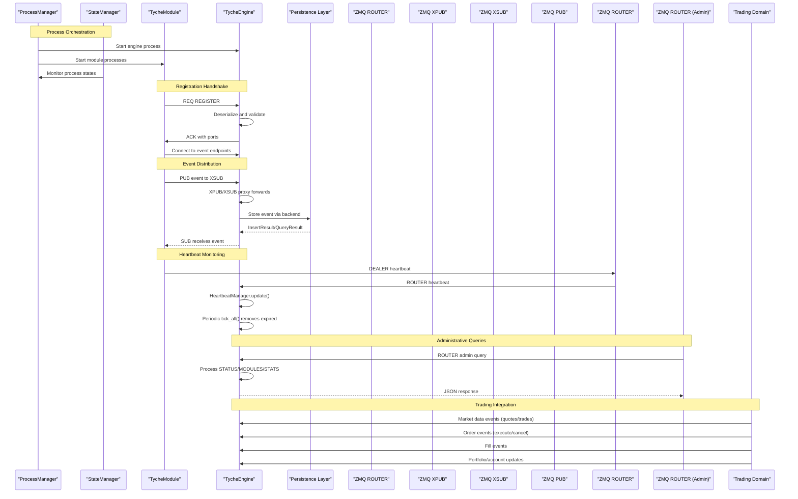
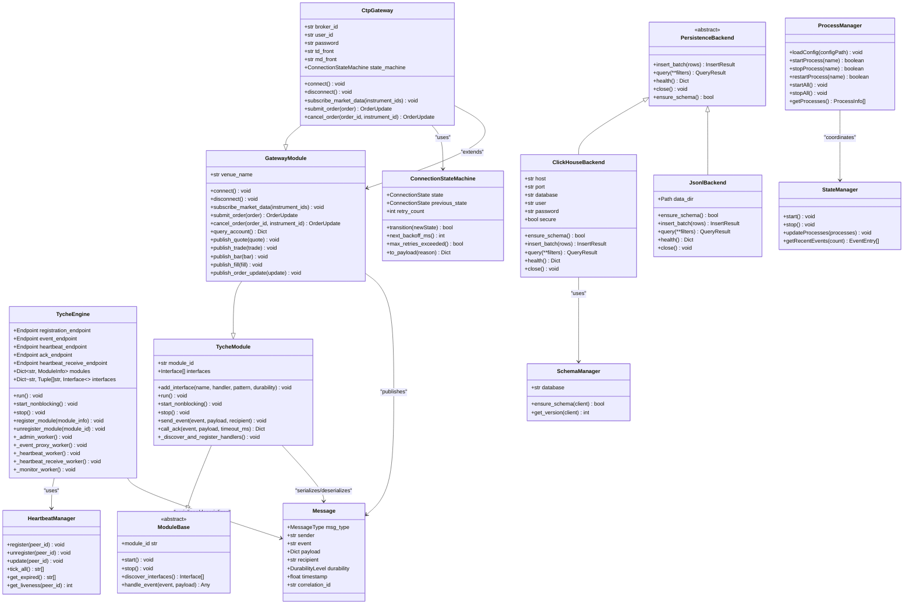
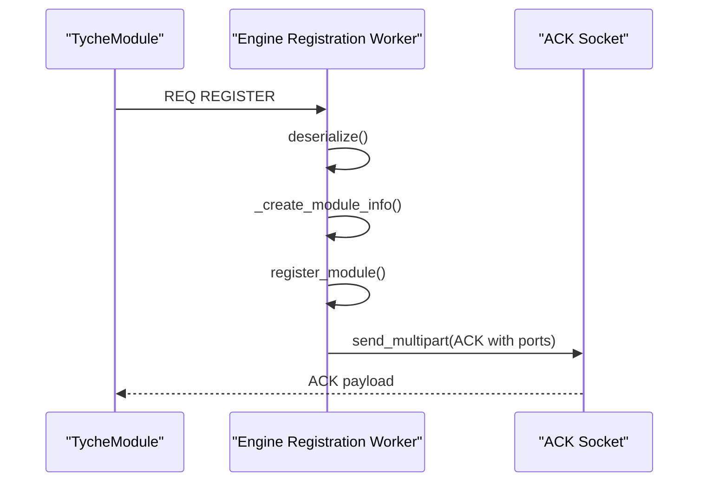
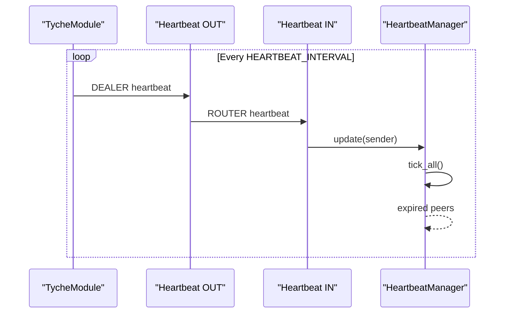
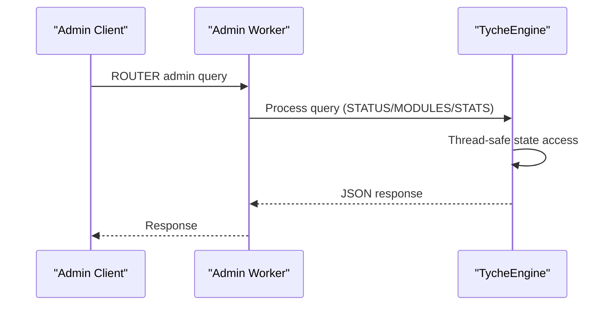
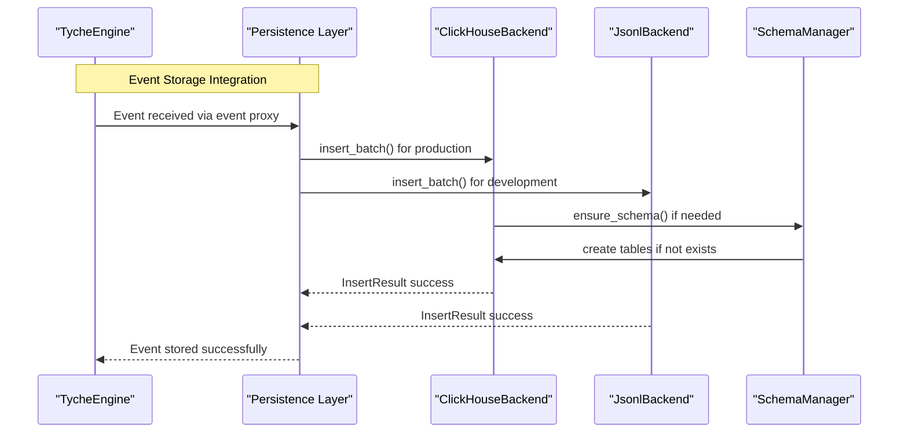
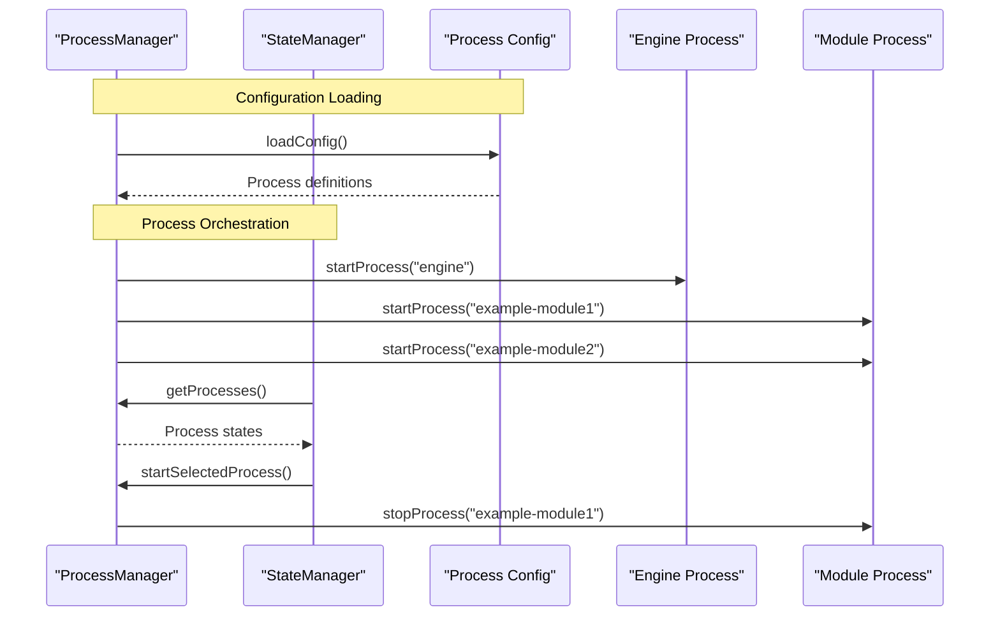
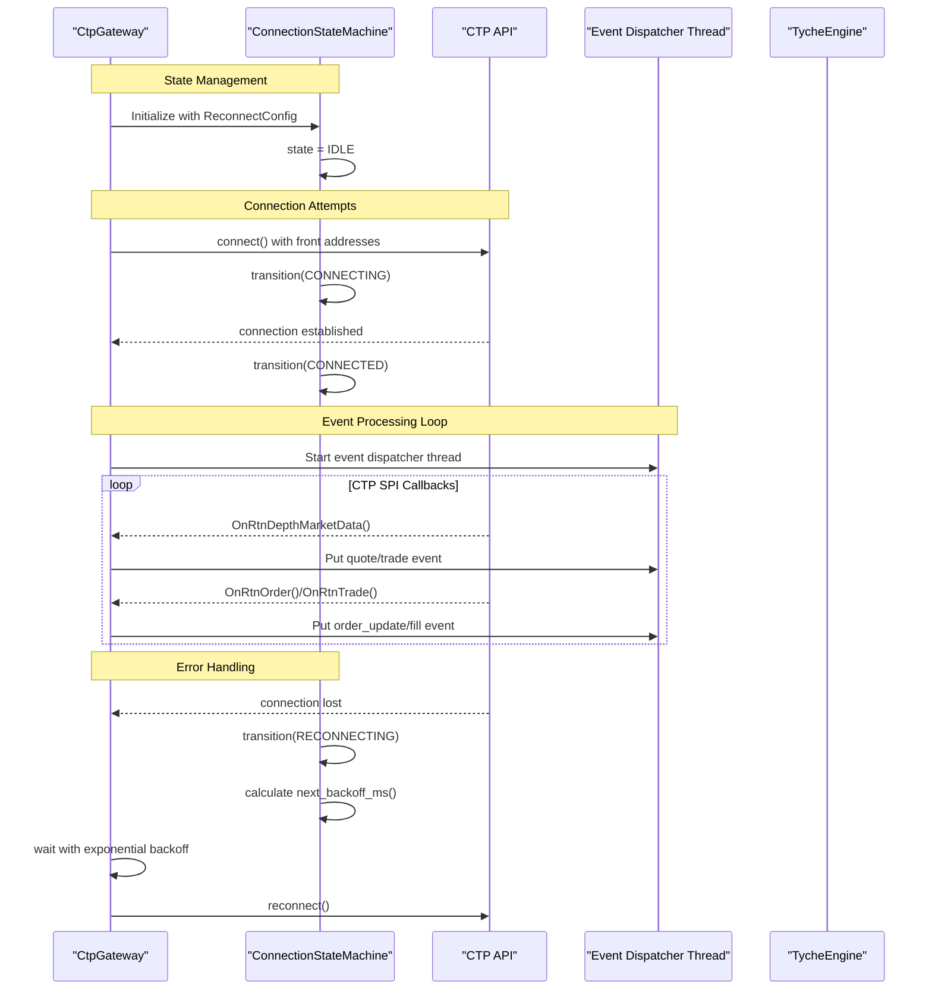
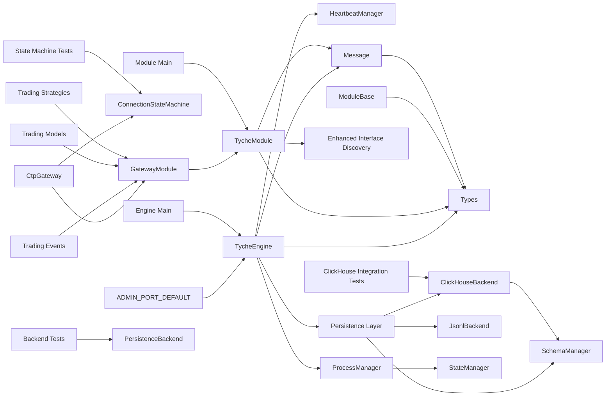

# Core Components

<cite>
**Referenced Files in This Document**
- [engine.py](file://src/tyche/engine.py)
- [module.py](file://src/tyche/module.py)
- [module_base.py](file://src/tyche/module_base.py)
- [message.py](file://src/tyche/message.py)
- [heartbeat.py](file://src/tyche/heartbeat.py)
- [types.py](file://src/tyche/types.py)
- [engine_main.py](file://src/tyche/engine_main.py)
- [module_main.py](file://src/tyche/module_main.py)
- [backend.py](file://src/modules/trading/persistence/backend.py)
- [clickhouse_backend.py](file://src/modules/trading/persistence/clickhouse_backend.py)
- [jsonl_backend.py](file://src/modules/trading/persistence/jsonl_backend.py)
- [schema.py](file://src/modules/trading/persistence/schema.py)
- [state_machine.py](file://src/modules/trading/gateway/ctp/state_machine.py)
- [process-manager.ts](file://tui/src/process-manager.ts)
- [state.ts](file://tui/src/state.ts)
- [event-log.ts](file://tui/src/components/event-log.ts)
- [run_engine.py](file://examples/run_engine.py)
- [run_module.py](file://examples/run_module.py)
- [run_trading_system.py](file://examples/run_trading_system.py)
- [run_strategy.py](file://examples/run_strategy.py)
- [run_trading_services.py](file://examples/run_trading_services.py)
- [trading/__init__.py](file://src/modules/trading/__init__.py)
- [trading/events.py](file://src/modules/trading/events.py)
- [trading/gateway/base.py](file://src/modules/trading/gateway/base.py)
- [trading/gateway/ctp/gateway.py](file://src/modules/trading/gateway/ctp/gateway.py)
- [trading/gateway/ctp/sim.py](file://src/modules/trading/gateway/ctp/sim.py)
- [trading/gateway/ctp/live.py](file://src/modules/trading/gateway/ctp/live.py)
- [trading/models/enums.py](file://src/modules/trading/models/enums.py)
- [trading/strategy/example_ma_cross.py](file://src/modules/trading/strategy/example_ma_cross.py)
- [test_engine.py](file://tests/unit/test_engine.py)
- [test_module.py](file://tests/unit/test_module.py)
- [test_message.py](file://tests/unit/test_message.py)
- [test_heartbeat.py](file://tests/unit/test_heartbeat.py)
- [test_heartbeat_protocol.py](file://tests/unit/test_heartbeat_protocol.py)
- [test_backend.py](file://tests/unit/test_backend.py)
- [test_clickhouse_backend.py](file://tests/integration/test_clickhouse_backend.py)
- [test_ctp_state_machine.py](file://tests/unit/test_ctp_state_machine.py)
</cite>

## Update Summary
**Changes Made**
- Added comprehensive event persistence layer with new backend abstraction
- Enhanced CTP gateway with sophisticated connection state machine and auto-reconnect
- Improved module interface system with enhanced pattern recognition
- Expanded testing infrastructure with comprehensive unit and integration tests
- Updated core component documentation to cover new backend implementations and state management

## Table of Contents
1. [Introduction](#introduction)
2. [Project Structure](#project-structure)
3. [Core Components](#core-components)
4. [Architecture Overview](#architecture-overview)
5. [Detailed Component Analysis](#detailed-component-analysis)
6. [Trading System Integration](#trading-system-integration)
7. [Event Persistence Layer](#event-persistence-layer)
8. [Enhanced CTP Gateway State Machine](#enhanced-ctp-gateway-state-machine)
9. [Improved Module Interface System](#improved-module-interface-system)
10. [Comprehensive Testing Infrastructure](#comprehensive-testing-infrastructure)
11. [Process Management System](#process-management-system)
12. [Enhanced Event Logging](#enhanced-event-logging)
13. [Dependency Analysis](#dependency-analysis)
14. [Performance Considerations](#performance-considerations)
15. [Troubleshooting Guide](#troubleshooting-guide)
16. [Conclusion](#conclusion)
17. [Appendices](#appendices)

## Introduction
This document explains the core components of Tyche Engine: TycheEngine as the central broker, TycheModule as the base class for distributed modules, the Message system for serialization, HeartbeatManager for peer monitoring, and the type definitions. It covers component responsibilities, relationships, lifecycle management, APIs, parameters, return values, practical usage patterns, configuration options, and error handling strategies.

**Updated** Enhanced with new event persistence layer implementation, comprehensive backend abstraction, sophisticated CTP gateway state machine with auto-reconnect, improved module interface system with enhanced pattern recognition, expanded testing infrastructure, and integrated process management system for multi-process orchestration.

## Project Structure
Tyche Engine organizes its core logic under src/tyche with clear separation of concerns, plus enhanced modules.trading package for comprehensive trading infrastructure, new persistence layer for event storage, sophisticated CTP gateway state management, and a TUI (Terminal User Interface) for process management and monitoring:
- Broker engine: TycheEngine orchestrates registration, event routing, heartbeat monitoring, administrative queries, and event persistence.
- Module base: ModuleBase defines the interface for modules; TycheModule provides a concrete implementation with enhanced interface discovery.
- Messaging: Message and Envelope define the serialized message format and ZeroMQ framing.
- Heartbeat: HeartbeatManager tracks peer liveness using a Paranoid Pirate pattern.
- Types: Shared enums, dataclasses, and constants for endpoints, interfaces, and durability.
- Trading domain: Enhanced modules.trading package provides comprehensive trading infrastructure including CTP gateway integration with state machine.
- Persistence layer: New backend abstraction with ClickHouse and JSONL implementations for event storage.
- Testing infrastructure: Comprehensive unit and integration tests covering all major components.
- Process management: TUI-based process manager for multi-process orchestration and monitoring.
- Event logging: Enhanced logging system with microsecond precision timestamp formatting.

```mermaid
graph TB
subgraph "Tyche Engine Core"
Engine["TycheEngine<br/>Broker"]
HBMgr["HeartbeatManager<br/>Peer Liveness"]
Msg["Message<br/>Serialization"]
Types["Types<br/>Enums/Dataclasses"]
Admin["Admin Worker<br/>State Queries"]
EventProxy["Event Proxy<br/>XPUB/XSUB"]
MainProc["Process Manager<br/>CLI Entry Points"]
Persist["Persistence Layer<br/>Backend Abstraction"]
EndPoints["Endpoints<br/>Engine/Heartbeat/Admin"]
end
subgraph "Tyche Module"
ModBase["ModuleBase<br/>Abstract"]
TycheMod["TycheModule<br/>Concrete Module<br/>Enhanced Interface Discovery"]
ExMod["ExampleModule<br/>Demo"]
end
subgraph "Trading Domain"
GatewayBase["GatewayModule<br/>Abstract Base"]
CTPGateway["CtpGateway<br/>Enhanced State Machine"]
CTPSim["CtpSimGateway<br/>Simulated Trading"]
CTPLive["CtpLiveGateway<br/>Live Trading"]
Events["Trading Events<br/>Event Definitions"]
Models["Trading Models<br/>Enums/Classes"]
Strategies["Trading Strategies<br/>EMA Crossover"]
end
subgraph "Persistence Backends"
ClickHouse["ClickHouseBackend<br/>Production Storage"]
Jsonl["JsonlBackend<br/>Development Storage"]
SchemaMgr["SchemaManager<br/>DDL Management"]
EndPoints --> Engine
Persist --> ClickHouse
Persist --> Jsonl
Persist --> SchemaMgr
Engine --> Persist
GatewayBase --> TycheMod
CTPGateway --> GatewayBase
CTPSim --> CtpGateway
CTPLive --> CtpGateway
Events --> GatewayBase
Models --> GatewayBase
Strategies --> GatewayBase
EndPoints --> Engine
EndPoints --> Persist
EndPoints --> GatewayBase
EndPoints --> TycheMod
EndPoints --> ModBase
EndPoints --> Msg
EndPoints --> HBMgr
EndPoints --> Types
EndPoints --> Admin
EndPoints --> EventProxy
EndPoints --> MainProc
EndPoints --> ProcessManager
EndPoints --> StateManager
EndPoints --> EventLogger
EndPoints --> ProcessConfig
end
```

**Diagram sources**
- [engine.py:25-677](file://src/tyche/engine.py#L25-L677)
- [module.py:28-498](file://src/tyche/module.py#L28-L498)
- [module_base.py:10-120](file://src/tyche/module_base.py#L10-L120)
- [message.py:13-168](file://src/tyche/message.py#L13-L168)
- [heartbeat.py:91-153](file://src/tyche/heartbeat.py#L91-L153)
- [types.py:14-105](file://src/tyche/types.py#L14-L105)
- [engine_main.py:13-57](file://src/tyche/engine_main.py#L13-L57)
- [module_main.py:13-47](file://src/tyche/module_main.py#L13-L47)
- [backend.py:80-162](file://src/modules/trading/persistence/backend.py#L80-L162)
- [clickhouse_backend.py:23-231](file://src/modules/trading/persistence/clickhouse_backend.py#L23-L231)
- [jsonl_backend.py:20-155](file://src/modules/trading/persistence/jsonl_backend.py#L20-L155)
- [schema.py:35-107](file://src/modules/trading/persistence/schema.py#L35-L107)
- [state_machine.py:35-96](file://src/modules/trading/gateway/ctp/state_machine.py#L35-L96)
- [process-manager.ts:15-296](file://tui/src/process-manager.ts#L15-L296)
- [state.ts:44-326](file://tui/src/state.ts#L44-L326)
- [event-log.ts:59-87](file://tui/src/components/event-log.ts#L59-L87)

**Section sources**
- [engine.py:1-677](file://src/tyche/engine.py#L1-L677)
- [module.py:1-498](file://src/tyche/module.py#L1-L498)
- [module_base.py:1-120](file://src/tyche/module_base.py#L1-L120)
- [message.py:1-168](file://src/tyche/message.py#L1-L168)
- [heartbeat.py:1-153](file://src/tyche/heartbeat.py#L1-L153)
- [types.py:1-105](file://src/tyche/types.py#L1-L105)
- [engine_main.py:1-57](file://src/tyche/engine_main.py#L1-L57)
- [module_main.py:1-47](file://src/tyche/module_main.py#L1-L47)
- [backend.py:1-162](file://src/modules/trading/persistence/backend.py#L1-L162)
- [clickhouse_backend.py:1-231](file://src/modules/trading/persistence/clickhouse_backend.py#L1-L231)
- [jsonl_backend.py:1-155](file://src/modules/trading/persistence/jsonl_backend.py#L1-L155)
- [schema.py:1-107](file://src/modules/trading/persistence/schema.py#L1-L107)
- [state_machine.py:1-96](file://src/modules/trading/gateway/ctp/state_machine.py#L1-L96)
- [process-manager.ts:1-296](file://tui/src/process-manager.ts#L1-L296)
- [state.ts:1-326](file://tui/src/state.ts#L1-L326)
- [event-log.ts:1-87](file://tui/src/components/event-log.ts#L1-L87)

## Core Components
This section documents the primary building blocks and their responsibilities.

- TycheEngine
  - Central broker managing module registration, event routing via XPUB/XSUB proxy, heartbeat monitoring, administrative queries, and event persistence.
  - Exposes lifecycle methods run(), start_nonblocking(), and stop().
  - Manages internal registry of modules and their interfaces with thread-safe operations.
  - Provides endpoints for registration, event publishing/subscribing, heartbeat exchange, administrative state queries, and event persistence.
  - **Updated**: Now includes administrative worker for engine state queries, enhanced XPUB/XSUB proxy with separate event endpoints, and integrated persistence layer.

- TycheModule
  - Base class for distributed modules; inherits from ModuleBase.
  - Handles registration handshake, event subscription/publishing, and heartbeat sending.
  - Supports enhanced interface patterns: on_, ack_, whisper_, on_common_, broadcast_ with improved pattern recognition.
  - Provides send_event() and call_ack() helpers for event-driven communication.
  - **Updated**: Enhanced with improved heartbeat management, administrative endpoint support, and sophisticated interface discovery system.

- Message
  - Defines the Message dataclass and Envelope for ZeroMQ routing.
  - Implements serialization/deserialization using MessagePack with custom Decimal handling.
  - Ensures robust round-trip encoding/decoding for payloads.

- HeartbeatManager
  - Tracks peer liveness using a Paranoid Pirate pattern with configurable intervals and liveness thresholds.
  - Monitors individual peers and reports expired ones for automatic cleanup.
  - **Updated**: Enhanced with thread-safe operations and improved monitoring capabilities.

- Types
  - Defines enums for MessageType, InterfacePattern, DurabilityLevel, and EventType.
  - Provides dataclasses for Endpoint, Interface, ModuleInfo, and ModuleId utilities.
  - Exposes constants for heartbeat timing and administrative endpoint defaults.
  - **Updated**: Added ADMIN_PORT_DEFAULT constant for administrative endpoint configuration.

- **Updated** Event Persistence Layer
  - PersistenceBackend: Abstract base class defining the contract for insert, query, health, schema, and lifecycle operations.
  - ClickHouseBackend: Production backend using clickhouse-connect with connection pooling, daily partitioning, and schema management.
  - JsonlBackend: Development/test fallback backend writing events to date-partitioned JSONL files.
  - SchemaManager: Manages ClickHouse schema creation and version tracking with idempotent DDL operations.
  - Result dataclasses: InsertResult and QueryResult with explicit serialization for reliable round-trips.

- **Updated** Enhanced CTP Gateway State Machine
  - ConnectionStateMachine: Manages gateway connection state with validated transitions and exponential backoff with jitter.
  - ConnectionState: Enum defining gateway lifecycle states (IDLE, CONNECTING, CONNECTED, RECONNECTING, DISCONNECTED).
  - ReconnectConfig: Configuration for auto-reconnect behavior with retry limits and delay bounds.
  - Sophisticated error handling and state event publishing for monitoring and debugging.

- **Updated** Improved Module Interface System
  - Enhanced interface pattern recognition supporting new naming conventions: handle_broadcasted_, on_broadcasted_, handle_whispered_, on_whispered_, handle_streaming_, on_streaming_.
  - Automatic interface discovery from method names with improved pattern matching.
  - Thread-safe handler registration and subscription management.

- **Updated** Comprehensive Testing Infrastructure
  - Unit tests: Coverage for backend abstraction, state machine, persistence operations, and core engine functionality.
  - Integration tests: End-to-end testing for ClickHouse backend round-trip operations and schema management.
  - Test patterns: Request-response testing, fixture-based setup, and comprehensive error scenario coverage.

- **Updated** Process Management System
  - ProcessManager: Manages multi-process lifecycle with dependency resolution, platform-aware termination, and state tracking.
  - StateManager: Integrates with TUI for real-time process monitoring, event logging, and interactive controls.
  - Process Configuration: JSON-based configuration defining process dependencies, working directories, and startup parameters.
  - Enhanced CLI Entrypoints: Separate main scripts for engine and module processes with argument parsing and signal handling.

- **Updated** Enhanced Administrative Capabilities
  - Administrative endpoint with configurable port binding.
  - Real-time state queries for engine status, module inventory, and statistical metrics.
  - Thread-safe administrative worker supporting STATUS, MODULES, and STATS queries.

- **Updated** Trading Domain Components
  - GatewayModule: Abstract base class for exchange/venue gateway modules extending TycheModule with standardized event publishing and order handling.
  - CtpGateway: Base CTP gateway bridging CTP async SPI callbacks with TycheEngine events, supporting both simulated and live trading with enhanced state management.
  - CtpSimGateway: OpenCTP simulated trading gateway with pre-configured public server addresses for testing and development.
  - CtpLiveGateway: Real CTP broker gateway requiring authentication with live broker front addresses.
  - Trading Events: Comprehensive event name constants and helpers for market data, order flow, fills, portfolio, risk, and system events.
  - Trading Models: Enumerations for order types, sides, statuses, time-in-force, venue types, asset classes, and position sides.
  - Trading Strategies: Example strategy implementations demonstrating EMA crossover logic and position management.

**Section sources**
- [engine.py:25-677](file://src/tyche/engine.py#L25-L677)
- [module.py:28-498](file://src/tyche/module.py#L28-L498)
- [module_base.py:10-120](file://src/tyche/module_base.py#L10-L120)
- [message.py:13-168](file://src/tyche/message.py#L13-L168)
- [heartbeat.py:91-153](file://src/tyche/heartbeat.py#L91-L153)
- [types.py:14-105](file://src/tyche/types.py#L14-L105)
- [backend.py:80-162](file://src/modules/trading/persistence/backend.py#L80-L162)
- [clickhouse_backend.py:23-231](file://src/modules/trading/persistence/clickhouse_backend.py#L23-L231)
- [jsonl_backend.py:20-155](file://src/modules/trading/persistence/jsonl_backend.py#L20-L155)
- [schema.py:35-107](file://src/modules/trading/persistence/schema.py#L35-L107)
- [state_machine.py:35-96](file://src/modules/trading/gateway/ctp/state_machine.py#L35-L96)
- [process-manager.ts:15-296](file://tui/src/process-manager.ts#L15-L296)
- [state.ts:44-326](file://tui/src/state.ts#L44-L326)
- [engine_main.py:13-57](file://src/tyche/engine_main.py#L13-L57)
- [module_main.py:13-47](file://src/tyche/module_main.py#L13-L47)
- [trading/gateway/base.py:22-192](file://src/modules/trading/gateway/base.py#L22-L192)
- [trading/gateway/ctp/gateway.py:127-840](file://src/modules/trading/gateway/ctp/gateway.py#L127-L840)
- [trading/gateway/ctp/sim.py:13-68](file://src/modules/trading/gateway/ctp/sim.py#L13-L68)
- [trading/gateway/ctp/live.py:13-60](file://src/modules/trading/gateway/ctp/live.py#L13-L60)
- [trading/events.py:1-79](file://src/modules/trading/events.py#L1-L79)
- [trading/models/enums.py:1-73](file://src/modules/trading/models/enums.py#L1-L73)
- [trading/strategy/example_ma_cross.py:22-72](file://src/modules/trading/strategy/example_ma_cross.py#L22-L72)

## Architecture Overview
Tyche Engine uses ZeroMQ sockets to implement a brokered pub-sub model with REQ/REP registration, heartbeat monitoring, administrative state queries, comprehensive multi-asset trading integration, integrated process management for multi-process orchestration, and sophisticated event persistence layer with backend abstraction.

**Diagram sources**
- [engine.py:121-177](file://src/tyche/engine.py#L121-L177)
- [engine.py:238-277](file://src/tyche/engine.py#L238-L277)
- [engine.py:281-349](file://src/tyche/engine.py#L281-L349)
- [engine.py:382-677](file://src/tyche/engine.py#L382-L677)
- [module.py:200-254](file://src/tyche/module.py#L200-L254)
- [module.py:301-330](file://src/tyche/module.py#L301-L330)
- [module.py:376-498](file://src/tyche/module.py#L376-L498)
- [backend.py:88-162](file://src/modules/trading/persistence/backend.py#L88-L162)
- [clickhouse_backend.py:88-231](file://src/modules/trading/persistence/clickhouse_backend.py#L88-L231)
- [jsonl_backend.py:44-155](file://src/modules/trading/persistence/jsonl_backend.py#L44-L155)
- [process-manager.ts:45-105](file://tui/src/process-manager.ts#L45-L105)
- [state.ts:76-87](file://tui/src/state.ts#L76-L87)
- [trading/gateway/base.py:118-192](file://src/modules/trading/gateway/base.py#L118-L192)

## Detailed Component Analysis

### TycheEngine
Responsibilities:
- Manage module registration via ROUTER socket.
- Route events using an XPUB/XSUB proxy with separate event endpoints.
- Monitor peer liveness via heartbeat workers and HeartbeatManager.
- Provide lifecycle control: run(), start_nonblocking(), stop().
- **Updated**: Handle administrative queries via ROUTER socket for engine state monitoring.
- **Updated**: Integrate with persistence layer for event storage and retrieval.

Key APIs and behaviors:
- Constructor parameters:
  - registration_endpoint: Endpoint for registration REQ/REP.
  - event_endpoint: Endpoint for XPUB/XSUB proxy.
  - heartbeat_endpoint: Endpoint for outbound heartbeat PUB.
  - ack_endpoint: Optional ACK endpoint derived from event_endpoint.
  - heartbeat_receive_endpoint: Endpoint for inbound heartbeat ROUTER.
  - **Updated**: admin_endpoint: Optional administrative endpoint with default ADMIN_PORT_DEFAULT.
- Lifecycle:
  - run(): Starts worker threads and blocks until stop().
  - start_nonblocking(): Starts worker threads without blocking.
  - stop(): Stops all threads, destroys context, and cleans sockets.
- Registration worker:
  - Receives multipart frames from modules, deserializes Message, and responds with ACK containing event ports.
- Event proxy worker:
  - **Updated**: Binds separate XPUB and XSUB endpoints for bidirectional event flow.
  - Forwards messages between XPUB and XSUB with thread-safe event counting.
- Heartbeat workers:
  - Outbound: Sends periodic HEARTBEAT messages via PUB with queue-based forwarding.
  - Inbound: Receives heartbeat ROUTER frames, deserializes, and updates HeartbeatManager.
- Monitor worker:
  - Periodically calls HeartbeatManager.tick_all() and unregisters expired modules.
- **Updated**: Admin worker:
  - Handles administrative queries via ROUTER socket.
  - Supports STATUS, MODULES, and STATS queries with thread-safe responses.
- **Updated**: Persistence integration:
  - Coordinates with backend implementations for event storage and retrieval.
  - Manages schema creation and version tracking for persistent storage.

Practical usage:
- Start the engine as a standalone process with distinct endpoints for registration, events, heartbeats, administration, and persistence.
- Use examples/run_engine.py to launch the engine with administrative capabilities.

Integration patterns:
- Modules connect to the engine's registration endpoint for one-shot registration.
- Modules publish events to the engine's XSUB endpoint and subscribe via the engine's XPUB endpoint.
- Modules send heartbeats to the engine's heartbeat receive endpoint.
- **Updated**: Administrative clients can query engine state via the admin endpoint.
- **Updated**: Persistence layer integrates seamlessly with event distribution pipeline.

Error handling:
- Graceful logging of errors in workers; exceptions are caught and logged without crashing the engine when still running.
- Proper socket closure and context destruction on stop().
- **Updated**: Thread-safe operations protect registry and state queries.
- **Updated**: Backend operations return structured results instead of raising exceptions.

**Section sources**
- [engine.py:25-677](file://src/tyche/engine.py#L25-L677)
- [run_engine.py:21-59](file://examples/run_engine.py#L21-L59)

### TycheModule
Responsibilities:
- Connect to TycheEngine, register interfaces, subscribe to events, and dispatch messages to handlers.
- Send events via the engine's event proxy and request acknowledgments via call_ack().
- Send periodic heartbeats to keep the engine informed of liveness.
- **Updated**: Enhanced with improved heartbeat management, administrative endpoint support, and sophisticated interface discovery system.

Key APIs and behaviors:
- Constructor parameters:
  - engine_endpoint: Endpoint for registration REQ/REP.
  - module_id: Optional explicit module ID; otherwise auto-generated.
  - heartbeat_receive_endpoint: Endpoint for inbound heartbeat ROUTER.
- Interface management:
  - add_interface(name, handler, pattern, durability): Registers handler and creates Interface entry.
  - discover_interfaces(): Auto-detects interfaces from method names using enhanced naming conventions.
- Lifecycle:
  - run(): Starts worker threads and blocks until stop().
  - start_nonblocking(): Starts worker threads without blocking.
  - stop(): Stops threads, closes sockets, and destroys context.
- Registration:
  - _register(): Sends REGISTER message with interfaces and metadata; receives ACK with event ports.
- Event handling:
  - _subscribe_to_interfaces(): Subscribes to topics matching handler names using enhanced pattern matching.
  - _event_receiver(): Receives events from XPUB, deserializes, and dispatches to handlers.
  - _dispatch(): Calls handler with payload; logs exceptions.
- Event publishing:
  - send_event(event, payload, recipient): Publishes to engine's XSUB with topic framing.
  - call_ack(event, payload, timeout_ms): Sends COMMAND via REQ and waits for ACK response.
- Heartbeat:
  - _send_heartbeats(): Sends periodic HEARTBEAT messages to engine's heartbeat receive endpoint.
- **Updated**: Enhanced heartbeat management with improved timing and error handling.
- **Updated**: Sophisticated interface discovery supporting new naming patterns.

Practical usage:
- Extend TycheModule and implement handler methods following enhanced naming conventions.
- Use add_interface() or rely on discover_interfaces() to declare capabilities.
- Call send_event() and call_ack() for event-driven communication.

Integration patterns:
- Modules connect to the engine's registration endpoint and subscribe to topics matching their handler names.
- Use call_ack() for request-response semantics requiring ACK replies.

Error handling:
- Registration timeouts and failures are logged; module remains non-functional until successful registration.
- Event receive errors are logged; dispatch exceptions are caught and logged.

**Section sources**
- [module.py:28-498](file://src/tyche/module.py#L28-L498)
- [module_base.py:10-120](file://src/tyche/module_base.py#L10-L120)
- [module_main.py:13-47](file://src/tyche/module_main.py#L13-L47)

### Message System
Responsibilities:
- Define the Message dataclass representing application messages.
- Provide serialization/deserialization using MessagePack with custom Decimal handling.
- Support ZeroMQ multipart envelopes for routing.

Key APIs and behaviors:
- Message fields:
  - msg_type: MessageType enum.
  - sender: Module ID of sender.
  - event: Event name or interface being invoked.
  - payload: Arbitrary dictionary payload.
  - recipient: Optional target module ID.
  - durability: DurabilityLevel enum.
  - timestamp: Optional creation timestamp.
  - correlation_id: Optional correlation ID for request/response.
- Envelope fields:
  - identity: Client identity frame from ROUTER.
  - message: The actual Message.
  - routing_stack: Optional routing identity stack for reply paths.
- Serialization:
  - serialize(Message) -> bytes: Encodes Message with custom Decimal handling.
  - deserialize(bytes) -> Message: Decodes MessagePack bytes.
  - serialize_envelope(Envelope) -> List[bytes]: Prepares multipart frames.
  - deserialize_envelope(List[bytes]) -> Envelope: Restores envelope.

Practical usage:
- Use Message to construct events and commands.
- Use serialize()/deserialize() for network transport.
- Use serialize_envelope()/deserialize_envelope() for ZeroMQ routing.

Error handling:
- Custom encoder/decoder handles Decimal and Enum types; raises TypeError for unsupported types.
- Envelope parsing handles missing delimiter gracefully.

**Section sources**
- [message.py:13-168](file://src/tyche/message.py#L13-L168)

### HeartbeatManager
Responsibilities:
- Track peer liveness using a Paranoid Pirate pattern with configurable intervals and liveness thresholds.
- Provide registration, update, and expiration detection for peers.
- **Updated**: Enhanced with thread-safe operations and improved monitoring capabilities.

Key APIs and behaviors:
- HeartbeatMonitor:
  - update(): Resets liveness and last_seen.
  - tick(): Decrements liveness counter.
  - is_expired(): Checks if liveness reached zero.
  - time_since_last(): Seconds since last heartbeat.
- HeartbeatSender:
  - should_send(): Determines if heartbeat interval elapsed.
  - send(): Sends heartbeat frames with module identity and serialized Message.
- HeartbeatManager:
  - register(peer_id): Adds monitor for peer.
  - unregister(peer_id): Removes monitor for peer.
  - update(peer_id): Updates monitor for peer.
  - tick_all(): Decrements all monitors and returns expired peer IDs.
  - get_expired(): Returns expired peers without ticking.
  - **Updated**: get_liveness(peer_id): Returns current liveness value for a peer.
- **Updated**: Thread-safe operations via locks for concurrent access.

Practical usage:
- Engine uses HeartbeatManager to monitor module liveness and remove expired modules.
- Modules send periodic heartbeats to prevent expiration.

Error handling:
- Graceful handling of missing monitors by creating new ones on update.
- **Updated**: Thread-safe operations prevent race conditions during concurrent access.

**Section sources**
- [heartbeat.py:16-153](file://src/tyche/heartbeat.py#L16-L153)

### Type Definitions
Responsibilities:
- Provide shared enums, dataclasses, and constants for the engine and modules.
- **Updated**: Include administrative endpoint configuration constants.

Key definitions:
- Enums:
  - ModuleId: Generates deity-prefixed module IDs.
  - EventType: Event categories.
  - InterfacePattern: Enhanced naming patterns for handlers.
  - DurabilityLevel: Persistence guarantees.
  - MessageType: Internal message types.
- Dataclasses:
  - Endpoint: Network address with host/port.
  - Interface: Handler capability definition with enhanced pattern support.
  - ModuleInfo: Registration metadata.
- Constants:
  - HEARTBEAT_INTERVAL: Seconds between heartbeats.
  - HEARTBEAT_LIVENESS: Missed heartbeats before considered dead.
  - **Updated**: ADMIN_PORT_DEFAULT: Default administrative endpoint port.
- **Updated**: Enhanced constants for administrative endpoint configuration.

Practical usage:
- Use Endpoint to configure engine and module endpoints.
- Use InterfacePattern and DurabilityLevel to define handler capabilities and persistence.
- **Updated**: Use ADMIN_PORT_DEFAULT for administrative endpoint configuration.

**Section sources**
- [types.py:14-105](file://src/tyche/types.py#L14-L105)

### **Updated** Event Persistence Layer

#### PersistenceBackend
Responsibilities:
- Abstract base class defining the contract for all persistence backend implementations.
- Provides unified interface for insert, query, health, schema, and lifecycle operations.
- Ensures consistent result handling through structured dataclasses.

Key APIs and behaviors:
- Abstract methods:
  - insert_batch(rows: List[Dict[str, Any]]) -> InsertResult: Insert batch of event rows.
  - query(**filters) -> QueryResult: Query events with various filter parameters.
  - health() -> Dict[str, Any]: Return backend health status.
  - close() -> None: Release backend resources.
  - ensure_schema() -> bool: Ensure required schema exists.
- Result dataclasses:
  - InsertResult: Success flag, row count, and optional error message.
  - QueryResult: Success flag, row list, and optional error message.
- All operations return structured results instead of raising exceptions.

#### ClickHouseBackend
Responsibilities:
- Production-grade backend using clickhouse-connect with connection pooling.
- Implements daily partitioning for optimal query performance.
- Provides comprehensive schema management and version tracking.

Key APIs and behaviors:
- Constructor parameters:
  - host, port, database, user, password, secure: Connection configuration.
- Operations:
  - ensure_schema(): Creates events table and schema_meta table with idempotent DDL.
  - insert_batch(): Inserts events with base64-encoded payload storage.
  - query(): Supports timestamp range, event_type, instrument_id, module_id filters.
  - health(): Returns connection status with backend metadata.
  - close(): Safely releases client resources.
- Integration:
  - Uses SchemaManager for DDL operations.
  - Implements lazy client initialization with connection pooling.

#### JsonlBackend
Responsibilities:
- Development and testing fallback backend using date-partitioned JSONL files.
- Simple file-based storage for local development and debugging.
- Provides query functionality by scanning JSONL files.

Key APIs and behaviors:
- Constructor parameters:
  - data_dir: Root directory for JSONL files.
- Operations:
  - ensure_schema(): No-op for file-based backend.
  - insert_batch(): Groups events by date and writes to JSONL files.
  - query(): Scans all JSONL files, applies filters, sorts by timestamp.
  - health(): Returns file system status with event count.
  - close(): Marks backend as closed for resource management.

#### SchemaManager
Responsibilities:
- Manages ClickHouse schema creation and version tracking.
- Provides idempotent DDL operations for table creation.
- Maintains schema version history in schema_meta table.

Key APIs and behaviors:
- ensure_schema(client): Creates events and schema_meta tables if not exists.
- get_version(client): Returns current schema version from schema_meta.
- All operations are idempotent and handle duck-typed client interfaces.

**Section sources**
- [backend.py:80-162](file://src/modules/trading/persistence/backend.py#L80-L162)
- [clickhouse_backend.py:23-231](file://src/modules/trading/persistence/clickhouse_backend.py#L23-L231)
- [jsonl_backend.py:20-155](file://src/modules/trading/persistence/jsonl_backend.py#L20-L155)
- [schema.py:35-107](file://src/modules/trading/persistence/schema.py#L35-L107)

### **Updated** Enhanced CTP Gateway State Machine

#### ConnectionStateMachine
Responsibilities:
- Manages CTP gateway connection lifecycle with sophisticated state transitions.
- Implements exponential backoff with jitter for auto-reconnect functionality.
- Provides comprehensive state tracking and monitoring capabilities.

Key APIs and behaviors:
- States:
  - IDLE: Initial state before connection attempts.
  - CONNECTING: Attempting to establish connection to CTP servers.
  - CONNECTED: Successfully connected and operational.
  - RECONNECTING: Attempting to restore connection after failure.
  - DISCONNECTED: No active connection to CTP servers.
- Configuration:
  - ReconnectConfig: Controls retry behavior with enabled flag, max retries, base delay, and max delay.
- Operations:
  - transition(new_state): Validates and performs state transitions.
  - next_backoff_ms(): Calculates delay with exponential backoff and jitter.
  - max_retries_exceeded(): Checks if retry limit has been reached.
  - to_payload(reason): Builds state event payload for monitoring.
- Error handling:
  - Validates all state transitions against allowed transitions.
  - Tracks retry count and prevents infinite reconnection loops.

#### State Transitions and Validation
Responsibilities:
- Defines valid state transition matrix ensuring logical connection flow.
- Prevents invalid state sequences that could lead to connection instability.
- Supports graceful degradation and recovery mechanisms.

**Section sources**
- [state_machine.py:35-96](file://src/modules/trading/gateway/ctp/state_machine.py#L35-L96)

### **Updated** Improved Module Interface System

#### Enhanced Interface Pattern Recognition
Responsibilities:
- Auto-detects module interfaces from method names using sophisticated pattern matching.
- Supports new naming conventions for different interface types.
- Provides thread-safe handler registration and subscription management.

Key APIs and behaviors:
- Pattern recognition:
  - handle_broadcasted_: Broadcasted message handlers.
  - on_broadcasted_: Broadcasted event handlers.
  - handle_whispered_: Whispered message handlers.
  - on_whispered_: Whispered event handlers.
  - handle_streaming_: Streaming message handlers.
  - on_streaming_: Streaming event handlers.
- Interface discovery:
  - _discover_and_register_handlers(): Inspects class methods for interface patterns.
  - _register_handler(): Registers detected interfaces with proper configuration.
- Thread safety:
  - Uses RLock for handler registration and subscription operations.
  - Ensures atomic interface registration during runtime.

**Section sources**
- [module.py:95-146](file://src/tyche/module.py#L95-L146)

### **Updated** Comprehensive Testing Infrastructure

#### Backend Abstraction Tests
Responsibilities:
- Validates PersistenceBackend abstract class and result dataclasses.
- Ensures all concrete backends implement required interface methods.
- Tests serialization and deserialization round-trips for result objects.

Key test coverage:
- InsertResult: Default values, to_dict/from_dict roundtrip, error handling.
- QueryResult: Default values, to_dict/from_dict roundtrip, empty rows handling.
- PersistenceBackend: Abstract method validation, instantiation prevention, concrete implementation testing.

#### CTP State Machine Tests
Responsibilities:
- Comprehensive validation of connection state machine behavior.
- Tests state transitions, backoff calculations, and configuration handling.
- Verifies retry limits and exponential backoff implementation.

Key test coverage:
- ConnectionState: Enum value validation.
- ReconnectConfig: Default and custom configuration testing.
- Valid transitions: All allowed state sequences.
- Invalid transitions: Prevention of illegal state changes.
- Backoff calculation: Exponential growth with jitter.
- Retry tracking: Count increments and max retry enforcement.

#### ClickHouse Backend Integration Tests
Responsibilities:
- Integration tests for ClickHouseBackend with real ClickHouse database.
- Validates schema creation, table existence, and version tracking.
- Tests insert/query round-trips with proper payload handling.

Key test coverage:
- Health checks: Connection verification and status reporting.
- Schema management: Table creation and version tracking.
- Query filtering: Timestamp range, event type, instrument ID, and module ID filters.
- Payload handling: Base64 encoding/decoding for binary payloads.
- Limit and ordering: Pagination and timestamp-based ordering.

**Section sources**
- [test_backend.py:1-147](file://tests/unit/test_backend.py#L1-L147)
- [test_clickhouse_backend.py:1-239](file://tests/integration/test_clickhouse_backend.py#L1-L239)
- [test_ctp_state_machine.py:1-206](file://tests/unit/test_ctp_state_machine.py#L1-L206)

### **Updated** Process Management System

#### ProcessManager
Responsibilities:
- Manage multi-process lifecycle with dependency resolution and platform-aware termination.
- Handle process startup, shutdown, restart, and state tracking.
- Support complex dependency graphs with topological sorting for safe startup/shutdown ordering.
- Provide cross-platform process control with Windows taskkill and Unix signal handling.

Key APIs and behaviors:
- Configuration loading:
  - loadConfig(configPath): Loads JSON configuration with workdir resolution and process definitions.
- Process control:
  - startProcess(name): Starts single process with dependency validation and state tracking.
  - stopProcess(name): Graceful shutdown with platform-specific termination strategies.
  - restartProcess(name): Combined stop/start with state management.
  - killProcess(name): Force termination for crashed or stuck processes.
- Batch operations:
  - startAll(): Topologically sorted startup respecting dependencies.
  - stopAll(): Reverse dependency order shutdown with platform awareness.
- State management:
  - getProcesses(): Returns current state of all managed processes.
  - getProcessCount(): Total number of managed processes.
  - getProcessNameByIndex(): Keyboard navigation support for TUI.

Practical usage:
- Define process configurations in JSON format with dependencies and environment variables.
- Use ProcessManager for automated multi-process orchestration in development and production.
- Integrate with TUI for interactive process monitoring and control.

Integration patterns:
- ProcessManager works independently but integrates with TUI StateManager for real-time monitoring.
- Supports both development (Python subprocess) and production (external process) scenarios.

Error handling:
- Robust error handling for process spawning, dependency validation, and platform-specific operations.
- Graceful degradation when processes fail to start or crash unexpectedly.

**Section sources**
- [process-manager.ts:15-296](file://tui/src/process-manager.ts#L15-L296)

#### StateManager (TUI Integration)
Responsibilities:
- Coordinate TUI state with engine and process management systems.
- Provide real-time monitoring of engine status, module health, and process states.
- Handle user interactions for process control and event filtering.

Key APIs and behaviors:
- Lifecycle management:
  - start(): Establish connections, start polling, and initialize process management.
  - stop(): Clean shutdown with process termination and resource cleanup.
- Data synchronization:
  - updateProcesses(processes): Update process state from ProcessManager.
  - getRecentEvents(count): Filter and limit event display with microsecond precision.
- User interaction:
  - startSelectedProcess()/stopSelectedProcess(): Delegate to ProcessManager.
  - selectProcess()/setSelectedProcess(): Navigation and selection management.
  - togglePause(): Control event logging and display.

Practical usage:
- Use StateManager as the central coordination layer for TUI applications.
- Integrate with ConnectionManager for engine state monitoring.
- Combine with ProcessManager for comprehensive system monitoring.

**Section sources**
- [state.ts:44-326](file://tui/src/state.ts#L44-L326)

#### CLI Entrypoints
Responsibilities:
- Provide standalone entry points for engine and module processes.
- Handle argument parsing, signal handling, and graceful shutdown.

Key features:
- Engine main: Configurable ports, host binding, and administrative endpoint configuration.
- Module main: Flexible engine connection parameters and module identification.

**Section sources**
- [engine_main.py:13-57](file://src/tyche/engine_main.py#L13-L57)
- [module_main.py:13-47](file://src/tyche/module_main.py#L13-L47)

### **Updated** Enhanced Administrative Capabilities

#### Administrative Endpoint
Responsibilities:
- Provide real-time administrative queries for engine monitoring and debugging.
- Support multiple query types with thread-safe response handling.

Key APIs and behaviors:
- Query types:
  - STATUS: Engine uptime, module count, event counts, and register counts.
  - MODULES: Complete module inventory with liveness information.
  - STATS: Aggregate statistics for monitoring and alerting.
- Thread safety:
  - All administrative queries use thread-safe locking for consistent state access.
  - Response serialization uses MessagePack for efficient binary transport.

Practical usage:
- Use administrative queries for system monitoring and health checks.
- Integrate with external monitoring systems for automated alerts.
- Support debugging and troubleshooting workflows.

**Section sources**
- [engine.py:382-677](file://src/tyche/engine.py#L382-L677)

### **Updated** Trading Domain Components

#### GatewayModule
Responsibilities:
- Abstract base class for exchange/venue gateway modules extending TycheModule.
- Standardized event publishing for market data (quotes, trades, bars) and order flow.
- Unified order handling interface for execution and cancellation requests.
- Venue-specific connectivity implementation while maintaining consistent event format.

Key APIs and behaviors:
- Constructor parameters:
  - engine_endpoint: Endpoint for registration REQ/REP.
  - venue_name: Unique identifier for the trading venue.
  - module_id: Optional explicit module ID.
- Abstract methods (venue-specific):
  - connect(): Establish connection to exchange API.
  - disconnect(): Disconnect from exchange API.
  - subscribe_market_data(instrument_ids): Subscribe to market data feeds.
  - submit_order(order): Submit order to exchange and return OrderUpdate.
  - cancel_order(order_id, instrument_id): Cancel order on exchange.
  - query_account(): Query account balance and positions.
- Event publishing helpers:
  - publish_quote(quote): Publish normalized quote events.
  - publish_trade(trade): Publish trade events.
  - publish_bar(bar): Publish OHLCV bar events.
  - publish_fill(fill): Publish execution fill events.
  - publish_order_update(update): Publish order status updates.
- Built-in interfaces:
  - ack_order_execute_{venue}: Handles order execution requests.
  - ack_order_cancel_{venue}: Handles order cancellation requests.

Practical usage:
- Extend GatewayModule for specific exchanges or venues.
- Implement venue-specific connectivity in abstract methods.
- Use built-in event publishing helpers for consistent event formats.

Integration patterns:
- Gateway modules integrate seamlessly with TycheEngine's event system.
- Standardized event formats enable decoupled trading components.

Error handling:
- Order execution/cancellation failures return OrderUpdate with REJECTED status.
- Venue-specific errors are logged with context information.

**Section sources**
- [trading/gateway/base.py:22-192](file://src/modules/trading/gateway/base.py#L22-L192)

#### CtpGateway
Responsibilities:
- Base CTP gateway bridging CTP async SPI callbacks with TycheEngine events.
- Supports both OpenCTP simulated trading and real broker live trading.
- Handles CTP API initialization, login, market data subscription, and order routing.
- Manages thread synchronization between CTP SPI callbacks and event dispatcher.
- **Updated**: Enhanced with sophisticated connection state machine and auto-reconnect.

Key APIs and behaviors:
- Constructor parameters:
  - engine_endpoint: TycheEngine broker endpoint.
  - venue_name: Venue identifier (e.g., "ctp", "openctp").
  - broker_id: CTP broker ID.
  - user_id: trading account user ID.
  - password: trading account password.
  - td_front: Trading front address.
  - md_front: Market data front address.
  - auth_code: Broker authentication code (for live trading).
  - app_id: Application ID (for live trading).
  - require_auth: Whether authentication is required.
  - flow_path: Directory for CTP flow files.
- CTP API integration:
  - Market data API (MdApi) for quote and trade streaming.
  - Trading API (TdApi) for order execution and account queries.
  - SPI callback handling with thread-safe event queuing.
- Order management:
  - Order reference tracking and mapping between CTP and TycheEngine IDs.
  - Order status mapping from CTP codes to TycheEngine enums.
  - Automatic order system ID caching for efficient cancellation.
- Event processing:
  - Dedicated event dispatcher thread for SPI callback bridging.
  - Thread-safe queue for CTP -> module communication.
  - Automatic conversion between CTP data formats and TycheEngine models.
- **Updated**: State machine integration:
  - ConnectionStateMachine for connection lifecycle management.
  - Auto-reconnect with exponential backoff and jitter.
  - State event publishing for monitoring and debugging.

Practical usage:
- Use CtpSimGateway or CtpLiveGateway subclasses for specific deployment modes.
- Configure appropriate front addresses and authentication credentials.
- Subscribe to market data and handle order lifecycle events.

Integration patterns:
- Seamlessly integrates with TycheEngine's event system.
- Maintains consistent event formats with other trading components.

Error handling:
- Comprehensive error logging for CTP API operations.
- Graceful handling of connection failures and authentication issues.
- Thread-safe operations prevent race conditions in multi-threaded environment.
- **Updated**: State machine handles connection errors and recovery automatically.

**Section sources**
- [trading/gateway/ctp/gateway.py:127-840](file://src/modules/trading/gateway/ctp/gateway.py#L127-L840)

#### Trading Events and Models
Responsibilities:
- Define standardized event naming conventions and helper functions.
- Provide comprehensive enumeration sets for trading domain objects.
- Enable consistent event-driven communication across trading components.

Key definitions:
- Event constants:
  - Market data: QUOTE, TRADE, BAR, ORDER_BOOK
  - Order flow: ORDER_SUBMIT, ORDER_APPROVED, ORDER_REJECTED, ORDER_EXECUTE, ORDER_CANCEL, ORDER_UPDATE
  - Fills: FILL
  - Portfolio: POSITION_UPDATE, ACCOUNT_UPDATE
  - Risk: RISK_ALERT
  - System: SYSTEM_CLOCK, SYSTEM_SHUTDOWN
- Event helpers:
  - quote_event(instrument_id): Build quote topic.
  - trade_event(instrument_id): Build trade topic.
  - bar_event(instrument_id, timeframe): Build bar topic.
  - orderbook_event(instrument_id): Build order book topic.
  - fill_event(instrument_id): Build fill topic.
- Trading enumerations:
  - Side: BUY, SELL
  - OrderType: MARKET, LIMIT, STOP, STOP_LIMIT
  - OrderStatus: NEW, PENDING_SUBMIT, SUBMITTED, PARTIALLY_FILLED, FILLED, PENDING_CANCEL, CANCELLED, REJECTED, EXPIRED
  - TimeInForce: GTC, IOC, FOK, GTD, DAY
  - VenueType: CRYPTO, FUTURES, STOCK, FOREX, OPTIONS
  - AssetClass: CRYPTO, EQUITY, FUTURES, FOREX, OPTIONS, BOND
  - PositionSide: LONG, SHORT, FLAT

Practical usage:
- Use event constants for consistent event topic naming.
- Leverage helper functions for dynamic topic construction.
- Utilize enumerations for type-safe trading operations.

**Section sources**
- [trading/events.py:1-79](file://src/modules/trading/events.py#L1-L79)
- [trading/models/enums.py:1-73](file://src/modules/trading/models/enums.py#L1-L73)

#### Trading Strategies
Responsibilities:
- Demonstrate advanced trading logic using TycheEngine's event-driven architecture.
- Implement sophisticated trading algorithms with position management and risk controls.

Key features:
- StrategyModule base class provides framework for algorithmic trading.
- Example EMA crossover strategy demonstrates moving average logic and signal generation.
- Integration with portfolio and risk management modules for complete trading pipeline.

**Section sources**
- [trading/strategy/example_ma_cross.py:22-72](file://src/modules/trading/strategy/example_ma_cross.py#L22-L72)

## Architecture Overview
The following diagram maps the actual code relationships among core components, including the new persistence layer integration, enhanced CTP gateway state machine, improved module interface system, and process management system.

**Diagram sources**
- [engine.py:25-677](file://src/tyche/engine.py#L25-L677)
- [module.py:28-498](file://src/tyche/module.py#L28-L498)
- [module_base.py:10-120](file://src/tyche/module_base.py#L10-L120)
- [trading/gateway/base.py:22-192](file://src/modules/trading/gateway/base.py#L22-L192)
- [trading/gateway/ctp/gateway.py:127-840](file://src/modules/trading/gateway/ctp/gateway.py#L127-L840)
- [backend.py:80-162](file://src/modules/trading/persistence/backend.py#L80-L162)
- [clickhouse_backend.py:23-231](file://src/modules/trading/persistence/clickhouse_backend.py#L23-L231)
- [jsonl_backend.py:20-155](file://src/modules/trading/persistence/jsonl_backend.py#L20-L155)
- [schema.py:35-107](file://src/modules/trading/persistence/schema.py#L35-L107)
- [message.py:13-168](file://src/tyche/message.py#L13-L168)
- [heartbeat.py:91-153](file://src/tyche/heartbeat.py#L91-L153)
- [process-manager.ts:15-296](file://tui/src/process-manager.ts#L15-L296)
- [state.ts:44-326](file://tui/src/state.ts#L44-L326)
- [state_machine.py:35-96](file://src/modules/trading/gateway/ctp/state_machine.py#L35-L96)

## Detailed Component Analysis

### TycheEngine Registration Flow

**Diagram sources**
- [engine.py:121-177](file://src/tyche/engine.py#L121-L177)
- [engine.py:178-198](file://src/tyche/engine.py#L178-L198)
- [module.py:200-254](file://src/tyche/module.py#L200-L254)

**Section sources**
- [engine.py:121-177](file://src/tyche/engine.py#L121-L177)
- [module.py:200-254](file://src/tyche/module.py#L200-L254)

### TycheModule Event Dispatch Flow

**Diagram sources**
- [module.py:265-298](file://src/tyche/module.py#L265-L298)

**Section sources**
- [module.py:265-298](file://src/tyche/module.py#L265-L298)

### Heartbeat Protocol Flow

**Diagram sources**
- [engine.py:281-349](file://src/tyche/engine.py#L281-L349)
- [module.py:376-498](file://src/tyche/module.py#L376-L498)
- [heartbeat.py:91-153](file://src/tyche/heartbeat.py#L91-L153)

**Section sources**
- [engine.py:281-349](file://src/tyche/engine.py#L281-L349)
- [module.py:376-498](file://src/tyche/module.py#L376-L498)
- [heartbeat.py:91-153](file://src/tyche/heartbeat.py#L91-L153)

### Administrative Query Flow

**Diagram sources**
- [engine.py:382-677](file://src/tyche/engine.py#L382-L677)

**Section sources**
- [engine.py:382-677](file://src/tyche/engine.py#L382-L677)

### **Updated** Event Persistence Flow

**Diagram sources**
- [backend.py:88-162](file://src/modules/trading/persistence/backend.py#L88-L162)
- [clickhouse_backend.py:76-137](file://src/modules/trading/persistence/clickhouse_backend.py#L76-L137)
- [jsonl_backend.py:44-82](file://src/modules/trading/persistence/jsonl_backend.py#L44-L82)
- [schema.py:52-85](file://src/modules/trading/persistence/schema.py#L52-L85)

**Section sources**
- [backend.py:88-162](file://src/modules/trading/persistence/backend.py#L88-L162)
- [clickhouse_backend.py:76-137](file://src/modules/trading/persistence/clickhouse_backend.py#L76-L137)
- [jsonl_backend.py:44-82](file://src/modules/trading/persistence/jsonl_backend.py#L44-L82)
- [schema.py:52-85](file://src/modules/trading/persistence/schema.py#L52-L85)

### **Updated** Process Management Flow

**Diagram sources**
- [process-manager.ts:24-43](file://tui/src/process-manager.ts#L24-L43)
- [process-manager.ts:45-105](file://tui/src/process-manager.ts#L45-L105)
- [state.ts:76-87](file://tui/src/state.ts#L76-L87)

**Section sources**
- [process-manager.ts:24-43](file://tui/src/process-manager.ts#L24-L43)
- [process-manager.ts:45-105](file://tui/src/process-manager.ts#L45-L105)
- [state.ts:76-87](file://tui/src/state.ts#L76-L87)

### **Updated** Enhanced CTP Gateway State Machine Flow

**Diagram sources**
- [state_machine.py:61-96](file://src/modules/trading/gateway/ctp/state_machine.py#L61-L96)
- [trading/gateway/ctp/gateway.py:600-644](file://src/modules/trading/gateway/ctp/gateway.py#L600-L644)
- [trading/gateway/ctp/gateway.py:554-595](file://src/modules/trading/gateway/ctp/gateway.py#L554-L595)

**Section sources**
- [state_machine.py:61-96](file://src/modules/trading/gateway/ctp/state_machine.py#L61-L96)
- [trading/gateway/ctp/gateway.py:600-644](file://src/modules/trading/gateway/ctp/gateway.py#L600-L644)
- [trading/gateway/ctp/gateway.py:554-595](file://src/modules/trading/gateway/ctp/gateway.py#L554-L595)

## Dependency Analysis
The core components have minimal coupling and clear boundaries, with enhanced trading domain integration, sophisticated persistence layer, improved module interface system, and comprehensive process management:
- TycheEngine depends on HeartbeatManager, Message, types, and persistence layer.
- TycheModule depends on Message, types, ModuleBase, and enhanced interface discovery.
- GatewayModule extends TycheModule and adds trading-specific functionality.
- CtpGateway extends GatewayModule with CTP API integration and state machine.
- Persistence layer provides backend abstraction with ClickHouse and JSONL implementations.
- SchemaManager manages ClickHouse DDL operations and version tracking.
- StateMachine provides connection lifecycle management for CTP gateway.
- Trading domain components depend on TycheEngine types and module base classes.
- HeartbeatManager is used by TycheEngine and can be used by modules independently.
- Message depends on types for enums and durability levels.
- Types are foundational and used across modules and engine.
- **Updated**: Administrative endpoint constants are used by TycheEngine for configuration.
- **Updated**: Trading domain components integrate with both TycheEngine and CTP APIs.
- **Updated**: ProcessManager coordinates with StateManager for TUI integration.
- **Updated**: CLI entry points provide standalone process execution capabilities.
- **Updated**: Testing infrastructure covers all major components with comprehensive test suites.

**Diagram sources**
- [engine.py:10-20](file://src/tyche/engine.py#L10-L20)
- [module.py:13-23](file://src/tyche/module.py#L13-L23)
- [message.py:10-10](file://src/tyche/message.py#L10-L10)
- [types.py:12-23](file://src/tyche/types.py#L12-L23)
- [backend.py:10-13](file://src/modules/trading/persistence/backend.py#L10-L13)
- [clickhouse_backend.py:12-13](file://src/modules/trading/persistence/clickhouse_backend.py#L12-L13)
- [jsonl_backend.py:15](file://src/modules/trading/persistence/jsonl_backend.py#L15)
- [schema.py:7](file://src/modules/trading/persistence/schema.py#L7)
- [state_machine.py:2](file://src/modules/trading/gateway/ctp/state_machine.py#L2)
- [trading/gateway/base.py:16-17](file://src/modules/trading/gateway/base.py#L16-L17)
- [trading/events.py:12-18](file://src/modules/trading/events.py#L12-L18)
- [trading/models/enums.py:3-4](file://src/modules/trading/models/enums.py#L3-L4)
- [process-manager.ts:15-296](file://tui/src/process-manager.ts#L15-L296)
- [state.ts:44-326](file://tui/src/state.ts#L44-L326)
- [engine_main.py:13-57](file://src/tyche/engine_main.py#L13-L57)
- [module_main.py:13-47](file://src/tyche/module_main.py#L13-L47)
- [test_backend.py:7-11](file://tests/unit/test_backend.py#L7-L11)
- [test_ctp_state_machine.py:3-5](file://tests/unit/test_ctp_state_machine.py#L3-L5)
- [test_clickhouse_backend.py:12-13](file://tests/integration/test_clickhouse_backend.py#L12-L13)

**Section sources**
- [engine.py:10-20](file://src/tyche/engine.py#L10-L20)
- [module.py:13-23](file://src/tyche/module.py#L13-L23)
- [message.py:10-10](file://src/tyche/message.py#L10-L10)
- [types.py:12-23](file://src/tyche/types.py#L12-L23)
- [backend.py:10-13](file://src/modules/trading/persistence/backend.py#L10-L13)
- [clickhouse_backend.py:12-13](file://src/modules/trading/persistence/clickhouse_backend.py#L12-L13)
- [jsonl_backend.py:15](file://src/modules/trading/persistence/jsonl_backend.py#L15)
- [schema.py:7](file://src/modules/trading/persistence/schema.py#L7)
- [state_machine.py:2](file://src/modules/trading/gateway/ctp/state_machine.py#L2)
- [trading/gateway/base.py:16-17](file://src/modules/trading/gateway/base.py#L16-L17)
- [trading/events.py:12-18](file://src/modules/trading/events.py#L12-L18)
- [trading/models/enums.py:3-4](file://src/modules/trading/models/enums.py#L3-L4)
- [process-manager.ts:15-296](file://tui/src/process-manager.ts#L15-L296)
- [state.ts:44-326](file://tui/src/state.ts#L44-L326)
- [engine_main.py:13-57](file://src/tyche/engine_main.py#L13-L57)
- [module_main.py:13-47](file://src/tyche/module_main.py#L13-L47)
- [test_backend.py:7-11](file://tests/unit/test_backend.py#L7-L11)
- [test_ctp_state_machine.py:3-5](file://tests/unit/test_ctp_state_machine.py#L3-L5)
- [test_clickhouse_backend.py:12-13](file://tests/integration/test_clickhouse_backend.py#L12-L13)

## Performance Considerations
- ZeroMQ polling and multipart frames are efficient for high-throughput event distribution.
- Heartbeat intervals and liveness thresholds balance responsiveness and overhead.
- MessagePack serialization is compact and fast; custom Decimal handling ensures precision without significant overhead.
- Thread-per-worker design keeps I/O non-blocking; daemon threads ensure graceful shutdown.
- XPUB/XSUB proxy minimizes fan-out costs by forwarding at the socket level.
- **Updated**: Thread-safe operations use locks to prevent race conditions during concurrent access.
- **Updated**: Administrative queries are handled asynchronously to minimize performance impact.
- **Updated**: CTP gateway implements dedicated event dispatcher thread to handle SPI callback bridging efficiently.
- **Updated**: CTP API flow directories and thread synchronization prevent resource leaks and improve reliability.
- **Updated**: ProcessManager uses topological sorting for dependency-aware process orchestration.
- **Updated**: Platform-specific process termination strategies optimize shutdown performance.
- **Updated**: Microsecond precision event logging reduces timestamp resolution overhead.
- **Updated**: ClickHouse backend uses connection pooling and daily partitioning for optimal query performance.
- **Updated**: Jsonl backend provides simple file-based storage for development and testing scenarios.
- **Updated**: State machine implements exponential backoff with jitter to prevent thundering herd reconnection.

## Troubleshooting Guide
Common issues and strategies:
- Registration failures:
  - Symptoms: Module cannot connect to engine or registration timeout.
  - Actions: Verify engine endpoints, check firewall/network, confirm engine is running, and review logs.
- Event delivery problems:
  - Symptoms: Handlers not receiving events or missing subscriptions.
  - Actions: Ensure handler names match subscription topics, confirm module subscribed to correct event ports, and verify event proxy is running.
- Heartbeat expiration:
  - Symptoms: Modules unexpectedly removed from registry.
  - Actions: Confirm heartbeat endpoints are reachable, verify module heartbeat thread is running, and adjust heartbeat intervals/liveness if needed.
- Serialization errors:
  - Symptoms: MessagePack decode errors or unsupported types.
  - Actions: Ensure payloads only contain supported types or use Decimal-compatible structures; verify custom encoder/decoder behavior.
- **Updated**: Administrative query failures:
  - Symptoms: Admin client cannot connect to engine or query timeouts.
  - Actions: Verify admin endpoint configuration, check network connectivity, and ensure engine admin worker is running.
- **Updated**: Process management failures:
  - Symptoms: Processes fail to start, crash frequently, or cannot be controlled.
  - Actions: Check process configuration JSON, verify dependencies are met, review platform-specific termination behavior, and examine ProcessManager logs.
- **Updated**: CTP gateway connection issues:
  - Symptoms: CTP login failures, timeout errors, or authentication problems.
  - Actions: Verify CTP front addresses, authentication credentials, and network connectivity; check CTP API initialization logs.
  - **Updated**: Monitor state machine transitions and retry counts for connection stability.
- **Updated**: Market data subscription failures:
  - Symptoms: No quotes or trades received despite successful connection.
  - Actions: Confirm instrument ID format (<symbol>.<venue>.<asset_class>), verify subscription completion, and check CTP API response codes.
- **Updated**: TUI state synchronization issues:
  - Symptoms: Process states not updating or event logs not displaying correctly.
  - Actions: Verify StateManager polling intervals, check connection to engine admin endpoint, and ensure event filtering settings are appropriate.
- **Updated**: Persistence layer failures:
  - Symptoms: Events not being stored or retrieved correctly.
  - Actions: Verify backend configuration, check schema creation, ensure proper table permissions, and validate connection parameters.
- **Updated**: Backend operation failures:
  - Symptoms: InsertResult/QueryResult operations failing with error messages.
  - Actions: Check backend health status, verify schema version, ensure sufficient disk space, and review backend-specific error logs.

Validation via tests:
- Engine registration/unregistration verified in unit tests.
- Module interface discovery and lifecycle verified in unit tests.
- Message serialization round-trip and envelope handling verified in unit tests.
- Heartbeat protocol behavior validated in heartbeat protocol tests.
- **Updated**: Administrative endpoint functionality tested in heartbeat protocol tests.
- **Updated**: ProcessManager dependency resolution and state management tested in TUI integration tests.
- **Updated**: CTP gateway connectivity and event processing tested in trading system examples.
- **Updated**: Backend abstraction and result dataclasses tested in comprehensive backend tests.
- **Updated**: State machine transitions and backoff calculations tested in state machine tests.
- **Updated**: ClickHouse backend integration and schema management tested in integration tests.

**Section sources**
- [test_engine.py:8-51](file://tests/unit/test_engine.py#L8-L51)
- [test_module.py:7-69](file://tests/unit/test_module.py#L7-L69)
- [test_message.py:16-162](file://tests/unit/test_message.py#L16-L162)
- [test_heartbeat_protocol.py:16-119](file://tests/unit/test_heartbeat_protocol.py#L16-L119)
- [test_backend.py:1-147](file://tests/unit/test_backend.py#L1-L147)
- [test_clickhouse_backend.py:1-239](file://tests/integration/test_clickhouse_backend.py#L1-L239)
- [test_ctp_state_machine.py:1-206](file://tests/unit/test_ctp_state_machine.py#L1-L206)

## Conclusion
Tyche Engine's core components form a cohesive, modular system with enhanced multi-asset trading capabilities, comprehensive event persistence layer, sophisticated state management, and robust testing infrastructure:
- TycheEngine orchestrates registration, event routing, heartbeat monitoring, administrative state queries, and event persistence.
- TycheModule provides a flexible, interface-driven development model with enhanced pattern recognition and sophisticated interface discovery.
- Message and Envelope ensure robust, typed serialization across the wire.
- HeartbeatManager enforces reliability using a proven pattern with thread-safe operations.
- Types unify configuration and behavior across the system, including administrative endpoint defaults.
- **Updated**: Comprehensive event persistence layer with backend abstraction supports both production ClickHouse and development JSONL storage.
- **Updated**: Sophisticated CTP gateway state machine provides reliable connection management with auto-reconnect and exponential backoff.
- **Updated**: Enhanced administrative capabilities provide real-time monitoring and state inspection.
- **Updated**: Comprehensive trading domain integration enables multi-asset, multi-venue trading with standardized event formats.
- **Updated**: Integrated ProcessManager provides robust multi-process orchestration with dependency resolution and platform-aware termination.
- **Updated**: TUI StateManager offers real-time monitoring and interactive control of the entire system.
- **Updated**: Comprehensive testing infrastructure ensures reliability and quality across all major components.
- **Updated**: Enhanced CLI entry points simplify standalone process execution and configuration.

Together, these components enable scalable, resilient distributed systems with clear lifecycles, strong error handling, thread-safe operations, comprehensive trading infrastructure, robust process management, real-time monitoring capabilities, sophisticated state management, reliable event persistence, and straightforward integration patterns.

## Appendices

### API Reference: TycheEngine
- Constructor
  - Parameters:
    - registration_endpoint: Endpoint
    - event_endpoint: Endpoint
    - heartbeat_endpoint: Endpoint
    - ack_endpoint: Optional[Endpoint]
    - heartbeat_receive_endpoint: Optional[Endpoint]
    - **Updated**: admin_endpoint: str (default: ADMIN_PORT_DEFAULT)
  - Behavior: Stores endpoints, initializes registry, and prepares HeartbeatManager and persistence layer.
- Methods:
  - run(): Start workers and block until stop().
  - start_nonblocking(): Start workers without blocking.
  - stop(): Stop workers, join threads, and destroy context.
  - register_module(module_info): Thread-safe registration.
  - unregister_module(module_id): Thread-safe unregistration.
  - **Updated**: _admin_worker(): Handle administrative queries.
  - **Updated**: _event_proxy_worker(): Enhanced XPUB/XSUB proxy with separate endpoints.
  - **Updated**: _heartbeat_worker(): Queue-based heartbeat forwarding.
  - **Updated**: _heartbeat_receive_worker(): Enhanced heartbeat processing.

**Section sources**
- [engine.py:34-118](file://src/tyche/engine.py#L34-L118)
- [engine.py:200-234](file://src/tyche/engine.py#L200-L234)
- [engine.py:255-297](file://src/tyche/engine.py#L255-L297)
- [engine.py:300-371](file://src/tyche/engine.py#L300-L371)
- [engine.py:382-677](file://src/tyche/engine.py#L382-L677)

### API Reference: TycheModule
- Constructor
  - Parameters:
    - engine_endpoint: Endpoint
    - module_id: Optional[str]
    - heartbeat_receive_endpoint: Optional[Endpoint]
  - Behavior: Initializes handlers, interfaces, and connection state with enhanced interface discovery.
- Methods:
  - add_interface(name, handler, pattern, durability): Register handler and interface.
  - run()/start_nonblocking(): Start workers and block or return immediately.
  - stop(): Stop workers and clean up sockets.
  - send_event(event, payload, recipient): Publish event via engine.
  - call_ack(event, payload, timeout_ms): Request-response with ACK.
  - discover_interfaces(): Auto-detect interfaces from method names using enhanced patterns.
  - **Updated**: Enhanced heartbeat management with improved timing.
  - **Updated**: Sophisticated interface discovery supporting new naming conventions.

**Section sources**
- [module.py:41-197](file://src/tyche/module.py#L41-L197)
- [module.py:301-373](file://src/tyche/module.py#L301-L373)
- [module_base.py:48-120](file://src/tyche/module_base.py#L48-L120)

### API Reference: Message
- Dataclass fields:
  - msg_type: MessageType
  - sender: str
  - event: str
  - payload: Dict[str, Any]
  - recipient: Optional[str]
  - durability: DurabilityLevel
  - timestamp: Optional[float]
  - correlation_id: Optional[str]
- Functions:
  - serialize(message) -> bytes
  - deserialize(data) -> Message
  - serialize_envelope(envelope) -> List[bytes]
  - deserialize_envelope(frames) -> Envelope

**Section sources**
- [message.py:13-168](file://src/tyche/message.py#L13-L168)

### API Reference: HeartbeatManager
- Classes:
  - HeartbeatMonitor: Tracks liveness and last seen time.
  - HeartbeatSender: Sends periodic heartbeats.
  - HeartbeatManager: Manages monitors for multiple peers.
- Methods:
  - register(peer_id), unregister(peer_id), update(peer_id)
  - tick_all() -> List[str], get_expired() -> List[str]
  - **Updated**: get_liveness(peer_id) -> int

**Section sources**
- [heartbeat.py:16-153](file://src/tyche/heartbeat.py#L16-L153)

### API Reference: Types
- Enums:
  - ModuleId, EventType, InterfacePattern, DurabilityLevel, MessageType
- Dataclasses:
  - Endpoint(host, port), Interface(name, pattern, event_type, durability), ModuleInfo(module_id, endpoint, interfaces, metadata)
- Constants:
  - HEARTBEAT_INTERVAL, HEARTBEAT_LIVENESS
  - **Updated**: ADMIN_PORT_DEFAULT

**Section sources**
- [types.py:14-105](file://src/tyche/types.py#L14-L105)

### **Updated** API Reference: Event Persistence Layer

#### PersistenceBackend
- Abstract methods:
  - insert_batch(rows: List[Dict[str, Any]]) -> InsertResult
  - query(**filters) -> QueryResult
  - health() -> Dict[str, Any]
  - close() -> None
  - ensure_schema() -> bool
- Result dataclasses:
  - InsertResult(success: bool, rows_inserted: int = 0, error: Optional[str] = None)
  - QueryResult(success: bool, rows: List[Dict[str, Any]] = [], error: Optional[str] = None)

#### ClickHouseBackend
- Constructor parameters:
  - host: str = "localhost"
  - port: int = 8123
  - database: str = "tyche"
  - user: str = "default"
  - password: str = ""
  - secure: bool = False
- Methods:
  - ensure_schema() -> bool
  - insert_batch(rows: List[Dict[str, Any]]) -> InsertResult
  - query(**filters) -> QueryResult
  - health() -> Dict[str, Any]
  - close() -> None

#### JsonlBackend
- Constructor parameters:
  - data_dir: str = "./data/recorded"
- Methods:
  - ensure_schema() -> bool
  - insert_batch(rows: List[Dict[str, Any]]) -> InsertResult
  - query(**filters) -> QueryResult
  - health() -> Dict[str, Any]
  - close() -> None

#### SchemaManager
- Constructor parameters:
  - database: str = "tyche"
- Methods:
  - ensure_schema(client) -> bool
  - get_version(client) -> int

**Section sources**
- [backend.py:80-162](file://src/modules/trading/persistence/backend.py#L80-L162)
- [clickhouse_backend.py:23-231](file://src/modules/trading/persistence/clickhouse_backend.py#L23-L231)
- [jsonl_backend.py:20-155](file://src/modules/trading/persistence/jsonl_backend.py#L20-L155)
- [schema.py:35-107](file://src/modules/trading/persistence/schema.py#L35-L107)

### **Updated** API Reference: Enhanced CTP Gateway State Machine

#### ConnectionStateMachine
- Constructor parameters:
  - venue: str = "openctp"
  - reconnect_config: Optional[ReconnectConfig] = None
- Properties:
  - state: ConnectionState
  - previous_state: Optional[ConnectionState]
  - retry_count: int
- Methods:
  - transition(new_state: ConnectionState) -> bool
  - next_backoff_ms() -> int
  - max_retries_exceeded() -> bool
  - to_payload(reason: str = "") -> Dict[str, Any]

#### ReconnectConfig
- Fields:
  - enabled: bool = True
  - max_retries: int = 10
  - base_delay_ms: int = 1000
  - max_delay_ms: int = 30000

**Section sources**
- [state_machine.py:35-96](file://src/modules/trading/gateway/ctp/state_machine.py#L35-L96)

### **Updated** API Reference: Improved Module Interface System

#### Enhanced Interface Pattern Recognition
- Pattern recognition methods:
  - handle_broadcasted_: Broadcasted message handlers
  - on_broadcasted_: Broadcasted event handlers
  - handle_whispered_: Whispered message handlers
  - on_whispered_: Whispered event handlers
  - handle_streaming_: Streaming message handlers
  - on_streaming_: Streaming event handlers
- Methods:
  - _discover_and_register_handlers(): Auto-detect interfaces from method names
  - _register_handler(): Register detected interfaces with proper configuration

**Section sources**
- [module.py:95-146](file://src/tyche/module.py#L95-L146)

### **Updated** API Reference: Process Management System

#### ProcessManager
- Constructor
  - Parameters: None (initializes with default working directory).
  - Behavior: Sets up internal process tracking and platform detection.
- Methods:
  - loadConfig(configPath): Load JSON configuration with workdir resolution.
  - startProcess(name): Start single process with dependency validation.
  - stopProcess(name): Graceful shutdown with platform-specific termination.
  - restartProcess(name): Combined stop/start operation.
  - killProcess(name): Force termination for crashed processes.
  - startAll(): Topologically sorted startup respecting dependencies.
  - stopAll(): Reverse dependency order shutdown.
  - getProcesses(): Return current state of all managed processes.
  - getProcessCount(): Total number of managed processes.
  - getProcessNameByIndex(index): Keyboard navigation support.

**Section sources**
- [process-manager.ts:20-296](file://tui/src/process-manager.ts#L20-L296)

#### StateManager
- Constructor
  - Parameters: ConnectionManager, optional ProcessManager.
  - Behavior: Initializes state tracking and UI coordination.
- Methods:
  - start(): Establish connections, start polling, initialize process management.
  - stop(): Clean shutdown with process termination and resource cleanup.
  - updateProcesses(processes): Update process state from ProcessManager.
  - getRecentEvents(count): Filter and limit event display.
  - Various delegation methods for process control and selection.

**Section sources**
- [state.ts:44-326](file://tui/src/state.ts#L44-L326)

#### CLI Entrypoints
- Engine Main
  - Parameters: Host, registration port, event port, heartbeat ports, admin port.
  - Behavior: Creates and runs TycheEngine with signal handling.
- Module Main
  - Parameters: Engine host, engine port, heartbeat port, optional module ID.
  - Behavior: Creates and runs ExampleModule with signal handling.

**Section sources**
- [engine_main.py:13-57](file://src/tyche/engine_main.py#L13-L57)
- [module_main.py:13-47](file://src/tyche/module_main.py#L13-L47)

### **Updated** API Reference: Trading Domain Components

#### GatewayModule
- Constructor
  - Parameters:
    - engine_endpoint: Endpoint
    - venue_name: str
    - module_id: Optional[str]
  - Behavior: Initializes gateway with standardized order handling interfaces.
- Methods:
  - connect(): Abstract method for venue-specific connection.
  - disconnect(): Abstract method for venue-specific disconnection.
  - subscribe_market_data(instrument_ids): Abstract method for market data subscription.
  - submit_order(order): Abstract method for order submission.
  - cancel_order(order_id, instrument_id): Abstract method for order cancellation.
  - query_account(): Abstract method for account query.
  - publish_quote(quote): Publish normalized quote event.
  - publish_trade(trade): Publish trade event.
  - publish_bar(bar): Publish OHLCV bar event.
  - publish_fill(fill): Publish fill event.
  - publish_order_update(update): Publish order update event.

**Section sources**
- [trading/gateway/base.py:35-192](file://src/modules/trading/gateway/base.py#L35-L192)

#### CtpGateway
- Constructor
  - Parameters:
    - engine_endpoint: Endpoint
    - venue_name: str
    - broker_id: str
    - user_id: str
    - password: str
    - td_front: str
    - md_front: str
    - auth_code: Optional[str]
    - app_id: Optional[str]
    - require_auth: bool
    - flow_path: str
    - module_id: Optional[str]
  - Behavior: Initializes CTP API handles, thread synchronization, and order reference management.
- Methods:
  - connect(): Initialize CTP APIs, register SPIs, connect to fronts, and start event dispatcher.
  - disconnect(): Release CTP APIs and stop event dispatcher.
  - subscribe_market_data(instrument_ids): Subscribe to CTP market data for instrument IDs.
  - submit_order(order): Map TycheEngine Order to CTP InputOrderField and submit.
  - cancel_order(order_id, instrument_id): Cancel order using cached exchange-level information.
  - query_account(): Query trading account and position state from CTP API.

**Section sources**
- [trading/gateway/ctp/gateway.py:134-840](file://src/modules/trading/gateway/ctp/gateway.py#L134-L840)

#### Trading Events and Models
- Event constants and helpers:
  - Market data events: QUOTE, TRADE, BAR, ORDER_BOOK with corresponding helper functions.
  - Order flow events: ORDER_SUBMIT, ORDER_APPROVED, ORDER_REJECTED, ORDER_EXECUTE, ORDER_CANCEL, ORDER_UPDATE.
  - Fill events: FILL with helper function.
  - Portfolio events: POSITION_UPDATE, ACCOUNT_UPDATE.
  - Risk events: RISK_ALERT.
  - System events: SYSTEM_CLOCK, SYSTEM_SHUTDOWN.
- Trading enumerations:
  - Side: BUY, SELL
  - OrderType: MARKET, LIMIT, STOP, STOP_LIMIT
  - OrderStatus: NEW, PENDING_SUBMIT, SUBMITTED, PARTIALLY_FILLED, FILLED, PENDING_CANCEL, CANCELLED, REJECTED, EXPIRED
  - TimeInForce: GTC, IOC, FOK, GTD, DAY
  - VenueType: CRYPTO, FUTURES, STOCK, FOREX, OPTIONS
  - AssetClass: CRYPTO, EQUITY, FUTURES, FOREX, OPTIONS, BOND
  - PositionSide: LONG, SHORT, FLAT

**Section sources**
- [trading/events.py:13-79](file://src/modules/trading/events.py#L13-L79)
- [trading/models/enums.py:6-73](file://src/modules/trading/models/enums.py#L6-L73)

### **Updated** API Reference: Enhanced Event Logging

#### Event Logger (TUI)
- Features:
  - Microsecond precision timestamp formatting (HH:MM:SS.mmmuuu).
  - Color-coded event types for better visual distinction.
  - Dynamic payload preview with truncation for readability.
  - Module filtering and recent event display.
- Methods:
  - formatTime(timestampMicros): Convert microseconds to formatted string.
  - formatPayload(payload): JSON stringify with length limits.
  - Event filtering and display optimization.

**Section sources**
- [event-log.ts:59-87](file://tui/src/components/event-log.ts#L59-L87)

### Practical Examples
- Running the engine:
  - Configure endpoints and call run(); see examples/run_engine.py.
  - **Updated**: Engine now includes administrative endpoint for state queries and persistence layer integration.
- Running a module:
  - Instantiate ExampleModule with engine endpoint and heartbeat receive endpoint; call run(); see examples/run_module.py.
- Implementing a custom module:
  - Extend TycheModule, implement handlers following enhanced naming conventions, and call add_interface() or rely on discover_interfaces().
- **Updated**: Running a complete trading system:
  - Use examples/run_trading_system.py to demonstrate multi-asset trading pipeline with simulated gateway, strategy, risk, OMS, and portfolio modules.
- **Updated**: Running CTP gateway:
  - Use examples/run_ctp_gateway.py to connect CTP gateway (simulated via OpenCTP or live broker) as standalone process.
  - Supports both sim mode (OpenCTP 7x24 or regular-hours) and live mode (real broker) with proper authentication.
  - **Updated**: Gateway includes sophisticated state machine with auto-reconnect and exponential backoff.
- **Updated**: Administrative queries:
  - Use admin endpoint to query engine status, modules, and statistics.
- **Updated**: Process management:
  - Use ProcessManager with tyche-processes.json configuration for multi-process orchestration.
  - Integrate with TUI StateManager for real-time monitoring and control.
- **Updated**: Persistence layer usage:
  - Configure ClickHouseBackend for production event storage with connection pooling.
  - Use JsonlBackend for development and testing with date-partitioned JSONL files.
  - Implement custom PersistenceBackend for specialized storage requirements.
- **Updated**: CLI entry points:
  - Use engine_main.py and module_main.py for standalone process execution with argument parsing.
- **Updated**: Testing infrastructure:
  - Run comprehensive test suites using pytest for backend abstraction, state machine, and integration tests.
  - Validate persistence layer operations with ClickHouse integration tests.

**Section sources**
- [run_engine.py:21-59](file://examples/run_engine.py#L21-L59)
- [run_module.py:22-67](file://examples/run_module.py#L22-L67)
- [run_trading_system.py:1-193](file://examples/run_trading_system.py#L1-L193)
- [run_strategy.py:1-51](file://examples/run_strategy.py#L1-L51)
- [run_trading_services.py:45-91](file://examples/run_trading_services.py#L45-L91)
- [engine_main.py:13-57](file://src/tyche/engine_main.py#L13-L57)
- [module_main.py:13-47](file://src/tyche/module_main.py#L13-L47)
- [process-manager.ts:24-43](file://tui/src/process-manager.ts#L24-L43)
- [state.ts:76-87](file://tui/src/state.ts#L76-L87)
- [example_module.py:19-183](file://src/tyche/example_module.py#L19-L183)
- [test_backend.py:1-147](file://tests/unit/test_backend.py#L1-L147)
- [test_clickhouse_backend.py:1-239](file://tests/integration/test_clickhouse_backend.py#L1-L239)
- [test_ctp_state_machine.py:1-206](file://tests/unit/test_ctp_state_machine.py#L1-L206)