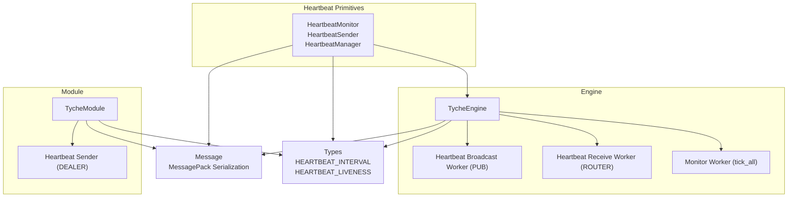
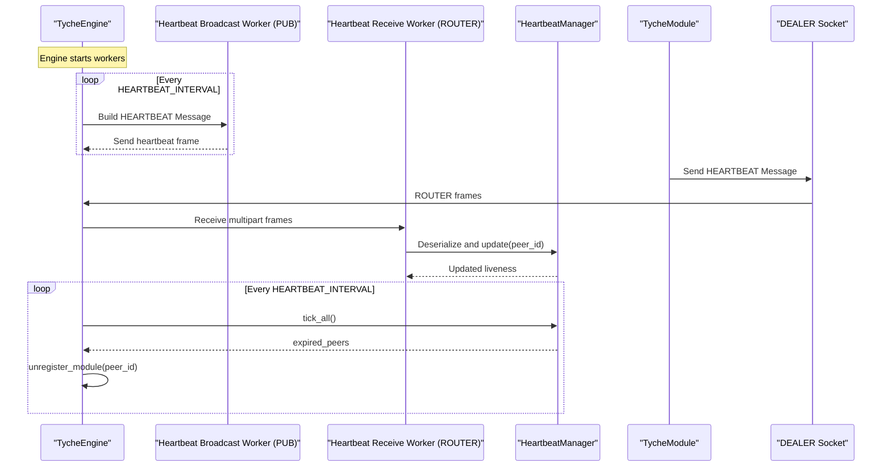
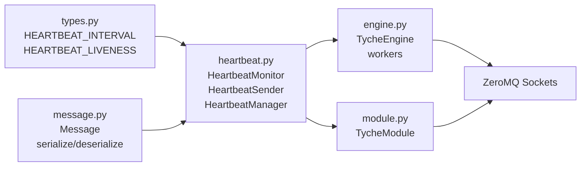

# Heartbeat Management

**Referenced Files in This Document**
- [heartbeat.py](file://src/tyche/heartbeat.py)
- [engine.py](file://src/tyche/engine.py)
- [module.py](file://src/tyche/module.py)
- [types.py](file://src/tyche/types.py)
- [message.py](file://src/tyche/message.py)
- [test_heartbeat.py](file://tests/unit/test_heartbeat.py)
- [test_heartbeat_protocol.py](file://tests/unit/test_heartbeat_protocol.py)
- [run_engine.py](file://examples/run_engine.py)
- [run_module.py](file://examples/run_module.py)
- [README.md](file://README.md)

## Table of Contents
1. [Introduction](#introduction)
2. [Project Structure](#project-structure)
3. [Core Components](#core-components)
4. [Architecture Overview](#architecture-overview)
5. [Detailed Component Analysis](#detailed-component-analysis)
6. [Dependency Analysis](#dependency-analysis)
7. [Performance Considerations](#performance-considerations)
8. [Troubleshooting Guide](#troubleshooting-guide)
9. [Conclusion](#conclusion)
10. [Appendices](#appendices)

## Introduction
This document describes the Heartbeat Management system that implements the Paranoid Pirate pattern for peer monitoring in the Tyche Engine. It explains how the HeartbeatManager class tracks module health, how heartbeats are broadcast and received, and how the tick-based monitoring system detects failures and triggers automatic module unregistration. It also covers heartbeat message format, timing considerations, performance implications, and integration with the engine’s module lifecycle management.

## Project Structure
The heartbeat subsystem spans several modules:
- Heartbeat primitives and managers
- Engine-side workers for broadcasting and receiving heartbeats
- Module-side heartbeat sender
- Message serialization and types
- Tests validating heartbeat behavior and protocol integration
- Examples demonstrating end-to-end usage

**Diagram sources**
- [heartbeat.py:16-142](file://src/tyche/heartbeat.py#L16-L142)
- [engine.py:25-350](file://src/tyche/engine.py#L25-L350)
- [module.py:28-401](file://src/tyche/module.py#L28-L401)
- [message.py:13-168](file://src/tyche/message.py#L13-L168)
- [types.py:9-11](file://src/tyche/types.py#L9-L11)

**Section sources**
- [heartbeat.py:16-142](file://src/tyche/heartbeat.py#L16-L142)
- [engine.py:25-350](file://src/tyche/engine.py#L25-L350)
- [module.py:28-401](file://src/tyche/module.py#L28-L401)
- [types.py:9-11](file://src/tyche/types.py#L9-L11)
- [message.py:13-168](file://src/tyche/message.py#L13-L168)

## Core Components
- HeartbeatMonitor: Tracks a single peer’s liveness with interval, grace period, last-seen time, and liveness countdown.
- HeartbeatSender: Periodically sends heartbeat messages from modules to the engine.
- HeartbeatManager: Manages multiple peers, registers/unregisters modules, updates liveness on receipt, and reports expired peers.
- Engine heartbeat workers: PUB broadcasts and ROUTER receives heartbeats; monitor worker periodically ticks and unregisters expired modules.
- Module heartbeat sender: DEALER socket sends heartbeat messages to the engine’s heartbeat receive endpoint.

Key timing constants:
- HEARTBEAT_INTERVAL: default heartbeat interval in seconds.
- HEARTBEAT_LIVENESS: number of missed heartbeats before considering a peer dead.

**Section sources**
- [heartbeat.py:16-142](file://src/tyche/heartbeat.py#L16-L142)
- [engine.py:281-349](file://src/tyche/engine.py#L281-L349)
- [module.py:376-401](file://src/tyche/module.py#L376-L401)
- [types.py:9-11](file://src/tyche/types.py#L9-L11)

## Architecture Overview
The heartbeat architecture follows the Paranoid Pirate pattern:
- Engine publishes periodic heartbeats to a PUB socket.
- Modules receive heartbeats on a SUB socket (not used for liveness in this implementation).
- Modules send heartbeats to the engine via a DEALER socket bound to the engine’s ROUTER endpoint.
- Engine receives heartbeats on a ROUTER socket, deserializes them, and updates liveness via HeartbeatManager.
- A monitor worker decrements liveness counters on each heartbeat interval and unregisters expired modules.

**Diagram sources**
- [engine.py:281-349](file://src/tyche/engine.py#L281-L349)
- [heartbeat.py:91-142](file://src/tyche/heartbeat.py#L91-L142)
- [module.py:376-401](file://src/tyche/module.py#L376-L401)

## Detailed Component Analysis

### HeartbeatMonitor
Tracks a single peer’s liveness:
- Initializes with interval and liveness, sets last_seen to now.
- update(): resets liveness to HEARTBEAT_LIVENESS and updates last_seen.
- tick(): decrements liveness on expected heartbeat interval.
- is_expired(): true when liveness reaches zero.
- time_since_last(): seconds since last heartbeat.

Initial grace period:
- When constructed with initial_grace_period=True, liveness is doubled to allow a longer initial registration window.

**Section sources**
- [heartbeat.py:16-50](file://src/tyche/heartbeat.py#L16-L50)
- [test_heartbeat.py:9-22](file://tests/unit/test_heartbeat.py#L9-L22)

### HeartbeatSender (Engine)
Periodically emits heartbeat messages to subscribers:
- Builds a Message with msg_type HEARTBEAT and payload containing a timestamp.
- Sends multipart frames: topic "heartbeat" and serialized message.
- Sleeps for HEARTBEAT_INTERVAL between broadcasts.

**Section sources**
- [engine.py:281-305](file://src/tyche/engine.py#L281-L305)
- [message.py:69-112](file://src/tyche/message.py#L69-L112)
- [types.py:67-74](file://src/tyche/types.py#L67-L74)

### HeartbeatSender (Module)
Sends heartbeat messages to the engine:
- Creates a Message with msg_type HEARTBEAT and payload with status "alive".
- Sends serialized message over DEALER socket.
- Sleeps for 0.1s increments HEARTBEAT_INTERVAL times to remain interruptible.

**Section sources**
- [module.py:376-401](file://src/tyche/module.py#L376-L401)
- [message.py:69-112](file://src/tyche/message.py#L69-L112)
- [types.py:67-74](file://src/tyche/types.py#L67-L74)

### HeartbeatManager
Manages multiple peers:
- register(peer_id): creates a HeartbeatMonitor for the peer.
- unregister(peer_id): removes peer from monitoring.
- update(peer_id): records heartbeat arrival; creates monitor if missing.
- tick_all(): decrements liveness for all peers and returns expired IDs.
- get_expired(): returns expired peers without ticking.

Thread-safety:
- Uses a lock to protect internal state and iteration.

**Section sources**
- [heartbeat.py:91-142](file://src/tyche/heartbeat.py#L91-L142)

### Engine Heartbeat Workers
- Heartbeat broadcast worker (PUB): binds to heartbeat_endpoint and sends heartbeat messages every HEARTBEAT_INTERVAL.
- Heartbeat receive worker (ROUTER): binds to heartbeat_receive_endpoint, receives heartbeat frames, deserializes, and calls heartbeat_manager.update(sender).
- Monitor worker: calls tick_all() every HEARTBEAT_INTERVAL and unregisters expired modules.

Integration with module lifecycle:
- On registration, engine calls heartbeat_manager.register(module_id).
- On unregistration, engine calls heartbeat_manager.unregister(module_id).

**Section sources**
- [engine.py:281-349](file://src/tyche/engine.py#L281-L349)
- [engine.py:200-234](file://src/tyche/engine.py#L200-L234)

### Module Heartbeat Integration
- Module connects to heartbeat_receive_endpoint via DEALER socket.
- Starts a background thread that sends heartbeats every HEARTBEAT_INTERVAL.
- Heartbeat messages are serialized and sent to the engine.

**Section sources**
- [module.py:153-178](file://src/tyche/module.py#L153-L178)
- [module.py:376-401](file://src/tyche/module.py#L376-L401)

### Heartbeat Message Format
Heartbeat messages are serialized Message objects with:
- msg_type: HEARTBEAT
- sender: module_id or engine identifier
- event: "heartbeat"
- payload: dictionary containing "status": "alive" (module) or "timestamp": float (engine)

Deserialization:
- deserialize() reconstructs Message from MessagePack bytes.

**Section sources**
- [message.py:69-112](file://src/tyche/message.py#L69-L112)
- [message.py:91-112](file://src/tyche/message.py#L91-L112)
- [types.py:67-74](file://src/tyche/types.py#L67-L74)

### Timing and Expiration Logic
- HEARTBEAT_INTERVAL: default 1.0 seconds.
- HEARTBEAT_LIVENESS: default 3 missed heartbeats before considered dead.
- Initial grace period: HeartbeatMonitor doubles liveness during initial registration to allow a longer window.

Expiration detection:
- tick_all() decrements liveness for each peer.
- is_expired() returns true when liveness reaches zero or below.
- get_expired() enumerates expired peers without ticking.

Failure recovery:
- Monitor worker unregisters expired modules, removing them from the registry and stopping heartbeat monitoring.

**Section sources**
- [types.py:9-11](file://src/tyche/types.py#L9-L11)
- [heartbeat.py:23-45](file://src/tyche/heartbeat.py#L23-L45)
- [heartbeat.py:125-142](file://src/tyche/heartbeat.py#L125-L142)
- [engine.py:341-349](file://src/tyche/engine.py#L341-L349)

### Practical Examples
- Running the engine and module examples demonstrates heartbeat configuration and behavior:
  - Engine endpoints: registration, event, heartbeat out, heartbeat in.
  - Module connects to engine registration endpoint and heartbeat receive endpoint.
  - Heartbeat messages are exchanged; module remains registered while sending heartbeats.

**Section sources**
- [run_engine.py:27-32](file://examples/run_engine.py#L27-L32)
- [run_module.py:28-31](file://examples/run_module.py#L28-L31)
- [test_heartbeat_protocol.py:18-51](file://tests/unit/test_heartbeat_protocol.py#L18-L51)

## Dependency Analysis
The heartbeat system depends on:
- ZeroMQ sockets for PUB/SUB and ROUTER/DEALER patterns.
- MessagePack serialization for cross-language compatibility.
- Typing constants for heartbeat interval and liveness thresholds.
- Threading for concurrent workers in engine and module.

**Diagram sources**
- [types.py:9-11](file://src/tyche/types.py#L9-L11)
- [message.py:69-112](file://src/tyche/message.py#L69-L112)
- [heartbeat.py:16-142](file://src/tyche/heartbeat.py#L16-L142)
- [engine.py:25-350](file://src/tyche/engine.py#L25-L350)
- [module.py:28-401](file://src/tyche/module.py#L28-L401)

**Section sources**
- [types.py:9-11](file://src/tyche/types.py#L9-L11)
- [message.py:69-112](file://src/tyche/message.py#L69-L112)
- [heartbeat.py:16-142](file://src/tyche/heartbeat.py#L16-L142)
- [engine.py:25-350](file://src/tyche/engine.py#L25-L350)
- [module.py:28-401](file://src/tyche/module.py#L28-L401)

## Performance Considerations
- Heartbeat interval trade-offs:
  - Shorter intervals increase network traffic and CPU usage but reduce detection latency.
  - Longer intervals reduce overhead but increase time-to-detection of failures.
- Liveness threshold:
  - Higher liveness increases resilience against transient delays but prolongs failure detection.
- Serialization overhead:
  - MessagePack is efficient; ensure payloads remain minimal.
- Threading:
  - Heartbeat workers are daemon threads; monitor worker sleeps for HEARTBEAT_INTERVAL between ticks.
- Grace period:
  - Initial doubled liveness reduces premature expirations during module startup.

[No sources needed since this section provides general guidance]

## Troubleshooting Guide
Common issues and diagnostics:
- Module expires unexpectedly:
  - Verify module heartbeat thread is running and sending heartbeats.
  - Confirm engine heartbeat receive endpoint is reachable and worker is active.
  - Check for network partitions or timeouts preventing heartbeat delivery.
- Heartbeat messages not received:
  - Inspect ROUTER receive worker logs for exceptions.
  - Validate message serialization/deserialization and message type.
- Excessive false positives:
  - Increase HEARTBEAT_LIVENESS or HEARTBEAT_INTERVAL to tolerate transient delays.
- Performance impact:
  - Reduce heartbeat frequency or optimize module heartbeat send loop.

Validation tests:
- HeartbeatMonitor behavior under grace period and update/reset.
- HeartbeatSender correctness and timing.
- End-to-end heartbeat protocol ensuring modules stay alive with heartbeats and expire without them.
- HeartbeatManager expiration and liveness reset behavior.

**Section sources**
- [test_heartbeat.py:9-91](file://tests/unit/test_heartbeat.py#L9-L91)
- [test_heartbeat_protocol.py:18-119](file://tests/unit/test_heartbeat_protocol.py#L18-L119)
- [engine.py:307-339](file://src/tyche/engine.py#L307-L339)
- [module.py:376-401](file://src/tyche/module.py#L376-L401)

## Conclusion
The Heartbeat Management system implements a robust, Paranoid Pirate-inspired monitoring mechanism. HeartbeatManager tracks module liveness with configurable intervals and liveness thresholds, while engine workers broadcast and receive heartbeats and monitor expiration. Proper configuration of heartbeat intervals and liveness thresholds balances reliability and performance. Integration with the engine’s module lifecycle ensures automatic unregistration of failed modules, maintaining system stability.

[No sources needed since this section summarizes without analyzing specific files]

## Appendices

### Heartbeat Message Schema
- msg_type: HEARTBEAT
- sender: string (module_id or engine)
- event: "heartbeat"
- payload: dictionary
  - Module heartbeat: {"status": "alive"}
  - Engine heartbeat: {"timestamp": float}

**Section sources**
- [message.py:69-112](file://src/tyche/message.py#L69-L112)
- [engine.py:291-296](file://src/tyche/engine.py#L291-L296)
- [module.py:383-388](file://src/tyche/module.py#L383-L388)

### Configuration Reference
- HEARTBEAT_INTERVAL: default 1.0 seconds
- HEARTBEAT_LIVENESS: default 3 missed heartbeats
- Grace period: doubled liveness during initial registration

**Section sources**
- [types.py:9-11](file://src/tyche/types.py#L9-L11)
- [heartbeat.py:23-31](file://src/tyche/heartbeat.py#L23-L31)

### Example Endpoints
- Engine:
  - Registration: tcp://127.0.0.1:5555
  - Events: tcp://127.0.0.1:5556
  - Heartbeat out: tcp://127.0.0.1:5558
  - Heartbeat in: tcp://127.0.0.1:5559
- Module:
  - Connects to engine registration endpoint
  - Sends heartbeats to heartbeat receive endpoint

**Section sources**
- [run_engine.py:27-32](file://examples/run_engine.py#L27-L32)
- [run_module.py:28-31](file://examples/run_module.py#L28-L31)