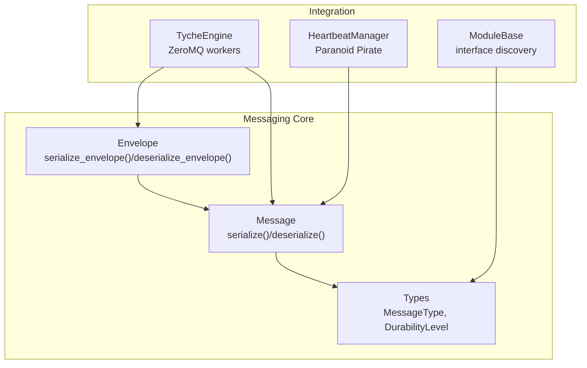
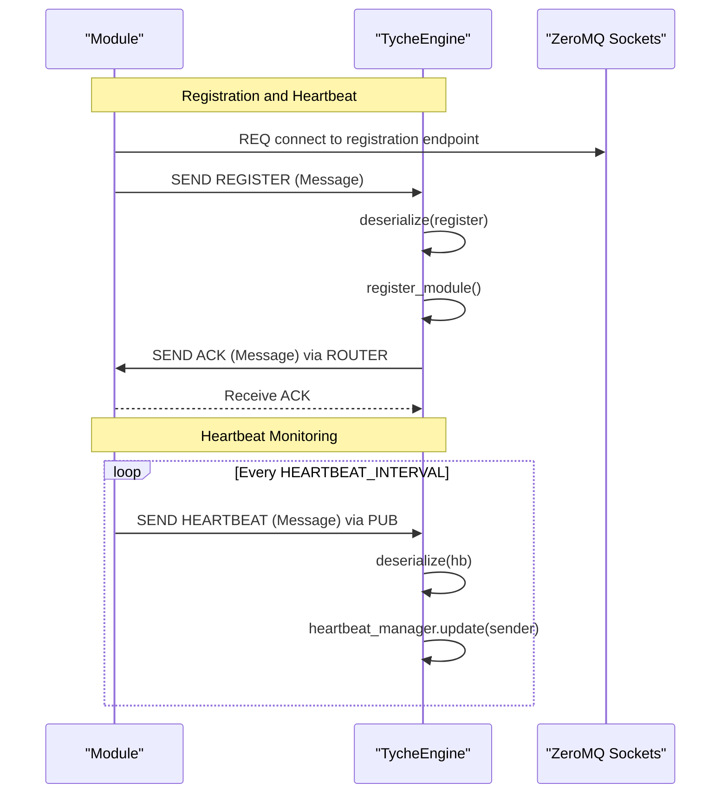
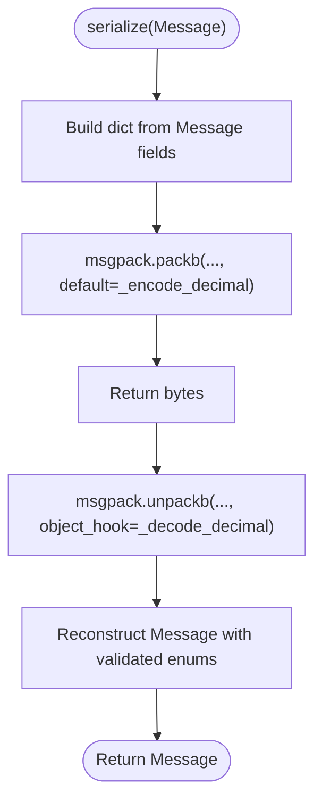
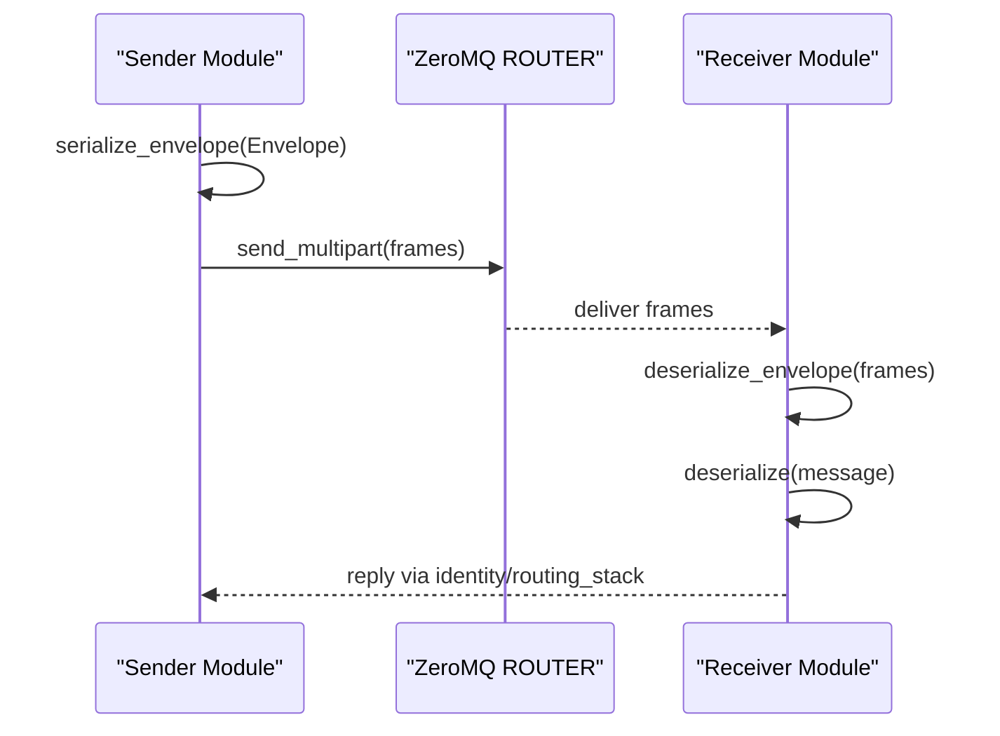
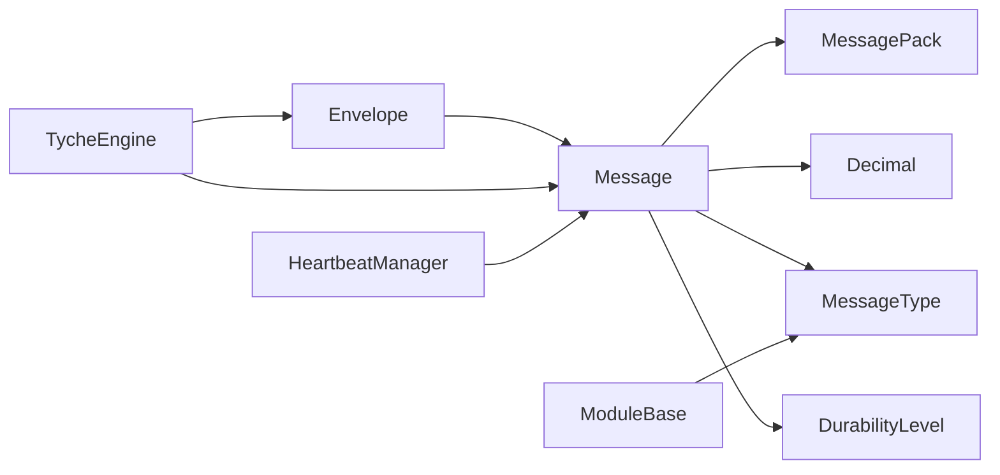

# Message System

<cite>
**Referenced Files in This Document**
- [message.py](file://src/tyche/message.py)
- [types.py](file://src/tyche/types.py)
- [engine.py](file://src/tyche/engine.py)
- [heartbeat.py](file://src/tyche/heartbeat.py)
- [module_base.py](file://src/tyche/module_base.py)
- [test_message.py](file://tests/unit/test_message.py)
- [README.md](file://README.md)
</cite>

## Table of Contents
1. [Introduction](#introduction)
2. [Project Structure](#project-structure)
3. [Core Components](#core-components)
4. [Architecture Overview](#architecture-overview)
5. [Detailed Component Analysis](#detailed-component-analysis)
6. [Dependency Analysis](#dependency-analysis)
7. [Performance Considerations](#performance-considerations)
8. [Troubleshooting Guide](#troubleshooting-guide)
9. [Conclusion](#conclusion)

## Introduction
This document explains the Tyche Engine’s message and serialization system. It covers the Message class structure, the serialization framework using MessagePack with Decimal support, the ZeroMQ Envelope system for routing, and the MessageType enumeration that defines communication patterns. It also documents the serialize() and deserialize() functions, their parameters and error handling, and provides practical examples of creating messages, handling different payload types, and working with envelopes. Finally, it addresses type safety mechanisms, validation processes, and performance considerations, and explains how messages flow from creation to delivery.

## Project Structure
The message system spans several modules:
- Message and serialization logic: src/tyche/message.py
- Core type definitions (MessageType, DurabilityLevel, etc.): src/tyche/types.py
- Engine integration and ZeroMQ usage: src/tyche/engine.py and src/tyche/heartbeat.py
- Module interface conventions: src/tyche/module_base.py
- Unit tests validating behavior: tests/unit/test_message.py
- High-level architecture and communication patterns: README.md

**Diagram sources**
- [message.py:13-168](file://src/tyche/message.py#L13-L168)
- [types.py:67-102](file://src/tyche/types.py#L67-L102)
- [engine.py:25-350](file://src/tyche/engine.py#L25-L350)
- [heartbeat.py:16-142](file://src/tyche/heartbeat.py#L16-L142)
- [module_base.py:10-120](file://src/tyche/module_base.py#L10-L120)

**Section sources**
- [message.py:1-168](file://src/tyche/message.py#L1-L168)
- [types.py:1-102](file://src/tyche/types.py#L1-L102)
- [engine.py:1-350](file://src/tyche/engine.py#L1-L350)
- [heartbeat.py:1-142](file://src/tyche/heartbeat.py#L1-L142)
- [module_base.py:1-120](file://src/tyche/module_base.py#L1-L120)
- [README.md:24-103](file://README.md#L24-L103)

## Core Components
- Message: The application-level message container with typed fields for routing and payload.
- Envelope: ZeroMQ multipart framing for routing and identity.
- Serialization: MessagePack-based encode/decode with Decimal preservation.
- MessageType: Enumeration of internal message categories.
- DurabilityLevel: Event persistence guarantees.
- Heartbeat integration: Engine and modules exchange heartbeat messages using the same serialization.

Key responsibilities:
- Message: encapsulates msg_type, sender, event, payload, recipient, durability, timestamp, correlation_id.
- Envelope: wraps identity and routing stack around a serialized Message.
- Serializer: converts Message to/from bytes with Decimal support.
- Engine: uses serialization and envelopes for registration, heartbeat, and event routing.

**Section sources**
- [message.py:13-112](file://src/tyche/message.py#L13-L112)
- [message.py:37-168](file://src/tyche/message.py#L37-L168)
- [types.py:67-102](file://src/tyche/types.py#L67-L102)

## Architecture Overview
The message system integrates with ZeroMQ sockets across the engine and modules:
- Registration uses ROUTER/REQ for handshake and interface discovery.
- Heartbeat uses PUB/SUB for liveness monitoring.
- Event distribution uses XPUB/XSUB proxy for pub-sub forwarding.
- Direct P2P uses DEALER/ROUTER with envelopes for routing and identity.

**Diagram sources**
- [engine.py:121-177](file://src/tyche/engine.py#L121-L177)
- [engine.py:281-349](file://src/tyche/engine.py#L281-L349)
- [heartbeat.py:52-89](file://src/tyche/heartbeat.py#L52-L89)
- [heartbeat.py:91-142](file://src/tyche/heartbeat.py#L91-L142)

## Detailed Component Analysis

### Message Class and Fields
The Message dataclass defines the canonical message structure:
- msg_type: MessageType discriminator for routing and semantics.
- sender: Module ID of origin.
- event: Event name or interface being invoked.
- payload: Arbitrary dictionary of Any values.
- recipient: Optional target module ID for directed messages.
- durability: DurabilityLevel for persistence behavior.
- timestamp: Optional creation timestamp.
- correlation_id: Optional correlation ID for request/response tracking.

Type safety and validation:
- msg_type is validated against MessageType during deserialization.
- durability defaults to ASYNC_FLUSH and is validated during deserialization.
- Optional fields are handled via get() with defaults.

Practical usage:
- Create a Message with required fields and optional extras.
- Serialize to bytes for transport.
- Deserialize to reconstruct the Message with Decimal precision.

**Section sources**
- [message.py:13-35](file://src/tyche/message.py#L13-L35)
- [types.py:67-74](file://src/tyche/types.py#L67-L74)
- [types.py:60-65](file://src/tyche/types.py#L60-L65)

### Serialization Framework with MessagePack and Decimal Support
The serializer uses MessagePack with custom hooks:
- Encoder (_encode_decimal): Converts Decimal to a tagged dict and handles Enum values and bytes.
- Decoder (_decode_decimal): Restores Decimal from tagged dict.
- serialize(): Packs Message fields into a dict and encodes with default hook.
- deserialize(): Unpacks bytes and reconstructs Message, validating enums.

Decimal precision:
- Decimal values are preserved through serialization and restored to Decimal on decode.

Error handling:
- _encode_decimal raises TypeError for unsupported types.
- deserialize validates MessageType and DurabilityLevel construction.

**Diagram sources**
- [message.py:69-111](file://src/tyche/message.py#L69-L111)
- [message.py:51-66](file://src/tyche/message.py#L51-L66)

**Section sources**
- [message.py:51-111](file://src/tyche/message.py#L51-L111)
- [test_message.py:77-91](file://tests/unit/test_message.py#L77-L91)

### Envelope System for ZeroMQ Routing
The Envelope wraps a Message with ZeroMQ routing metadata:
- identity: Client identity frame from ROUTER socket.
- routing_stack: List of routing frames for reply path.
- serialize_envelope(): Builds multipart frames with optional routing stack and delimiter.
- deserialize_envelope(): Parses multipart frames into Envelope, handling missing delimiter.

Routing behavior:
- If routing_stack is present, an empty delimiter separates routing frames from identity and message.
- Supports simple format without routing stack.

**Diagram sources**
- [message.py:114-168](file://src/tyche/message.py#L114-L168)

**Section sources**
- [message.py:37-49](file://src/tyche/message.py#L37-L49)
- [message.py:114-168](file://src/tyche/message.py#L114-L168)
- [test_message.py:109-162](file://tests/unit/test_message.py#L109-L162)

### MessageType Enumeration and Communication Patterns
MessageType enumerates internal message categories:
- COMMAND, EVENT, HEARTBEAT, REGISTER, ACK.

These types map to communication patterns:
- Registration: MODULE <-> ENGINE using ROUTER/REQ with REGISTER and ACK.
- Heartbeat: ENGINE -> MODULES using PUB/SUB with HEARTBEAT.
- Events: MODULES publish to XPUB/XSUB proxy; Engine forwards via PUB/SUB.
- Direct P2P: DEALER/ROUTER with envelopes and identity frames.

Validation:
- deserialize constructs MessageType and DurabilityLevel from stored values, ensuring type safety.

**Section sources**
- [types.py:67-74](file://src/tyche/types.py#L67-L74)
- [engine.py:144-177](file://src/tyche/engine.py#L144-L177)
- [engine.py:281-349](file://src/tyche/engine.py#L281-L349)
- [README.md:28-36](file://README.md#L28-L36)

### Practical Examples and Usage Patterns
Creating and serializing messages:
- Construct a Message with msg_type, sender, event, payload, and optional fields.
- Serialize to bytes for network transport.
- Deserialize bytes back to Message.

Handling different payload types:
- Primitive types, lists, dicts, and Decimal values are supported.
- Decimal precision is preserved end-to-end.

Working with envelopes:
- For direct P2P, wrap Message in Envelope with identity and optional routing_stack.
- Serialize envelope frames and send via ZeroMQ multipart.

Module interface conventions:
- Handlers follow naming patterns (on_*, ack_*, whisper_*, on_common_*) discovered at runtime.
- These patterns define routing semantics and durability defaults.

**Section sources**
- [test_message.py:16-57](file://tests/unit/test_message.py#L16-L57)
- [test_message.py:77-91](file://tests/unit/test_message.py#L77-L91)
- [module_base.py:48-84](file://src/tyche/module_base.py#L48-L84)
- [README.md:64-77](file://README.md#L64-L77)

## Dependency Analysis
The message system depends on:
- MessagePack for efficient binary serialization.
- Decimal for precise numeric calculations.
- ZeroMQ for transport and routing.
- Enumerations for type safety.

**Diagram sources**
- [message.py:1-11](file://src/tyche/message.py#L1-L11)
- [types.py:60-74](file://src/tyche/types.py#L60-L74)
- [engine.py:10-20](file://src/tyche/engine.py#L10-L20)
- [heartbeat.py:12-13](file://src/tyche/heartbeat.py#L12-L13)
- [module_base.py:7](file://src/tyche/module_base.py#L7)

**Section sources**
- [message.py:1-11](file://src/tyche/message.py#L1-L11)
- [types.py:60-74](file://src/tyche/types.py#L60-L74)
- [engine.py:10-20](file://src/tyche/engine.py#L10-L20)
- [heartbeat.py:12-13](file://src/tyche/heartbeat.py#L12-L13)
- [module_base.py:7](file://src/tyche/module_base.py#L7)

## Performance Considerations
- MessagePack provides compact binary encoding with minimal overhead.
- Decimal preservation avoids floating-point rounding errors in financial computations.
- Durability levels allow tuning between latency and persistence guarantees.
- ZeroMQ multipart framing enables efficient routing without additional parsing overhead.
- Engine workers use polling and non-blocking sockets to minimize latency.

[No sources needed since this section provides general guidance]

## Troubleshooting Guide
Common issues and resolutions:
- Unsupported types in payload: _encode_decimal raises TypeError for non-Decimal/Enum/bytes types. Ensure payloads contain supported types or convert them.
- Missing or malformed envelope frames: deserialize_envelope handles missing delimiter and IndexError by falling back to simple format. Verify frame count and delimiter presence.
- Invalid MessageType/DurabilityLevel: deserialize validates enum construction; ensure serialized values match expected enumerations.
- Heartbeat liveness: HeartbeatManager tracks missed heartbeats; investigate network connectivity or module responsiveness if peers expire.

**Section sources**
- [message.py:51-59](file://src/tyche/message.py#L51-L59)
- [message.py:140-167](file://src/tyche/message.py#L140-L167)
- [heartbeat.py:91-142](file://src/tyche/heartbeat.py#L91-L142)

## Conclusion
The Tyche Engine’s message and serialization system provides a robust, type-safe foundation for distributed communication. MessagePack with Decimal support ensures precise numeric handling, while the Envelope system enables flexible ZeroMQ routing. MessageType and DurabilityLevel define clear semantics and performance trade-offs. Together, these components enable scalable event-driven workflows across heterogeneous modules with strong reliability guarantees.