# Multi-Asset Trading System

<cite>
**Referenced Files in This Document**
- [README.md](file://README.md)
- [engine.py](file://src/tyche/engine.py)
- [__init__.py](file://src/tyche/__init__.py)
- [trading/__init__.py](file://src/tyche/trading/__init__.py)
- [run_engine.py](file://examples/run_engine.py)
- [order.py](file://src/tyche/trading/models/order.py)
- [instrument.py](file://src/tyche/trading/models/instrument.py)
- [account.py](file://src/tyche/trading/models/account.py)
- [position.py](file://src/tyche/trading/models/position.py)
- [base.py](file://src/tyche/trading/gateway/base.py)
- [base.py](file://src/tyche/trading/strategy/base.py)
- [module.py](file://src/tyche/trading/risk/module.py)
- [module.py](file://src/tyche/trading/oms/module.py)
- [module.py](file://src/tyche/trading/portfolio/module.py)
- [events.py](file://src/tyche/trading/events.py)
</cite>

## Table of Contents
1. [Introduction](#introduction)
2. [Project Structure](#project-structure)
3. [Core Components](#core-components)
4. [Architecture Overview](#architecture-overview)
5. [Detailed Component Analysis](#detailed-component-analysis)
6. [Trading Domain Models](#trading-domain-models)
7. [Trading Workflow](#trading-workflow)
8. [Risk Management](#risk-management)
9. [Portfolio Management](#portfolio-management)
10. [Gateway Integration](#gateway-integration)
11. [Performance Considerations](#performance-considerations)
12. [Deployment and Operations](#deployment-and-operations)
13. [Conclusion](#conclusion)

## Introduction

The Multi-Asset Trading System is a high-performance distributed event-driven framework built on ZeroMQ for real-time automated trading. It provides a comprehensive infrastructure for multi-asset trading with support for live trading, backtesting, and research workflows. The system is designed around a central engine that orchestrates multiple specialized modules for order management, risk control, portfolio tracking, and market data processing.

The framework follows a modular architecture where each component operates as an independent module that communicates through a standardized event bus. This design enables fault isolation, scalability, and easy integration of new trading venues and strategies.

## Project Structure

The project follows a well-organized structure that separates concerns across different domains:

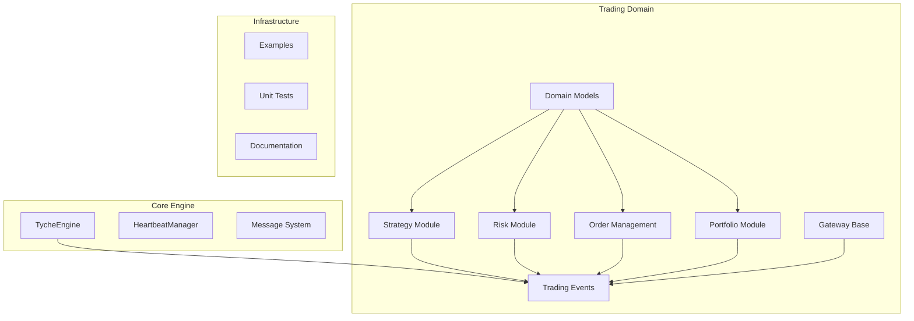

**Diagram sources**
- [engine.py:27-456](file://src/tyche/engine.py#L27-L456)
- [trading/__init__.py:1-14](file://src/tyche/trading/__init__.py#L1-L14)

**Section sources**
- [README.md:1-364](file://README.md#L1-L364)
- [__init__.py:1-61](file://src/tyche/__init__.py#L1-L61)

## Core Components

### TycheEngine - Central Broker

The TycheEngine serves as the central orchestrator for the entire trading system. It manages module registration, event routing, and heartbeat monitoring using ZeroMQ socket patterns.

Key responsibilities include:
- **Module Registration**: Handles module onboarding via REQ-ROUTER pattern
- **Event Routing**: Manages XPUB/XSUB proxy for event distribution
- **Heartbeat Monitoring**: Implements Paranoid Pirate pattern for reliability
- **Load Balancing**: Uses LRU queue pattern for worker assignment

The engine operates with multiple worker threads for concurrent processing of different responsibilities including registration, event proxying, heartbeat management, and administrative queries.

**Section sources**
- [engine.py:27-456](file://src/tyche/engine.py#L27-L456)

### Message System

The framework implements a robust message serialization system using MessagePack for efficient binary serialization. Messages include comprehensive metadata for tracking and debugging.

Message components:
- **Event Name**: Topic identifier for routing
- **Event ID**: Unique UUID for idempotency
- **Timestamp**: Microsecond precision
- **Source Module**: Sender identification
- **Data Payload**: Serialized event data
- **Processing Hints**: Durability and priority settings

**Section sources**
- [engine.py:11-22](file://src/tyche/engine.py#L11-L22)

## Architecture Overview

The system employs ZeroMQ socket patterns optimized for trading scenarios:

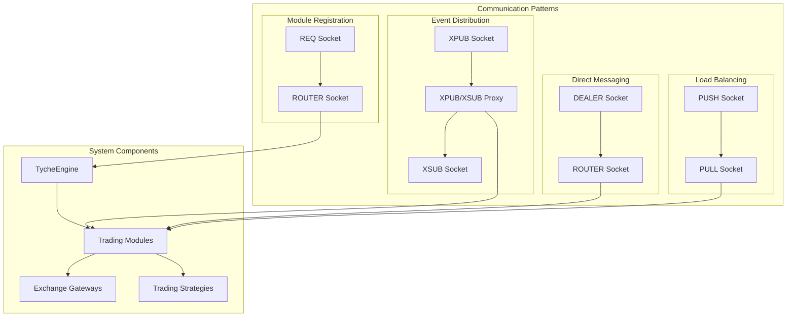

**Diagram sources**
- [README.md:26-43](file://README.md#L26-L43)
- [engine.py:136-194](file://src/tyche/engine.py#L136-L194)

The architecture supports multiple communication patterns:
- **Request-Reply**: Module registration and administrative queries
- **Publish-Subscribe**: Event broadcasting and system-wide notifications
- **Pipeline**: Load-balanced task distribution
- **Dealer-Router**: Direct peer-to-peer messaging

**Section sources**
- [README.md:24-102](file://README.md#L24-L102)

## Detailed Component Analysis

### Trading Strategy Framework

The strategy module provides an abstract base class for implementing trading algorithms with comprehensive market data processing capabilities.

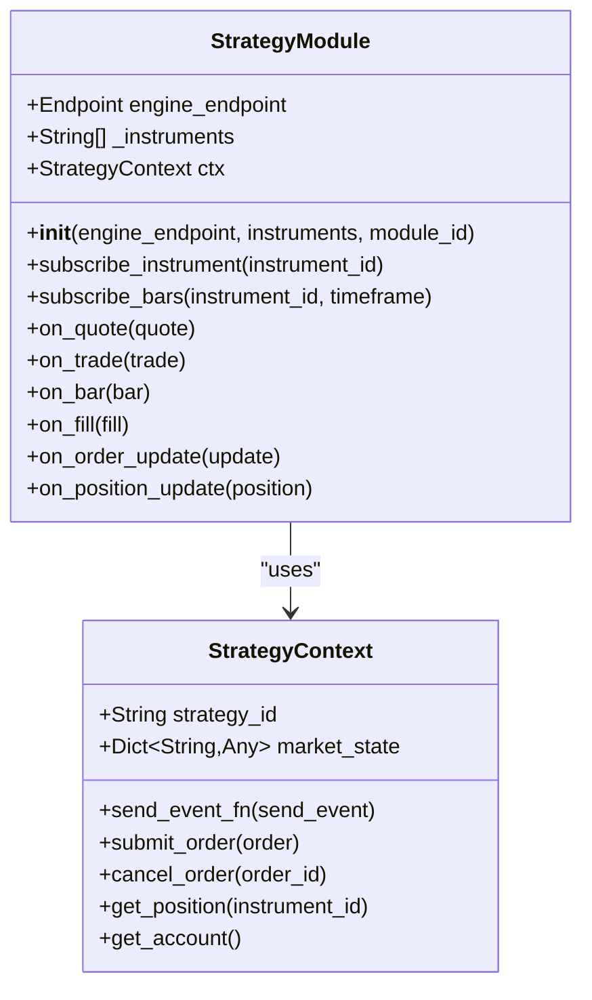

**Diagram sources**
- [base.py:22-176](file://src/tyche/trading/strategy/base.py#L22-L176)

**Section sources**
- [base.py:1-176](file://src/tyche/trading/strategy/base.py#L1-L176)

### Risk Management Module

The risk module acts as a pre-trade gatekeeper, evaluating orders against configurable risk rules before allowing execution.

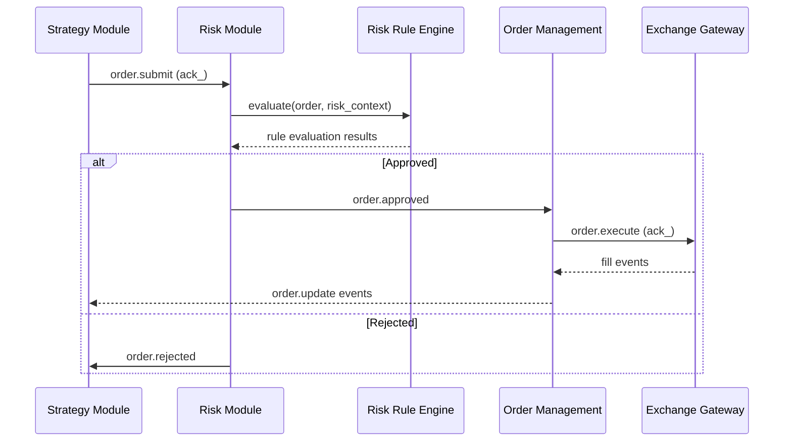

**Diagram sources**
- [module.py:62-104](file://src/tyche/trading/risk/module.py#L62-L104)

**Section sources**
- [module.py:1-110](file://src/tyche/trading/risk/module.py#L1-L110)

### Order Management System

The OMS maintains order lifecycle state and coordinates execution across multiple trading venues.


**Diagram sources**
- [module.py:64-140](file://src/tyche/trading/oms/module.py#L64-L140)

**Section sources**
- [module.py:1-160](file://src/tyche/trading/oms/module.py#L1-L160)

## Trading Domain Models

### Order Lifecycle Management

The trading system models orders with comprehensive lifecycle tracking supporting various order types and execution states.

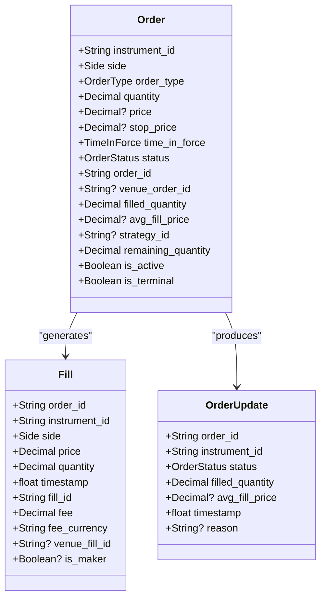

**Diagram sources**
- [order.py:16-183](file://src/tyche/trading/models/order.py#L16-L183)

**Section sources**
- [order.py:1-183](file://src/tyche/trading/models/order.py#L1-L183)

### Position and Account Tracking

Portfolio management encompasses position tracking and account state management with comprehensive P&L calculations.

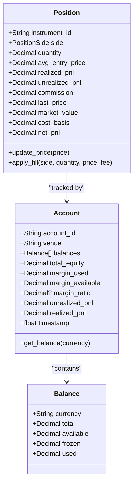

**Diagram sources**
- [position.py:10-119](file://src/tyche/trading/models/position.py#L10-L119)
- [account.py:8-90](file://src/tyche/trading/models/account.py#L8-L90)

**Section sources**
- [position.py:1-119](file://src/tyche/trading/models/position.py#L1-L119)
- [account.py:1-90](file://src/tyche/trading/models/account.py#L1-L90)

### Instrument Specification

The system supports multi-asset trading through a flexible instrument identification system.

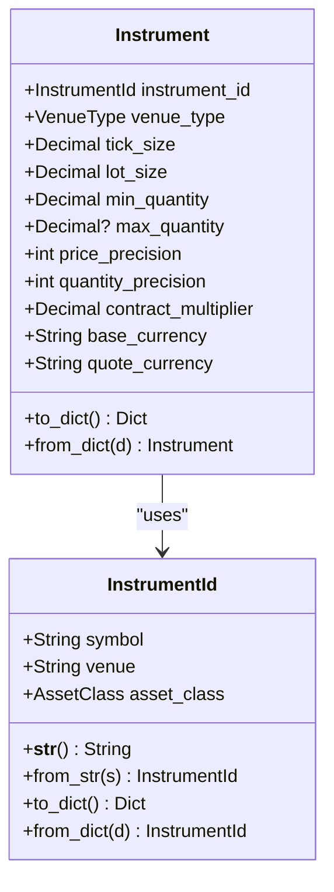

**Diagram sources**
- [instrument.py:10-101](file://src/tyche/trading/models/instrument.py#L10-L101)

**Section sources**
- [instrument.py:1-101](file://src/tyche/trading/models/instrument.py#L1-L101)

## Trading Workflow

The complete trading workflow demonstrates the end-to-end flow from strategy generation to order execution and position management.

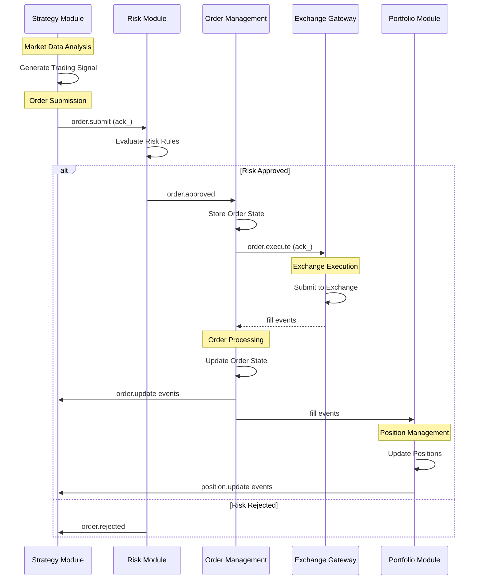

**Diagram sources**
- [events.py:23-49](file://src/tyche/trading/events.py#L23-L49)
- [base.py:115-138](file://src/tyche/trading/strategy/base.py#L115-L138)
- [module.py:62-104](file://src/tyche/trading/risk/module.py#L62-L104)
- [module.py:64-140](file://src/tyche/trading/oms/module.py#L64-L140)
- [module.py:84-128](file://src/tyche/trading/portfolio/module.py#L84-L128)

**Section sources**
- [events.py:1-79](file://src/tyche/trading/events.py#L1-L79)

## Risk Management

The risk management system provides configurable rule enforcement with real-time context tracking and dynamic rule addition capabilities.

### Risk Rule Engine

The risk system evaluates orders against multiple criteria including position limits, volatility constraints, and custom business rules. Rules can be dynamically added or modified at runtime.

Key features:
- **Configurable Rules**: Support for position limits, notional exposure, and custom logic
- **Real-time Context**: Maintains current position state and trading statistics
- **Dynamic Evaluation**: Runtime rule modification without system restart
- **Comprehensive Logging**: Detailed audit trail for compliance and debugging

**Section sources**
- [module.py:1-110](file://src/tyche/trading/risk/module.py#L1-L110)

## Portfolio Management

The portfolio module provides comprehensive position tracking and P&L calculation across all instruments and venues.

### Position Management

Positions are tracked at the instrument level with support for:
- **Multi-position Support**: Long and short positions simultaneously
- **Real-time P&L Calculation**: Mark-to-market valuation using mid-prices
- **Commission Tracking**: Accurate cost accounting for all trades
- **Cross-asset Support**: Unified tracking across equities, futures, and crypto

### Account Management

Account state includes:
- **Multi-currency Support**: Separate tracking for base and quote currencies
- **Margin Calculations**: Real-time margin requirements and utilization
- **Equity Tracking**: Total account value with realized and unrealized gains
- **Performance Metrics**: Comprehensive P&L reporting and analytics

**Section sources**
- [module.py:1-129](file://src/tyche/trading/portfolio/module.py#L1-L129)

## Gateway Integration

Gateway modules provide venue-specific connectivity while maintaining standardized interfaces for the trading system.

### Gateway Architecture

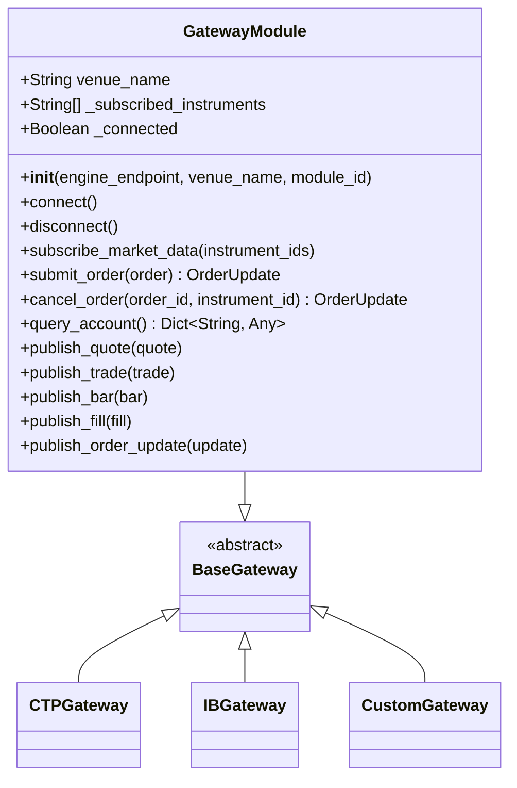

**Diagram sources**
- [base.py:22-192](file://src/tyche/trading/gateway/base.py#L22-L192)

**Section sources**
- [base.py:1-192](file://src/tyche/trading/gateway/base.py#L1-L192)

## Performance Considerations

The system is optimized for high-frequency trading with several performance-critical design decisions:

### Async Persistence Architecture

The framework implements an innovative async persistence mechanism that maintains sub-microsecond hot-path latency while ensuring data durability:

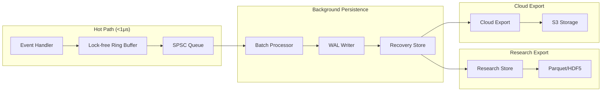

**Diagram sources**
- [README.md:108-131](file://README.md#L108-L131)

### ZeroMQ Socket Patterns

The system leverages optimal ZeroMQ patterns for different use cases:
- **REQ-ROUTER**: Reliable module registration with automatic retry
- **XPUB/XSUB**: Efficient event broadcasting to multiple subscribers
- **DEALER-ROUTER**: Low-latency direct messaging between modules
- **PUSH-PULL**: Natural load balancing for worker distribution

**Section sources**
- [README.md:197-205](file://README.md#L197-L205)

## Deployment and Operations

### Engine Configuration

The engine requires minimal configuration with sensible defaults for most deployment scenarios:

```mermaid
graph TB
subgraph "Network Configuration"
REG[Registration Endpoint]
EVT[Event Endpoints]
HB[Heartbeat Endpoints]
ADM[Admin Endpoint]
end
subgraph "Engine Operation"
START[Engine.run()]
STOP[Engine.stop()]
STATUS[Engine Status Queries]
end
REG --> START
EVT --> START
HB --> START
ADM --> START
START --> STOP
START --> STATUS
```

**Diagram sources**
- [run_engine.py:30-55](file://examples/run_engine.py#L30-L55)

### Module Lifecycle Management

The system implements comprehensive module lifecycle management with automatic recovery and monitoring:

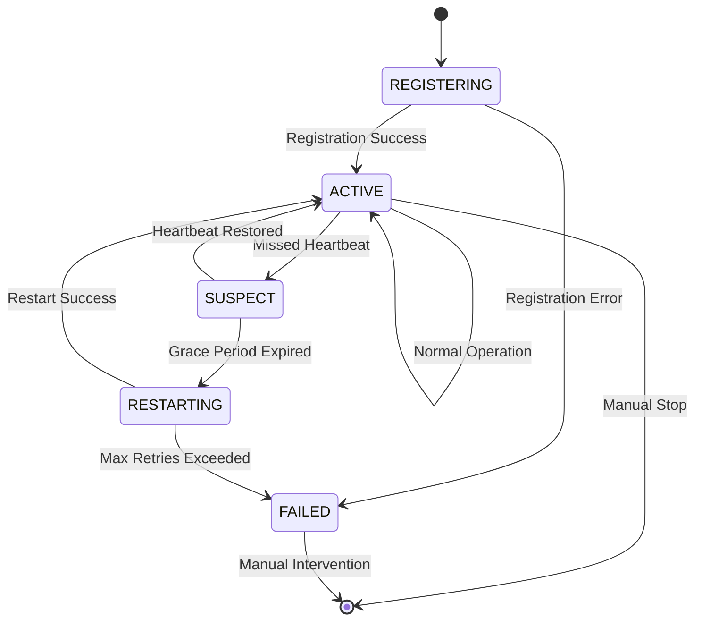

**Diagram sources**
- [README.md:225-247](file://README.md#L225-L247)

**Section sources**
- [run_engine.py:1-59](file://examples/run_engine.py#L1-L59)
- [README.md:206-247](file://README.md#L206-L247)

## Conclusion

The Multi-Asset Trading System represents a sophisticated, production-ready framework for automated trading with several key strengths:

### Architectural Excellence

The system demonstrates exceptional architectural design with clear separation of concerns, robust error handling, and comprehensive monitoring capabilities. The modular approach enables easy extension and maintenance while maintaining system stability.

### Performance Optimization

Through careful selection of ZeroMQ socket patterns and implementation of async persistence, the system achieves sub-microsecond latency for critical operations while maintaining full data durability and recovery capabilities.

### Scalability and Reliability

The framework supports horizontal scaling across multiple engines and venues, with built-in fault tolerance and automatic recovery mechanisms. The Paranoid Pirate heartbeat pattern ensures reliable operation even under adverse network conditions.

### Comprehensive Trading Infrastructure

From basic market data handling to advanced risk management and portfolio tracking, the system provides a complete trading infrastructure suitable for both live trading and research/backtesting workflows.

The modular design, extensive documentation, and comprehensive testing suite make this framework an excellent foundation for building sophisticated trading systems with confidence in reliability and performance.