# Multi-Asset Trading System

<cite>
**Referenced Files in This Document**
- [README.md](file://README.md)
- [engine.py](file://src/tyche/engine.py)
- [__init__.py](file://src/tyche/__init__.py)
- [__init__.py](file://src/modules/trading/__init__.py)
- [gateway.py](file://src/modules/trading/gateway/ctp/gateway.py)
- [live.py](file://src/modules/trading/gateway/ctp/live.py)
- [sim.py](file://src/modules/trading/gateway/ctp/sim.py)
- [state_machine.py](file://src/modules/trading/gateway/ctp/state_machine.py)
- [__init__.py](file://src/modules/trading/gateway/ctp/__init__.py)
- [recorder.py](file://src/modules/trading/store/recorder.py)
- [replay.py](file://src/modules/trading/store/replay.py)
- [clock.py](file://src/modules/trading/clock/clock.py)
- [order_store.py](file://src/modules/trading/oms/order_store.py)
- [tick.py](file://src/modules/trading/models/tick.py)
- [enums.py](file://src/modules/trading/models/enums.py)
- [events.py](file://src/modules/trading/events.py)
- [run_engine.py](file://examples/run_engine.py)
- [order.py](file://src/modules/trading/models/order.py)
- [instrument.py](file://src/modules/trading/models/instrument.py)
- [account.py](file://src/modules/trading/models/account.py)
- [position.py](file://src/modules/trading/models/position.py)
- [base.py](file://src/modules/trading/gateway/base.py)
- [base.py](file://src/modules/trading/strategy/base.py)
- [module.py](file://src/modules/trading/risk/module.py)
- [module.py](file://src/modules/trading/oms/module.py)
- [module.py](file://src/modules/trading/portfolio/module.py)
- [backend.py](file://src/modules/trading/persistence/backend.py)
- [clickhouse_backend.py](file://src/modules/trading/persistence/clickhouse_backend.py)
- [jsonl_backend.py](file://src/modules/trading/persistence/jsonl_backend.py)
- [schema.py](file://src/modules/trading/persistence/schema.py)
</cite>

## Update Summary
**Changes Made**
- Enhanced CTP gateway with sophisticated connection state machine featuring exponential backoff and auto-reconnect
- Added comprehensive persistence layer with ClickHouse and JSONL backends for event storage
- Integrated state machine into gateway lifecycle management for improved reliability
- Enhanced position handling with accumulator-based aggregation for better performance
- Improved order submission with full CTP protocol compliance including time-in-force mapping
- Added advanced order types including STOP and STOP_LIMIT with comprehensive CTP protocol mapping
- Integrated Offset enum support for precise position management (OPEN/CLOSE/CLOSE_TODAY/CLOSE_YESTERDAY)
- Implemented comprehensive error event publishing system for better observability

## Table of Contents
1. [Introduction](#introduction)
2. [Project Structure](#project-structure)
3. [Core Components](#core-components)
4. [Architecture Overview](#architecture-overview)
5. [Detailed Component Analysis](#detailed-component-analysis)
6. [Trading Domain Models](#trading-domain-models)
7. [Trading Workflow](#trading-workflow)
8. [Risk Management](#risk-management)
9. [Portfolio Management](#portfolio-management)
10. [Gateway Integration](#gateway-integration)
11. [CTP Gateway Implementation](#ctp-gateway-implementation)
12. [Advanced Order Management](#advanced-order-management)
13. [Connection State Management](#connection-state-management)
14. [Error Handling and Observability](#error-handling-and-observability)
15. [Event Persistence Layer](#event-persistence-layer)
16. [Data Recording and Replay](#data-recording-and-replay)
17. [Performance Considerations](#performance-considerations)
18. [Deployment and Operations](#deployment-and-operations)
19. [Conclusion](#conclusion)

## Introduction

The Multi-Asset Trading System is a high-performance distributed event-driven framework built on ZeroMQ for real-time automated trading. It provides a comprehensive infrastructure for multi-asset trading with support for live trading, backtesting, and research workflows. The system is designed around a central engine that orchestrates multiple specialized modules for order management, risk control, portfolio tracking, and market data processing.

**Updated** The system now includes comprehensive support for China Trading Platform (CTP) with sophisticated connection state management, advanced order types, comprehensive error handling, and a complete event persistence layer for production-grade trading infrastructure.

## Project Structure

The project follows a well-organized structure that separates concerns across different domains with the updated directory layout:

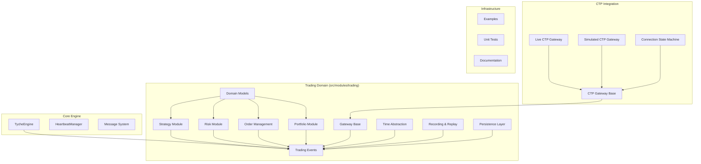

**Diagram sources**
- [engine.py:27-456](file://src/tyche/engine.py#L27-L456)
- [__init__.py:1-14](file://src/modules/trading/__init__.py#L1-L14)

**Section sources**
- [README.md:1-364](file://README.md#L1-L364)
- [__init__.py:1-61](file://src/tyche/__init__.py#L1-L61)

## Core Components

### TycheEngine - Central Broker

The TycheEngine serves as the central orchestrator for the entire trading system. It manages module registration, event routing, and heartbeat monitoring using ZeroMQ socket patterns.

Key responsibilities include:
- **Module Registration**: Handles module onboarding via REQ-ROUTER pattern
- **Event Routing**: Manages XPUB/XSUB proxy for event distribution
- **Heartbeat Monitoring**: Implements Paranoid Pirate pattern for reliability
- **Load Balancing**: Uses LRU queue pattern for worker assignment

The engine operates with multiple worker threads for concurrent processing of different responsibilities including registration, event proxying, heartbeat management, and administrative queries.

**Section sources**
- [engine.py:27-456](file://src/tyche/engine.py#L27-L456)

### Message System

The framework implements a robust message serialization system using MessagePack for efficient binary serialization. Messages include comprehensive metadata for tracking and debugging.

Message components:
- **Event Name**: Topic identifier for routing
- **Event ID**: Unique UUID for idempotency
- **Timestamp**: Microsecond precision
- **Source Module**: Sender identification
- **Data Payload**: Serialized event data
- **Processing Hints**: Durability and priority settings

**Section sources**
- [engine.py:11-22](file://src/tyche/engine.py#L11-L22)

## Architecture Overview

The system employs ZeroMQ socket patterns optimized for trading scenarios:

```mermaid
graph TB
subgraph "Communication Patterns"
subgraph "Module Registration"
REG_REQ[REQ Socket]
REG_ROUTER[ROUTER Socket]
end
subgraph "Event Distribution"
XPUB[XPUB Socket]
XSUB[XSUB Socket]
PROXY[XPUB/XSUB Proxy]
end
subgraph "Direct Messaging"
DEALER[DEALER Socket]
ROUTER[ROUTER Socket]
end
subgraph "Load Balancing"
PUSH[PUSH Socket]
PULL[PULL Socket]
end
end
subgraph "System Components"
ENGINE[TycheEngine]
MODULES[Trading Modules]
GATEWAYS[Exchange Gateways]
STRATEGIES[Trading Strategies]
CTP_GATEWAY[CTP Gateways]
RECORDERS[Data Recorders]
REPLAYS[Backtest Replay]
PERSISTENCE[Persistence Backends]
END
REG_REQ --> REG_ROUTER
REG_ROUTER --> ENGINE
ENGINE --> MODULES
ENGINE --> CTP_GATEWAY
ENGINE --> RECORDERS
ENGINE --> REPLAYS
ENGINE --> PERSISTENCE
XPUB --> PROXY
PROXY --> XSUB
PROXY --> MODULES
DEALER --> ROUTER
ROUTER --> MODULES
PUSH --> PULL
PULL --> MODULES
MODULES --> GATEWAYS
MODULES --> STRATEGIES
CTP_GATEWAY --> MODULES
RECORDERS --> MODULES
REPLAYS --> MODULES
PERSISTENCE --> MODULES
```

**Diagram sources**
- [README.md:26-43](file://README.md#L26-L43)
- [engine.py:136-194](file://src/tyche/engine.py#L136-L194)

The architecture supports multiple communication patterns:
- **Request-Reply**: Module registration and administrative queries
- **Publish-Subscribe**: Event broadcasting and system-wide notifications
- **Pipeline**: Load-balanced task distribution
- **Dealer-Router**: Direct peer-to-peer messaging

**Section sources**
- [README.md:24-102](file://README.md#L24-L102)

## Detailed Component Analysis

### Trading Strategy Framework

The strategy module provides an abstract base class for implementing trading algorithms with comprehensive market data processing capabilities.

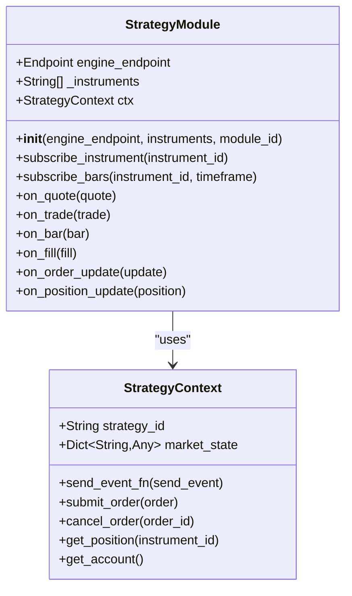

**Diagram sources**
- [base.py:22-176](file://src/modules/trading/strategy/base.py#L22-L176)

**Section sources**
- [base.py:1-176](file://src/modules/trading/strategy/base.py#L1-L176)

### Risk Management Module

The risk module acts as a pre-trade gatekeeper, evaluating orders against configurable risk rules before allowing execution.

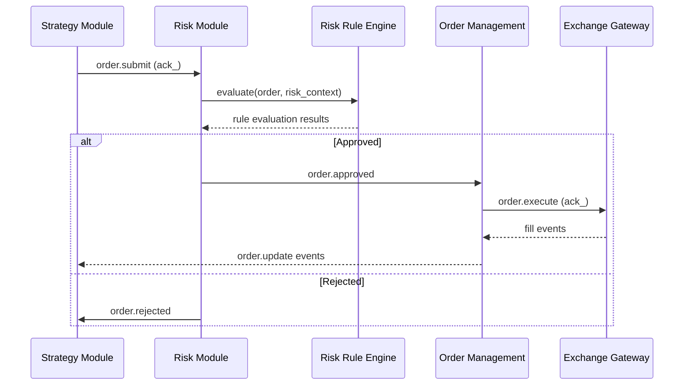

**Diagram sources**
- [module.py:62-104](file://src/modules/trading/risk/module.py#L62-L104)

**Section sources**
- [module.py:1-110](file://src/modules/trading/risk/module.py#L1-L110)

### Order Management System

The OMS maintains order lifecycle state and coordinates execution across multiple trading venues.

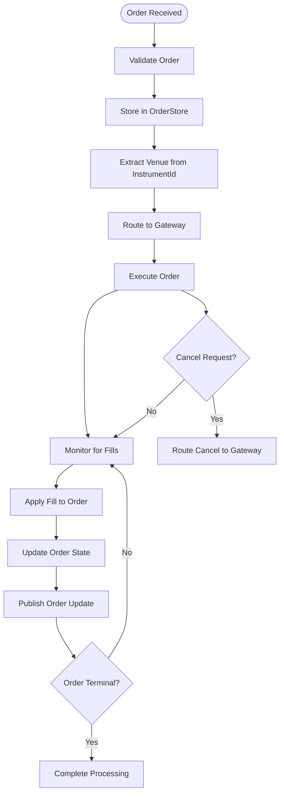

**Diagram sources**
- [module.py:64-140](file://src/modules/trading/oms/module.py#L64-L140)

**Section sources**
- [module.py:1-160](file://src/modules/trading/oms/module.py#L1-L160)

## Trading Domain Models

### Enhanced Market Data Types

The trading system models comprehensive market data including quotes, trades, bars, and order book levels with enhanced precision and functionality.

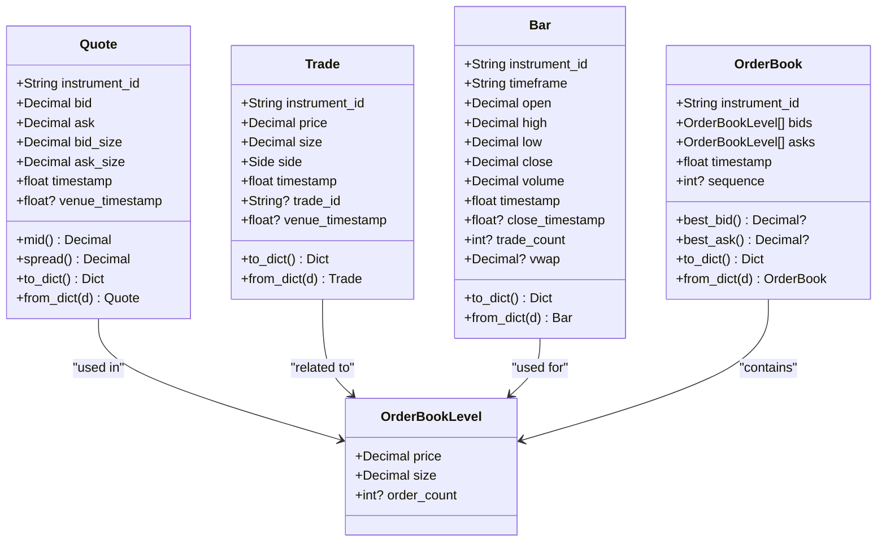

**Diagram sources**
- [tick.py:10-184](file://src/modules/trading/models/tick.py#L10-L184)

**Section sources**
- [tick.py:1-184](file://src/modules/trading/models/tick.py#L1-L184)

### Advanced Order Lifecycle Management

The trading system models orders with comprehensive lifecycle tracking supporting various order types and execution states, including the new STOP and STOP_LIMIT capabilities.

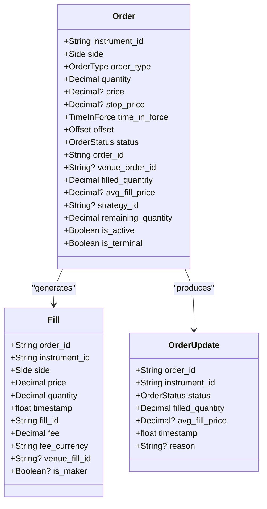

**Diagram sources**
- [order.py:16-183](file://src/modules/trading/models/order.py#L16-L183)

**Section sources**
- [order.py:1-183](file://src/modules/trading/models/order.py#L1-L183)

### Position and Account Tracking

Portfolio management encompasses position tracking and account state management with comprehensive P&L calculations, enhanced with sophisticated position accumulation.

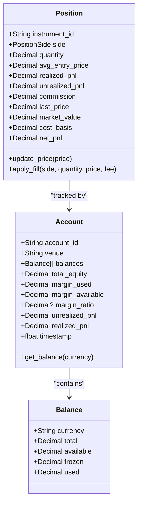

**Diagram sources**
- [position.py:10-119](file://src/modules/trading/models/position.py#L10-L119)
- [account.py:8-90](file://src/modules/trading/models/account.py#L8-L90)

**Section sources**
- [position.py:1-119](file://src/modules/trading/models/position.py#L1-L119)
- [account.py:1-90](file://src/modules/trading/models/account.py#L1-L90)

### Instrument Specification

The system supports multi-asset trading through a flexible instrument identification system.

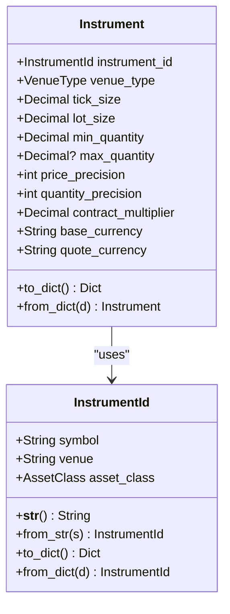

**Diagram sources**
- [instrument.py:10-101](file://src/modules/trading/models/instrument.py#L10-L101)

**Section sources**
- [instrument.py:1-101](file://src/modules/trading/models/instrument.py#L1-L101)

## Trading Workflow

The complete trading workflow demonstrates the end-to-end flow from strategy generation to order execution and position management, now enhanced with advanced order types and comprehensive error handling.

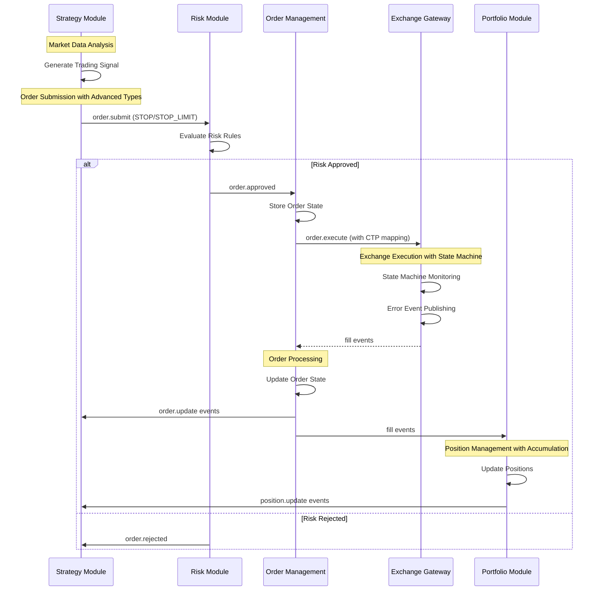

**Diagram sources**
- [events.py:23-49](file://src/modules/trading/events.py#L23-L49)
- [base.py:115-138](file://src/modules/trading/strategy/base.py#L115-L138)
- [module.py:62-104](file://src/modules/trading/risk/module.py#L62-L104)
- [module.py:64-140](file://src/modules/trading/oms/module.py#L64-L140)
- [module.py:84-128](file://src/modules/trading/portfolio/module.py#L84-L128)

**Section sources**
- [events.py:1-79](file://src/modules/trading/events.py#L1-L79)

## Risk Management

The risk management system provides configurable rule enforcement with real-time context tracking and dynamic rule addition capabilities.

### Risk Rule Engine

The risk system evaluates orders against multiple criteria including position limits, volatility constraints, and custom business rules. Rules can be dynamically added or modified at runtime.

Key features:
- **Configurable Rules**: Support for position limits, notional exposure, and custom logic
- **Real-time Context**: Maintains current position state and trading statistics
- **Dynamic Evaluation**: Runtime rule modification without system restart
- **Comprehensive Logging**: Detailed audit trail for compliance and debugging

**Section sources**
- [module.py:1-110](file://src/modules/trading/risk/module.py#L1-L110)

## Portfolio Management

The portfolio module provides comprehensive position tracking and P&L calculation across all instruments and venues, enhanced with sophisticated position accumulation for better performance.

### Position Management

Positions are tracked at the instrument level with support for:
- **Multi-position Support**: Long and short positions simultaneously
- **Real-time P&L Calculation**: Mark-to-market valuation using mid-prices
- **Commission Tracking**: Accurate cost accounting for all trades
- **Cross-asset Support**: Unified tracking across equities, futures, and crypto
- **Accumulation Optimization**: Efficient position aggregation for large datasets

### Account Management

Account state includes:
- **Multi-currency Support**: Separate tracking for base and quote currencies
- **Margin Calculations**: Real-time margin requirements and utilization
- **Equity Tracking**: Total account value with realized and unrealized gains
- **Performance Metrics**: Comprehensive P&L reporting and analytics

**Section sources**
- [module.py:1-129](file://src/modules/trading/portfolio/module.py#L1-L129)

## Gateway Integration

Gateway modules provide venue-specific connectivity while maintaining standardized interfaces for the trading system.

### Gateway Architecture

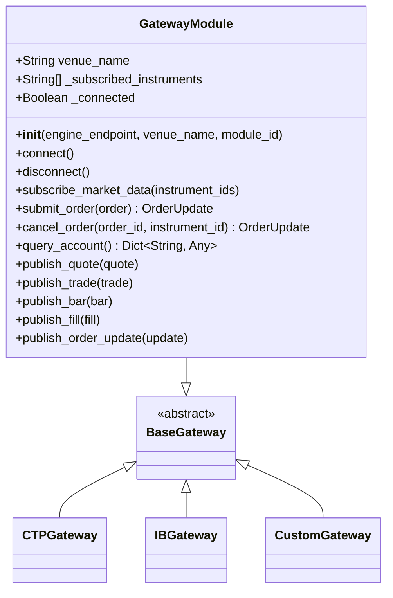

**Diagram sources**
- [base.py:22-192](file://src/modules/trading/gateway/base.py#L22-L192)

**Section sources**
- [base.py:1-192](file://src/modules/trading/gateway/base.py#L1-L192)

## CTP Gateway Implementation

The CTP (China Trading Platform) gateway provides comprehensive support for both live trading and simulation environments with full CTP protocol compatibility and sophisticated state management.

### CTP Gateway Architecture

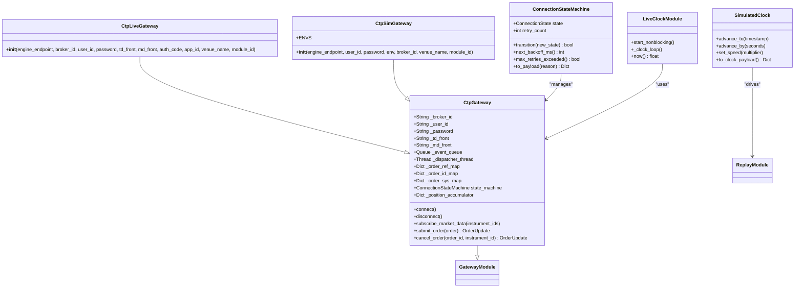

**Diagram sources**
- [gateway.py:127-840](file://src/modules/trading/gateway/ctp/gateway.py#L127-L840)
- [live.py:13-60](file://src/modules/trading/gateway/ctp/live.py#L13-L60)
- [sim.py:13-68](file://src/modules/trading/gateway/ctp/sim.py#L13-L68)
- [state_machine.py:35-96](file://src/modules/trading/gateway/ctp/state_machine.py#L35-L96)
- [clock.py:20-107](file://src/modules/trading/clock/clock.py#L20-L107)

### CTP Market Data Integration

The CTP gateway provides comprehensive market data handling with automatic quote and trade generation from depth market data:

- **Market Data Subscription**: Supports multiple CTP exchanges including CFFEX, SHFE, DCE, CZCE, and INE
- **Quote Generation**: Automatic conversion from bid/ask levels to Quote objects
- **Trade Generation**: Volume-based trade detection and Trade object creation
- **Order Reference Management**: Bidirectional mapping between order IDs and CTP order references
- **Account Query**: Real-time account balance and position retrieval
- **Position Accumulation**: Efficient aggregation of position data for better performance

### CTP Order Management

Full order lifecycle management with CTP protocol compliance and advanced order types:
- **Order Submission**: Complete mapping of TycheEngine orders to CTP InputOrderField with STOP/STOP_LIMIT support
- **Order Status Updates**: Real-time status tracking with proper state transitions
- **Fill Processing**: Comprehensive fill event generation with venue identifiers
- **Order Cancellation**: Support for both order reference and system ID cancellation
- **Authentication**: Optional broker authentication for live trading environments
- **Offset Support**: OPEN/CLOSE/CLOSE_TODAY/CLOSE_YESTERDAY positioning options

**Section sources**
- [gateway.py:1-840](file://src/modules/trading/gateway/ctp/gateway.py#L1-L840)
- [live.py:1-60](file://src/modules/trading/gateway/ctp/live.py#L1-L60)
- [sim.py:1-68](file://src/modules/trading/gateway/ctp/sim.py#L1-L68)
- [state_machine.py:1-96](file://src/modules/trading/gateway/ctp/state_machine.py#L1-L96)
- [clock.py:1-107](file://src/modules/trading/clock/clock.py#L1-L107)

## Advanced Order Management

The CTP gateway now supports sophisticated order types with comprehensive CTP protocol mapping and advanced position management capabilities.

### Order Type Mapping

The system provides comprehensive mapping between TycheEngine order types and CTP protocol specifications:

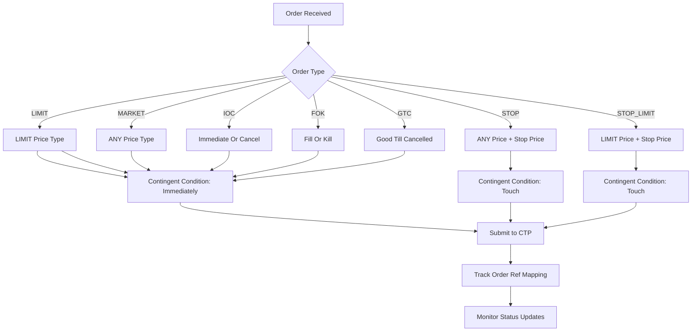

**Diagram sources**
- [gateway.py:804-908](file://src/modules/trading/gateway/ctp/gateway.py#L804-L908)

### Time-In-Force Mapping

Comprehensive mapping of order time conditions to CTP protocol equivalents:
- **IOC**: Immediate Or Cancel (THOST_FTDC_TC_IOC + THOST_FTDC_VC_AV/CV)
- **FOK**: Fill Or Kill (THOST_FTDC_TC_IOC + THOST_FTDC_VC_CV)
- **GTD**: Good Till Date (THOST_FTDC_TC_GFS approximation)
- **GTC/DAY**: Good For Day (THOST_FTDC_TC_GFD)

### Offset Management

Advanced position management with four offset types:
- **OPEN**: Open new position
- **CLOSE**: Close existing position (any day)
- **CLOSE_TODAY**: Close today's positions
- **CLOSE_YESTERDAY**: Close positions from previous trading day

**Section sources**
- [gateway.py:804-908](file://src/modules/trading/gateway/ctp/gateway.py#L804-L908)
- [enums.py:67-73](file://src/modules/trading/models/enums.py#L67-L73)

## Connection State Management

The CTP gateway implements a sophisticated connection state machine with exponential backoff and comprehensive auto-reconnect capabilities.

### State Machine Architecture

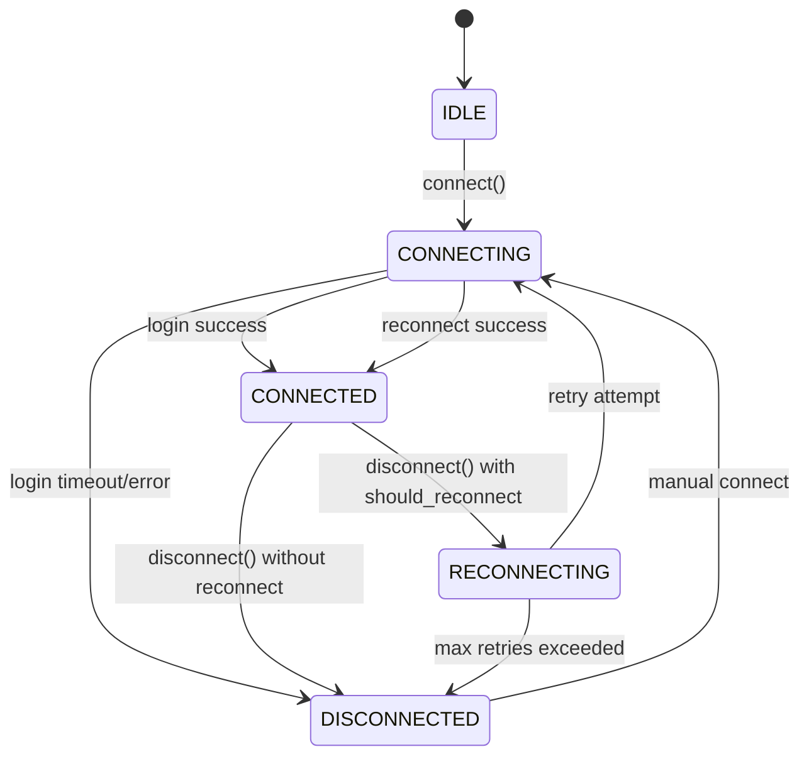

**Diagram sources**
- [state_machine.py:8-32](file://src/modules/trading/gateway/ctp/state_machine.py#L8-L32)

### Auto-Reconnect Algorithm

The state machine implements exponential backoff with jitter for resilient connectivity:

- **Base Delay**: 1 second initial delay
- **Exponential Growth**: 2x multiplier per retry
- **Maximum Delay**: 30 seconds cap
- **Retry Limit**: 10 attempts maximum
- **Jitter**: Random variation to prevent thundering herd effects

### State Transition Management

The system publishes comprehensive state change events with detailed context:
- **Venue Information**: Identifies the trading venue
- **Previous State**: Tracks state transitions
- **Retry Count**: Monitors connection attempts
- **Next Retry**: Predicts timing for next attempt
- **Reason Codes**: Provides context for state changes

**Section sources**
- [state_machine.py:1-96](file://src/modules/trading/gateway/ctp/state_machine.py#L1-L96)
- [gateway.py:999-1081](file://src/modules/trading/gateway/ctp/gateway.py#L999-L1081)

## Error Handling and Observability

The CTP gateway implements comprehensive error handling with dedicated error event publishing for better observability and debugging.

### Error Event Publishing

The system provides structured error reporting through dedicated gateway.error events:

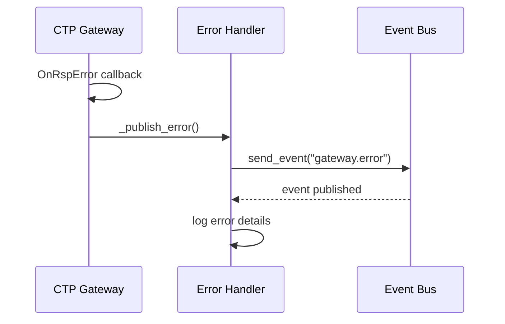

**Diagram sources**
- [gateway.py:574-592](file://src/modules/trading/gateway/ctp/gateway.py#L574-L592)

### Error Event Structure

Each error event contains comprehensive context:
- **Venue Identification**: Specifies the trading venue
- **Source Information**: Indicates error source (td_api/md_api)
- **Error Code**: Numeric error identifier
- **Error Message**: Human-readable description
- **Context Details**: Additional operational context

### Comprehensive Error Coverage

The error handling system covers multiple error scenarios:
- **API Response Errors**: CTP API error responses
- **Login Failures**: Authentication and authorization issues
- **Network Disconnections**: Connectivity problems
- **Order Submission Errors**: Exchange rejection reasons
- **Position Query Errors**: Data retrieval failures

**Section sources**
- [gateway.py:574-592](file://src/modules/trading/gateway/ctp/gateway.py#L574-L592)
- [gateway.py:1088-1102](file://src/modules/trading/gateway/ctp/gateway.py#L1088-L1102)

## Event Persistence Layer

The system now includes a comprehensive event persistence layer with multiple backend implementations for production-grade event storage and retrieval.

### Persistence Backend Architecture

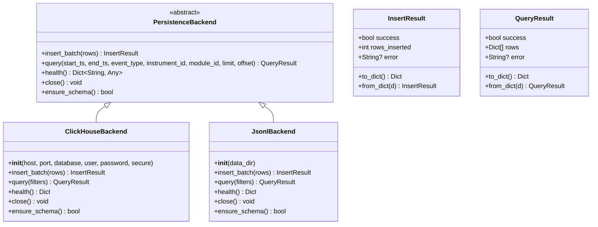

**Diagram sources**
- [backend.py:80-162](file://src/modules/trading/persistence/backend.py#L80-L162)
- [clickhouse_backend.py:23-231](file://src/modules/trading/persistence/clickhouse_backend.py#L23-L231)
- [jsonl_backend.py:20-155](file://src/modules/trading/persistence/jsonl_backend.py#L20-L155)

### ClickHouse Backend

The ClickHouse backend provides production-grade event storage with:

- **High-Performance Storage**: Optimized for analytical workloads
- **Automatic Partitioning**: Daily partitioning for efficient querying
- **Connection Pooling**: Resource-efficient database connections
- **Base64 Encoding**: Secure payload storage
- **Schema Management**: Automated table creation and versioning

### JSONL Backend

The JSONL backend serves as a development and testing alternative:

- **File-Based Storage**: Simple text-based event storage
- **Date Partitioning**: Automatic organization by date
- **Base64 Encoding**: Secure payload handling
- **Flexible Querying**: Pattern-based filtering and sorting
- **Easy Debugging**: Human-readable event format

### Schema Management

The persistence layer includes comprehensive schema management:

- **Version Control**: Track schema evolution
- **Idempotent Creation**: Safe table initialization
- **Migration Support**: Handle schema upgrades
- **Health Monitoring**: Database connectivity verification

**Section sources**
- [backend.py:1-162](file://src/modules/trading/persistence/backend.py#L1-L162)
- [clickhouse_backend.py:1-231](file://src/modules/trading/persistence/clickhouse_backend.py#L1-L231)
- [jsonl_backend.py:1-155](file://src/modules/trading/persistence/jsonl_backend.py#L1-L155)
- [schema.py:1-107](file://src/modules/trading/persistence/schema.py#L1-L107)

## Data Recording and Replay

The enhanced store module provides comprehensive data recording and replay capabilities for backtesting and research workflows, now integrated with the new persistence layer.

### Data Recording System

The DataRecorderModule captures market data and trading events for later analysis and backtesting:

```mermaid
flowchart TD
Start([Event Received]) --> CheckType{Event Type?}
CheckType --> |Quote/Trade| WriteQuoteTrade[Write to JSONL]
CheckType --> |Fill| WriteFill[Write Fill Event]
CheckType --> |Order Update| WriteOrder[Write Order Event]
CheckType --> |Bar| WriteBar[Write Bar Event]
WriteQuoteTrade --> DatePartition[Date Partitioning]
WriteFill --> DatePartition
WriteOrder --> DatePartition
WriteBar --> DatePartition
DatePartition --> FileWrite[Write to {instrument}_{type}.jsonl]
FileWrite --> Counter[Increment Event Count]
Counter --> End([Record Complete])
```

**Diagram sources**
- [recorder.py:91-127](file://src/modules/trading/store/recorder.py#L91-L127)

### Replay System Architecture

The ReplayModule enables deterministic backtesting through controlled event replay:

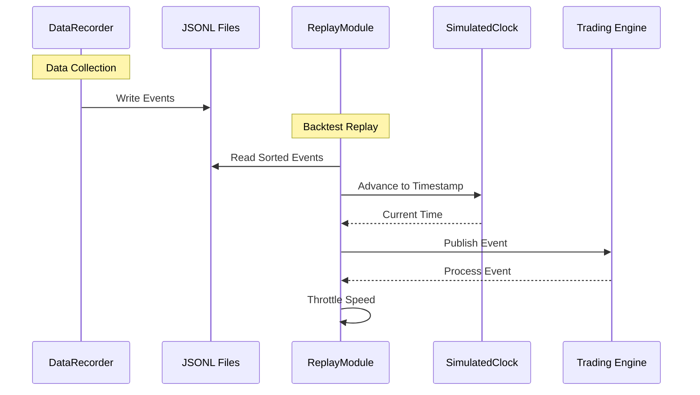

**Diagram sources**
- [replay.py:50-118](file://src/modules/trading/store/replay.py#L50-L118)

### Recording Capabilities

The recording system provides comprehensive event capture:
- **Market Data Recording**: Quotes, trades, and OHLCV bars for specified instruments
- **Order Flow Recording**: Order submissions, cancellations, and updates
- **Fill Recording**: Complete execution history with venue identifiers
- **Date Partitioning**: Automatic organization by date for efficient retrieval
- **Runtime Instrument Addition**: Dynamic subscription to new instruments during recording

### Replay Features

The replay system enables sophisticated backtesting workflows:
- **Speed Control**: Configurable replay speed with real-time throttling
- **Instrument Filtering**: Selective replay of specific instruments or dates
- **Clock Synchronization**: Deterministic time progression for reproducible results
- **Event Type Detection**: Automatic inference of event types from payload structure
- **Error Handling**: Robust processing with graceful degradation on malformed data

**Section sources**
- [recorder.py:1-137](file://src/modules/trading/store/recorder.py#L1-L137)
- [replay.py:1-137](file://src/modules/trading/store/replay.py#L1-L137)

## Performance Considerations

The system is optimized for high-frequency trading with several performance-critical design decisions, enhanced by the new persistence layer and state management improvements.

### Async Persistence Architecture

The framework implements an innovative async persistence mechanism that maintains sub-microsecond hot-path latency while ensuring data durability and recovery capabilities:

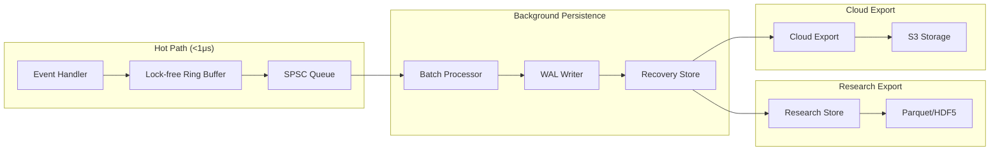

**Diagram sources**
- [README.md:108-131](file://README.md#L108-L131)

### ZeroMQ Socket Patterns

The system leverages optimal ZeroMQ patterns for different use cases:
- **REQ-ROUTER**: Reliable module registration with automatic retry
- **XPUB/XSUB**: Efficient event broadcasting to multiple subscribers
- **DEALER-ROUTER**: Low-latency direct messaging between modules
- **PUSH-PULL**: Natural load balancing for worker distribution

### CTP Gateway Performance

The CTP gateway implements several optimizations for high-frequency trading:
- **Thread-Safe Event Queue**: Lock-free communication between CTP SPI threads and event dispatcher
- **Efficient Order Mapping**: Minimal overhead in order reference translation
- **Batch Account Queries**: Cached account information to reduce network round-trips
- **Smart Trade Generation**: Volume-based detection minimizes unnecessary trade events
- **Position Accumulation**: Efficient aggregation reduces memory footprint
- **State Machine Optimization**: Minimal overhead in state transitions

### Persistence Layer Performance

The new persistence layer provides:
- **Asynchronous Writing**: Non-blocking event storage operations
- **Batch Processing**: Efficient bulk data insertion
- **Connection Pooling**: Reduced database connection overhead
- **Schema Optimization**: ClickHouse columnar storage for analytical queries

**Section sources**
- [README.md:197-205](file://README.md#L197-L205)

## Deployment and Operations

### Engine Configuration

The engine requires minimal configuration with sensible defaults for most deployment scenarios:

```mermaid
graph TB
subgraph "Network Configuration"
REG[Registration Endpoint]
EVT[Event Endpoints]
HB[Heartbeat Endpoints]
ADM[Admin Endpoint]
end
subgraph "Engine Operation"
START[Engine.run()]
STOP[Engine.stop()]
STATUS[Engine.Status Queries]
end
REG --> START
EVT --> START
HB --> START
ADM --> START
START --> STOP
START --> STATUS
```

**Diagram sources**
- [run_engine.py:30-55](file://examples/run_engine.py#L30-L55)

### Module Lifecycle Management

The system implements comprehensive module lifecycle management with automatic recovery and monitoring, enhanced by the new state machine:

```mermaid
stateDiagram-v2
[*] --> REGISTERING
REGISTERING --> ACTIVE : Registration Success
REGISTERING --> FAILED : Registration Error
ACTIVE --> SUSPECT : Missed Heartbeat
ACTIVE --> ACTIVE : Normal Operation
SUSPECT --> RESTARTING : Grace Period Expired
SUSPECT --> ACTIVE : Heartbeat Restored
RESTARTING --> ACTIVE : Restart Success
RESTARTING --> FAILED : Max Retries Exceeded
ACTIVE --> [*] : Manual Stop
FAILED --> [*] : Manual Intervention
```

**Diagram sources**
- [README.md:225-247](file://README.md#L225-L247)

### CTP Gateway Deployment

The CTP gateway supports both development and production deployment scenarios with enhanced reliability:

**Development Environment**:
- OpenCTP simulation servers for paper trading
- Automatic environment configuration
- Simplified authentication requirements
- Comprehensive error logging

**Production Environment**:
- Direct broker connections with authentication
- High-availability front-end configuration
- Sophisticated auto-reconnect with exponential backoff
- Production-grade error handling and recovery
- ClickHouse persistence for event storage

**Section sources**
- [run_engine.py:1-59](file://examples/run_engine.py#L1-L59)
- [README.md:206-247](file://README.md#L206-L247)

## Conclusion

The Multi-Asset Trading System represents a sophisticated, production-ready framework for automated trading with several key strengths, significantly enhanced by recent improvements:

### Architectural Excellence

The system demonstrates exceptional architectural design with clear separation of concerns, robust error handling, and comprehensive monitoring capabilities. The modular approach enables easy extension and maintenance while maintaining system stability.

**Updated** The system now includes comprehensive CTP integration with sophisticated connection state management, advanced order types, comprehensive error handling, and a complete event persistence layer, making it suitable for production Chinese futures trading.

### Performance Optimization

Through careful selection of ZeroMQ socket patterns and implementation of async persistence, the system achieves sub-microsecond latency for critical operations while maintaining full data durability and recovery capabilities.

**Enhanced** The CTP gateway adds high-performance connectivity to Chinese trading venues with optimized event processing, minimal overhead, and sophisticated state management with exponential backoff.

### Scalability and Reliability

The framework supports horizontal scaling across multiple engines and venues, with built-in fault tolerance and automatic recovery mechanisms. The sophisticated state machine ensures reliable operation even under adverse network conditions with intelligent auto-reconnect capabilities.

**Expanded** The addition of the persistence layer enables scalable event storage and retrieval without impacting production systems, while the new error handling system provides comprehensive observability.

### Comprehensive Trading Infrastructure

From basic market data handling to advanced risk management, portfolio tracking, sophisticated CTP gateway integration, comprehensive error handling, and now a complete event persistence layer, the system provides a complete trading infrastructure suitable for both live trading and research/backtesting workflows.

**Enhanced** The new persistence layer enables sophisticated research workflows, algorithm development, comprehensive performance analysis, and production-grade event storage with ClickHouse integration.

The modular design, extensive documentation, and comprehensive testing suite make this framework an excellent foundation for building sophisticated trading systems with confidence in reliability, performance, and production readiness.