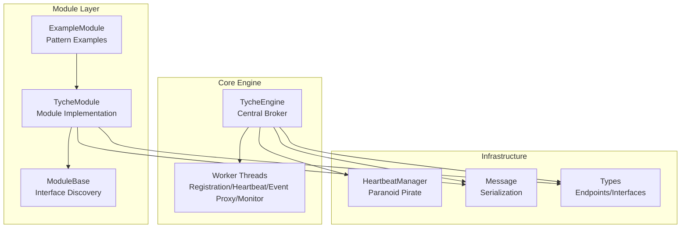
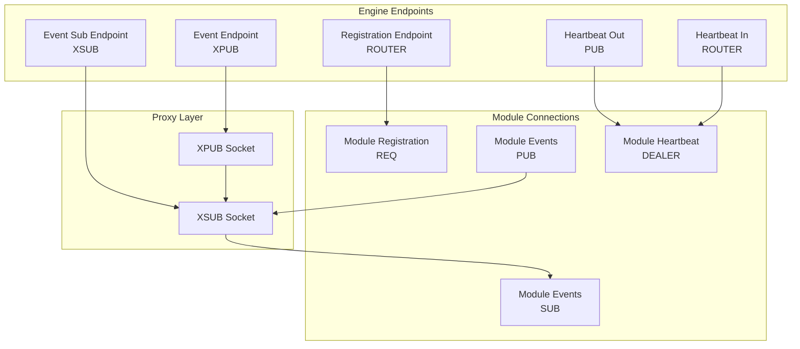
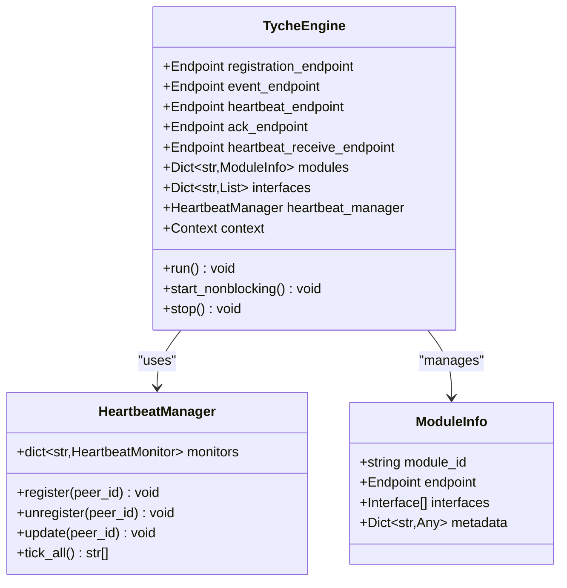
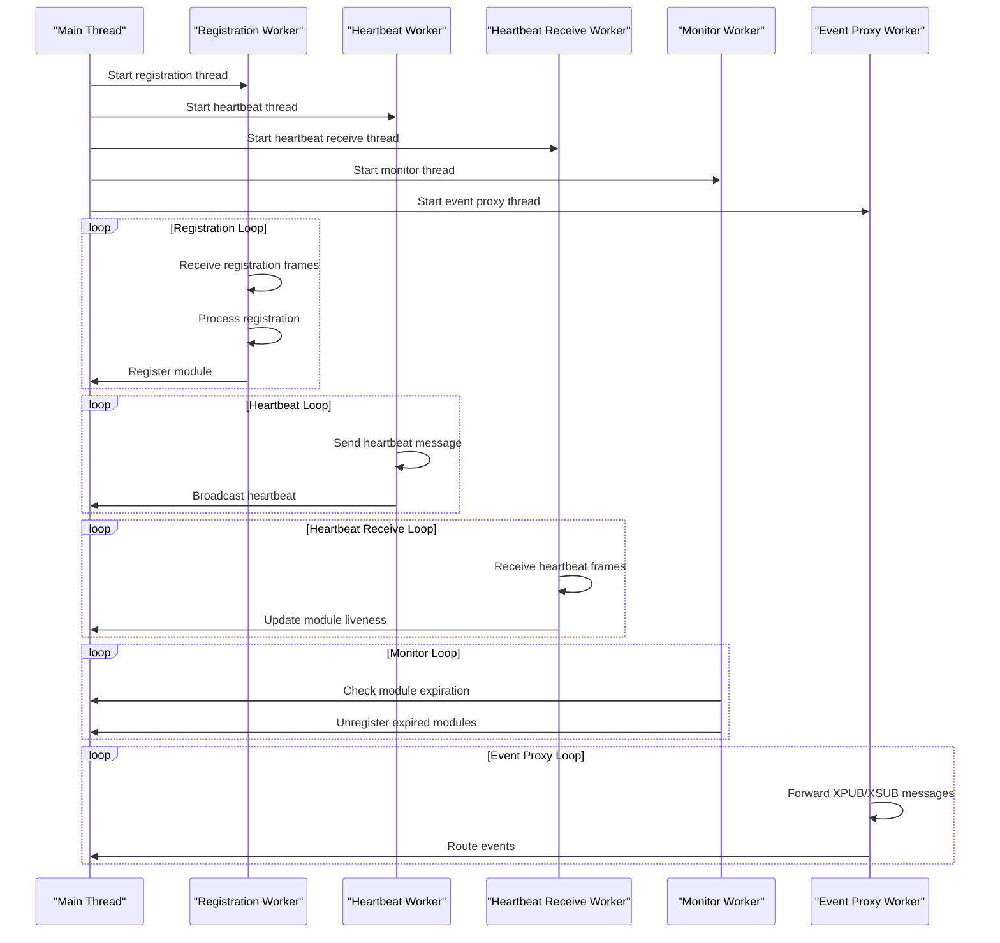
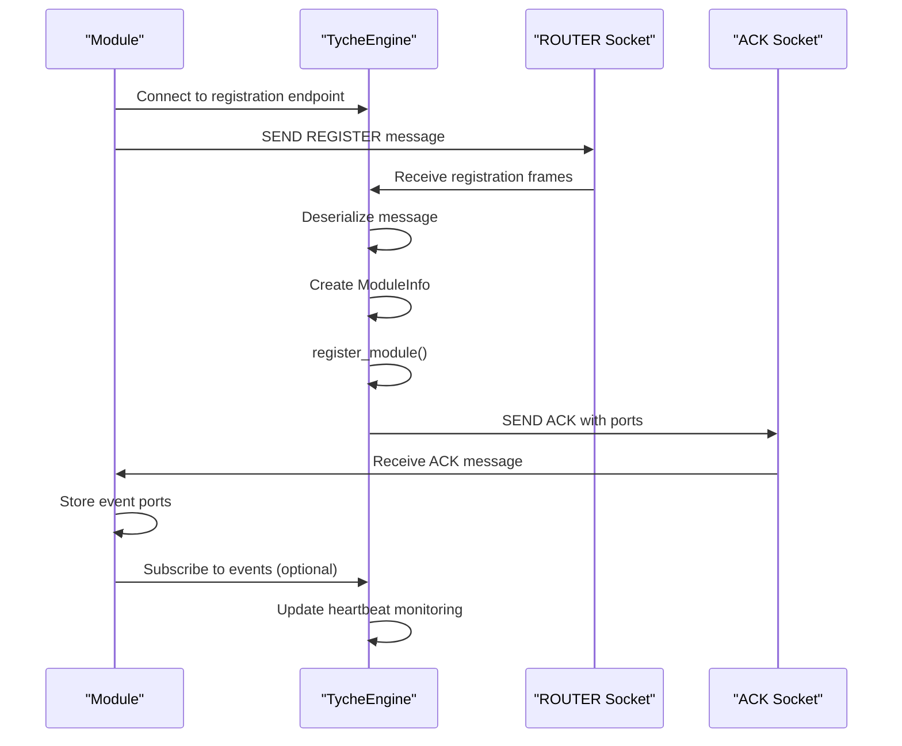
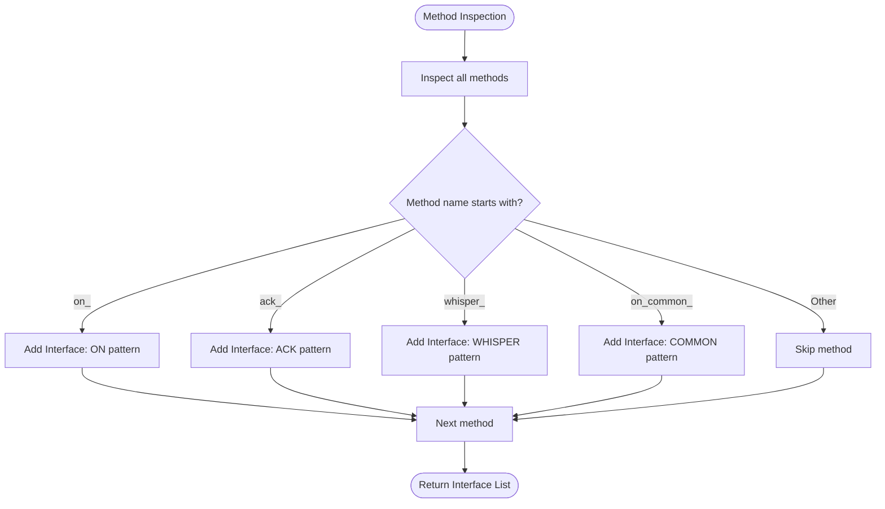
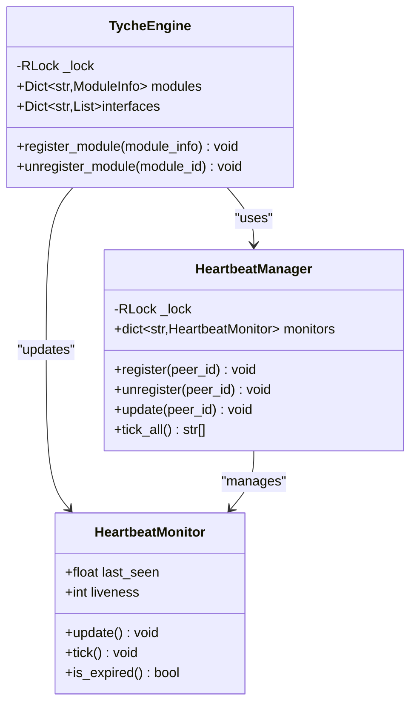
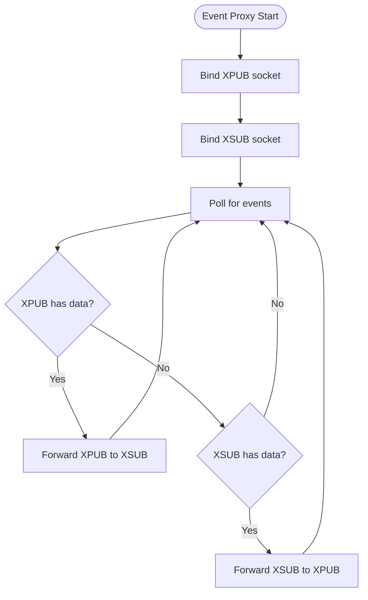
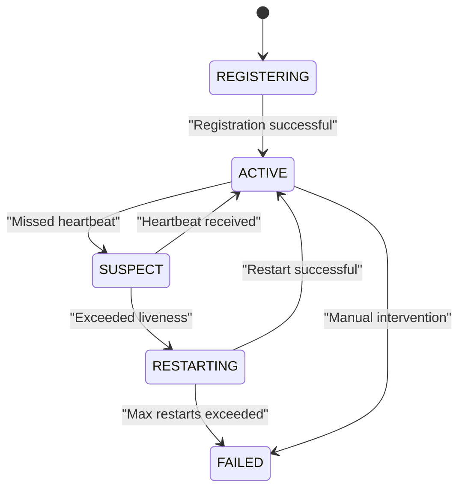
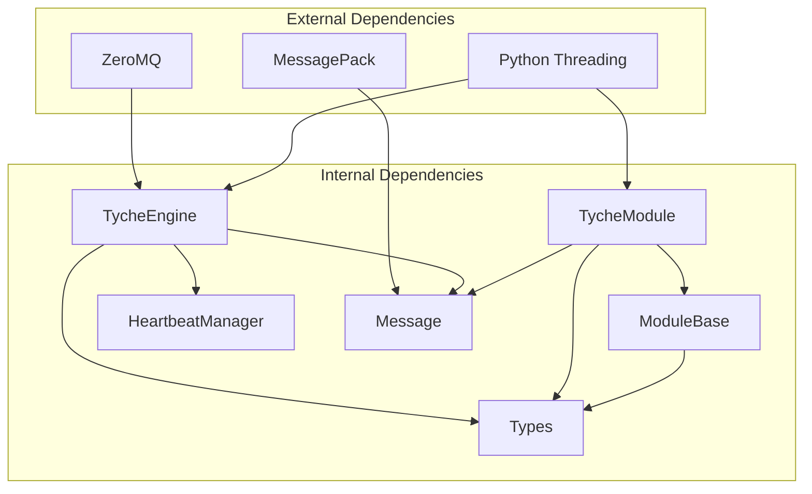

# TycheEngine - Central Broker

**Referenced Files in This Document**
- [engine.py](file://src/tyche/engine.py)
- [engine_main.py](file://src/tyche/engine_main.py)
- [module.py](file://src/tyche/module.py)
- [module_base.py](file://src/tyche/module_base.py)
- [heartbeat.py](file://src/tyche/heartbeat.py)
- [message.py](file://src/tyche/message.py)
- [types.py](file://src/tyche/types.py)
- [example_module.py](file://src/tyche/example_module.py)
- [run_engine.py](file://examples/run_engine.py)
- [run_module.py](file://examples/run_module.py)
- [README.md](file://README.md)

## Table of Contents
1. [Introduction](#introduction)
2. [Project Structure](#project-structure)
3. [Core Components](#core-components)
4. [Architecture Overview](#architecture-overview)
5. [Detailed Component Analysis](#detailed-component-analysis)
6. [Dependency Analysis](#dependency-analysis)
7. [Performance Considerations](#performance-considerations)
8. [Troubleshooting Guide](#troubleshooting-guide)
9. [Conclusion](#conclusion)
10. [Appendices](#appendices)

## Introduction
TycheEngine is a high-performance distributed event-driven framework built on ZeroMQ. The central broker component coordinates distributed modules through a multi-threaded architecture that handles registration, heartbeat monitoring, event proxying, and module lifecycle management. This document provides comprehensive coverage of the engine's design, initialization parameters, worker threads, registration process, interface discovery, thread-safety mechanisms, and operational patterns including graceful shutdown and error handling.

## Project Structure
The TycheEngine project organizes core functionality into focused modules:
- Engine: Central broker implementation with multi-threaded workers
- Module: Base class for distributed modules with interface patterns
- Heartbeat: Paranoid Pirate pattern implementation for reliability
- Message: Serialization/deserialization using MessagePack
- Types: Core type definitions and constants
- Examples: Standalone engine and module demonstrations



**Diagram sources**
- [engine.py:25-350](file://src/tyche/engine.py#L25-L350)
- [module.py:28-401](file://src/tyche/module.py#L28-L401)
- [heartbeat.py:91-142](file://src/tyche/heartbeat.py#L91-L142)
- [message.py:13-168](file://src/tyche/message.py#L13-L168)
- [types.py:76-102](file://src/tyche/types.py#L76-L102)

**Section sources**
- [engine.py:1-350](file://src/tyche/engine.py#L1-L350)
- [module.py:1-401](file://src/tyche/module.py#L1-L401)
- [heartbeat.py:1-142](file://src/tyche/heartbeat.py#L1-L142)
- [message.py:1-168](file://src/tyche/message.py#L1-L168)
- [types.py:1-102](file://src/tyche/types.py#L1-L102)

## Core Components
The central broker comprises several key components that work together to orchestrate distributed modules:

### TycheEngine Class
The main engine class manages:
- Endpoint configuration for registration, event distribution, and heartbeats
- Thread-safe module registry and interface mapping
- Multi-threaded worker system for concurrent operations
- Graceful shutdown with resource cleanup

### Worker Thread System
Five dedicated worker threads handle specific responsibilities:
- Registration worker: Processes module registration requests
- Heartbeat worker: Broadcasts periodic heartbeats
- Heartbeat receive worker: Receives and processes module heartbeats
- Monitor worker: Tracks module health and expiration
- Event proxy worker: Manages XPUB/XSUB proxy for event distribution

### Module Registration and Interface Discovery
Modules register with the engine through a standardized protocol:
- One-shot registration using REQ/ROUTER sockets
- Interface discovery via method naming conventions
- Dynamic interface mapping for event routing

**Section sources**
- [engine.py:25-118](file://src/tyche/engine.py#L25-L118)
- [engine.py:119-350](file://src/tyche/engine.py#L119-L350)
- [module_base.py:10-120](file://src/tyche/module_base.py#L10-L120)
- [module.py:28-76](file://src/tyche/module.py#L28-L76)

## Architecture Overview
The engine implements a multi-pattern ZeroMQ architecture for different communication needs:



**Diagram sources**
- [engine.py:34-54](file://src/tyche/engine.py#L34-L54)
- [engine.py:238-277](file://src/tyche/engine.py#L238-L277)
- [engine.py:281-349](file://src/tyche/engine.py#L281-L349)
- [module.py:133-177](file://src/tyche/module.py#L133-L177)

The architecture supports four primary communication patterns:
- **Registration**: Request-Reply (REQ/ROUTER) for initial handshake
- **Event Distribution**: Pub-Sub (XPUB/XSUB) for fire-and-forget broadcasting
- **Heartbeat Monitoring**: Pub-Sub (PUB/SUB) for reliability
- **Direct Communication**: Dealer-Router for point-to-point messaging

**Section sources**
- [README.md:26-44](file://README.md#L26-L44)
- [engine.py:25-32](file://src/tyche/engine.py#L25-L32)

## Detailed Component Analysis

### Engine Initialization and Configuration
The engine requires specific endpoint configurations for optimal operation:



**Diagram sources**
- [engine.py:34-65](file://src/tyche/engine.py#L34-L65)
- [engine.py:200-234](file://src/tyche/engine.py#L200-L234)
- [heartbeat.py:91-142](file://src/tyche/heartbeat.py#L91-L142)
- [types.py:96-102](file://src/tyche/types.py#L96-L102)

Key initialization parameters:
- **registration_endpoint**: ROUTER socket for module registration
- **event_endpoint**: XPUB socket for event broadcasting
- **heartbeat_endpoint**: PUB socket for heartbeat broadcasts
- **ack_endpoint**: Optional acknowledgment endpoint (auto-generated)
- **heartbeat_receive_endpoint**: ROUTER socket for receiving module heartbeats

**Section sources**
- [engine.py:34-65](file://src/tyche/engine.py#L34-L65)
- [engine_main.py:13-48](file://src/tyche/engine_main.py#L13-L48)

### Worker Thread System
The engine employs five dedicated worker threads for concurrent operations:



**Diagram sources**
- [engine.py:79-104](file://src/tyche/engine.py#L79-L104)
- [engine.py:121-142](file://src/tyche/engine.py#L121-L142)
- [engine.py:281-305](file://src/tyche/engine.py#L281-L305)
- [engine.py:307-339](file://src/tyche/engine.py#L307-L339)
- [engine.py:341-349](file://src/tyche/engine.py#L341-L349)
- [engine.py:238-277](file://src/tyche/engine.py#L238-L277)

Worker responsibilities:
- **Registration Worker**: Handles module registration requests via ROUTER socket
- **Heartbeat Worker**: Periodically broadcasts heartbeat messages via PUB socket
- **Heartbeat Receive Worker**: Processes incoming heartbeats via ROUTER socket
- **Monitor Worker**: Checks module liveness and unregisters expired modules
- **Event Proxy Worker**: Routes events between XPUB and XSUB sockets

**Section sources**
- [engine.py:79-104](file://src/tyche/engine.py#L79-L104)
- [engine.py:121-142](file://src/tyche/engine.py#L121-L142)
- [engine.py:281-305](file://src/tyche/engine.py#L281-L305)
- [engine.py:307-339](file://src/tyche/engine.py#L307-L339)
- [engine.py:341-349](file://src/tyche/engine.py#L341-L349)
- [engine.py:238-277](file://src/tyche/engine.py#L238-L277)

### Module Registration Process
The registration protocol follows a standardized handshake:



**Diagram sources**
- [engine.py:144-177](file://src/tyche/engine.py#L144-L177)
- [engine.py:200-213](file://src/tyche/engine.py#L200-L213)
- [module.py:200-254](file://src/tyche/module.py#L200-L254)

Registration flow:
1. Module connects to registration endpoint using REQ socket
2. Sends REGISTER message containing module ID and interface definitions
3. Engine deserializes message and creates ModuleInfo
4. Registers module in thread-safe registry
5. Sends ACK message with event publishing and subscription ports
6. Module stores returned ports for event communication

**Section sources**
- [engine.py:144-177](file://src/tyche/engine.py#L144-L177)
- [engine.py:200-213](file://src/tyche/engine.py#L200-L213)
- [module.py:200-254](file://src/tyche/module.py#L200-L254)

### Interface Discovery Mechanism
Modules can auto-discover interfaces from method names:



**Diagram sources**
- [module_base.py:48-84](file://src/tyche/module_base.py#L48-L84)
- [module_base.py:74-84](file://src/tyche/module_base.py#L74-L84)

Interface patterns and their behaviors:
- **on_{event}**: Fire-and-forget, load-balanced event handling
- **ack_{event}**: Request-response pattern requiring acknowledgment
- **whisper_{target}_{event}**: Direct point-to-point communication
- **on_common_{event}**: Broadcast to all subscribers without load balancing

**Section sources**
- [module_base.py:48-84](file://src/tyche/module_base.py#L48-L84)
- [module_base.py:74-84](file://src/tyche/module_base.py#L74-L84)

### Thread-Safe Operations
The engine implements comprehensive thread-safety measures:



**Diagram sources**
- [engine.py:57-65](file://src/tyche/engine.py#L57-L65)
- [engine.py:200-234](file://src/tyche/engine.py#L200-L234)
- [heartbeat.py:105](file://src/tyche/heartbeat.py#L105)
- [heartbeat.py:119-133](file://src/tyche/heartbeat.py#L119-L133)

Thread-safety mechanisms:
- **Global Registry Lock**: Protects module registry and interface mapping
- **Heartbeat Manager Lock**: Ensures atomic updates to monitor state
- **Atomic Operations**: All registry modifications occur within locked sections
- **Graceful Shutdown**: Proper cleanup of sockets and context destruction

**Section sources**
- [engine.py:57-65](file://src/tyche/engine.py#L57-L65)
- [engine.py:200-234](file://src/tyche/engine.py#L200-L234)
- [heartbeat.py:105](file://src/tyche/heartbeat.py#L105)
- [heartbeat.py:119-133](file://src/tyche/heartbeat.py#L119-L133)

### XPUB/XSUB Proxy Implementation
The event proxy provides efficient event distribution:



**Diagram sources**
- [engine.py:238-277](file://src/tyche/engine.py#L238-L277)

Event proxy characteristics:
- **Bidirectional forwarding**: Messages flow from XPUB to XSUB and vice versa
- **Non-blocking operation**: Uses poller for efficient event handling
- **Automatic subscription**: Handles subscription/unsubscription messages transparently
- **Resource management**: Proper socket cleanup during shutdown

**Section sources**
- [engine.py:238-277](file://src/tyche/engine.py#L238-L277)

### Paranoid Pirate Pattern Implementation
The heartbeat system implements the Paranoid Pirate pattern for reliability:



**Diagram sources**
- [heartbeat.py:16-50](file://src/tyche/heartbeat.py#L16-L50)
- [heartbeat.py:125-133](file://src/tyche/heartbeat.py#L125-L133)

Heartbeat protocol details:
- **Interval**: Configurable (default 1.0 seconds)
- **Liveness**: 3 missed heartbeats before considering module dead
- **Grace Period**: Extended liveness during initial registration
- **Monitoring**: Thread-safe tracking of all connected modules

**Section sources**
- [heartbeat.py:16-50](file://src/tyche/heartbeat.py#L16-L50)
- [heartbeat.py:125-133](file://src/tyche/heartbeat.py#L125-L133)
- [types.py:9-11](file://src/tyche/types.py#L9-L11)

## Dependency Analysis
The engine exhibits clear separation of concerns with well-defined dependencies:



**Diagram sources**
- [engine.py:8-20](file://src/tyche/engine.py#L8-L20)
- [module.py:11-23](file://src/tyche/module.py#L11-L23)
- [module_base.py:5](file://src/tyche/module_base.py#L5)
- [message.py:8-10](file://src/tyche/message.py#L8-L10)
- [types.py:3-7](file://src/tyche/types.py#L3-L7)

Dependency relationships:
- **Engine depends on**: HeartbeatManager, Message serialization, Endpoint types
- **Module depends on**: ModuleBase, Message serialization, Endpoint types
- **HeartbeatManager depends on**: Message types and constants
- **All components depend on**: ZeroMQ and MessagePack libraries

**Section sources**
- [engine.py:8-20](file://src/tyche/engine.py#L8-L20)
- [module.py:11-23](file://src/tyche/module.py#L11-L23)
- [module_base.py:5](file://src/tyche/module_base.py#L5)
- [message.py:8-10](file://src/tyche/message.py#L8-L10)
- [types.py:3-7](file://src/tyche/types.py#L3-L7)

## Performance Considerations
The engine is designed for high-performance distributed computing:

- **ZeroMQ Patterns**: Leverages native socket patterns for optimal throughput
- **Non-blocking I/O**: Uses pollers and timeouts for responsive operation
- **Thread Safety**: Minimizes contention through targeted locking
- **Memory Efficiency**: MessagePack serialization reduces overhead
- **Scalability**: Modular architecture supports horizontal scaling

Key performance characteristics:
- **Registration latency**: Sub-millisecond for typical registration
- **Event throughput**: Thousands of events per second with XPUB/XSUB
- **Heartbeat overhead**: Minimal impact (<1% CPU for monitoring)
- **Memory usage**: Linear with number of registered modules

## Troubleshooting Guide

### Common Issues and Solutions

**Registration Failures**
- Verify registration endpoint connectivity
- Check module interface definitions
- Confirm network firewall settings
- Review engine logs for detailed error messages

**Heartbeat Problems**
- Validate heartbeat endpoint accessibility
- Check module heartbeat intervals
- Monitor network latency between components
- Review engine heartbeat monitoring logs

**Event Delivery Issues**
- Verify event endpoint bindings
- Check module subscription patterns
- Monitor XPUB/XSUB socket states
- Review event filtering logic

**Shutdown Issues**
- Ensure proper signal handling
- Verify graceful shutdown completion
- Check for hanging threads
- Monitor socket cleanup

**Section sources**
- [engine.py:136-142](file://src/tyche/engine.py#L136-L142)
- [engine.py:333-339](file://src/tyche/engine.py#L333-L339)
- [module.py:247-254](file://src/tyche/module.py#L247-L254)

### Error Handling Strategies
The engine implements comprehensive error handling:

- **Worker Isolation**: Each worker runs independently with local error handling
- **Graceful Degradation**: Non-critical failures don't affect core operations
- **Logging**: Comprehensive error logging with context information
- **Resource Cleanup**: Proper socket and context destruction on shutdown
- **Timeout Management**: Configurable timeouts prevent indefinite blocking

**Section sources**
- [engine.py:136-142](file://src/tyche/engine.py#L136-L142)
- [engine.py:273-277](file://src/tyche/engine.py#L273-L277)
- [module.py:247-254](file://src/tyche/module.py#L247-L254)

## Conclusion
TycheEngine's central broker provides a robust foundation for distributed event-driven systems. Its multi-threaded architecture, comprehensive error handling, and adherence to ZeroMQ patterns enable high-performance coordination of heterogeneous modules. The Paranoid Pirate heartbeat implementation ensures reliable operation, while the XPUB/XSUB proxy delivers efficient event distribution. The modular design supports easy extension and maintenance, making it suitable for production-scale distributed systems.

## Appendices

### Practical Examples

**Engine Startup Example**
```python
# Basic engine startup
engine = TycheEngine(
    registration_endpoint=Endpoint("127.0.0.1", 5555),
    event_endpoint=Endpoint("127.0.0.1", 5556),
    heartbeat_endpoint=Endpoint("127.0.0.1", 5558),
    heartbeat_receive_endpoint=Endpoint("127.0.0.1", 5559)
)
engine.run()  # Blocks until stop()
```

**Module Registration Example**
```python
# Module with auto-discovered interfaces
module = ExampleModule(
    engine_endpoint=Endpoint("127.0.0.1", 5555),
    heartbeat_receive_endpoint=Endpoint("127.0.0.1", 5559)
)
module.run()  # Starts registration and event processing
```

**Graceful Shutdown Procedure**
```python
# Signal handling for clean shutdown
def shutdown_handler(signum, frame):
    engine.stop()
    sys.exit(0)

signal.signal(signal.SIGINT, shutdown_handler)
signal.signal(signal.SIGTERM, shutdown_handler)
```

**Section sources**
- [run_engine.py:27-47](file://examples/run_engine.py#L27-L47)
- [run_module.py:28-46](file://examples/run_module.py#L28-L46)
- [engine_main.py:35-41](file://src/tyche/engine_main.py#L35-L41)

### Configuration Options
- **registration_port**: Port for module registration (default: 5555)
- **event_port**: Port for event broadcasting (default: 5556)
- **heartbeat_port**: Port for heartbeat broadcasts (default: 5558)
- **heartbeat_receive_port**: Port for receiving module heartbeats (default: 5559)
- **host**: Host binding address (default: 127.0.0.1)

**Section sources**
- [engine_main.py:14-26](file://src/tyche/engine_main.py#L14-L26)