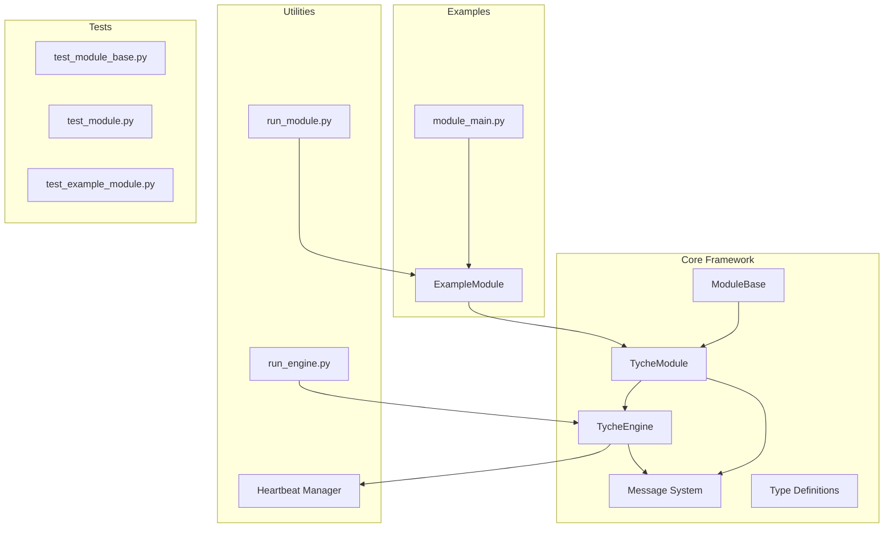
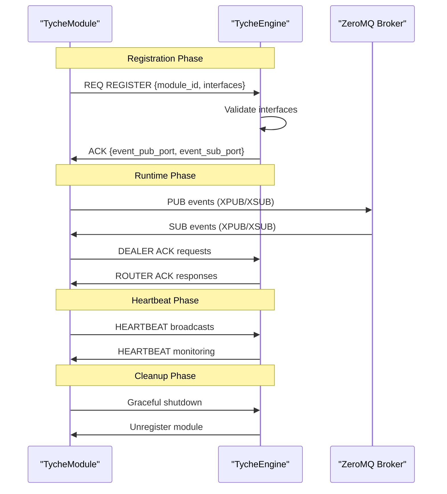
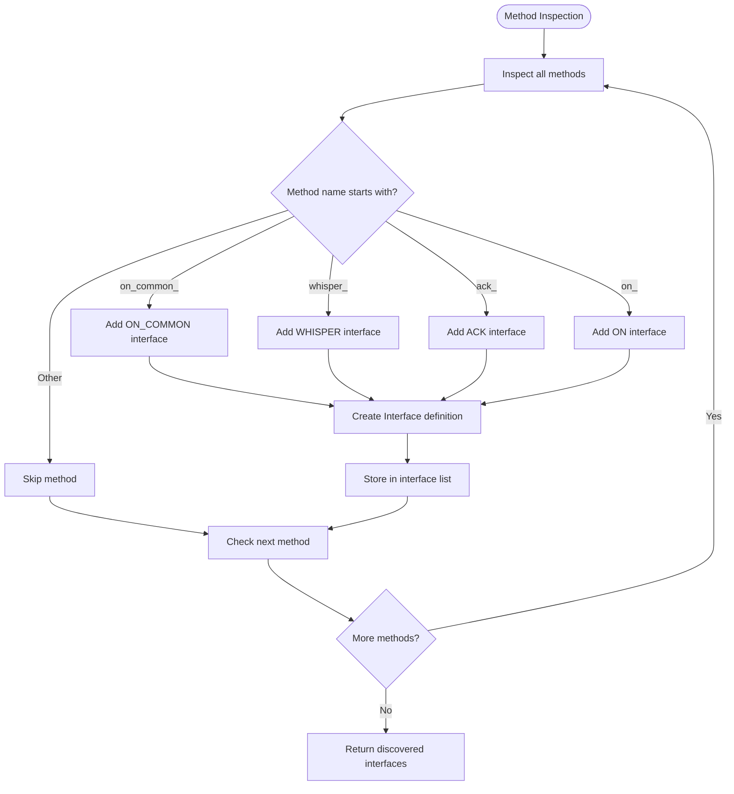
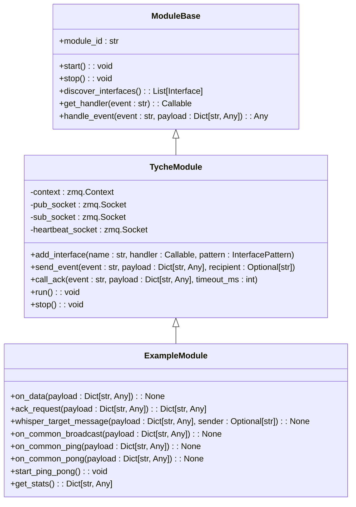
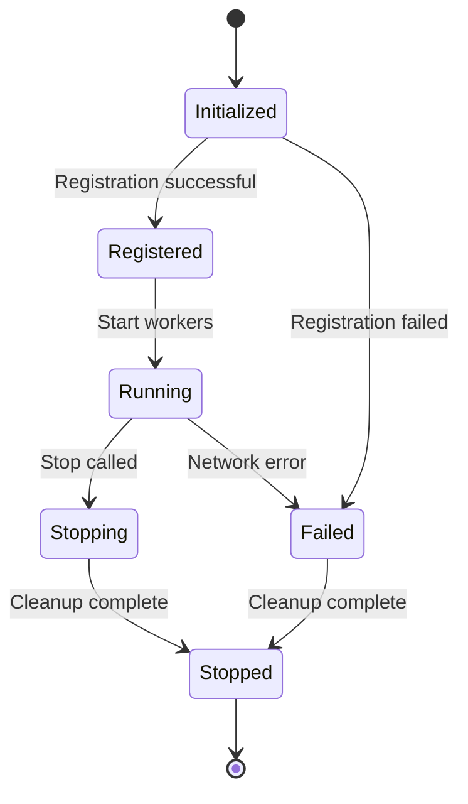
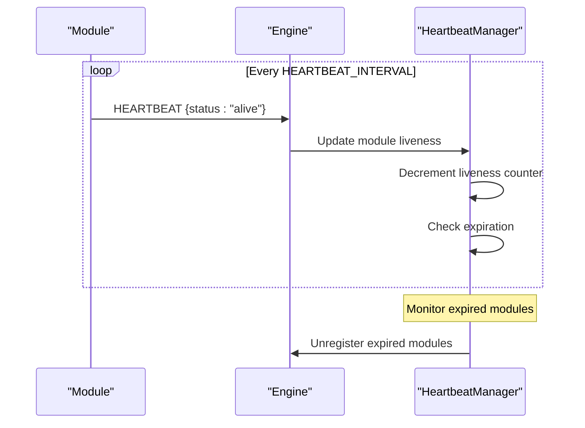
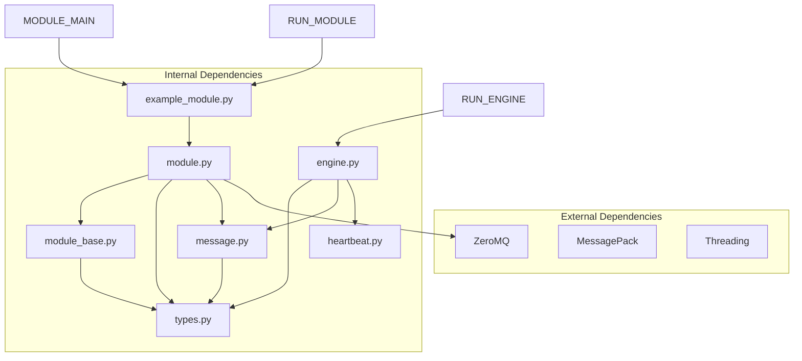

# TycheModule System

<cite>
**Referenced Files in This Document**
- [module_base.py](file://src/tyche/module_base.py)
- [module.py](file://src/tyche/module.py)
- [example_module.py](file://src/tyche/example_module.py)
- [module_main.py](file://src/tyche/module_main.py)
- [engine.py](file://src/tyche/engine.py)
- [types.py](file://src/tyche/types.py)
- [message.py](file://src/tyche/message.py)
- [heartbeat.py](file://src/tyche/heartbeat.py)
- [run_module.py](file://examples/run_module.py)
- [run_engine.py](file://examples/run_engine.py)
- [test_module_base.py](file://tests/unit/test_module_base.py)
- [test_module.py](file://tests/unit/test_module.py)
- [test_example_module.py](file://tests/unit/test_example_module.py)
</cite>

## Update Summary
**Changes Made**
- Enhanced type safety documentation for ExampleModule with explicit Dict[str, Any] type annotations
- Updated communication patterns section to emphasize improved static type checking
- Added documentation for enhanced IDE support and development experience

## Table of Contents
1. [Introduction](#introduction)
2. [Project Structure](#project-structure)
3. [Core Components](#core-components)
4. [Architecture Overview](#architecture-overview)
5. [Detailed Component Analysis](#detailed-component-analysis)
6. [Dependency Analysis](#dependency-analysis)
7. [Performance Considerations](#performance-considerations)
8. [Troubleshooting Guide](#troubleshooting-guide)
9. [Conclusion](#conclusion)

## Introduction

The TycheModule system is a distributed event-driven framework built on ZeroMQ that enables asynchronous communication between heterogeneous modules. This system provides a standardized interface pattern system for event handling, automatic interface discovery, and robust module lifecycle management.

The framework supports four primary communication patterns:
- **on_** events: Fire-and-forget, load-balanced processing
- **ack_** events: Request-response with mandatory acknowledgment
- **whisper_** events: Direct peer-to-peer communication
- **on_common_** events: Broadcast to all subscribers

Built around the Paranoid Pirate Pattern for reliability and the ZeroMQ REQ/REP, PUB/SUB, and DEALER/ROUTER socket patterns, TycheModule ensures high-performance, scalable distributed processing.

**Enhanced Type Safety** The system now provides enhanced type safety through explicit Dict[str, Any] type annotations, improving static type checking and developer experience with better IDE support and IntelliSense capabilities.

## Project Structure

The TycheEngine project follows a clean modular architecture with clear separation of concerns:

**Diagram sources**
- [module_base.py:10-120](file://src/tyche/module_base.py#L10-L120)
- [module.py:28-401](file://src/tyche/module.py#L28-L401)
- [engine.py:25-350](file://src/tyche/engine.py#L25-L350)

**Section sources**
- [module_base.py:1-120](file://src/tyche/module_base.py#L1-L120)
- [module.py:1-401](file://src/tyche/module.py#L1-L401)
- [engine.py:1-350](file://src/tyche/engine.py#L1-L350)

## Core Components

### ModuleBase Abstract Class

The ModuleBase class defines the contract for all Tyche Engine modules. It establishes the fundamental interface that all modules must implement while providing automatic interface discovery capabilities.

Key responsibilities include:
- Defining the abstract interface contract (`module_id`, `start`, `stop`)
- Automatic interface pattern detection based on method naming conventions
- Event handler resolution and dispatch mechanisms
- Pattern-based method signature validation

The automatic interface discovery system analyzes method names to determine communication patterns:
- `on_{event}` → ON pattern (fire-and-forget)
- `ack_{event}` → ACK pattern (must return acknowledgment)
- `whisper_{target}_{event}` → WHISPER pattern (direct P2P)
- `on_common_{event}` → ON_COMMON pattern (broadcast to all)

**Enhanced Type Safety** The ModuleBase class now enforces explicit Dict[str, Any] type annotations for all event payloads, providing better static type checking and IDE support across the entire framework.

**Section sources**
- [module_base.py:10-120](file://src/tyche/module_base.py#L10-L120)

### TycheModule Implementation

TycheModule provides the concrete implementation of the ModuleBase contract, adding network connectivity, ZeroMQ integration, and complete module lifecycle management.

Core features include:
- **Network Connectivity**: ZMQ socket management for registration, event publishing/subscribing, and heartbeats
- **Registration Protocol**: One-shot REQ/REP handshake with the engine for module registration
- **Event Routing**: Automatic subscription to discovered interfaces and event dispatch
- **ACK Handling**: Request-response pattern with timeout management
- **Heartbeat Monitoring**: Integration with engine's heartbeat system for liveness detection

The module maintains separate sockets for different communication patterns:
- REQ socket for one-time registration
- PUB socket for event publishing to engine's XSUB
- SUB socket for event subscription from engine's XPUB
- DEALER socket for heartbeat transmission

**Enhanced Type Safety** TycheModule leverages the improved type annotations from ExampleModule to provide consistent type safety across all module implementations, with explicit Dict[str, Any] annotations for payload parameters and return values.

**Section sources**
- [module.py:28-401](file://src/tyche/module.py#L28-L401)

### ExampleModule Reference Implementation

ExampleModule demonstrates all interface patterns and serves as a comprehensive reference implementation. It showcases:
- Complete interface pattern coverage (on_, ack_, whisper_, on_common_)
- Ping-pong broadcast coordination between modules
- Timer-based scheduling with proper cleanup
- Statistics collection and reporting

**Enhanced Type Safety** ExampleModule now features comprehensive Dict[str, Any] type annotations throughout all method signatures, providing:
- Explicit payload parameter typing for all event handlers
- Consistent return type annotations for ACK pattern handlers
- Improved static type checking and IDE IntelliSense support
- Better development experience with compile-time type validation

This module illustrates best practices for implementing custom modules while maintaining clean separation of concerns and enhanced type safety.

**Section sources**
- [example_module.py:19-183](file://src/tyche/example_module.py#L19-L183)

## Architecture Overview

The TycheModule system implements a distributed broker-pattern architecture with clear separation between modules and the central engine:

**Diagram sources**
- [module.py:200-255](file://src/tyche/module.py#L200-L255)
- [engine.py:144-177](file://src/tyche/engine.py#L144-L177)

The architecture leverages ZeroMQ's advanced socket patterns:
- **REQ/REP**: One-time registration handshake
- **XPUB/XSUB**: Event routing and distribution
- **DEALER/ROUTER**: Reliable request-response with identity preservation
- **PUB/SUB**: Heartbeat monitoring and broadcast communication

**Enhanced Type Safety** The architecture now benefits from consistent type annotations across all communication layers, ensuring type safety from the application layer through the ZeroMQ transport layer.

**Section sources**
- [engine.py:25-350](file://src/tyche/engine.py#L25-L350)
- [module.py:13-401](file://src/tyche/module.py#L13-L401)

## Detailed Component Analysis

### Interface Discovery System

The automatic interface discovery mechanism provides a powerful abstraction that eliminates manual interface registration boilerplate:

**Diagram sources**
- [module_base.py:48-84](file://src/tyche/module_base.py#L48-L84)

The discovery system supports four distinct interface patterns, each with specific behavioral guarantees and method signature requirements.

**Enhanced Type Safety** The interface discovery system now validates method signatures against the enhanced Dict[str, Any] type annotations, ensuring that all discovered interfaces maintain consistent type safety standards.

**Section sources**
- [module_base.py:48-84](file://src/tyche/module_base.py#L48-L84)

### Event Handler Registration and Dispatch

The event handler registration system provides flexible method binding with automatic pattern detection:

**Diagram sources**
- [module_base.py:10-120](file://src/tyche/module_base.py#L10-L120)
- [module.py:28-401](file://src/tyche/module.py#L28-L401)
- [example_module.py:19-183](file://src/tyche/example_module.py#L19-L183)

**Enhanced Type Safety** The event handler system now enforces consistent Dict[str, Any] type annotations across all handler registrations, providing better static type checking and preventing type-related runtime errors.

### Module Lifecycle Management

The module lifecycle encompasses several distinct phases with proper resource management and cleanup:

The lifecycle includes:
1. **Initialization**: Socket creation and configuration
2. **Registration**: One-shot handshake with engine
3. **Runtime**: Event processing and heartbeat maintenance
4. **Cleanup**: Resource destruction and graceful shutdown

**Enhanced Type Safety** The module lifecycle now benefits from consistent type annotations throughout all phases, ensuring type safety from initialization through cleanup and preventing type-related issues during resource management.

**Section sources**
- [module.py:116-197](file://src/tyche/module.py#L116-L197)

### Communication Patterns Implementation

Each communication pattern has specific implementation requirements and behavioral guarantees:

#### ON Pattern (Fire-and-forget)
- Method signature: `on_{event}(payload: Dict[str, Any]) -> None`
- Behavior: Asynchronous processing without acknowledgment
- Use cases: Background processing, telemetry, logging

#### ACK Pattern (Request-Response)
- Method signature: `ack_{event}(payload: Dict[str, Any]) -> Dict[str, Any]`
- Behavior: Synchronous processing with mandatory acknowledgment
- Use cases: Critical operations, financial transactions

#### WHISPER Pattern (Direct P2P)
- Method signature: `whisper_{target}_{event}(payload: Dict[str, Any], sender: Optional[str]) -> None`
- Behavior: Direct peer-to-peer communication bypassing engine routing
- Use cases: Private module-to-module communication

#### ON_COMMON Pattern (Broadcast)
- Method signature: `on_common_{event}(payload: Dict[str, Any]) -> None`
- Behavior: Broadcast to all subscribers without load balancing
- Use cases: Consensus protocols, state synchronization

**Enhanced Type Safety** All communication patterns now enforce explicit Dict[str, Any] type annotations, providing:
- Consistent payload typing across all interface patterns
- Improved static type checking for event handlers
- Better IDE support with IntelliSense and autocomplete
- Compile-time type validation for custom module implementations

**Section sources**
- [module_base.py:13-17](file://src/tyche/module_base.py#L13-L17)
- [types.py:51-58](file://src/tyche/types.py#L51-L58)

### Heartbeat and Reliability

The system implements the Paranoid Pirate Pattern for reliable worker monitoring:

**Diagram sources**
- [heartbeat.py:91-142](file://src/tyche/heartbeat.py#L91-L142)
- [engine.py:307-350](file://src/tyche/engine.py#L307-L350)

**Enhanced Type Safety** The heartbeat system now benefits from consistent type annotations, ensuring type safety in heartbeat message processing and liveness monitoring.

**Section sources**
- [heartbeat.py:16-142](file://src/tyche/heartbeat.py#L16-L142)
- [engine.py:279-350](file://src/tyche/engine.py#L279-L350)

## Dependency Analysis

The TycheModule system exhibits clean dependency relationships with minimal coupling:

**Diagram sources**
- [module.py:13-23](file://src/tyche/module.py#L13-L23)
- [engine.py:10-20](file://src/tyche/engine.py#L10-L20)
- [message.py:10-11](file://src/tyche/message.py#L10-L11)

The dependency graph reveals a well-structured system where:
- Core functionality is isolated in base classes
- Network concerns are encapsulated in specialized modules
- Examples demonstrate proper usage patterns with enhanced type safety
- Tests validate system behavior without external dependencies

**Enhanced Type Safety** The dependency analysis now includes the impact of enhanced type annotations, which improve static type checking across all internal dependencies while maintaining clean separation of concerns.

**Section sources**
- [module.py:13-23](file://src/tyche/module.py#L13-L23)
- [engine.py:10-20](file://src/tyche/engine.py#L10-L20)

## Performance Considerations

The TycheModule system is designed for high-performance distributed processing with several optimization strategies:

### ZeroMQ Socket Patterns
- **Asynchronous I/O**: Non-blocking socket operations prevent thread starvation
- **Polling Efficiency**: Single poller manages multiple socket events
- **Memory-mapped Buffers**: Lock-free ring buffers eliminate mutex contention
- **Batch Processing**: Event batching reduces system call overhead

### Concurrency Model
- **Thread-per-socket**: Dedicated threads for different socket types
- **Daemon Threads**: Background processing without blocking shutdown
- **Event-driven Architecture**: Reacts to socket readiness rather than polling
- **Graceful Shutdown**: Proper resource cleanup with timeout handling

### Memory Management
- **Object Pooling**: Reuse of message objects reduces garbage collection
- **Buffer Reuse**: Pre-allocated buffers minimize allocation overhead
- **Weak References**: Prevent circular references in event routing
- **Context Management**: Proper socket lifecycle management

**Enhanced Type Safety** The performance considerations now include the benefits of static type checking, which can help catch type-related issues at development time rather than runtime, potentially reducing debugging overhead and improving overall system reliability.

## Troubleshooting Guide

### Common Issues and Solutions

#### Registration Failures
**Symptoms**: Module fails to connect to engine during startup
**Causes**: Network connectivity, wrong endpoints, engine downtime
**Solutions**: Verify engine is running, check endpoint configuration, enable debug logging

#### Event Delivery Problems
**Symptoms**: Events not reaching intended recipients
**Causes**: Incorrect interface patterns, missing subscriptions, network partitions
**Solutions**: Validate method signatures, ensure proper interface discovery, check network connectivity

#### Performance Degradation
**Symptoms**: Increased latency, dropped events, memory growth
**Causes**: Insufficient buffering, slow handlers, network bottlenecks
**Solutions**: Tune ZeroMQ high-water marks, optimize handler implementations, monitor network performance

#### Heartbeat Issues
**Symptoms**: Modules marked as failed despite being operational
**Causes**: Heartbeat timeouts, network latency, system overload
**Solutions**: Adjust heartbeat intervals, increase liveness thresholds, monitor system resources

**Enhanced Type Safety** With improved type annotations, developers can now catch type-related issues earlier in the development process, reducing debugging time and improving code quality. Static type checking helps prevent common runtime errors related to incorrect payload types or missing return values.

**Section sources**
- [module.py:247-254](file://src/tyche/module.py#L247-L254)
- [engine.py:341-350](file://src/tyche/engine.py#L341-L350)

### Debugging Strategies

1. **Enable Verbose Logging**: Set logging level to DEBUG for detailed event flow
2. **Monitor Socket States**: Track socket readiness and error conditions
3. **Validate Interface Patterns**: Ensure method signatures match expected patterns
4. **Test Network Connectivity**: Verify ZeroMQ socket connectivity and routing
5. **Profile Performance**: Measure event processing latency and throughput
6. **Static Type Checking**: Leverage enhanced type annotations for early error detection

**Enhanced Type Safety** The debugging strategy now includes leveraging the enhanced type safety features, which provide:
- Early detection of type-related issues during development
- Improved IDE support with better IntelliSense and autocomplete
- Compile-time validation of method signatures and return types
- Reduced debugging time through static type checking

## Conclusion

The TycheModule system provides a robust foundation for building distributed, event-driven applications. Its design emphasizes:

- **Flexibility**: Four distinct communication patterns accommodate diverse use cases
- **Reliability**: ZeroMQ patterns and heartbeat monitoring ensure fault tolerance
- **Performance**: Asynchronous processing and efficient socket management maximize throughput
- **Maintainability**: Clear abstractions and automatic interface discovery reduce boilerplate code
- **Type Safety**: Enhanced Dict[str, Any] type annotations improve static type checking and developer experience

**Enhanced Type Safety** The recent improvements to type safety through explicit Dict[str, Any] type annotations provide significant benefits:
- Better static type checking with improved IDE support and IntelliSense
- Earlier detection of type-related issues during development
- Consistent type annotations across all interface patterns
- Enhanced development experience with compile-time type validation

The system successfully balances simplicity with power, enabling developers to build complex distributed systems while maintaining clean, testable code. The comprehensive example implementation and extensive test coverage provide excellent guidance for extending the framework with custom modules.

Future enhancements could include dynamic module loading, plugin architectures, and enhanced monitoring capabilities, all while maintaining the core design principles that make TycheModule an effective distributed computing platform.