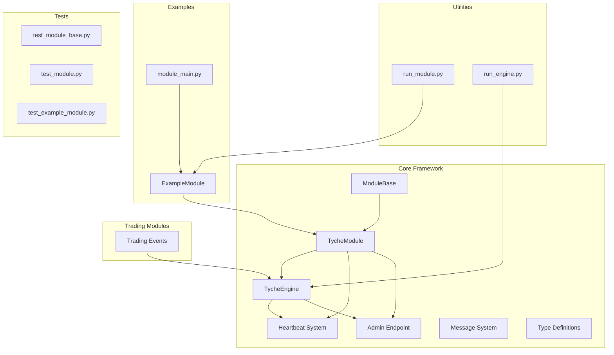
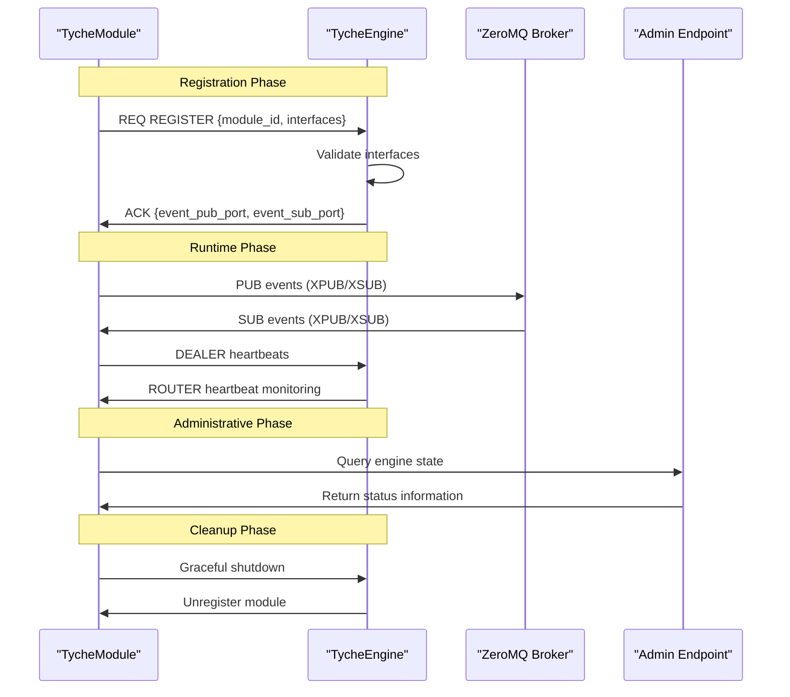
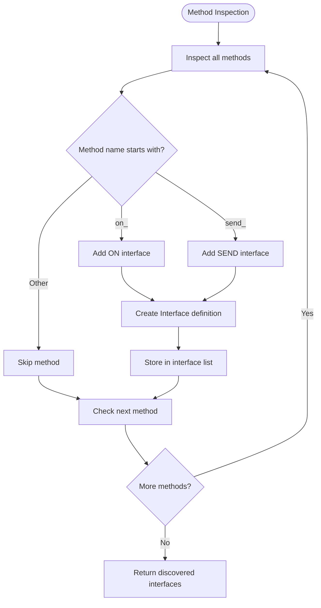
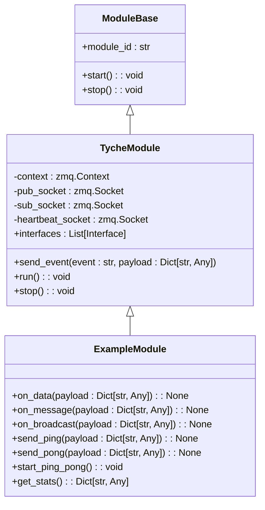
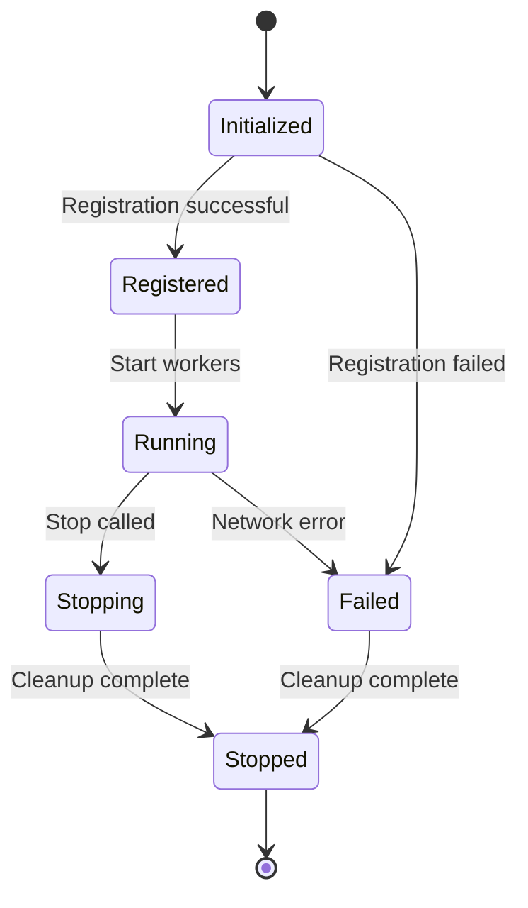
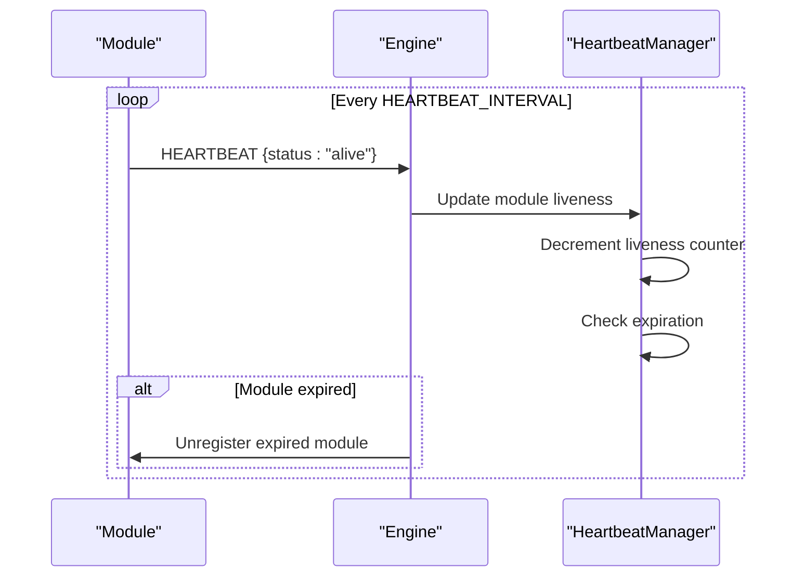
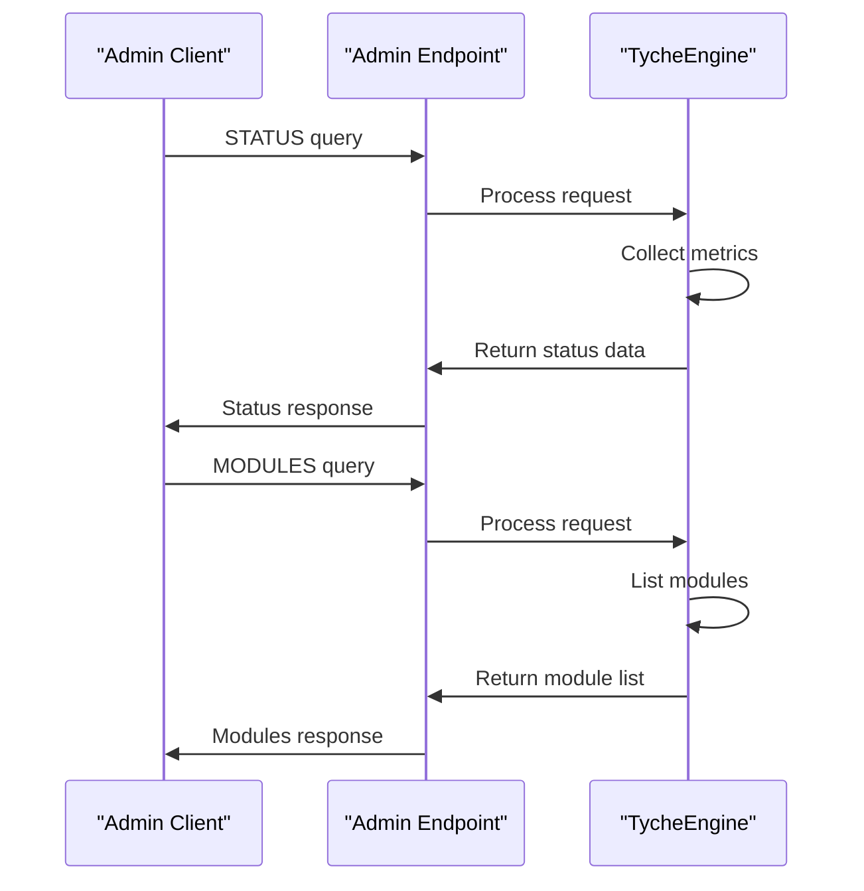
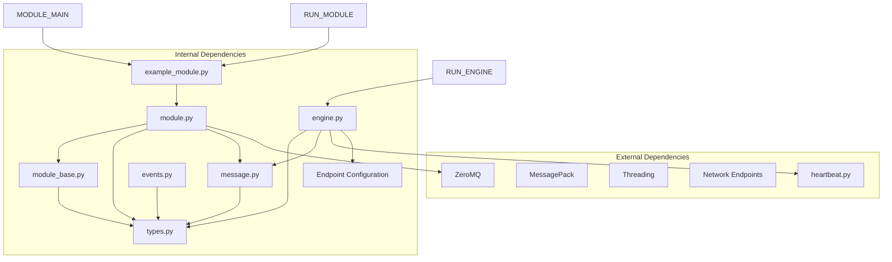

# TycheModule System

<cite>
**Referenced Files in This Document**
- [module_base.py](file://src/tyche/module_base.py)
- [module.py](file://src/tyche/module.py)
- [example_module.py](file://src/tyche/example_module.py)
- [module_main.py](file://src/tyche/module_main.py)
- [engine.py](file://src/tyche/engine.py)
- [types.py](file://src/tyche/types.py)
- [heartbeat.py](file://src/tyche/heartbeat.py)
- [events.py](file://src/modules/trading/events.py)
- [run_module.py](file://examples/run_module.py)
- [run_engine.py](file://examples/run_engine.py)
- [test_module_base.py](file://tests/unit/test_module_base.py)
- [test_module.py](file://tests/unit/test_module.py)
- [test_example_module.py](file://tests/unit/test_example_module.py)
</cite>

## Update Summary
**Changes Made**
- Updated interface discovery system to reflect new v3 unified queue model with simplified naming conventions (on_*, send_*)
- Enhanced heartbeat management documentation with sophisticated monitoring and liveness tracking
- Added administrative endpoint support documentation for engine state queries
- Updated communication patterns to reflect the streamlined v3 interface model
- Revised module lifecycle documentation to align with current implementation

## Table of Contents
1. [Introduction](#introduction)
2. [Project Structure](#project-structure)
3. [Core Components](#core-components)
4. [Architecture Overview](#architecture-overview)
5. [Detailed Component Analysis](#detailed-component-analysis)
6. [Dependency Analysis](#dependency-analysis)
7. [Performance Considerations](#performance-considerations)
8. [Troubleshooting Guide](#troubleshooting-guide)
9. [Conclusion](#conclusion)

## Introduction

The TycheModule system is a distributed event-driven framework built on ZeroMQ that enables asynchronous communication between heterogeneous modules. This system provides a standardized interface pattern system for event handling, automatic interface discovery, and robust module lifecycle management.

The framework supports a unified v3 interface model with two primary patterns:
- **on_** events: Consumer interfaces for event processing
- **send_** events: Producer declarations for event generation

Built around the Paranoid Pirate Pattern for reliability and ZeroMQ's advanced socket patterns, TycheModule ensures high-performance, scalable distributed processing with sophisticated heartbeat management and administrative monitoring capabilities.

**Enhanced Interface Discovery** The system now uses a simplified v3 unified queue model where method naming determines interface patterns rather than complex routing semantics. This provides cleaner separation between interface declaration and routing behavior.

## Project Structure

The TycheEngine project follows a clean modular architecture with clear separation of concerns:

**Diagram sources**
- [module_base.py:1-32](file://src/tyche/module_base.py#L1-L32)
- [module.py:1-434](file://src/tyche/module.py#L1-L434)
- [engine.py:1-200](file://src/tyche/engine.py#L1-L200)
- [heartbeat.py:1-153](file://src/tyche/heartbeat.py#L1-L153)
- [events.py:1-86](file://src/modules/trading/events.py#L1-L86)

**Section sources**
- [module_base.py:1-32](file://src/tyche/module_base.py#L1-L32)
- [module.py:1-434](file://src/tyche/module.py#L1-L434)
- [engine.py:1-200](file://src/tyche/engine.py#L1-L200)

## Core Components

### ModuleBase Abstract Class

The ModuleBase class defines the contract for all Tyche Engine modules. It establishes the fundamental interface that all modules must implement while providing automatic interface discovery capabilities.

Key responsibilities include:
- Defining the abstract interface contract (`module_id`, `start`, `stop`)
- Automatic interface pattern detection based on simplified method naming conventions
- Event handler resolution and dispatch mechanisms
- Pattern-based method signature validation

The automatic interface discovery system analyzes method names to determine interface patterns using the v3 unified queue model:
- `on_{event}` → ON pattern (consumer interface)
- `send_{event}` → SEND pattern (producer declaration)

**Enhanced Interface Discovery** The v3 model simplifies interface patterns by separating method naming from routing semantics. All discovered interfaces are registered consistently regardless of their intended routing behavior.

**Section sources**
- [module_base.py:1-32](file://src/tyche/module_base.py#L1-L32)

### TycheModule Implementation

TycheModule provides the concrete implementation of the ModuleBase contract, adding network connectivity, ZeroMQ integration, and complete module lifecycle management.

Core features include:
- **Network Connectivity**: ZMQ socket management for registration, event publishing/subscribing, and heartbeats
- **Registration Protocol**: One-shot REQ/REP handshake with the engine for module registration
- **Event Routing**: Automatic subscription to discovered interfaces and event dispatch
- **Heartbeat Monitoring**: Integration with engine's sophisticated heartbeat system for liveness detection
- **Administrative Support**: Integration with engine's admin endpoint for monitoring and control

The module maintains separate sockets for different communication patterns:
- REQ socket for one-time registration
- PUB socket for event publishing to engine's XSUB
- SUB socket for event subscription from engine's XPUB
- DEALER socket for heartbeat transmission

**Enhanced Heartbeat Management** TycheModule leverages the sophisticated heartbeat system with configurable intervals and liveness thresholds for robust module monitoring and failure detection.

**Section sources**
- [module.py:1-434](file://src/tyche/module.py#L1-L434)

### ExampleModule Reference Implementation

ExampleModule demonstrates the v3 unified queue interface patterns and serves as a comprehensive reference implementation. It showcases:
- Complete interface pattern coverage (on_*, send_*)
- Event chaining patterns with ping-pong coordination
- Timer-based scheduling with proper cleanup
- Statistics collection and reporting

**Enhanced Interface Patterns** ExampleModule demonstrates the simplified v3 interface model where all event handlers follow consistent naming conventions without complex routing semantics.

This module illustrates best practices for implementing custom modules while maintaining clean separation of concerns and consistent interface patterns.

**Section sources**
- [example_module.py:1-164](file://src/tyche/example_module.py#L1-L164)

## Architecture Overview

The TycheModule system implements a distributed broker-pattern architecture with clear separation between modules and the central engine:

**Diagram sources**
- [module.py:178-316](file://src/tyche/module.py#L178-L316)
- [engine.py:570-660](file://src/tyche/engine.py#L570-L660)

The architecture leverages ZeroMQ's advanced socket patterns:
- **REQ/REP**: One-time registration handshake
- **XPUB/XSUB**: Event routing and distribution
- **DEALER/ROUTER**: Reliable request-response with identity preservation
- **ROUTER/DEALER**: Administrative queries and monitoring

**Enhanced Administrative Support** The architecture now includes comprehensive administrative capabilities through dedicated admin endpoints for monitoring and control.

**Section sources**
- [engine.py:1-200](file://src/tyche/engine.py#L1-L200)
- [module.py:1-434](file://src/tyche/module.py#L1-L434)

## Detailed Component Analysis

### Interface Discovery System

The automatic interface discovery mechanism provides a powerful abstraction that eliminates manual interface registration boilerplate using the v3 unified queue model:

**Diagram sources**
- [module.py:106-123](file://src/tyche/module.py#L106-L123)

The discovery system supports two distinct interface patterns, each with specific behavioral guarantees and method signature requirements.

**Enhanced Interface Model** The v3 unified queue model simplifies interface patterns by focusing on consumption vs production rather than complex routing semantics, making the system more intuitive and maintainable.

**Section sources**
- [module.py:92-123](file://src/tyche/module.py#L92-L123)

### Event Handler Registration and Dispatch

The event handler registration system provides flexible method binding with automatic pattern detection:

**Diagram sources**
- [module_base.py:1-32](file://src/tyche/module_base.py#L1-L32)
- [module.py:1-434](file://src/tyche/module.py#L1-L434)
- [example_module.py:1-164](file://src/tyche/example_module.py#L1-L164)

**Enhanced Interface Patterns** The v3 model provides consistent interface registration where all discovered methods are treated uniformly, simplifying the handler registration process.

### Module Lifecycle Management

The module lifecycle encompasses several distinct phases with proper resource management and cleanup:

The lifecycle includes:
1. **Initialization**: Socket creation and configuration
2. **Registration**: One-shot handshake with engine
3. **Runtime**: Event processing and heartbeat maintenance
4. **Cleanup**: Resource destruction and graceful shutdown

**Enhanced Heartbeat Integration** The module lifecycle now includes sophisticated heartbeat management with configurable intervals and liveness monitoring for robust failure detection.

**Section sources**
- [module.py:178-258](file://src/tyche/module.py#L178-L258)

### Communication Patterns Implementation

Each communication pattern has specific implementation requirements and behavioral guarantees using the v3 unified queue model:

#### ON Pattern (Consumer Interfaces)
- Method signature: `on_{event}(payload: Dict[str, Any]) -> None`
- Behavior: Event consumption without acknowledgment
- Use cases: Data processing, event handling, business logic execution

#### SEND Pattern (Producer Declarations)
- Method signature: `send_{event}(payload: Dict[str, Any]) -> None`
- Behavior: Event generation without inbound handler registration
- Use cases: Data production, event publishing, system notifications

**Enhanced Interface Model** The v3 model eliminates the complexity of routing semantics by separating interface declaration from routing behavior, making the system more intuitive and maintainable.

**Section sources**
- [module.py:92-104](file://src/tyche/module.py#L92-L104)
- [types.py:54-63](file://src/tyche/types.py#L54-L63)

### Heartbeat and Reliability

The system implements sophisticated heartbeat monitoring using the Paranoid Pirate Pattern for reliable worker monitoring:

**Diagram sources**
- [heartbeat.py:16-153](file://src/tyche/heartbeat.py#L16-L153)
- [engine.py:559-568](file://src/tyche/engine.py#L559-L568)

**Enhanced Heartbeat Management** The heartbeat system now includes sophisticated monitoring with configurable intervals, liveness thresholds, and automatic cleanup of expired modules.

**Section sources**
- [heartbeat.py:16-153](file://src/tyche/heartbeat.py#L16-L153)
- [engine.py:559-568](file://src/tyche/engine.py#L559-L568)

### Administrative Endpoint Support

The engine provides comprehensive administrative capabilities through dedicated endpoints for monitoring and control:

**Diagram sources**
- [engine.py:570-660](file://src/tyche/engine.py#L570-L660)
- [heartbeat.py:91-153](file://src/tyche/heartbeat.py#L91-L153)

**Enhanced Administrative Capabilities** The administrative endpoint provides comprehensive monitoring capabilities including module status, system metrics, and real-time health monitoring.

**Section sources**
- [engine.py:570-660](file://src/tyche/engine.py#L570-L660)

## Dependency Analysis

The TycheModule system exhibits clean dependency relationships with minimal coupling:

**Diagram sources**
- [module.py:13-23](file://src/tyche/module.py#L13-L23)
- [engine.py:14-23](file://src/tyche/engine.py#L14-L23)
- [events.py:1-17](file://src/modules/trading/events.py#L1-L17)

The dependency graph reveals a well-structured system where:
- Core functionality is isolated in base classes
- Network concerns are encapsulated in specialized modules
- Examples demonstrate proper usage patterns with consistent interface models
- Trading modules showcase real-world event patterns and routing
- Tests validate system behavior without external dependencies

**Enhanced Administrative Integration** The dependency analysis now includes administrative endpoint support, which provides comprehensive monitoring and control capabilities across the entire system.

**Section sources**
- [module.py:13-23](file://src/tyche/module.py#L13-L23)
- [engine.py:14-23](file://src/tyche/engine.py#L14-L23)

## Performance Considerations

The TycheModule system is designed for high-performance distributed processing with several optimization strategies:

### ZeroMQ Socket Patterns
- **Asynchronous I/O**: Non-blocking socket operations prevent thread starvation
- **Polling Efficiency**: Single poller manages multiple socket events
- **Memory-mapped Buffers**: Lock-free ring buffers eliminate mutex contention
- **Batch Processing**: Event batching reduces system call overhead

### Concurrency Model
- **Thread-per-socket**: Dedicated threads for different socket types
- **Daemon Threads**: Background processing without blocking shutdown
- **Event-driven Architecture**: Reacts to socket readiness rather than polling
- **Graceful Shutdown**: Proper resource cleanup with timeout handling

### Memory Management
- **Object Pooling**: Reuse of message objects reduces garbage collection
- **Buffer Reuse**: Pre-allocated buffers minimize allocation overhead
- **Weak References**: Prevent circular references in event routing
- **Context Management**: Proper socket lifecycle management

**Enhanced Heartbeat Optimization** The heartbeat system includes optimized timing and liveness tracking to minimize overhead while maintaining reliable monitoring capabilities.

## Troubleshooting Guide

### Common Issues and Solutions

#### Registration Failures
**Symptoms**: Module fails to connect to engine during startup
**Causes**: Network connectivity, wrong endpoints, engine downtime
**Solutions**: Verify engine is running, check endpoint configuration, enable debug logging

#### Event Delivery Problems
**Symptoms**: Events not reaching intended recipients
**Causes**: Incorrect interface patterns, missing subscriptions, network partitions
**Solutions**: Validate method signatures, ensure proper interface discovery, check network connectivity

#### Performance Degradation
**Symptoms**: Increased latency, dropped events, memory growth
**Causes**: Insufficient buffering, slow handlers, network bottlenecks
**Solutions**: Tune ZeroMQ high-water marks, optimize handler implementations, monitor network performance

#### Heartbeat Issues
**Symptoms**: Modules marked as failed despite being operational
**Causes**: Heartbeat timeouts, network latency, system overload
**Solutions**: Adjust heartbeat intervals, increase liveness thresholds, monitor system resources

**Enhanced Administrative Monitoring** With administrative endpoints, developers can now monitor system health and performance in real-time, providing better visibility into system behavior and potential issues.

**Section sources**
- [module.py:241-258](file://src/tyche/module.py#L241-L258)
- [engine.py:636-646](file://src/tyche/engine.py#L636-L646)

### Debugging Strategies

1. **Enable Verbose Logging**: Set logging level to DEBUG for detailed event flow
2. **Monitor Socket States**: Track socket readiness and error conditions
3. **Validate Interface Patterns**: Ensure method signatures match expected patterns
4. **Test Network Connectivity**: Verify ZeroMQ socket connectivity and routing
5. **Profile Performance**: Measure event processing latency and throughput
6. **Query Administrative State**: Use admin endpoints for system monitoring
7. **Monitor Heartbeat Health**: Track module liveness and failure detection

**Enhanced Monitoring Capabilities** The debugging strategy now includes leveraging administrative endpoints for comprehensive system monitoring and health assessment.

## Conclusion

The TycheModule system provides a robust foundation for building distributed, event-driven applications. Its design emphasizes:

- **Simplicity**: Unified v3 interface model with clean on_/send_ patterns
- **Reliability**: Sophisticated heartbeat monitoring and failure detection
- **Performance**: Asynchronous processing and efficient socket management
- **Maintainability**: Clear abstractions and automatic interface discovery
- **Observability**: Comprehensive administrative endpoints for monitoring and control

**Enhanced Administrative Support** The recent improvements to administrative capabilities provide comprehensive monitoring and control over the entire system, enabling better observability and operational management.

The system successfully balances simplicity with power, enabling developers to build complex distributed systems while maintaining clean, testable code. The comprehensive example implementation and extensive test coverage provide excellent guidance for extending the framework with custom modules using the streamlined v3 interface model.

Future enhancements could include dynamic module loading, enhanced monitoring capabilities, and expanded administrative functionality, all while maintaining the core design principles that make TycheModule an effective distributed computing platform.