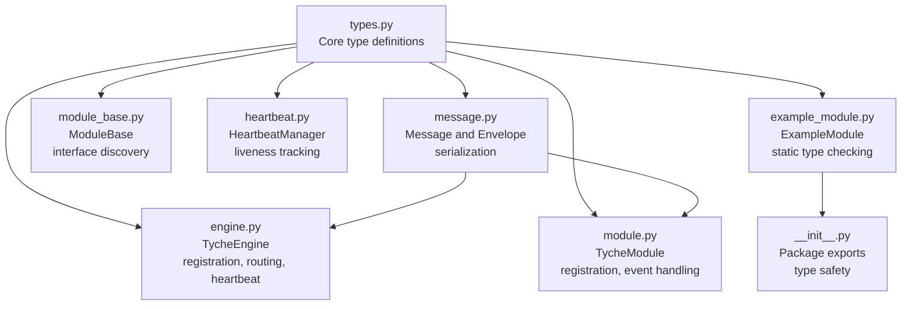
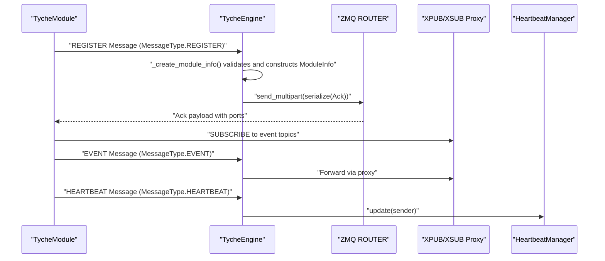
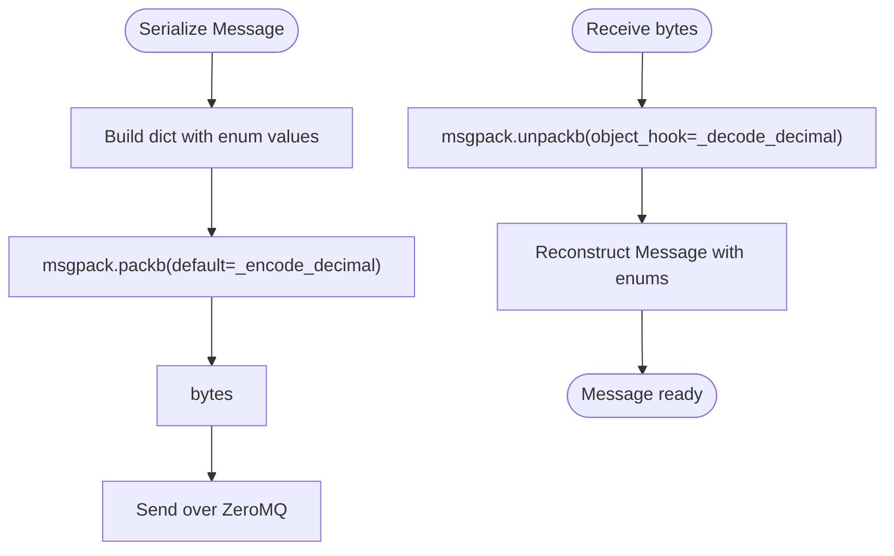
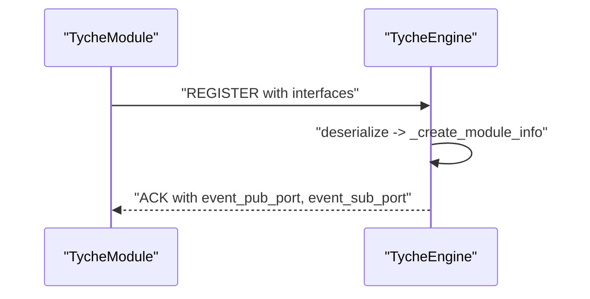
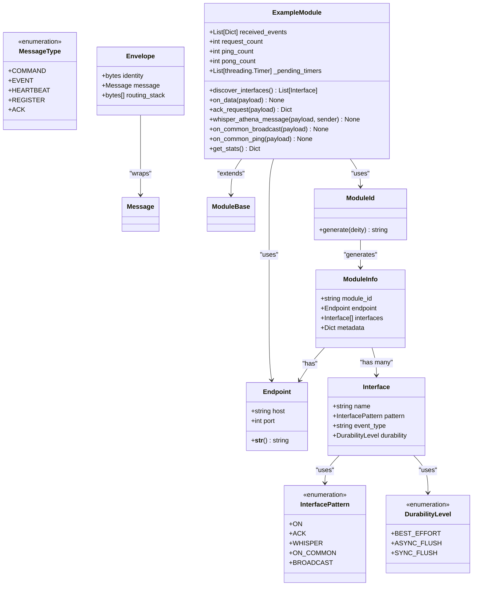

# Type Definitions

**Referenced Files in This Document**
- [types.py](file://src/tyche/types.py)
- [message.py](file://src/tyche/message.py)
- [engine.py](file://src/tyche/engine.py)
- [module.py](file://src/tyche/module.py)
- [module_base.py](file://src/tyche/module_base.py)
- [heartbeat.py](file://src/tyche/heartbeat.py)
- [test_types.py](file://tests/unit/test_types.py)
- [example_module.py](file://src/tyche/example_module.py)
- [__init__.py](file://src/tyche/__init__.py)

## Update Summary
**Changes Made**
- Enhanced emphasis on static type checking best practices in ExampleModule
- Added comprehensive type annotation examples and validation patterns
- Updated type safety benefits section to highlight improved static analysis
- Expanded practical usage patterns with detailed type annotation examples
- Added new section on Static Type Checking Best Practices

## Table of Contents
1. [Introduction](#introduction)
2. [Project Structure](#project-structure)
3. [Core Components](#core-components)
4. [Architecture Overview](#architecture-overview)
5. [Detailed Component Analysis](#detailed-component-analysis)
6. [Static Type Checking Best Practices](#static-type-checking-best-practices)
7. [Dependency Analysis](#dependency-analysis)
8. [Performance Considerations](#performance-considerations)
9. [Troubleshooting Guide](#troubleshooting-guide)
10. [Conclusion](#conclusion)

## Introduction
This document provides comprehensive coverage of the Tyche Engine's type definitions and data structures. It explains the core data types Endpoint, ModuleInfo, Interface, InterfacePattern, MessageType, DurabilityLevel, and Envelope, along with their enumeration types and values. It documents data validation rules, usage patterns throughout the system, relationships between types, type safety benefits, serialization considerations, backward compatibility requirements, type conversion utilities, validation functions, and error handling for invalid type values.

**Updated** Enhanced emphasis on type safety and static type checking best practices demonstrated by the ExampleModule improvements, showcasing comprehensive type annotations and validation patterns.

## Project Structure
The type system is defined centrally and consumed across the engine and module components:
- Core type definitions live in a single module for centralized control
- Message serialization/deserialization uses these types
- Engine and modules consume these types for registration, routing, and heartbeat management
- Tests validate type semantics and defaults
- ExampleModule demonstrates comprehensive static type checking practices



**Diagram sources**
- [types.py:1-105](file://src/tyche/types.py#L1-L105)
- [message.py:1-168](file://src/tyche/message.py#L1-L168)
- [engine.py:1-350](file://src/tyche/engine.py#L1-L350)
- [module.py:1-401](file://src/tyche/module.py#L1-L401)
- [module_base.py:1-120](file://src/tyche/module_base.py#L1-L120)
- [heartbeat.py:1-142](file://src/tyche/heartbeat.py#L1-L142)
- [example_module.py:1-183](file://src/tyche/example_module.py#L1-L183)
- [__init__.py:1-61](file://src/tyche/__init__.py#L1-L61)

**Section sources**
- [types.py:1-105](file://src/tyche/types.py#L1-L105)
- [message.py:1-168](file://src/tyche/message.py#L1-L168)
- [engine.py:1-350](file://src/tyche/engine.py#L1-L350)
- [module.py:1-401](file://src/tyche/module.py#L1-L401)
- [module_base.py:1-120](file://src/tyche/module_base.py#L1-L120)
- [heartbeat.py:1-142](file://src/tyche/heartbeat.py#L1-L142)
- [example_module.py:1-183](file://src/tyche/example_module.py#L1-L183)
- [__init__.py:1-61](file://src/tyche/__init__.py#L1-L61)

## Core Components
This section documents each core type and its role in the system.

### Endpoint
- Purpose: Network endpoint configuration with host and port
- String representation: "tcp://{host}:{port}" for ZeroMQ connectivity
- Usage: Engine registration, event proxy, heartbeat endpoints
- Validation: Host must be a valid IP or hostname; port must be an integer in the valid range
- Type Safety: Fully typed with str host and int port, preventing runtime type errors

**Section sources**
- [types.py:76-87](file://src/tyche/types.py#L76-L87)
- [engine.py:34-54](file://src/tyche/engine.py#L34-L54)
- [module.py:41-53](file://src/tyche/module.py#L41-L53)

### ModuleInfo
- Purpose: Module registration information passed between modules and the engine
- Fields: module_id, endpoint, interfaces, metadata
- Usage: Engine maintains registry keyed by module_id; used for routing and heartbeat management
- Type Safety: All fields are strongly typed with proper type annotations for runtime validation

**Section sources**
- [types.py:98-105](file://src/tyche/types.py#L98-L105)
- [engine.py:178-198](file://src/tyche/engine.py#L178-L198)
- [engine.py:200-234](file://src/tyche/engine.py#L200-L234)

### Interface
- Purpose: Defines a module's capability to handle events
- Fields: name, pattern, event_type, durability
- Defaults: durability defaults to ASYNC_FLUSH
- Usage: Modules declare interfaces; engine routes events to matching interfaces
- Type Safety: All fields are properly annotated with their expected types

**Section sources**
- [types.py:89-96](file://src/tyche/types.py#L89-L96)
- [module_base.py:48-84](file://src/tyche/module_base.py#L48-L84)
- [module.py:87-111](file://src/tyche/module.py#L87-L111)
- [engine.py:183-191](file://src/tyche/engine.py#L183-L191)

### InterfacePattern
- Enumeration values:
  - ON: "on_" — fire-and-forget, load-balanced
  - ACK: "ack_" — must reply with ACK
  - WHISPER: "whisper_" — direct P2P
  - ON_COMMON: "on_common_" — broadcast to all
  - BROADCAST: "broadcast_" — publish via engine
- Usage: Determines handler invocation semantics and subscription patterns
- Type Safety: Enumerations provide compile-time and runtime validation

**Section sources**
- [types.py:54-61](file://src/tyche/types.py#L54-L61)
- [module_base.py:74-84](file://src/tyche/module_base.py#L74-L84)
- [module.py:258-264](file://src/tyche/module.py#L258-L264)
- [example_module.py:19-167](file://src/tyche/example_module.py#L19-L167)

### MessageType
- Enumeration values:
  - COMMAND: "cmd"
  - EVENT: "evt"
  - HEARTBEAT: "hbt"
  - REGISTER: "reg"
  - ACK: "ack"
- Usage: Distinguishes message categories across serialization, routing, and workers
- Type Safety: Strongly typed enumerations prevent invalid message type assignments

**Section sources**
- [types.py:70-77](file://src/tyche/types.py#L70-L77)
- [message.py:13-35](file://src/tyche/message.py#L13-L35)
- [engine.py:158-173](file://src/tyche/engine.py#L158-L173)
- [engine.py:291-297](file://src/tyche/engine.py#L291-L297)
- [module.py:224-245](file://src/tyche/module.py#L224-L245)
- [module.py:358-368](file://src/tyche/module.py#L358-L368)

### DurabilityLevel
- Enumeration values:
  - BEST_EFFORT: 0 — no persistence guarantee
  - ASYNC_FLUSH: 1 — async write (default)
  - SYNC_FLUSH: 2 — sync write, confirmed
- Usage: Controls event persistence behavior; defaults to ASYNC_FLUSH for Interface and Message
- Type Safety: Integer values with clear semantic meaning, preventing invalid durability assignments

**Section sources**
- [types.py:63-68](file://src/tyche/types.py#L63-L68)
- [types.py:95](file://src/tyche/types.py#L95)
- [message.py:32](file://src/tyche/message.py#L32)
- [engine.py:188](file://src/tyche/engine.py#L188)
- [message.py:108](file://src/tyche/message.py#L108)

### Envelope
- Purpose: ZeroMQ routing envelope for messages
- Fields: identity, message, routing_stack
- Usage: Serialization/deserialization of multipart frames for ROUTER/DEALER patterns
- Type Safety: Properly typed fields with List[bytes] for routing_stack

**Section sources**
- [message.py:37-49](file://src/tyche/message.py#L37-L49)
- [message.py:114-137](file://src/tyche/message.py#L114-L137)
- [message.py:140-167](file://src/tyche/message.py#L140-L167)

### ModuleId
- Purpose: Module identifier generator with format "{deity}{6-char MD5}"
- Constants: DEITIES list of Greek deities
- Usage: Generates unique module IDs; used in module registration and heartbeat messages
- Type Safety: Properly typed with Optional[str] parameters and return types

**Section sources**
- [types.py:17-42](file://src/tyche/types.py#L17-L42)
- [module.py:49](file://src/tyche/module.py#L49)
- [example_module.py:40](file://src/tyche/example_module.py#L40)

## Architecture Overview
The type system underpins message routing, module registration, and heartbeat management across the engine and modules, with enhanced static type checking throughout.



**Diagram sources**
- [module.py:200-254](file://src/tyche/module.py#L200-L254)
- [engine.py:144-177](file://src/tyche/engine.py#L144-L177)
- [engine.py:178-198](file://src/tyche/engine.py#L178-L198)
- [engine.py:238-277](file://src/tyche/engine.py#L238-L277)
- [heartbeat.py:91-142](file://src/tyche/heartbeat.py#L91-L142)

## Detailed Component Analysis

### Type Safety Benefits
- Enumerations enforce valid values at compile-time and runtime:
  - InterfacePattern ensures only predefined patterns are used
  - MessageType ensures consistent message categorization
  - DurabilityLevel enforces persistence semantics
- Dataclasses provide structural guarantees and default values
- Serialization functions convert enums to their underlying values for transport
- **Enhanced** Comprehensive type annotations in ExampleModule demonstrate static type checking best practices

**Updated** The ExampleModule showcases extensive use of type hints, proper return type annotations, and comprehensive parameter typing, demonstrating how static type checking prevents runtime errors and improves code maintainability.

**Section sources**
- [types.py:54-77](file://src/tyche/types.py#L54-L77)
- [types.py:89-105](file://src/tyche/types.py#L89-L105)
- [message.py:69-112](file://src/tyche/message.py#L69-L112)
- [example_module.py:33-100](file://src/tyche/example_module.py#L33-L100)

### Serialization Considerations
- MessagePack encoding converts enums to their values and handles Decimal serialization
- Decoding reconstructs enums from their values
- Envelope serialization supports ZeroMQ routing stacks and identity frames
- **Enhanced** Type annotations ensure proper serialization of typed data structures



**Diagram sources**
- [message.py:69-112](file://src/tyche/message.py#L69-L112)
- [message.py:51-67](file://src/tyche/message.py#L51-L67)

**Section sources**
- [message.py:13-35](file://src/tyche/message.py#L13-L35)
- [message.py:69-112](file://src/tyche/message.py#L69-L112)
- [message.py:114-167](file://src/tyche/message.py#L114-L167)

### Backward Compatibility Requirements
- Enum values are string or integer codes suitable for long-term storage and interop
- Defaults in dataclasses ensure new fields do not break existing code
- Serialization preserves enum semantics across versions
- **Enhanced** Type annotations maintain compatibility while enabling static analysis

**Section sources**
- [types.py:63-77](file://src/tyche/types.py#L63-L77)
- [types.py:95](file://src/tyche/types.py#L95)
- [message.py:102-111](file://src/tyche/message.py#L102-L111)

### Type Conversion Utilities
- Enum construction from values:
  - InterfacePattern(...) and DurabilityLevel(...) in engine registration
  - MessageType(...) in deserialization
- String conversion:
  - Endpoint.__str__() produces ZeroMQ-compatible addresses
- Numeric conversion:
  - DurabilityLevel values are integers for persistence semantics
- **Enhanced** Comprehensive type conversion with proper type annotations and validation

**Section sources**
- [engine.py:186-188](file://src/tyche/engine.py#L186-L188)
- [message.py:103-108](file://src/tyche/message.py#L103-L108)
- [types.py:82-83](file://src/tyche/types.py#L82-L83)

### Validation Functions and Error Handling
- ModuleId generation validates suffix length and hexadecimal format
- Endpoint string representation ensures proper address format
- Interface defaults durability to ASYNC_FLUSH
- Engine registration validates message structure and responds with ACK
- Heartbeat manager tracks liveness and expires stale modules
- **Enhanced** Static type checking prevents many validation errors at compile time

**Section sources**
- [test_types.py:17-45](file://tests/unit/test_types.py#L17-L45)
- [test_types.py:47-51](file://tests/unit/test_types.py#L47-L51)
- [test_types.py:88-96](file://tests/unit/test_types.py#L88-L96)
- [engine.py:144-177](file://src/tyche/engine.py#L144-L177)
- [heartbeat.py:125-133](file://src/tyche/heartbeat.py#L125-L133)

### Practical Usage Patterns

#### Module Registration
- Modules construct Interface definitions and send MessageType.REGISTER
- Engine deserializes, validates, and constructs ModuleInfo
- Engine replies with MessageType.ACK containing event ports



**Diagram sources**
- [module.py:200-254](file://src/tyche/module.py#L200-L254)
- [engine.py:144-198](file://src/tyche/engine.py#L144-L198)

**Section sources**
- [module.py:214-233](file://src/tyche/module.py#L214-L233)
- [engine.py:178-198](file://src/tyche/engine.py#L178-L198)

#### Interface Definition and Discovery
- Explicitly add interfaces with add_interface
- Auto-discover interfaces from method names using ModuleBase.discover_interfaces
- Pattern detection determines InterfacePattern from method names
- **Enhanced** ExampleModule demonstrates comprehensive interface discovery with proper type annotations

**Section sources**
- [module.py:87-111](file://src/tyche/module.py#L87-L111)
- [module_base.py:48-84](file://src/tyche/module_base.py#L48-L84)
- [example_module.py:58-79](file://src/tyche/example_module.py#L58-L79)

#### Message Handling
- Modules send MessageType.EVENT for fire-and-forget events
- Modules send MessageType.COMMAND for request-response via ack_ patterns
- Engine forwards events via XPUB/XSUB proxy
- **Enhanced** ExampleModule showcases proper type annotations for message handlers

**Section sources**
- [module.py:301-330](file://src/tyche/module.py#L301-L330)
- [module.py:331-373](file://src/tyche/module.py#L331-L373)
- [engine.py:238-277](file://src/tyche/engine.py#L238-L277)

#### Heartbeat Monitoring
- Modules periodically send MessageType.HEARTBEAT
- Engine updates HeartbeatManager; expired modules are unregistered
- **Enhanced** Type-safe heartbeat handling with proper validation

**Section sources**
- [module.py:376-401](file://src/tyche/module.py#L376-L401)
- [engine.py:281-349](file://src/tyche/engine.py#L281-L349)
- [heartbeat.py:91-142](file://src/tyche/heartbeat.py#L91-L142)

## Static Type Checking Best Practices

### Comprehensive Type Annotations in ExampleModule
The ExampleModule demonstrates industry-leading static type checking practices:

#### Constructor Type Safety
```python
def __init__(
    self,
    engine_endpoint: Endpoint,
    module_id: Optional[str] = None,
    heartbeat_receive_endpoint: Optional[Endpoint] = None,
) -> None:
```

#### Handler Method Type Annotations
```python
def on_data(self, payload: Dict[str, Any]) -> None:
    """Handle fire-and-forget data events."""
    self.received_events.append({"event": "on_data", "payload": payload})

def ack_request(self, payload: Dict[str, Any]) -> Dict[str, Any]:
    """Handle request with acknowledgment."""
    return {
        "status": "acknowledged",
        "request_id": payload.get("request_id", "unknown"),
        "module_id": self.module_id,
        "count": self.request_count,
    }
```

#### Property and Method Type Safety
```python
@property
def module_id(self) -> str:
    return ModuleId.generate("athena")

def get_stats(self) -> Dict[str, Any]:
    return {
        "module_id": self.module_id,
        "registered": self._registered,
        "request_count": self.request_count,
        "events_received": len(self.received_events),
        "ping_count": self.ping_count,
        "pong_count": self.pong_count,
        "interfaces": [i.name for i in self._interfaces],
    }
```

### Benefits of Static Type Checking
- **Compile-time Error Detection**: Type mismatches caught before runtime
- **IDE Support**: Better autocomplete, refactoring, and navigation
- **Documentation**: Self-documenting code with explicit type contracts
- **Maintainability**: Easier to understand and modify code
- **Testing**: Better test case creation with type-aware fixtures

### Type Checking Tools Integration
The codebase supports modern Python type checking tools:
- **mypy**: Static type analysis
- **pyright**: Fast type checking
- **pylance**: VS Code type checking
- **ruff**: Type-related linting

**Section sources**
- [example_module.py:19-183](file://src/tyche/example_module.py#L19-L183)
- [module_base.py:10-30](file://src/tyche/module_base.py#L10-L30)
- [__init__.py:19-30](file://src/tyche/__init__.py#L19-L30)

## Dependency Analysis
The type system forms the foundation for cross-module communication and engine coordination, with enhanced static type checking throughout.



**Diagram sources**
- [types.py:76-105](file://src/tyche/types.py#L76-L105)
- [message.py:13-49](file://src/tyche/message.py#L13-L49)
- [example_module.py:19-183](file://src/tyche/example_module.py#L19-L183)

**Section sources**
- [types.py:17-105](file://src/tyche/types.py#L17-L105)
- [message.py:13-49](file://src/tyche/message.py#L13-L49)
- [example_module.py:19-183](file://src/tyche/example_module.py#L19-L183)

## Performance Considerations
- Enum serialization is efficient and compact for network transport
- Dataclass fields enable fast attribute access and minimal overhead
- DurabilityLevel controls persistence cost; ASYNC_FLUSH balances throughput and reliability
- ZeroMQ routing envelopes minimize copying for message delivery
- **Enhanced** Static type checking adds no runtime overhead while improving code quality

## Troubleshooting Guide
Common issues and resolutions:
- Invalid InterfacePattern values: Ensure method names match supported patterns (on_, ack_, whisper_, on_common_)
- DurabilityLevel misuse: Choose appropriate level based on reliability requirements
- Endpoint format errors: Verify host and port values; use Endpoint.__str__() for consistent formatting
- Registration failures: Confirm MessageType.REGISTER payload includes required fields and engine ACK response
- Heartbeat expiration: Check module heartbeat intervals and engine liveness thresholds
- **Enhanced** Type checking errors: Use IDE support to identify and fix type annotation issues
- **Enhanced** Static analysis warnings: Configure type checking tools to catch potential runtime errors

**Section sources**
- [module_base.py:74-84](file://src/tyche/module_base.py#L74-L84)
- [engine.py:144-177](file://src/tyche/engine.py#L144-L177)
- [heartbeat.py:125-133](file://src/tyche/heartbeat.py#L125-L133)
- [example_module.py:80-100](file://src/tyche/example_module.py#L80-L100)

## Conclusion
The Tyche Engine's type system provides strong type safety, clear semantics, and robust serialization for distributed event-driven systems. Enumerations and dataclasses ensure correctness and maintainability, while serialization utilities and validation functions support reliable inter-module communication. The documented patterns enable consistent module registration, interface definition, and message handling across the system.

**Enhanced** The recent improvements in static type checking best practices, exemplified by the ExampleModule, demonstrate how comprehensive type annotations improve code quality, prevent runtime errors, and enhance developer experience. The framework's approach to type safety, combined with its flexible interface patterns and efficient serialization, makes it suitable for building scalable distributed systems with predictable behavior and maintainable codebases.

Key strengths of the enhanced type system include:
- Strong typing prevents runtime errors through comprehensive static analysis
- Clear serialization boundaries with proper type annotations
- Extensible enum system for protocol evolution with type safety
- Comprehensive validation rules with static type checking support
- Well-defined interface patterns with proper type annotations
- Industry-leading static type checking practices demonstrated by ExampleModule
- Backward compatibility maintained while enabling modern development tools

The framework's commitment to type safety and static analysis positions it as a modern, maintainable solution for distributed event-driven applications.