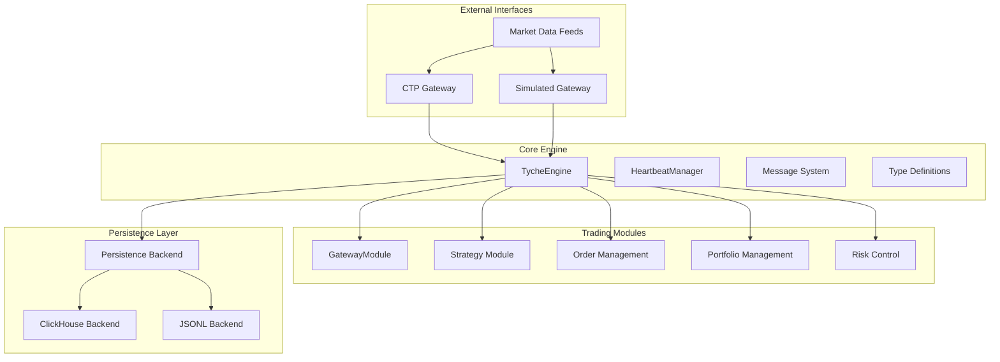
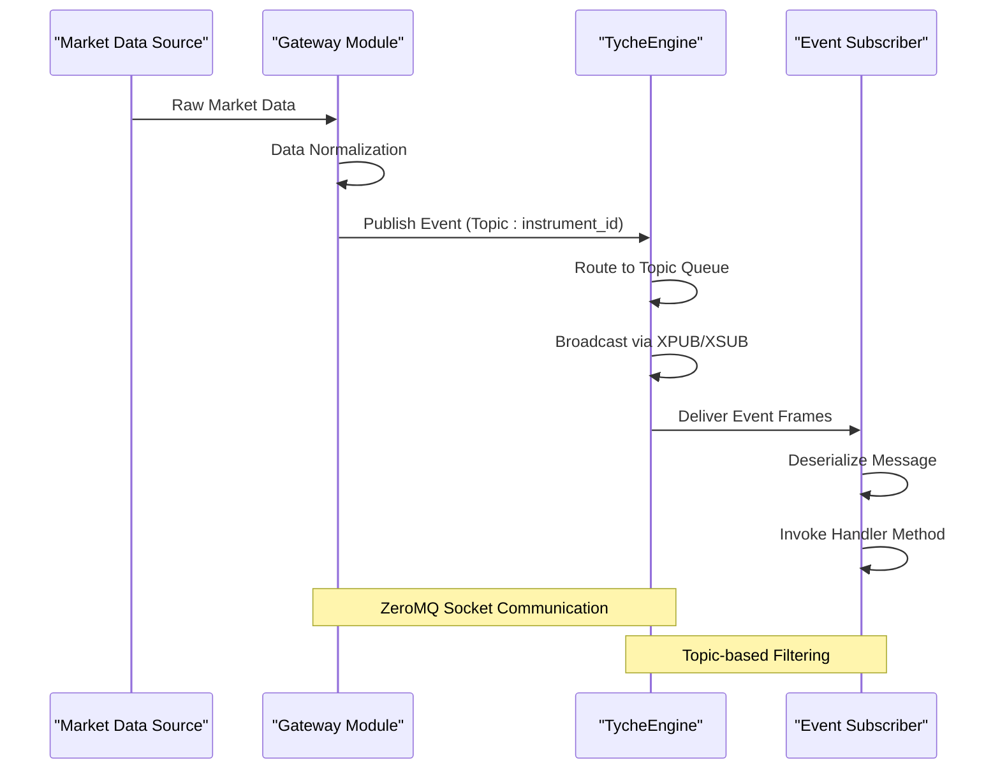
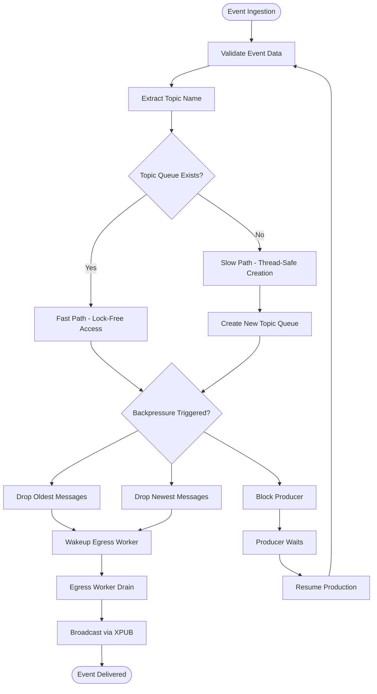
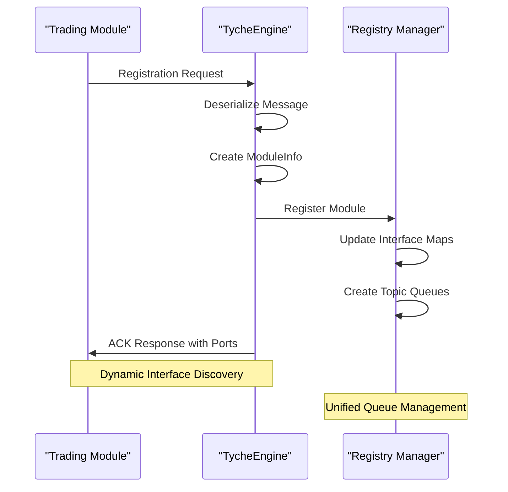
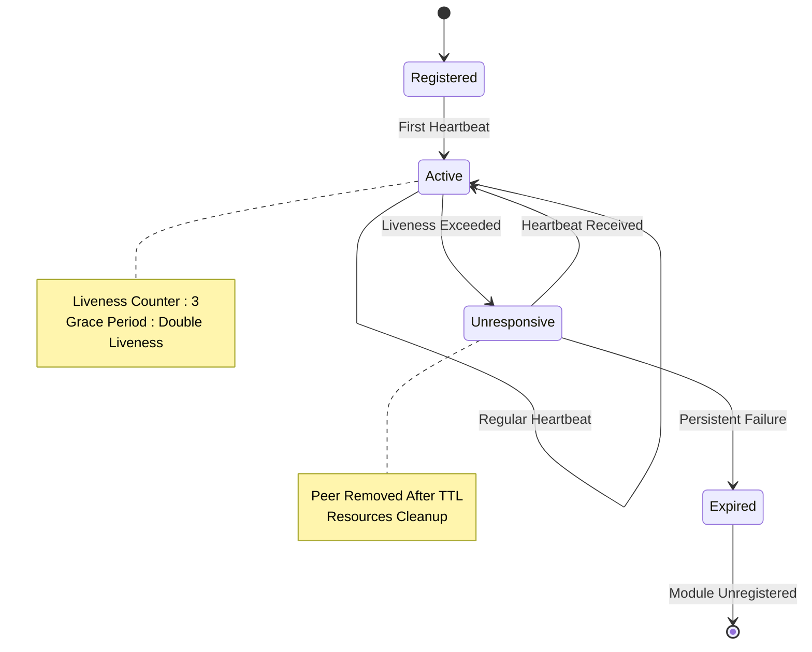
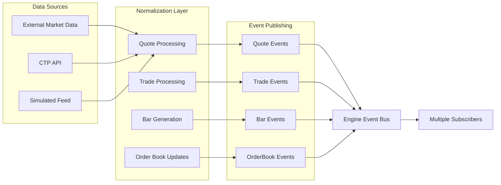
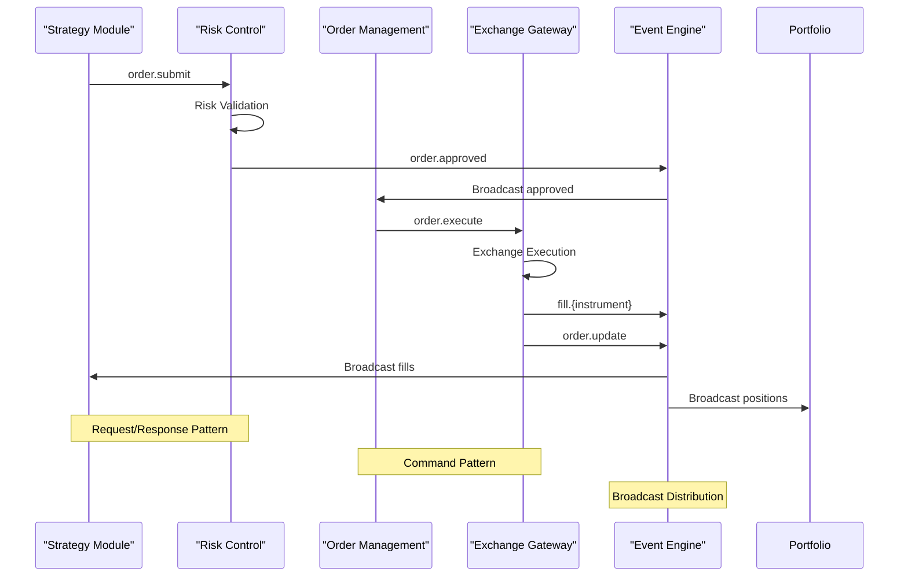

# Event Ingestion Planning

<cite>
**Referenced Files in This Document**
- [engine.py](file://src/tyche/engine.py)
- [module.py](file://src/tyche/module.py)
- [message.py](file://src/tyche/message.py)
- [types.py](file://src/tyche/types.py)
- [heartbeat.py](file://src/tyche/heartbeat.py)
- [events.py](file://src/modules/trading/events.py)
- [tick.py](file://src/modules/trading/models/tick.py)
- [order.py](file://src/modules/trading/models/order.py)
- [base.py](file://src/modules/trading/gateway/base.py)
- [simulated.py](file://src/modules/trading/gateway/simulated.py)
- [gateway.py](file://src/modules/trading/gateway/ctp/gateway.py)
- [run_engine.py](file://examples/run_engine.py)
- [run_gateway.py](file://examples/run_gateway.py)
- [backend.py](file://src/modules/trading/persistence/backend.py)
</cite>

## Table of Contents
1. [Introduction](#introduction)
2. [Project Structure](#project-structure)
3. [Core Components](#core-components)
4. [Architecture Overview](#architecture-overview)
5. [Detailed Component Analysis](#detailed-component-analysis)
6. [Event Ingestion Pipeline](#event-ingestion-pipeline)
7. [Performance Considerations](#performance-considerations)
8. [Troubleshooting Guide](#troubleshooting-guide)
9. [Conclusion](#conclusion)

## Introduction

The TycheEngine is a high-performance event-driven trading system designed for modern financial markets. This document provides comprehensive planning for event ingestion, focusing on the system's architecture, data flow patterns, and operational characteristics. The system employs a ZeroMQ-based messaging infrastructure with a central engine coordinating multiple specialized modules for market data ingestion, order routing, and real-time processing.

The event ingestion planning covers the complete pipeline from external market data sources through the internal event system, ensuring reliable delivery, backpressure handling, and scalable processing capabilities. This document serves as both a technical specification and operational guide for implementing robust event ingestion systems.

## Project Structure

The TycheEngine follows a modular architecture with clear separation of concerns:

**Diagram sources**
- [engine.py:28-104](file://src/tyche/engine.py#L28-L104)
- [module.py:28-89](file://src/tyche/module.py#L28-L89)
- [base.py:22-46](file://src/modules/trading/gateway/base.py#L22-L46)

**Section sources**
- [engine.py:1-660](file://src/tyche/engine.py#L1-L660)
- [module.py:1-434](file://src/tyche/module.py#L1-L434)
- [types.py:1-117](file://src/tyche/types.py#L1-L117)

## Core Components

### TycheEngine - Central Event Broker

The TycheEngine serves as the central coordinator for all module communications, implementing a sophisticated event distribution system:

**Key Features:**
- **Multi-threaded Architecture**: Separate worker threads for registration, event proxying, heartbeat monitoring, and administrative tasks
- **Unified Queue System**: Per-topic message queues with dynamic creation and garbage collection
- **ZeroMQ Integration**: XPUB/XSUB proxy for efficient event distribution with minimal latency
- **Backpressure Management**: Configurable strategies for handling message overflow
- **Health Monitoring**: Paranoid Pirate pattern for peer liveness detection

**Thread Architecture:**
- Registration Worker: Handles module registration requests
- Event Proxy Worker: Manages XPUB/XSUB socket communication
- Heartbeat Workers: Monitor peer health and distribute heartbeats
- Egress Worker: Drains topic queues and broadcasts events
- Monitor Worker: Performs garbage collection and cleanup
- Admin Worker: Processes administrative queries

**Section sources**
- [engine.py:28-104](file://src/tyche/engine.py#L28-L104)
- [engine.py:117-156](file://src/tyche/engine.py#L117-L156)

### Message System - Serialization and Routing

The message system provides robust serialization and routing capabilities:

**Message Structure:**
- **Message Type**: Event, command, heartbeat, registration, acknowledgment
- **Routing Metadata**: Sender identification, recipient targeting, correlation IDs
- **Payload Encoding**: MessagePack with custom Decimal handling
- **Durability Levels**: Configurable persistence guarantees

**Serialization Features:**
- Custom Decimal encoding/decoding for financial precision
- Enum serialization for type safety
- Binary MessagePack format for efficiency
- Routing envelope support for multi-hop messaging

**Section sources**
- [message.py:13-112](file://src/tyche/message.py#L13-L112)
- [types.py:79-87](file://src/tyche/types.py#L79-L87)

### Gateway Modules - External Interface

Gateway modules provide the bridge between external market data feeds and the internal event system:

**Gateway Types:**
- **CTP Gateway**: Connects to Chinese Futures Trading Platform
- **Simulated Gateway**: Provides synthetic market data for testing
- **Base Gateway**: Abstract interface for custom implementations

**Event Publishing Patterns:**
- Market data: Quote, Trade, Bar, OrderBook events
- Order flow: Execution, cancellation, and status updates
- Fill reporting: Trade execution confirmations
- System events: Connection status and lifecycle notifications

**Section sources**
- [base.py:22-191](file://src/modules/trading/gateway/base.py#L22-L191)
- [events.py:1-86](file://src/modules/trading/events.py#L1-L86)

## Architecture Overview

The event ingestion architecture implements a publish-subscribe pattern with sophisticated routing and backpressure handling:

**Diagram sources**
- [engine.py:334-466](file://src/tyche/engine.py#L334-L466)
- [module.py:328-376](file://src/tyche/module.py#L328-L376)

The architecture ensures loose coupling between components while maintaining high throughput and reliability. The XPUB/XSUB proxy eliminates the need for explicit routing logic, reducing complexity and improving performance.

**Section sources**
- [engine.py:334-466](file://src/tyche/engine.py#L334-L466)
- [module.py:178-259](file://src/tyche/module.py#L178-L259)

## Detailed Component Analysis

### Event Distribution System

The event distribution system implements a sophisticated routing mechanism with multiple layers of abstraction:

**Diagram sources**
- [engine.py:400-466](file://src/tyche/engine.py#L400-L466)

**Section sources**
- [engine.py:400-466](file://src/tyche/engine.py#L400-L466)

### Module Registration and Lifecycle

The module registration system provides automatic interface discovery and dynamic subscription management:

**Diagram sources**
- [engine.py:207-300](file://src/tyche/engine.py#L207-L300)
- [module.py:106-177](file://src/tyche/module.py#L106-L177)

**Section sources**
- [engine.py:207-300](file://src/tyche/engine.py#L207-L300)
- [module.py:106-177](file://src/tyche/module.py#L106-L177)

### Heartbeat and Health Monitoring

The heartbeat system implements the Paranoid Pirate pattern for reliable peer monitoring:

**Diagram sources**
- [heartbeat.py:91-153](file://src/tyche/heartbeat.py#L91-L153)

**Section sources**
- [heartbeat.py:91-153](file://src/tyche/heartbeat.py#L91-L153)

## Event Ingestion Pipeline

### Market Data Ingestion Flow

The market data ingestion pipeline handles real-time data from multiple sources with consistent processing:

**Diagram sources**
- [gateway.py:312-351](file://src/modules/trading/gateway/ctp/gateway.py#L312-L351)
- [simulated.py:172-219](file://src/modules/trading/gateway/simulated.py#L172-L219)
- [events.py:20-86](file://src/modules/trading/events.py#L20-L86)

### Order Flow Processing

The order flow processing ensures reliable execution and status reporting:

**Diagram sources**
- [events.py:28-57](file://src/modules/trading/events.py#L28-L57)
- [base.py:126-191](file://src/modules/trading/gateway/base.py#L126-L191)

**Section sources**
- [events.py:28-57](file://src/modules/trading/events.py#L28-L57)
- [base.py:126-191](file://src/modules/trading/gateway/base.py#L126-L191)

## Performance Considerations

### Throughput Optimization

The system achieves high throughput through several optimization strategies:

**ZeroMQ Socket Configuration:**
- High Water Mark (HWM) set to 10,000 for all sockets
- Non-blocking operations with appropriate timeouts
- Minimal copying between threads and processes

**Memory Management:**
- Pre-allocated buffers for message serialization
- Efficient queue implementations with bounded capacity
- Thread-local caching for frequently accessed data

**Processing Pipeline:**
- Lock-free fast path for existing topic queues
- Batch processing for improved efficiency
- Asynchronous event dispatching

### Scalability Planning

**Horizontal Scaling:**
- Multiple engine instances can operate independently
- Load balancing through strategic module placement
- Shared persistence backends for cross-instance coordination

**Vertical Scaling:**
- CPU-bound processing parallelization
- Memory optimization for high-frequency data
- Network bandwidth optimization for market data feeds

**Resource Management:**
- Configurable backpressure strategies
- Garbage collection for idle topic queues
- Heartbeat-based peer health monitoring

## Troubleshooting Guide

### Common Issues and Solutions

**Registration Failures:**
- Verify engine endpoints are reachable
- Check module interface definitions
- Confirm network connectivity and firewall settings

**Event Delivery Problems:**
- Monitor topic queue depths
- Verify subscriber subscriptions
- Check for message serialization errors

**Performance Degradation:**
- Review backpressure configuration
- Analyze thread utilization
- Monitor memory consumption patterns

**Heartbeat Monitoring:**
- Check peer liveness indicators
- Verify heartbeat interval configuration
- Monitor for network latency issues

**Section sources**
- [engine.py:570-660](file://src/tyche/engine.py#L570-L660)
- [heartbeat.py:125-153](file://src/tyche/heartbeat.py#L125-L153)

### Diagnostic Commands

The engine provides administrative endpoints for system monitoring:

**Status Queries:**
- Module registration counts
- Event processing statistics
- Topic queue utilization metrics
- Heartbeat monitoring status

**Runtime Information:**
- Engine uptime and resource usage
- Active module inventory
- Event distribution metrics
- Error rate monitoring

**Section sources**
- [engine.py:593-660](file://src/tyche/engine.py#L593-L660)

## Conclusion

The TycheEngine's event ingestion system provides a robust foundation for high-frequency trading applications. The architecture balances performance, reliability, and scalability through careful design choices and proven patterns.

**Key Strengths:**
- ZeroMQ-based messaging for high throughput
- Unified queue system with dynamic topic management
- Comprehensive backpressure handling
- Robust health monitoring and recovery
- Modular architecture supporting extensibility

**Implementation Recommendations:**
- Start with simulated gateway for development
- Implement proper error handling and retry logic
- Monitor system metrics continuously
- Plan for horizontal scaling from the beginning
- Design for graceful degradation under stress

The event ingestion planning outlined in this document provides a comprehensive framework for building reliable, high-performance trading systems that can handle the demands of modern financial markets.