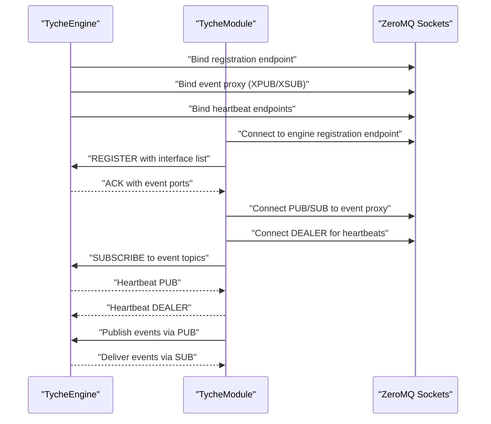
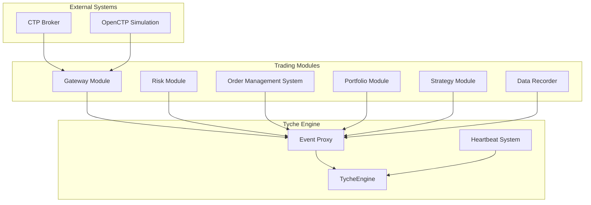

# Getting Started

**Referenced Files in This Document**
- [README.md](file://README.md)
- [pyproject.toml](file://pyproject.toml)
- [src/tyche/engine.py](file://src/tyche/engine.py)
- [src/tyche/module.py](file://src/tyche/module.py)
- [src/tyche/module_base.py](file://src/tyche/module_base.py)
- [src/tyche/example_module.py](file://src/tyche/example_module.py)
- [src/tyche/types.py](file://src/tyche/types.py)
- [src/tyche/message.py](file://src/tyche/message.py)
- [src/tyche/heartbeat.py](file://src/tyche/heartbeat.py)
- [examples/run_engine.py](file://examples/run_engine.py)
- [examples/run_module.py](file://examples/run_module.py)
- [examples/run_ctp_gateway.py](file://examples/run_ctp_gateway.py)
- [examples/run_strategy.py](file://examples/run_strategy.py)
- [examples/run_trading_system.py](file://examples/run_trading_system.py)
- [examples/run_trading_services.py](file://examples/run_trading_services.py)
- [src/modules/trading/gateway/ctp/gateway.py](file://src/modules/trading/gateway/ctp/gateway.py)
- [src/modules/trading/gateway/ctp/sim.py](file://src/modules/trading/gateway/ctp/sim.py)
- [src/modules/trading/gateway/ctp/live.py](file://src/modules/trading/gateway/ctp/live.py)
- [src/modules/trading/gateway/base.py](file://src/modules/trading/gateway/base.py)
- [src/modules/trading/models/tick.py](file://src/modules/trading/models/tick.py)
- [src/modules/trading/models/order.py](file://src/modules/trading/models/order.py)
- [tests/integration/test_engine_module.py](file://tests/integration/test_engine_module.py)

## Table of Contents
1. [Introduction](#introduction)
2. [System Requirements](#system-requirements)
3. [Installation](#installation)
4. [Environment Setup](#environment-setup)
5. [First Run: Engine and Module](#first-run-engine-and-module)
6. [Basic Workflow: From Startup to Event Handling](#basic-workflow-from-startup-to-event-handling)
7. [Essential Concepts](#essential-concepts)
8. [Practical Examples Using Provided Scripts](#practical-examples-using-provided-scripts)
9. [Command-Line Arguments and Configuration Options](#command-line-arguments-and-configuration-options)
10. [Trading System Architecture](#trading-system-architecture)
11. [Troubleshooting Guide](#troubleshooting-guide)
12. [Verification Steps](#verification-steps)
13. [Conclusion](#conclusion)

## Introduction
Tyche Engine is a high-performance, distributed, event-driven framework written in Python and built on ZeroMQ. It orchestrates multi-process applications through:
- Event Management: Publish/subscribe and request-response patterns
- Module Management: Centralized registration, lifecycle, and health monitoring

Tyche enables modules to communicate asynchronously, reliably, and at scale using well-defined interface patterns and ZeroMQ socket topologies.

**Section sources**
- [README.md:18-348](file://README.md#L18-L348)

## System Requirements
- Python: Version 3.9 or newer
- Dependencies:
  - pyzmq (ZeroMQ bindings)
  - msgpack (serialization)
  - openctp-ctp (for CTP gateway functionality)
- Optional development dependencies for contributors:
  - pytest, mypy, ruff

These requirements are declared in the project configuration.

**Section sources**
- [pyproject.toml:5-13](file://pyproject.toml#L5-L13)

## Installation
Install the package in development mode to use the provided examples and run the engine and modules locally.

- Install the project with pip:
  - pip install -e .
- Verify installation by importing the core modules from the examples directory.

Notes:
- The examples demonstrate running the engine and module as separate processes.
- The examples add the source directory to the Python path to import the library modules.

**Section sources**
- [examples/run_engine.py:14-15](file://examples/run_engine.py#L14-L15)
- [examples/run_module.py:15-16](file://examples/run_module.py#L15-L16)
- [examples/run_ctp_gateway.py:46-47](file://examples/run_ctp_gateway.py#L46-L47)
- [pyproject.toml:61-63](file://pyproject.toml#L61-L63)

## Environment Setup
- Ensure Python 3.9+ is installed.
- Install dependencies:
  - pip install pyzmq msgpack openctp-ctp
- Optional dev tools:
  - pip install pytest pytest-asyncio mypy ruff

Networking:
- The examples bind to localhost TCP ports. Confirm firewall settings if running across hosts.
- ZeroMQ inproc transport is also supported for in-process scenarios.

**Section sources**
- [pyproject.toml:10-23](file://pyproject.toml#L10-L23)
- [examples/run_engine.py:27-32](file://examples/run_engine.py#L27-L32)
- [examples/run_module.py:28-31](file://examples/run_module.py#L28-L31)
- [examples/run_ctp_gateway.py:49-51](file://examples/run_ctp_gateway.py#L49-L51)

## First Run: Engine and Module
Follow these steps to run your first engine and module processes.

Step-by-step:
1. Start the engine in a terminal:
   - python examples/run_engine.py
   - The engine prints its endpoints and waits for interrupts.
2. In another terminal, start a module:
   - python examples/run_module.py
   - The module connects to the engine, discovers its interfaces, and begins receiving events.
3. Stop either process with Ctrl+C to shut down gracefully.

What happens:
- The engine binds to registration, event, and heartbeat endpoints.
- The module registers with the engine, subscribes to its event topics, and starts sending heartbeats.

Verification:
- After starting, the module logs its generated module ID and connection endpoints.
- The engine logs registration and heartbeat activity.

**Section sources**
- [examples/run_engine.py:21-54](file://examples/run_engine.py#L21-L54)
- [examples/run_module.py:22-51](file://examples/run_module.py#L22-L51)
- [src/tyche/engine.py:67-118](file://src/tyche/engine.py#L67-L118)
- [src/tyche/module.py:116-197](file://src/tyche/module.py#L116-L197)

## Basic Workflow: From Startup to Event Handling
This section maps the end-to-end flow from engine startup to module registration and event handling.

**Diagram sources**
- [src/tyche/engine.py:121-177](file://src/tyche/engine.py#L121-L177)
- [src/tyche/engine.py:238-278](file://src/tyche/engine.py#L238-L278)
- [src/tyche/engine.py:281-349](file://src/tyche/engine.py#L281-L349)
- [src/tyche/module.py:200-254](file://src/tyche/module.py#L200-L254)
- [src/tyche/module.py:133-178](file://src/tyche/module.py#L133-L178)

Key stages:
- Engine initialization and endpoint binding
- Module registration handshake and ACK
- Event proxy setup and subscription
- Heartbeat exchange for liveness
- Event publishing and delivery

**Section sources**
- [src/tyche/engine.py:67-118](file://src/tyche/engine.py#L67-L118)
- [src/tyche/module.py:116-197](file://src/tyche/module.py#L116-L197)

## Essential Concepts
- Module naming:
  - Module IDs are generated in the form {deity_name}{6-char MD5}. The examples use a deity prefix.
- Interface patterns:
  - on_{event}: Fire-and-forget, load-balanced
  - ack_{event}: Request-response with acknowledgment
  - whisper_{target}_{event}: Direct peer-to-peer messaging
  - on_common_{event}: Broadcast to all subscribers
- Durability levels:
  - BEST_EFFORT, ASYNC_FLUSH (default), SYNC_FLUSH
- Heartbeat and liveness:
  - Periodic heartbeats; timeouts trigger liveness checks and potential re-registration

**Section sources**
- [src/tyche/types.py:14-39](file://src/tyche/types.py#L14-L39)
- [src/tyche/module_base.py:10-30](file://src/tyche/module_base.py#L10-L30)
- [src/tyche/types.py:60-65](file://src/tyche/types.py#L60-L65)
- [src/tyche/heartbeat.py:16-50](file://src/tyche/heartbeat.py#L16-L50)

## Practical Examples Using Provided Scripts
The repository includes runnable examples that demonstrate:
- Starting the engine as a standalone process
- Starting a module that registers with the engine and subscribes to events
- Running a CTP gateway for Chinese futures trading (simulated and live modes)
- Building a complete trading system with multiple modules

How to use:
- Run the engine script first, then run the module script in another terminal.
- The scripts print configuration and status messages to help you confirm connectivity.
- The CTP gateway example supports both OpenCTP simulation and live broker connections.

**Section sources**
- [examples/run_engine.py:1-9](file://examples/run_engine.py#L1-L9)
- [examples/run_module.py:1-10](file://examples/run_module.py#L1-L10)
- [examples/run_ctp_gateway.py:1-37](file://examples/run_ctp_gateway.py#L1-L37)
- [examples/run_strategy.py:1-18](file://examples/run_strategy.py#L1-L18)
- [examples/run_trading_system.py:1-14](file://examples/run_trading_system.py#L1-L14)
- [examples/run_trading_services.py:1-19](file://examples/run_trading_services.py#L1-L19)

## Command-Line Arguments and Configuration Options
The examples support extensive command-line configuration for flexible deployment.

### Engine and Module Examples
- Engine: Configures registration, event, and heartbeat endpoints
- Module: Connects to engine and subscribes to event topics

### CTP Gateway Example (New)
The CTP gateway supports comprehensive command-line configuration:

**Common Options:**
- `--mode`: Gateway mode (`sim` for OpenCTP simulation, `live` for real broker)
- `--instruments`: Instrument symbols to subscribe (default: `rb2510 au2512`)
- `--engine-host`: TycheEngine host (default: `127.0.0.1`)
- `--engine-port`: TycheEngine registration port (default: `5555`)

**Simulated Mode Options:**
- `--env`: OpenCTP environment (`7x24` or `sim`, default: `7x24`)

**Live Mode Options:**
- `--td-front`: Trading front address (required for live mode)
- `--md-front`: Market-data front address (required for live mode)
- `--auth-code`: Broker-issued authentication code
- `--app-id`: Application ID registered with the broker

**Shared Credentials:**
- `--broker-id`: CTP broker ID (default: `9999`)
- `--user-id`: Trading account user ID (required)
- `--password`: Trading account password (required)

**Section sources**
- [examples/run_ctp_gateway.py:59-109](file://examples/run_ctp_gateway.py#L59-L109)
- [examples/run_ctp_gateway.py:112-198](file://examples/run_ctp_gateway.py#L112-L198)

## Trading System Architecture
Tyche Engine provides a complete trading infrastructure with specialized modules for different functions.

### Gateway Modules
Gateway modules bridge external exchange APIs with the internal event system. The CTP gateway supports both simulated and live trading:

**Gateway Base Class:**
- Abstract base for exchange gateway modules
- Standardized event publishing and order handling
- Venue-specific connectivity implementations

**CTP Gateway Implementations:**
- **CtpSimGateway**: OpenCTP simulation with 7×24 and regular-hours environments
- **CtpLiveGateway**: Real broker connections with authentication requirements

**Market Data Models:**
- Quote: Level-1 bid/ask quotes with bid/ask sizes
- Trade: Individual trade events with price and size
- Bar: OHLCV candlestick data
- OrderBook: Level-2 order book snapshots

**Order Management:**
- Order lifecycle tracking (NEW, SUBMITTED, FILLED, etc.)
- Fill reporting and order updates
- Time-in-force support (GTC, IOC, FOK)

**Section sources**
- [src/modules/trading/gateway/base.py:22-192](file://src/modules/trading/gateway/base.py#L22-L192)
- [src/modules/trading/gateway/ctp/gateway.py:127-840](file://src/modules/trading/gateway/ctp/gateway.py#L127-L840)
- [src/modules/trading/gateway/ctp/sim.py:13-68](file://src/modules/trading/gateway/ctp/sim.py#L13-L68)
- [src/modules/trading/gateway/ctp/live.py:13-60](file://src/modules/trading/gateway/ctp/live.py#L13-L60)
- [src/modules/trading/models/tick.py:10-184](file://src/modules/trading/models/tick.py#L10-L184)
- [src/modules/trading/models/order.py:16-183](file://src/modules/trading/models/order.py#L16-L183)

### Complete Trading Pipeline
The framework supports a full trading system architecture:

**Diagram sources**
- [examples/run_trading_system.py:45-146](file://examples/run_trading_system.py#L45-L146)
- [examples/run_trading_services.py:63-109](file://examples/run_trading_services.py#L63-L109)

**Section sources**
- [examples/run_trading_system.py:45-146](file://examples/run_trading_system.py#L45-L146)
- [examples/run_trading_services.py:63-109](file://examples/run_trading_services.py#L63-L109)

## Troubleshooting Guide
Common issues and resolutions:
- Port conflicts:
  - Change the port numbers in the example scripts if the default ports are in use.
- Engine not reachable:
  - Ensure the engine is started before the module.
  - Confirm the module's registration endpoint matches the engine's registration endpoint.
- No events received:
  - Verify the module subscribed to the correct event topics.
  - Confirm the event names match the handler method names (e.g., on_data).
- Heartbeat failures:
  - Check that the heartbeat endpoints are bound and reachable.
  - Ensure the module is sending heartbeats to the correct endpoint.
- Serialization errors:
  - Ensure payloads are serializable by the MessagePack encoder used by the framework.
- CTP Connection Issues:
  - Verify OpenCTP credentials for simulation mode
  - Check broker front addresses and authentication codes for live mode
  - Ensure instrument IDs are properly formatted (symbol.venue.asset_class)

Verification steps:
- Check engine logs for registration ACK and heartbeat PUB messages.
- Check module logs for registration success and subscription confirmation.
- Use the integration tests as a reference for expected behavior.

**Section sources**
- [tests/integration/test_engine_module.py:14-41](file://tests/integration/test_engine_module.py#L14-L41)
- [tests/integration/test_engine_module.py:43-88](file://tests/integration/test_engine_module.py#L43-L88)
- [tests/integration/test_engine_module.py:91-117](file://tests/integration/test_engine_module.py#L91-L117)
- [tests/integration/test_engine_module.py:119-166](file://tests/integration/test_engine_module.py#L119-L166)

## Verification Steps
After running the engine and module:
- Confirm the engine prints its endpoints and waits for interrupts.
- Confirm the module prints its module ID and connection endpoints.
- Verify that the module is registered in the engine's module registry.
- Verify that the module's discovered interfaces appear in the engine's registry.
- Verify that events published by the module are delivered to subscribers.

For CTP gateway specifically:
- Confirm successful connection to CTP front servers
- Verify market data subscription and streaming
- Test order execution and cancellation workflows
- Validate account and position queries

**Section sources**
- [examples/run_engine.py:34-49](file://examples/run_engine.py#L34-L49)
- [examples/run_module.py:33-46](file://examples/run_module.py#L33-L46)
- [examples/run_ctp_gateway.py:169-197](file://examples/run_ctp_gateway.py#L169-L197)
- [tests/integration/test_engine_module.py:35-38](file://tests/integration/test_engine_module.py#L35-L38)
- [tests/integration/test_engine_module.py:140-158](file://tests/integration/test_engine_module.py#L140-L158)

## Conclusion
You now have the essentials to install Tyche Engine, configure your environment, and run your first engine and module. The framework now includes comprehensive CTP gateway support for Chinese futures trading, enabling both simulated and live trading modes. Use the provided examples to verify the setup, explore the interface patterns, and build upon the foundation of event-driven, distributed processing with ZeroMQ. The complete trading system architecture provides a robust foundation for building sophisticated trading applications with gateway connectivity, risk management, order routing, and portfolio management capabilities.

[No sources needed since this section summarizes without analyzing specific files]