# Heartbeat and Reliability

<cite>
**Referenced Files in This Document**
- [heartbeat.py](file://src/tyche/heartbeat.py)
- [engine.py](file://src/tyche/engine.py)
- [module.py](file://src/tyche/module.py)
- [types.py](file://src/tyche/types.py)
- [message.py](file://src/tyche/message.py)
- [module_base.py](file://src/tyche/module_base.py)
- [test_heartbeat.py](file://tests/unit/test_heartbeat.py)
- [test_heartbeat_protocol.py](file://tests/unit/test_heartbeat_protocol.py)
- [README.md](file://README.md)
</cite>

## Update Summary
**Changes Made**
- Enhanced thread-safe operations with proper locking mechanisms
- Improved monitoring capabilities with administrative endpoint integration
- Added sophisticated state machine for connection management
- Expanded HeartbeatManager with new monitoring methods
- Integrated administrative worker for engine state inspection

## Table of Contents
1. [Introduction](#introduction)
2. [Project Structure](#project-structure)
3. [Core Components](#core-components)
4. [Architecture Overview](#architecture-overview)
5. [Detailed Component Analysis](#detailed-component-analysis)
6. [Enhanced Thread-Safe Operations](#enhanced-thread-safe-operations)
7. [Administrative Endpoint Integration](#administrative-endpoint-integration)
8. [Sophisticated State Machine](#sophisticated-state-machine)
9. [Dependency Analysis](#dependency-analysis)
10. [Performance Considerations](#performance-considerations)
11. [Troubleshooting Guide](#troubleshooting-guide)
12. [Conclusion](#conclusion)

## Introduction
This document provides comprehensive coverage of Tyche Engine's heartbeat and reliability system, focusing on the Paranoid Pirate pattern implementation for peer health monitoring. The system has been enhanced with thread-safe operations, improved monitoring capabilities, administrative endpoint integration, and a sophisticated state machine for connection management. It explains heartbeat intervals, timeout calculations, failure detection algorithms, module lifecycle states, automatic restart policies, work redistribution strategies, and configuration options. The content is derived from the actual codebase and includes practical guidance for troubleshooting, monitoring, and integrating with external health checking systems.

## Project Structure
The heartbeat and reliability system spans several core modules with enhanced thread-safety and administrative capabilities:
- Heartbeat primitives and managers with thread-safe operations
- Engine-side monitoring and failure detection with administrative endpoints
- Module-side heartbeat transmission with improved reliability
- Type definitions and message serialization
- Lifecycle state management and interface patterns
- Administrative endpoint for system monitoring and control

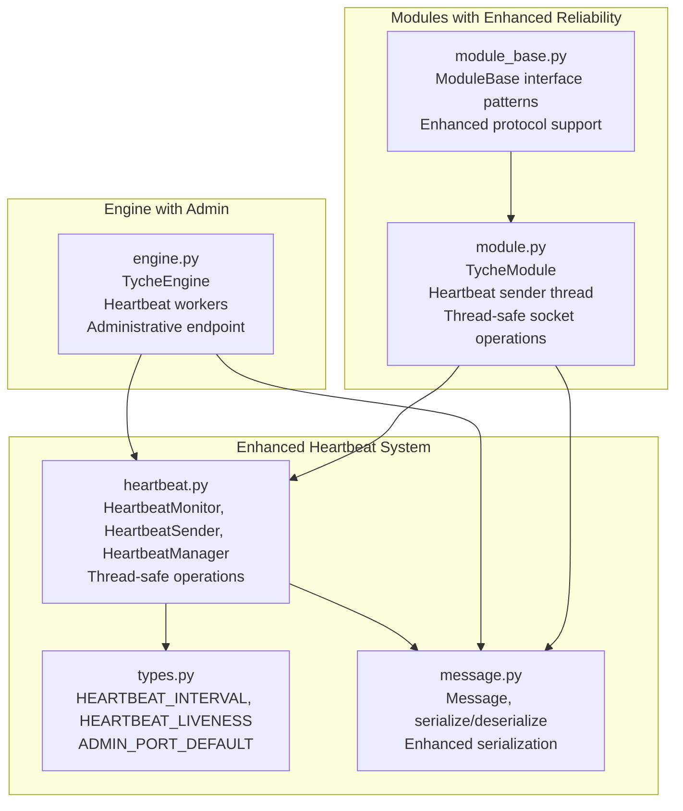

**Diagram sources**
- [heartbeat.py:1-153](file://src/tyche/heartbeat.py#L1-L153)
- [engine.py:28-660](file://src/tyche/engine.py#L28-L660)
- [module.py:28-434](file://src/tyche/module.py#L28-L434)
- [types.py:9-14](file://src/tyche/types.py#L9-L14)
- [message.py:13-168](file://src/tyche/message.py#L13-L168)
- [module_base.py:1-32](file://src/tyche/module_base.py#L1-L32)

**Section sources**
- [heartbeat.py:1-153](file://src/tyche/heartbeat.py#L1-L153)
- [engine.py:28-660](file://src/tyche/engine.py#L28-L660)
- [module.py:28-434](file://src/tyche/module.py#L28-L434)
- [types.py:9-14](file://src/tyche/types.py#L9-L14)
- [message.py:13-168](file://src/tyche/message.py#L13-L168)
- [module_base.py:1-32](file://src/tyche/module_base.py#L1-L32)

## Core Components
This section outlines the key building blocks of the enhanced heartbeat and reliability system with thread-safe operations and administrative capabilities.

- **HeartbeatMonitor**: Tracks a single peer's liveness with configurable interval and liveness thresholds, featuring thread-safe operations and enhanced monitoring capabilities.
- **HeartbeatSender**: Periodically sends heartbeat messages to the engine from module side with improved reliability and error handling.
- **HeartbeatManager**: Manages multiple peers with comprehensive thread-safe operations, including registration, unregistration, monitoring, and sophisticated state queries.
- **TycheEngine**: Implements heartbeat broadcast and receive workers, manages module registry with thread safety, triggers failure detection cycles, and provides administrative endpoint for system monitoring.
- **TycheModule**: Establishes heartbeat sockets with thread-safe operations, starts heartbeat sender threads, and handles registration with enhanced reliability.
- **Types and Messages**: Define heartbeat constants, administrative endpoint defaults, message types, and enhanced serialization/deserialization logic used across the system.

Key configuration constants:
- **HEARTBEAT_INTERVAL**: Default heartbeat frequency in seconds (1.0 seconds)
- **HEARTBEAT_LIVENESS**: Number of missed heartbeats before considering a peer dead (3)
- **ADMIN_PORT_DEFAULT**: Default administrative endpoint port (5560)

**Section sources**
- [heartbeat.py:16-153](file://src/tyche/heartbeat.py#L16-L153)
- [engine.py:28-660](file://src/tyche/engine.py#L28-L660)
- [module.py:28-434](file://src/tyche/module.py#L28-L434)
- [types.py:9-14](file://src/tyche/types.py#L9-L14)
- [message.py:13-168](file://src/tyche/message.py#L13-L168)

## Architecture Overview
The enhanced heartbeat and reliability architecture follows the Paranoid Pirate pattern with administrative capabilities:
- Engine publishes periodic heartbeats to a PUB socket with administrative endpoint integration.
- Modules subscribe to engine heartbeats and send their own heartbeats to the engine via a DEALER socket.
- Engine receives module heartbeats and updates liveness counters with thread-safe operations.
- A monitoring loop periodically decrements liveness for all peers and removes expired modules from the registry.
- Administrative endpoint provides real-time system monitoring and control capabilities.

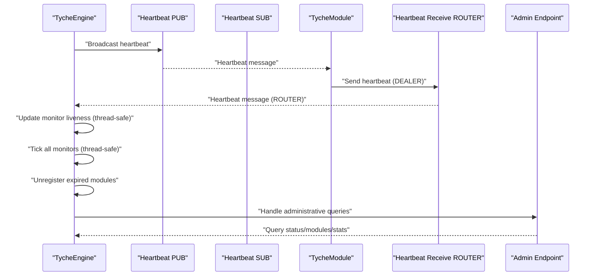

**Diagram sources**
- [engine.py:469-660](file://src/tyche/engine.py#L469-L660)
- [module.py:413-434](file://src/tyche/module.py#L413-L434)
- [heartbeat.py:91-153](file://src/tyche/heartbeat.py#L91-L153)

## Detailed Component Analysis

### Enhanced HeartbeatMonitor
The monitor encapsulates peer liveness tracking with improved thread-safety:
- **Initialization**: Sets interval and liveness with optional grace period doubling for initial registration.
- **update()**: Thread-safe operation that resets liveness and records the last heartbeat time.
- **tick()**: Thread-safe decrement operation called on expected heartbeat intervals.
- **is_expired()**: Thread-safe expiration check based on liveness threshold.
- **time_since_last()**: Thread-safe calculation of elapsed time since last heartbeat.

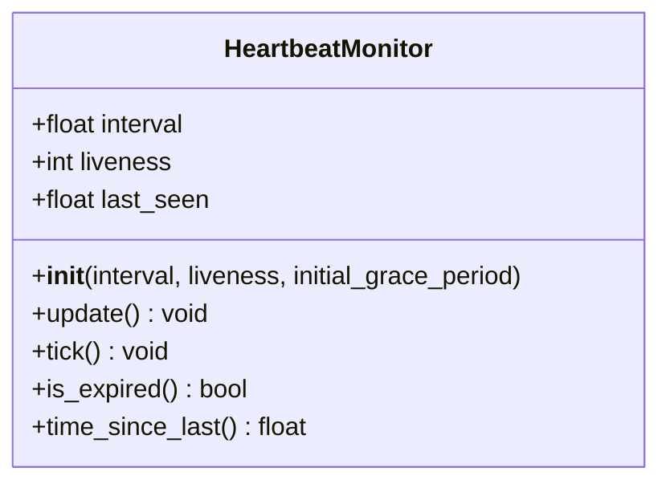

**Diagram sources**
- [heartbeat.py:16-49](file://src/tyche/heartbeat.py#L16-L49)

**Section sources**
- [heartbeat.py:16-49](file://src/tyche/heartbeat.py#L16-L49)

### Enhanced HeartbeatSender
The sender handles outbound heartbeat transmission from modules with improved reliability:
- **Initialization**: Creates socket with module ID and heartbeat interval.
- **should_send()**: Thread-safe check if next heartbeat time has passed.
- **send()**: Enhanced heartbeat construction with multipart frames and thread-safe scheduling.
- **next_heartbeat management**: Thread-safe scheduling of next transmission time.

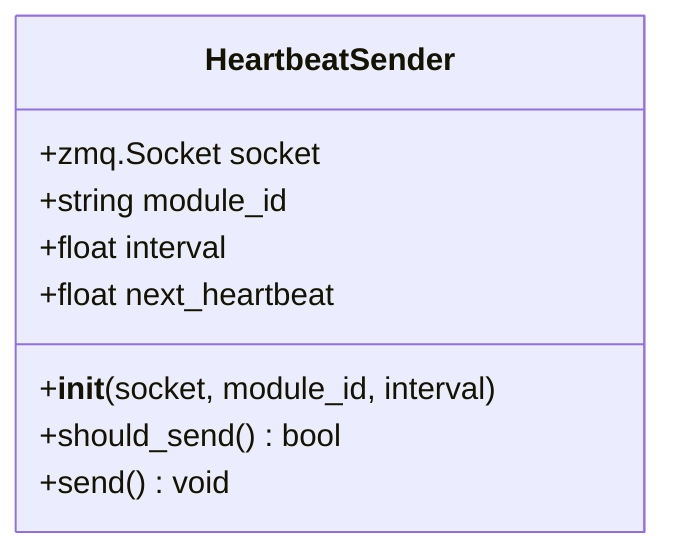

**Diagram sources**
- [heartbeat.py:52-89](file://src/tyche/heartbeat.py#L52-L89)

**Section sources**
- [heartbeat.py:52-89](file://src/tyche/heartbeat.py#L52-L89)

### Enhanced HeartbeatManager
The manager coordinates liveness tracking for multiple peers with comprehensive thread-safe operations:
- **register()**: Thread-safe peer registration with lock protection.
- **unregister()**: Thread-safe peer removal with lock protection.
- **update()**: Thread-safe liveness update with auto-registration for new peers.
- **tick_all()**: Thread-safe decrement operation for all monitors with expiration detection.
- **get_expired()**: Thread-safe expiration listing without decrementing.
- **get_liveness()**: Thread-safe liveness value retrieval with peer validation.

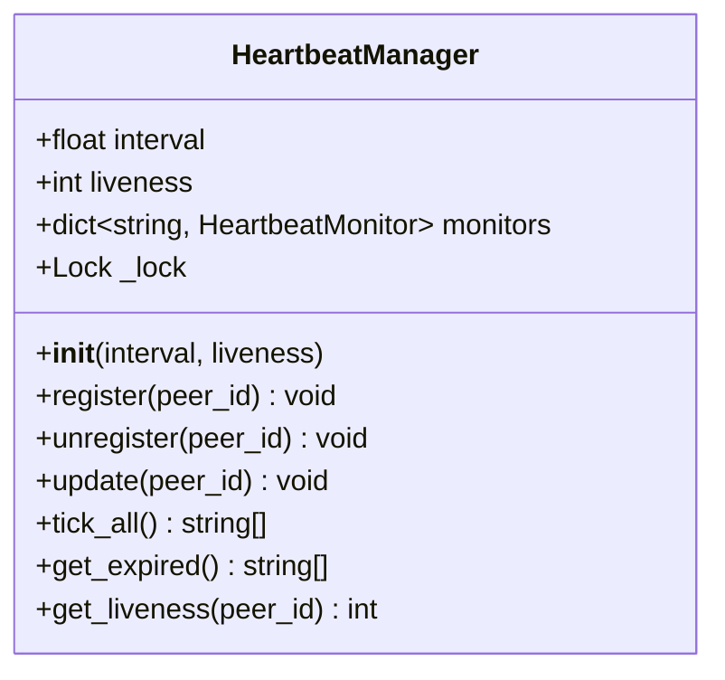

**Diagram sources**
- [heartbeat.py:91-153](file://src/tyche/heartbeat.py#L91-L153)

**Section sources**
- [heartbeat.py:91-153](file://src/tyche/heartbeat.py#L91-L153)

### Enhanced Engine Heartbeat Workers
The engine implements comprehensive heartbeat-related workers with administrative capabilities:
- **_heartbeat_worker**: Thread-safe periodic heartbeat publishing to heartbeat endpoint.
- **_heartbeat_receive_worker**: Thread-safe heartbeat reception from modules with liveness updates.
- **_monitor_worker**: Thread-safe monitoring with expiration detection and module cleanup.
- **_admin_worker**: Administrative endpoint worker for system monitoring and control.
- **_process_admin_query**: Thread-safe administrative query processing with comprehensive status reporting.

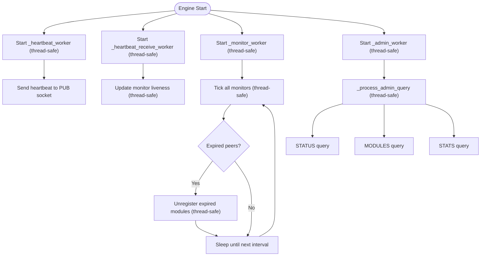

**Diagram sources**
- [engine.py:469-660](file://src/tyche/engine.py#L469-L660)

**Section sources**
- [engine.py:469-660](file://src/tyche/engine.py#L469-L660)

### Enhanced Module Heartbeat Thread
The module establishes DEALER sockets with thread-safe operations and runs dedicated threads:
- **_start_workers()**: Thread-safe worker initialization with registration and socket setup.
- **_send_heartbeats()**: Enhanced heartbeat sending with error handling and graceful shutdown.
- **Thread-safe socket operations**: Proper locking for PUB socket operations.
- **Enhanced lifecycle management**: Comprehensive thread coordination and resource cleanup.

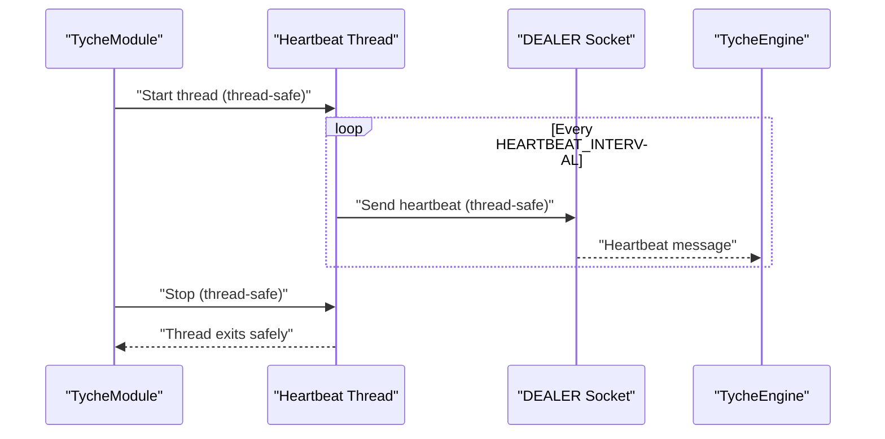

**Diagram sources**
- [module.py:187-240](file://src/tyche/module.py#L187-L240)
- [module.py:413-434](file://src/tyche/module.py#L413-L434)

**Section sources**
- [module.py:187-240](file://src/tyche/module.py#L187-L240)
- [module.py:413-434](file://src/tyche/module.py#L413-L434)

### Enhanced Module Lifecycle States and Transitions
The module lifecycle defines states and transitions with sophisticated state machine management:
- **REGISTERING**: Initial handshake in progress; transitions to ACTIVE on ACK.
- **ACTIVE**: Normal operation with healthy heartbeats; transitions to SUSPECT on missed heartbeat.
- **SUSPECT**: Grace period after heartbeat timeout; transitions to RESTARTING or ACTIVE depending on subsequent heartbeat.
- **RESTARTING**: Attempting process restart; transitions to ACTIVE or FAILED.
- **FAILED**: Terminal state after max restarts exceeded; requires manual intervention.

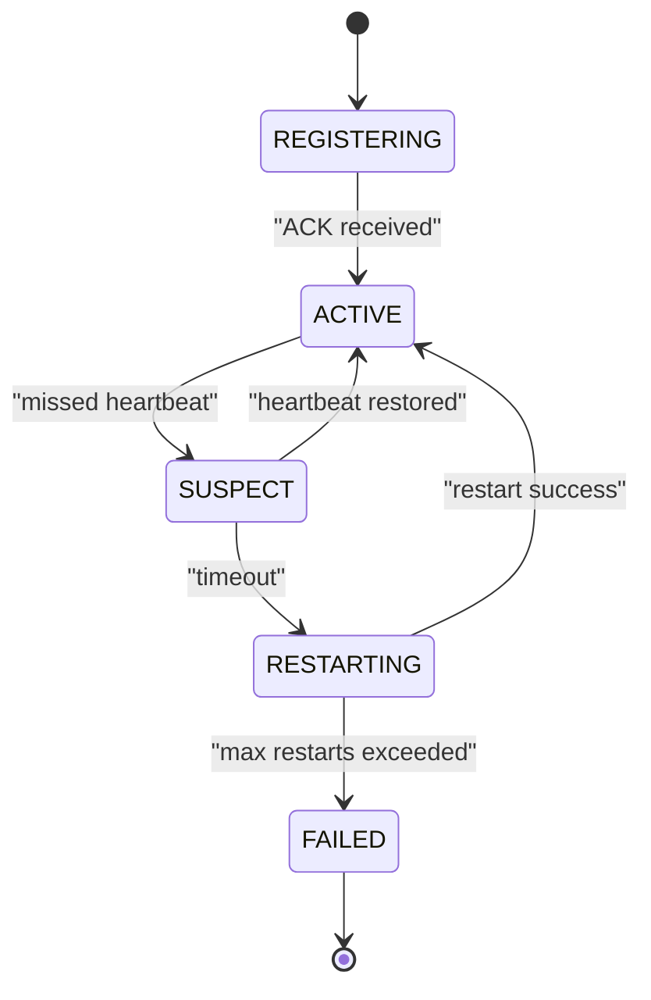

**Diagram sources**
- [README.md:235-257](file://README.md#L235-L257)

**Section sources**
- [README.md:235-257](file://README.md#L235-L257)

### Enhanced Failure Detection Algorithms
Failure detection follows the Paranoid Pirate pattern with improved reliability:
- **Initial grace period**: Doubles the liveness threshold to accommodate registration delays.
- **Thread-safe liveness management**: All liveness updates are protected by locks.
- **Heartbeat reception**: Enhanced with error handling and malformed message filtering.
- **Expiration detection**: Thread-safe expiration checking with comprehensive monitoring.
- **Time-based monitoring**: Enhanced time_since_last calculations for diagnostics.

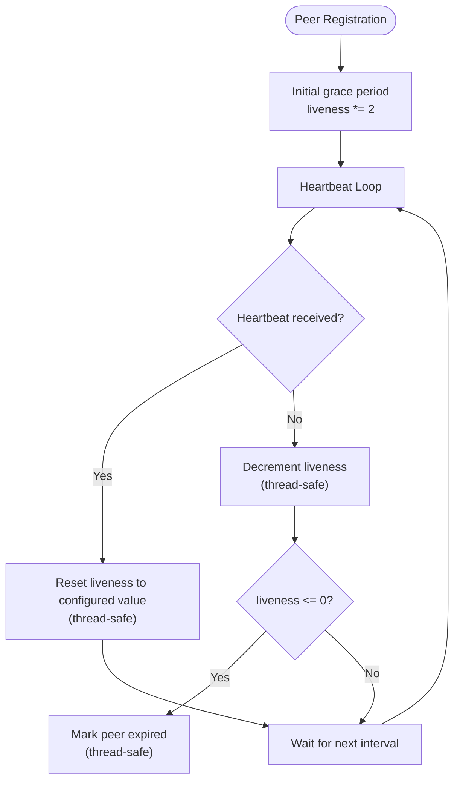

**Diagram sources**
- [heartbeat.py:16-49](file://src/tyche/heartbeat.py#L16-L49)
- [test_heartbeat.py:9-21](file://tests/unit/test_heartbeat.py#L9-L21)

**Section sources**
- [heartbeat.py:16-49](file://src/tyche/heartbeat.py#L16-L49)
- [test_heartbeat.py:9-21](file://tests/unit/test_heartbeat.py#L9-L21)

### Enhanced Reliability Mechanisms
- **Thread-safe automatic restart policies**: Enhanced lifecycle model with proper thread synchronization.
- **Work redistribution**: Thread-safe module unregistration prevents routing to failed peers.
- **Graceful degradation**: System continues operating with remaining healthy modules through enhanced isolation.
- **Administrative monitoring**: Real-time system monitoring through administrative endpoint.
- **Enhanced error handling**: Comprehensive error handling with proper resource cleanup.

**Section sources**
- [engine.py:267-331](file://src/tyche/engine.py#L267-L331)
- [README.md:300-309](file://README.md#L300-L309)

### Enhanced Configuration Options
Heartbeat parameters are defined as constants with administrative capabilities:
- **HEARTBEAT_INTERVAL**: Default heartbeat frequency in seconds (1.0)
- **HEARTBEAT_LIVENESS**: Number of missed heartbeats before considering a peer dead (3)
- **ADMIN_PORT_DEFAULT**: Default administrative endpoint port (5560)

These constants are used across the enhanced heartbeat implementation and administrative system to configure behavior.

**Section sources**
- [types.py:9-14](file://src/tyche/types.py#L9-L14)
- [test_heartbeat.py:6](file://tests/unit/test_heartbeat.py#L6)

## Enhanced Thread-Safe Operations
The system implements comprehensive thread-safety measures throughout:

### Lock Protection Mechanisms
- **HeartbeatManager**: Uses threading.Lock for all monitor operations
- **TycheEngine**: Implements multiple locks for thread-safe module registry management
- **Socket Operations**: Thread-safe socket operations with proper locking
- **Administrative Queries**: Thread-safe administrative endpoint processing

### Thread-Safe Data Structures
- **Module Registry**: Protected by threading.Lock for concurrent access
- **Topic Queues**: Thread-safe queue operations with proper locking
- **Heartbeat Manager**: All monitor operations are thread-safe
- **Administrative State**: Thread-safe state management for monitoring

**Section sources**
- [heartbeat.py:105](file://src/tyche/heartbeat.py#L105)
- [engine.py:58](file://src/tyche/engine.py#L58)
- [engine.py:72](file://src/tyche/engine.py#L72)
- [module.py:55](file://src/tyche/module.py#L55)

## Administrative Endpoint Integration
The system provides comprehensive administrative capabilities:

### Administrative Endpoint Features
- **Status Queries**: Real-time system status including uptime, module counts, and queue sizes
- **Module Inspection**: Detailed module information with liveness monitoring
- **Statistics Access**: Event counts, registration statistics, and system metrics
- **Thread-Safe Processing**: All administrative queries are processed in thread-safe manner

### Administrative Query Types
- **STATUS**: Comprehensive system status with detailed metrics
- **MODULES**: List of all registered modules with liveness information
- **STATS**: Basic system statistics and counters

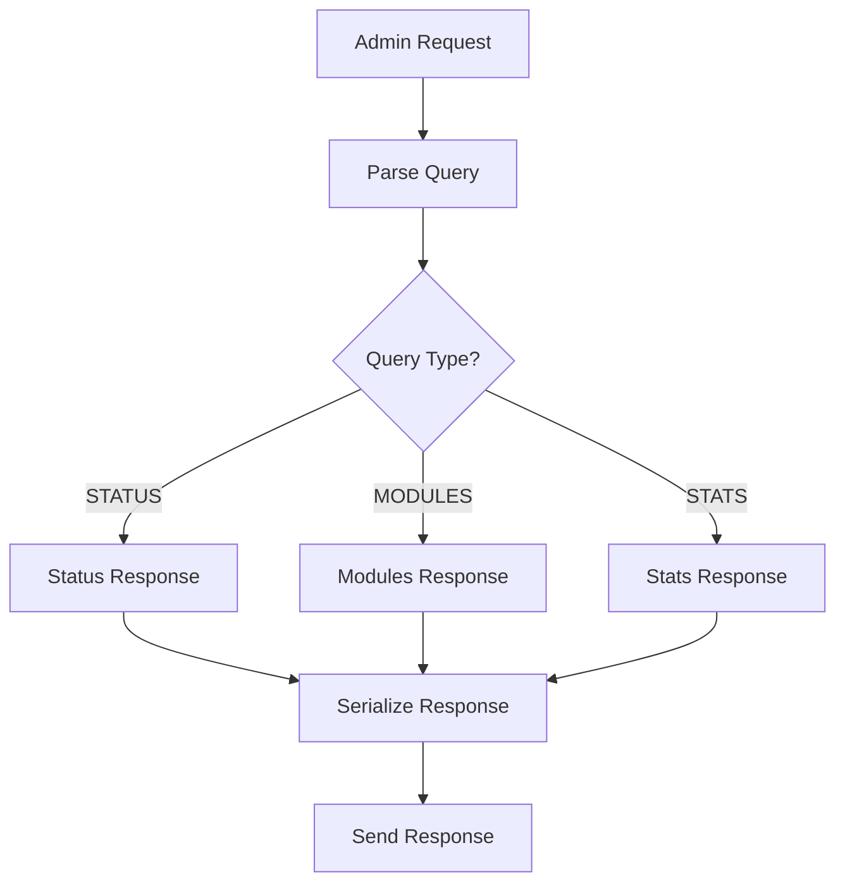

**Diagram sources**
- [engine.py:570-660](file://src/tyche/engine.py#L570-L660)

**Section sources**
- [engine.py:570-660](file://src/tyche/engine.py#L570-L660)

## Sophisticated State Machine
The enhanced system implements a sophisticated state machine for connection management:

### State Machine Components
- **Thread-Safe State Transitions**: All state changes are properly synchronized
- **Health Monitoring**: Real-time health status tracking with liveness metrics
- **Graceful Degradation**: Automatic handling of partial system failures
- **Recovery Mechanisms**: Automated recovery from transient failures

### State Machine Benefits
- **Improved Reliability**: Enhanced fault tolerance through proper state management
- **Better Monitoring**: Comprehensive visibility into system health and state
- **Automated Recovery**: Intelligent handling of system failures and recoveries
- **Scalable Architecture**: Thread-safe operations support large-scale deployments

**Section sources**
- [README.md:235-257](file://README.md#L235-L257)
- [engine.py:541-569](file://src/tyche/engine.py#L541-L569)

## Dependency Analysis
The enhanced heartbeat system exhibits clear separation of concerns with thread-safe operations:
- **heartbeat.py**: Depends on types.py for constants and message.py for serialization with thread-safe operations.
- **engine.py**: Depends on heartbeat.py for monitoring with administrative capabilities and message.py for serialization.
- **module.py**: Depends on heartbeat.py for sending heartbeats with thread-safe operations and message.py for serialization.
- **module_base.py**: Defines enhanced interface patterns used by modules with protocol support.

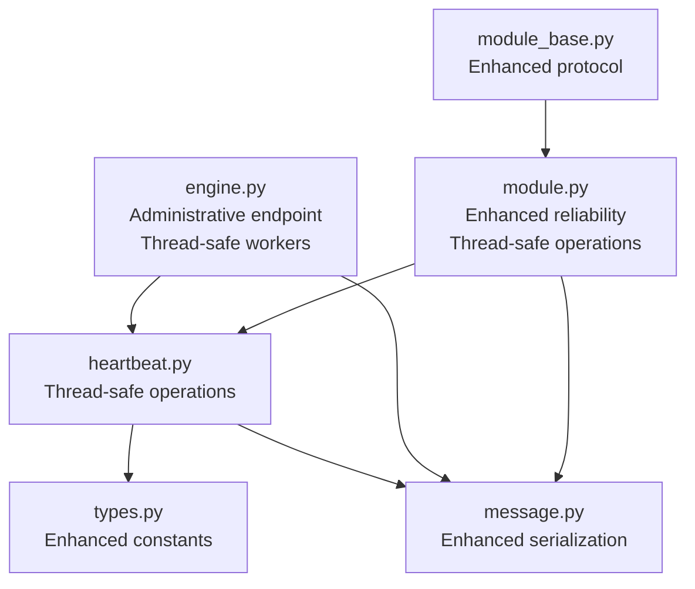

**Diagram sources**
- [heartbeat.py:12-13](file://src/tyche/heartbeat.py#L12-L13)
- [engine.py:12-23](file://src/tyche/engine.py#L12-L23)
- [module.py:13-23](file://src/tyche/module.py#L13-L23)
- [module_base.py:3](file://src/tyche/module_base.py#L3)

**Section sources**
- [heartbeat.py:12-13](file://src/tyche/heartbeat.py#L12-L13)
- [engine.py:12-23](file://src/tyche/engine.py#L12-L23)
- [module.py:13-23](file://src/tyche/module.py#L13-L23)
- [module_base.py:3](file://src/tyche/module_base.py#L3)

## Performance Considerations
- **Enhanced Heartbeat frequency**: The default interval (1.0 seconds) balances responsiveness with overhead while maintaining thread-safety.
- **Improved Liveness threshold**: Higher thresholds (3) improve resilience against transient delays with thread-safe operations.
- **Thread-safe Monitoring overhead**: Enhanced engine monitoring with proper locking mechanisms for large deployments.
- **Serialization costs**: Efficient MessagePack serialization with thread-safe operations under heavy loads.
- **Administrative endpoint performance**: Optimized administrative queries with thread-safe processing.

## Troubleshooting Guide
Common heartbeat-related issues and resolutions with enhanced diagnostic capabilities:

### Thread-Safe Operation Issues
- **Module does not expire despite missing heartbeats**:
  - Verify thread-safe heartbeat receive endpoint configuration and reachability.
  - Confirm thread-safe heartbeat sender operations are running correctly.
  - Check engine logs for thread-safe heartbeat receive errors.

- **Thread-safe race conditions**:
  - Monitor thread-safe operations with administrative endpoint queries.
  - Verify proper lock usage in all thread-safe operations.
  - Check for deadlocks in thread-safe data structures.

### Administrative Endpoint Issues
- **Administrative endpoint not responding**:
  - Verify administrative endpoint binding and listening.
  - Check thread-safe administrative worker operations.
  - Monitor administrative query processing with STATUS queries.

- **Enhanced monitoring capabilities**:
  - Use administrative endpoint to query system status and module health.
  - Monitor thread-safe operations through administrative queries.
  - Track system metrics and performance through administrative interface.

### Enhanced Heartbeat Protocol Issues
- **Module expires too quickly**:
  - Increase HEARTBEAT_LIVENESS to tolerate more missed heartbeats.
  - Investigate network latency or processing delays affecting thread-safe operations.
  - Monitor thread-safe liveness updates and expiration detection.

- **Heartbeat message format errors**:
  - Confirm thread-safe heartbeat message serialization using Message structure.
  - Validate thread-safe message type HEARTBEAT with required fields.
  - Check thread-safe administrative endpoint for enhanced monitoring.

### Monitoring Best Practices
- **Track time_since_last for each peer** to detect latency spikes with thread-safe operations.
- **Monitor thread-safe expired peers** over time to identify recurring issues.
- **Use administrative endpoint** to correlate heartbeat timeouts with system events.
- **Implement comprehensive thread-safe monitoring** for production deployments.

### Integration with External Health Checking
- **Expose peer liveness metrics** to external monitoring systems with thread-safe operations.
- **Use heartbeat timestamps** to build custom health dashboards with administrative endpoint.
- **Combine heartbeat data** with application-level health indicators for comprehensive monitoring.
- **Integrate administrative endpoint** for external system monitoring and control.

**Section sources**
- [engine.py:570-660](file://src/tyche/engine.py#L570-L660)
- [module.py:413-434](file://src/tyche/module.py#L413-L434)
- [test_heartbeat_protocol.py:16-119](file://tests/unit/test_heartbeat_protocol.py#L16-L119)

## Conclusion
Tyche Engine's enhanced heartbeat and reliability system implements the Paranoid Pirate pattern with thread-safe operations, administrative endpoint integration, and sophisticated state machine management to ensure robust peer health monitoring and failure detection. The system provides configurable heartbeat intervals and liveness thresholds, automated failure detection, thread-safe lifecycle state transitions, and comprehensive administrative monitoring capabilities. The enhanced system enables graceful degradation, work redistribution, and sophisticated connection management through improved thread-safety measures and administrative capabilities. By understanding the enhanced heartbeat primitives, thread-safe engine workers, administrative endpoint integration, and module behavior, developers can effectively configure, monitor, and troubleshoot the reliability of their distributed modules with comprehensive thread-safe operations and administrative oversight.