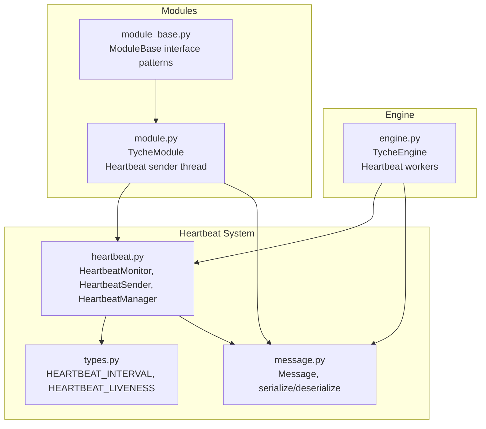
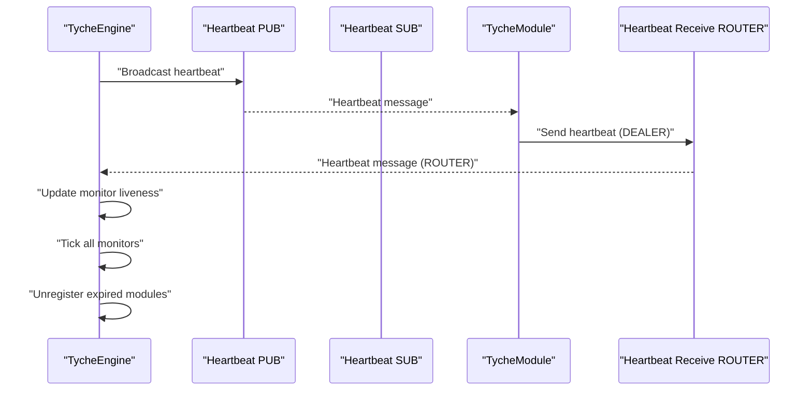
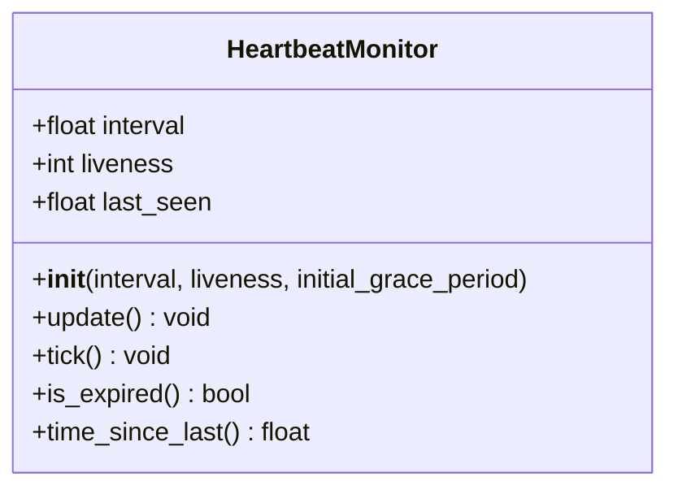
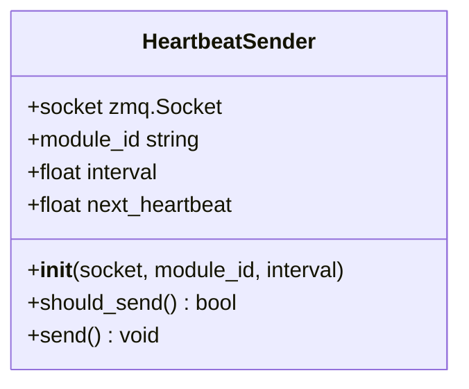
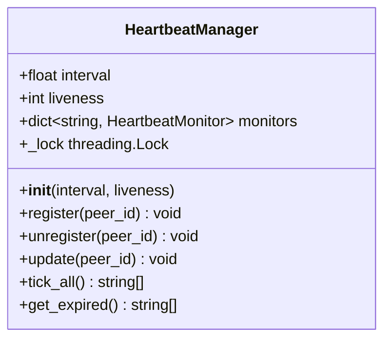
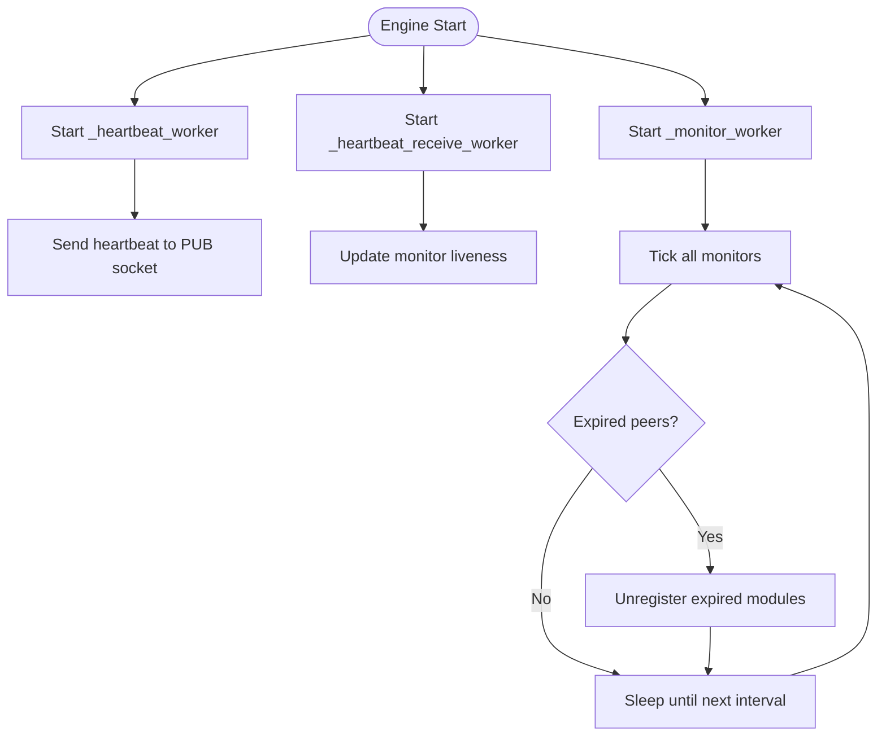
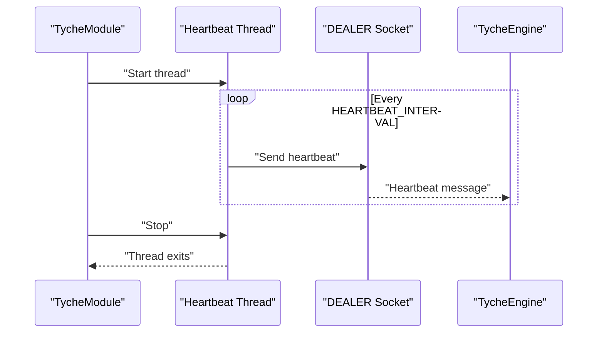
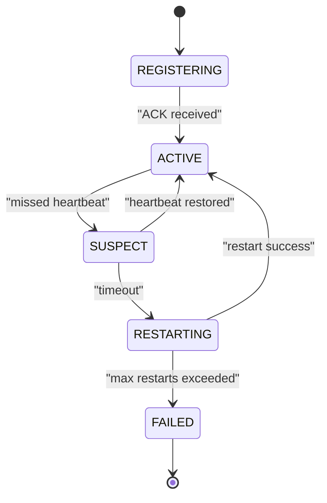
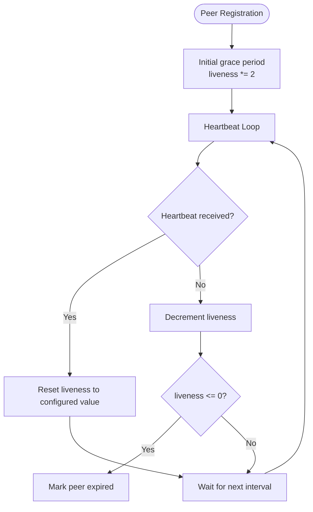
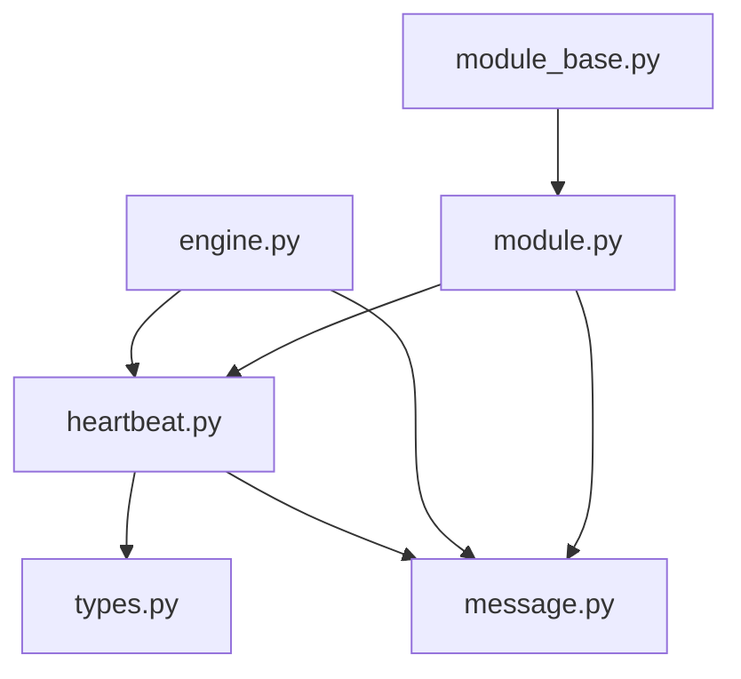

# Heartbeat and Reliability

**Referenced Files in This Document**
- [heartbeat.py](file://src/tyche/heartbeat.py)
- [engine.py](file://src/tyche/engine.py)
- [module.py](file://src/tyche/module.py)
- [types.py](file://src/tyche/types.py)
- [message.py](file://src/tyche/message.py)
- [module_base.py](file://src/tyche/module_base.py)
- [test_heartbeat.py](file://tests/unit/test_heartbeat.py)
- [test_heartbeat_protocol.py](file://tests/unit/test_heartbeat_protocol.py)
- [README.md](file://README.md)

## Table of Contents
1. [Introduction](#introduction)
2. [Project Structure](#project-structure)
3. [Core Components](#core-components)
4. [Architecture Overview](#architecture-overview)
5. [Detailed Component Analysis](#detailed-component-analysis)
6. [Dependency Analysis](#dependency-analysis)
7. [Performance Considerations](#performance-considerations)
8. [Troubleshooting Guide](#troubleshooting-guide)
9. [Conclusion](#conclusion)

## Introduction
This document provides comprehensive coverage of Tyche Engine's heartbeat and reliability system, focusing on the Paranoid Pirate pattern implementation for peer health monitoring. It explains heartbeat intervals, timeout calculations, failure detection algorithms, module lifecycle states, automatic restart policies, work redistribution strategies, and configuration options. The content is derived from the actual codebase and includes practical guidance for troubleshooting, monitoring, and integrating with external health checking systems.

## Project Structure
The heartbeat and reliability system spans several core modules:
- Heartbeat primitives and managers
- Engine-side monitoring and failure detection
- Module-side heartbeat transmission
- Type definitions and message serialization
- Lifecycle state management and interface patterns

**Diagram sources**
- [heartbeat.py:1-142](file://src/tyche/heartbeat.py#L1-L142)
- [engine.py:25-350](file://src/tyche/engine.py#L25-L350)
- [module.py:28-401](file://src/tyche/module.py#L28-L401)
- [types.py:9-11](file://src/tyche/types.py#L9-L11)
- [message.py:13-168](file://src/tyche/message.py#L13-L168)
- [module_base.py:10-120](file://src/tyche/module_base.py#L10-L120)

**Section sources**
- [heartbeat.py:1-142](file://src/tyche/heartbeat.py#L1-L142)
- [engine.py:25-350](file://src/tyche/engine.py#L25-L350)
- [module.py:28-401](file://src/tyche/module.py#L28-L401)
- [types.py:9-11](file://src/tyche/types.py#L9-L11)
- [message.py:13-168](file://src/tyche/message.py#L13-L168)
- [module_base.py:10-120](file://src/tyche/module_base.py#L10-L120)

## Core Components
This section outlines the key building blocks of the heartbeat and reliability system.

- HeartbeatMonitor: Tracks a single peer's liveness with configurable interval and liveness thresholds. It supports resetting liveness upon receiving heartbeats and detecting expiration.
- HeartbeatSender: Periodically sends heartbeat messages to the engine from module side.
- HeartbeatManager: Manages multiple peers, registers/unregisters monitors, updates liveness, decrements counters, and identifies expired peers.
- TycheEngine: Implements heartbeat broadcast and receive workers, manages module registry, and triggers failure detection cycles.
- TycheModule: Establishes heartbeat sockets, starts a heartbeat sender thread, and handles registration and event routing.
- Types and Messages: Define heartbeat constants, message types, and serialization/deserialization logic used across the system.

Key configuration constants:
- HEARTBEAT_INTERVAL: Default heartbeat frequency in seconds.
- HEARTBEAT_LIVENESS: Number of missed heartbeats before considering a peer dead.

**Section sources**
- [heartbeat.py:16-142](file://src/tyche/heartbeat.py#L16-L142)
- [engine.py:25-350](file://src/tyche/engine.py#L25-L350)
- [module.py:28-401](file://src/tyche/module.py#L28-L401)
- [types.py:9-11](file://src/tyche/types.py#L9-L11)
- [message.py:13-168](file://src/tyche/message.py#L13-L168)

## Architecture Overview
The heartbeat and reliability architecture follows the Paranoid Pirate pattern:
- Engine publishes periodic heartbeats to a PUB socket.
- Modules subscribe to engine heartbeats and send their own heartbeats to the engine via a DEALER socket.
- Engine receives module heartbeats and updates liveness counters.
- A monitoring loop periodically decrements liveness for all peers and removes expired modules from the registry.

**Diagram sources**
- [engine.py:281-349](file://src/tyche/engine.py#L281-L349)
- [module.py:376-401](file://src/tyche/module.py#L376-L401)
- [heartbeat.py:91-142](file://src/tyche/heartbeat.py#L91-L142)

## Detailed Component Analysis

### HeartbeatMonitor
The monitor encapsulates peer liveness tracking:
- Initialization sets interval and liveness, with an optional grace period doubling of liveness for initial registration.
- update resets liveness and records the last heartbeat time.
- tick decrements liveness on each expected heartbeat interval.
- is_expired determines if the peer has exceeded the liveness threshold.
- time_since_last reports elapsed time since the last heartbeat.

**Diagram sources**
- [heartbeat.py:16-50](file://src/tyche/heartbeat.py#L16-L50)

**Section sources**
- [heartbeat.py:16-50](file://src/tyche/heartbeat.py#L16-L50)

### HeartbeatSender
The sender handles outbound heartbeat transmission from modules:
- Initializes with a ZeroMQ socket, module ID, and heartbeat interval.
- should_send checks if the next heartbeat time has passed.
- send constructs a heartbeat message and transmits it via multipart frames.
- Maintains next_heartbeat to schedule the next transmission.

**Diagram sources**
- [heartbeat.py:52-89](file://src/tyche/heartbeat.py#L52-L89)

**Section sources**
- [heartbeat.py:52-89](file://src/tyche/heartbeat.py#L52-L89)

### HeartbeatManager
The manager coordinates liveness tracking for multiple peers:
- register creates a new monitor for a peer.
- unregister removes a peer from monitoring.
- update resets liveness for an existing peer or auto-registers a new one.
- tick_all decrements all monitors and returns expired peer IDs.
- get_expired lists expired peers without decrementing.

**Diagram sources**
- [heartbeat.py:91-142](file://src/tyche/heartbeat.py#L91-L142)

**Section sources**
- [heartbeat.py:91-142](file://src/tyche/heartbeat.py#L91-L142)

### Engine Heartbeat Workers
The engine implements three heartbeat-related workers:
- _heartbeat_worker: Periodically publishes heartbeat messages to the heartbeat endpoint.
- _heartbeat_receive_worker: Receives heartbeats from modules and updates liveness via HeartbeatManager.
- _monitor_worker: Iterates through expired peers and unregisters them from the module registry.

**Diagram sources**
- [engine.py:281-349](file://src/tyche/engine.py#L281-L349)

**Section sources**
- [engine.py:281-349](file://src/tyche/engine.py#L281-L349)

### Module Heartbeat Thread
The module establishes a DEALER socket to send heartbeats and runs a dedicated thread:
- start_nonblocking/_start_workers connects to the heartbeat receive endpoint and starts the heartbeat sender thread.
- _send_heartbeats periodically sends heartbeat messages and handles errors.
- stop gracefully shuts down threads and sockets.

**Diagram sources**
- [module.py:169-174](file://src/tyche/module.py#L169-L174)
- [module.py:376-401](file://src/tyche/module.py#L376-L401)

**Section sources**
- [module.py:169-174](file://src/tyche/module.py#L169-L174)
- [module.py:376-401](file://src/tyche/module.py#L376-L401)

### Module Lifecycle States and Transitions
The module lifecycle defines states and transitions for reliability:
- REGISTERING: Initial handshake in progress; transitions to ACTIVE on ACK.
- ACTIVE: Normal operation with healthy heartbeats; transitions to SUSPECT on missed heartbeat.
- SUSPECT: Grace period after heartbeat timeout; transitions to RESTARTING or ACTIVE depending on subsequent heartbeat.
- RESTARTING: Attempting process restart; transitions to ACTIVE or FAILED.
- FAILED: Terminal state after max restarts exceeded; requires manual intervention.

**Diagram sources**
- [README.md:225-247](file://README.md#L225-L247)

**Section sources**
- [README.md:225-247](file://README.md#L225-L247)

### Failure Detection Algorithms
Failure detection follows the Paranoid Pirate pattern:
- Initial grace period doubles the liveness threshold to accommodate registration delays.
- Each heartbeat received resets liveness to the configured value.
- On each heartbeat interval, liveness is decremented; when liveness reaches zero, the peer is considered expired.
- The monitor tracks time since last heartbeat for diagnostics.

**Diagram sources**
- [heartbeat.py:16-50](file://src/tyche/heartbeat.py#L16-L50)
- [test_heartbeat.py:9-21](file://tests/unit/test_heartbeat.py#L9-L21)

**Section sources**
- [heartbeat.py:16-50](file://src/tyche/heartbeat.py#L16-L50)
- [test_heartbeat.py:9-21](file://tests/unit/test_heartbeat.py#L9-L21)

### Reliability Mechanisms
- Automatic restart policies: The lifecycle model includes a RESTARTING state for attempting process restarts; the engine unregisters expired modules to prevent routing to failed peers.
- Work redistribution: When modules are unregistered due to expiration, the engine removes them from the registry, allowing other healthy modules to continue processing work.
- Graceful degradation: The system continues operating with remaining healthy modules; slow or failing modules are isolated through failure detection and removal.

**Section sources**
- [engine.py:215-234](file://src/tyche/engine.py#L215-L234)
- [README.md:290-299](file://README.md#L290-L299)

### Configuration Options
Heartbeat parameters are defined as constants:
- HEARTBEAT_INTERVAL: Default heartbeat frequency in seconds.
- HEARTBEAT_LIVENESS: Number of missed heartbeats before considering a peer dead.

These constants are used across the heartbeat implementation and tests to configure behavior.

**Section sources**
- [types.py:9-11](file://src/tyche/types.py#L9-L11)
- [test_heartbeat.py:6](file://tests/unit/test_heartbeat.py#L6)

## Dependency Analysis
The heartbeat system exhibits clear separation of concerns:
- heartbeat.py depends on types.py for constants and message.py for serialization.
- engine.py depends on heartbeat.py for monitoring and message.py for serialization.
- module.py depends on heartbeat.py for sending heartbeats and message.py for serialization.
- module_base.py defines interface patterns used by modules.

**Diagram sources**
- [heartbeat.py:12-13](file://src/tyche/heartbeat.py#L12-L13)
- [engine.py:10-20](file://src/tyche/engine.py#L10-L20)
- [module.py:13-23](file://src/tyche/module.py#L13-L23)
- [module_base.py:7](file://src/tyche/module_base.py#L7)

**Section sources**
- [heartbeat.py:12-13](file://src/tyche/heartbeat.py#L12-L13)
- [engine.py:10-20](file://src/tyche/engine.py#L10-L20)
- [module.py:13-23](file://src/tyche/module.py#L13-L23)
- [module_base.py:7](file://src/tyche/module_base.py#L7)

## Performance Considerations
- Heartbeat frequency: The default interval balances responsiveness with overhead. Shorter intervals increase network traffic and CPU usage; longer intervals delay failure detection.
- Liveness threshold: Higher thresholds improve resilience against transient delays but increase tolerance for failures.
- Monitoring overhead: The engine's monitor worker iterates through all registered modules; large deployments should consider scaling strategies.
- Serialization costs: MessagePack serialization is efficient, but frequent heartbeat messages can still impact bandwidth under heavy loads.

[No sources needed since this section provides general guidance]

## Troubleshooting Guide
Common heartbeat-related issues and resolutions:

- Module does not expire despite missing heartbeats:
  - Verify that the module's heartbeat receive endpoint is correctly configured and reachable.
  - Confirm that the module's heartbeat sender thread is running and sending messages.
  - Check engine logs for heartbeat receive errors.

- Module expires too quickly:
  - Increase HEARTBEAT_LIVENESS to tolerate more missed heartbeats.
  - Investigate network latency or processing delays that may cause heartbeat timing issues.

- Engine cannot receive heartbeats:
  - Ensure the heartbeat receive endpoint is bound and listening.
  - Verify that the ROUTER socket is properly configured for receiving from modules.

- Heartbeat message format errors:
  - Confirm that heartbeat messages are serialized using the Message structure and MessagePack encoding.
  - Validate that the message type is HEARTBEAT and includes required fields.

Monitoring best practices:
- Track time_since_last for each peer to detect latency spikes.
- Monitor the number of expired peers over time to identify recurring issues.
- Use engine logs to correlate heartbeat timeouts with system events.

Integration with external health checking:
- Expose peer liveness metrics to external monitoring systems.
- Use heartbeat timestamps to build custom health dashboards.
- Combine heartbeat data with application-level health indicators for comprehensive monitoring.

**Section sources**
- [engine.py:307-339](file://src/tyche/engine.py#L307-L339)
- [module.py:376-401](file://src/tyche/module.py#L376-L401)
- [test_heartbeat_protocol.py:16-86](file://tests/unit/test_heartbeat_protocol.py#L16-L86)

## Conclusion
Tyche Engine's heartbeat and reliability system implements the Paranoid Pirate pattern to ensure robust peer health monitoring and failure detection. The system provides configurable heartbeat intervals and liveness thresholds, automated failure detection, and lifecycle state transitions that enable graceful degradation and work redistribution. By understanding the heartbeat primitives, engine workers, and module behavior, developers can effectively configure, monitor, and troubleshoot the reliability of their distributed modules.