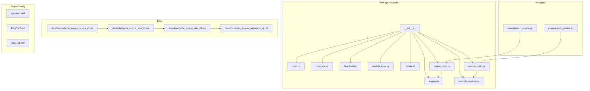
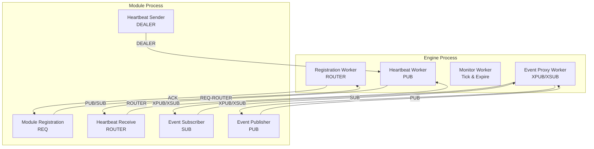
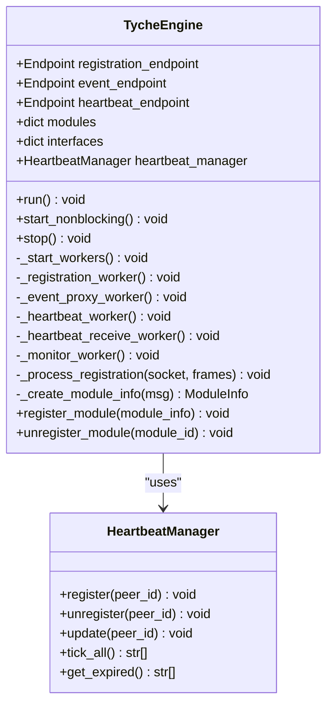
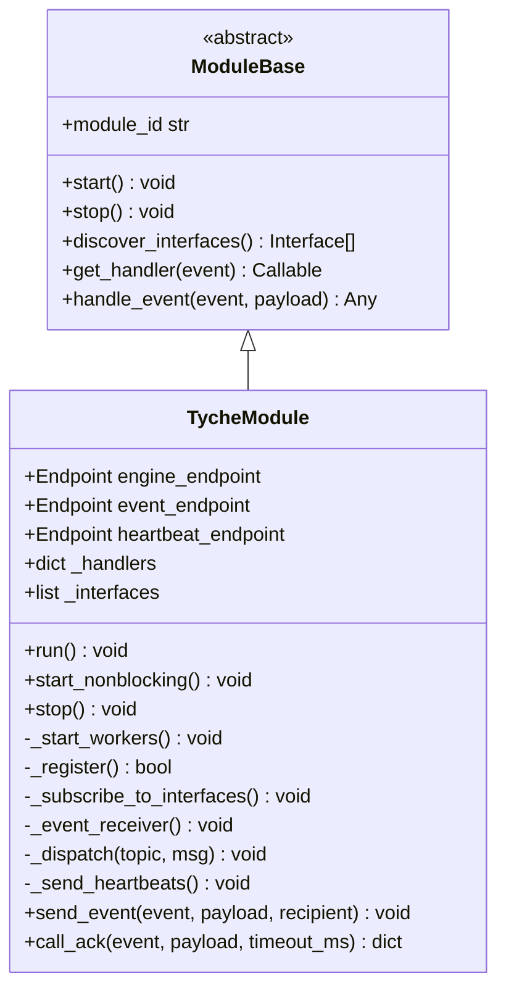
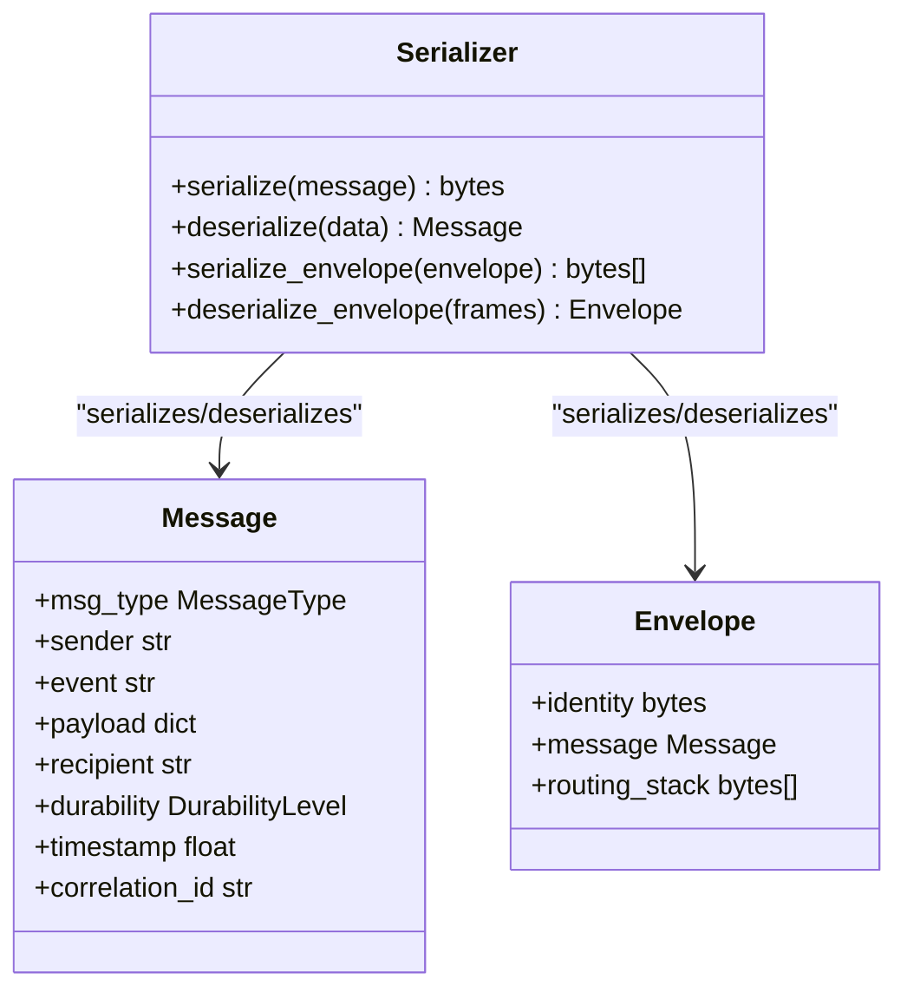
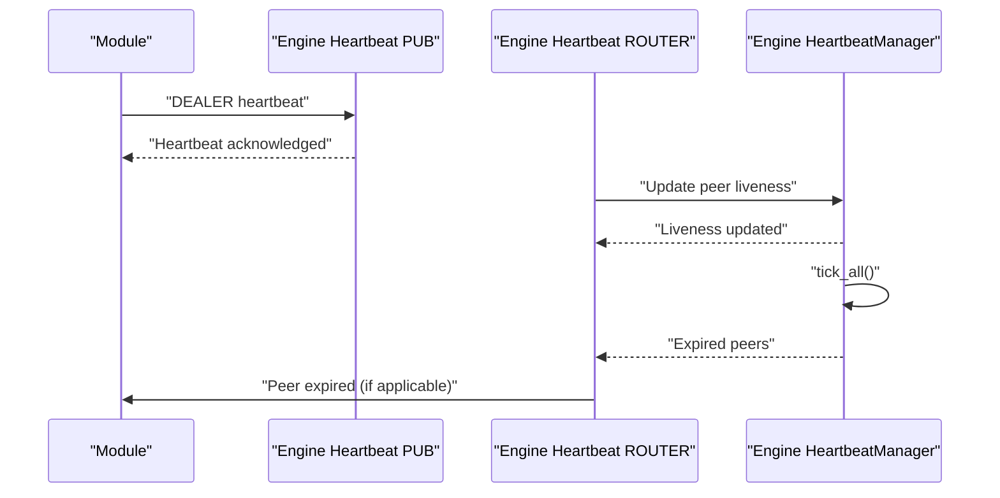
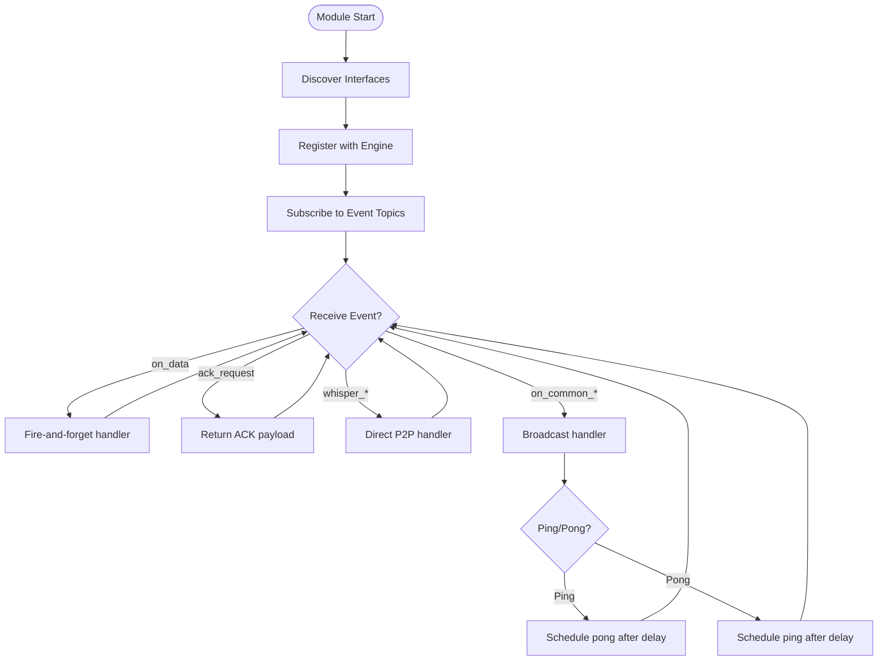
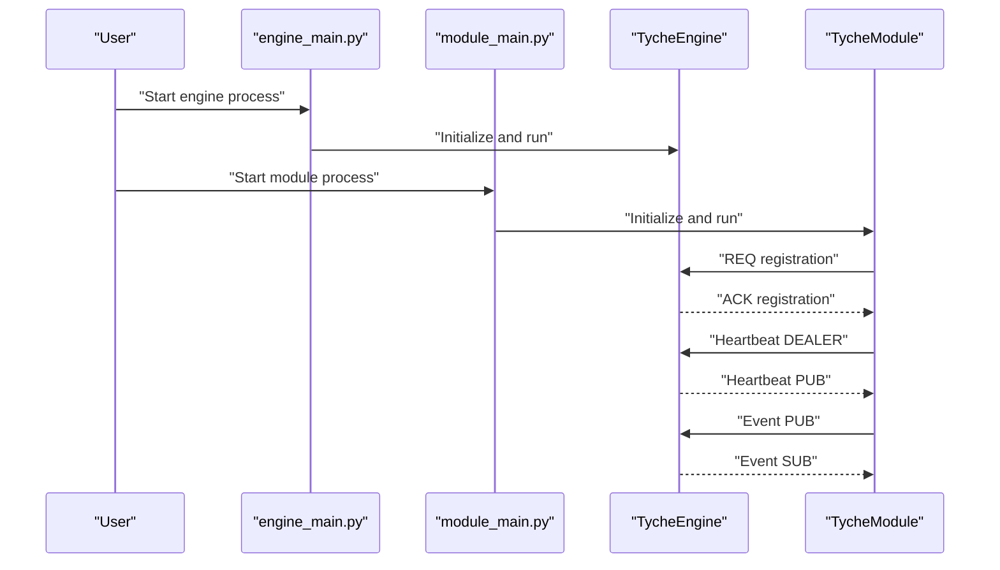
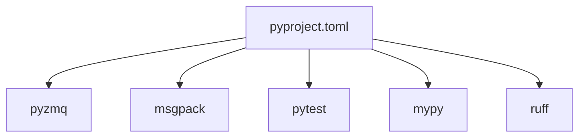
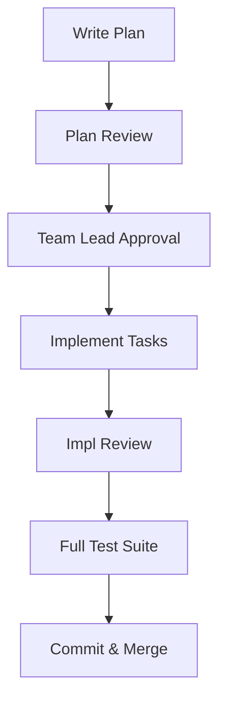

# Implementation Logs

<cite>
**Referenced Files in This Document**
- [README.md](file://README.md)
- [CLAUDE.md](file://CLAUDE.md)
- [pyproject.toml](file://pyproject.toml)
- [src/tyche/__init__.py](file://src/tyche/__init__.py)
- [src/tyche/engine.py](file://src/tyche/engine.py)
- [src/tyche/module.py](file://src/tyche/module.py)
- [src/tyche/module_base.py](file://src/tyche/module_base.py)
- [src/tyche/message.py](file://src/tyche/message.py)
- [src/tyche/types.py](file://src/tyche/types.py)
- [src/tyche/heartbeat.py](file://src/tyche/heartbeat.py)
- [src/tyche/example_module.py](file://src/tyche/example_module.py)
- [src/tyche/engine_main.py](file://src/tyche/engine_main.py)
- [src/tyche/module_main.py](file://src/tyche/module_main.py)
- [examples/run_engine.py](file://examples/run_engine.py)
- [examples/run_module.py](file://examples/run_module.py)
- [docs/design/tyche_engine_design_v1.md](file://docs/design/tyche_engine_design_v1.md)
- [docs/impl/tyche_engine_implement_v2.md](file://docs/impl/tyche_engine_implement_v2.md)
- [docs/plan/tyche_engine_plan_v1.md](file://docs/plan/tyche_engine_plan_v1.md)
- [docs/plan/tyche_engine_plan_v2.md](file://docs/plan/tyche_engine_plan_v2.md)
</cite>

## Table of Contents
1. [Introduction](#introduction)
2. [Project Structure](#project-structure)
3. [Core Components](#core-components)
4. [Architecture Overview](#architecture-overview)
5. [Detailed Component Analysis](#detailed-component-analysis)
6. [Dependency Analysis](#dependency-analysis)
7. [Performance Considerations](#performance-considerations)
8. [Troubleshooting Guide](#troubleshooting-guide)
9. [Conclusion](#conclusion)
10. [Appendices](#appendices)

## Introduction
This document presents the implementation logs and planning documentation for Tyche Engine, a high-performance distributed event-driven framework built on ZeroMQ. It chronicles the evolution of design decisions, implementation progress, and architectural changes over time. It synthesizes the design specification, implementation plan, and implementation log to provide a comprehensive view of how the system moved from a single-process prototype to a fully distributed, multi-process architecture. It also documents the development methodology, milestone tracking, quality assurance processes, design reviews, code rationales, alternative approaches, performance benchmarks, optimization efforts, scalability improvements, technical debt management, refactoring, and future roadmap planning.

## Project Structure
Tyche Engine is organized as a Python package with clear separation between core runtime components, examples, and documentation. The structure supports:
- Core runtime: engine, module base, message serialization, types, heartbeat management
- Entry points for standalone processes
- Examples demonstrating process separation
- Comprehensive documentation (design, plan, implementation logs)

**Diagram sources**
- [src/tyche/__init__.py:1-61](file://src/tyche/__init__.py#L1-L61)
- [src/tyche/engine.py:1-350](file://src/tyche/engine.py#L1-L350)
- [src/tyche/module.py:1-401](file://src/tyche/module.py#L1-L401)
- [src/tyche/module_base.py:1-120](file://src/tyche/module_base.py#L1-L120)
- [src/tyche/message.py:1-168](file://src/tyche/message.py#L1-L168)
- [src/tyche/types.py:1-102](file://src/tyche/types.py#L1-L102)
- [src/tyche/heartbeat.py:1-142](file://src/tyche/heartbeat.py#L1-L142)
- [src/tyche/example_module.py:1-167](file://src/tyche/example_module.py#L1-L167)
- [src/tyche/engine_main.py](file://src/tyche/engine_main.py)
- [src/tyche/module_main.py](file://src/tyche/module_main.py)
- [examples/run_engine.py:1-54](file://examples/run_engine.py#L1-L54)
- [examples/run_module.py:1-51](file://examples/run_module.py#L1-L51)
- [docs/design/tyche_engine_design_v1.md:1-126](file://docs/design/tyche_engine_design_v1.md#L1-L126)
- [docs/plan/tyche_engine_plan_v1.md:1-800](file://docs/plan/tyche_engine_plan_v1.md#L1-L800)
- [docs/plan/tyche_engine_plan_v2.md:1-396](file://docs/plan/tyche_engine_plan_v2.md#L1-L396)
- [docs/impl/tyche_engine_implement_v2.md:1-227](file://docs/impl/tyche_engine_implement_v2.md#L1-L227)
- [pyproject.toml:1-63](file://pyproject.toml#L1-L63)
- [README.md:1-348](file://README.md#L1-L348)
- [CLAUDE.md:1-241](file://CLAUDE.md#L1-L241)

**Section sources**
- [pyproject.toml:1-63](file://pyproject.toml#L1-L63)
- [README.md:18-348](file://README.md#L18-L348)
- [CLAUDE.md:1-241](file://CLAUDE.md#L1-L241)

## Core Components
Tyche Engine’s core runtime is composed of:
- TycheEngine: Central broker managing registration, event routing, and heartbeat monitoring
- TycheModule: Base class for modules with automatic interface discovery and event handling
- Message and Envelope: MessagePack-based serialization with Decimal support and ZeroMQ envelope framing
- Types and Constants: Strongly typed enums, dataclasses, and constants for endpoints and durability
- Heartbeat Manager: Implements Paranoid Pirate pattern for reliable peer monitoring
- ExampleModule: Demonstrates all interface patterns and ping-pong broadcast behavior
- Standalone entry points: engine_main.py and module_main.py enable process separation

Key implementation highlights:
- Threading-based engines replace asyncio to support true process separation
- Heartbeat protocol added to prevent premature module expiration
- CLI entry points for engine and module enable multi-process examples
- Integration tests validate process isolation and communication

**Section sources**
- [src/tyche/engine.py:25-350](file://src/tyche/engine.py#L25-L350)
- [src/tyche/module.py:28-401](file://src/tyche/module.py#L28-L401)
- [src/tyche/module_base.py:10-120](file://src/tyche/module_base.py#L10-L120)
- [src/tyche/message.py:13-168](file://src/tyche/message.py#L13-L168)
- [src/tyche/types.py:14-102](file://src/tyche/types.py#L14-L102)
- [src/tyche/heartbeat.py:16-142](file://src/tyche/heartbeat.py#L16-L142)
- [src/tyche/example_module.py:19-167](file://src/tyche/example_module.py#L19-L167)
- [src/tyche/engine_main.py](file://src/tyche/engine_main.py)
- [src/tyche/module_main.py](file://src/tyche/module_main.py)
- [docs/impl/tyche_engine_implement_v2.md:1-227](file://docs/impl/tyche_engine_implement_v2.md#L1-L227)

## Architecture Overview
Tyche Engine implements a distributed, event-driven architecture using ZeroMQ socket patterns:
- Registration: REQ-ROUTER for module handshake and interface discovery
- Event Broadcasting: XPUB/XSUB proxy for fire-and-forget event distribution
- Load-Balanced Work: PUSH-PULL for distributing tasks across workers
- Whisper (P2P): DEALER-ROUTER for direct module-to-module communication
- Heartbeat: PUB/SUB with Paranoid Pirate pattern for health monitoring
- ACK Responses: ROUTER-DEALER for asynchronous acknowledgments

**Diagram sources**
- [src/tyche/engine.py:121-350](file://src/tyche/engine.py#L121-L350)
- [src/tyche/module.py:200-401](file://src/tyche/module.py#L200-L401)
- [README.md:24-102](file://README.md#L24-L102)

**Section sources**
- [README.md:24-102](file://README.md#L24-L102)
- [src/tyche/engine.py:121-350](file://src/tyche/engine.py#L121-L350)
- [src/tyche/module.py:200-401](file://src/tyche/module.py#L200-L401)

## Detailed Component Analysis

### TycheEngine: Central Broker
TycheEngine coordinates modules and events using dedicated worker threads:
- Registration worker handles module handshake and interface discovery
- Event proxy worker routes events via XPUB/XSUB
- Heartbeat workers broadcast and receive heartbeats
- Monitor worker expires dead modules based on heartbeat liveness

**Diagram sources**
- [src/tyche/engine.py:25-350](file://src/tyche/engine.py#L25-L350)
- [src/tyche/heartbeat.py:91-142](file://src/tyche/heartbeat.py#L91-L142)

**Section sources**
- [src/tyche/engine.py:25-350](file://src/tyche/engine.py#L25-L350)
- [src/tyche/heartbeat.py:91-142](file://src/tyche/heartbeat.py#L91-L142)

### TycheModule: Base Module
TycheModule provides:
- Automatic interface discovery from method names
- Registration handshake with engine
- Event subscription and dispatch
- Heartbeat sending thread
- Event publishing and ACK request helpers

**Diagram sources**
- [src/tyche/module_base.py:10-120](file://src/tyche/module_base.py#L10-L120)
- [src/tyche/module.py:28-401](file://src/tyche/module.py#L28-L401)

**Section sources**
- [src/tyche/module_base.py:10-120](file://src/tyche/module_base.py#L10-L120)
- [src/tyche/module.py:28-401](file://src/tyche/module.py#L28-L401)

### Message Serialization and Envelope Framing
MessagePack-based serialization preserves Decimal precision and supports ZeroMQ multipart envelopes:
- Message: structured event with metadata
- Envelope: routing identity and optional routing stack
- Custom encoders/decoders for Decimal and enum values

**Diagram sources**
- [src/tyche/message.py:13-168](file://src/tyche/message.py#L13-L168)

**Section sources**
- [src/tyche/message.py:13-168](file://src/tyche/message.py#L13-L168)

### Heartbeat Protocol (Paranoid Pirate)
Heartbeat management ensures reliable peer monitoring:
- HeartbeatMonitor tracks liveness and last-seen time
- HeartbeatSender periodically emits heartbeats
- HeartbeatManager coordinates multiple peers

**Diagram sources**
- [src/tyche/heartbeat.py:16-142](file://src/tyche/heartbeat.py#L16-L142)
- [src/tyche/engine.py:281-350](file://src/tyche/engine.py#L281-L350)
- [src/tyche/module.py:376-401](file://src/tyche/module.py#L376-L401)

**Section sources**
- [src/tyche/heartbeat.py:16-142](file://src/tyche/heartbeat.py#L16-L142)
- [src/tyche/engine.py:281-350](file://src/tyche/engine.py#L281-L350)
- [src/tyche/module.py:376-401](file://src/tyche/module.py#L376-L401)

### ExampleModule: Interface Patterns Demonstration
ExampleModule showcases all supported interface patterns:
- on_data: fire-and-forget handler
- ack_request: request-response with acknowledgment
- whisper_athena_message: direct P2P handler
- on_common_broadcast/on_common_ping/pong: broadcast with ping-pong cycles

**Diagram sources**
- [src/tyche/example_module.py:19-167](file://src/tyche/example_module.py#L19-L167)

**Section sources**
- [src/tyche/example_module.py:19-167](file://src/tyche/example_module.py#L19-L167)

### Process Separation and Entry Points
The implementation migrated from asyncio to threading and introduced standalone entry points:
- engine_main.py: CLI-based engine process with signal handling
- module_main.py: CLI-based module process with signal handling
- Integration tests validate multi-process behavior
- Examples demonstrate process separation

**Diagram sources**
- [src/tyche/engine_main.py](file://src/tyche/engine_main.py)
- [src/tyche/module_main.py](file://src/tyche/module_main.py)
- [src/tyche/engine.py:67-118](file://src/tyche/engine.py#L67-L118)
- [src/tyche/module.py:116-197](file://src/tyche/module.py#L116-L197)
- [examples/run_engine.py:21-54](file://examples/run_engine.py#L21-L54)
- [examples/run_module.py:22-51](file://examples/run_module.py#L22-L51)

**Section sources**
- [docs/impl/tyche_engine_implement_v2.md:1-227](file://docs/impl/tyche_engine_implement_v2.md#L1-L227)
- [src/tyche/engine_main.py](file://src/tyche/engine_main.py)
- [src/tyche/module_main.py](file://src/tyche/module_main.py)
- [examples/run_engine.py:21-54](file://examples/run_engine.py#L21-L54)
- [examples/run_module.py:22-51](file://examples/run_module.py#L22-L51)

## Dependency Analysis
Tyche Engine depends on:
- pyzmq: ZeroMQ bindings for Python
- msgpack: Efficient binary serialization
- pytest and related dev tools: Testing, linting, and coverage

**Diagram sources**
- [pyproject.toml:10-23](file://pyproject.toml#L10-L23)

**Section sources**
- [pyproject.toml:10-23](file://pyproject.toml#L10-L23)

## Performance Considerations
Tyche Engine targets sub-millisecond latencies and scalable throughput:
- Hot path latency <10 microseconds (Python + ZeroMQ inproc)
- Persistence latency amortized via batching (100ms/1000 events)
- Recovery time <1 second from WAL checkpoint
- Backtest throughput >100K events/second

Optimization efforts include:
- Lock-free SPSC ring buffer for async persistence
- Batching and backpressure handling strategies
- Threading-based engines for process separation
- MessagePack serialization for compact payloads

**Section sources**
- [README.md:197-205](file://README.md#L197-L205)
- [README.md:104-196](file://README.md#L104-L196)
- [docs/impl/tyche_engine_implement_v2.md:191-227](file://docs/impl/tyche_engine_implement_v2.md#L191-L227)

## Troubleshooting Guide
Common issues and resolutions:
- Signal handling on Windows: Replace blocking sleeps with interruptible stop events
- Heartbeat expiration: Ensure modules send periodic heartbeats to engine
- Multi-process connectivity: Verify ports and network configuration
- Serialization precision: Confirm Decimal handling in MessagePack encoder/decoder

Verification steps:
- Run integration tests for multi-process behavior
- Use examples to validate process separation
- Check heartbeat tests for protocol correctness

**Section sources**
- [docs/impl/tyche_engine_implement_v2.md:191-227](file://docs/impl/tyche_engine_implement_v2.md#L191-L227)
- [tests/unit/test_signal_handling.py](file://tests/unit/test_signal_handling.py)
- [tests/unit/test_heartbeat_protocol.py](file://tests/unit/test_heartbeat_protocol.py)

## Conclusion
Tyche Engine evolved from a single-process prototype to a robust, distributed framework through disciplined planning, iterative implementation, and rigorous testing. The migration to process separation, heartbeat protocol, and CLI entry points enables true multi-CPU/machine scaling. The design emphasizes reliability, performance, and maintainability, with clear documentation and process governance. Future roadmap includes advanced persistence, backtesting enhancements, and horizontal scaling patterns.

## Appendices

### Development Methodology and Process Governance
Tyche Engine follows an agentic, plan-driven methodology:
- Plan → Plan Review → Confirm → Implement → Impl Review → Verify → Commit
- Strict role separation: Architect, Implementer, Code Reviewer, Team Lead
- TDD with small, reviewable tasks (<300 lines)
- Baseline verification before code changes
- Escalation paths for process failures

**Diagram sources**
- [CLAUDE.md:22-31](file://CLAUDE.md#L22-L31)
- [CLAUDE.md:104-142](file://CLAUDE.md#L104-L142)

**Section sources**
- [CLAUDE.md:18-241](file://CLAUDE.md#L18-L241)

### Design Reviews and Alternatives
Design decisions and trade-offs:
- ZeroMQ choice: speed, patterns, reliability, transport independence
- PUB-SUB for broadcasts: true broadcast for consensus events
- PUSH-PULL for load balancing: better back-pressure and natural distribution
- DEALER-ROUTER for P2P: identity-based routing, async capability
- Async persistence: keeps hot path fast; supports backtesting/research
- Lock-free ring buffer: lower latency, memory-mapped crash recovery
- Binary Star for HA: simpler consistency, prevents split-brain
- Deity-based naming: human-readable + unique

**Section sources**
- [README.md:300-340](file://README.md#L300-L340)
- [docs/design/tyche_engine_design_v1.md:18-82](file://docs/design/tyche_engine_design_v1.md#L18-L82)

### Milestone Tracking and Quality Assurance
- v1 Design Specification: defines architecture, patterns, and components
- v1 Implementation Plan: task breakdown and deliverables
- v2 Implementation Log: process separation, heartbeat protocol, CLI entry points
- QA: unit, integration, property, and performance tests; coverage requirements

**Section sources**
- [docs/design/tyche_engine_design_v1.md:1-126](file://docs/design/tyche_engine_design_v1.md#L1-L126)
- [docs/plan/tyche_engine_plan_v1.md:1-800](file://docs/plan/tyche_engine_plan_v1.md#L1-L800)
- [docs/plan/tyche_engine_plan_v2.md:1-396](file://docs/plan/tyche_engine_plan_v2.md#L1-L396)
- [docs/impl/tyche_engine_implement_v2.md:1-227](file://docs/impl/tyche_engine_implement_v2.md#L1-L227)
- [CLAUDE.md:185-241](file://CLAUDE.md#L185-L241)

### Technical Debt and Refactoring
- Debt: initial asyncio-based implementation violated distributed architecture
- Refactoring: converted to threading, added heartbeat workers, CLI entry points
- Lessons: process separation is critical for scalability; signal handling must be interruptible

**Section sources**
- [docs/impl/tyche_engine_implement_v2.md:1-227](file://docs/impl/tyche_engine_implement_v2.md#L1-L227)

### Future Roadmap Planning
- Advanced persistence: WAL replay, recovery, and research stores
- Backtesting: deterministic replay and evaluation pipelines
- Scalability: sharding, regional clustering, and gossip protocols
- Observability: metrics, tracing, and health dashboards
- Security: encrypted channels and authentication

**Section sources**
- [README.md:159-340](file://README.md#L159-L340)