# Message System

<cite>
**Referenced Files in This Document**
- [message.py](file://src/tyche/message.py)
- [types.py](file://src/tyche/types.py)
- [engine.py](file://src/tyche/engine.py)
- [module.py](file://src/tyche/module.py)
- [module_base.py](file://src/tyche/module_base.py)
- [heartbeat.py](file://src/tyche/heartbeat.py)
- [backend.py](file://src/modules/trading/persistence/backend.py)
- [clickhouse_backend.py](file://src/modules/trading/persistence/clickhouse_backend.py)
- [jsonl_backend.py](file://src/modules/trading/persistence/jsonl_backend.py)
- [schema.py](file://src/modules/trading/persistence/schema.py)
- [recorder.py](file://src/modules/trading/store/recorder.py)
- [replay.py](file://src/modules/trading/store/replay.py)
- [events.py](file://src/modules/trading/events.py)
- [test_message.py](file://tests/unit/test_message.py)
- [test_backend.py](file://tests/unit/test_backend.py)
- [test_clickhouse_backend.py](file://tests/integration/test_clickhouse_backend.py)
- [run_engine.py](file://examples/run_engine.py)
- [run_module.py](file://examples/run_module.py)
- [example_module.py](file://src/tyche/example_module.py)
- [README.md](file://README.md)
</cite>

## Update Summary
**Changes Made**
- Enhanced administrative endpoint support with dedicated admin worker and query processing
- Improved thread-safe operations with comprehensive locking mechanisms throughout engine and module components
- Integrated persistence layer with ClickHouse and JSONL backends for event storage and retrieval
- Added SchemaManager for ClickHouse schema management and versioning
- Documented per-topic message queue architecture with unified queue routing
- Updated message lifecycle to include persistence layer integration
- Enhanced performance considerations with storage backend options and connection pooling

## Table of Contents
1. [Introduction](#introduction)
2. [Project Structure](#project-structure)
3. [Core Components](#core-components)
4. [Architecture Overview](#architecture-overview)
5. [Detailed Component Analysis](#detailed-component-analysis)
6. [Event Persistence Layer](#event-persistence-layer)
7. [Administrative Endpoint Support](#administrative-endpoint-support)
8. [Thread-Safe Operations](#thread-safe-operations)
9. [Dependency Analysis](#dependency-analysis)
10. [Performance Considerations](#performance-considerations)
11. [Troubleshooting Guide](#troubleshooting-guide)
12. [Conclusion](#conclusion)
13. [Appendices](#appendices)

## Introduction
This document describes Tyche Engine's message system, focusing on the serialization framework built on MessagePack. It covers Python native types, Decimal precision preservation, custom object serialization hooks, the Message class structure, envelope handling for ZeroMQ routing, and routing mechanisms. It also documents the message lifecycle from creation to delivery, including timestamping, event IDs, and metadata handling, along with type safety features, validation rules, error handling, and practical integration patterns. Performance characteristics, memory usage, and compatibility with external systems are addressed.

**Updated** Enhanced with administrative endpoint support for engine state monitoring, improved thread-safe operations across all components, and comprehensive integration with the persistence layer for event storage and retrieval through ClickHouse and JSONL backends.

## Project Structure
The message system spans several modules:
- Serialization and envelopes: [message.py](file://src/tyche/message.py)
- Core type definitions: [types.py](file://src/tyche/types.py)
- Engine broker: [engine.py](file://src/tyche/engine.py)
- Module runtime: [module.py](file://src/tyche/module.py)
- Module base and discovery: [module_base.py](file://src/tyche/module_base.py)
- Heartbeat and monitoring: [heartbeat.py](file://src/tyche/heartbeat.py)
- **Persistence layer**: [backend.py](file://src/modules/trading/persistence/backend.py), [clickhouse_backend.py](file://src/modules/trading/persistence/clickhouse_backend.py), [jsonl_backend.py](file://src/modules/trading/persistence/jsonl_backend.py), [schema.py](file://src/modules/trading/persistence/schema.py)
- **Storage utilities**: [recorder.py](file://src/modules/trading/store/recorder.py), [replay.py](file://src/modules/trading/store/replay.py)
- **Trading events**: [events.py](file://src/modules/trading/events.py)
- Tests: [test_message.py](file://tests/unit/test_message.py), [test_backend.py](file://tests/unit/test_backend.py), [test_clickhouse_backend.py](file://tests/integration/test_clickhouse_backend.py)
- Examples: [run_engine.py](file://examples/run_engine.py), [run_module.py](file://examples/run_module.py), [example_module.py](file://src/tyche/example_module.py)
- Documentation: [README.md](file://README.md)

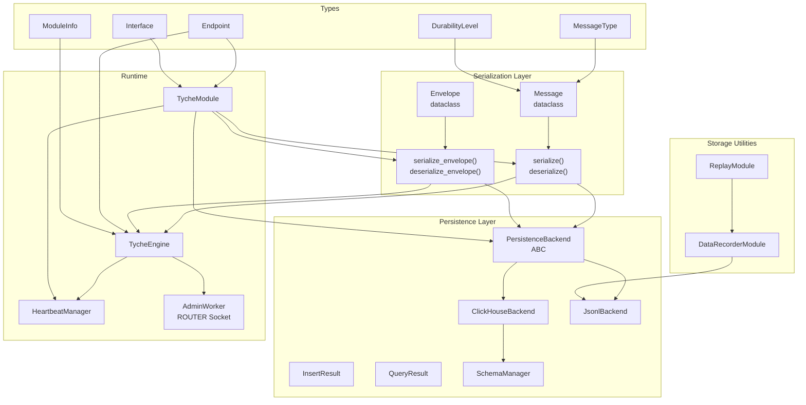

**Diagram sources**
- [message.py:13-168](file://src/tyche/message.py#L13-L168)
- [types.py:67-102](file://src/tyche/types.py#L67-L102)
- [backend.py:80-162](file://src/modules/trading/persistence/backend.py#L80-L162)
- [clickhouse_backend.py:23-231](file://src/modules/trading/persistence/clickhouse_backend.py#L23-L231)
- [jsonl_backend.py:20-155](file://src/modules/trading/persistence/jsonl_backend.py#L20-L155)
- [schema.py:35-107](file://src/modules/trading/persistence/schema.py#L35-L107)
- [recorder.py:20-124](file://src/modules/trading/store/recorder.py#L20-L124)
- [replay.py:21-137](file://src/modules/trading/store/replay.py#L21-L137)
- [engine.py:25-350](file://src/tyche/engine.py#L25-L350)
- [module.py:28-401](file://src/tyche/module.py#L28-L401)
- [heartbeat.py:91-142](file://src/tyche/heartbeat.py#L91-L142)

**Section sources**
- [message.py:1-168](file://src/tyche/message.py#L1-L168)
- [types.py:1-117](file://src/tyche/types.py#L1-L117)
- [backend.py:1-162](file://src/modules/trading/persistence/backend.py#L1-L162)
- [clickhouse_backend.py:1-231](file://src/modules/trading/persistence/clickhouse_backend.py#L1-L231)
- [jsonl_backend.py:1-155](file://src/modules/trading/persistence/jsonl_backend.py#L1-L155)
- [schema.py:1-107](file://src/modules/trading/persistence/schema.py#L1-L107)
- [recorder.py:1-123](file://src/modules/trading/store/recorder.py#L1-L123)
- [replay.py:1-137](file://src/modules/trading/store/replay.py#L1-L137)
- [engine.py:1-660](file://src/tyche/engine.py#L1-L660)
- [module.py:1-434](file://src/tyche/module.py#L1-L434)
- [heartbeat.py:1-153](file://src/tyche/heartbeat.py#L1-L153)

## Core Components
- Message: Application-level message structure with typed fields for type, sender, event, payload, recipient, durability, timestamp, and correlation ID.
- Envelope: ZeroMQ routing envelope containing identity, message, and routing stack for reply path.
- Serialization: MessagePack-based encode/decode with custom hooks for Decimal, Enum, and bytes.
- Routing: Engine uses XPUB/XSUB proxy for event distribution and ROUTER/DEALER for registration and P2P.
- **Persistence Backend**: Abstract interface defining storage operations with ClickHouse and JSONL implementations.
- **Schema Manager**: Handles ClickHouse table creation and version tracking for persistence layer.
- **Administrative Endpoint**: Dedicated ROUTER socket for engine state queries and monitoring.
- **Thread-Safe Operations**: Comprehensive locking mechanisms throughout engine and module components.

Key responsibilities:
- Message: Define canonical message shape and metadata.
- Envelope: Wrap messages for ZeroMQ multipart frames and preserve routing context.
- Serializer: Preserve Python native types and Decimal precision across transport.
- Engine: Route events, manage registration, monitor liveness, and provide administrative queries.
- Module: Publish/subscribe to events, handle ACK patterns, send heartbeats, and integrate with persistence layer.
- **Persistence Layer**: Provide durable event storage with configurable backends and query capabilities.
- **Administrative Support**: Enable remote monitoring and state inspection of the engine.

**Section sources**
- [message.py:13-168](file://src/tyche/message.py#L13-L168)
- [types.py:67-102](file://src/tyche/types.py#L67-L102)
- [backend.py:80-162](file://src/modules/trading/persistence/backend.py#L80-L162)
- [engine.py:25-350](file://src/tyche/engine.py#L25-L350)
- [module.py:28-401](file://src/tyche/module.py#L28-L401)

## Architecture Overview
The message system integrates with ZeroMQ sockets, the engine's routing infrastructure, and the new persistence layer:
- Registration: REQ/ROUTER for one-shot registration and ACK replies.
- Events: XPUB/XSUB proxy for pub-sub event distribution.
- P2P: DEALER/ROUTER for direct module-to-module communication.
- Heartbeat: PUB/SUB for liveness monitoring using the Paranoid Pirate pattern.
- **Persistence**: Optional durable storage through configurable backend implementations.
- **Administration**: Dedicated ROUTER socket for engine state queries and monitoring.

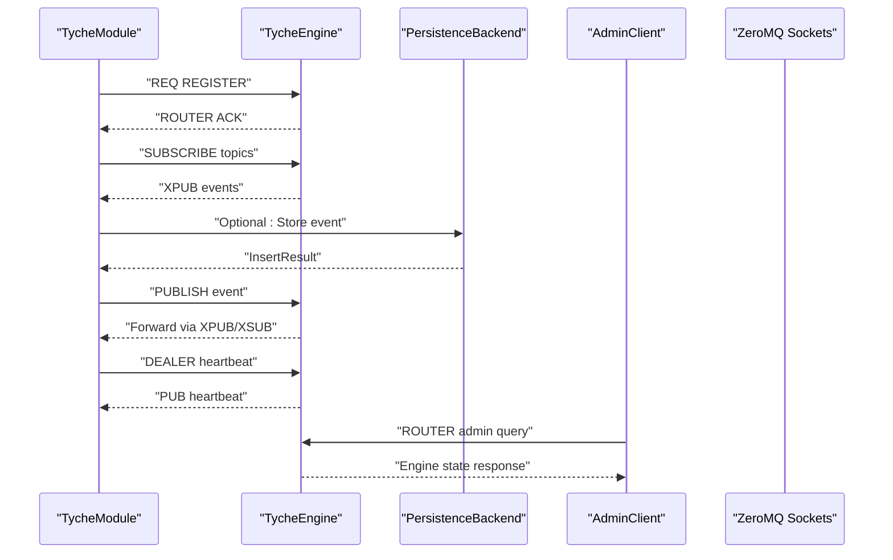

**Diagram sources**
- [module.py:200-255](file://src/tyche/module.py#L200-L255)
- [engine.py:121-177](file://src/tyche/engine.py#L121-L177)
- [engine.py:238-278](file://src/tyche/engine.py#L238-L278)
- [heartbeat.py:72-89](file://src/tyche/heartbeat.py#L72-L89)
- [backend.py:88-162](file://src/modules/trading/persistence/backend.py#L88-L162)
- [engine.py:570-660](file://src/tyche/engine.py#L570-L660)

## Detailed Component Analysis

### Message and Envelope Classes
The Message class encapsulates the canonical message structure with strong typing via enums and optional fields. The Envelope wraps a Message for ZeroMQ multipart framing and preserves routing identity and hop stack.

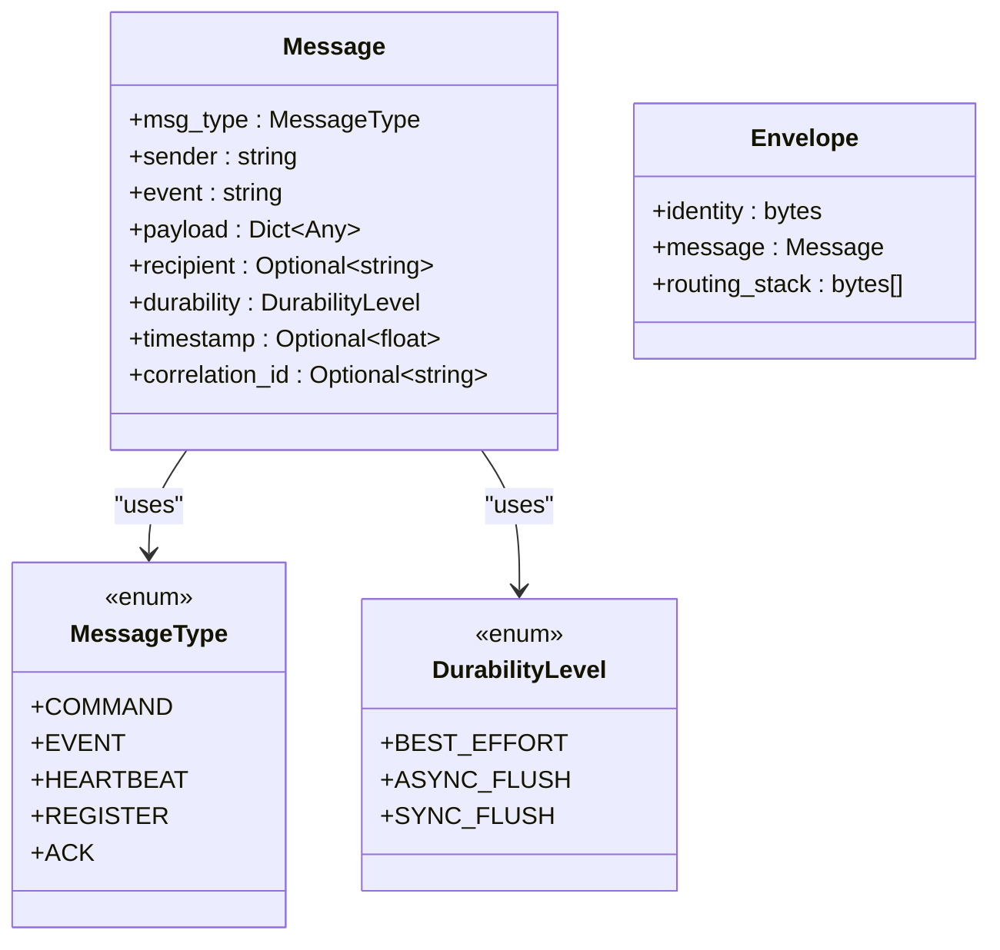

**Diagram sources**
- [message.py:13-49](file://src/tyche/message.py#L13-L49)
- [types.py:79-87](file://src/tyche/types.py#L79-L87)
- [types.py:72-77](file://src/tyche/types.py#L72-L77)

**Section sources**
- [message.py:13-49](file://src/tyche/message.py#L13-L49)
- [types.py:72-87](file://src/tyche/types.py#L72-L87)

### Serialization Hooks: Decimal Precision and Python Types
The serializer uses custom encode/decode hooks to preserve Decimal precision and handle Python-native types:
- Encode hook converts Decimal to a tagged dictionary and Enum values to primitives, and decodes bytes to UTF-8 strings.
- Decode hook restores Decimal from the tagged dictionary.

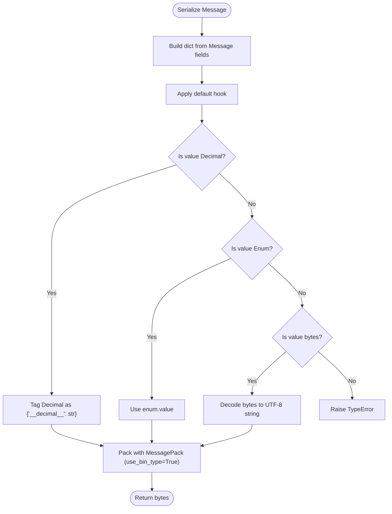

**Diagram sources**
- [message.py:51-88](file://src/tyche/message.py#L51-L88)

**Section sources**
- [message.py:51-88](file://src/tyche/message.py#L51-L88)
- [test_message.py:77-91](file://tests/unit/test_message.py#L77-L91)

### Envelope Handling for ZeroMQ Routing
Envelopes support both simple and routed multipart frames:
- Simple: identity + serialized message.
- Routed: routing_stack frames + empty delimiter + identity + serialized message.

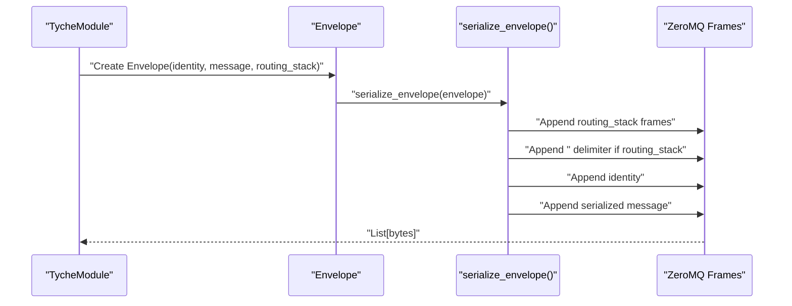

**Diagram sources**
- [message.py:114-137](file://src/tyche/message.py#L114-L137)
- [message.py:140-167](file://src/tyche/message.py#L140-L167)

**Section sources**
- [message.py:114-167](file://src/tyche/message.py#L114-L167)

### Message Lifecycle: Creation to Delivery
End-to-end lifecycle:
- Creation: Construct Message with msg_type, sender, event, payload, and optional metadata.
- Serialization: Serialize to MessagePack bytes using custom hooks.
- Transport: Send via ZeroMQ sockets (REQ/ROUTER for registration, XPUB/XSUB for events, DEALER/ROUTER for P2P).
- Delivery: Engine routes messages to subscribers or ACK responders; modules deserialize and dispatch.
- **Persistence: Optional durable storage through backend implementations.**
- **Administration: Engine responds to administrative queries with state information.**

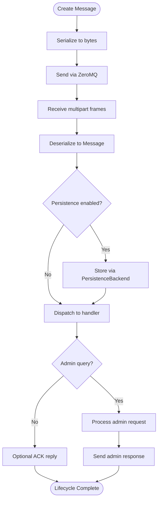

**Diagram sources**
- [module.py:301-373](file://src/tyche/module.py#L301-L373)
- [module.py:331-373](file://src/tyche/module.py#L331-L373)
- [engine.py:144-177](file://src/tyche/engine.py#L144-L177)
- [backend.py:88-162](file://src/modules/trading/persistence/backend.py#L88-L162)
- [engine.py:593-660](file://src/tyche/engine.py#L593-L660)

**Section sources**
- [module.py:301-373](file://src/tyche/module.py#L301-L373)
- [engine.py:144-177](file://src/tyche/engine.py#L144-L177)

### Routing Mechanisms
- Registration: One-shot REQ/ROUTER handshake; engine responds with ACK and ports for event channels.
- Events: XPUB/XSUB proxy forwards events to subscribers; modules subscribe by topic names.
- P2P: DEALER/ROUTER enables direct module-to-module communication with identity routing.
- Heartbeat: PUB/SUB with Paranoid Pirate pattern for liveness monitoring.
- **Administration: ROUTER socket for engine state queries and monitoring.**

```mermaid
graph TB
subgraph "Registration"
REG_REQ["REQ Module"] --> REG_ROUTER["ROUTER Engine"]
REG_ROUTER --> REG_ACK["ACK with ports"]
end
subgraph "Events"
PUB_MOD["PUB Module"] --> XPUB["XPUB Engine"]
XPUB --> XSUB["XSUB Engine"]
XSUB --> SUB_MOD["SUB Module"]
end
subgraph "P2P"
DLR_MOD["DEALER Module"] --> RT_ROUTER["ROUTER Engine"]
RT_ROUTER --> RT_DLR["ROUTER Engine"]
RT_DLR --> DLR_MOD2["DEALER Module2"]
end
subgraph "Heartbeat"
HB_PUB["PUB Engine"] --> HB_SUB["SUB Module"]
end
subgraph "Administration"
ADM_REQ["REQ AdminClient"] --> ADM_ROUTER["ROUTER Engine"]
ADM_ROUTER --> ADM_RESP["Engine state response"]
end
```

**Diagram sources**
- [engine.py:121-177](file://src/tyche/engine.py#L121-L177)
- [engine.py:238-278](file://src/tyche/engine.py#L238-L278)
- [heartbeat.py:72-89](file://src/tyche/heartbeat.py#L72-L89)
- [engine.py:570-660](file://src/tyche/engine.py#L570-L660)

**Section sources**
- [engine.py:121-177](file://src/tyche/engine.py#L121-L177)
- [engine.py:238-278](file://src/tyche/engine.py#L238-L278)
- [heartbeat.py:72-89](file://src/tyche/heartbeat.py#L72-L89)
- [engine.py:570-660](file://src/tyche/engine.py#L570-L660)

### Type Safety and Validation
- Enums: MessageType and DurabilityLevel ensure consistent values across the system.
- Optional fields: timestamp, correlation_id, recipient allow flexible message shapes.
- Validation in engine: Registration validates message type and extracts module info; malformed messages are logged and ignored.
- Heartbeat validation: Engine updates liveness on valid heartbeat messages.
- **Administrative validation: Engine processes admin queries with structured responses and error handling.**

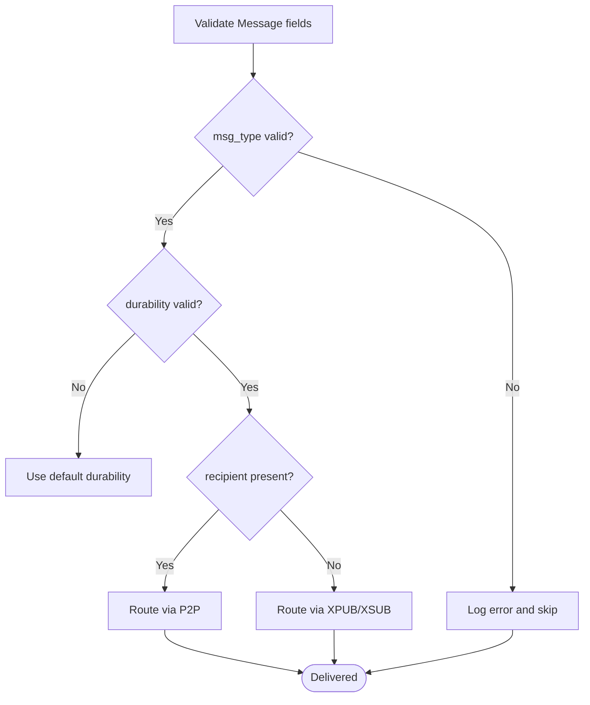

**Diagram sources**
- [engine.py:144-177](file://src/tyche/engine.py#L144-L177)
- [engine.py:316-339](file://src/tyche/engine.py#L316-L339)

**Section sources**
- [engine.py:144-177](file://src/tyche/engine.py#L144-L177)
- [engine.py:316-339](file://src/tyche/engine.py#L316-L339)

### Practical Integration Patterns
- Fire-and-forget events: Use on_* handlers; publish via send_event.
- Request-response with ACK: Use ack_* handlers; call via call_ack with REQ socket.
- Direct P2P: Use whisper_* handlers; establish channels during registration.
- Broadcast: Use on_common_* handlers; publish via send_event to topics.
- **Durable events: Configure persistence backend for production deployments.**
- **Administrative monitoring: Use admin endpoint for engine state inspection.**

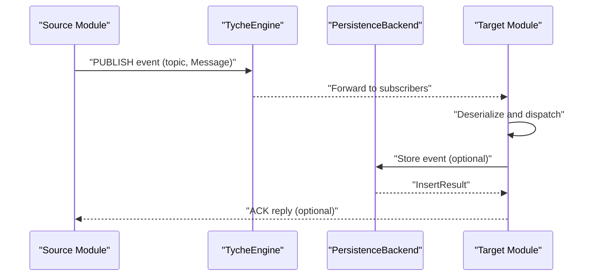

**Diagram sources**
- [module.py:301-330](file://src/tyche/module.py#L301-L330)
- [module.py:331-373](file://src/tyche/module.py#L331-L373)
- [engine.py:238-278](file://src/tyche/engine.py#L238-L278)
- [backend.py:88-162](file://src/modules/trading/persistence/backend.py#L88-L162)

**Section sources**
- [module.py:301-373](file://src/tyche/module.py#L301-L373)
- [engine.py:238-278](file://src/tyche/engine.py#L238-L278)

## Event Persistence Layer

### Backend Abstraction System
The persistence layer provides a pluggable storage system through the abstract PersistenceBackend interface, enabling different storage backends while maintaining a consistent API for event storage and retrieval.

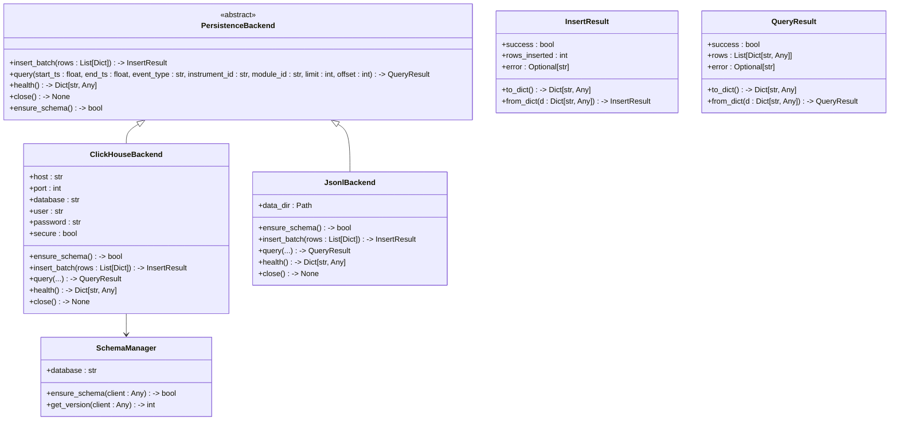

**Diagram sources**
- [backend.py:80-162](file://src/modules/trading/persistence/backend.py#L80-L162)
- [clickhouse_backend.py:23-231](file://src/modules/trading/persistence/clickhouse_backend.py#L23-L231)
- [jsonl_backend.py:20-155](file://src/modules/trading/persistence/jsonl_backend.py#L20-L155)
- [schema.py:35-107](file://src/modules/trading/persistence/schema.py#L35-L107)

**Section sources**
- [backend.py:80-162](file://src/modules/trading/persistence/backend.py#L80-L162)
- [clickhouse_backend.py:23-231](file://src/modules/trading/persistence/clickhouse_backend.py#L23-L231)
- [jsonl_backend.py:20-155](file://src/modules/trading/persistence/jsonl_backend.py#L20-L155)
- [schema.py:35-107](file://src/modules/trading/persistence/schema.py#L35-L107)

### ClickHouse Backend Implementation
The ClickHouseBackend provides production-grade event storage with connection pooling, schema management, and optimized query performance for time-series data.

Key features:
- Connection pooling through clickhouse-connect library
- Daily partitioning for optimal time-range queries
- Base64 encoding for binary payload storage
- Health checking and automatic schema creation
- Configurable connection parameters (host, port, database, user, password, secure)

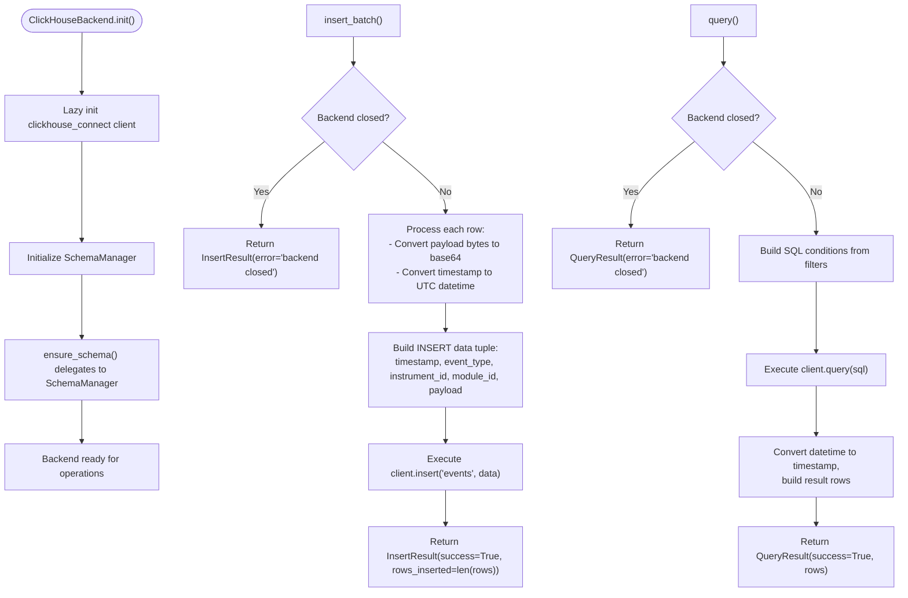

**Diagram sources**
- [clickhouse_backend.py:58-231](file://src/modules/trading/persistence/clickhouse_backend.py#L58-L231)

**Section sources**
- [clickhouse_backend.py:23-231](file://src/modules/trading/persistence/clickhouse_backend.py#L23-L231)

### JSONL Backend Implementation
The JsonlBackend serves as a development and testing fallback, storing events in date-partitioned JSONL files with simple file I/O operations.

Key features:
- Date-partitioned file structure: `{data_dir}/{date}/events.jsonl`
- Simple JSON serialization with base64 payload encoding
- Full-text search capability across all JSONL files
- Development-friendly with no external dependencies
- Automatic directory creation and file rotation

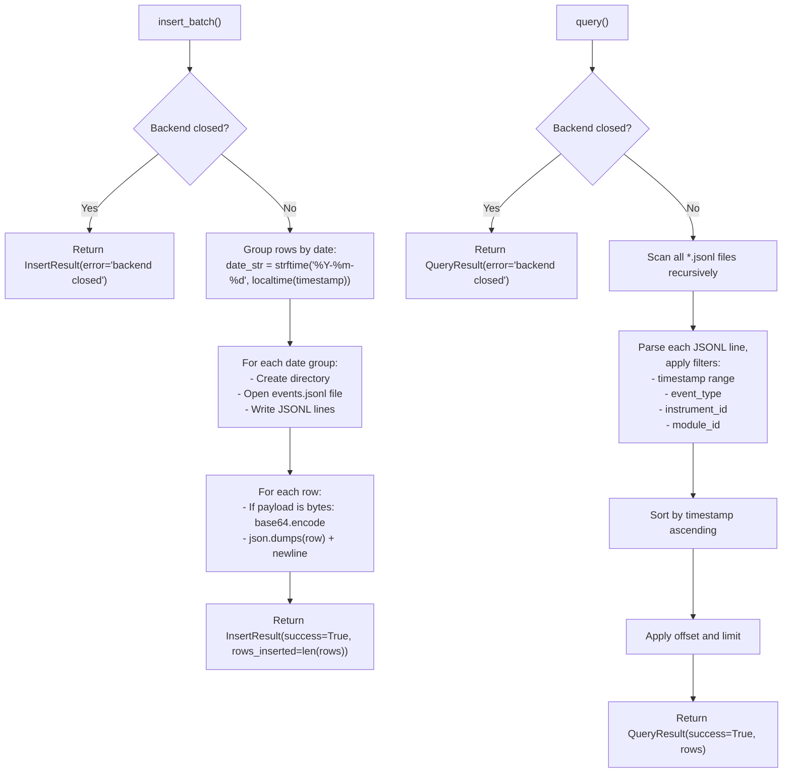

**Diagram sources**
- [jsonl_backend.py:44-155](file://src/modules/trading/persistence/jsonl_backend.py#L44-L155)

**Section sources**
- [jsonl_backend.py:20-155](file://src/modules/trading/persistence/jsonl_backend.py#L20-L155)

### Schema Management
The SchemaManager handles ClickHouse table creation and version tracking, ensuring consistent schema deployment across environments.

Key features:
- Idempotent table creation (CREATE TABLE IF NOT EXISTS)
- Lightweight schema versioning via schema_meta table
- Current schema version: 1
- Duck-typed client interface compatible with clickhouse_connect

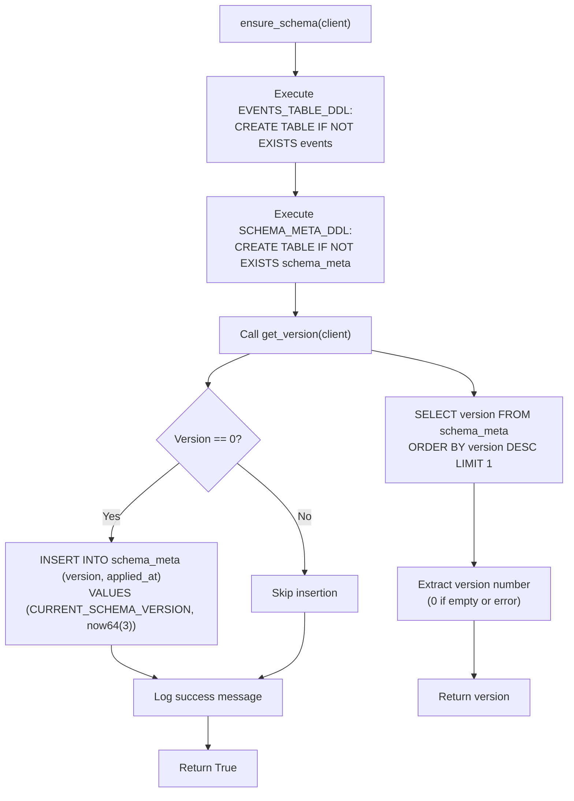

**Diagram sources**
- [schema.py:52-107](file://src/modules/trading/persistence/schema.py#L52-L107)

**Section sources**
- [schema.py:35-107](file://src/modules/trading/persistence/schema.py#L35-L107)

### Event Recording and Replay
The trading store module provides dedicated recording and replay capabilities for backtesting and analysis.

**DataRecorderModule**: Records market data and trading events to file storage with date-partitioned JSONL files, supporting configurable event filtering and instrument tracking.

**ReplayModule**: Reads recorded market data and replays events through the engine with simulated time advancement, enabling backtesting workflows.

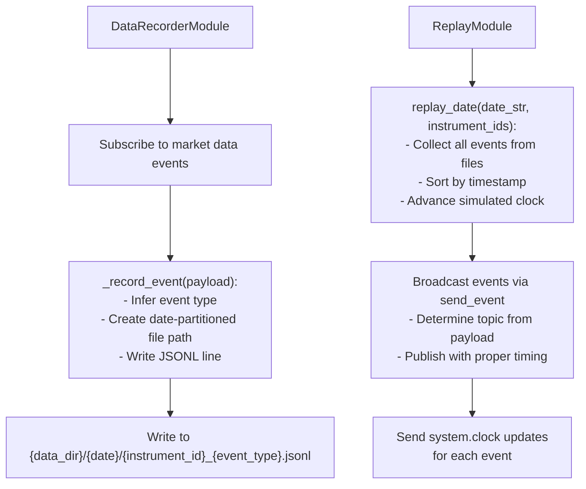

**Diagram sources**
- [recorder.py:78-124](file://src/modules/trading/store/recorder.py#L78-L124)
- [replay.py:50-137](file://src/modules/trading/store/replay.py#L50-L137)

**Section sources**
- [recorder.py:20-123](file://src/modules/trading/store/recorder.py#L20-L123)
- [replay.py:21-137](file://src/modules/trading/store/replay.py#L21-L137)

## Administrative Endpoint Support

### Admin Worker Implementation
The TycheEngine includes a dedicated administrative endpoint that allows external clients to query engine state and monitoring information. The admin worker operates on a separate ROUTER socket with predefined query commands.

Key features:
- Dedicated admin endpoint with default port 5560
- Structured query processing with JSON-encoded responses
- Thread-safe state access with engine-wide locking
- Multiple query types: STATUS, MODULES, STATS
- Real-time metrics including uptime, event counts, and queue sizes

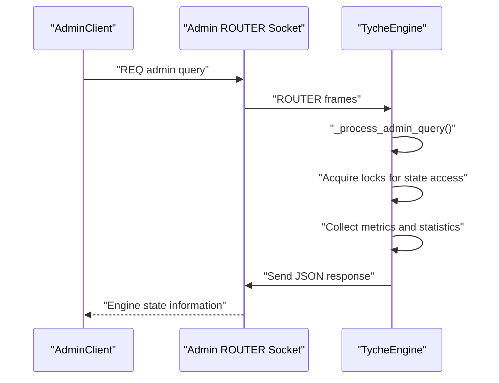

**Diagram sources**
- [engine.py:570-660](file://src/tyche/engine.py#L570-L660)

### Supported Administrative Queries
The administrative endpoint supports three primary query types:

**STATUS Query**: Returns comprehensive engine operational information including:
- Engine uptime and event statistics
- Module registration counts
- Topic queue metrics
- Subscriber and producer mappings
- Internal queue sizes

**MODULES Query**: Provides detailed information about registered modules:
- Module identifiers and interface lists
- Liveness status for each module
- Interface patterns and durability levels

**STATS Query**: Returns aggregated operational statistics:
- Event and registration counts
- Current module count
- Engine performance metrics

**Section sources**
- [engine.py:570-660](file://src/tyche/engine.py#L570-L660)
- [types.py:13-14](file://src/tyche/types.py#L13-L14)

## Thread-Safe Operations

### Comprehensive Locking Strategy
The TycheEngine implements a multi-layered locking strategy to ensure thread-safe operations across all components:

**Engine-Level Locks**:
- `_lock`: Global engine state protection for module registry and interface maps
- `_topic_queues_lock`: Per-topic queue synchronization for event distribution
- `_xpub_lock`: ZeroMQ socket access protection for XPUB operations
- `_registration_lock`: Registration socket thread safety

**Module-Level Locks**:
- `_handlers_lock`: Event handler registration and access protection
- `_pub_lock`: Publisher socket thread safety for event publishing

**Heartbeat Management**:
- Thread-safe heartbeat monitoring with individual peer tracking
- Coordinated heartbeat sending and receiving operations

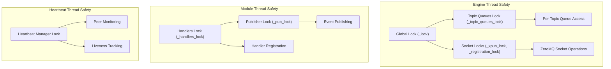

**Diagram sources**
- [engine.py:57-104](file://src/tyche/engine.py#L57-L104)
- [module.py:53-76](file://src/tyche/module.py#L53-L76)
- [heartbeat.py:105-153](file://src/tyche/heartbeat.py#L105-L153)

**Section sources**
- [engine.py:57-104](file://src/tyche/engine.py#L57-L104)
- [module.py:53-76](file://src/tyche/module.py#L53-L76)
- [heartbeat.py:105-153](file://src/tyche/heartbeat.py#L105-L153)

## Dependency Analysis
The message system depends on:
- MessagePack for serialization.
- ZeroMQ for transport and routing.
- Enumerations and dataclasses for type safety and structure.
- Heartbeat manager for liveness monitoring.
- **Persistence backends for durable event storage.**
- **Schema management for ClickHouse table creation.**
- **Administrative endpoint for engine state monitoring.**
- **Thread-safe locking mechanisms throughout all components.**

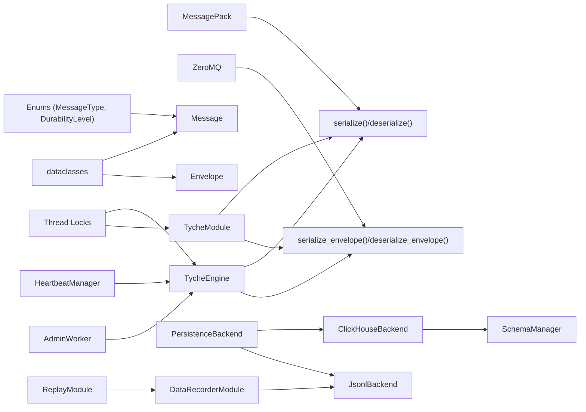

**Diagram sources**
- [message.py:8,10,51-111](file://src/tyche/message.py#L8,L10,L51-L111)
- [engine.py:8,11,121-177](file://src/tyche/engine.py#L8,L11,L121-L177)
- [module.py:11,13,200-255](file://src/tyche/module.py#L11,L13,L200-L255)
- [heartbeat.py:10,12,91-142](file://src/tyche/heartbeat.py#L10,L12,L91-L142)
- [backend.py:80-162](file://src/modules/trading/persistence/backend.py#L80-L162)
- [clickhouse_backend.py:23-231](file://src/modules/trading/persistence/clickhouse_backend.py#L23-L231)
- [jsonl_backend.py:20-155](file://src/modules/trading/persistence/jsonl_backend.py#L20-L155)
- [schema.py:35-107](file://src/modules/trading/persistence/schema.py#L35-L107)
- [recorder.py:20-124](file://src/modules/trading/store/recorder.py#L20-L124)
- [replay.py:21-137](file://src/modules/trading/store/replay.py#L21-L137)

**Section sources**
- [message.py:8,10,51-111](file://src/tyche/message.py#L8,L10,L51-L111)
- [engine.py:8,11,121-177](file://src/tyche/engine.py#L8,L11,L121-L177)
- [module.py:11,13,200-255](file://src/tyche/module.py#L11,L13,L200-L255)
- [heartbeat.py:10,12,91-142](file://src/tyche/heartbeat.py#L10,L12,L91-L142)
- [backend.py:80-162](file://src/modules/trading/persistence/backend.py#L80-L162)
- [clickhouse_backend.py:23-231](file://src/modules/trading/persistence/clickhouse_backend.py#L23-L231)
- [jsonl_backend.py:20-155](file://src/modules/trading/persistence/jsonl_backend.py#L20-L155)
- [schema.py:35-107](file://src/modules/trading/persistence/schema.py#L35-L107)
- [recorder.py:20-124](file://src/modules/trading/store/recorder.py#L20-L124)
- [replay.py:21-137](file://src/modules/trading/store/replay.py#L21-L137)

## Performance Considerations
- Serialization overhead: MessagePack is compact and fast; custom hooks add minimal overhead.
- Memory usage: Payloads are arbitrary dicts; avoid excessively large payloads to reduce GC pressure.
- Durability levels: Choose durability based on SLA; ASYNC_FLUSH minimizes latency impact.
- Backpressure: Broadcast patterns (on_common_) are best-effort; ensure subscribers can keep up.
- Heartbeat intervals: Tune intervals to balance liveness detection speed and network overhead.
- **Storage backend selection**: ClickHouse offers production-grade performance with sub-second latency for analytical queries; JSONL backend is suitable for development and testing scenarios.
- **Schema optimization**: ClickHouse events table uses optimized partitioning and ordering for time-series queries; consider indexing strategies for specific query patterns.
- **Connection pooling**: ClickHouseBackend maintains persistent connections; configure appropriate pool sizes for high-throughput scenarios.
- **Payload encoding**: Binary payloads are base64-encoded for storage; consider compression for large payloads to reduce storage footprint.
- **Thread contention**: Engine uses fine-grained locking to minimize contention; avoid long-running operations within locked sections.
- **Administrative query performance**: Admin endpoint provides non-blocking state access with minimal overhead for monitoring operations.

**Section sources**
- [clickhouse_backend.py:23-231](file://src/modules/trading/persistence/clickhouse_backend.py#L23-L231)
- [jsonl_backend.py:20-155](file://src/modules/trading/persistence/jsonl_backend.py#L20-L155)
- [schema.py:14-32](file://src/modules/trading/persistence/schema.py#L14-L32)
- [engine.py:570-660](file://src/tyche/engine.py#L570-L660)

## Troubleshooting Guide
Common issues and resolutions:
- Serialization errors: Ensure payloads only contain serializable types or use Decimal-compatible structures; verify custom hooks handle all edge cases.
- Registration failures: Confirm endpoints match engine configuration and network connectivity; check timeouts.
- Missing events: Verify subscription topics match handler names; ensure XPUB/XSUB proxy is running.
- Heartbeat problems: Check PUB/SUB connectivity and intervals; confirm engine heartbeat endpoints are reachable.
- **Persistence backend issues**: Verify backend configuration matches environment settings; check connection parameters for ClickHouse; ensure database and table schemas are properly initialized.
- **ClickHouse connectivity**: Confirm service availability, authentication credentials, and network connectivity; verify schema version and table existence.
- **JSONL file permissions**: Ensure write permissions for data directory; check disk space availability; verify file system integrity.
- **Query performance**: Optimize time-range filters and consider adding appropriate indexes; monitor storage utilization and query patterns.
- **Administrative endpoint issues**: Verify admin endpoint binding and connectivity; check query syntax and response formats.
- **Thread safety concerns**: Monitor for deadlocks or race conditions; ensure proper lock acquisition order in complex operations.
- **Memory leaks**: Track event queue growth and topic queue TTL settings; implement proper cleanup procedures.

**Section sources**
- [test_message.py:77-91](file://tests/unit/test_message.py#L77-L91)
- [engine.py:121-177](file://src/tyche/engine.py#L121-L177)
- [engine.py:238-278](file://src/tyche/engine.py#L238-L278)
- [heartbeat.py:72-89](file://src/tyche/heartbeat.py#L72-L89)
- [test_backend.py:84-148](file://tests/unit/test_backend.py#L84-L148)
- [test_clickhouse_backend.py:46-239](file://tests/integration/test_clickhouse_backend.py#L46-L239)

## Conclusion
Tyche Engine's message system provides a robust, high-performance foundation for distributed event-driven architectures. MessagePack serialization with custom hooks preserves Decimal precision and handles Python-native types safely. The Message and Envelope structures, combined with ZeroMQ routing patterns, enable flexible communication modes: fire-and-forget, request-response with ACK, direct P2P, and broadcast. The engine's registration, event proxy, and heartbeat mechanisms ensure reliable operation and scalability.

**Updated** The addition of administrative endpoint support significantly enhances operational visibility by providing real-time engine state monitoring and statistics collection. The comprehensive thread-safe operations ensure reliable multi-threaded execution across all components, preventing race conditions and maintaining system stability under load. The integration of the event persistence layer with ClickHouse and JSONL backends creates a complete solution for event-driven systems, supporting both production-scale analytics and development/testing workflows. The combination of these enhancements makes Tyche Engine suitable for enterprise-grade deployments requiring monitoring, reliability, and scalable event processing capabilities.

## Appendices

### Practical Examples and Integration
- Start the engine and module examples demonstrate end-to-end usage of the message system.
- Example module patterns show how to implement on_*, ack_*, whisper_*, and on_common_* handlers.
- **Persistence integration**: Configure backend selection through persistence.backend setting ("clickhouse" | "jsonl") with appropriate connection parameters.
- **Administrative monitoring**: Use admin endpoint for engine state inspection and operational monitoring.

**Section sources**
- [run_engine.py:21-50](file://examples/run_engine.py#L21-L50)
- [run_module.py:22-46](file://examples/run_module.py#L22-L46)
- [example_module.py:19-167](file://src/tyche/example_module.py#L19-L167)

### Compatibility with External Systems
- MessagePack is widely supported across languages; Decimal precision can be preserved by using the tagged dictionary convention.
- ZeroMQ socket patterns are transport-independent and can interoperate with other systems using compatible protocols.
- **ClickHouse backend**: Supports standard SQL queries and integrates with BI tools; payload encoding maintains compatibility with external systems.
- **JSONL format**: Human-readable and easily processable by external tools; supports streaming and batch processing workflows.
- **Administrative endpoint**: Provides structured JSON responses compatible with monitoring and alerting systems.

**Section sources**
- [README.md:104-103](file://README.md#L104-L103)
- [clickhouse_backend.py:23-231](file://src/modules/trading/persistence/clickhouse_backend.py#L23-L231)
- [jsonl_backend.py:20-155](file://src/modules/trading/persistence/jsonl_backend.py#L20-L155)

### Backend Configuration Examples
**ClickHouse Backend Configuration:**
```python
backend = ClickHouseBackend(
    host="localhost",
    port=8123,
    database="tyche",
    user="default",
    password="",
    secure=False
)
```

**JSONL Backend Configuration:**
```python
backend = JsonlBackend(data_dir="./data/recorded")
```

**Administrative Endpoint Configuration:**
```python
engine = TycheEngine(
    registration_endpoint=Endpoint("127.0.0.1", 5555),
    event_endpoint=Endpoint("127.0.0.1", 5556),
    heartbeat_endpoint=Endpoint("127.0.0.1", 5558),
    heartbeat_receive_endpoint=Endpoint("127.0.0.1", 5559),
    admin_endpoint="tcp://127.0.0.1:5560"  # Administrative endpoint
)
```

**Section sources**
- [clickhouse_backend.py:38-57](file://src/modules/trading/persistence/clickhouse_backend.py#L38-L57)
- [jsonl_backend.py:34](file://src/modules/trading/persistence/jsonl_backend.py#L34)
- [engine.py:43](file://src/tyche/engine.py#L43)
- [types.py:13-14](file://src/tyche/types.py#L13-L14)