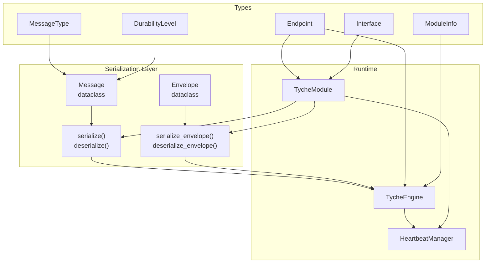
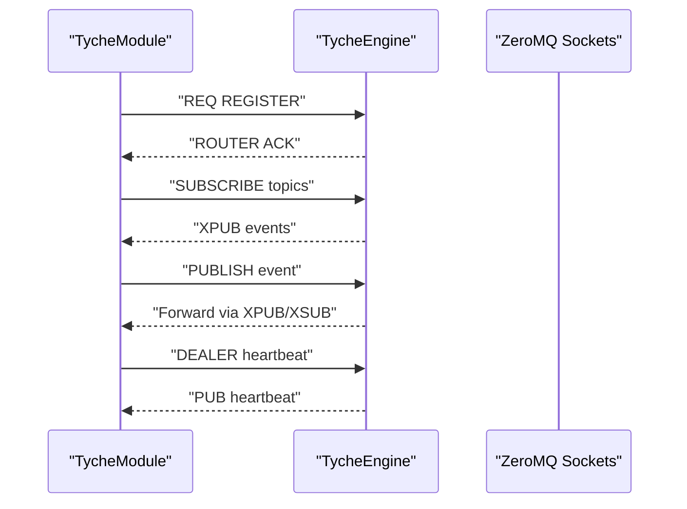
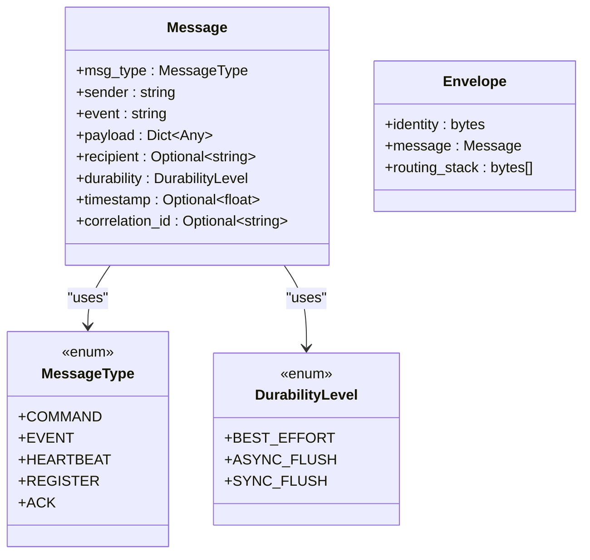
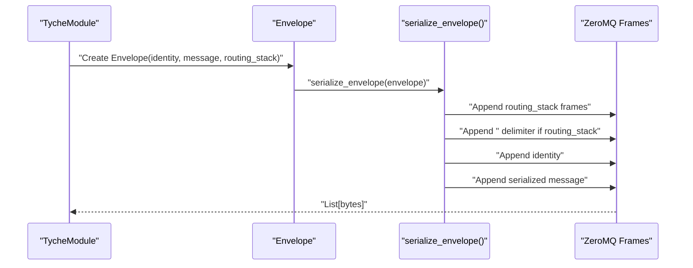
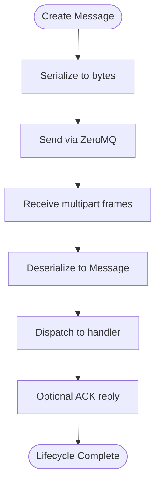
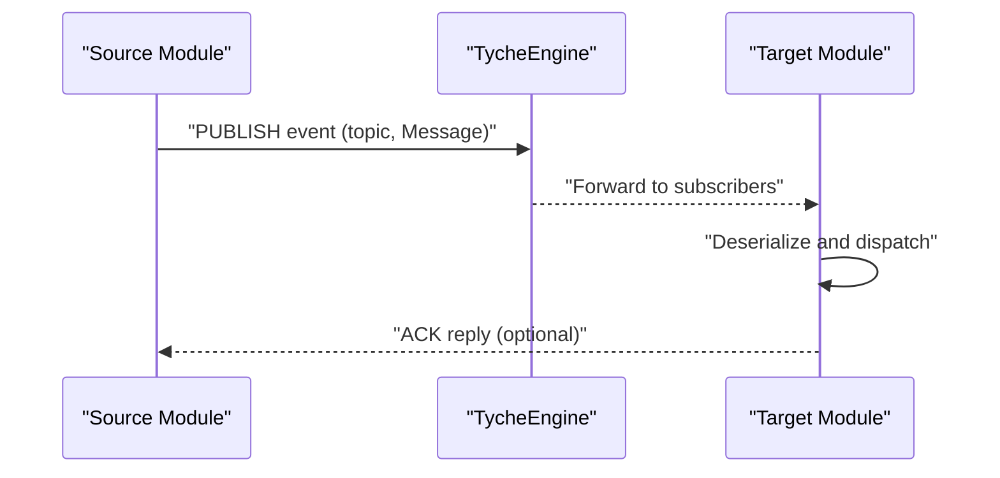
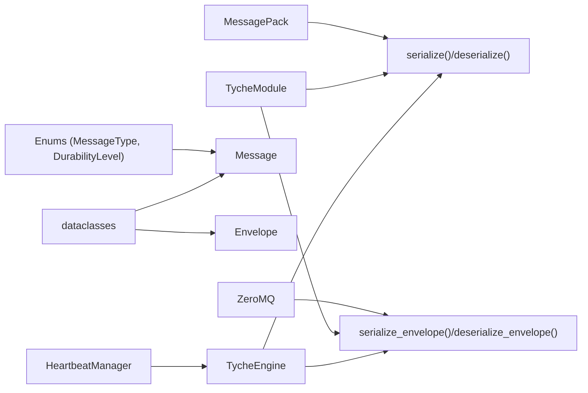

# Message System

<cite>
**Referenced Files in This Document**
- [message.py](file://src/tyche/message.py)
- [types.py](file://src/tyche/types.py)
- [engine.py](file://src/tyche/engine.py)
- [module.py](file://src/tyche/module.py)
- [module_base.py](file://src/tyche/module_base.py)
- [heartbeat.py](file://src/tyche/heartbeat.py)
- [test_message.py](file://tests/unit/test_message.py)
- [run_engine.py](file://examples/run_engine.py)
- [run_module.py](file://examples/run_module.py)
- [example_module.py](file://src/tyche/example_module.py)
- [README.md](file://README.md)
</cite>

## Table of Contents
1. [Introduction](#introduction)
2. [Project Structure](#project-structure)
3. [Core Components](#core-components)
4. [Architecture Overview](#architecture-overview)
5. [Detailed Component Analysis](#detailed-component-analysis)
6. [Dependency Analysis](#dependency-analysis)
7. [Performance Considerations](#performance-considerations)
8. [Troubleshooting Guide](#troubleshooting-guide)
9. [Conclusion](#conclusion)
10. [Appendices](#appendices)

## Introduction
This document describes Tyche Engine’s message system, focusing on the serialization framework built on MessagePack. It covers Python native types, Decimal precision preservation, custom object serialization hooks, the Message class structure, envelope handling for ZeroMQ routing, and routing mechanisms. It also documents the message lifecycle from creation to delivery, including timestamping, event IDs, and metadata handling, along with type safety features, validation rules, error handling, and practical integration patterns. Performance characteristics, memory usage, and compatibility with external systems are addressed.

## Project Structure
The message system spans several modules:
- Serialization and envelopes: [message.py](file://src/tyche/message.py)
- Core type definitions: [types.py](file://src/tyche/types.py)
- Engine broker: [engine.py](file://src/tyche/engine.py)
- Module runtime: [module.py](file://src/tyche/module.py)
- Module base and discovery: [module_base.py](file://src/tyche/module_base.py)
- Heartbeat and monitoring: [heartbeat.py](file://src/tyche/heartbeat.py)
- Tests: [test_message.py](file://tests/unit/test_message.py)
- Examples: [run_engine.py](file://examples/run_engine.py), [run_module.py](file://examples/run_module.py), [example_module.py](file://src/tyche/example_module.py)
- Documentation: [README.md](file://README.md)

**Diagram sources**
- [message.py:13-168](file://src/tyche/message.py#L13-L168)
- [types.py:67-102](file://src/tyche/types.py#L67-L102)
- [engine.py:25-350](file://src/tyche/engine.py#L25-L350)
- [module.py:28-401](file://src/tyche/module.py#L28-L401)
- [heartbeat.py:91-142](file://src/tyche/heartbeat.py#L91-L142)

**Section sources**
- [message.py:1-168](file://src/tyche/message.py#L1-L168)
- [types.py:1-102](file://src/tyche/types.py#L1-L102)
- [engine.py:1-350](file://src/tyche/engine.py#L1-L350)
- [module.py:1-401](file://src/tyche/module.py#L1-L401)
- [heartbeat.py:1-142](file://src/tyche/heartbeat.py#L1-L142)

## Core Components
- Message: Application-level message structure with typed fields for type, sender, event, payload, recipient, durability, timestamp, and correlation ID.
- Envelope: ZeroMQ routing envelope containing identity, message, and routing stack for reply path.
- Serialization: MessagePack-based encode/decode with custom hooks for Decimal, Enum, and bytes.
- Routing: Engine uses XPUB/XSUB proxy for event distribution and ROUTER/DEALER for registration and P2P.

Key responsibilities:
- Message: Define canonical message shape and metadata.
- Envelope: Wrap messages for ZeroMQ multipart frames and preserve routing context.
- Serializer: Preserve Python native types and Decimal precision across transport.
- Engine: Route events, manage registration, and monitor liveness.
- Module: Publish/subscribe to events, handle ACK patterns, and send heartbeats.

**Section sources**
- [message.py:13-168](file://src/tyche/message.py#L13-L168)
- [types.py:67-102](file://src/tyche/types.py#L67-L102)
- [engine.py:25-350](file://src/tyche/engine.py#L25-L350)
- [module.py:28-401](file://src/tyche/module.py#L28-L401)

## Architecture Overview
The message system integrates with ZeroMQ sockets and the engine’s routing infrastructure:
- Registration: REQ/ROUTER for one-shot registration and ACK replies.
- Events: XPUB/XSUB proxy for pub-sub event distribution.
- P2P: DEALER/ROUTER for direct module-to-module communication.
- Heartbeat: PUB/SUB for liveness monitoring using the Paranoid Pirate pattern.

**Diagram sources**
- [module.py:200-255](file://src/tyche/module.py#L200-L255)
- [engine.py:121-177](file://src/tyche/engine.py#L121-L177)
- [engine.py:238-278](file://src/tyche/engine.py#L238-L278)
- [heartbeat.py:72-89](file://src/tyche/heartbeat.py#L72-L89)

## Detailed Component Analysis

### Message and Envelope Classes
The Message class encapsulates the canonical message structure with strong typing via enums and optional fields. The Envelope wraps a Message for ZeroMQ multipart framing and preserves routing identity and hop stack.

**Diagram sources**
- [message.py:13-49](file://src/tyche/message.py#L13-L49)
- [types.py:67-74](file://src/tyche/types.py#L67-L74)
- [types.py:60-65](file://src/tyche/types.py#L60-L65)

**Section sources**
- [message.py:13-49](file://src/tyche/message.py#L13-L49)
- [types.py:60-74](file://src/tyche/types.py#L60-L74)

### Serialization Hooks: Decimal Precision and Python Types
The serializer uses custom encode/decode hooks to preserve Decimal precision and handle Python-native types:
- Encode hook converts Decimal to a tagged dictionary and Enum values to primitives, and decodes bytes to UTF-8 strings.
- Decode hook restores Decimal from the tagged dictionary.

**Diagram sources**
- [message.py:51-88](file://src/tyche/message.py#L51-L88)

**Section sources**
- [message.py:51-88](file://src/tyche/message.py#L51-L88)
- [test_message.py:77-91](file://tests/unit/test_message.py#L77-L91)

### Envelope Handling for ZeroMQ Routing
Envelopes support both simple and routed multipart frames:
- Simple: identity + serialized message.
- Routed: routing_stack frames + empty delimiter + identity + serialized message.

**Diagram sources**
- [message.py:114-137](file://src/tyche/message.py#L114-L137)
- [message.py:140-167](file://src/tyche/message.py#L140-L167)

**Section sources**
- [message.py:114-167](file://src/tyche/message.py#L114-L167)

### Message Lifecycle: Creation to Delivery
End-to-end lifecycle:
- Creation: Construct Message with msg_type, sender, event, payload, and optional metadata.
- Serialization: Serialize to MessagePack bytes using custom hooks.
- Transport: Send via ZeroMQ sockets (REQ/ROUTER for registration, XPUB/XSUB for events, DEALER/ROUTER for P2P).
- Delivery: Engine routes messages to subscribers or ACK responders; modules deserialize and dispatch.

**Diagram sources**
- [module.py:301-330](file://src/tyche/module.py#L301-L330)
- [module.py:331-373](file://src/tyche/module.py#L331-L373)
- [engine.py:144-177](file://src/tyche/engine.py#L144-L177)

**Section sources**
- [module.py:301-373](file://src/tyche/module.py#L301-L373)
- [engine.py:144-177](file://src/tyche/engine.py#L144-L177)

### Routing Mechanisms
- Registration: One-shot REQ/ROUTER handshake; engine responds with ACK and ports for event channels.
- Events: XPUB/XSUB proxy forwards events to subscribers; modules subscribe by topic names.
- P2P: DEALER/ROUTER enables direct module-to-module communication with identity routing.
- Heartbeat: PUB/SUB with Paranoid Pirate pattern for liveness monitoring.

```mermaid
graph TB
subgraph "Registration"
REG_REQ["REQ Module"] --> REG_ROUTER["ROUTER Engine"]
REG_ROUTER --> REG_ACK["ACK with ports"]
end
subgraph "Events"
PUB_MOD["PUB Module"] --> XPUB["XPUB Engine"]
XPUB --> XSUB["XSUB Engine"]
XSUB --> SUB_MOD["SUB Module"]
end
subgraph "P2P"
DLR_MOD["DEALER Module"] --> RT_ROUTER["ROUTER Engine"]
RT_ROUTER --> RT_DLR["ROUTER Engine"]
RT_DLR --> DLR_MOD2["DEALER Module2"]
end
subgraph "Heartbeat"
HB_PUB["PUB Engine"] --> HB_SUB["SUB Module"]
end
```

**Diagram sources**
- [engine.py:121-177](file://src/tyche/engine.py#L121-L177)
- [engine.py:238-278](file://src/tyche/engine.py#L238-L278)
- [heartbeat.py:72-89](file://src/tyche/heartbeat.py#L72-L89)

**Section sources**
- [engine.py:121-177](file://src/tyche/engine.py#L121-L177)
- [engine.py:238-278](file://src/tyche/engine.py#L238-L278)
- [heartbeat.py:72-89](file://src/tyche/heartbeat.py#L72-L89)

### Type Safety and Validation
- Enums: MessageType and DurabilityLevel ensure consistent values across the system.
- Optional fields: timestamp, correlation_id, recipient allow flexible message shapes.
- Validation in engine: Registration validates message type and extracts module info; malformed messages are logged and ignored.
- Heartbeat validation: Engine updates liveness on valid heartbeat messages.

**Diagram sources**
- [engine.py:144-177](file://src/tyche/engine.py#L144-L177)
- [engine.py:316-339](file://src/tyche/engine.py#L316-L339)

**Section sources**
- [engine.py:144-177](file://src/tyche/engine.py#L144-L177)
- [engine.py:316-339](file://src/tyche/engine.py#L316-L339)

### Practical Integration Patterns
- Fire-and-forget events: Use on_* handlers; publish via send_event.
- Request-response with ACK: Use ack_* handlers; call via call_ack with REQ socket.
- Direct P2P: Use whisper_* handlers; establish channels during registration.
- Broadcast: Use on_common_* handlers; publish via send_event to topics.

**Diagram sources**
- [module.py:301-330](file://src/tyche/module.py#L301-L330)
- [module.py:331-373](file://src/tyche/module.py#L331-L373)
- [engine.py:238-278](file://src/tyche/engine.py#L238-L278)

**Section sources**
- [module.py:301-373](file://src/tyche/module.py#L301-L373)
- [engine.py:238-278](file://src/tyche/engine.py#L238-L278)

## Dependency Analysis
The message system depends on:
- MessagePack for serialization.
- ZeroMQ for transport and routing.
- Enumerations and dataclasses for type safety and structure.
- Heartbeat manager for liveness monitoring.

**Diagram sources**
- [message.py:8,10,51-111](file://src/tyche/message.py#L8,L10,L51-L111)
- [engine.py:8,11,121-177](file://src/tyche/engine.py#L8,L11,L121-L177)
- [module.py:11,13,200-255](file://src/tyche/module.py#L11,L13,L200-L255)
- [heartbeat.py:10,12,91-142](file://src/tyche/heartbeat.py#L10,L12,L91-L142)

**Section sources**
- [message.py:8,10,51-111](file://src/tyche/message.py#L8,L10,L51-L111)
- [engine.py:8,11,121-177](file://src/tyche/engine.py#L8,L11,L121-L177)
- [module.py:11,13,200-255](file://src/tyche/module.py#L11,L13,L200-L255)
- [heartbeat.py:10,12,91-142](file://src/tyche/heartbeat.py#L10,L12,L91-L142)

## Performance Considerations
- Serialization overhead: MessagePack is compact and fast; custom hooks add minimal overhead.
- Memory usage: Payloads are arbitrary dicts; avoid excessively large payloads to reduce GC pressure.
- Durability levels: Choose durability based on SLA; ASYNC_FLUSH minimizes latency impact.
- Backpressure: Broadcast patterns (on_common_) are best-effort; ensure subscribers can keep up.
- Heartbeat intervals: Tune intervals to balance liveness detection speed and network overhead.

[No sources needed since this section provides general guidance]

## Troubleshooting Guide
Common issues and resolutions:
- Serialization errors: Ensure payloads only contain serializable types or use Decimal-compatible structures; verify custom hooks handle all edge cases.
- Registration failures: Confirm endpoints match engine configuration and network connectivity; check timeouts.
- Missing events: Verify subscription topics match handler names; ensure XPUB/XSUB proxy is running.
- Heartbeat problems: Check PUB/SUB connectivity and intervals; confirm engine heartbeat endpoints are reachable.

**Section sources**
- [test_message.py:77-91](file://tests/unit/test_message.py#L77-L91)
- [engine.py:121-177](file://src/tyche/engine.py#L121-L177)
- [engine.py:238-278](file://src/tyche/engine.py#L238-L278)
- [heartbeat.py:72-89](file://src/tyche/heartbeat.py#L72-L89)

## Conclusion
Tyche Engine’s message system provides a robust, high-performance foundation for distributed event-driven architectures. MessagePack serialization with custom hooks preserves Decimal precision and handles Python-native types safely. The Message and Envelope structures, combined with ZeroMQ routing patterns, enable flexible communication modes: fire-and-forget, request-response with ACK, direct P2P, and broadcast. The engine’s registration, event proxy, and heartbeat mechanisms ensure reliable operation and scalability.

[No sources needed since this section summarizes without analyzing specific files]

## Appendices

### Practical Examples and Integration
- Start the engine and module examples demonstrate end-to-end usage of the message system.
- Example module patterns show how to implement on_*, ack_*, whisper_*, and on_common_* handlers.

**Section sources**
- [run_engine.py:21-50](file://examples/run_engine.py#L21-L50)
- [run_module.py:22-46](file://examples/run_module.py#L22-L46)
- [example_module.py:19-167](file://src/tyche/example_module.py#L19-L167)

### Compatibility with External Systems
- MessagePack is widely supported across languages; Decimal precision can be preserved by using the tagged dictionary convention.
- ZeroMQ socket patterns are transport-independent and can interoperate with other systems using compatible protocols.

**Section sources**
- [README.md:104-103](file://README.md#L104-L103)