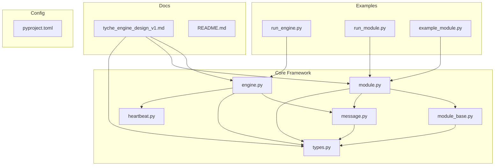
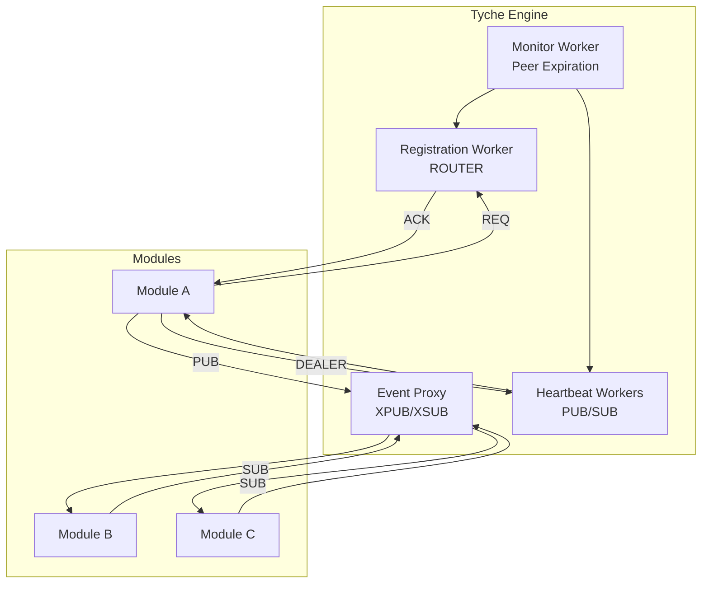
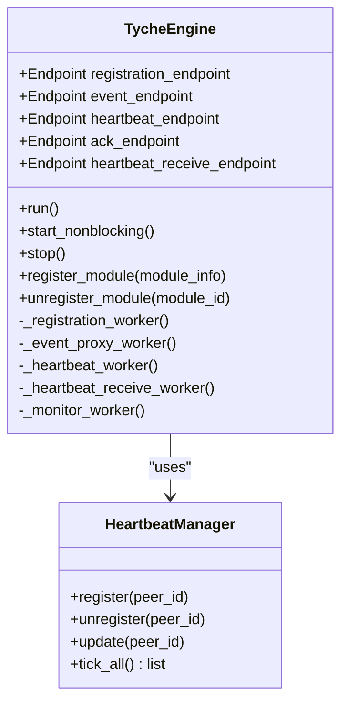
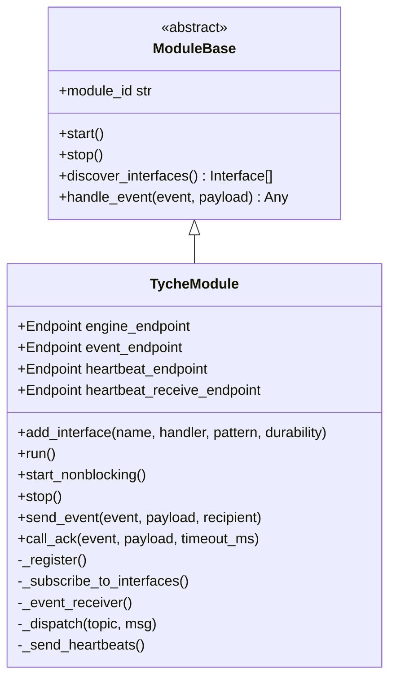
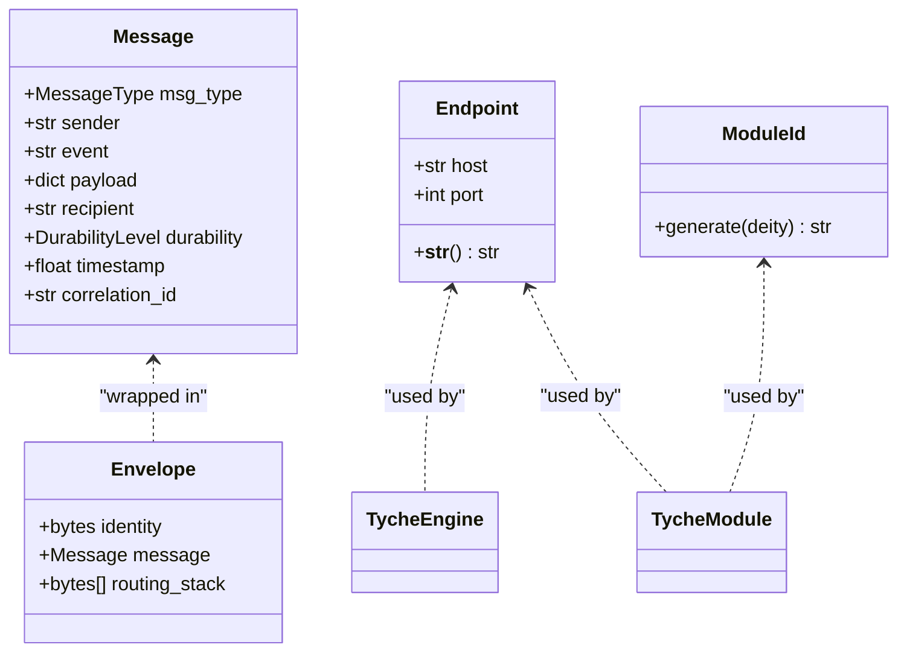
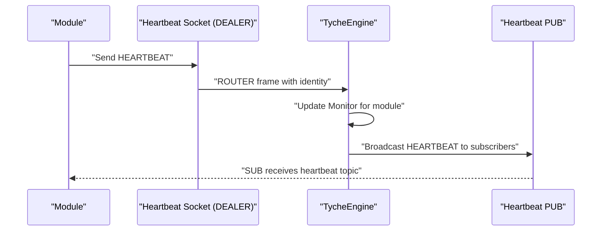
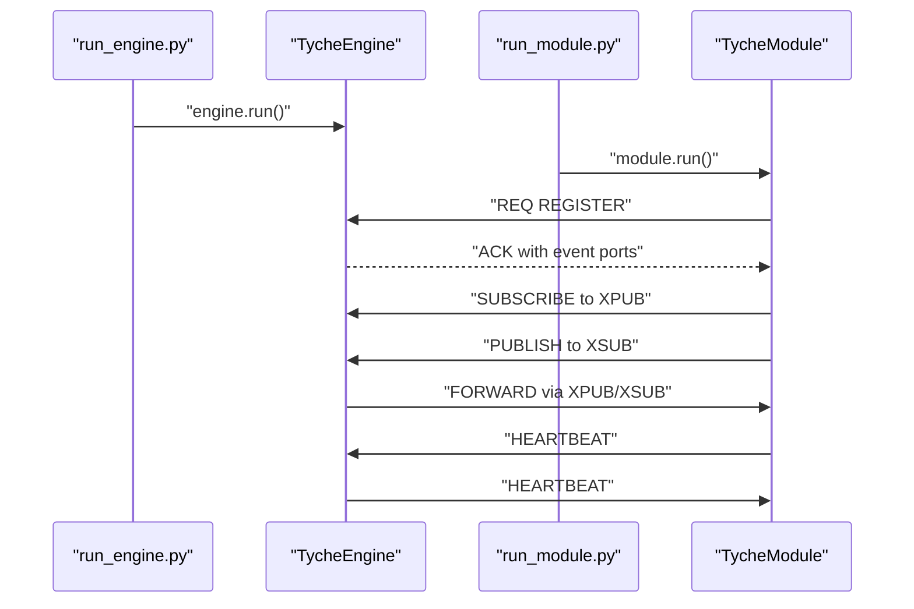
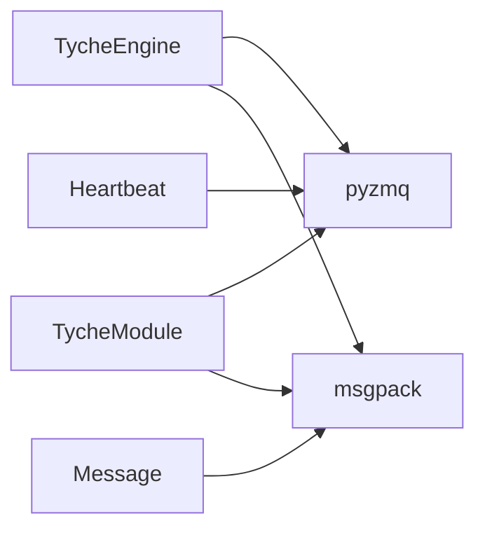

# Project Overview

**Referenced Files in This Document**
- [README.md](file://README.md)
- [__init__.py](file://src/tyche/__init__.py)
- [engine.py](file://src/tyche/engine.py)
- [module.py](file://src/tyche/module.py)
- [module_base.py](file://src/tyche/module_base.py)
- [message.py](file://src/tyche/message.py)
- [types.py](file://src/tyche/types.py)
- [heartbeat.py](file://src/tyche/heartbeat.py)
- [example_module.py](file://src/tyche/example_module.py)
- [run_engine.py](file://examples/run_engine.py)
- [run_module.py](file://examples/run_module.py)
- [tyche_engine_design_v1.md](file://docs/design/tyche_engine_design_v1.md)
- [pyproject.toml](file://pyproject.toml)

## Table of Contents
1. [Introduction](#introduction)
2. [Project Structure](#project-structure)
3. [Core Components](#core-components)
4. [Architecture Overview](#architecture-overview)
5. [Detailed Component Analysis](#detailed-component-analysis)
6. [Dependency Analysis](#dependency-analysis)
7. [Performance Considerations](#performance-considerations)
8. [Troubleshooting Guide](#troubleshooting-guide)
9. [Conclusion](#conclusion)
10. [Appendices](#appendices)

## Introduction
Tyche Engine is a high-performance distributed event-driven framework built on ZeroMQ for orchestrating multi-process applications. It enables teams to compose complex systems from loosely coupled modules that communicate asynchronously via standardized event patterns. The framework emphasizes:
- Event-driven orchestration with multiple delivery semantics
- Reliable module lifecycle management and health monitoring
- Async persistence to maintain low-latency hot paths while supporting production-grade durability
- Practical operating modes for live trading, backtesting, and research

Tyche Engine positions itself as a pragmatic alternative to monolithic architectures and heavyweight middleware, offering predictable performance, clear operational semantics, and straightforward scaling patterns.

## Project Structure
At a high level, the repository is organized into:
- Core framework: engine, module base, messaging, types, and heartbeat management
- Examples: runnable demonstrations of engine and module processes
- Documentation: design specifications and implementation notes
- Tests: unit, integration, and property-based coverage

**Diagram sources**
- [engine.py:25-350](file://src/tyche/engine.py#L25-L350)
- [module.py:28-401](file://src/tyche/module.py#L28-L401)
- [module_base.py:10-120](file://src/tyche/module_base.py#L10-L120)
- [message.py:13-168](file://src/tyche/message.py#L13-L168)
- [types.py:14-102](file://src/tyche/types.py#L14-L102)
- [heartbeat.py:16-142](file://src/tyche/heartbeat.py#L16-L142)
- [example_module.py:19-167](file://src/tyche/example_module.py#L19-L167)
- [run_engine.py:21-54](file://examples/run_engine.py#L21-L54)
- [run_module.py:22-51](file://examples/run_module.py#L22-L51)
- [tyche_engine_design_v1.md:1-126](file://docs/design/tyche_engine_design_v1.md#L1-L126)
- [README.md:18-348](file://README.md#L18-L348)
- [pyproject.toml:1-63](file://pyproject.toml#L1-L63)

**Section sources**
- [README.md:18-348](file://README.md#L18-L348)
- [pyproject.toml:5-13](file://pyproject.toml#L5-L13)

## Core Components
- TycheEngine: Central broker that manages module registration, event routing, and heartbeat monitoring. It runs as a standalone process and coordinates inter-module communication.
- TycheModule: Base class for user-defined modules. Handles registration, event subscription, handler dispatch, and heartbeat signaling.
- ModuleBase: Abstract base defining interface discovery and event routing conventions.
- Message and Envelope: Typed message model with MessagePack serialization and ZeroMQ multipart framing.
- Types: Core enums and dataclasses for endpoints, interface patterns, durability levels, and module identifiers.
- Heartbeat: Implements Paranoid Pirate pattern for reliable peer liveness tracking.

Key benefits:
- Predictable latency via ZeroMQ socket patterns and async persistence
- Clear separation of concerns between hot-path event handling and background persistence
- Human-friendly module naming and standardized interface patterns
- Operational simplicity with explicit endpoints and lifecycle states

**Section sources**
- [engine.py:25-350](file://src/tyche/engine.py#L25-L350)
- [module.py:28-401](file://src/tyche/module.py#L28-L401)
- [module_base.py:10-120](file://src/tyche/module_base.py#L10-L120)
- [message.py:13-168](file://src/tyche/message.py#L13-L168)
- [types.py:14-102](file://src/tyche/types.py#L14-L102)
- [heartbeat.py:16-142](file://src/tyche/heartbeat.py#L16-L142)

## Architecture Overview
Tyche Engine’s architecture is event-centric and transport-agnostic, leveraging ZeroMQ socket patterns to implement:
- Registration: REQ/ROUTER for handshake and interface discovery
- Event distribution: XPUB/XSUB proxy for pub-sub broadcasting
- Load balancing: PUSH/PULL for fair distribution across workers
- Direct P2P: DEALER/ROUTER for module-to-module whisper messaging
- Heartbeat: PUB/SUB with Paranoid Pirate pattern for liveness monitoring
- ACK responses: ROUTER/DEALER for asynchronous confirmations

**Diagram sources**
- [engine.py:119-177](file://src/tyche/engine.py#L119-L177)
- [engine.py:238-278](file://src/tyche/engine.py#L238-L278)
- [engine.py:281-349](file://src/tyche/engine.py#L281-L349)
- [module.py:200-254](file://src/tyche/module.py#L200-L254)
- [module.py:265-298](file://src/tyche/module.py#L265-L298)
- [module.py:376-401](file://src/tyche/module.py#L376-L401)

**Section sources**
- [README.md:24-103](file://README.md#L24-L103)
- [engine.py:25-118](file://src/tyche/engine.py#L25-L118)
- [module.py:28-111](file://src/tyche/module.py#L28-L111)

## Detailed Component Analysis

### TycheEngine: Central Broker
Responsibilities:
- Registration: Validates module interfaces and assigns runtime ports for event channels
- Event routing: Runs XPUB/XSUB proxy to distribute events to subscribers
- Heartbeat: Sends and receives heartbeats to monitor module liveness
- Lifecycle: Unregisters expired modules and cleans up resources

**Diagram sources**
- [engine.py:25-350](file://src/tyche/engine.py#L25-L350)
- [heartbeat.py:91-142](file://src/tyche/heartbeat.py#L91-L142)

**Section sources**
- [engine.py:25-118](file://src/tyche/engine.py#L25-L118)
- [engine.py:119-177](file://src/tyche/engine.py#L119-L177)
- [engine.py:238-278](file://src/tyche/engine.py#L238-L278)
- [engine.py:281-349](file://src/tyche/engine.py#L281-L349)

### TycheModule: Module Runtime
Responsibilities:
- Registration handshake via REQ socket
- Event publishing to engine’s XSUB and subscribing to engine’s XPUB
- Handler dispatch based on event names
- Heartbeat transmission to engine
- Request-response via temporary REQ sockets for ACK patterns

**Diagram sources**
- [module_base.py:10-120](file://src/tyche/module_base.py#L10-L120)
- [module.py:28-401](file://src/tyche/module.py#L28-L401)

**Section sources**
- [module.py:28-111](file://src/tyche/module.py#L28-L111)
- [module.py:116-197](file://src/tyche/module.py#L116-L197)
- [module.py:200-254](file://src/tyche/module.py#L200-L254)
- [module.py:265-298](file://src/tyche/module.py#L265-L298)
- [module.py:301-373](file://src/tyche/module.py#L301-L373)
- [module.py:376-401](file://src/tyche/module.py#L376-L401)

### Message and Types
- Message: Typed envelope carrying sender, event, payload, optional recipient, durability, timestamp, and correlation ID
- Envelope: ZeroMQ multipart framing with identity and routing stack
- Types: Endpoint, Interface, ModuleInfo, DurabilityLevel, MessageType, InterfacePattern, ModuleId

**Diagram sources**
- [message.py:13-112](file://src/tyche/message.py#L13-L112)
- [message.py:114-168](file://src/tyche/message.py#L114-L168)
- [types.py:76-102](file://src/tyche/types.py#L76-L102)
- [types.py:14-39](file://src/tyche/types.py#L14-L39)

**Section sources**
- [message.py:13-112](file://src/tyche/message.py#L13-L112)
- [message.py:114-168](file://src/tyche/message.py#L114-L168)
- [types.py:14-102](file://src/tyche/types.py#L14-L102)

### Heartbeat and Reliability
- Paranoid Pirate pattern: Modules send periodic heartbeats; Engine tracks liveness and expires stalled peers
- Grace period for initial registration; configurable intervals and liveness thresholds

**Diagram sources**
- [heartbeat.py:16-142](file://src/tyche/heartbeat.py#L16-L142)
- [engine.py:281-349](file://src/tyche/engine.py#L281-L349)
- [module.py:376-401](file://src/tyche/module.py#L376-L401)

**Section sources**
- [heartbeat.py:16-142](file://src/tyche/heartbeat.py#L16-L142)
- [engine.py:281-349](file://src/tyche/engine.py#L281-L349)
- [module.py:376-401](file://src/tyche/module.py#L376-L401)

### Practical Examples
- Start an engine process and connect a module process to demonstrate registration, event publishing, and heartbeat exchange
- ExampleModule showcases all interface patterns: on_{event}, ack_{event}, whisper_{target}_{event}, on_common_{event}

**Diagram sources**
- [run_engine.py:21-54](file://examples/run_engine.py#L21-L54)
- [run_module.py:22-51](file://examples/run_module.py#L22-L51)
- [engine.py:119-177](file://src/tyche/engine.py#L119-L177)
- [module.py:200-254](file://src/tyche/module.py#L200-L254)

**Section sources**
- [run_engine.py:21-54](file://examples/run_engine.py#L21-L54)
- [run_module.py:22-51](file://examples/run_module.py#L22-L51)
- [example_module.py:19-167](file://src/tyche/example_module.py#L19-L167)

## Dependency Analysis
External dependencies:
- pyzmq: ZeroMQ bindings for Python
- msgpack: Efficient binary serialization

**Diagram sources**
- [pyproject.toml:10-13](file://pyproject.toml#L10-L13)
- [engine.py:8-20](file://src/tyche/engine.py#L8-L20)
- [module.py:11-23](file://src/tyche/module.py#L11-L23)
- [message.py:8-10](file://src/tyche/message.py#L8-L10)

**Section sources**
- [pyproject.toml:10-13](file://pyproject.toml#L10-L13)

## Performance Considerations
Target characteristics (from documentation):
- Hot path latency: sub-millisecond
- Persistence latency: amortized ~100 ms via batching
- Recovery time: under 1 second from WAL checkpoint
- Backtest throughput: >100K events/second

Scalability levers:
- Shard by event type across Engine instances
- Increase HWM for PUSH sockets to absorb bursty workloads
- Use geographic distribution with inter-region gossip
- For strict ordering, partition by key to a single worker
- For exactly-once semantics, implement idempotency plus async WAL

Operational modes:
- Live trading: async persistence to WAL for crash recovery
- Backtesting: deterministic replay through the same engine code path
- Research: rich metadata capture with scalable export formats

**Section sources**
- [README.md:197-205](file://README.md#L197-L205)
- [README.md:159-187](file://README.md#L159-L187)
- [README.md:329-339](file://README.md#L329-L339)

## Troubleshooting Guide
Common scenarios and guidance:
- Registration timeouts: verify endpoints and network connectivity; check engine logs for deserialization errors
- Slow or missing heartbeats: inspect module-side heartbeat intervals and network partitions; confirm engine monitor expiration logic
- Event drops: for on_common_ and broadcast_, ensure subscribers can keep up or implement back-pressure handling
- Persistence lag: adjust backpressure policy (drop oldest, block and alert, expand buffer); monitor disk I/O and WAL throughput
- Multi-instance failover: configure Binary Star pattern and shared configuration; validate lazy pirate retry on clients

**Section sources**
- [engine.py:119-177](file://src/tyche/engine.py#L119-L177)
- [engine.py:281-349](file://src/tyche/engine.py#L281-L349)
- [module.py:200-254](file://src/tyche/module.py#L200-L254)
- [module.py:376-401](file://src/tyche/module.py#L376-L401)
- [README.md:290-299](file://README.md#L290-L299)

## Conclusion
Tyche Engine delivers a focused, high-performance foundation for distributed event-driven systems. By combining ZeroMQ’s socket patterns with a clean module abstraction, it achieves low-latency hot paths, robust reliability, and practical operational modes spanning live trading, backtesting, and research. Its design favors explicitness, modularity, and incremental scaling, enabling teams to build resilient, observable systems that evolve with their needs.

## Appendices

### Positioning in the Distributed Systems Ecosystem
Tyche Engine sits between pure synchronous frameworks and heavy-weight service meshes:
- Lower overhead than traditional microservices stacks
- Higher reliability than naive pub-sub setups
- Clear operational boundaries via explicit endpoints and lifecycle states

**Section sources**
- [README.md:300-321](file://README.md#L300-L321)

### Target Use Cases and Advantages
Use cases:
- Live trading: ultra-low-latency event processing with async persistence
- Backtesting: deterministic replay with identical engine path
- Research: comprehensive event capture and scalable export formats

Advantages over traditional approaches:
- Predictable latency via ZeroMQ and lock-free buffering
- Idempotent ACK handling and whisper messaging for critical flows
- Human-readable module naming and standardized interface patterns
- Built-in heartbeat and failure detection with graceful degradation

**Section sources**
- [README.md:45-103](file://README.md#L45-L103)
- [README.md:197-205](file://README.md#L197-L205)
- [README.md:300-321](file://README.md#L300-L321)