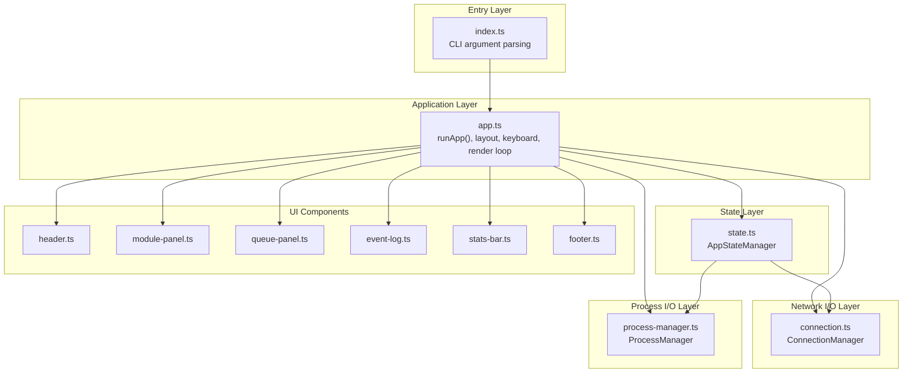
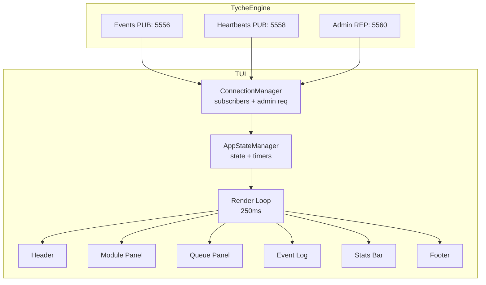
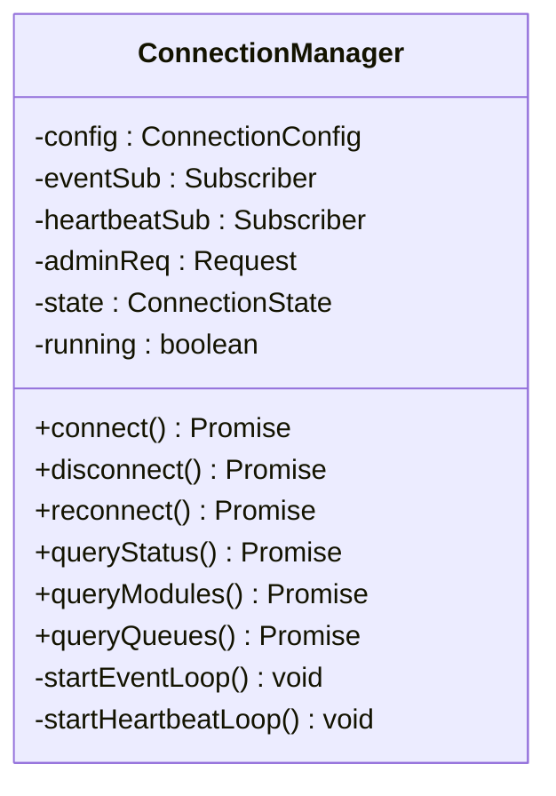
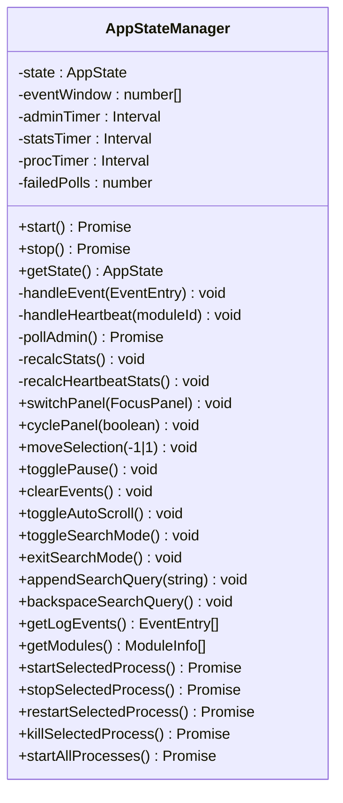
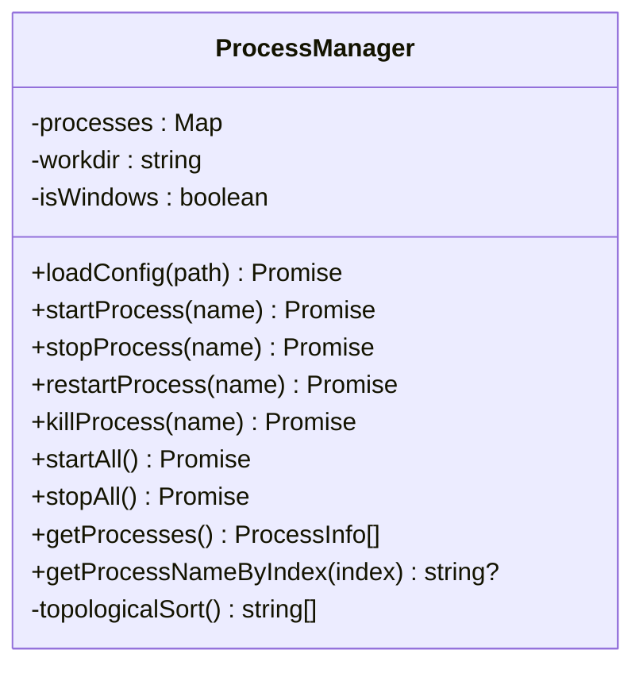
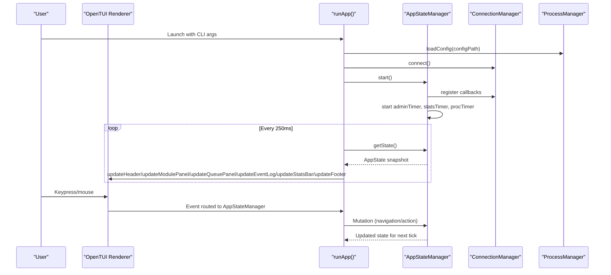
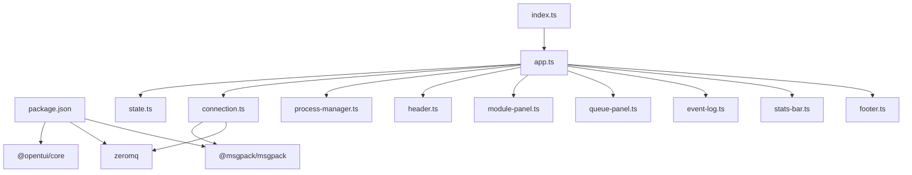

# TUI Integration

<cite>
**Referenced Files in This Document**
- [README.md](file://tui/README.md)
- [package.json](file://tui/package.json)
- [index.ts](file://tui/index.ts)
- [app.ts](file://tui/src/app.ts)
- [connection.ts](file://tui/src/connection.ts)
- [state.ts](file://tui/src/state.ts)
- [types.ts](file://tui/src/types.ts)
- [process-manager.ts](file://tui/src/process-manager.ts)
- [header.ts](file://tui/src/components/header.ts)
- [module-panel.ts](file://tui/src/components/module-panel.ts)
- [queue-panel.ts](file://tui/src/components/queue-panel.ts)
- [event-log.ts](file://tui/src/components/event-log.ts)
- [stats-bar.ts](file://tui/src/components/stats-bar.ts)
- [footer.ts](file://tui/src/components/footer.ts)
- [ARCHITECTURE.md](file://tui/.planning/codebase/ARCHITECTURE.md)
- [INTEGRATIONS.md](file://tui/.planning/codebase/INTEGRATIONS.md)
</cite>

## Table of Contents
1. [Introduction](#introduction)
2. [Project Structure](#project-structure)
3. [Core Components](#core-components)
4. [Architecture Overview](#architecture-overview)
5. [Detailed Component Analysis](#detailed-component-analysis)
6. [Dependency Analysis](#dependency-analysis)
7. [Performance Considerations](#performance-considerations)
8. [Troubleshooting Guide](#troubleshooting-guide)
9. [Conclusion](#conclusion)

## Introduction
This document describes the TUI (Text-based User Interface) integration for TycheEngine, a terminal dashboard built with OpenTUI that monitors real-time event streams, module health, and message queues from the engine. It also manages local child processes defined in a configuration file, enabling process lifecycle control directly from the terminal UI.

The TUI connects to TycheEngine via three ZeroMQ sockets (events, heartbeats, and admin requests) and renders a responsive layout with keyboard and mouse interactions. It supports filtering and searching of event logs, live statistics, and optional local process orchestration.

## Project Structure
The TUI is organized into distinct layers with clear separation of concerns:
- Entry and CLI: Parses command-line arguments and starts the application
- Application orchestration: Builds the UI layout, handles input, and drives the render loop
- State management: Centralized mutable state with timers for admin polling and stats
- Network I/O: ZeroMQ subscribers and requestor for engine telemetry
- Process I/O: Optional local process manager using Bun.spawn
- UI components: Stateless render functions backed by OpenTUI primitives

**Diagram sources**
- [index.ts:1-51](file://tui/index.ts#L1-L51)
- [app.ts:1-283](file://tui/src/app.ts#L1-L283)
- [state.ts:1-333](file://tui/src/state.ts#L1-L333)
- [connection.ts:1-271](file://tui/src/connection.ts#L1-L271)
- [process-manager.ts:1-229](file://tui/src/process-manager.ts#L1-L229)
- [header.ts:1-78](file://tui/src/components/header.ts#L1-L78)
- [module-panel.ts:1-111](file://tui/src/components/module-panel.ts#L1-L111)
- [queue-panel.ts:1-124](file://tui/src/components/queue-panel.ts#L1-L124)
- [event-log.ts:1-156](file://tui/src/components/event-log.ts#L1-L156)
- [stats-bar.ts:1-45](file://tui/src/components/stats-bar.ts#L1-L45)
- [footer.ts:1-47](file://tui/src/components/footer.ts#L1-L47)

**Section sources**
- [README.md:1-81](file://tui/README.md#L1-L81)
- [package.json:1-24](file://tui/package.json#L1-L24)
- [index.ts:1-51](file://tui/index.ts#L1-L51)
- [app.ts:1-283](file://tui/src/app.ts#L1-L283)

## Core Components
This section outlines the primary building blocks of the TUI integration and their responsibilities.

- ConnectionManager (network I/O): Manages ZeroMQ subscribers for events and heartbeats, and a requestor for admin queries. Handles connection state transitions, message decoding, and loop lifecycles.
- AppStateManager (state management): Owns all mutable application state, polls admin endpoints, maintains event and heartbeat statistics, and coordinates UI navigation and actions.
- ProcessManager (process I/O): Loads a process configuration file and controls child processes with dependency-aware ordering and platform-specific termination.
- UI Components: Stateless render functions that update OpenTUI renderables based on state snapshots.

**Section sources**
- [connection.ts:19-271](file://tui/src/connection.ts#L19-L271)
- [state.ts:24-333](file://tui/src/state.ts#L24-L333)
- [process-manager.ts:19-229](file://tui/src/process-manager.ts#L19-L229)
- [header.ts:8-78](file://tui/src/components/header.ts#L8-L78)
- [module-panel.ts:9-111](file://tui/src/components/module-panel.ts#L9-L111)
- [queue-panel.ts:8-124](file://tui/src/components/queue-panel.ts#L8-L124)
- [event-log.ts:8-156](file://tui/src/components/event-log.ts#L8-L156)
- [stats-bar.ts:8-45](file://tui/src/components/stats-bar.ts#L8-L45)
- [footer.ts:8-47](file://tui/src/components/footer.ts#L8-L47)

## Architecture Overview
The TUI follows a layered, event-driven architecture with a central state manager as the single source of truth. Data flows unidirectionally: inbound engine events and heartbeats are decoded and ingested, admin queries refresh module and engine status, and the render loop updates the UI.

**Diagram sources**
- [connection.ts:68-92](file://tui/src/connection.ts#L68-L92)
- [state.ts:58-79](file://tui/src/state.ts#L58-L79)
- [app.ts:201-206](file://tui/src/app.ts#L201-L206)
- [header.ts:33-78](file://tui/src/components/header.ts#L33-L78)
- [module-panel.ts:29-111](file://tui/src/components/module-panel.ts#L29-L111)
- [queue-panel.ts:53-124](file://tui/src/components/queue-panel.ts#L53-L124)
- [event-log.ts:52-156](file://tui/src/components/event-log.ts#L52-L156)
- [stats-bar.ts:14-45](file://tui/src/components/stats-bar.ts#L14-L45)
- [footer.ts:13-47](file://tui/src/components/footer.ts#L13-L47)

**Section sources**
- [ARCHITECTURE.md:16-74](file://tui/.planning/codebase/ARCHITECTURE.md#L16-L74)
- [INTEGRATIONS.md:5-164](file://tui/.planning/codebase/INTEGRATIONS.md#L5-L164)

## Detailed Component Analysis

### ConnectionManager
Responsibilities:
- Establishes ZeroMQ connections for events, heartbeats, and admin requests
- Decodes MessagePack payloads and normalizes them into typed structures
- Maintains connection state and exposes callbacks for UI updates
- Provides admin query methods for status, modules, and queues

Key behaviors:
- Event loop decodes incoming events and classifies event types based on name prefixes
- Heartbeat loop updates module last-seen timestamps for health tracking
- Admin polling retrieves engine status and module registry on intervals
- Reconnection logic transitions through connecting/reconnecting states

**Diagram sources**
- [connection.ts:19-271](file://tui/src/connection.ts#L19-L271)

**Section sources**
- [connection.ts:68-92](file://tui/src/connection.ts#L68-L92)
- [connection.ts:107-130](file://tui/src/connection.ts#L107-L130)
- [connection.ts:132-165](file://tui/src/connection.ts#L132-L165)
- [connection.ts:167-211](file://tui/src/connection.ts#L167-L211)
- [connection.ts:213-269](file://tui/src/connection.ts#L213-L269)

### AppStateManager
Responsibilities:
- Central state container with timers for admin polling, stats recalculation, and process synchronization
- Navigation and selection state for panels and items
- Filtering and search logic for the event log
- Process lifecycle actions delegated to ProcessManager

Key behaviors:
- Admin polling aggregates engine status, modules, and queues
- Event ingestion maintains a capped circular buffer and computes event rates
- Heartbeat statistics derive module health from liveness scores
- Search mode filters events by event name, sender, recipient, and payload text

**Diagram sources**
- [state.ts:24-333](file://tui/src/state.ts#L24-L333)

**Section sources**
- [state.ts:58-79](file://tui/src/state.ts#L58-L79)
- [state.ts:102-108](file://tui/src/state.ts#L102-L108)
- [state.ts:115-154](file://tui/src/state.ts#L115-L154)
- [state.ts:156-176](file://tui/src/state.ts#L156-L176)
- [state.ts:180-214](file://tui/src/state.ts#L180-L214)
- [state.ts:256-271](file://tui/src/state.ts#L256-L271)
- [state.ts:275-297](file://tui/src/state.ts#L275-L297)
- [state.ts:305-332](file://tui/src/state.ts#L305-L332)

### ProcessManager
Responsibilities:
- Loads process configurations from a JSON file
- Starts/stops/restarts/kills child processes with dependency-aware ordering
- Tracks process states and exit codes
- Provides platform-specific termination strategies

Key behaviors:
- Topological sorting ensures dependencies start before dependents
- Graceful termination with fallback signals across platforms
- Auto-start behavior controlled by configuration flags

**Diagram sources**
- [process-manager.ts:19-229](file://tui/src/process-manager.ts#L19-L229)

**Section sources**
- [process-manager.ts:24-40](file://tui/src/process-manager.ts#L24-L40)
- [process-manager.ts:42-89](file://tui/src/process-manager.ts#L42-L89)
- [process-manager.ts:91-122](file://tui/src/process-manager.ts#L91-L122)
- [process-manager.ts:124-137](file://tui/src/process-manager.ts#L124-L137)
- [process-manager.ts:139-164](file://tui/src/process-manager.ts#L139-L164)
- [process-manager.ts:166-186](file://tui/src/process-manager.ts#L166-L186)
- [process-manager.ts:188-201](file://tui/src/process-manager.ts#L188-L201)
- [process-manager.ts:211-227](file://tui/src/process-manager.ts#L211-L227)

### UI Components
Responsibilities:
- Header: Displays connection status, module count, queue count, pending heartbeat queue size, and formatted uptime
- Module Panel: Lists modules with health indicators and selection highlighting
- Queue Panel: Shows per-event-type queue metrics with capacity bars and counters
- Event Log: Renders colored event entries with type labels, timestamps, and payload previews; supports scrolling and search mode
- Stats Bar: Shows events per second and heartbeat health distribution
- Footer: Provides context-aware keybinding hints

```mermaid
classDiagram
class Header {
+createHeader(renderer) HeaderRefs
+updateHeader(refs, connection, engineStatus, queueCount) void
}
class ModulePanel {
+createModulePanel(renderer) ModulePanelRefs
+updateModulePanel(renderer, refs, modules, selectedIndex, isFocused, onSelect?) void
}
class QueuePanel {
+createQueuePanel(renderer) QueuePanelRefs
+updateQueuePanel(renderer, refs, queues) void
}
class EventLog {
+createEventLog(renderer) EventLogRefs
+updateEventLog(renderer, refs, events, isFocused, scrollOffset, searchMode, searchQuery, onScroll?) void
}
class StatsBar {
+createStatsBar(renderer) StatsRefs
+updateStatsBar(refs, stats) void
}
class Footer {
+createFooter(renderer) FooterRefs
+updateFooter(refs, focusPanel, searchMode) void
}
```

**Diagram sources**
- [header.ts:33-78](file://tui/src/components/header.ts#L33-L78)
- [module-panel.ts:29-111](file://tui/src/components/module-panel.ts#L29-L111)
- [queue-panel.ts:53-124](file://tui/src/components/queue-panel.ts#L53-L124)
- [event-log.ts:52-156](file://tui/src/components/event-log.ts#L52-L156)
- [stats-bar.ts:14-45](file://tui/src/components/stats-bar.ts#L14-L45)
- [footer.ts:13-47](file://tui/src/components/footer.ts#L13-L47)

**Section sources**
- [header.ts:21-31](file://tui/src/components/header.ts#L21-L31)
- [module-panel.ts:15-27](file://tui/src/components/module-panel.ts#L15-L27)
- [queue-panel.ts:24-44](file://tui/src/components/queue-panel.ts#L24-L44)
- [event-log.ts:33-50](file://tui/src/components/event-log.ts#L33-L50)
- [stats-bar.ts:40-44](file://tui/src/components/stats-bar.ts#L40-L44)
- [footer.ts:33-46](file://tui/src/components/footer.ts#L33-L46)

### Application Orchestration (runApp)
Responsibilities:
- Initializes managers, renderer, and layout
- Wires keyboard input, mouse interactions, and render loop
- Updates all components from state snapshots
- Handles shutdown and signal cleanup

Key behaviors:
- Alternate screen mode with target/max FPS and dark theme
- Mouse clicks switch focus between panels
- Keyboard shortcuts route to AppStateManager mutations
- Render loop runs at 250ms intervals

**Diagram sources**
- [app.ts:41-231](file://tui/src/app.ts#L41-L231)
- [state.ts:58-79](file://tui/src/state.ts#L58-L79)
- [connection.ts:68-92](file://tui/src/connection.ts#L68-L92)
- [process-manager.ts:24-40](file://tui/src/process-manager.ts#L24-L40)

**Section sources**
- [app.ts:54-62](file://tui/src/app.ts#L54-L62)
- [app.ts:64-87](file://tui/src/app.ts#L64-L87)
- [app.ts:95-128](file://tui/src/app.ts#L95-L128)
- [app.ts:131-199](file://tui/src/app.ts#L131-L199)
- [app.ts:202-206](file://tui/src/app.ts#L202-L206)
- [app.ts:225-231](file://tui/src/app.ts#L225-L231)

## Dependency Analysis
The TUI integrates with external libraries and the TycheEngine via ZeroMQ. Dependencies are declared in the package manifest and used across layers.

**Diagram sources**
- [package.json:18-22](file://tui/package.json#L18-L22)
- [index.ts:9](file://tui/index.ts#L9)
- [app.ts:4-24](file://tui/src/app.ts#L4-L24)
- [connection.ts:4-5](file://tui/src/connection.ts#L4-L5)

**Section sources**
- [package.json:1-24](file://tui/package.json#L1-L24)
- [index.ts:13-40](file://tui/index.ts#L13-L40)

## Performance Considerations
- Render loop cadence: The UI targets 10 FPS with a maximum of 30 FPS, updating every 250 ms. This keeps CPU usage low while maintaining smooth interactivity.
- Event buffering: The event log maintains a capped buffer of 500 entries to prevent memory growth under heavy load.
- Admin polling interval: Admin queries run every 3 seconds to balance freshness with network overhead.
- Stats calculation: Event rate is computed over a 5-second window to provide stable throughput metrics.
- Rendering efficiency: Components clear and rebuild content each tick; this is acceptable given the alternate screen mode and modest data volumes typical in terminal UIs.

[No sources needed since this section provides general guidance]

## Troubleshooting Guide
Common issues and remedies:
- Engine connectivity problems:
  - Symptoms: Disconnected state, no events, empty module/queue lists
  - Causes: Engine not running, wrong ports, firewall blocking
  - Actions: Verify engine is listening on the configured ports, adjust CLI options, check network connectivity
- Malformed messages:
  - Symptoms: Decoder warnings or ignored events/heartbeats
  - Cause: Unexpected payload shape or encoding issues
  - Actions: Ensure engine sends properly encoded MessagePack payloads
- Admin query timeouts:
  - Symptoms: Null responses for status/modules
  - Cause: Slow engine or network latency
  - Actions: Retry after engine stabilizes; monitor admin port accessibility
- Process management failures:
  - Symptoms: Processes stuck in STARTING/STOPPING or CRASHED states
  - Cause: Missing executables, invalid commands, permission issues
  - Actions: Validate process config, check executable paths and permissions, confirm dependency ordering
- Search mode behavior:
  - Symptoms: Search not filtering or query not clearing
  - Cause: Incorrect key bindings or focus panel mismatch
  - Actions: Press "/" to enter search mode in the event log, use Esc to exit, backspace to edit query

**Section sources**
- [connection.ts:88-91](file://tui/src/connection.ts#L88-L91)
- [connection.ts:117-130](file://tui/src/connection.ts#L117-L130)
- [state.ts:144-151](file://tui/src/state.ts#L144-L151)
- [process-manager.ts:42-89](file://tui/src/process-manager.ts#L42-L89)
- [footer.ts:34-46](file://tui/src/components/footer.ts#L34-L46)

## Conclusion
The TUI integration provides a robust, keyboard-first terminal interface for monitoring and interacting with TycheEngine. Its layered architecture cleanly separates concerns, enabling maintainability and extensibility. With real-time event streaming, health monitoring, and optional process management, it serves as a practical operational dashboard for development, testing, and production environments.

[No sources needed since this section summarizes without analyzing specific files]