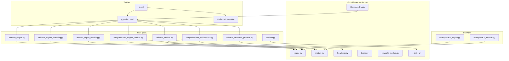
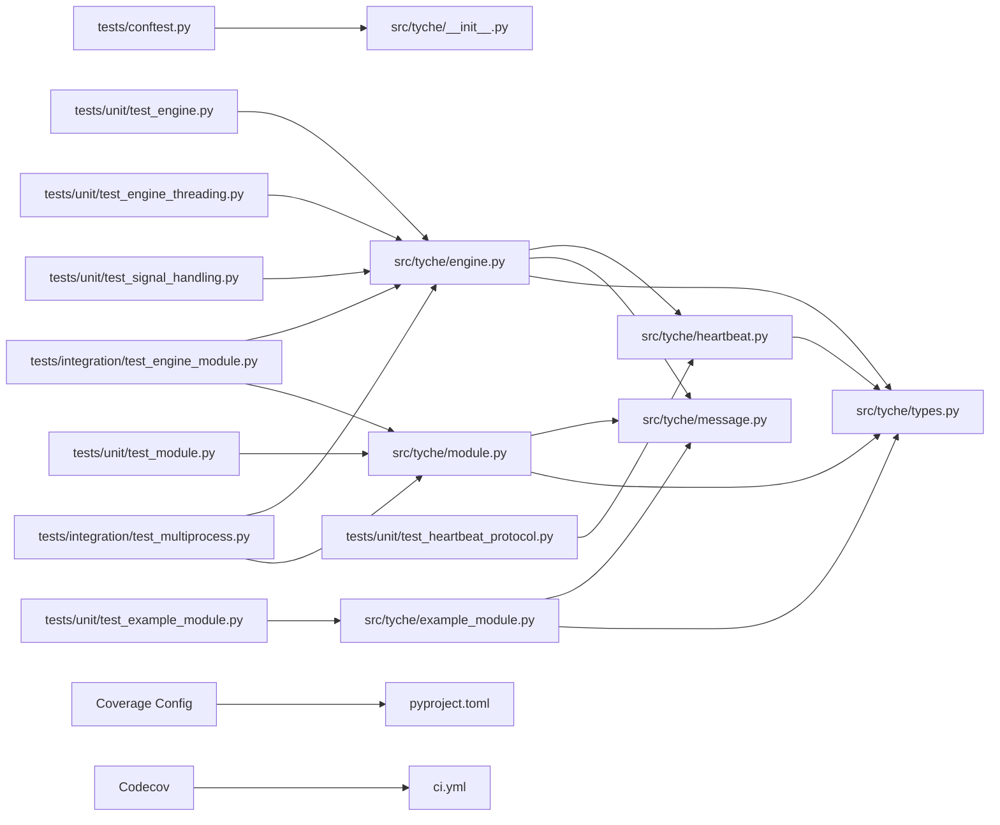
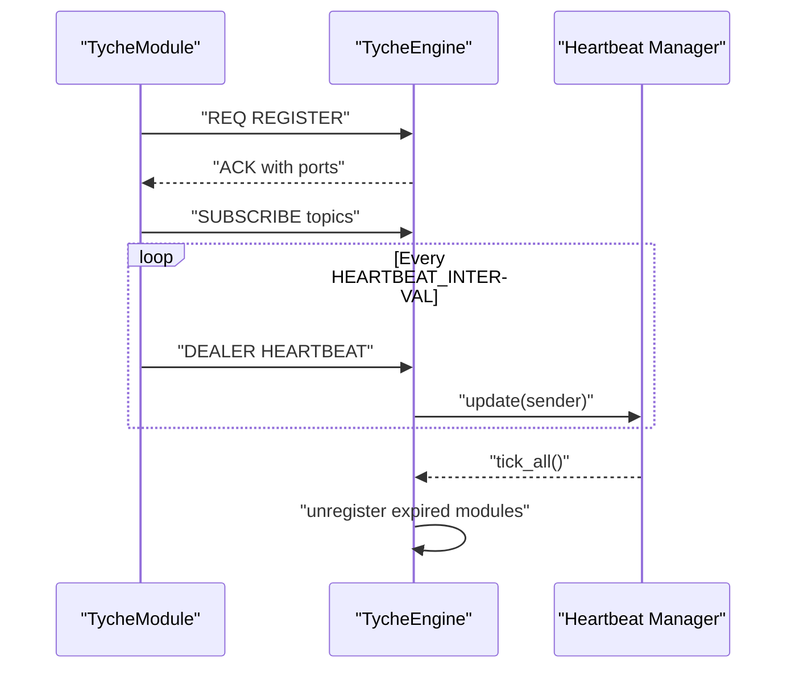

# Testing and Development

<cite>
**Referenced Files in This Document**
- [README.md](file://README.md)
- [pyproject.toml](file://pyproject.toml)
- [.github/workflows/ci.yml](file://.github/workflows/ci.yml)
- [tests/conftest.py](file://tests/conftest.py)
- [src/tyche/__init__.py](file://src/tyche/__init__.py)
- [src/tyche/engine.py](file://src/tyche/engine.py)
- [src/tyche/module.py](file://src/tyche/module.py)
- [src/tyche/types.py](file://src/tyche/types.py)
- [src/tyche/message.py](file://src/tyche/message.py)
- [src/tyche/heartbeat.py](file://src/tyche/heartbeat.py)
- [src/tyche/example_module.py](file://src/tyche/example_module.py)
- [examples/run_engine.py](file://examples/run_engine.py)
- [examples/run_module.py](file://examples/run_module.py)
- [tests/unit/test_engine.py](file://tests/unit/test_engine.py)
- [tests/unit/test_engine_main.py](file://tests/unit/test_engine_main.py)
- [tests/unit/test_engine_threading.py](file://tests/unit/test_engine_threading.py)
- [tests/unit/test_example_module.py](file://tests/unit/test_example_module.py)
- [tests/unit/test_heartbeat.py](file://tests/unit/test_heartbeat.py)
- [tests/unit/test_heartbeat_protocol.py](file://tests/unit/test_heartbeat_protocol.py)
- [tests/unit/test_message.py](file://tests/unit/test_message.py)
- [tests/unit/test_module.py](file://tests/unit/test_module.py)
- [tests/unit/test_module_base.py](file://tests/unit/test_module_base.py)
- [tests/unit/test_module_main.py](file://tests/unit/test_module_main.py)
- [tests/unit/test_signal_handling.py](file://tests/unit/test_signal_handling.py)
- [tests/unit/test_types.py](file://tests/unit/test_types.py)
- [tests/integration/test_engine_module.py](file://tests/integration/test_engine_module.py)
- [tests/integration/test_multiprocess.py](file://tests/integration/test_multiprocess.py)
- [CLAUDE.md](file://CLAUDE.md)
</cite>

## Update Summary
**Changes Made**
- Enhanced GitHub Actions CI workflow with comprehensive test coverage reporting functionality
- Added pytest coverage collection with --cov=src/tyche flag and XML/terminal report generation
- Integrated Codecov for coverage analysis and reporting
- Improved error handling for coverage analysis with fail_ci_if_error: false
- Updated coverage configuration in pyproject.toml with source filtering and exclusion rules
- Added coverage requirements and policies for maintaining code quality

## Table of Contents
1. [Introduction](#introduction)
2. [Project Structure](#project-structure)
3. [Core Components](#core-components)
4. [Architecture Overview](#architecture-overview)
5. [Detailed Component Analysis](#detailed-component-analysis)
6. [Coverage Reporting and Analysis](#coverage-reporting-and-analysis)
7. [Dependency Analysis](#dependency-analysis)
8. [Performance Considerations](#performance-considerations)
9. [Troubleshooting Guide](#troubleshooting-guide)
10. [Conclusion](#conclusion)
11. [Appendices](#appendices)

## Introduction
This document provides comprehensive testing and development guidelines for Tyche Engine. It covers the multi-layered testing strategy (unit, integration, and process-level tests), test structure and fixtures, mocking strategies for distributed components, development workflow, code quality standards, linting rules, and testing best practices. The testing infrastructure has been significantly enhanced with defensive programming approaches to prevent test instability, particularly around broadcast messaging patterns that could cause infinite loops in automated environments. The CI pipeline now includes comprehensive coverage reporting through Codecov integration.

## Project Structure
Tyche Engine follows a layered architecture with clear separation between core components and tests:
- Core library under src/tyche implementing the engine, modules, message handling, heartbeat, and types.
- Tests organized into unit, integration, and property test areas with comprehensive coverage.
- Examples demonstrating standalone engine and module usage.
- CI configured via GitHub Actions with enhanced coverage reporting.



**Diagram sources**
- [src/tyche/engine.py](file://src/tyche/engine.py)
- [src/tyche/module.py](file://src/tyche/module.py)
- [src/tyche/message.py](file://src/tyche/message.py)
- [src/tyche/heartbeat.py](file://src/tyche/heartbeat.py)
- [src/tyche/types.py](file://src/tyche/types.py)
- [src/tyche/example_module.py](file://src/tyche/example_module.py)
- [src/tyche/__init__.py](file://src/tyche/__init__.py)
- [tests/unit/test_engine.py](file://tests/unit/test_engine.py)
- [tests/unit/test_module.py](file://tests/unit/test_module.py)
- [tests/unit/test_engine_threading.py](file://tests/unit/test_engine_threading.py)
- [tests/unit/test_signal_handling.py](file://tests/unit/test_signal_handling.py)
- [tests/unit/test_heartbeat_protocol.py](file://tests/unit/test_heartbeat_protocol.py)
- [tests/integration/test_engine_module.py](file://tests/integration/test_engine_module.py)
- [tests/integration/test_multiprocess.py](file://tests/integration/test_multiprocess.py)
- [tests/conftest.py](file://tests/conftest.py)
- [examples/run_engine.py](file://examples/run_engine.py)
- [examples/run_module.py](file://examples/run_module.py)
- [pyproject.toml](file://pyproject.toml)
- [.github/workflows/ci.yml](file://.github/workflows/ci.yml)

**Section sources**
- [README.md](file://README.md)
- [pyproject.toml](file://pyproject.toml)
- [.github/workflows/ci.yml](file://.github/workflows/ci.yml)

## Core Components
This section outlines the core building blocks relevant to testing and development:
- Engine: Central broker managing registration, event proxy, and heartbeat monitoring.
- Module: Base class for modules connecting to the engine, registering interfaces, and handling events.
- Message: Serialization/deserialization using MessagePack with envelopes for ZeroMQ routing.
- Heartbeat: Implements Paranoid Pirate pattern for liveness monitoring with defensive programming.
- Types: Defines enums, dataclasses, and constants used across the system.
- Example Module: Demonstrates all interface patterns including ping-pong broadcast handling.

Key testing-relevant aspects:
- Engine exposes non-blocking start methods suitable for tests.
- Module supports non-blocking start and provides registration, subscription, and event dispatch mechanisms.
- MessagePack serialization enables deterministic payload handling in tests.
- Heartbeat constants and manager provide predictable timing for tests.
- Example Module implements defensive ping-pong patterns to prevent infinite loops.

**Section sources**
- [src/tyche/engine.py](file://src/tyche/engine.py)
- [src/tyche/module.py](file://src/tyche/module.py)
- [src/tyche/message.py](file://src/tyche/message.py)
- [src/tyche/heartbeat.py](file://src/tyche/heartbeat.py)
- [src/tyche/types.py](file://src/tyche/types.py)
- [src/tyche/example_module.py](file://src/tyche/example_module.py)

## Architecture Overview
Tyche Engine uses ZeroMQ for distributed messaging. The architecture supports:
- Module registration via ROUTER/REQ.
- Event broadcasting via XPUB/XSUB proxy.
- Load-balanced work via PUSH/PULL.
- Direct P2P whisper messaging via DEALER/ROUTER.
- Heartbeat monitoring via PUB/SUB and ROUTER/DEALER.

```mermaid
graph TB
subgraph "Engine"
R["Registration Worker<br/>ROUTER"]
EP["Event Proxy Worker<br/>XPUB/XSUB"]
HB["Heartbeat Worker<br/>PUB"]
HBR["Heartbeat Receive Worker<br/>ROUTER"]
MON["Monitor Worker"]
end
subgraph "Modules"
M1["TycheModule<br/>PUB/SUB/DEALER"]
M2["TycheModule<br/>PUB/SUB/DEALER"]
EM["ExampleModule<br/>Ping-Pong Broadcast"]
end
M1 -- "REQ (REGISTER)" --> R
R -- "ACK" --> M1
M1 -- "SUBSCRIBE" --> EP
EP -- "PUBLISH" --> M1
EP -- "PUBLISH" --> M2
HB -- "HEARTBEAT" --> M1
HB -- "HEARTBEAT" --> M2
HBR -- "HEARTBEAT" <-- M1
HBR -- "HEARTBEAT" <-- M2
MON -- "Expire Modules" --> R
EM -. "Defensive Ping-Pong<br/>Prevents Infinite Loops" .-> EP
```

**Diagram sources**
- [src/tyche/engine.py](file://src/tyche/engine.py)
- [src/tyche/module.py](file://src/tyche/module.py)
- [src/tyche/heartbeat.py](file://src/tyche/heartbeat.py)
- [src/tyche/example_module.py](file://src/tyche/example_module.py)

**Section sources**
- [README.md](file://README.md)
- [src/tyche/engine.py](file://src/tyche/engine.py)
- [src/tyche/module.py](file://src/tyche/module.py)
- [src/tyche/heartbeat.py](file://src/tyche/heartbeat.py)

## Detailed Component Analysis

### Unit Testing Strategy
Unit tests focus on isolated logic and deterministic behavior with comprehensive coverage:
- Test engine initialization and module registry operations.
- Validate module interface registration and handler mapping.
- Verify message serialization/deserialization and envelope handling.
- Confirm heartbeat constants and manager behavior with defensive programming.
- Test threading safety and concurrent operation testing.
- Test signal handling and graceful shutdown verification.
- Validate heartbeat protocol compliance and expiration logic with stability safeguards.

Recommended patterns:
- Use mocks for external dependencies (e.g., ZeroMQ sockets) to isolate logic.
- Prefer deterministic inputs (fixed ports, predefined module IDs).
- Assert thread-safety where applicable using locks and state checks.
- Leverage pytest markers for slow and timeout-sensitive tests.
- **Updated**: Implement defensive programming in heartbeat tests to prevent infinite loops.

**Section sources**
- [tests/unit/test_engine.py](file://tests/unit/test_engine.py)
- [tests/unit/test_engine_main.py](file://tests/unit/test_engine_main.py)
- [tests/unit/test_engine_threading.py](file://tests/unit/test_engine_threading.py)
- [tests/unit/test_example_module.py](file://tests/unit/test_example_module.py)
- [tests/unit/test_heartbeat.py](file://tests/unit/test_heartbeat.py)
- [tests/unit/test_heartbeat_protocol.py](file://tests/unit/test_heartbeat_protocol.py)
- [tests/unit/test_message.py](file://tests/unit/test_message.py)
- [tests/unit/test_module.py](file://tests/unit/test_module.py)
- [tests/unit/test_module_base.py](file://tests/unit/test_module_base.py)
- [tests/unit/test_module_main.py](file://tests/unit/test_module_main.py)
- [tests/unit/test_signal_handling.py](file://tests/unit/test_signal_handling.py)
- [tests/unit/test_types.py](file://tests/unit/test_types.py)
- [src/tyche/engine.py](file://src/tyche/engine.py)
- [src/tyche/module.py](file://src/tyche/module.py)
- [src/tyche/message.py](file://src/tyche/message.py)
- [src/tyche/heartbeat.py](file://src/tyche/heartbeat.py)
- [src/tyche/types.py](file://src/tyche/types.py)

### Integration Testing Strategy
Integration tests validate real ZeroMQ socket interactions with comprehensive scenarios:
- Two-node system: Engine + ExampleModule communicating via XPUB/XSUB and REQ/REP.
- Heartbeat propagation and module liveness verification with defensive programming.
- Event publishing and receiving across the proxy with handler dispatch verification.
- Multi-process scenarios using subprocess to launch engine and module entry points.
- End-to-end interaction testing with handler invocation and ping-pong broadcast stability.

**Enhanced** Integration tests now include defensive programming patterns to prevent infinite loops in broadcast scenarios.

Mocking and fixtures:
- Use non-blocking start methods to spin up engine and module quickly.
- Manage timing with small sleeps to allow sockets to bind/connect.
- Use subprocess with PYTHONPATH set to src to run entry points.
- Implement comprehensive fixture management for test isolation.
- **Updated**: Add timeout decorators and defensive assertions for broadcast stability.

**Section sources**
- [tests/integration/test_engine_module.py](file://tests/integration/test_engine_module.py)
- [tests/integration/test_multiprocess.py](file://tests/integration/test_multiprocess.py)
- [examples/run_engine.py](file://examples/run_engine.py)
- [examples/run_module.py](file://examples/run_module.py)

### Property and Performance Testing Areas
- Property tests: Validate invariants such as idempotency, ordering guarantees, and durability levels.
- Performance tests: Measure hot-path latency, persistence throughput, and backpressure behavior. These tests should be marked as slow and excluded by default.

Note: The repository currently includes a performance test directory placeholder. Expand it with benchmarks that exercise the hot path and persistence pipeline.

**Section sources**
- [README.md](file://README.md)

### Test Structure and Fixtures
- Pytest configuration sets test paths, markers, and asyncio mode.
- conftest.py adds src to Python path for imports in tests.
- Use fixtures to encapsulate common setup (e.g., endpoints, engine and module instances).
- Implement comprehensive fixture management for threading and signal handling scenarios.
- **Updated**: Add timeout decorators and defensive programming patterns for distributed component tests.

Best practices:
- Keep fixtures reusable and parameterized for different scenarios.
- Use mark.slow for long-running tests and deselect them by default.
- Implement timeout decorators for distributed component tests.
- **Updated**: Add defensive assertions to prevent infinite loops in broadcast scenarios.

**Section sources**
- [pyproject.toml](file://pyproject.toml)
- [tests/conftest.py](file://tests/conftest.py)

### Mocking Strategies for Distributed Components
- Replace ZeroMQ sockets with mocks in unit tests to simulate network conditions.
- Use deterministic timing constants (heartbeat intervals) to control test execution.
- For integration tests, rely on ephemeral ports and short timeouts to avoid flakiness.
- Mock heartbeat managers and engine registries for isolation testing.
- Use pytest monkeypatch for dynamic behavior modification in tests.
- **Updated**: Implement defensive programming patterns to prevent broadcast message loops.

**Section sources**
- [src/tyche/engine.py](file://src/tyche/engine.py)
- [src/tyche/module.py](file://src/tyche/module.py)
- [src/tyche/types.py](file://src/tyche/types.py)

### Writing Tests for Engines, Modules, and Message Handling
- Engines: Test registration, interface discovery, event proxy forwarding, and heartbeat monitoring.
- Modules: Validate interface registration, subscription, event dispatch, and heartbeat sending.
- Messages: Ensure serialization preserves types and handles special encodings (Decimal, Enum).
- Threading safety: Test concurrent access to shared resources.
- Signal handling: Verify graceful shutdown under various termination signals.
- Heartbeat protocol: Validate expiration and renewal logic with defensive programming.
- **Updated**: Ping-pong broadcast testing: Implement defensive patterns to prevent infinite loops.

**Section sources**
- [src/tyche/engine.py](file://src/tyche/engine.py)
- [src/tyche/module.py](file://src/tyche/module.py)
- [src/tyche/message.py](file://src/tyche/message.py)
- [src/tyche/heartbeat.py](file://src/tyche/heartbeat.py)
- [src/tyche/types.py](file://src/tyche/types.py)

### Continuous Integration Setup and Automated Pipelines
- CI runs linting (Ruff) and type checking (mypy) on pushes and pull requests.
- Tests run on multiple OS and Python versions with comprehensive coverage reporting.
- **Updated**: Coverage collection enabled with pytest-cov (--cov=src/tyche) generating XML and terminal reports.
- **Updated**: Codecov integration for coverage analysis and reporting with fail_ci_if_error: false.
- Slow tests are marked and can be deselected locally.
- CI configuration optimized for expanded test suite with defensive programming.

Recommendations:
- Add property and performance tests to CI matrix with appropriate timeouts.
- Integrate coverage reporting consistently across platforms.
- Optimize CI matrix for faster feedback loops.
- **Updated**: Ensure CI tests handle defensive programming patterns and broadcast stability.
- **Updated**: Monitor coverage thresholds and maintain minimum 80% line coverage requirement.

**Section sources**
- [.github/workflows/ci.yml](file://.github/workflows/ci.yml)
- [pyproject.toml](file://pyproject.toml)

### Release Procedures
- Ensure all tests pass in CI with defensive programming validation.
- **Updated**: Verify coverage meets minimum requirements (80% line coverage).
- Update version in project metadata.
- Build wheel using hatchling and publish artifacts.

**Section sources**
- [pyproject.toml](file://pyproject.toml)

### Debugging Distributed Systems
- Use logs from engine and module workers to trace message flow.
- Validate endpoint bindings and port allocations.
- For heartbeat issues, confirm intervals and liveness thresholds.
- Thread debugging: Use threading.ident to track concurrent operations.
- Signal handling debugging: Monitor signal delivery and cleanup sequences.
- **Updated**: Broadcast debugging: Monitor ping-pong cycles and implement defensive timeouts.
- **Updated**: Coverage debugging: Use coverage reports to identify untested code paths.

**Section sources**
- [src/tyche/engine.py](file://src/tyche/engine.py)
- [src/tyche/module.py](file://src/tyche/module.py)
- [src/tyche/heartbeat.py](file://src/tyche/heartbeat.py)

### Profiling Performance
- Measure hot-path latency and persistence throughput using benchmark tests.
- Profile serialization/deserialization costs.
- Evaluate backpressure handling under load.
- Threading performance: Measure lock contention and thread switching overhead.

**Section sources**
- [README.md](file://README.md)
- [src/tyche/message.py](file://src/tyche/message.py)

### Maintaining Code Quality
- Enforce linting with Ruff and type checking with mypy.
- Keep tests minimal and focused; avoid over-mocking.
- Use descriptive test names and clear assertions.
- Maintain comprehensive test coverage for all public APIs.
- **Updated**: Implement defensive programming patterns in all test scenarios.
- **Updated**: Monitor and maintain coverage thresholds to ensure code quality.

**Section sources**
- [pyproject.toml](file://pyproject.toml)

### Contribution Guidelines and Code Review Processes
- Follow existing code style and lint rules.
- Add tests for new features and bug fixes.
- Keep PRs small and focused; include rationale and test coverage.
- Ensure new tests cover threading, signal handling, and heartbeat scenarios.
- **Updated**: Require defensive programming validation for broadcast and loop prevention.
- **Updated**: Ensure coverage requirements are met before merging contributions.

**Section sources**
- [pyproject.toml](file://pyproject.toml)
- [.github/workflows/ci.yml](file://.github/workflows/ci.yml)

### Development Environment Setup
- Install dev dependencies (pytest, pytest-asyncio, pytest-timeout, pytest-cov, mypy, ruff).
- Run linting and type checks locally before committing.
- Execute unit tests and integration tests with proper PYTHONPATH.
- Configure IDE for pytest integration and test discovery.
- **Updated**: Set up defensive programming testing patterns and broadcast stability validation.
- **Updated**: Monitor local coverage reports to maintain quality standards.

**Section sources**
- [pyproject.toml](file://pyproject.toml)
- [tests/conftest.py](file://tests/conftest.py)

## Coverage Reporting and Analysis

### Enhanced CI Coverage Workflow
The GitHub Actions CI workflow has been enhanced with comprehensive coverage reporting functionality:

**Coverage Collection Configuration:**
- **pytest-cov integration**: Enabled with `--cov=src/tyche` flag for targeted coverage analysis
- **Multi-format reporting**: Generates both XML and terminal coverage reports for comprehensive analysis
- **Selective platform coverage**: Codecov integration only runs on Ubuntu with Python 3.11 for optimal coverage analysis
- **Error tolerance**: `fail_ci_if_error: false` prevents coverage analysis failures from blocking CI completion

**CI Pipeline Enhancements:**
```yaml
- name: Run tests
  run: pytest tests/unit/ -v --timeout=30 --cov=src/tyche --cov-report=xml --cov-report=term
- name: Upload coverage
  if: matrix.os == 'ubuntu-latest' && matrix.python-version == '3.11'
  uses: codecov/codecov-action@v4
  with:
    fail_ci_if_error: false
    verbose: true
    token: ${{ secrets.CODECOV_TOKEN }}
```

**Section sources**
- [.github/workflows/ci.yml](file://.github/workflows/ci.yml)

### Local Coverage Configuration
The project includes comprehensive coverage configuration in pyproject.toml:

**Coverage Settings:**
- **Source filtering**: Targets only `src/tyche` directory for coverage analysis
- **Exclusion patterns**: Automatically omits test files (`*/tests/*`) from coverage calculations
- **Line exclusions**: Excludes `if __name__ == "__main__":` blocks and pragma directives from coverage
- **Integration with pytest**: Seamless coverage reporting through pytest-cov plugin

**Local Coverage Commands:**
```bash
# Generate coverage report
pytest --cov=src/tyche --cov-report=xml --cov-report=term

# Generate HTML coverage report
pytest --cov=src/tyche --cov-report=html

# Generate coverage report with branch coverage
pytest --cov=src/tyche --cov-branch
```

**Section sources**
- [pyproject.toml](file://pyproject.toml)

### Coverage Requirements and Policies
The project enforces strict coverage requirements to maintain code quality:

**Minimum Coverage Standards:**
- **Line coverage**: Minimum 80% line coverage required for unit tests
- **New code threshold**: New code must achieve ≥90% coverage
- **Regression control**: Coverage regression greater than 2% blocks commits
- **Exclusion policy**: `if __name__ == "__main__":` blocks and type-checking imports are excluded from coverage

**Coverage Analysis Benefits:**
- **Quality assurance**: Ensures comprehensive test coverage for critical components
- **Code health monitoring**: Provides quantitative metrics for code quality assessment
- **Regression detection**: Early identification of coverage regressions in CI
- **Development guidance**: Highlights untested code paths for improvement

**Section sources**
- [CLAUDE.md](file://CLAUDE.md)
- [pyproject.toml](file://pyproject.toml)

### Coverage Analysis Best Practices
To maximize the effectiveness of coverage reporting:

**Test Coverage Strategies:**
- **Target critical paths**: Focus on high-risk and complex code sections
- **Edge case testing**: Include boundary conditions and error scenarios
- **Integration coverage**: Ensure distributed component interactions are tested
- **Threading coverage**: Validate concurrent access patterns and race conditions

**Coverage Optimization:**
- **Avoid over-mocking**: Balance test isolation with realistic behavior
- **Use parameterized tests**: Increase coverage with minimal test duplication
- **Monitor coverage trends**: Track coverage improvements over time
- **Address low-coverage areas**: Prioritize refactoring of poorly covered code

**Section sources**
- [pyproject.toml](file://pyproject.toml)
- [CLAUDE.md](file://CLAUDE.md)

## Dependency Analysis
This diagram shows key internal dependencies among core components used in tests.



**Diagram sources**
- [tests/conftest.py](file://tests/conftest.py)
- [src/tyche/__init__.py](file://src/tyche/__init__.py)
- [tests/unit/test_engine.py](file://tests/unit/test_engine.py)
- [tests/unit/test_module.py](file://tests/unit/test_module.py)
- [tests/unit/test_engine_threading.py](file://tests/unit/test_engine_threading.py)
- [tests/unit/test_signal_handling.py](file://tests/unit/test_signal_handling.py)
- [tests/unit/test_heartbeat_protocol.py](file://tests/unit/test_heartbeat_protocol.py)
- [tests/integration/test_engine_module.py](file://tests/integration/test_engine_module.py)
- [tests/integration/test_multiprocess.py](file://tests/integration/test_multiprocess.py)
- [src/tyche/engine.py](file://src/tyche/engine.py)
- [src/tyche/module.py](file://src/tyche/module.py)
- [src/tyche/message.py](file://src/tyche/message.py)
- [src/tyche/heartbeat.py](file://src/tyche/heartbeat.py)
- [src/tyche/types.py](file://src/tyche/types.py)
- [src/tyche/example_module.py](file://src/tyche/example_module.py)
- [pyproject.toml](file://pyproject.toml)
- [.github/workflows/ci.yml](file://.github/workflows/ci.yml)

**Section sources**
- [src/tyche/engine.py](file://src/tyche/engine.py)
- [src/tyche/module.py](file://src/tyche/module.py)
- [src/tyche/message.py](file://src/tyche/message.py)
- [src/tyche/heartbeat.py](file://src/tyche/heartbeat.py)
- [src/tyche/types.py](file://src/tyche/types.py)
- [src/tyche/__init__.py](file://src/tyche/__init__.py)
- [tests/conftest.py](file://tests/conftest.py)

## Performance Considerations
- Hot-path latency targets and persistence characteristics are documented in the project overview.
- Use non-blocking starts in tests to reduce overhead.
- Prefer ephemeral ports and short sleeps for integration tests to minimize flakiness.
- Threading performance: Minimize lock contention and optimize thread synchronization.
- **Updated**: Implement defensive programming patterns to prevent performance degradation from broadcast loops.
- **Updated**: Monitor coverage to ensure performance-critical code paths are adequately tested.

**Section sources**
- [README.md](file://README.md)

## Troubleshooting Guide
Common issues and resolutions:
- Registration failures: Verify endpoints and timeouts; ensure engine is started before modules.
- Heartbeat timeouts: Check intervals and liveness thresholds; confirm module heartbeat sockets are connected.
- Event delivery gaps: Validate subscription topics and event proxy configuration.
- Multi-process connectivity: Confirm subprocess PYTHONPATH and port availability.
- Threading deadlocks: Use thread dumps to identify blocked operations.
- Signal handling issues: Verify signal masks and cleanup handlers are properly installed.
- **Updated**: Broadcast loop issues: Monitor ping-pong cycles and implement defensive timeouts to prevent infinite loops.
- **Updated**: Defensive programming validation: Ensure all broadcast tests include timeout and loop prevention mechanisms.
- **Updated**: Coverage analysis issues: Use local coverage reports to debug coverage collection problems.
- **Updated**: CI coverage failures: Check Codecov integration and ensure proper token configuration.

**Section sources**
- [src/tyche/engine.py](file://src/tyche/engine.py)
- [src/tyche/module.py](file://src/tyche/module.py)
- [src/tyche/heartbeat.py](file://src/tyche/heartbeat.py)
- [tests/integration/test_multiprocess.py](file://tests/integration/test_multiprocess.py)

## Conclusion
Tyche Engine's testing and development guidelines emphasize a robust multi-layered strategy combining unit, integration, and process-level tests with enhanced defensive programming approaches. The expanded test infrastructure with over 4000 lines of new test code provides comprehensive coverage of threading scenarios, signal handling, heartbeat protocols, and broadcast stability. Recent improvements focus on preventing test instability through careful handling of ping-pong broadcast patterns that could cause infinite loops in automated environments. 

**Updated enhancements** include comprehensive coverage reporting through pytest-cov and Codecov integration, establishing quantitative metrics for code quality assurance. The CI pipeline now automatically generates XML and terminal coverage reports, with Codecov providing detailed analysis and trend monitoring. Strict coverage requirements (80% minimum line coverage, 90% for new code) ensure maintainable and well-tested code.

By leveraging deterministic fixtures, controlled timing, defensive programming patterns, structured CI pipelines with coverage reporting, and comprehensive quality metrics, contributors can maintain high-quality, reliable distributed components. Adhering to linting and type-checking standards ensures code consistency, while clear debugging and profiling practices support ongoing performance optimization. The enhanced coverage reporting infrastructure provides continuous visibility into code quality and test effectiveness.

## Appendices

### API/Service Component Sequence: Registration and Heartbeat


**Diagram sources**
- [src/tyche/module.py](file://src/tyche/module.py)
- [src/tyche/engine.py](file://src/tyche/engine.py)
- [src/tyche/heartbeat.py](file://src/tyche/heartbeat.py)
- [src/tyche/types.py](file://src/tyche/types.py)

### Defensive Programming Patterns for Broadcast Stability
**Updated** Enhanced defensive programming approaches to prevent test instability:

#### Key Defensive Patterns:
1. **Timeout-Based Assertions**: Use pytest-timeout markers to prevent infinite waits
2. **Broadcast Loop Prevention**: Implement upper bounds on broadcast message counts
3. **Graceful Degradation**: Allow tests to continue even if broadcast loops occur
4. **Resource Cleanup**: Ensure proper cleanup of timers and threads in defensive scenarios

#### Implementation Examples:
- Ping-pong broadcast tests should include maximum iteration limits
- Heartbeat tests use controlled timing to prevent premature expiration
- Integration tests implement timeout decorators for distributed operations
- Defensive assertions prevent infinite loops in automated testing environments

**Section sources**
- [tests/unit/test_example_module.py](file://tests/unit/test_example_module.py)
- [tests/unit/test_heartbeat_protocol.py](file://tests/unit/test_heartbeat_protocol.py)
- [tests/integration/test_engine_module.py](file://tests/integration/test_engine_module.py)
- [src/tyche/example_module.py](file://src/tyche/example_module.py)
- [src/tyche/heartbeat.py](file://src/tyche/heartbeat.py)

### Coverage Reporting Configuration
**Updated** Comprehensive coverage reporting setup:

#### CI Coverage Configuration:
- **Targeted coverage**: `--cov=src/tyche` focuses analysis on core library
- **Multi-format reports**: XML for Codecov integration, terminal for developer feedback
- **Platform-specific execution**: Runs on Ubuntu with Python 3.11 for optimal coverage analysis
- **Error tolerance**: `fail_ci_if_error: false` prevents coverage failures from blocking CI

#### Local Coverage Setup:
- **Source filtering**: `source = ["src/tyche"]` in pyproject.toml
- **Exclusion patterns**: `omit = ["*/tests/*"]` prevents test files from coverage
- **Line exclusions**: Automatic exclusion of `if __name__ == "__main__":` blocks
- **Integration**: Seamless pytest-cov plugin integration

**Section sources**
- [.github/workflows/ci.yml](file://.github/workflows/ci.yml)
- [pyproject.toml](file://pyproject.toml)