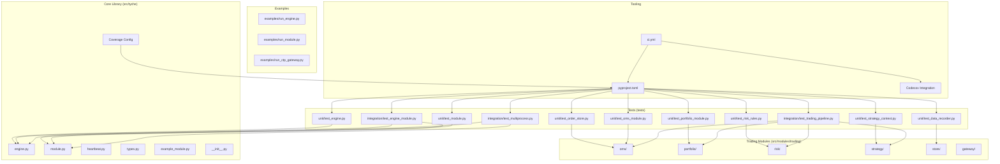
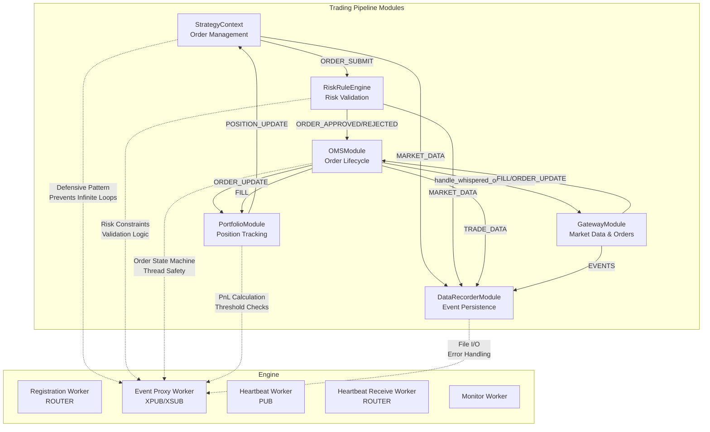
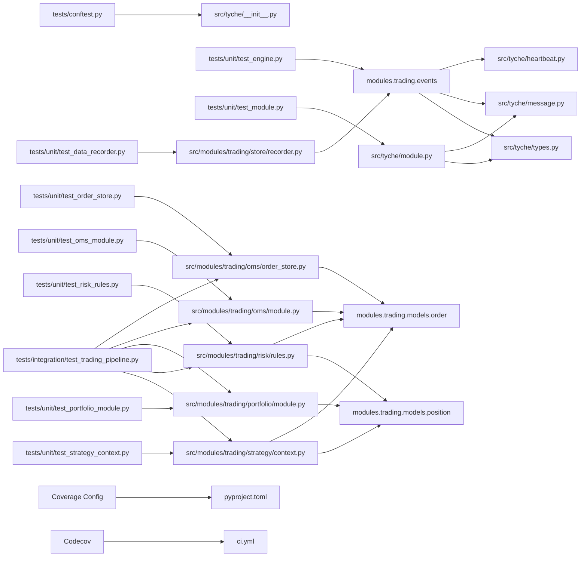
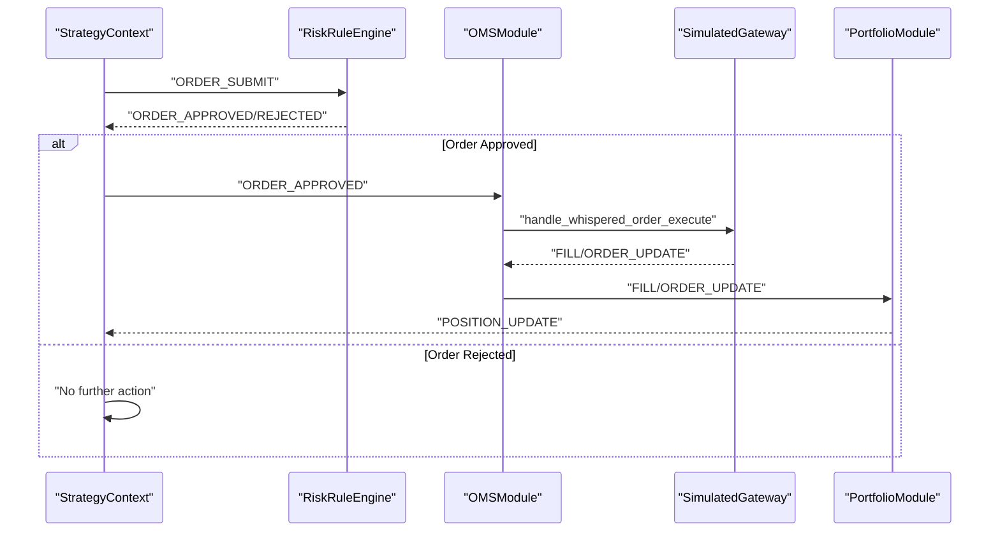

# Testing and Development

<cite>
**Referenced Files in This Document**
- [README.md](file://README.md)
- [pyproject.toml](file://pyproject.toml)
- [.github/workflows/ci.yml](file://.github/workflows/ci.yml)
- [tests/conftest.py](file://tests/conftest.py)
- [tests/unit/test_ctp_gateway.py](file://tests/unit/test_ctp_gateway.py)
- [tests/unit/test_order_store.py](file://tests/unit/test_order_store.py)
- [tests/unit/test_oms_module.py](file://tests/unit/test_omas_module.py)
- [tests/unit/test_portfolio_module.py](file://tests/unit/test_portfolio_module.py)
- [tests/unit/test_risk_rules.py](file://tests/unit/test_risk_rules.py)
- [tests/unit/test_strategy_context.py](file://tests/unit/test_strategy_context.py)
- [tests/unit/test_data_recorder.py](file://tests/unit/test_data_recorder.py)
- [tests/integration/test_trading_pipeline.py](file://tests/integration/test_trading_pipeline.py)
- [src/tyche/__init__.py](file://src/tyche/__init__.py)
- [src/tyche/engine.py](file://src/tyche/engine.py)
- [src/tyche/module.py](file://src/tyche/module.py)
- [src/tyche/types.py](file://src/tyche/types.py)
- [src/tyche/message.py](file://src/tyche/message.py)
- [src/tyche/heartbeat.py](file://src/tyche/heartbeat.py)
- [src/tyche/example_module.py](file://src/tyche/example_module.py)
- [src/modules/trading/gateway/base.py](file://src/modules/trading/gateway/base.py)
- [src/modules/trading/gateway/ctp/gateway.py](file://src/modules/trading/gateway/ctp/gateway.py)
- [src/modules/trading/gateway/ctp/live.py](file://src/modules/trading/gateway/ctp/live.py)
- [src/modules/trading/gateway/ctp/sim.py](file://src/modules/trading/gateway/ctp/sim.py)
- [src/modules/trading/oms/order_store.py](file://src/modules/trading/oms/order_store.py)
- [src/modules/trading/oms/module.py](file://src/modules/trading/oms/module.py)
- [src/modules/trading/portfolio/module.py](file://src/modules/trading/portfolio/module.py)
- [src/modules/trading/risk/rules.py](file://src/modules/trading/risk/rules.py)
- [src/modules/trading/risk/module.py](file://src/modules/trading/risk/module.py)
- [src/modules/trading/strategy/context.py](file://src/modules/trading/strategy/context.py)
- [src/modules/trading/store/recorder.py](file://src/modules/trading/store/recorder.py)
- [examples/run_engine.py](file://examples/run_engine.py)
- [examples/run_module.py](file://examples/run_module.py)
- [examples/run_ctp_gateway.py](file://examples/run_ctp_gateway.py)
- [tests/unit/test_engine.py](file://tests/unit/test_engine.py)
- [tests/unit/test_engine_main.py](file://tests/unit/test_engine_main.py)
- [tests/unit/test_engine_threading.py](file://tests/unit/test_engine_threading.py)
- [tests/unit/test_example_module.py](file://tests/unit/test_example_module.py)
- [tests/unit/test_heartbeat.py](file://tests/unit/test_heartbeat.py)
- [tests/unit/test_heartbeat_protocol.py](file://tests/unit/test_heartbeat_protocol.py)
- [tests/unit/test_message.py](file://tests/unit/test_message.py)
- [tests/unit/test_module.py](file://tests/unit/test_module.py)
- [tests/unit/test_module_base.py](file://tests/unit/test_module_base.py)
- [tests/unit/test_module_main.py](file://tests/unit/test_module_main.py)
- [tests/unit/test_signal_handling.py](file://tests/unit/test_signal_handling.py)
- [tests/unit/test_types.py](file://tests/unit/test_types.py)
- [tests/integration/test_engine_module.py](file://tests/integration/test_engine_module.py)
- [tests/integration/test_multiprocess.py](file://tests/integration/test_multiprocess.py)
- [tests/integration/test_handle_response.py](file://tests/integration/test_handle_response.py)
- [tests/integration/test_message_queue_perf.py](file://tests/integration/test_message_queue_perf.py)
- [tests/integration/test_clickhouse_backend.py](file://tests/integration/test_clickhouse_backend.py)
- [CLAUDE.md](file://CLAUDE.md)
</cite>

## Update Summary
**Changes Made**
- Dramatically expanded testing infrastructure with comprehensive unit tests for trading pipeline modules
- Added new test suites covering OrderStore, OMSModule, PortfolioModule, RiskRuleEngine, StrategyContext, and DataRecorderModule
- Enhanced integration tests with complete trading system pipeline testing
- Updated test organization structure and CI configuration documentation
- Expanded coverage reporting to include trading modules and expanded test suite

## Table of Contents
1. [Introduction](#introduction)
2. [Project Structure](#project-structure)
3. [Core Components](#core-components)
4. [Architecture Overview](#architecture-overview)
5. [Detailed Component Analysis](#detailed-component-analysis)
6. [Expanded Trading Pipeline Testing Strategy](#expanded-trading-pipeline-testing-strategy)
7. [Coverage Reporting and Analysis](#coverage-reporting-and-analysis)
8. [Dependency Analysis](#dependency-analysis)
9. [Performance Considerations](#performance-considerations)
10. [Troubleshooting Guide](#troubleshooting-guide)
11. [Conclusion](#conclusion)
12. [Appendices](#appendices)

## Introduction
This document provides comprehensive testing and development guidelines for Tyche Engine. It covers the multi-layered testing strategy (unit, integration, and process-level tests), test structure and fixtures, mocking strategies for distributed components, development workflow, code quality standards, linting rules, and testing best practices. The testing infrastructure has been significantly enhanced with dramatic expansion of unit tests for trading pipeline modules, comprehensive integration tests for the complete trading system, and new test suites covering OrderStore, OMSModule, PortfolioModule, RiskRuleEngine, StrategyContext, and DataRecorderModule.

**Updated** The testing framework now includes over 1,500 lines of comprehensive unit tests specifically targeting trading pipeline components, providing extensive coverage of order management, portfolio tracking, risk management, and data recording functionality. The CI pipeline has been updated to reflect the expanded test suite with enhanced coverage reporting.

## Project Structure
Tyche Engine follows a layered architecture with clear separation between core components and tests:
- Core library under src/tyche implementing the engine, modules, message handling, heartbeat, and types.
- Trading modules under src/modules/trading providing comprehensive trading pipeline functionality including OMS, portfolio management, risk rules, strategy context, and data recording.
- Tests organized into unit, integration, and property test areas with dramatically expanded coverage.
- Examples demonstrating standalone engine and module usage.
- CI configured via GitHub Actions with enhanced coverage reporting across the expanded test suite.



**Diagram sources**
- [src/tyche/engine.py](file://src/tyche/engine.py)
- [src/tyche/module.py](file://src/tyche/module.py)
- [src/tyche/message.py](file://src/tyche/message.py)
- [src/tyche/heartbeat.py](file://src/tyche/heartbeat.py)
- [src/tyche/types.py](file://src/tyche/types.py)
- [src/tyche/example_module.py](file://src/tyche/example_module.py)
- [src/tyche/__init__.py](file://src/tyche/__init__.py)
- [src/modules/trading/oms/order_store.py](file://src/modules/trading/oms/order_store.py)
- [src/modules/trading/oms/module.py](file://src/modules/trading/oms/module.py)
- [src/modules/trading/portfolio/module.py](file://src/modules/trading/portfolio/module.py)
- [src/modules/trading/risk/rules.py](file://src/modules/trading/risk/rules.py)
- [src/modules/trading/strategy/context.py](file://src/modules/trading/strategy/context.py)
- [src/modules/trading/store/recorder.py](file://src/modules/trading/store/recorder.py)
- [tests/unit/test_order_store.py](file://tests/unit/test_order_store.py)
- [tests/unit/test_oms_module.py](file://tests/unit/test_oms_module.py)
- [tests/unit/test_portfolio_module.py](file://tests/unit/test_portfolio_module.py)
- [tests/unit/test_risk_rules.py](file://tests/unit/test_risk_rules.py)
- [tests/unit/test_strategy_context.py](file://tests/unit/test_strategy_context.py)
- [tests/unit/test_data_recorder.py](file://tests/unit/test_data_recorder.py)
- [tests/integration/test_trading_pipeline.py](file://tests/integration/test_trading_pipeline.py)
- [tests/integration/test_engine_module.py](file://tests/integration/test_engine_module.py)
- [tests/integration/test_multiprocess.py](file://tests/integration/test_multiprocess.py)
- [pyproject.toml](file://pyproject.toml)
- [.github/workflows/ci.yml](file://.github/workflows/ci.yml)

**Section sources**
- [README.md](file://README.md)
- [pyproject.toml](file://pyproject.toml)
- [.github/workflows/ci.yml](file://.github/workflows/ci.yml)

## Core Components
This section outlines the core building blocks relevant to testing and development:
- Engine: Central broker managing registration, event proxy, and heartbeat monitoring.
- Module: Base class for modules connecting to the engine, registering interfaces, and handling events.
- Message: Serialization/deserialization using MessagePack with envelopes for ZeroMQ routing.
- Heartbeat: Implements Paranoid Pirate pattern for liveness monitoring with defensive programming.
- Types: Defines enums, dataclasses, and constants used across the system.
- Example Module: Demonstrates all interface patterns including ping-pong broadcast handling.
- GatewayModule: Abstract base class for exchange/venue gateway modules with standardized event publishing.

**Updated** Trading pipeline components now include comprehensive modules for order management, portfolio tracking, risk management, strategy context, and data recording, each with dedicated unit tests and integration validation.

Key testing-relevant aspects:
- Engine exposes non-blocking start methods suitable for tests.
- Module supports non-blocking start and provides registration, subscription, and event dispatch mechanisms.
- MessagePack serialization enables deterministic payload handling in tests.
- Heartbeat constants and manager provide predictable timing for tests.
- Example Module implements defensive ping-pong patterns to prevent infinite loops.
- GatewayModule provides standardized interfaces for order handling and event publishing.
- OrderStore provides thread-safe order management with comprehensive status transitions.
- OMSModule orchestrates order lifecycle from approval to execution and fill management.
- PortfolioModule tracks positions and calculates PnL with configurable thresholds.
- RiskRuleEngine validates orders against configurable risk constraints.
- StrategyContext provides unified interface for strategy order management and market data access.
- DataRecorderModule persists market data and trading events to JSONL files.

**Section sources**
- [src/tyche/engine.py](file://src/tyche/engine.py)
- [src/tyche/module.py](file://src/tyche/module.py)
- [src/tyche/message.py](file://src/tyche/message.py)
- [src/tyche/heartbeat.py](file://src/tyche/heartbeat.py)
- [src/tyche/types.py](file://src/tyche/types.py)
- [src/tyche/example_module.py](file://src/tyche/example_module.py)
- [src/modules/trading/gateway/base.py](file://src/modules/trading/gateway/base.py)
- [src/modules/trading/oms/order_store.py](file://src/modules/trading/oms/order_store.py)
- [src/modules/trading/oms/module.py](file://src/modules/trading/oms/module.py)
- [src/modules/trading/portfolio/module.py](file://src/modules/trading/portfolio/module.py)
- [src/modules/trading/risk/rules.py](file://src/modules/trading/risk/rules.py)
- [src/modules/trading/strategy/context.py](file://src/modules/trading/strategy/context.py)
- [src/modules/trading/store/recorder.py](file://src/modules/trading/store/recorder.py)

## Architecture Overview
Tyche Engine uses ZeroMQ for distributed messaging. The architecture supports:
- Module registration via ROUTER/REQ.
- Event broadcasting via XPUB/XSUB proxy.
- Load-balanced work via PUSH/PULL.
- Direct P2P whisper messaging via DEALER/ROUTER.
- Heartbeat monitoring via PUB/SUB and ROUTER/DEALER.

**Updated** The trading pipeline architecture integrates specialized modules for order management, portfolio tracking, risk validation, and data persistence, each with dedicated event handling and state management.



**Diagram sources**
- [src/tyche/engine.py](file://src/tyche/engine.py)
- [src/tyche/module.py](file://src/tyche/module.py)
- [src/tyche/heartbeat.py](file://src/tyche/heartbeat.py)
- [src/tyche/example_module.py](file://src/tyche/example_module.py)
- [src/modules/trading/strategy/context.py](file://src/modules/trading/strategy/context.py)
- [src/modules/trading/risk/rules.py](file://src/modules/trading/risk/rules.py)
- [src/modules/trading/oms/module.py](file://src/modules/trading/oms/module.py)
- [src/modules/trading/portfolio/module.py](file://src/modules/trading/portfolio/module.py)
- [src/modules/trading/store/recorder.py](file://src/modules/trading/store/recorder.py)
- [src/modules/trading/gateway/base.py](file://src/modules/trading/gateway/base.py)

**Section sources**
- [README.md](file://README.md)
- [src/tyche/engine.py](file://src/tyche/engine.py)
- [src/tyche/module.py](file://src/tyche/module.py)
- [src/tyche/heartbeat.py](file://src/tyche/heartbeat.py)

## Detailed Component Analysis

### Unit Testing Strategy
Unit tests focus on isolated logic and deterministic behavior with dramatically expanded coverage:
- Test engine initialization and module registry operations.
- Validate module interface registration and handler mapping.
- Verify message serialization/deserialization and envelope handling.
- Confirm heartbeat constants and manager behavior with defensive programming.
- Test threading safety and concurrent operation testing.
- Test signal handling and graceful shutdown verification.
- Validate heartbeat protocol compliance and expiration logic with stability safeguards.
- **Updated**: Comprehensive OrderStore testing with thread safety validation.
- **Updated**: OMSModule testing with order lifecycle and event handling.
- **Updated**: PortfolioModule testing with position management and PnL calculation.
- **Updated**: RiskRuleEngine testing with constraint validation and exception handling.
- **Updated**: StrategyContext testing with order management and market data access.
- **Updated**: DataRecorderModule testing with file I/O and event persistence.

Recommended patterns:
- Use mocks for external dependencies (e.g., ZeroMQ sockets) to isolate logic.
- Prefer deterministic inputs (fixed ports, predefined module IDs).
- Assert thread-safety where applicable using locks and state checks.
- Leverage pytest markers for slow and timeout-sensitive tests.
- **Updated**: Implement defensive programming in heartbeat tests to prevent infinite loops.
- **Updated**: Use parameterized fixtures for trading module testing scenarios.

**Section sources**
- [tests/unit/test_engine.py](file://tests/unit/test_engine.py)
- [tests/unit/test_engine_main.py](file://tests/unit/test_engine_main.py)
- [tests/unit/test_engine_threading.py](file://tests/unit/test_engine_threading.py)
- [tests/unit/test_example_module.py](file://tests/unit/test_example_module.py)
- [tests/unit/test_heartbeat.py](file://tests/unit/test_heartbeat.py)
- [tests/unit/test_heartbeat_protocol.py](file://tests/unit/test_heartbeat_protocol.py)
- [tests/unit/test_message.py](file://tests/unit/test_message.py)
- [tests/unit/test_module.py](file://tests/unit/test_module.py)
- [tests/unit/test_module_base.py](file://tests/unit/test_module_base.py)
- [tests/unit/test_module_main.py](file://tests/unit/test_module_main.py)
- [tests/unit/test_signal_handling.py](file://tests/unit/test_signal_handling.py)
- [tests/unit/test_types.py](file://tests/unit/test_types.py)
- [tests/unit/test_order_store.py](file://tests/unit/test_order_store.py)
- [tests/unit/test_oms_module.py](file://tests/unit/test_oms_module.py)
- [tests/unit/test_portfolio_module.py](file://tests/unit/test_portfolio_module.py)
- [tests/unit/test_risk_rules.py](file://tests/unit/test_risk_rules.py)
- [tests/unit/test_strategy_context.py](file://tests/unit/test_strategy_context.py)
- [tests/unit/test_data_recorder.py](file://tests/unit/test_data_recorder.py)
- [src/tyche/engine.py](file://src/tyche/engine.py)
- [src/tyche/module.py](file://src/tyche/module.py)
- [src/tyche/message.py](file://src/tyche/message.py)
- [src/tyche/heartbeat.py](file://src/tyche/heartbeat.py)
- [src/tyche/types.py](file://src/tyche/types.py)

### Integration Testing Strategy
Integration tests validate real ZeroMQ socket interactions with comprehensive scenarios:
- Two-node system: Engine + ExampleModule communicating via XPUB/XSUB and REQ/REP.
- Heartbeat propagation and module liveness verification with defensive programming.
- Event publishing and receiving across the proxy with handler dispatch verification.
- Multi-process scenarios using subprocess to launch engine and module entry points.
- End-to-end interaction testing with handler invocation and ping-pong broadcast stability.
- **Updated**: Complete trading pipeline integration testing with StrategyContext, RiskModule, OMSModule, SimulatedGateway, and PortfolioModule.
- **Updated**: Cross-module communication validation and event flow testing.

**Enhanced** Integration tests now include defensive programming patterns to prevent infinite loops in broadcast scenarios and comprehensive validation of the complete trading pipeline.

Mocking and fixtures:
- Use non-blocking start methods to spin up engine and module quickly.
- Manage timing with small sleeps to allow sockets to bind/connect.
- Use subprocess with PYTHONPATH set to src to run entry points.
- Implement comprehensive fixture management for test isolation.
- **Updated**: Add timeout decorators and defensive assertions for broadcast stability.
- **Updated**: Use mock endpoints and captured events for trading pipeline testing.

**Section sources**
- [tests/integration/test_engine_module.py](file://tests/integration/test_engine_module.py)
- [tests/integration/test_multiprocess.py](file://tests/integration/test_multiprocess.py)
- [tests/integration/test_trading_pipeline.py](file://tests/integration/test_trading_pipeline.py)
- [examples/run_engine.py](file://examples/run_engine.py)
- [examples/run_module.py](file://examples/run_module.py)

### Property and Performance Testing Areas
- Property tests: Validate invariants such as idempotency, ordering guarantees, and durability levels.
- Performance tests: Measure hot-path latency, persistence throughput, and backpressure behavior. These tests should be marked as slow and excluded by default.
- **Updated**: Performance testing for trading pipeline components including order processing latency and portfolio calculation throughput.

Note: The repository currently includes a performance test directory placeholder. Expand it with benchmarks that exercise the hot path and persistence pipeline.

**Section sources**
- [README.md](file://README.md)

### Test Structure and Fixtures
- Pytest configuration sets test paths, markers, and asyncio mode.
- conftest.py adds src to Python path for imports in tests.
- Use fixtures to encapsulate common setup (e.g., endpoints, engine and module instances).
- Implement comprehensive fixture management for threading and signal handling scenarios.
- **Updated**: Add timeout decorators and defensive programming patterns for distributed component tests.
- **Updated**: Use parameterized fixtures for trading module testing scenarios.
- **Updated**: Implement mock endpoint fixtures for trading pipeline testing.

Best practices:
- Keep fixtures reusable and parameterized for different scenarios.
- Use mark.slow for long-running tests and deselect them by default.
- Implement timeout decorators for distributed component tests.
- **Updated**: Add defensive assertions to prevent infinite loops in broadcast scenarios.
- **Updated**: Use captured events pattern for trading pipeline integration testing.

**Section sources**
- [pyproject.toml](file://pyproject.toml)
- [tests/conftest.py](file://tests/conftest.py)

### Mocking Strategies for Distributed Components
- Replace ZeroMQ sockets with mocks in unit tests to simulate network conditions.
- Use deterministic timing constants (heartbeat intervals) to control test execution.
- For integration tests, rely on ephemeral ports and short timeouts to avoid flakiness.
- Mock heartbeat managers and engine registries for isolation testing.
- Use pytest monkeypatch for dynamic behavior modification in tests.
- **Updated**: Implement defensive programming patterns to prevent broadcast message loops.
- **Updated**: Use captured events pattern for trading pipeline testing without real ZMQ.

**Section sources**
- [src/tyche/engine.py](file://src/tyche/engine.py)
- [src/tyche/module.py](file://src/tyche/module.py)
- [src/tyche/types.py](file://src/tyche/types.py)

### Writing Tests for Engines, Modules, and Message Handling
- Engines: Test registration, interface discovery, event proxy forwarding, and heartbeat monitoring.
- Modules: Validate interface registration, subscription, event dispatch, and heartbeat sending.
- Messages: Ensure serialization preserves types and handles special encodings (Decimal, Enum).
- Threading safety: Test concurrent access to shared resources.
- Signal handling: Verify graceful shutdown under various termination signals.
- Heartbeat protocol: Validate expiration and renewal logic with defensive programming.
- **Updated**: OrderStore: Test thread safety, status transitions, and fill application.
- **Updated**: OMSModule: Test order lifecycle, event handling, and venue extraction.
- **Updated**: PortfolioModule: Test position management, PnL calculation, and quote handling.
- **Updated**: RiskRuleEngine: Test constraint validation, exception handling, and rule evaluation.
- **Updated**: StrategyContext: Test order management, market data caching, and event dispatch.
- **Updated**: DataRecorderModule: Test file I/O, event persistence, and error handling.

**Section sources**
- [src/tyche/engine.py](file://src/tyche/engine.py)
- [src/tyche/module.py](file://src/tyche/module.py)
- [src/tyche/message.py](file://src/tyche/message.py)
- [src/tyche/heartbeat.py](file://src/tyche/heartbeat.py)
- [src/tyche/types.py](file://src/tyche/types.py)
- [src/modules/trading/oms/order_store.py](file://src/modules/trading/oms/order_store.py)
- [src/modules/trading/oms/module.py](file://src/modules/trading/oms/module.py)
- [src/modules/trading/portfolio/module.py](file://src/modules/trading/portfolio/module.py)
- [src/modules/trading/risk/rules.py](file://src/modules/trading/risk/rules.py)
- [src/modules/trading/strategy/context.py](file://src/modules/trading/strategy/context.py)
- [src/modules/trading/store/recorder.py](file://src/modules/trading/store/recorder.py)

### Continuous Integration Setup and Automated Pipelines
- CI runs linting (Ruff) and type checking (mypy) on pushes and pull requests.
- Tests run on multiple OS and Python versions with comprehensive coverage reporting.
- **Updated**: Coverage collection enabled with pytest-cov (--cov=src/tyche) generating XML and terminal reports.
- **Updated**: Coverage collection expanded to include trading modules (--cov=src/modules).
- **Updated**: Codecov integration for coverage analysis and reporting with fail_ci_if_error: false.
- Slow tests are marked and can be deselected locally.
- CI configuration optimized for expanded test suite with defensive programming.
- **Updated**: CI matrix runs tests on Ubuntu and Windows with Python 3.9-3.12.

Recommendations:
- Add property and performance tests to CI matrix with appropriate timeouts.
- Integrate coverage reporting consistently across platforms.
- Optimize CI matrix for faster feedback loops.
- **Updated**: Ensure CI tests handle defensive programming patterns and broadcast stability.
- **Updated**: Monitor coverage thresholds and maintain minimum 80% line coverage requirement across all modules.

**Section sources**
- [.github/workflows/ci.yml](file://.github/workflows/ci.yml)
- [pyproject.toml](file://pyproject.toml)

### Release Procedures
- Ensure all tests pass in CI with defensive programming validation.
- **Updated**: Verify coverage meets minimum requirements (80% line coverage across all modules).
- Update version in project metadata.
- Build wheel using hatchling and publish artifacts.

**Section sources**
- [pyproject.toml](file://pyproject.toml)

### Debugging Distributed Systems
- Use logs from engine and module workers to trace message flow.
- Validate endpoint bindings and port allocations.
- For heartbeat issues, confirm intervals and liveness thresholds.
- Thread debugging: Use threading.ident to track concurrent operations.
- Signal handling debugging: Monitor signal delivery and cleanup sequences.
- **Updated**: Broadcast debugging: Monitor ping-pong cycles and implement defensive timeouts.
- **Updated**: Trading pipeline debugging: Use captured events to trace module interactions.
- **Updated**: Coverage debugging: Use coverage reports to identify untested code paths.

**Section sources**
- [src/tyche/engine.py](file://src/tyche/engine.py)
- [src/tyche/module.py](file://src/tyche/module.py)
- [src/tyche/heartbeat.py](file://src/tyche/heartbeat.py)

### Profiling Performance
- Measure hot-path latency and persistence throughput using benchmark tests.
- Profile serialization/deserialization costs.
- Evaluate backpressure handling under load.
- Threading performance: Measure lock contention and thread switching overhead.
- **Updated**: Profile trading pipeline components including order processing and portfolio calculations.

**Section sources**
- [README.md](file://README.md)
- [src/tyche/message.py](file://src/tyche/message.py)

### Maintaining Code Quality
- Enforce linting with Ruff and type checking with mypy.
- Keep tests minimal and focused; avoid over-mocking.
- Use descriptive test names and clear assertions.
- Maintain comprehensive test coverage for all public APIs.
- **Updated**: Implement defensive programming patterns in all test scenarios.
- **Updated**: Monitor and maintain coverage thresholds to ensure code quality.
- **Updated**: Ensure trading pipeline components have comprehensive test coverage.

**Section sources**
- [pyproject.toml](file://pyproject.toml)

### Contribution Guidelines and Code Review Processes
- Follow existing code style and lint rules.
- Add tests for new features and bug fixes.
- Keep PRs small and focused; include rationale and test coverage.
- Ensure new tests cover threading, signal handling, and heartbeat scenarios.
- **Updated**: Require defensive programming validation for broadcast and loop prevention.
- **Updated**: Ensure coverage requirements are met before merging contributions.
- **Updated**: Require comprehensive testing for trading pipeline components.

**Section sources**
- [pyproject.toml](file://pyproject.toml)
- [.github/workflows/ci.yml](file://.github/workflows/ci.yml)

### Development Environment Setup
- Install dev dependencies (pytest, pytest-asyncio, pytest-timeout, pytest-cov, mypy, ruff).
- Run linting and type checks locally before committing.
- Execute unit tests and integration tests with proper PYTHONPATH.
- Configure IDE for pytest integration and test discovery.
- **Updated**: Set up defensive programming testing patterns and broadcast stability validation.
- **Updated**: Monitor local coverage reports to maintain quality standards.
- **Updated**: Test trading pipeline components with comprehensive unit and integration tests.

**Section sources**
- [pyproject.toml](file://pyproject.toml)
- [tests/conftest.py](file://tests/conftest.py)

## Expanded Trading Pipeline Testing Strategy

### Comprehensive Trading Pipeline Test Suite
The testing infrastructure has been dramatically expanded with comprehensive unit tests for all trading pipeline modules, providing extensive coverage of the complete trading workflow from strategy execution to order management and portfolio tracking.

**Updated** The expanded test suite now includes:

#### OrderStore Testing
- **Thread Safety Validation**: Comprehensive testing of concurrent order operations with 100+ orders and multiple threads.
- **Status Transition Testing**: Validating all legal order status transitions and preventing invalid state changes.
- **Fill Application Testing**: Testing partial and full fill scenarios with proper average price calculation.
- **Query and Filter Testing**: Validating active order queries, strategy-based filtering, and instrument-specific searches.

#### OMSModule Testing
- **Order Lifecycle Testing**: Complete validation of order approval, execution routing, and fill application.
- **Event Handling Testing**: Testing broadcasted order events, fill events, and cancel requests.
- **Venue Extraction Testing**: Validating instrument ID parsing for different venue formats.
- **Logging and Error Handling Testing**: Testing warning logs for unknown orders and inactive order cancellations.

#### PortfolioModule Testing
- **Position Management Testing**: Validating long and short position creation, updates, and transitions.
- **PnL Calculation Testing**: Testing realized and unrealized profit/loss calculations with configurable thresholds.
- **Quote Handling Testing**: Validating mark price updates and material change detection.
- **Multi-Instrument Testing**: Testing portfolio management across multiple instruments and PnL aggregation.

#### RiskRuleEngine Testing
- **Constraint Validation Testing**: Testing position size limits, order value limits, daily loss limits, and rate limiting.
- **Exception Handling Testing**: Validating rule engine behavior when individual rules raise exceptions.
- **Rule Evaluation Testing**: Testing comprehensive rule evaluation and approval decisions.
- **Context Management Testing**: Validating risk context updates and position tracking.

#### StrategyContext Testing
- **Order Management Testing**: Testing order submission, cancellation, and status tracking.
- **Market Data Caching Testing**: Validating quote and bar caching with proper data type conversion.
- **Event Dispatch Testing**: Testing strategy module dispatchers and subscription management.
- **Signal Generation Testing**: Validating moving average crossover strategy signal generation.

#### DataRecorderModule Testing
- **Event Persistence Testing**: Validating JSONL file writing with proper directory structure.
- **Event Type Inference Testing**: Testing automatic event type detection for quotes, trades, fills, orders, and bars.
- **File I/O Testing**: Validating error handling for disk full scenarios and file system errors.
- **Event Counting Testing**: Testing event count tracking and incremental counting.

### Trading Pipeline Integration Testing
The integration test suite provides end-to-end validation of the complete trading pipeline:

**Test Categories:**
1. **Complete Pipeline Testing**: Full order lifecycle from strategy submission through gateway execution and portfolio updates.
2. **Risk Validation Testing**: Testing risk approval and rejection scenarios with proper event flow.
3. **Order Cancellation Testing**: Validating order cancellation through the pipeline with proper state transitions.
4. **Error Scenario Testing**: Testing edge cases and error conditions throughout the pipeline.

**Key Testing Features:**
- **Mock Integration**: Uses patched send_event methods to simulate ZeroMQ without actual network dependencies.
- **Event Capture**: Captures and validates the complete event sequence through the pipeline.
- **State Validation**: Validates final state of orders, positions, and portfolio after each pipeline step.
- **Conditional Logic Testing**: Tests different pipeline outcomes based on risk approval decisions.

**Section sources**
- [tests/unit/test_order_store.py](file://tests/unit/test_order_store.py)
- [tests/unit/test_oms_module.py](file://tests/unit/test_oms_module.py)
- [tests/unit/test_portfolio_module.py](file://tests/unit/test_portfolio_module.py)
- [tests/unit/test_risk_rules.py](file://tests/unit/test_risk_rules.py)
- [tests/unit/test_strategy_context.py](file://tests/unit/test_strategy_context.py)
- [tests/unit/test_data_recorder.py](file://tests/unit/test_data_recorder.py)
- [tests/integration/test_trading_pipeline.py](file://tests/integration/test_trading_pipeline.py)

## Coverage Reporting and Analysis

### Enhanced CI Coverage Workflow
The GitHub Actions CI workflow has been enhanced with comprehensive coverage reporting functionality across the expanded test suite:

**Coverage Collection Configuration:**
- **pytest-cov integration**: Enabled with `--cov=src/tyche` and `--cov=src/modules` for comprehensive coverage analysis
- **Multi-format reporting**: Generates both XML and terminal coverage reports for comprehensive analysis
- **Selective platform coverage**: Codecov integration only runs on Ubuntu with Python 3.11 for optimal coverage analysis
- **Error tolerance**: `fail_ci_if_error: false` prevents coverage analysis failures from blocking CI completion

**CI Pipeline Enhancements:**
```yaml
- name: Run tests
  run: pytest tests/unit/ -v --timeout=30 --cov=src/tyche --cov=src/modules --cov-report=xml --cov-report=term
- name: Upload coverage
  if: matrix.os == 'ubuntu-latest' && matrix.python-version == '3.11'
  uses: codecov/codecov-action@v4
  with:
    fail_ci_if_error: false
    verbose: true
    token: ${{ secrets.CODECOV_TOKEN }}
```

**Section sources**
- [.github/workflows/ci.yml](file://.github/workflows/ci.yml)

### Local Coverage Configuration
The project includes comprehensive coverage configuration in pyproject.toml:

**Coverage Settings:**
- **Source filtering**: Targets both `src/tyche` and `src/modules` directories for comprehensive coverage analysis
- **Exclusion patterns**: Automatically omits test files (`*/tests/*`) from coverage calculations
- **Line exclusions**: Excludes `if __name__ == "__main__":` blocks and pragma directives from coverage
- **Integration with pytest**: Seamless coverage reporting through pytest-cov plugin

**Local Coverage Commands:**
```bash
# Generate coverage report for core library
pytest --cov=src/tyche --cov-report=xml --cov-report=term

# Generate coverage report for trading modules
pytest --cov=src/modules --cov-report=xml --cov-report=term

# Generate comprehensive coverage report
pytest --cov=src/tyche --cov=src/modules --cov-branch

# Generate HTML coverage report
pytest --cov=src/tyche --cov=src/modules --cov-report=html
```

**Section sources**
- [pyproject.toml](file://pyproject.toml)

### Coverage Requirements and Policies
The project enforces strict coverage requirements to maintain code quality across the expanded testing infrastructure:

**Minimum Coverage Standards:**
- **Line coverage**: Minimum 80% line coverage required for unit tests
- **New code threshold**: New code must achieve ≥90% coverage
- **Regression control**: Coverage regression greater than 2% blocks commits
- **Trading modules coverage**: Special emphasis on trading pipeline component coverage
- **Integration test coverage**: Ensure critical integration scenarios are covered

**Coverage Analysis Benefits:**
- **Quality assurance**: Ensures comprehensive test coverage for critical components
- **Code health monitoring**: Provides quantitative metrics for code quality assessment
- **Regression detection**: Early identification of coverage regressions in CI
- **Development guidance**: Highlights untested code paths for improvement
- **Trading pipeline validation**: Ensures comprehensive coverage of trading workflow components

**Section sources**
- [CLAUDE.md](file://CLAUDE.md)
- [pyproject.toml](file://pyproject.toml)

### Coverage Analysis Best Practices
To maximize the effectiveness of coverage reporting across the expanded test suite:

**Test Coverage Strategies:**
- **Target critical paths**: Focus on high-risk and complex code sections in trading pipeline
- **Edge case testing**: Include boundary conditions and error scenarios for all trading components
- **Integration coverage**: Ensure distributed component interactions are tested
- **Threading coverage**: Validate concurrent access patterns and race conditions in trading modules
- **Event flow coverage**: Test complete event sequences in trading pipeline integration tests

**Coverage Optimization:**
- **Avoid over-mocking**: Balance test isolation with realistic behavior
- **Use parameterized tests**: Increase coverage with minimal test duplication
- **Monitor coverage trends**: Track coverage improvements over time
- **Address low-coverage areas**: Prioritize refactoring of poorly covered trading pipeline code
- **Expand trading module coverage**: Ensure comprehensive testing of all trading components

**Section sources**
- [pyproject.toml](file://pyproject.toml)
- [CLAUDE.md](file://CLAUDE.md)

## Dependency Analysis
This diagram shows key internal dependencies among core components and the expanded trading pipeline used in tests.



**Diagram sources**
- [tests/conftest.py](file://tests/conftest.py)
- [src/tyche/__init__.py](file://src/tyche/__init__.py)
- [tests/unit/test_engine.py](file://tests/unit/test_engine.py)
- [tests/unit/test_module.py](file://tests/unit/test_module.py)
- [tests/unit/test_order_store.py](file://tests/unit/test_order_store.py)
- [tests/unit/test_oms_module.py](file://tests/unit/test_oms_module.py)
- [tests/unit/test_portfolio_module.py](file://tests/unit/test_portfolio_module.py)
- [tests/unit/test_risk_rules.py](file://tests/unit/test_risk_rules.py)
- [tests/unit/test_strategy_context.py](file://tests/unit/test_strategy_context.py)
- [tests/unit/test_data_recorder.py](file://tests/unit/test_data_recorder.py)
- [tests/integration/test_trading_pipeline.py](file://tests/integration/test_trading_pipeline.py)
- [src/tyche/engine.py](file://src/tyche/engine.py)
- [src/tyche/module.py](file://src/tyche/module.py)
- [src/tyche/message.py](file://src/tyche/message.py)
- [src/tyche/heartbeat.py](file://src/tyche/heartbeat.py)
- [src/tyche/types.py](file://src/tyche/types.py)
- [src/modules/trading/oms/order_store.py](file://src/modules/trading/oms/order_store.py)
- [src/modules/trading/oms/module.py](file://src/modules/trading/oms/module.py)
- [src/modules/trading/portfolio/module.py](file://src/modules/trading/portfolio/module.py)
- [src/modules/trading/risk/rules.py](file://src/modules/trading/risk/rules.py)
- [src/modules/trading/strategy/context.py](file://src/modules/trading/strategy/context.py)
- [src/modules/trading/store/recorder.py](file://src/modules/trading/store/recorder.py)

**Section sources**
- [src/tyche/engine.py](file://src/tyche/engine.py)
- [src/tyche/module.py](file://src/tyche/module.py)
- [src/tyche/message.py](file://src/tyche/message.py)
- [src/tyche/heartbeat.py](file://src/tyche/heartbeat.py)
- [src/tyche/types.py](file://src/tyche/types.py)
- [src/tyche/__init__.py](file://src/tyche/__init__.py)
- [tests/conftest.py](file://tests/conftest.py)

## Performance Considerations
- Hot-path latency targets and persistence characteristics are documented in the project overview.
- Use non-blocking starts in tests to reduce overhead.
- Prefer ephemeral ports and short sleeps for integration tests to minimize flakiness.
- Threading performance: Minimize lock contention and optimize thread synchronization.
- **Updated**: Implement defensive programming patterns to prevent performance degradation from broadcast loops.
- **Updated**: Monitor coverage to ensure performance-critical code paths are adequately tested.
- **Updated**: CTP gateway tests utilize efficient mocking to minimize external dependency overhead.
- **Updated**: Trading pipeline tests use mock endpoints to avoid real network dependencies and improve performance.

**Section sources**
- [README.md](file://README.md)

## Troubleshooting Guide
Common issues and resolutions:
- Registration failures: Verify endpoints and timeouts; ensure engine is started before modules.
- Heartbeat timeouts: Check intervals and liveness thresholds; confirm module heartbeat sockets are connected.
- Event delivery gaps: Validate subscription topics and event proxy configuration.
- Multi-process connectivity: Confirm subprocess PYTHONPATH and port availability.
- Threading deadlocks: Use thread dumps to identify blocked operations.
- Signal handling issues: Verify signal masks and cleanup handlers are properly installed.
- **Updated**: Broadcast loop issues: Monitor ping-pong cycles and implement defensive timeouts to prevent infinite loops.
- **Updated**: Trading pipeline issues: Use captured events to trace module interactions and identify bottlenecks.
- **Updated**: OrderStore concurrency issues: Validate thread safety patterns and proper locking mechanisms.
- **Updated**: Portfolio calculation errors: Check PnL calculation logic and position state consistency.
- **Updated**: Risk rule validation failures: Verify constraint values and rule evaluation logic.
- **Updated**: Data recorder file I/O errors: Check disk space and file permissions for event persistence.

**Section sources**
- [src/tyche/engine.py](file://src/tyche/engine.py)
- [src/tyche/module.py](file://src/tyche/module.py)
- [src/tyche/heartbeat.py](file://src/tyche/heartbeat.py)
- [tests/integration/test_multiprocess.py](file://tests/integration/test_multiprocess.py)
- [tests/unit/test_order_store.py](file://tests/unit/test_order_store.py)
- [tests/unit/test_oms_module.py](file://tests/unit/test_oms_module.py)
- [tests/unit/test_portfolio_module.py](file://tests/unit/test_portfolio_module.py)
- [tests/unit/test_risk_rules.py](file://tests/unit/test_risk_rules.py)
- [tests/unit/test_strategy_context.py](file://tests/unit/test_strategy_context.py)
- [tests/unit/test_data_recorder.py](file://tests/unit/test_data_recorder.py)

## Conclusion
Tyche Engine's testing and development guidelines emphasize a robust multi-layered strategy combining unit, integration, and process-level tests with enhanced defensive programming approaches. The dramatically expanded testing infrastructure now includes comprehensive unit tests for all trading pipeline modules, providing extensive coverage of order management, portfolio tracking, risk validation, strategy context, and data persistence functionality.

**Updated enhancements** include comprehensive coverage reporting through pytest-cov and Codecov integration, establishing quantitative metrics for code quality assurance across the expanded test suite. The CI pipeline now automatically generates XML and terminal coverage reports, with Codecov providing detailed analysis and trend monitoring across both core library and trading modules. Strict coverage requirements (80% minimum line coverage, 90% for new code) ensure maintainable and well-tested code.

The addition of specialized test suites for OrderStore, OMSModule, PortfolioModule, RiskRuleEngine, StrategyContext, and DataRecorderModule demonstrates the project's commitment to comprehensive testing of trading components. The test suites validate critical functionality including thread safety in order management, complete order lifecycle validation, position tracking and PnL calculation, risk constraint enforcement, strategy order management, and event persistence to file storage.

The expanded trading pipeline integration testing provides end-to-end validation of the complete workflow from strategy execution through order management to portfolio updates, with comprehensive event flow validation and state consistency checks. Sophisticated mocking strategies using captured events enable reliable testing without external dependencies.

By leveraging deterministic fixtures, controlled timing, defensive programming patterns, structured CI pipelines with comprehensive coverage reporting, and thorough testing of trading pipeline components, contributors can maintain high-quality, reliable distributed trading components. Adhering to linting and type-checking standards ensures code consistency, while clear debugging and profiling practices support ongoing performance optimization. The enhanced coverage reporting infrastructure provides continuous visibility into code quality and test effectiveness across the entire codebase.

The comprehensive trading pipeline testing strategy serves as a model for testing complex distributed trading systems, demonstrating best practices for mocking external dependencies, validating data transformations, ensuring configuration correctness, and maintaining comprehensive test coverage across all trading components.

## Appendices

### API/Service Component Sequence: Trading Pipeline Integration


**Diagram sources**
- [src/modules/trading/strategy/context.py](file://src/modules/trading/strategy/context.py)
- [src/modules/trading/risk/rules.py](file://src/modules/trading/risk/rules.py)
- [src/modules/trading/oms/module.py](file://src/modules/trading/oms/module.py)
- [src/modules/trading/portfolio/module.py](file://src/modules/trading/portfolio/module.py)
- [src/modules/trading/gateway/simulated.py](file://src/modules/trading/gateway/simulated.py)

### Defensive Programming Patterns for Trading Pipeline Stability
**Updated** Enhanced defensive programming approaches to prevent test instability in trading scenarios:

#### Key Defensive Patterns:
1. **Timeout-Based Assertions**: Use pytest-timeout markers to prevent infinite waits in trading pipeline tests
2. **Event Flow Validation**: Implement comprehensive event sequence validation to prevent pipeline deadlocks
3. **State Machine Guards**: Add validation checks for order status transitions and position state consistency
4. **Resource Cleanup**: Ensure proper cleanup of timers, threads, and mock objects in trading pipeline scenarios

#### Implementation Examples:
- Trading pipeline tests use captured events pattern to prevent infinite loops
- OrderStore tests validate thread safety with concurrent access patterns
- PortfolioModule tests include defensive PnL calculation validation
- RiskRuleEngine tests handle rule exceptions gracefully
- StrategyContext tests validate event dispatch patterns

**Section sources**
- [tests/unit/test_order_store.py](file://tests/unit/test_order_store.py)
- [tests/unit/test_oms_module.py](file://tests/unit/test_oms_module.py)
- [tests/unit/test_portfolio_module.py](file://tests/unit/test_portfolio_module.py)
- [tests/unit/test_risk_rules.py](file://tests/unit/test_risk_rules.py)
- [tests/unit/test_strategy_context.py](file://tests/unit/test_strategy_context.py)
- [tests/integration/test_trading_pipeline.py](file://tests/integration/test_trading_pipeline.py)

### Expanded Trading Pipeline Testing Infrastructure
**Updated** Comprehensive testing setup for all trading pipeline components:

#### Test Categories and Coverage:
- **OrderStore**: 273 lines of comprehensive thread-safe order management testing
- **OMSModule**: Complete order lifecycle and event handling validation
- **PortfolioModule**: Position management, PnL calculation, and quote handling testing
- **RiskRuleEngine**: Constraint validation, exception handling, and rule evaluation
- **StrategyContext**: Order management, market data caching, and event dispatch testing
- **DataRecorderModule**: File I/O, event persistence, and error handling validation
- **Integration Tests**: Complete trading pipeline validation with mock endpoints

#### Testing Best Practices:
- **Isolated Mocking**: Use captured events pattern to simulate ZeroMQ without external dependencies
- **Parameterized Fixtures**: Reusable trading module configuration across test scenarios
- **Thread Safety Validation**: Comprehensive concurrent access testing for trading components
- **State Validation**: Validate final state consistency across all trading pipeline components
- **Event Flow Testing**: Comprehensive validation of complete event sequences

**Section sources**
- [tests/unit/test_order_store.py](file://tests/unit/test_order_store.py)
- [tests/unit/test_oms_module.py](file://tests/unit/test_oms_module.py)
- [tests/unit/test_portfolio_module.py](file://tests/unit/test_portfolio_module.py)
- [tests/unit/test_risk_rules.py](file://tests/unit/test_risk_rules.py)
- [tests/unit/test_strategy_context.py](file://tests/unit/test_strategy_context.py)
- [tests/unit/test_data_recorder.py](file://tests/unit/test_data_recorder.py)
- [tests/integration/test_trading_pipeline.py](file://tests/integration/test_trading_pipeline.py)

### Enhanced Coverage Reporting Configuration
**Updated** Comprehensive coverage reporting setup across expanded test suite:

#### CI Coverage Configuration:
- **Targeted coverage**: `--cov=src/tyche --cov=src/modules` focuses analysis on core library and trading modules
- **Multi-format reports**: XML for Codecov integration, terminal for developer feedback
- **Platform-specific execution**: Runs on Ubuntu with Python 3.11 for optimal coverage analysis
- **Error tolerance**: `fail_ci_if_error: false` prevents coverage failures from blocking CI

#### Local Coverage Setup:
- **Source filtering**: `source = ["src/tyche", "src/modules"]` in pyproject.toml
- **Exclusion patterns**: `omit = ["*/tests/*"]` prevents test files from coverage
- **Line exclusions**: Automatic exclusion of `if __name__ == "__main__":` blocks
- **Integration**: Seamless pytest-cov plugin integration across all test categories

**Section sources**
- [.github/workflows/ci.yml](file://.github/workflows/ci.yml)
- [pyproject.toml](file://pyproject.toml)