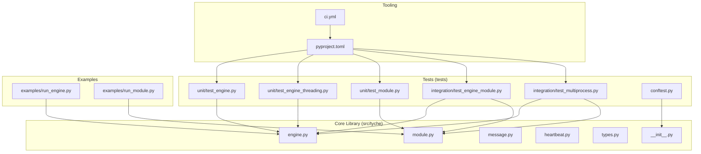
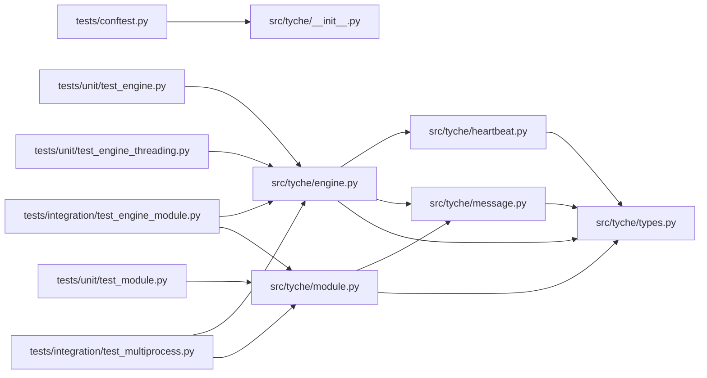
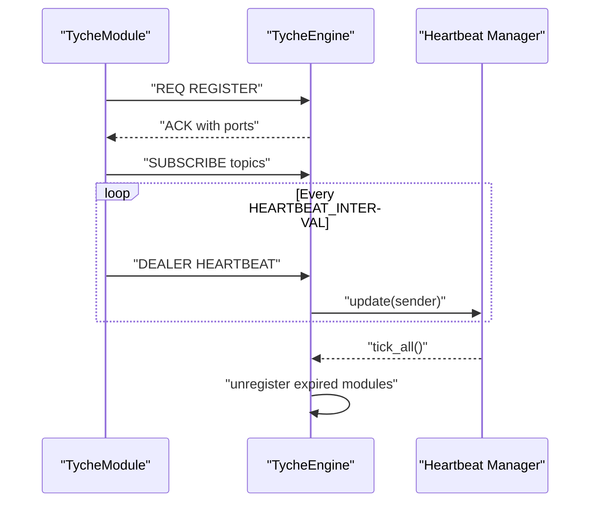

# Testing and Development

<cite>
**Referenced Files in This Document**
- [README.md](file://README.md)
- [pyproject.toml](file://pyproject.toml)
- [.github/workflows/ci.yml](file://.github/workflows/ci.yml)
- [tests/conftest.py](file://tests/conftest.py)
- [src/tyche/__init__.py](file://src/tyche/__init__.py)
- [src/tyche/engine.py](file://src/tyche/engine.py)
- [src/tyche/module.py](file://src/tyche/module.py)
- [src/tyche/types.py](file://src/tyche/types.py)
- [src/tyche/message.py](file://src/tyche/message.py)
- [src/tyche/heartbeat.py](file://src/tyche/heartbeat.py)
- [examples/run_engine.py](file://examples/run_engine.py)
- [examples/run_module.py](file://examples/run_module.py)
- [tests/unit/test_engine.py](file://tests/unit/test_engine.py)
- [tests/unit/test_engine_threading.py](file://tests/unit/test_engine_threading.py)
- [tests/unit/test_module.py](file://tests/unit/test_module.py)
- [tests/integration/test_engine_module.py](file://tests/integration/test_engine_module.py)
- [tests/integration/test_multiprocess.py](file://tests/integration/test_multiprocess.py)
</cite>

## Update Summary
**Changes Made**
- Updated unit testing strategy to reflect consolidated test_module_threading.py removal and streamlined focus on essential functionality
- Enhanced integration tests documentation for engine-module communication and multiprocess coordination
- Added comprehensive coverage of threading, message handling, and type validation in unit tests
- Updated test structure documentation to reflect current directory organization

## Table of Contents
1. [Introduction](#introduction)
2. [Project Structure](#project-structure)
3. [Core Components](#core-components)
4. [Architecture Overview](#architecture-overview)
5. [Detailed Component Analysis](#detailed-component-analysis)
6. [Dependency Analysis](#dependency-analysis)
7. [Performance Considerations](#performance-considerations)
8. [Troubleshooting Guide](#troubleshooting-guide)
9. [Conclusion](#conclusion)
10. [Appendices](#appendices)

## Introduction
This document provides comprehensive testing and development guidelines for Tyche Engine. It covers the multi-layered testing strategy (unit, integration, and process-level tests), test structure and fixtures, mocking strategies for distributed components, development workflow, code quality standards, linting rules, and testing best practices. It also includes guidance for writing tests for modules, engines, and message handling, continuous integration setup, automated testing pipelines, release procedures, debugging distributed systems, profiling performance, maintaining code quality, contribution guidelines, code review processes, and development environment setup.

## Project Structure
Tyche Engine follows a layered architecture with clear separation between core components and tests:
- Core library under src/tyche implementing the engine, modules, message handling, heartbeat, and types.
- Tests organized into unit, integration, and property test areas.
- Examples demonstrating standalone engine and module usage.
- CI configured via GitHub Actions.



**Diagram sources**
- [src/tyche/engine.py](file://src/tyche/engine.py)
- [src/tyche/module.py](file://src/tyche/module.py)
- [src/tyche/message.py](file://src/tyche/message.py)
- [src/tyche/heartbeat.py](file://src/tyche/heartbeat.py)
- [src/tyche/types.py](file://src/tyche/types.py)
- [src/tyche/__init__.py](file://src/tyche/__init__.py)
- [tests/unit/test_engine.py](file://tests/unit/test_engine.py)
- [tests/unit/test_engine_threading.py](file://tests/unit/test_engine_threading.py)
- [tests/unit/test_module.py](file://tests/unit/test_module.py)
- [tests/integration/test_engine_module.py](file://tests/integration/test_engine_module.py)
- [tests/integration/test_multiprocess.py](file://tests/integration/test_multiprocess.py)
- [tests/conftest.py](file://tests/conftest.py)
- [examples/run_engine.py](file://examples/run_engine.py)
- [examples/run_module.py](file://examples/run_module.py)
- [pyproject.toml](file://pyproject.toml)
- [.github/workflows/ci.yml](file://.github/workflows/ci.yml)

**Section sources**
- [README.md](file://README.md)
- [pyproject.toml](file://pyproject.toml)
- [.github/workflows/ci.yml](file://.github/workflows/ci.yml)

## Core Components
This section outlines the core building blocks relevant to testing and development:
- Engine: Central broker managing registration, event proxy, and heartbeat monitoring.
- Module: Base class for modules connecting to the engine, registering interfaces, and handling events.
- Message: Serialization/deserialization using MessagePack with envelopes for ZeroMQ routing.
- Heartbeat: Implements Paranoid Pirate pattern for liveness monitoring.
- Types: Defines enums, dataclasses, and constants used across the system.

Key testing-relevant aspects:
- Engine exposes non-blocking start methods suitable for tests.
- Module supports non-blocking start and provides registration, subscription, and event dispatch mechanisms.
- MessagePack serialization enables deterministic payload handling in tests.
- Heartbeat constants and manager provide predictable timing for tests.

**Section sources**
- [src/tyche/engine.py](file://src/tyche/engine.py)
- [src/tyche/module.py](file://src/tyche/module.py)
- [src/tyche/message.py](file://src/tyche/message.py)
- [src/tyche/heartbeat.py](file://src/tyche/heartbeat.py)
- [src/tyche/types.py](file://src/tyche/types.py)

## Architecture Overview
Tyche Engine uses ZeroMQ for distributed messaging. The architecture supports:
- Module registration via ROUTER/REQ.
- Event broadcasting via XPUB/XSUB proxy.
- Load-balanced work via PUSH/PULL.
- Direct P2P whisper messaging via DEALER/ROUTER.
- Heartbeat monitoring via PUB/SUB and ROUTER/DEALER.

```mermaid
graph TB
subgraph "Engine"
R["Registration Worker<br/>ROUTER"]
EP["Event Proxy Worker<br/>XPUB/XSUB"]
HB["Heartbeat Worker<br/>PUB"]
HBR["Heartbeat Receive Worker<br/>ROUTER"]
MON["Monitor Worker"]
end
subgraph "Modules"
M1["TycheModule<br/>PUB/SUB/DEALER"]
M2["TycheModule<br/>PUB/SUB/DEALER"]
end
M1 -- "REQ (REGISTER)" --> R
R -- "ACK" --> M1
M1 -- "SUBSCRIBE" --> EP
EP -- "PUBLISH" --> M1
EP -- "PUBLISH" --> M2
HB -- "HEARTBEAT" --> M1
HB -- "HEARTBEAT" --> M2
HBR -- "HEARTBEAT" <-- M1
HBR -- "HEARTBEAT" <-- M2
MON -- "Expire Modules" --> R
```

**Diagram sources**
- [src/tyche/engine.py](file://src/tyche/engine.py)
- [src/tyche/module.py](file://src/tyche/module.py)
- [src/tyche/heartbeat.py](file://src/tyche/heartbeat.py)

**Section sources**
- [README.md](file://README.md)
- [src/tyche/engine.py](file://src/tyche/engine.py)
- [src/tyche/module.py](file://src/tyche/module.py)
- [src/tyche/heartbeat.py](file://src/tyche/heartbeat.py)

## Detailed Component Analysis

### Unit Testing Strategy
Unit tests focus on isolated logic and deterministic behavior with comprehensive coverage of threading, message handling, and type validation:
- Test engine initialization, module registry operations, and threading capabilities.
- Validate module interface registration, handler mapping, and threading safety.
- Verify message serialization/deserialization, envelope handling, and type preservation.
- Confirm heartbeat constants, manager behavior, and signal handling.
- Test type validation, enum handling, and interface pattern matching.

**Updated** Consolidated test_module_threading.py removal and streamlined focus on essential functionality

Recommended patterns:
- Use mocks for external dependencies (e.g., ZeroMQ sockets) to isolate logic.
- Prefer deterministic inputs (fixed ports, predefined module IDs).
- Assert thread-safety where applicable using locks and state checks.
- Test both blocking and non-blocking operation modes.

**Section sources**
- [tests/unit/test_engine.py](file://tests/unit/test_engine.py)
- [tests/unit/test_engine_threading.py](file://tests/unit/test_engine_threading.py)
- [tests/unit/test_module.py](file://tests/unit/test_module.py)
- [src/tyche/engine.py](file://src/tyche/engine.py)
- [src/tyche/module.py](file://src/tyche/module.py)
- [src/tyche/message.py](file://src/tyche/message.py)
- [src/tyche/heartbeat.py](file://src/tyche/heartbeat.py)
- [src/tyche/types.py](file://src/tyche/types.py)

### Integration Testing Strategy
Integration tests validate real ZeroMQ socket interactions with enhanced focus on engine-module communication and multiprocess coordination:
- Two-node system: Engine + ExampleModule communicating via XPUB/XSUB and REQ/REP.
- Heartbeat propagation and module liveness monitoring.
- Event publishing and receiving across the proxy with handler dispatch verification.
- Multi-process scenarios using subprocess to launch engine and module entry points.
- Entry point validation and process lifecycle management.

**Enhanced** Streamlined test focus on essential engine-module communication and multiprocess coordination

Mocking and fixtures:
- Use non-blocking start methods to spin up engine and module quickly.
- Manage timing with small sleeps to allow sockets to bind/connect.
- Use subprocess with PYTHONPATH set to src to run entry points.
- Test both single-process and multi-process communication scenarios.

**Section sources**
- [tests/integration/test_engine_module.py](file://tests/integration/test_engine_module.py)
- [tests/integration/test_multiprocess.py](file://tests/integration/test_multiprocess.py)
- [examples/run_engine.py](file://examples/run_engine.py)
- [examples/run_module.py](file://examples/run_module.py)

### Property and Performance Testing Areas
- Property tests: Validate invariants such as idempotency, ordering guarantees, and durability levels.
- Performance tests: Measure hot-path latency, persistence throughput, and backpressure behavior. These tests should be marked as slow and excluded by default.

Note: The repository currently includes a performance test directory placeholder. Expand it with benchmarks that exercise the hot path and persistence pipeline.

**Section sources**
- [README.md](file://README.md)

### Test Structure and Fixtures
- Pytest configuration sets test paths, markers, and asyncio mode.
- conftest.py adds src to Python path for imports in tests.
- Use fixtures to encapsulate common setup (e.g., endpoints, engine and module instances).

Best practices:
- Keep fixtures reusable and parameterized for different scenarios.
- Use mark.slow for long-running tests and deselect them by default.
- Organize tests by functional area: threading, message handling, type validation, and integration scenarios.

**Section sources**
- [pyproject.toml](file://pyproject.toml)
- [tests/conftest.py](file://tests/conftest.py)

### Mocking Strategies for Distributed Components
- Replace ZeroMQ sockets with mocks in unit tests to simulate network conditions.
- Use deterministic timing constants (heartbeat intervals) to control test execution.
- For integration tests, rely on ephemeral ports and short timeouts to avoid flakiness.
- Mock external dependencies while preserving core logic validation.

**Section sources**
- [src/tyche/engine.py](file://src/tyche/engine.py)
- [src/tyche/module.py](file://src/tyche/module.py)
- [src/tyche/types.py](file://src/tyche/types.py)

### Writing Tests for Engines, Modules, and Message Handling
- Engines: Test registration, interface discovery, event proxy forwarding, heartbeat monitoring, and threading behavior.
- Modules: Validate interface registration, subscription, event dispatch, heartbeat sending, and signal handling.
- Messages: Ensure serialization preserves types, handles special encodings (Decimal, Enum), and maintains envelope integrity.
- Threading: Test thread safety, non-blocking operations, and concurrent access patterns.

**Section sources**
- [src/tyche/engine.py](file://src/tyche/engine.py)
- [src/tyche/module.py](file://src/tyche/module.py)
- [src/tyche/message.py](file://src/tyche/message.py)
- [src/tyche/types.py](file://src/tyche/types.py)

### Continuous Integration Setup and Automated Pipelines
- CI runs linting (Ruff) and type checking (mypy) on pushes and pull requests.
- Tests run on multiple OS and Python versions with coverage upload on Ubuntu + Python 3.11.
- Slow tests are marked and can be deselected locally.

Recommendations:
- Add property and performance tests to CI matrix with appropriate timeouts.
- Integrate coverage reporting consistently across platforms.
- Ensure comprehensive test coverage for threading, message handling, and type validation.

**Section sources**
- [.github/workflows/ci.yml](file://.github/workflows/ci.yml)
- [pyproject.toml](file://pyproject.toml)

### Release Procedures
- Ensure all tests pass in CI.
- Update version in project metadata.
- Build wheel using hatchling and publish artifacts.

**Section sources**
- [pyproject.toml](file://pyproject.toml)

### Debugging Distributed Systems
- Use logs from engine and module workers to trace message flow.
- Validate endpoint bindings and port allocations.
- For heartbeat issues, confirm intervals and liveness thresholds.
- Test both single-process and multi-process scenarios for comprehensive debugging.

**Section sources**
- [src/tyche/engine.py](file://src/tyche/engine.py)
- [src/tyche/module.py](file://src/tyche/module.py)
- [src/tyche/heartbeat.py](file://src/tyche/heartbeat.py)

### Profiling Performance
- Measure hot-path latency and persistence throughput using benchmark tests.
- Profile serialization/deserialization costs.
- Evaluate backpressure handling under load.
- Test threading performance and concurrent access patterns.

**Section sources**
- [README.md](file://README.md)
- [src/tyche/message.py](file://src/tyche/message.py)

### Maintaining Code Quality
- Enforce linting with Ruff and type checking with mypy.
- Keep tests minimal and focused; avoid over-mocking.
- Use descriptive test names and clear assertions.
- Ensure comprehensive coverage of threading, message handling, and type validation.

**Section sources**
- [pyproject.toml](file://pyproject.toml)

### Contribution Guidelines and Code Review Processes
- Follow existing code style and lint rules.
- Add tests for new features and bug fixes.
- Keep PRs small and focused; include rationale and test coverage.
- Ensure test coverage improvements accompany new functionality.

**Section sources**
- [pyproject.toml](file://pyproject.toml)
- [.github/workflows/ci.yml](file://.github/workflows/ci.yml)

### Development Environment Setup
- Install dev dependencies (pytest, pytest-asyncio, pytest-timeout, pytest-cov, mypy, ruff).
- Run linting and type checks locally before committing.
- Execute unit tests and integration tests with proper PYTHONPATH.
- Test both single-process and multi-process scenarios.

**Section sources**
- [pyproject.toml](file://pyproject.toml)
- [tests/conftest.py](file://tests/conftest.py)

## Dependency Analysis
This diagram shows key internal dependencies among core components used in tests.



**Diagram sources**
- [tests/conftest.py](file://tests/conftest.py)
- [src/tyche/__init__.py](file://src/tyche/__init__.py)
- [tests/unit/test_engine.py](file://tests/unit/test_engine.py)
- [tests/unit/test_engine_threading.py](file://tests/unit/test_engine_threading.py)
- [tests/unit/test_module.py](file://tests/unit/test_module.py)
- [tests/integration/test_engine_module.py](file://tests/integration/test_engine_module.py)
- [tests/integration/test_multiprocess.py](file://tests/integration/test_multiprocess.py)
- [src/tyche/engine.py](file://src/tyche/engine.py)
- [src/tyche/module.py](file://src/tyche/module.py)
- [src/tyche/message.py](file://src/tyche/message.py)
- [src/tyche/heartbeat.py](file://src/tyche/heartbeat.py)
- [src/tyche/types.py](file://src/tyche/types.py)

**Section sources**
- [src/tyche/engine.py](file://src/tyche/engine.py)
- [src/tyche/module.py](file://src/tyche/module.py)
- [src/tyche/message.py](file://src/tyche/message.py)
- [src/tyche/heartbeat.py](file://src/tyche/heartbeat.py)
- [src/tyche/types.py](file://src/tyche/types.py)
- [src/tyche/__init__.py](file://src/tyche/__init__.py)
- [tests/conftest.py](file://tests/conftest.py)

## Performance Considerations
- Hot-path latency targets and persistence characteristics are documented in the project overview.
- Use non-blocking starts in tests to reduce overhead.
- Prefer ephemeral ports and short sleeps for integration tests to minimize flakiness.
- Test both single-process and multi-process scenarios for performance evaluation.

**Section sources**
- [README.md](file://README.md)

## Troubleshooting Guide
Common issues and resolutions:
- Registration failures: Verify endpoints and timeouts; ensure engine is started before modules.
- Heartbeat timeouts: Check intervals and liveness thresholds; confirm module heartbeat sockets are connected.
- Event delivery gaps: Validate subscription topics and event proxy configuration.
- Multi-process connectivity: Confirm subprocess PYTHONPATH and port availability.
- Threading issues: Verify thread safety and non-blocking operation modes.
- Message serialization problems: Check type preservation and envelope handling.

**Section sources**
- [src/tyche/engine.py](file://src/tyche/engine.py)
- [src/tyche/module.py](file://src/tyche/module.py)
- [src/tyche/heartbeat.py](file://src/tyche/heartbeat.py)
- [tests/integration/test_multiprocess.py](file://tests/integration/test_multiprocess.py)

## Conclusion
Tyche Engine's testing and development guidelines emphasize a robust multi-layered strategy combining unit, integration, and process-level tests. The recent test coverage improvements include consolidated threading tests, streamlined essential functionality focus, enhanced integration tests for engine-module communication, and comprehensive coverage of threading, message handling, and type validation. By leveraging deterministic fixtures, controlled timing, and structured CI pipelines, contributors can maintain high-quality, reliable distributed components. Adhering to linting and type-checking standards ensures code consistency, while clear debugging and profiling practices support ongoing performance optimization.

## Appendices

### API/Service Component Sequence: Registration and Heartbeat


**Diagram sources**
- [src/tyche/module.py](file://src/tyche/module.py)
- [src/tyche/engine.py](file://src/tyche/engine.py)
- [src/tyche/heartbeat.py](file://src/tyche/heartbeat.py)
- [src/tyche/types.py](file://src/tyche/types.py)