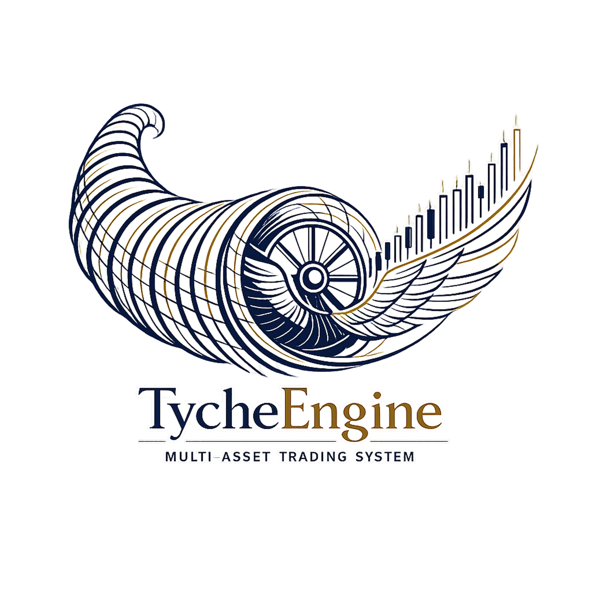

<div align="center">
  

  <h3>Institutional-grade, multi-asset algorithmic trading platform</h3>
  <p>Pure Python · Process-based microservices · ZeroMQ IPC</p>

  <br/>

  [](https://github.com/zt281/TycheEngine/actions/workflows/ci.yml)
  [](https://github.com/zt281/TycheEngine/actions/workflows/release.yml)
  [](LICENSE)

</div>

---

## Overview

TycheEngine is an algorithmic trading platform designed for multi-asset institutional use. It runs every trading component as an **independent OS process**, communicating over a split control/data ZeroMQ bus using **IPC (Unix domain sockets / Windows named pipes)**. The architecture is pure Python for maximum stability and expandability, with a clean evolution path to native modules via a C client library.

### Key Design Goals

| Goal | Mechanism |
|------|-----------|
| Millisecond-level latency | Pure Python dataclasses, MessagePack serialization, IPC transport |
| Fault isolation | Each module is an independent OS process — one crash cannot cascade |
| Clean evolution to native | Network protocol supports Python now, C++ modules later via shared client library |
| Future shared-memory migration | IPC sockets are a drop-in replacement target for shared memory |
| Multi-asset coverage | Equities, equity options, futures, future options, crypto spot/perp/future, FX, bonds |

---

## Architecture

TycheEngine uses a **split control/data plane** with **completely separate processes** communicating via IPC. Two hub processes coordinate everything; trading modules never communicate directly with each other.

```
┌─────────────────────────────────────────────────────────────────────────────┐
│                         TYCHE ENGINE                                        │
│                                                                             │
│   ┌──────────────┐              ┌──────────────────────────────────────┐    │
│   │    NEXUS     │              │                BUS                   │    │
│   │ Control Hub  │              │             Data Hub                 │    │
│   │              │              │                                      │    │
│   │ ROUTER/DEALER│              │          XPUB / XSUB                 │    │
│   │  ipc socket  │              │  xsub: ipc:///tmp/tyche/bus_xsub.sock│    │
│   │  CPU core 0  │              │  xpub: ipc:///tmp/tyche/bus_xpub.sock│    │
│   │              │              │          CPU core 1                  │    │
│   └──────┬───────┘              └────────────┬─────────────────────────┘    │
│          │ lifecycle / commands              │ streaming data               │
│    ──────┼───────────────────────────────────┼─────                         │
│          │                                   │                              │
│   ┌──────┴───────┐              ┌────────────┴────────┐                     │
│   │   Module A   │              │    Module B         │                     │
│   │  (Python)    │              │  (Python or Native) │                     │
│   │  CPU core 2  │              │  CPU core 3         │                     │
│   └──────────────┘              └─────────────────────┘                     │
└─────────────────────────────────────────────────────────────────────────────┘
```

**Nexus** handles registration, heartbeating, lifecycle commands (START / STOP / RECONFIGURE / STATUS), and ordered shutdown. It is authoritative over which modules are alive.

**Bus** is a pure XPUB/XSUB proxy over IPC sockets. Publishers connect to the XSUB socket; subscribers connect to the XPUB socket. It has no knowledge of module state — it simply fans data out by topic prefix.

**Modules** are completely independent processes. They import only `tyche-cli` (the client library), not the core. They auto-connect to Core on startup using CLI arguments.

---

## Tech Stack

| Layer | Technology |
|-------|-----------|
| Core service | Python 3.11+ |
| Client library | Python 3.11+ (`tyche-cli` package) |
| Serialization | MessagePack via `msgpack` 1.0+ |
| IPC | ZeroMQ IPC (Unix domain sockets / Windows named pipes) |
| Python runtime | Python 3.11+ |
| CPU affinity | `os.sched_setaffinity` / `SetThreadAffinityMask` |
| Config | JSON (module configs), TOML (core config) |

---

## Packages

| Package | Description | Install |
|---------|-------------|---------|
| `tyche-core` | Core service (Nexus + Bus) | `pip install tyche-core` |
| `tyche-cli` | Client library for modules | `pip install tyche-cli` |
| `tyche-launcher` | Module lifecycle manager | `pip install tyche-launcher` |

---

## Getting Started

### Prerequisites

- Python 3.11+
- ZeroMQ libraries (installed automatically with `pyzmq`)

### Install

```bash
# Install core service
pip install tyche-core

# Install module client library (in each module's environment)
pip install tyche-cli
```

### Run Core

```bash
# Start Nexus and Bus
tyche-core --config core-config.json
```

### Run a Module

```bash
# Module connects to Core via IPC sockets
python my_strategy.py \
  --nexus ipc:///tmp/tyche/nexus.sock \
  --bus-xsub ipc:///tmp/tyche/bus_xsub.sock \
  --bus-xpub ipc:///tmp/tyche/bus_xpub.sock
```

### Run with Launcher

```bash
# launcher-config.json defines modules and their lifecycle
tyche-launcher --config launcher-config.json
```

### Run Tests

```bash
# All tests
pytest tests/ -v

# Unit tests only
pytest tests/unit/ -v

# Integration tests only
pytest tests/integration/ -v
```

### Lint

```bash
ruff check tyche-core/ tyche-cli/ tests/
```

> **Windows note:** Use `python` instead of `python3`. Development is supported on Windows 11; the production target is Linux.

---

## Project Layout

```
TycheEngine/
├── tyche-core/                # Core service package
│   ├── pyproject.toml
│   └── tyche_core/
│       ├── __init__.py
│       ├── nexus.py           # Nexus process — ROUTER/DEALER lifecycle broker
│       ├── bus.py             # Bus process — XPUB/XSUB data proxy
│       └── main.py            # Entry point: tyche-core
│
├── tyche-cli/                 # Client library for modules
│   ├── pyproject.toml
│   └── tyche_cli/
│       ├── __init__.py
│       ├── module.py          # Module base class
│       ├── types.py           # Tick, Quote, Trade, Bar, Order, etc.
│       ├── serialization.py   # MessagePack encode/decode with _type discriminator
│       ├── transport.py       # ZMQ socket management
│       └── main.py            # Entry point for module testing
│
├── tyche-launcher/            # Module lifecycle manager
│   ├── pyproject.toml
│   └── tyche_launcher/
│       ├── __init__.py
│       ├── launcher.py        # Process management, restart policies
│       └── main.py            # Entry point: tyche-launcher
│
├── strategies/                # Example trading strategies
│   └── momentum.py
│
├── config/
│   ├── core-config.json       # Core service configuration
│   ├── launcher-config.json   # Launcher module definitions
│   └── modules/               # Per-module JSON configs
│
├── tests/
│   ├── unit/                  # Fast, no-network tests
│   └── integration/           # IPC, protocol, end-to-end tests
│
├── docs/
│   ├── design/                # Versioned architecture specs
│   ├── plan/                  # Versioned implementation plans
│   ├── review/                # Spec and plan review logs
│   └── impl/                  # Implementation logs per dev cycle
│
└── Makefile                   # build · test · lint · clean
```

---

## Protocol

TycheEngine uses a binary protocol over ZeroMQ IPC sockets.

### IPC Endpoints

| Socket | Linux | Windows |
|--------|-------|---------|
| Nexus ROUTER | `ipc:///tmp/tyche/nexus.sock` | `ipc://tyche-nexus` |
| Bus XSUB | `ipc:///tmp/tyche/bus_xsub.sock` | `ipc://tyche-bus-xsub` |
| Bus XPUB | `ipc:///tmp/tyche/bus_xpub.sock` | `ipc://tyche-bus-xpub` |

### Wire Protocol v1

All Nexus messages use multipart ZMQ frames:

| Direction | Frames |
|-----------|--------|
| Module → Nexus | `READY`, `protocol_version`, `json_descriptor` |
| Nexus → Module | `ACK`, `correlation_id`, `assigned_id`, `heartbeat_interval` |
| Bidirectional | `HB`, `timestamp_ns`, `correlation_id` |
| Nexus → Module | `CMD`, `command_type`, `payload` |
| Module → Nexus | `REPLY`, `correlation_id`, `status`, `message` |

### MessagePack Types

```python
@dataclass(frozen=True, slots=True)
class Tick:
    instrument_id: int
    price: float
    size: float
    side: Literal["buy", "sell"]
    timestamp_ns: int
```

Serialized as MessagePack with `"_type": "Tick"` discriminator.

---

## Topic Naming

All data flows over the Bus using structured topic strings:

```
<ASSET_CLASS>.<VENUE>.<SYMBOL>.<DATA_TYPE>[.<INTERVAL>]
```

Examples:

```
CRYPTO_SPOT.BINANCE.BTCUSDT.QUOTE
EQUITY.NYSE.AAPL.BAR.M5
EQUITY_OPTION.CBOE.AAPL_150C_20250117.QUOTE
FUTURE.CME.ES_Z25.TICK
INTERNAL.OMS.ORDER_EVENT
INTERNAL.RISK.RISK_UPDATE
```

ZeroMQ performs **prefix matching** — subscribe to `EQUITY.NYSE` to receive all data for all NYSE equities.

---

## Roadmap

TycheEngine is built incrementally. Each sub-project is a self-contained module that plugs into the core engine.

| Sub-project | Description | Status |
|-------------|-------------|--------|
| **Core Engine** | Nexus, Bus, Module base, IPC protocol | 🔨 In progress |
| **Module Client Library** | tyche-cli package with types, serialization | 🔨 In progress |
| **Launcher** | Module lifecycle management | Planned |
| Market Data Service | Feed handlers, normalisation, sequencing | Planned |
| Order Management System | Order lifecycle, position tracking, fills | Planned |
| Risk Engine | Greeks, DV01, pre/post-trade checks | Planned |
| Strategy Framework | Signal generation, portfolio allocation | Planned |
| Backtesting Engine | Recording/replay, historical data | Planned |
| Exchange Connectors | Live broker/exchange APIs | Planned |

---

## License

TycheEngine is released under the [GNU General Public License v3.0](LICENSE).
